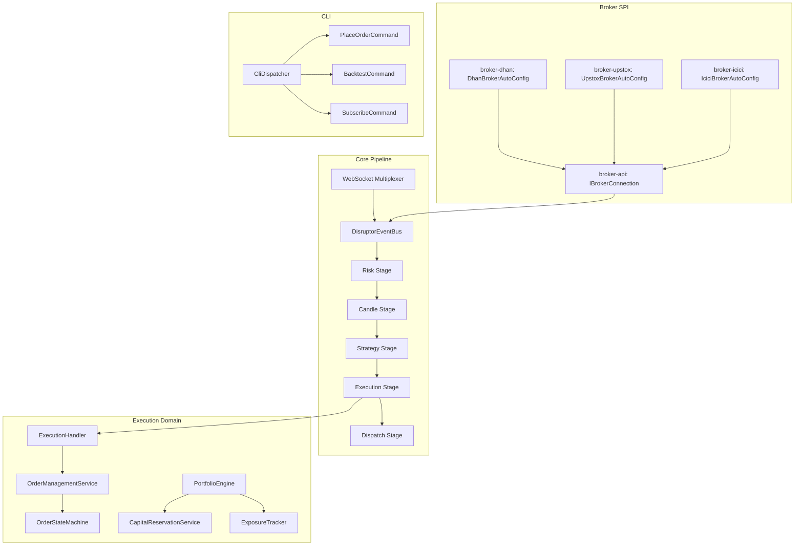

# Requirements

### Overview & Goals

Perform a full architectural remediation of the Trade-J platform, addressing every critical, high, and medium issue identified in the code review. The goal is to produce a production-safe, institutionally-grade algorithmic trading platform with zero data-correctness bugs, clean domain boundaries, and comprehensive end-to-end test coverage.

### Scope

**In Scope**
- Fix all **Critical** bugs (hardcoded exchange, memory leak, missing persistence atomicity, static order ID counter)
- Fix all **High Priority** issues (ISP violation on `IBrokerConnection`, God Class `CliOperations`, `PortfolioEngine` SRP, duplicate resilience, `@Scheduled` thread pool, field injection)
- Fix all **Medium Priority** issues (primitive obsession in `Order`, `OrderStateMachine` compound-read race, startup validation, distributed tracing/correlation ID propagation)
- Architectural improvements: Broker SPI via Spring auto-configuration, `DisruptorEventBus` decomposition, OMS crash-recovery
- End-to-end test coverage: unit, integration, backtest parity, replay isolation, live-safety

**Out of Scope**
- Frontend / UI changes
- New broker integrations (Zerodha, Angel, etc.)
- New trading strategies
- Infrastructure provisioning (Kubernetes, CI/CD pipelines)

### User Stories

- As a **live trader**, I want orders on BSE/F&O segments to route to the correct exchange so that I don't suffer silent rejections or wrong fills.
- As a **platform operator**, I want the system to fail fast on misconfiguration at startup so that I never discover a bad `accessToken` at the first order placement.
- As a **developer**, I want to add a new broker by creating one module with no changes to core so that broker additions are safe and isolated.
- As a **developer**, I want each CLI command in its own class so that I can test, extend, and review commands independently.
- As a **SRE**, I want correlation IDs propagated through every log line and HTTP header so that I can trace a signal from tick to fill across all services.
- As a **quant**, I want backtest and live trading to share the same execution path so that strategy results are reproducible in production.

# Technical Design

### Current Implementation

 File | Lines | Problem |
---|---|---|
 `cli/CliOperations.java` | 1228 | God Class — all CLI commands in one class |
 `broker/icici/adapter/IciciOrderCommandAdapter.java` | ~80 | Hardcoded `"NSE"` on `modifyOrder` and `cancelOrder` |
 `broker/icici/adapter/IciciOrderQueryAdapter.java` | ~60 | Hardcoded `"NSE"` on all query calls |
 `execution/ExecutionHandler.java` | 567 | Unbounded `tradeOpenedEmitted` set; static `orderIdCounter`; two `@Autowired` constructors |
 `broker/api/IBrokerConnection.java` | 77 | 14-method fat interface — ISP violation |
 `runtime/disruptor/DisruptorEventBus.java` | 494 | 12-param constructor; owns ring buffer + dedup + topology |
 `app/config/BrokerConfiguration.java` | 464 | 20+ `@Bean` methods all Dhan-specific; no SPI |
 `strategy/portfolio/PortfolioEngine.java` | 583 | Capital + exposure + P&L in one class |
 `broker/upstox/resilience/UpstoxResilienceExecutor.java` | ~80 | Duplicate of `broker-core/RetryExecutor` |
 `execution/reconcile/ReconciliationScheduler.java` | ~70 | Runs on Spring's default single-thread scheduler |
 `core/domain/oms/OrderStateMachine.java` | 204 | Per-method `synchronized` — compound-read race |
 `core/domain/model/Order.java` | 26 | `String symbol`, `String orderId` — primitive obsession |
 No `ApplicationRunner` startup validator | — | Credentials/config not validated before market data |
 No `@Transactional` anywhere | — | OMS event persistence not atomic |

### Key Decisions

1. **Broker SPI via Spring Auto-configuration** — each broker module provides its own `@Configuration` registered in `AutoConfiguration.imports`; the `app` module wires only `IBrokerConnection`. No `BrokerConfiguration.java` mega-class.
2. **Command Pattern for CLI** — each CLI command is a `@Component` implementing `CliCommand`; a `CliDispatcher` routes by name. `CliOperations` becomes a ≤50-line dispatcher.
3. **`IBrokerConnection` capability split** — core interface keeps 7 mandatory methods; optional capabilities (`BracketOrderCapable`, `GttOrderCapable`, `AlertCapable`) are discovered via the existing `getCapability()` pattern.
4. **Caffeine TTL cache for `tradeOpenedEmitted`** — replaces unbounded `ConcurrentHashMap.newKeySet()` with `maximumSize(10_000).expireAfterWrite(24h)`.
5. **Clock-based order IDs** — replace static `AtomicLong orderIdCounter` with `"ORD-" + clock.nowMs() + "-" + instanceCounter` injected via `TradingClock`.
6. **`PortfolioEngine` decomposition** — extract `CapitalReservationService` and `ExposureTracker`; `PortfolioEngine` becomes a thin coordinator.
7. **Explicit `TaskScheduler` beans** — `ReconciliationScheduler` and `DailyRiskResetScheduler` each get a named, sized `ThreadPoolTaskScheduler`.
8. **`Symbol` / `OrderId` value objects** — added to `core.domain.value` alongside existing `ExchangeSegment`, `OrderType`, etc.
9. **`BrokerStartupValidator`** — `ApplicationRunner` that validates credentials, instrument catalog, and `@ConfigurationProperties` with `@Validated` + JSR-303 before accepting market data.
10. **Micrometer Tracing (OTel)** — `correlationId` propagated as `X-Correlation-Id` HTTP header in `DhanAuthenticatedHttpClient` and `BreezeAuthenticatedHttpClient`; MDC enrichment already exists via `MdcHelper`.

### Proposed Changes

#### Phase 1 — Critical Bug Fixes

**CRIT-01: ICICI hardcoded exchange**
```java
// IciciOrderCommandAdapter.java — before
ObjectNode payload = mapper.toModifyOrderPayload(request, "NSE");

// After — add IciciExchangeSegmentMapper (mirrors DhanSegmentMapper)
String exchangeCode = exchangeSegmentMapper.toIciciCode(request.exchangeSegment());
ObjectNode payload = mapper.toModifyOrderPayload(request, exchangeCode);
```
Same fix applied to `IciciOrderQueryAdapter` (3 call sites).

**CRIT-03: Unbounded `tradeOpenedEmitted`**
```java
// ExecutionHandler.java — replace line 81
private final Cache<String, Boolean> tradeOpenedEmitted = Caffeine.newBuilder()
        .maximumSize(10_000)
        .expireAfterWrite(Duration.ofHours(24))
        .build();
```

**CRIT-04: OMS persistence atomicity**
- Add `@Transactional` to `OrderManagementService.onBrokerEvent()`
- Add `spring-boot-starter-data-jpa` (or confirm existing JPA dependency) to `trading-execution`
- Add startup recovery scan: on `ApplicationRunner`, replay `EventSourcedOrderRepository` to rebuild `OrderStateMachine` state, then reconcile with broker open orders

**MED-02: Static order ID counter**
```java
// ExecutionHandler.java — inject TradingClock
private final AtomicLong instanceCounter = new AtomicLong();
String generateOrderId() {
    return "ORD-" + clock.nowMs() + "-" + instanceCounter.incrementAndGet();
}
```

#### Phase 2 — Architecture & Maintainability

**CRIT-02: `CliOperations` decomposition**
```java
public interface CliCommand {
    String name();
    void execute(CliContext ctx) throws Exception;
}
// Each command: PlaceOrderCommand, SubscribeCommand, BacktestCommand, etc.
// CliDispatcher: discovers all CliCommand beans, routes by name
```

**HIGH-01: `IBrokerConnection` ISP**
```java
// Core (mandatory)
public interface IBrokerConnection extends AutoCloseable {
    MarketDataProvider marketData();
    OrderCommand orders();
    OrderQuery orderQuery();
    PortfolioProvider portfolio();
    InstrumentResolver instruments();
    WebSocketMultiplexer websocket();
    void connect(); void disconnect();
    <T> Optional<T> getCapability(Class<T> cap);
}
// Optional capability interfaces (discovered via getCapability)
public interface AdvancedOrderCapable { BracketOrderProvider bracketOrders(); GttOrderProvider gttOrders(); }
public interface AlertCapable { ConditionalAlertProvider alerts(); }
```

**HIGH-03: Broker SPI**
- Each broker module (`broker-dhan`, `broker-upstox`, `broker-icici`) provides its own `@Configuration` class
- Registered in `META-INF/spring/org.springframework.boot.autoconfigure.AutoConfiguration.imports`
- `app` module's `BrokerConfiguration.java` reduced to a thin `IBrokerConnection` selector bean

**HIGH-05: `PortfolioEngine` decomposition**
```java
public interface CapitalReservationService {
    ReservationResult reserve(SignalPendingExecution signal);
    void release(String signalId);
}
public interface ExposureTracker {
    long getNetExposurePaisa(String symbol);
    void onTradeOpened(TradeOpened event);
    void onTradeClosed(TradeClosed event);
}
// PortfolioEngine delegates to these; PnLLedger promoted from trading-simulation to core
```

**MED-01: Value Objects**
```java
// core/domain/value/
public record Symbol(String value) { /* validation */ }
public record OrderId(String value) { /* validation */ }
public record CorrelationId(String value) { /* validation */ }
// Order.java updated to use these
```

**MED-03: Explicit `TaskScheduler` beans**
```java
@Bean("reconciliationScheduler")
ThreadPoolTaskScheduler reconciliationTaskScheduler() {
    var s = new ThreadPoolTaskScheduler();
    s.setPoolSize(2);
    s.setThreadNamePrefix("reconciliation-");
    return s;
}
```

**MED-05: Delete `UpstoxResilienceExecutor`** — wire `RetryExecutor` from `broker-core` directly.

**MED-06: `OrderStateMachine` snapshot reads** — mandate callers use `toProjection()` only; deprecate individual `synchronized` accessors.

**MED-07: `BrokerStartupValidator`**
```java
@Component
public class BrokerStartupValidator implements ApplicationRunner {
    public void run(ApplicationArguments args) {
        // validate credentials, instrument catalog, required config
    }
}
```

**MED-08: Field injection → constructor injection** in `AdminController`, `MarketDataController`, `ScanConfiguration`, `PipelineConfiguration`, `DagPipelineRuntimeService`.

#### Phase 3 — Institutional Grade

- **Micrometer Tracing (OTel)**: propagate `correlationId` as `X-Correlation-Id` in all broker HTTP clients; add span propagation through Disruptor stages
- **WebSocket bulkhead**: bounded executor for WebSocket message processing callbacks in `DhanWebSocketMultiplexer` and `BreezeWebSocketMultiplexer`
- **`DisruptorEventBus` decomposition**: extract `DisruptorPipelineBuilder` and `DisruptorPipelineConfig` record; each stage handler independently constructable
- **OMS crash recovery**: on startup, replay `EventSourcedOrderRepository` → rebuild `OrderStateMachine` → reconcile with broker open orders
- **`@Validated` on `@ConfigurationProperties`**: add JSR-303 annotations to `TradingProperties` and all broker settings records

### Architecture Diagram



### File Structure

**New files:**
- `core/domain/value/Symbol.java`
- `core/domain/value/OrderId.java`
- `core/domain/value/CorrelationId.java`
- `broker/api/capability/AdvancedOrderCapable.java`
- `broker/api/capability/AlertCapable.java`
- `broker/api/capability/MarginCapable.java`
- `broker/icici/mapper/IciciExchangeSegmentMapper.java`
- `cli/CliCommand.java` (interface)
- `cli/CliContext.java` (record)
- `cli/CliDispatcher.java`
- `cli/command/PlaceOrderCommand.java`
- `cli/command/BacktestCommand.java`
- `cli/command/SubscribeCommand.java` (+ others)
- `app/startup/BrokerStartupValidator.java`
- `trading/strategy/portfolio/CapitalReservationService.java`
- `trading/strategy/portfolio/ExposureTracker.java`
- `app/config/ReconciliationSchedulerConfig.java`

**Modified files:**
- `broker/icici/adapter/IciciOrderCommandAdapter.java` — remove hardcoded `"NSE"`
- `broker/icici/adapter/IciciOrderQueryAdapter.java` — remove hardcoded `"NSE"`
- `execution/service/ExecutionHandler.java` — Caffeine cache, clock-based IDs, single `@Autowired` constructor
- `execution/service/OrderManagementService.java` — add `@Transactional`
- `broker/api/IBrokerConnection.java` — slim to 7 mandatory methods
- `strategy/portfolio/PortfolioEngine.java` — delegate to `CapitalReservationService` + `ExposureTracker`
- `core/domain/model/Order.java` — use `Symbol`, `OrderId`, `CorrelationId` value objects
- `app/config/BrokerConfiguration.java` — reduce to thin selector
- `app/admin/AdminController.java` — constructor injection
- `app/api/MarketDataController.java` — constructor injection
- `app/config/ScanConfiguration.java` — constructor injection

**Deleted files:**
- `broker/upstox/resilience/UpstoxResilienceExecutor.java`

# Testing

### Validation Approach

Each fix is validated by a targeted test. End-to-end parity is validated by running the existing backtest/replay test suite after all changes, plus new integration tests for the critical paths.

### Key Scenarios

 Scenario | Test Type | Location |
---|---|---|
 ICICI BSE order routes to BSE exchange code | Unit | `IciciOrderCommandAdapterTest` |
 ICICI F&O order routes to NFO exchange code | Unit | `IciciOrderCommandAdapterTest` |
 `tradeOpenedEmitted` evicts after 24h / 10K entries | Unit | `ExecutionHandlerTest` |
 Order IDs are unique across replay runs (no static counter bleed) | Unit | `ExecutionHandlerTest` |
 `OrderManagementService.onBrokerEvent` is atomic (persist + transition) | Integration | `OrderManagementServiceIntegrationTest` |
 `CliDispatcher` routes each command to correct `CliCommand` bean | Unit | `CliDispatcherTest` |
 `BrokerStartupValidator` fails fast on missing `accessToken` | Unit | `BrokerStartupValidatorTest` |
 `PortfolioEngine` capital reservation and exposure tracking are independent | Unit | `CapitalReservationServiceTest`, `ExposureTrackerTest` |
 `OrderStateMachine.toProjection()` returns consistent snapshot under concurrent fills | Concurrency | `OrderStateMachineTest` |
 `ReconciliationScheduler` and `DailyRiskResetScheduler` run on separate thread pools | Integration | `SchedulerConfigTest` |
 Backtest run produces same P&L as live replay for same strategy | Parity | `BacktestLiveParityTest` (existing) |
 `UpstoxResilienceExecutor` deleted — Upstox broker still retries correctly via `RetryExecutor` | Integration | `UpstoxBrokerConnectionTest` |
 New broker added via SPI without modifying `app` module | Architecture | `ArchitectureTest` (ArchUnit) |

### Edge Cases

- ICICI order with `null` `exchangeSegment` → `IciciExchangeSegmentMapper` throws `IllegalArgumentException` with clear message
- `tradeOpenedEmitted` Caffeine cache under 10K concurrent order IDs — no eviction of live orders
- OMS crash mid-persist: on restart, `EventSourcedOrderRepository` replay rebuilds correct `OrderStateMachine` state
- `CliDispatcher` receives unknown command name → prints help and exits cleanly
- `BrokerStartupValidator` with valid credentials but missing instrument catalog → specific error message

### Test Changes

- **Add** `IciciExchangeSegmentMapperTest` — covers NSE, BSE, NFO, BFO, CDS segments
- **Add** `BrokerStartupValidatorTest` — mocks `IBrokerConnection`, asserts fail-fast behavior
- **Add** `CliDispatcherTest` — verifies command routing and unknown-command handling
- **Add** `CapitalReservationServiceTest` and `ExposureTrackerTest`
- **Update** `ExecutionHandlerTest` — replace `ConcurrentHashMap` assertions with Caffeine cache assertions; add order ID uniqueness across instances
- **Update** `OrderManagementServiceIntegrationTest` — add crash-recovery scenario
- **Update** `ArchitectureTest` — add rule: no class in `app` module may import broker-specific implementation classes directly

# Delivery Steps

###   Step 1: Fix Critical Bugs (ICICI exchange, memory leak, static order ID, OMS atomicity)
All four critical production bugs are eliminated and covered by targeted unit/integration tests.

- **CRIT-01**: Add `IciciExchangeSegmentMapper` to `broker/icici/mapper/`; wire it into `IciciOrderCommandAdapter` and `IciciOrderQueryAdapter`; remove all 5 hardcoded `"NSE"` literals; add `IciciExchangeSegmentMapperTest` covering NSE, BSE, NFO, BFO, CDS
- **CRIT-03**: Replace `ConcurrentHashMap.newKeySet()` with a Caffeine `Cache<String, Boolean>` (maximumSize=10_000, expireAfterWrite=24h) in `ExecutionHandler.tradeOpenedEmitted`; update `ExecutionHandlerTest`
- **MED-02**: Remove `static final AtomicLong orderIdCounter` from `ExecutionHandler`; inject `TradingClock`; generate IDs as `"ORD-" + clock.nowMs() + "-" + instanceCounter.incrementAndGet()`; add replay-isolation test
- **CRIT-04**: Add `@Transactional` to `OrderManagementService.onBrokerEvent()`; add startup recovery scan in a new `OmsRecoveryRunner implements ApplicationRunner` that replays `EventSourcedOrderRepository` and reconciles with broker open orders; add `OrderManagementServiceIntegrationTest` crash-recovery scenario

###   Step 2: Decompose CliOperations God Class into Command Pattern
CliOperations.java (1228 lines) is replaced by a dispatcher and focused per-command classes, each independently testable.

- Add `CliCommand` interface (`name()`, `execute(CliContext)`) and `CliContext` record to `cli` module
- Add `CliDispatcher` that discovers all `CliCommand` beans and routes by name; prints help on unknown command
- Extract each logical command group into its own `@Component`: `PlaceOrderCommand`, `SubscribeCommand`, `BacktestCommand`, `ReplayCommand`, `PositionQueryCommand`, `HistoricalIngestCommand`, `BrokerConnectCommand` (and others as needed)
- Reduce `CliOperations.java` to ≤50 lines (thin entry point delegating to `CliDispatcher`)
- Add `CliDispatcherTest` verifying routing and unknown-command handling; add smoke tests for each command class

###   Step 3: Fix IBrokerConnection ISP, field injection, and PortfolioEngine SRP
Three high-priority architectural violations are resolved, improving testability and reducing lock contention.

- **HIGH-01**: Slim `IBrokerConnection` to 7 mandatory methods; move `bracketOrders()`, `gttOrders()`, `sliceOrders()`, `alerts()`, `margin()`, `sessionRisk()`, `futures()`, `options()` behind new capability interfaces (`AdvancedOrderCapable`, `AlertCapable`, `MarginCapable`, `FuturesCapable`, `OptionsCapable`) in `broker/api/capability/`; update all broker implementations to implement relevant capability interfaces and return them via `getCapability()`
- **MED-08**: Convert `AdminController`, `MarketDataController`, `ScanConfiguration`, `PipelineConfiguration`, `DagPipelineRuntimeService` from field injection to constructor injection; remove all `@Autowired` field annotations
- **HIGH-05**: Extract `CapitalReservationService` and `ExposureTracker` interfaces + implementations from `PortfolioEngine`; promote `PnLLedger` from `trading-simulation` to `core`; `PortfolioEngine` becomes a thin coordinator; add `CapitalReservationServiceTest` and `ExposureTrackerTest`

###   Step 4: Introduce value objects, startup validator, and fix scheduler thread pools
Primitive obsession is eliminated, misconfiguration is caught at startup, and scheduler contention is resolved.

- **MED-01**: Add `Symbol`, `OrderId`, `CorrelationId` records to `core/domain/value/`; update `Order`, `OrderRequest`, `Trade` to use them; update all call sites across `execution`, `strategy`, `broker` modules
- **MED-07**: Add `BrokerStartupValidator implements ApplicationRunner` in `app/startup/`; validates broker credentials, instrument catalog presence, and required `@ConfigurationProperties`; add `@Validated` + JSR-303 annotations to `TradingProperties` and broker settings records; add `BrokerStartupValidatorTest`
- **MED-03**: Add `ReconciliationSchedulerConfig` in `app/config/` defining named `ThreadPoolTaskScheduler` beans for `ReconciliationScheduler` (pool=2) and `DailyRiskResetScheduler` (pool=1); wire via `@Qualifier`
- **MED-05**: Delete `UpstoxResilienceExecutor`; wire `RetryExecutor` from `broker-core` directly into `UpstoxBrokerConnection`; add `UpstoxBrokerConnectionTest` verifying retry behavior

###   Step 5: Broker SPI auto-configuration, OMS compound-read fix, and correlation ID tracing
The platform reaches institutional-grade quality: brokers are self-registering, OMS reads are race-free, and every log line and HTTP call carries a correlation ID.

- **HIGH-03**: Move Dhan-specific beans from `BrokerConfiguration.java` into `broker-dhan/src/main/java/.../DhanBrokerAutoConfiguration.java`; register in `META-INF/spring/org.springframework.boot.autoconfigure.AutoConfiguration.imports`; do the same for `broker-upstox` and `broker-icici`; reduce `app/config/BrokerConfiguration.java` to a thin `IBrokerConnection` selector bean (~30 lines)
- **MED-06**: Deprecate individual `synchronized` accessors on `OrderStateMachine` (`currentStatus()`, `filledQuantity()`, `averagePricePaisa()`); mandate all callers use `toProjection()` for consistent snapshots; update all call sites in `ExecutionHandler`, `OrderManagementService`, `OrderReconciler`; add concurrency test
- **Distributed tracing**: Add Micrometer Tracing (OTel) dependency to `app`; propagate `correlationId` as `X-Correlation-Id` HTTP header in `DhanAuthenticatedHttpClient` and `BreezeAuthenticatedHttpClient`; add WebSocket bulkhead (bounded `ExecutorService`) in `DhanWebSocketMultiplexer` and `BreezeWebSocketMultiplexer`
- **ArchUnit rule**: Add rule to `ArchitectureTest` that no class in `app` module imports broker-specific implementation classes directly
- **End-to-end validation**: Run full backtest parity test suite (`BacktestLiveParityTest`), replay isolation tests, and architecture tests to confirm all changes are consistent