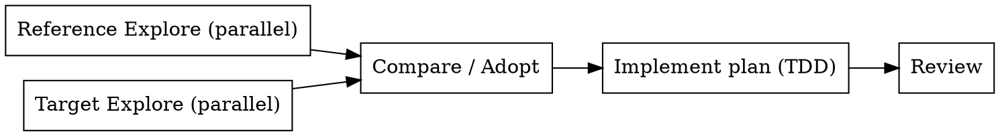

# Broker/Module Port Workflow

Compare a reference module/package against a target project, produce a concrete port plan, and implement it. The pattern: dispatch two parallel read-only Explore agents (one per codebase) + one Compare/Adoption agent that produces the port plan, then implement task-by-task.

## When to Use

- User says "refer [X] and create same structure" / "port [X] to [Y]" / "adopt [X] architecture in [Y]"
- A reference project has a clean module layout (broker, package, layer) the target project lacks
- The work is multi-file, structural, and testable
- You would otherwise write 3 long agent prompts and stitch the results together

**Don't use for:** single-file copy-paste, one-off code lookups, or comparing libraries (use `find-skills` or docs).

## The 3-Agent Pattern



The first two run in parallel (independent context). The third depends on both. Implementation is sequential and gated on review.

## Agent Prompt Templates

All three agents are `explore` subagents with `isolation: worktree` so they read without mutating.

### 1. Reference Explore

```
Explore <REFERENCE_PATH> (reference project). Read-only.
Focus on:
- Repository structure (top-level + key subdirectories)
- Package files (pom.xml / build.gradle / pyproject.toml / package.json)
- <DOMAIN>-related modules/classes/functions (e.g. "Dhan broker")
- Architectural patterns: routing/controllers/services/repositories/config/env/logging/errors/tests
- What appears adopted/implemented vs. pending/TBD

Return concise findings with file paths. Do not modify files.
```

### 2. Target Explore

```
Explore <TARGET_PATH> (target project). Read-only.
Focus on:
- Current structure and tech stack
- Existing <DOMAIN> code/tests/imports (what's already there, what's missing)
- Tests/import compatibility constraints (what would break if you added new packages)
- Risks when introducing a new <DOMAIN> package directory
- Where a ported structure should land to respect current project organization

Return concise findings with file paths. Do not modify files.
```

### 3. Compare / Adopt

```
Read-only compare <REFERENCE_PATH> (reference) vs <TARGET_PATH> (target) for <DOMAIN>.
Identify:
- Adopted in target (already present)
- Reference-only (not yet in target — candidates to port)
- Pending (partially in target)
- Should-correct-or-improve (in target but wrong/incomplete)

Produce a port plan as numbered tasks. Each task: file paths to create/modify, what to copy/adapt, which tests to add or update, any breaking-change notes.

Do not modify files.
```

## Implementation Phase

The Compare agent's output IS the plan. Run it through `compose:plan` (or convert to a plan file at `docs/compose/plans/YYYY-MM-DD-<feature>.md`), then dispatch via `compose:subagent` for TDD-driven implementation with two-stage review.

## Example (Trade_J — actual use)

Reference: `/Users/apple/Downloads/Trade_J/broker` (Java multi-module)
Target: `/Users/apple/Downloads/Trade_XV2` (Python package with single-file broker)
Domain: Dhan broker integration

Observed in 26 agent spawns across 3 sessions (May–June 2026). Same three prompts, same shape, every time the user asked "refer [X] and create same structure". This skill packages that exact workflow so future sessions don't rewrite the prompts.

## Red Flags

- Don't skip the Target Explore — porting without knowing existing imports/tests causes silent breakage
- Don't let Explore agents modify files (the whole point is read-only separation)
- Don't dispatch the three agents sequentially in the same context — run the first two in parallel, the third after both finish
- Don't implement before the Compare agent returns a structured task list — ad-hoc edits skip the test surface
- If the two projects use different languages/frameworks, the Compare agent must call out the translation (e.g. "Java `BrokerGateway` → Python `broker/dhan/gateway.py`")
