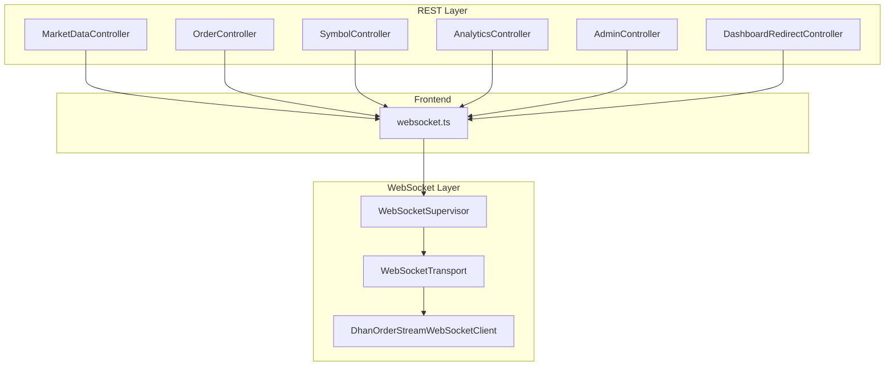
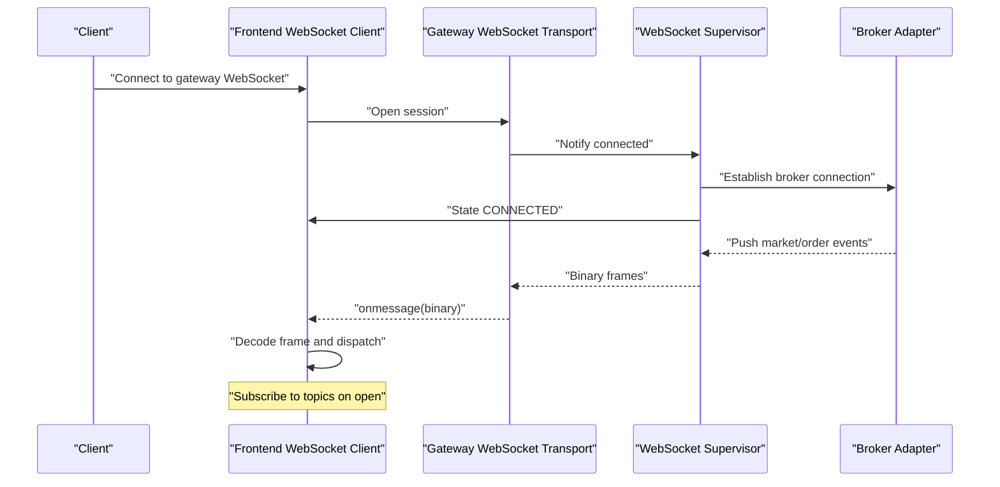
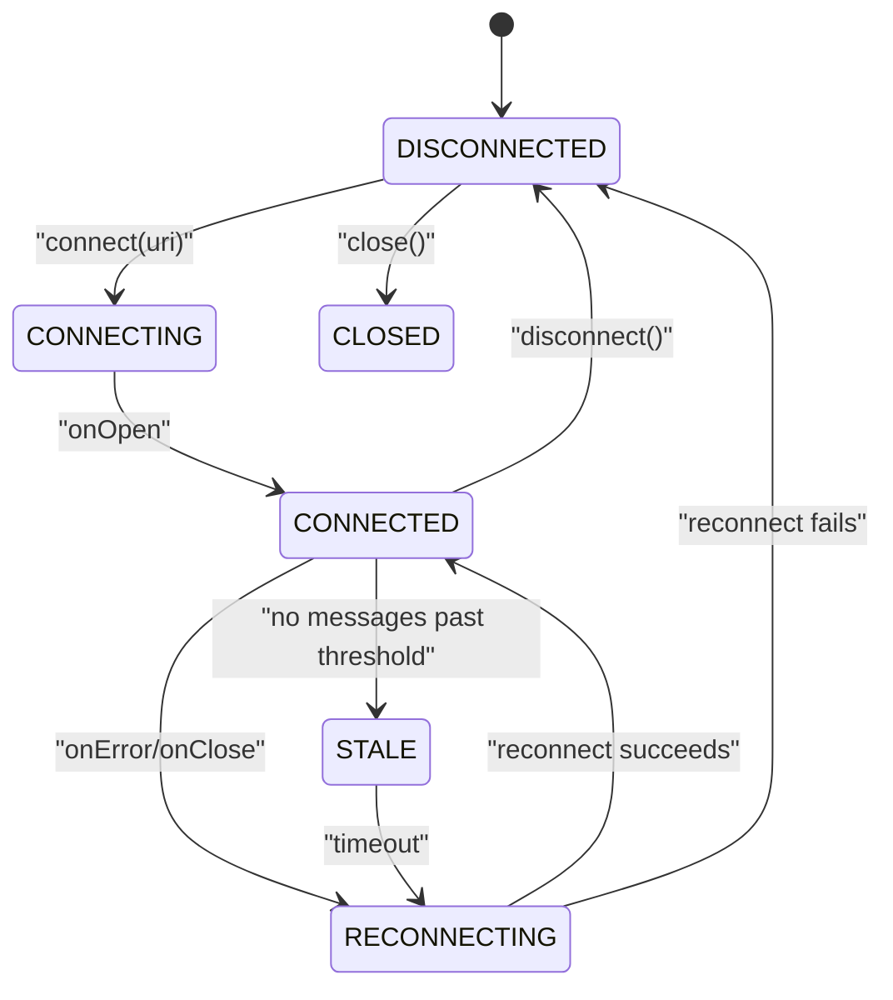
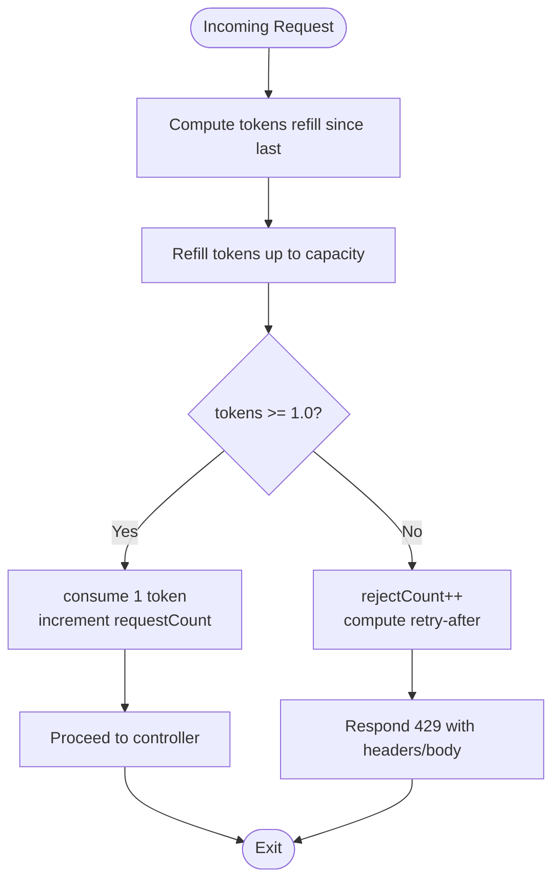
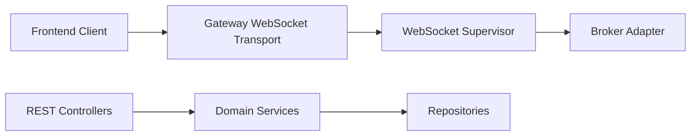

# API Reference

<cite>
**Referenced Files in This Document**
- [openapi.yaml](file://docs/openapi.yaml)
- [ARCHITECTURE_REPORT.md](file://docs/ARCHITECTURE_REPORT.md)
- [WebSocketSupervisor.java](file://broker/api/src/main/java/com/tradej/broker/api/websocket/WebSocketSupervisor.java)
- [WebSocketTransport.java](file://gateway/src/main/java/com/tradej/gateway/transport/WebSocketTransport.java)
- [DhanOrderStreamWebSocketClient.java](file://broker/dhan/src/main/java/com/tradej/broker/dhan/websocket/DhanOrderStreamWebSocketClient.java)
- [websocket.ts](file://docs/archive/frontend/src/api/websocket.ts)
- [RateLimitFilter.java](file://app/src/main/java/com/tradej/app/config/RateLimitFilter.java)
- [TokenSource.java](file://broker/api/src/main/java/com/tradej/broker/api/auth/TokenSource.java)
- [TokenStateTest.java](file://broker/api/src/test/java/com/tradej/broker/api/auth/TokenStateTest.java)
- [MarketDataController.java](file://app/src/main/java/com/tradej/app/api/MarketDataController.java)
- [OrderController.java](file://app/src/main/java/com/tradej/app/api/OrderController.java)
- [SymbolController.java](file://app/src/main/java/com/tradej/app/api/SymbolController.java)
- [AnalyticsController.java](file://app/src/main/java/com/tradej/app/api/AnalyticsController.java)
- [AdminController.java](file://app/src/main/java/com/tradej/app/admin/AdminController.java)
- [DashboardRedirectController.java](file://app/src/main/java/com/tradej/app/admin/DashboardRedirectController.java)
</cite>

## Table of Contents
1. [Introduction](#introduction)
2. [Project Structure](#project-structure)
3. [Core Components](#core-components)
4. [Architecture Overview](#architecture-overview)
5. [Detailed Component Analysis](#detailed-component-analysis)
6. [Dependency Analysis](#dependency-analysis)
7. [Performance Considerations](#performance-considerations)
8. [Troubleshooting Guide](#troubleshooting-guide)
9. [Conclusion](#conclusion)
10. [Appendices](#appendices)

## Introduction
This document provides comprehensive API documentation for the Trade-J platform. It covers REST APIs exposed by the backend application and WebSocket APIs used for real-time market data and order updates. The documentation includes HTTP method and URL pattern summaries, request/response considerations, authentication mechanisms, rate limiting, error handling, security considerations, and practical guidance for clients implementing against the platform.

## Project Structure
The Trade-J platform exposes REST endpoints via Spring MVC controllers and real-time streams via WebSocket connections. The OpenAPI specification enumerates the REST endpoints, while the broker and gateway modules define WebSocket contracts and transports.

**Diagram sources**
- [MarketDataController.java](file://app/src/main/java/com/tradej/app/api/MarketDataController.java)
- [OrderController.java](file://app/src/main/java/com/tradej/app/api/OrderController.java)
- [SymbolController.java](file://app/src/main/java/com/tradej/app/api/SymbolController.java)
- [AnalyticsController.java](file://app/src/main/java/com/tradej/app/api/AnalyticsController.java)
- [AdminController.java](file://app/src/main/java/com/tradej/app/admin/AdminController.java)
- [DashboardRedirectController.java](file://app/src/main/java/com/tradej/app/admin/DashboardRedirectController.java)
- [WebSocketSupervisor.java](file://broker/api/src/main/java/com/tradej/broker/api/websocket/WebSocketSupervisor.java)
- [WebSocketTransport.java](file://gateway/src/main/java/com/tradej/gateway/transport/WebSocketTransport.java)
- [DhanOrderStreamWebSocketClient.java](file://broker/dhan/src/main/java/com/tradej/broker/dhan/websocket/DhanOrderStreamWebSocketClient.java)
- [websocket.ts](file://docs/archive/frontend/src/api/websocket.ts)

**Section sources**
- [ARCHITECTURE_REPORT.md:1653-1671](file://docs/ARCHITECTURE_REPORT.md#L1653-L1671)
- [openapi.yaml:1207-1251](file://docs/openapi.yaml#L1207-L1251)

## Core Components
- REST Controllers: MarketData, Orders, Symbols, Analytics, Admin, and Redirect controllers expose HTTP endpoints for market data queries, order placement/modification/cancellation, symbol discovery, federated analytics, administrative operations, and console redirection.
- WebSocket Supervisor: Defines connection lifecycle, heartbeats, reconnection, and staleness detection for broker adapters.
- WebSocket Transport: Transport-agnostic abstraction for sending binary frames and managing sessions.
- Frontend WebSocket Client: Implements connection, subscription, message decoding, and reconnection logic.

**Section sources**
- [ARCHITECTURE_REPORT.md:1653-1671](file://docs/ARCHITECTURE_REPORT.md#L1653-L1671)
- [WebSocketSupervisor.java:18-67](file://broker/api/src/main/java/com/tradej/broker/api/websocket/WebSocketSupervisor.java#L18-L67)
- [WebSocketTransport.java:7-20](file://gateway/src/main/java/com/tradej/gateway/transport/WebSocketTransport.java#L7-L20)
- [websocket.ts:77-146](file://docs/archive/frontend/src/api/websocket.ts#L77-L146)

## Architecture Overview
The REST API layer serves HTTP endpoints defined in controllers. Real-time data is delivered via WebSocket connections managed by a supervisor and transported through a transport abstraction. The frontend connects to the gateway WebSocket and subscribes to topics.

**Diagram sources**
- [WebSocketSupervisor.java:18-67](file://broker/api/src/main/java/com/tradej/broker/api/websocket/WebSocketSupervisor.java#L18-L67)
- [WebSocketTransport.java:7-20](file://gateway/src/main/java/com/tradej/gateway/transport/WebSocketTransport.java#L7-L20)
- [DhanOrderStreamWebSocketClient.java:147-175](file://broker/dhan/src/main/java/com/tradej/broker/dhan/websocket/DhanOrderStreamWebSocketClient.java#L147-L175)
- [websocket.ts:77-146](file://docs/archive/frontend/src/api/websocket.ts#L77-L146)

## Detailed Component Analysis

### REST API Endpoints
The REST endpoints are documented in the OpenAPI specification and summarized below. For precise HTTP methods, URL patterns, and response schemas, refer to the OpenAPI document.

- Actuator endpoints
  - GET /actuator/health: Health status (liveness + readiness)
  - GET /actuator/info: Application info
  - GET /actuator/prometheus: Prometheus metrics

- Dashboard redirects
  - GET /: Redirects to console SPA
  - GET /console: Redirects to console SPA

- Controllers and typical endpoints
  - MarketDataController: LTP and historical candles
  - OrderController: Place, modify, cancel, and query orders
  - SymbolController: Symbol search and tabs
  - AnalyticsController: Federated analytics SQL
  - AdminController: Runtime and historical admin APIs
  - HistoricalDownloadController: Historical download jobs
  - DashboardRedirectController: Root and console redirects

Note: The OpenAPI specification enumerates the exact routes, methods, and response schemas. Use the OpenAPI document for authoritative definitions.

**Section sources**
- [openapi.yaml:1207-1251](file://docs/openapi.yaml#L1207-L1251)
- [ARCHITECTURE_REPORT.md:1653-1671](file://docs/ARCHITECTURE_REPORT.md#L1653-L1671)

### WebSocket API
- Connection lifecycle
  - States: DISCONNECTED → CONNECTING → CONNECTED | CONNECTED → (error/close) → RECONNECTING | DISCONNECTED | CONNECTED → (no messages) → STALE → RECONNECTING | DISCONNECTED
  - Operations: connect(uri), disconnect(), sendHeartbeat(), onMessage(ByteBuffer), onClose(int, String), onError(Throwable)
  - Observability: lastMessageTimestampMs(), stalenessThresholdMs(), addStateListener(listener)

- Transport abstraction
  - Methods: sendBinary(byte[]), isOpen(), id(), close()

- Client behavior
  - Frontend opens WebSocket, sends a subscription message upon open, decodes binary frames, and handles text messages from the gateway.

**Diagram sources**
- [WebSocketSupervisor.java:21-28](file://broker/api/src/main/java/com/tradej/broker/api/websocket/WebSocketSupervisor.java#L21-L28)

**Section sources**
- [WebSocketSupervisor.java:18-67](file://broker/api/src/main/java/com/tradej/broker/api/websocket/WebSocketSupervisor.java#L18-L67)
- [WebSocketTransport.java:7-20](file://gateway/src/main/java/com/tradej/gateway/transport/WebSocketTransport.java#L7-L20)
- [DhanOrderStreamWebSocketClient.java:147-175](file://broker/dhan/src/main/java/com/tradej/broker/dhan/websocket/DhanOrderStreamWebSocketClient.java#L147-L175)
- [websocket.ts:77-146](file://docs/archive/frontend/src/api/websocket.ts#L77-L146)

### Authentication and Security
- Token sources
  - STATIC: Pre-configured static token, no refresh mechanism
  - TOTP: Generated via TOTP (Dhan)
  - OAUTH: Authorization Code Grant with PKCE (Upstox)
  - INTERACTIVE: Token obtained from an interactive login flow

- Token refresh behavior
  - Tests demonstrate refresh recommendation thresholds based on token lifespan and buffer windows.

- Security considerations
  - Use HTTPS for REST endpoints and WSS for WebSocket connections.
  - Implement proper token storage and rotation according to the selected TokenSource.
  - Validate and sanitize all incoming requests and messages.

**Section sources**
- [TokenSource.java:6-15](file://broker/api/src/main/java/com/tradej/broker/api/auth/TokenSource.java#L6-L15)
- [TokenStateTest.java:9-30](file://broker/api/src/test/java/com/tradej/broker/api/auth/TokenStateTest.java#L9-L30)

### Rate Limiting
- Applies per-endpoint token-bucket with burst allowance.
- Default: 30 requests/second (burst 60).
- Specialized limits:
  - Symbols endpoint: 10 requests/second (burst 20)
  - Analytics SQL: 2 requests/second (burst 5)
  - Admin/summary endpoint: 5 requests/second (burst 10)
- On throttle:
  - Returns 429 Too Many Requests
  - Headers: Retry-After, X-RateLimit-Limit, X-RateLimit-Remaining, X-RateLimit-Reset
  - JSON body with error details

**Diagram sources**
- [RateLimitFilter.java:60-103](file://app/src/main/java/com/tradej/app/config/RateLimitFilter.java#L60-L103)

**Section sources**
- [RateLimitFilter.java:22-165](file://app/src/main/java/com/tradej/app/config/RateLimitFilter.java#L22-L165)

### Versioning
- No explicit API versioning scheme is evident in the analyzed files. Clients should pin to specific routes and handle backward compatibility carefully. Monitor future changes in the OpenAPI specification for versioning updates.

[No sources needed since this section provides general guidance]

### Common Use Cases and Client Implementation Guidelines
- REST
  - Retrieve market data: Use MarketDataController endpoints for LTP and historical candles.
  - Manage orders: Use OrderController endpoints for placing, modifying, and canceling orders.
  - Search symbols: Use SymbolController endpoints for symbol discovery and tabs.
  - Federated analytics: Use AnalyticsController endpoints for SQL queries.
  - Administrative tasks: Use AdminController endpoints for runtime and historical operations.
  - Redirects: Use DashboardRedirectController endpoints for console SPA navigation.

- WebSocket
  - Connect to gateway WebSocket and send a subscription message on open.
  - Decode binary frames and route messages to handlers.
  - Handle text messages from the gateway for errors or informational payloads.
  - Implement reconnection logic with exponential backoff.

**Section sources**
- [ARCHITECTURE_REPORT.md:1653-1671](file://docs/ARCHITECTURE_REPORT.md#L1653-L1671)
- [websocket.ts:77-146](file://docs/archive/frontend/src/api/websocket.ts#L77-L146)

### Debugging Tools and Monitoring
- REST
  - Use actuator endpoints for health, info, and Prometheus metrics scraping.
  - Observe rate limiting metrics via the filter’s metrics map.

- WebSocket
  - Monitor state transitions and staleness thresholds via the WebSocket supervisor.
  - Log gateway text messages and decode errors for diagnostics.
  - Track reconnect attempts and intentional close flags.

**Section sources**
- [openapi.yaml:1207-1251](file://docs/openapi.yaml#L1207-L1251)
- [RateLimitFilter.java:160-165](file://app/src/main/java/com/tradej/app/config/RateLimitFilter.java#L160-L165)
- [WebSocketSupervisor.java:51-55](file://broker/api/src/main/java/com/tradej/broker/api/websocket/WebSocketSupervisor.java#L51-L55)
- [websocket.ts:121-128](file://docs/archive/frontend/src/api/websocket.ts#L121-L128)

## Dependency Analysis
The REST controllers depend on domain services and repositories. The WebSocket layer depends on the broker adapters and transport abstractions. The frontend depends on the gateway WebSocket transport.

**Diagram sources**
- [WebSocketSupervisor.java:18-67](file://broker/api/src/main/java/com/tradej/broker/api/websocket/WebSocketSupervisor.java#L18-L67)
- [WebSocketTransport.java:7-20](file://gateway/src/main/java/com/tradej/gateway/transport/WebSocketTransport.java#L7-L20)
- [DhanOrderStreamWebSocketClient.java:147-175](file://broker/dhan/src/main/java/com/tradej/broker/dhan/websocket/DhanOrderStreamWebSocketClient.java#L147-L175)

**Section sources**
- [ARCHITECTURE_REPORT.md:1653-1671](file://docs/ARCHITECTURE_REPORT.md#L1653-L1671)

## Performance Considerations
- REST
  - Respect rate limits; batch requests where possible.
  - Use efficient query parameters and pagination for analytics and historical endpoints.
  - Cache responses on the client side when appropriate.

- WebSocket
  - Implement heartbeats and detect staleness to maintain connectivity.
  - Use binary frames for compactness and lower overhead.
  - Back off reconnection attempts to avoid thundering herd.

[No sources needed since this section provides general guidance]

## Troubleshooting Guide
- REST 429 responses
  - Inspect Retry-After and X-RateLimit-* headers.
  - Reduce request frequency or increase burst capacity if applicable.

- WebSocket connection issues
  - Verify state transitions and staleness thresholds.
  - Ensure subscription message is sent after open.
  - Log decode errors and gateway text messages for diagnostics.

- Authentication problems
  - Confirm token source and refresh policy.
  - Validate token lifespan and buffer windows.

**Section sources**
- [RateLimitFilter.java:137-155](file://app/src/main/java/com/tradej/app/config/RateLimitFilter.java#L137-L155)
- [WebSocketSupervisor.java:51-55](file://broker/api/src/main/java/com/tradej/broker/api/websocket/WebSocketSupervisor.java#L51-L55)
- [websocket.ts:93-118](file://docs/archive/frontend/src/api/websocket.ts#L93-L118)
- [TokenStateTest.java:9-30](file://broker/api/src/test/java/com/tradej/broker/api/auth/TokenStateTest.java#L9-L30)

## Conclusion
Trade-J provides a REST API surface for market data, order management, symbol discovery, analytics, and administration, along with a robust WebSocket layer for real-time updates. Clients should adhere to rate limits, implement resilient reconnection logic, and follow security best practices for authentication and transport encryption.

[No sources needed since this section summarizes without analyzing specific files]

## Appendices
- Protocol-specific examples
  - REST: Use the OpenAPI specification for exact request/response schemas and headers.
  - WebSocket: Subscribe to topics on open and decode binary frames as implemented in the frontend client.

- Error handling strategies
  - REST: Handle 429 responses with retries and backoff.
  - WebSocket: Detect close/error events and trigger reconnection with jitter.

- Monitoring approaches
  - REST: Scrape Prometheus metrics and monitor actuator endpoints.
  - WebSocket: Track state transitions, last message timestamps, and reconnect attempts.

**Section sources**
- [openapi.yaml:1207-1251](file://docs/openapi.yaml#L1207-L1251)
- [RateLimitFilter.java:160-165](file://app/src/main/java/com/tradej/app/config/RateLimitFilter.java#L160-L165)
- [WebSocketSupervisor.java:51-55](file://broker/api/src/main/java/com/tradej/broker/api/websocket/WebSocketSupervisor.java#L51-L55)
- [websocket.ts:121-128](file://docs/archive/frontend/src/api/websocket.ts#L121-L128)