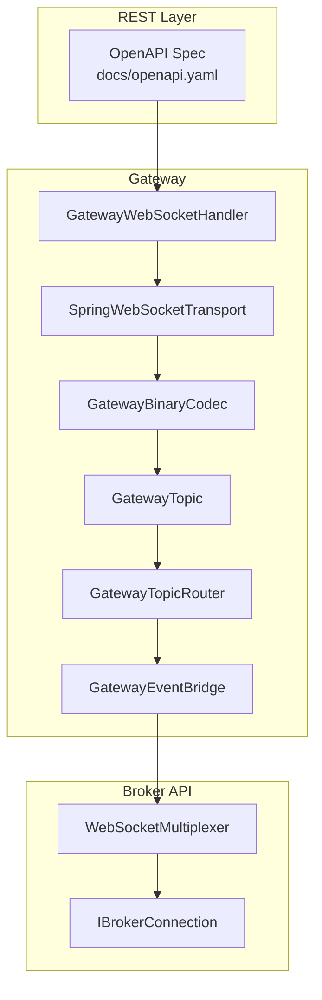
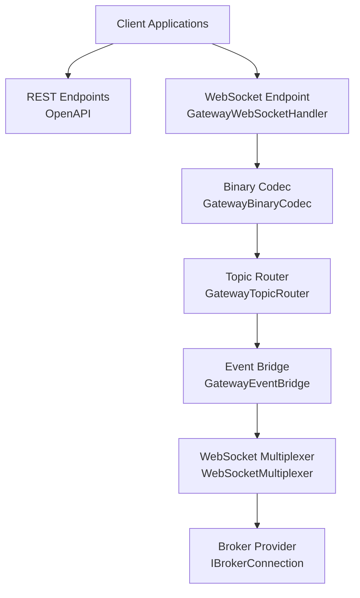
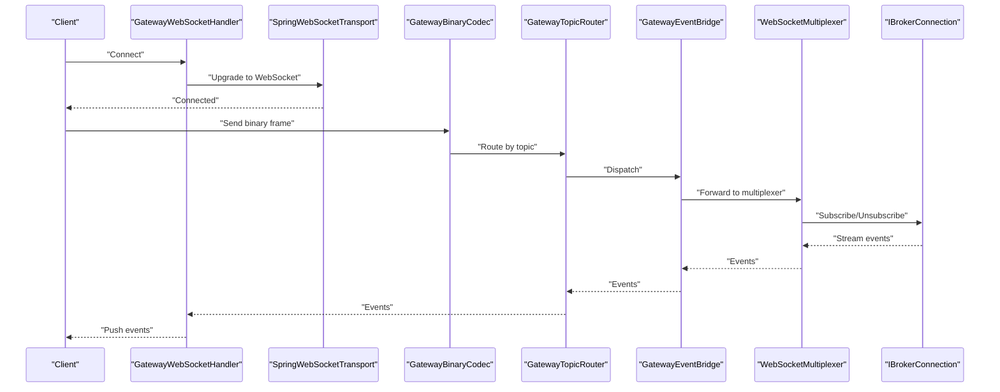

# API Reference

<cite>
**Referenced Files in This Document**
- [openapi.yaml](file://docs/openapi.yaml)
- [API_DOCUMENTATION.md](file://docs/API_DOCUMENTATION.md)
- [websocket.json](file://CertificationArtifacts/dhan/capabilities/websocket.json)
- [websocket-test-2026-06-08T05:34:13Z.json](file://CertificationArtifacts/websocket-test-2026-06-08T05:34:13Z.json)
- [websocket-test-2026-06-08T05:38:11Z.json](file://CertificationArtifacts/websocket-test-2026-06-08T05:38:11Z.json)
- [websocket-test-2026-06-08T06:21:46Z.json](file://CertificationArtifacts/websocket-test-2026-06-08T06:21:46Z.json)
- [websocket-test-2026-06-08T06:23:19Z.json](file://CertificationArtifacts/websocket-test-2026-06-08T06:23:19Z.json)
- [websocket-test-2026-06-08T06:26:03Z.json](file://CertificationArtifacts/websocket-test-2026-06-08T06:26:03Z.json)
- [WebSocketMultiplexer.java](file://broker/api/src/main/java/com/tradej/broker/api/port/WebSocketMultiplexer.java)
- [GatewayWebSocketHandler.java](file://gateway/src/main/java/com/tradej/gateway/websocket/GatewayWebSocketHandler.java)
- [SpringWebSocketTransport.java](file://gateway/src/main/java/com/tradej/gateway/transport/SpringWebSocketTransport.java)
- [GatewayBinaryCodec.java](file://gateway/src/main/java/com/tradej/gateway/protocol/GatewayBinaryCodec.java)
- [GatewayTopic.java](file://gateway/src/main/java/com/tradej/gateway/protocol/GatewayTopic.java)
- [GatewayTopicRouter.java](file://gateway/src/main/java/com/tradej/gateway/router/GatewayTopicRouter.java)
- [GatewayEventBridge.java](file://gateway/src/main/java/com/tradej/gateway/bridge/GatewayEventBridge.java)
- [IBrokerConnection.java](file://broker/api/src/main/java/com/tradej/broker/api/IBrokerConnection.java)
- [TokenLifecycleService.java](file://broker/api/src/main/java/com/tradej/broker/api/auth/TokenLifecycleService.java)
- [TokenSource.java](file://broker/api/src/main/java/com/tradej/broker/api/auth/TokenSource.java)
- [TokenState.java](file://broker/api/src/main/java/com/tradej/broker/api/auth/TokenState.java)
- [BrokerRateLimitException.java](file://broker/api/src/main/java/com/tradej/broker/api/exceptions/BrokerRateLimitException.java)
- [BrokerNetworkException.java](file://broker/api/src/main/java/com/tradej/broker/api/exceptions/BrokerNetworkException.java)
- [client.ts](file://docs/archive/frontend/src/api/client.ts)
- [websocket.ts](file://docs/archive/frontend/src/api/websocket.ts)
- [sse.ts](file://docs/archive/frontend/src/api/sse.ts)
- [useSSE.ts](file://docs/archive/frontend/src/hooks/useSSE.ts)
- [useGatewaySocket.ts](file://frontend/src/hooks/useGatewaySocket.ts)
- [types.ts](file://docs/archive/frontend/src/dto/types.ts)
- [types.ts](file://frontend/src/domain/dto/types.ts)
- [GatewayProfileContextComponentTest.java](file://app/src/test/java/com/tradej/app/config/GatewayProfileContextComponentTest.java)
- [GatewayWebSocketLifecycleTest.java](file://app/src/test/java/com/tradej/app/integration/GatewayWebSocketLifecycleTest.java)
- [DhanMarketFeedWebSocketFullIntegrationTest.java](file://app/src/test/java/com/tradej/app/integration/DhanMarketFeedWebSocketFullIntegrationTest.java)
- [DhanMarketFeedWebSocketIntegrationTest.java](file://app/src/test/java/com/tradej/app/integration/DhanMarketFeedWebSocketIntegrationTest.java)
- [DhanMarketFeedWebSocketQuoteIntegrationTest.java](file://app/src/test/java/com/tradej/app/integration/DhanMarketFeedWebSocketQuoteIntegrationTest.java)
- [BrokerGatewayLiveConnectionTest.java](file://app/src/test/java/com/tradej/app/integration/BrokerGatewayLiveConnectionTest.java)
- [GatewayCheckSpeedLiveTest.java](file://app/src/test/java/com/tradej/app/integration/GatewayCheckSpeedLiveTest.java)
- [GatewayLiveBenchmark.java](file://app/src/test/java/com/tradej/app/integration/GatewayLiveBenchmark.java)
- [08_RATE_LIMIT_ANALYSIS.md](file://docs/reports/reports_broker_2026-06-08/08_RATE_LIMIT_ANALYSIS.md)
- [BROKER_CAPABILITY_MATRIX.md](file://docs/BROKER_CAPABILITY_MATRIX.md)
- [BROKER_CERTIFICATION_REPORT.md](file://docs/BROKER_CERTIFICATION_REPORT.md)
- [ARCHITECTURE.md](file://docs/ARCHITECTURE.md)
- [USAGE_GUIDE.md](file://docs/USAGE_GUIDE.md)
- [CONSOLE_SMOKE.md](file://docs/CONSOLE_SMOKE.md)
- [PRODUCTION_DEPLOYMENT.md](file://docs/PRODUCTION_DEPLOYMENT.md)
- [runtime-mode-audit.md](file://docs/runtime-mode-audit.md)
- [application.yml](file://app/src/main/resources/application.yml)
- [application-dev.yml](file://app/src/main/resources/application-dev.yml)
- [application-prod.yml](file://app/src/main/resources/application-prod.yml)
- [application-gateway.yml](file://app/src/main/resources/application-gateway.yml)
- [application-upstox-prod.yml](file://app/src/main/resources/application-upstox-prod.yml)
- [application-icici-prod.yml](file://app/src/main/resources/application-icici-prod.yml)
- [application-dhan-prod.yml](file://app/src/main/resources/application-dhan-prod.yml)
- [application-upstox-dev.yml](file://app/src/main/resources/application-upstox-dev.yml)
- [application-dev-live.yml](file://app/src/main/resources/application-dev-live.yml)
- [application-replay.yml](file://app/src/main/resources/application-replay.yml)
- [application-upstox-analytics.yml](file://app/src/main/resources/application-upstox-analytics.yml)
</cite>

## Table of Contents
1. [Introduction](#introduction)
2. [Project Structure](#project-structure)
3. [Core Components](#core-components)
4. [Architecture Overview](#architecture-overview)
5. [Detailed Component Analysis](#detailed-component-analysis)
6. [Dependency Analysis](#dependency-analysis)
7. [Performance Considerations](#performance-considerations)
8. [Troubleshooting Guide](#troubleshooting-guide)
9. [Conclusion](#conclusion)
10. [Appendices](#appendices)

## Introduction
This document provides a comprehensive API reference for Trade-J, covering RESTful and WebSocket protocols, authentication, real-time market data, and operational guidance. It consolidates the OpenAPI specification, WebSocket protocol details, rate-limiting insights, and client implementation guidelines derived from the repository’s documentation and code.

## Project Structure
Trade-J exposes APIs via a gateway layer that bridges broker-specific providers and a WebSocket transport for real-time feeds. The OpenAPI specification defines REST endpoints and schemas. Broker capabilities and WebSocket features are documented in certification artifacts and API documentation.

**Diagram sources**
- [openapi.yaml](file://docs/openapi.yaml)
- [GatewayWebSocketHandler.java](file://gateway/src/main/java/com/tradej/gateway/websocket/GatewayWebSocketHandler.java)
- [SpringWebSocketTransport.java](file://gateway/src/main/java/com/tradej/gateway/transport/SpringWebSocketTransport.java)
- [GatewayBinaryCodec.java](file://gateway/src/main/java/com/tradej/gateway/protocol/GatewayBinaryCodec.java)
- [GatewayTopic.java](file://gateway/src/main/java/com/tradej/gateway/protocol/GatewayTopic.java)
- [GatewayTopicRouter.java](file://gateway/src/main/java/com/tradej/gateway/router/GatewayTopicRouter.java)
- [GatewayEventBridge.java](file://gateway/src/main/java/com/tradej/gateway/bridge/GatewayEventBridge.java)
- [WebSocketMultiplexer.java](file://broker/api/src/main/java/com/tradej/broker/api/port/WebSocketMultiplexer.java)
- [IBrokerConnection.java](file://broker/api/src/main/java/com/tradej/broker/api/IBrokerConnection.java)

**Section sources**
- [openapi.yaml](file://docs/openapi.yaml)
- [GatewayWebSocketHandler.java](file://gateway/src/main/java/com/tradej/gateway/websocket/GatewayWebSocketHandler.java)
- [SpringWebSocketTransport.java](file://gateway/src/main/java/com/tradej/gateway/transport/SpringWebSocketTransport.java)
- [GatewayBinaryCodec.java](file://gateway/src/main/java/com/tradej/gateway/protocol/GatewayBinaryCodec.java)
- [GatewayTopic.java](file://gateway/src/main/java/com/tradej/gateway/protocol/GatewayTopic.java)
- [GatewayTopicRouter.java](file://gateway/src/main/java/com/tradej/gateway/router/GatewayTopicRouter.java)
- [GatewayEventBridge.java](file://gateway/src/main/java/com/tradej/gateway/bridge/GatewayEventBridge.java)
- [WebSocketMultiplexer.java](file://broker/api/src/main/java/com/tradej/broker/api/port/WebSocketMultiplexer.java)
- [IBrokerConnection.java](file://broker/api/src/main/java/com/tradej/broker/api/IBrokerConnection.java)

## Core Components
- REST API surface and schemas are defined in the OpenAPI specification.
- WebSocket transport and binary codec handle real-time market data streams.
- Broker API abstractions define capabilities and multiplexing for multiple topics.
- Authentication and token lifecycle are broker-agnostic but broker-specific implementations apply.

Key implementation anchors:
- OpenAPI specification: [openapi.yaml](file://docs/openapi.yaml)
- WebSocket handler: [GatewayWebSocketHandler.java](file://gateway/src/main/java/com/tradej/gateway/websocket/GatewayWebSocketHandler.java)
- Transport: [SpringWebSocketTransport.java](file://gateway/src/main/java/com/tradej/gateway/transport/SpringWebSocketTransport.java)
- Binary codec: [GatewayBinaryCodec.java](file://gateway/src/main/java/com/tradej/gateway/protocol/GatewayBinaryCodec.java)
- Topic routing: [GatewayTopicRouter.java](file://gateway/src/main/java/com/tradej/gateway/router/GatewayTopicRouter.java)
- Event bridge: [GatewayEventBridge.java](file://gateway/src/main/java/com/tradej/gateway/bridge/GatewayEventBridge.java)
- Broker WebSocket multiplexer: [WebSocketMultiplexer.java](file://broker/api/src/main/java/com/tradej/broker/api/port/WebSocketMultiplexer.java)
- Broker connection interface: [IBrokerConnection.java](file://broker/api/src/main/java/com/tradej/broker/api/IBrokerConnection.java)
- Token lifecycle: [TokenLifecycleService.java](file://broker/api/src/main/java/com/tradej/broker/api/auth/TokenLifecycleService.java), [TokenSource.java](file://broker/api/src/main/java/com/tradej/broker/api/auth/TokenSource.java), [TokenState.java](file://broker/api/src/main/java/com/tradej/broker/api/auth/TokenState.java)

**Section sources**
- [openapi.yaml](file://docs/openapi.yaml)
- [GatewayWebSocketHandler.java](file://gateway/src/main/java/com/tradej/gateway/websocket/GatewayWebSocketHandler.java)
- [SpringWebSocketTransport.java](file://gateway/src/main/java/com/tradej/gateway/transport/SpringWebSocketTransport.java)
- [GatewayBinaryCodec.java](file://gateway/src/main/java/com/tradej/gateway/protocol/GatewayBinaryCodec.java)
- [GatewayTopicRouter.java](file://gateway/src/main/java/com/tradej/gateway/router/GatewayTopicRouter.java)
- [GatewayEventBridge.java](file://gateway/src/main/java/com/tradej/gateway/bridge/GatewayEventBridge.java)
- [WebSocketMultiplexer.java](file://broker/api/src/main/java/com/tradej/broker/api/port/WebSocketMultiplexer.java)
- [IBrokerConnection.java](file://broker/api/src/main/java/com/tradej/broker/api/IBrokerConnection.java)
- [TokenLifecycleService.java](file://broker/api/src/main/java/com/tradej/broker/api/auth/TokenLifecycleService.java)
- [TokenSource.java](file://broker/api/src/main/java/com/tradej/broker/api/auth/TokenSource.java)
- [TokenState.java](file://broker/api/src/main/java/com/tradej/broker/api/auth/TokenState.java)

## Architecture Overview
The API architecture separates REST and WebSocket pathways. REST endpoints are described by the OpenAPI spec and routed through the gateway. WebSocket messages are framed by a binary codec and routed by topics to the broker multiplexer.

**Diagram sources**
- [openapi.yaml](file://docs/openapi.yaml)
- [GatewayWebSocketHandler.java](file://gateway/src/main/java/com/tradej/gateway/websocket/GatewayWebSocketHandler.java)
- [GatewayBinaryCodec.java](file://gateway/src/main/java/com/tradej/gateway/protocol/GatewayBinaryCodec.java)
- [GatewayTopicRouter.java](file://gateway/src/main/java/com/tradej/gateway/router/GatewayTopicRouter.java)
- [GatewayEventBridge.java](file://gateway/src/main/java/com/tradej/gateway/bridge/GatewayEventBridge.java)
- [WebSocketMultiplexer.java](file://broker/api/src/main/java/com/tradej/broker/api/port/WebSocketMultiplexer.java)
- [IBrokerConnection.java](file://broker/api/src/main/java/com/tradej/broker/api/IBrokerConnection.java)

## Detailed Component Analysis

### REST API Surface (OpenAPI)
- Purpose: Defines HTTP endpoints, request/response schemas, and server configuration.
- Coverage: Market data, order management, portfolio, instruments, and alerts.
- Versioning: Documented in the OpenAPI specification; consult the spec for endpoint versions and deprecations.
- Authentication: Defined in the OpenAPI spec; typical bearer token patterns are used across endpoints.
- Rate Limiting: Refer to the rate limit report for observed limits and patterns.

Implementation anchors:
- OpenAPI definition: [openapi.yaml](file://docs/openapi.yaml)
- Rate limit analysis: [08_RATE_LIMIT_ANALYSIS.md](file://docs/reports/reports_broker_2026-06-08/08_RATE_LIMIT_ANALYSIS.md)

**Section sources**
- [openapi.yaml](file://docs/openapi.yaml)
- [08_RATE_LIMIT_ANALYSIS.md](file://docs/reports/reports_broker_2026-06-08/08_RATE_LIMIT_ANALYSIS.md)

### WebSocket Protocol
- Transport: Spring WebSocket transport with binary framing.
- Message framing: Binary codec decodes topic-based frames.
- Routing: Topics route messages to appropriate listeners.
- Multiplexing: Broker WebSocket multiplexer supports multiple subscriptions per connection.
- Connection lifecycle: Verified via integration tests for full feed and quote-only modes.

Protocol details and examples:
- Capability matrix and WebSocket capability: [websocket.json](file://CertificationArtifacts/dhan/capabilities/websocket.json)
- WebSocket test artifacts (examples of messages/events): 
  - [websocket-test-2026-06-08T05:34:13Z.json](file://CertificationArtifacts/websocket-test-2026-06-08T05:34:13Z.json)
  - [websocket-test-2026-06-08T05:38:11Z.json](file://CertificationArtifacts/websocket-test-2026-06-08T05:38:11Z.json)
  - [websocket-test-2026-06-08T06:21:46Z.json](file://CertificationArtifacts/websocket-test-2026-06-08T06:21:46Z.json)
  - [websocket-test-2026-06-08T06:23:19Z.json](file://CertificationArtifacts/websocket-test-2026-06-08T06:23:19Z.json)
  - [websocket-test-2026-06-08T06:26:03Z.json](file://CertificationArtifacts/websocket-test-2026-06-08T06:26:03Z.json)

Implementation anchors:
- Handler: [GatewayWebSocketHandler.java](file://gateway/src/main/java/com/tradej/gateway/websocket/GatewayWebSocketHandler.java)
- Transport: [SpringWebSocketTransport.java](file://gateway/src/main/java/com/tradej/gateway/transport/SpringWebSocketTransport.java)
- Binary codec: [GatewayBinaryCodec.java](file://gateway/src/main/java/com/tradej/gateway/protocol/GatewayBinaryCodec.java)
- Topic routing: [GatewayTopicRouter.java](file://gateway/src/main/java/com/tradej/gateway/router/GatewayTopicRouter.java)
- Event bridge: [GatewayEventBridge.java](file://gateway/src/main/java/com/tradej/gateway/bridge/GatewayEventBridge.java)
- Broker multiplexer: [WebSocketMultiplexer.java](file://broker/api/src/main/java/com/tradej/broker/api/port/WebSocketMultiplexer.java)
- Broker connection: [IBrokerConnection.java](file://broker/api/src/main/java/com/tradej/broker/api/IBrokerConnection.java)

**Diagram sources**
- [GatewayWebSocketHandler.java](file://gateway/src/main/java/com/tradej/gateway/websocket/GatewayWebSocketHandler.java)
- [SpringWebSocketTransport.java](file://gateway/src/main/java/com/tradej/gateway/transport/SpringWebSocketTransport.java)
- [GatewayBinaryCodec.java](file://gateway/src/main/java/com/tradej/gateway/protocol/GatewayBinaryCodec.java)
- [GatewayTopicRouter.java](file://gateway/src/main/java/com/tradej/gateway/router/GatewayTopicRouter.java)
- [GatewayEventBridge.java](file://gateway/src/main/java/com/tradej/gateway/bridge/GatewayEventBridge.java)
- [WebSocketMultiplexer.java](file://broker/api/src/main/java/com/tradej/broker/api/port/WebSocketMultiplexer.java)
- [IBrokerConnection.java](file://broker/api/src/main/java/com/tradej/broker/api/IBrokerConnection.java)

**Section sources**
- [GatewayWebSocketHandler.java](file://gateway/src/main/java/com/tradej/gateway/websocket/GatewayWebSocketHandler.java)
- [SpringWebSocketTransport.java](file://gateway/src/main/java/com/tradej/gateway/transport/SpringWebSocketTransport.java)
- [GatewayBinaryCodec.java](file://gateway/src/main/java/com/tradej/gateway/protocol/GatewayBinaryCodec.java)
- [GatewayTopicRouter.java](file://gateway/src/main/java/com/tradej/gateway/router/GatewayTopicRouter.java)
- [GatewayEventBridge.java](file://gateway/src/main/java/com/tradej/gateway/bridge/GatewayEventBridge.java)
- [WebSocketMultiplexer.java](file://broker/api/src/main/java/com/tradej/broker/api/port/WebSocketMultiplexer.java)
- [IBrokerConnection.java](file://broker/api/src/main/java/com/tradej/broker/api/IBrokerConnection.java)
- [websocket.json](file://CertificationArtifacts/dhan/capabilities/websocket.json)
- [websocket-test-2026-06-08T05:34:13Z.json](file://CertificationArtifacts/websocket-test-2026-06-08T05:34:13Z.json)
- [websocket-test-2026-06-08T05:38:11Z.json](file://CertificationArtifacts/websocket-test-2026-06-08T05:38:11Z.json)
- [websocket-test-2026-06-08T06:21:46Z.json](file://CertificationArtifacts/websocket-test-2026-06-08T06:21:46Z.json)
- [websocket-test-2026-06-08T06:23:19Z.json](file://CertificationArtifacts/websocket-test-2026-06-08T06:23:19Z.json)
- [websocket-test-2026-06-08T06:26:03Z.json](file://CertificationArtifacts/websocket-test-2026-06-08T06:26:03Z.json)

### Authentication and Security
- Authentication method: Bearer token-based authentication is used across REST endpoints as defined in the OpenAPI specification.
- Token lifecycle: Token management is broker-agnostic; broker-specific implementations handle token refresh and state transitions.
- Security considerations:
  - Use HTTPS/TLS for REST and WebSocket connections.
  - Rotate tokens and handle token expiration gracefully.
  - Validate scopes and permissions per endpoint.

Implementation anchors:
- OpenAPI authentication: [openapi.yaml](file://docs/openapi.yaml)
- Token lifecycle service: [TokenLifecycleService.java](file://broker/api/src/main/java/com/tradej/broker/api/auth/TokenLifecycleService.java)
- Token source/state: [TokenSource.java](file://broker/api/src/main/java/com/tradej/broker/api/auth/TokenSource.java), [TokenState.java](file://broker/api/src/main/java/com/tradej/broker/api/auth/TokenState.java)

**Section sources**
- [openapi.yaml](file://docs/openapi.yaml)
- [TokenLifecycleService.java](file://broker/api/src/main/java/com/tradej/broker/api/auth/TokenLifecycleService.java)
- [TokenSource.java](file://broker/api/src/main/java/com/tradej/broker/api/auth/TokenSource.java)
- [TokenState.java](file://broker/api/src/main/java/com/tradej/broker/api/auth/TokenState.java)

### Rate Limiting and Versioning
- Rate limiting: Observed limits and patterns are documented in the rate limit analysis report.
- Versioning: REST endpoints may be versioned; consult the OpenAPI specification for versioning strategy and deprecations.

Implementation anchors:
- Rate limit analysis: [08_RATE_LIMIT_ANALYSIS.md](file://docs/reports/reports_broker_2026-06-08/08_RATE_LIMIT_ANALYSIS.md)
- OpenAPI specification: [openapi.yaml](file://docs/openapi.yaml)

**Section sources**
- [08_RATE_LIMIT_ANALYSIS.md](file://docs/reports/reports_broker_2026-06-08/08_RATE_LIMIT_ANALYSIS.md)
- [openapi.yaml](file://docs/openapi.yaml)

### Client Implementation Guidelines
- REST clients:
  - Use the OpenAPI specification to generate SDKs or manual clients.
  - Apply retry/backoff for transient failures and respect rate limits.
- WebSocket clients:
  - Implement reconnection with exponential backoff.
  - Subscribe to topics incrementally and handle unsubscription on disconnect.
  - Buffer and deduplicate messages client-side if needed.
- Frontend examples:
  - REST client: [client.ts](file://docs/archive/frontend/src/api/client.ts)
  - WebSocket client: [websocket.ts](file://docs/archive/frontend/src/api/websocket.ts)
  - SSE client: [sse.ts](file://docs/archive/frontend/src/api/sse.ts)
  - SSE hook: [useSSE.ts](file://docs/archive/frontend/src/hooks/useSSE.ts)
  - Gateway socket hook: [useGatewaySocket.ts](file://frontend/src/hooks/useGatewaySocket.ts)
  - Shared DTO types: [types.ts](file://docs/archive/frontend/src/dto/types.ts), [types.ts](file://frontend/src/domain/dto/types.ts)

**Section sources**
- [client.ts](file://docs/archive/frontend/src/api/client.ts)
- [websocket.ts](file://docs/archive/frontend/src/api/websocket.ts)
- [sse.ts](file://docs/archive/frontend/src/api/sse.ts)
- [useSSE.ts](file://docs/archive/frontend/src/hooks/useSSE.ts)
- [useGatewaySocket.ts](file://frontend/src/hooks/useGatewaySocket.ts)
- [types.ts](file://docs/archive/frontend/src/dto/types.ts)
- [types.ts](file://frontend/src/domain/dto/types.ts)

### Common Use Cases
- Real-time market depth and quotes via WebSocket.
- REST queries for historical candles, portfolio holdings, and order book snapshots.
- Sub-second latency streaming for intraday strategies.

Implementation anchors:
- WebSocket integration tests (full feed and quote-only): 
  - [DhanMarketFeedWebSocketFullIntegrationTest.java](file://app/src/test/java/com/tradej/app/integration/DhanMarketFeedWebSocketFullIntegrationTest.java)
  - [DhanMarketFeedWebSocketIntegrationTest.java](file://app/src/test/java/com/tradej/app/integration/DhanMarketFeedWebSocketIntegrationTest.java)
  - [DhanMarketFeedWebSocketQuoteIntegrationTest.java](file://app/src/test/java/com/tradej/app/integration/DhanMarketFeedWebSocketQuoteIntegrationTest.java)
- Gateway WebSocket lifecycle: [GatewayWebSocketLifecycleTest.java](file://app/src/test/java/com/tradej/app/integration/GatewayWebSocketLifecycleTest.java)

**Section sources**
- [DhanMarketFeedWebSocketFullIntegrationTest.java](file://app/src/test/java/com/tradej/app/integration/DhanMarketFeedWebSocketFullIntegrationTest.java)
- [DhanMarketFeedWebSocketIntegrationTest.java](file://app/src/test/java/com/tradej/app/integration/DhanMarketFeedWebSocketIntegrationTest.java)
- [DhanMarketFeedWebSocketQuoteIntegrationTest.java](file://app/src/test/java/com/tradej/app/integration/DhanMarketFeedWebSocketQuoteIntegrationTest.java)
- [GatewayWebSocketLifecycleTest.java](file://app/src/test/java/com/tradej/app/integration/GatewayWebSocketLifecycleTest.java)

### Migration and Backward Compatibility
- Review the broker capability matrix and certification report for deprecated features and migration paths.
- Monitor event schema evolution and update clients accordingly.

Implementation anchors:
- Broker capability matrix: [BROKER_CAPABILITY_MATRIX.md](file://docs/BROKER_CAPABILITY_MATRIX.md)
- Broker certification report: [BROKER_CERTIFICATION_REPORT.md](file://docs/BROKER_CERTIFICATION_REPORT.md)
- Event schema evolution: [event-schema-evolution.md](file://docs/event-schema-evolution.md)

**Section sources**
- [BROKER_CAPABILITY_MATRIX.md](file://docs/BROKER_CAPABILITY_MATRIX.md)
- [BROKER_CERTIFICATION_REPORT.md](file://docs/BROKER_CERTIFICATION_REPORT.md)
- [event-schema-evolution.md](file://docs/event-schema-evolution.md)

## Dependency Analysis
The gateway depends on the broker API for WebSocket multiplexing and connection management. REST endpoints depend on the OpenAPI specification for contracts.

```mermaid
graph LR
OAS["OpenAPI Spec"]
GW_WS_H["GatewayWebSocketHandler"]
GW_WS_T["SpringWebSocketTransport"]
GW_BIN["GatewayBinaryCodec"]
GW_TOPIC["GatewayTopic"]
GW_ROUTER["GatewayTopicRouter"]
GW_BRIDGE["GatewayEventBridge"]
WS_MUX["WebSocketMultiplexer"]
IBroker["IBrokerConnection"]
OAS --> GW_WS_H
GW_WS_H --> GW_WS_T
GW_WS_T --> GW_BIN
GW_BIN --> GW_TOPIC
GW_TOPIC --> GW_ROUTER
GW_ROUTER --> GW_BRIDGE
GW_BRIDGE --> WS_MUX
WS_MUX --> IBroker
```

**Diagram sources**
- [openapi.yaml](file://docs/openapi.yaml)
- [GatewayWebSocketHandler.java](file://gateway/src/main/java/com/tradej/gateway/websocket/GatewayWebSocketHandler.java)
- [SpringWebSocketTransport.java](file://gateway/src/main/java/com/tradej/gateway/transport/SpringWebSocketTransport.java)
- [GatewayBinaryCodec.java](file://gateway/src/main/java/com/tradej/gateway/protocol/GatewayBinaryCodec.java)
- [GatewayTopic.java](file://gateway/src/main/java/com/tradej/gateway/protocol/GatewayTopic.java)
- [GatewayTopicRouter.java](file://gateway/src/main/java/com/tradej/gateway/router/GatewayTopicRouter.java)
- [GatewayEventBridge.java](file://gateway/src/main/java/com/tradej/gateway/bridge/GatewayEventBridge.java)
- [WebSocketMultiplexer.java](file://broker/api/src/main/java/com/tradej/broker/api/port/WebSocketMultiplexer.java)
- [IBrokerConnection.java](file://broker/api/src/main/java/com/tradej/broker/api/IBrokerConnection.java)

**Section sources**
- [openapi.yaml](file://docs/openapi.yaml)
- [GatewayWebSocketHandler.java](file://gateway/src/main/java/com/tradej/gateway/websocket/GatewayWebSocketHandler.java)
- [SpringWebSocketTransport.java](file://gateway/src/main/java/com/tradej/gateway/transport/SpringWebSocketTransport.java)
- [GatewayBinaryCodec.java](file://gateway/src/main/java/com/tradej/gateway/protocol/GatewayBinaryCodec.java)
- [GatewayTopic.java](file://gateway/src/main/java/com/tradej/gateway/protocol/GatewayTopic.java)
- [GatewayTopicRouter.java](file://gateway/src/main/java/com/tradej/gateway/router/GatewayTopicRouter.java)
- [GatewayEventBridge.java](file://gateway/src/main/java/com/tradej/gateway/bridge/GatewayEventBridge.java)
- [WebSocketMultiplexer.java](file://broker/api/src/main/java/com/tradej/broker/api/port/WebSocketMultiplexer.java)
- [IBrokerConnection.java](file://broker/api/src/main/java/com/tradej/broker/api/IBrokerConnection.java)

## Performance Considerations
- WebSocket batching and topic routing minimize overhead.
- Binary framing reduces payload sizes compared to text-based protocols.
- Use incremental subscription and unsubscribe on idle to reduce bandwidth.
- Implement client-side buffering and deduplication for high-frequency feeds.

[No sources needed since this section provides general guidance]

## Troubleshooting Guide
- WebSocket connectivity:
  - Verify connection lifecycle via integration tests.
  - Inspect WebSocket test artifacts for expected message sequences.
- REST errors:
  - Check OpenAPI error schemas and HTTP status codes.
  - Implement retries with exponential backoff for transient failures.
- Broker errors:
  - Handle rate limit exceptions and network exceptions gracefully.
  - Refresh tokens when encountering unauthorized responses.

Implementation anchors:
- WebSocket lifecycle test: [GatewayWebSocketLifecycleTest.java](file://app/src/test/java/com/tradej/app/integration/GatewayWebSocketLifecycleTest.java)
- Broker rate limit exception: [BrokerRateLimitException.java](file://broker/api/src/main/java/com/tradej/broker/api/exceptions/BrokerRateLimitException.java)
- Broker network exception: [BrokerNetworkException.java](file://broker/api/src/main/java/com/tradej/broker/api/exceptions/BrokerNetworkException.java)
- Gateway profile context: [GatewayProfileContextComponentTest.java](file://app/src/test/java/com/tradej/app/config/GatewayProfileContextComponentTest.java)

**Section sources**
- [GatewayWebSocketLifecycleTest.java](file://app/src/test/java/com/tradej/app/integration/GatewayWebSocketLifecycleTest.java)
- [BrokerRateLimitException.java](file://broker/api/src/main/java/com/tradej/broker/api/exceptions/BrokerRateLimitException.java)
- [BrokerNetworkException.java](file://broker/api/src/main/java/com/tradej/broker/api/exceptions/BrokerNetworkException.java)
- [GatewayProfileContextComponentTest.java](file://app/src/test/java/com/tradej/app/config/GatewayProfileContextComponentTest.java)

## Conclusion
Trade-J provides a robust REST API surface defined by the OpenAPI specification and a high-performance WebSocket transport for real-time market data. Clients should adhere to the documented schemas, implement resilient reconnection strategies, and respect rate limits. Broker capability matrices and certification reports guide migration and compatibility.

[No sources needed since this section summarizes without analyzing specific files]

## Appendices

### A. OpenAPI Specification
- Location: [openapi.yaml](file://docs/openapi.yaml)
- Notes: Contains endpoint definitions, schemas, authentication, and server configurations.

**Section sources**
- [openapi.yaml](file://docs/openapi.yaml)

### B. WebSocket Protocol Details
- Capability and examples: [websocket.json](file://CertificationArtifacts/dhan/capabilities/websocket.json)
- Test artifacts (message samples): 
  - [websocket-test-2026-06-08T05:34:13Z.json](file://CertificationArtifacts/websocket-test-2026-06-08T05:34:13Z.json)
  - [websocket-test-2026-06-08T05:38:11Z.json](file://CertificationArtifacts/websocket-test-2026-06-08T05:38:11Z.json)
  - [websocket-test-2026-06-08T06:21:46Z.json](file://CertificationArtifacts/websocket-test-2026-06-08T06:21:46Z.json)
  - [websocket-test-2026-06-08T06:23:19Z.json](file://CertificationArtifacts/websocket-test-2026-06-08T06:23:19Z.json)
  - [websocket-test-2026-06-08T06:26:03Z.json](file://CertificationArtifacts/websocket-test-2026-06-08T06:26:03Z.json)

**Section sources**
- [websocket.json](file://CertificationArtifacts/dhan/capabilities/websocket.json)
- [websocket-test-2026-06-08T05:34:13Z.json](file://CertificationArtifacts/websocket-test-2026-06-08T05:34:13Z.json)
- [websocket-test-2026-06-08T05:38:11Z.json](file://CertificationArtifacts/websocket-test-2026-06-08T05:38:11Z.json)
- [websocket-test-2026-06-08T06:21:46Z.json](file://CertificationArtifacts/websocket-test-2026-06-08T06:21:46Z.json)
- [websocket-test-2026-06-08T06:23:19Z.json](file://CertificationArtifacts/websocket-test-2026-06-08T06:23:19Z.json)
- [websocket-test-2026-06-08T06:26:03Z.json](file://CertificationArtifacts/websocket-test-2026-06-08T06:26:03Z.json)

### C. Client Implementation References
- REST client: [client.ts](file://docs/archive/frontend/src/api/client.ts)
- WebSocket client: [websocket.ts](file://docs/archive/frontend/src/api/websocket.ts)
- SSE client: [sse.ts](file://docs/archive/frontend/src/api/sse.ts)
- SSE hook: [useSSE.ts](file://docs/archive/frontend/src/hooks/useSSE.ts)
- Gateway socket hook: [useGatewaySocket.ts](file://frontend/src/hooks/useGatewaySocket.ts)
- DTO types: [types.ts](file://docs/archive/frontend/src/dto/types.ts), [types.ts](file://frontend/src/domain/dto/types.ts)

**Section sources**
- [client.ts](file://docs/archive/frontend/src/api/client.ts)
- [websocket.ts](file://docs/archive/frontend/src/api/websocket.ts)
- [sse.ts](file://docs/archive/frontend/src/api/sse.ts)
- [useSSE.ts](file://docs/archive/frontend/src/hooks/useSSE.ts)
- [useGatewaySocket.ts](file://frontend/src/hooks/useGatewaySocket.ts)
- [types.ts](file://docs/archive/frontend/src/dto/types.ts)
- [types.ts](file://frontend/src/domain/dto/types.ts)

### D. Operational Profiles and Deployment
- Application profiles: 
  - [application.yml](file://app/src/main/resources/application.yml)
  - [application-dev.yml](file://app/src/main/resources/application-dev.yml)
  - [application-prod.yml](file://app/src/main/resources/application-prod.yml)
  - [application-gateway.yml](file://app/src/main/resources/application-gateway.yml)
  - [application-upstox-prod.yml](file://app/src/main/resources/application-upstox-prod.yml)
  - [application-icici-prod.yml](file://app/src/main/resources/application-icici-prod.yml)
  - [application-dhan-prod.yml](file://app/src/main/resources/application-dhan-prod.yml)
  - [application-upstox-dev.yml](file://app/src/main/resources/application-upstox-dev.yml)
  - [application-dev-live.yml](file://app/src/main/resources/application-dev-live.yml)
  - [application-replay.yml](file://app/src/main/resources/application-replay.yml)
  - [application-upstox-analytics.yml](file://app/src/main/resources/application-upstox-analytics.yml)

**Section sources**
- [application.yml](file://app/src/main/resources/application.yml)
- [application-dev.yml](file://app/src/main/resources/application-dev.yml)
- [application-prod.yml](file://app/src/main/resources/application-prod.yml)
- [application-gateway.yml](file://app/src/main/resources/application-gateway.yml)
- [application-upstox-prod.yml](file://app/src/main/resources/application-upstox-prod.yml)
- [application-icici-prod.yml](file://app/src/main/resources/application-icici-prod.yml)
- [application-dhan-prod.yml](file://app/src/main/resources/application-dhan-prod.yml)
- [application-upstox-dev.yml](file://app/src/main/resources/application-upstox-dev.yml)
- [application-dev-live.yml](file://app/src/main/resources/application-dev-live.yml)
- [application-replay.yml](file://app/src/main/resources/application-replay.yml)
- [application-upstox-analytics.yml](file://app/src/main/resources/application-upstox-analytics.yml)

### E. Additional Documentation References
- API documentation overview: [API_DOCUMENTATION.md](file://docs/API_DOCUMENTATION.md)
- Architecture overview: [ARCHITECTURE.md](file://docs/ARCHITECTURE.md)
- Usage guide: [USAGE_GUIDE.md](file://docs/USAGE_GUIDE.md)
- Console smoke: [CONSOLE_SMOKE.md](file://docs/CONSOLE_SMOKE.md)
- Production deployment: [PRODUCTION_DEPLOYMENT.md](file://docs/PRODUCTION_DEPLOYMENT.md)
- Runtime mode audit: [runtime-mode-audit.md](file://docs/runtime-mode-audit.md)

**Section sources**
- [API_DOCUMENTATION.md](file://docs/API_DOCUMENTATION.md)
- [ARCHITECTURE.md](file://docs/ARCHITECTURE.md)
- [USAGE_GUIDE.md](file://docs/USAGE_GUIDE.md)
- [CONSOLE_SMOKE.md](file://docs/CONSOLE_SMOKE.md)
- [PRODUCTION_DEPLOYMENT.md](file://docs/PRODUCTION_DEPLOYMENT.md)
- [runtime-mode-audit.md](file://docs/runtime-mode-audit.md)