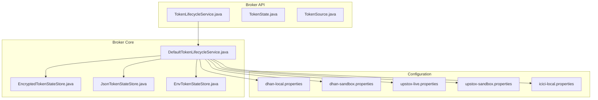
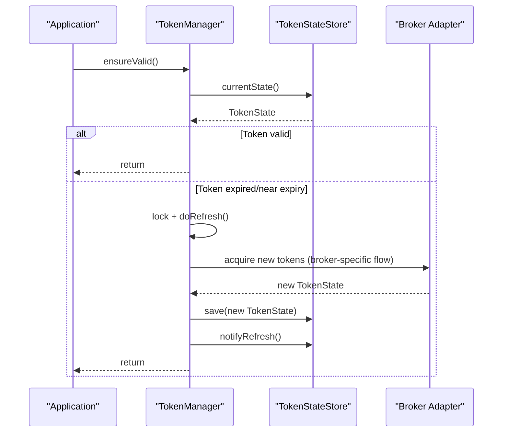
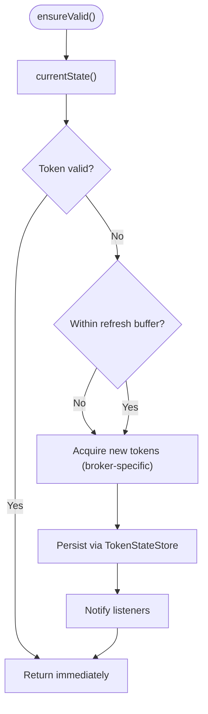
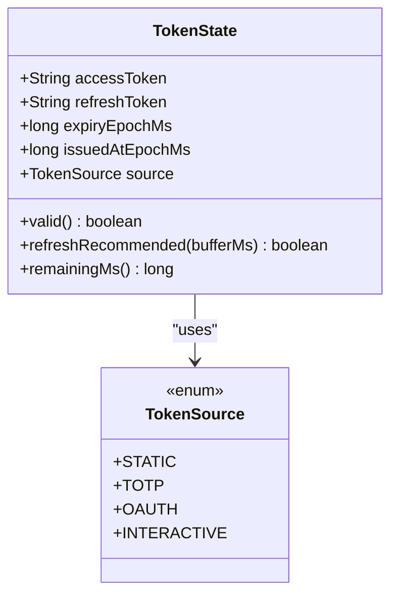
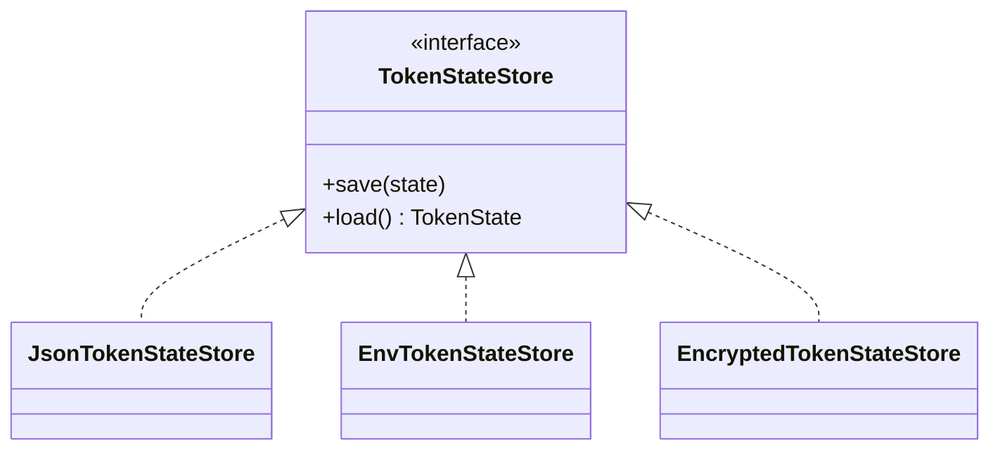
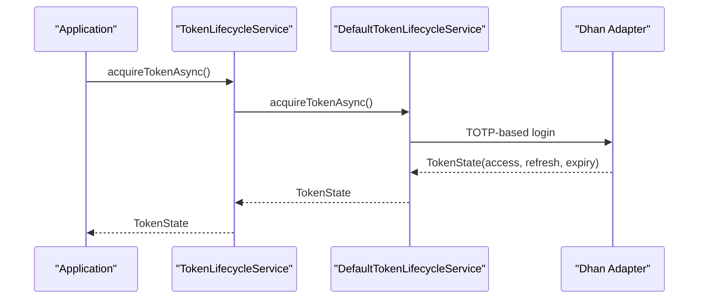
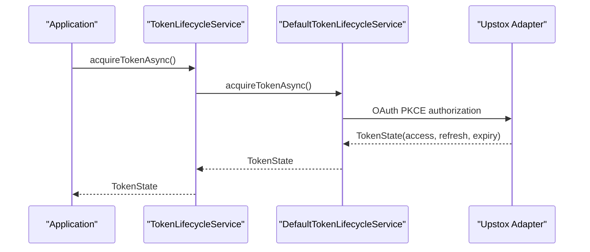
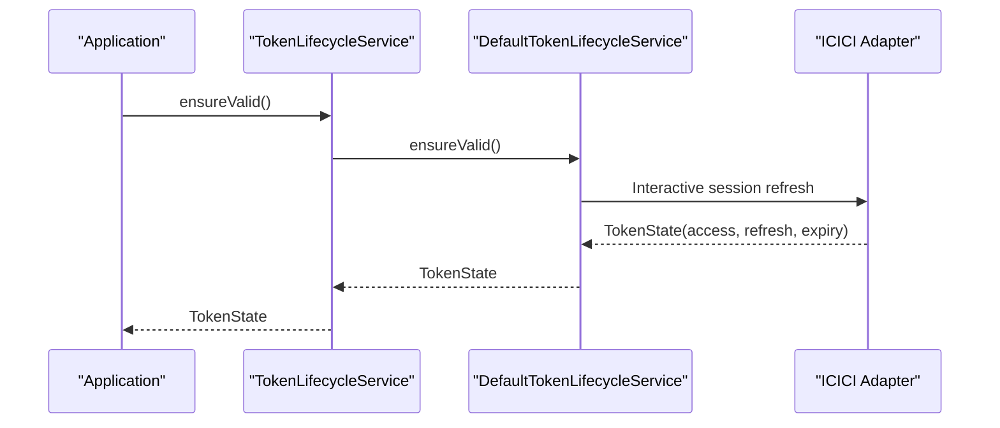
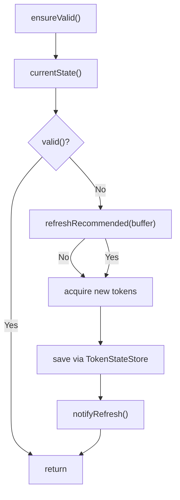
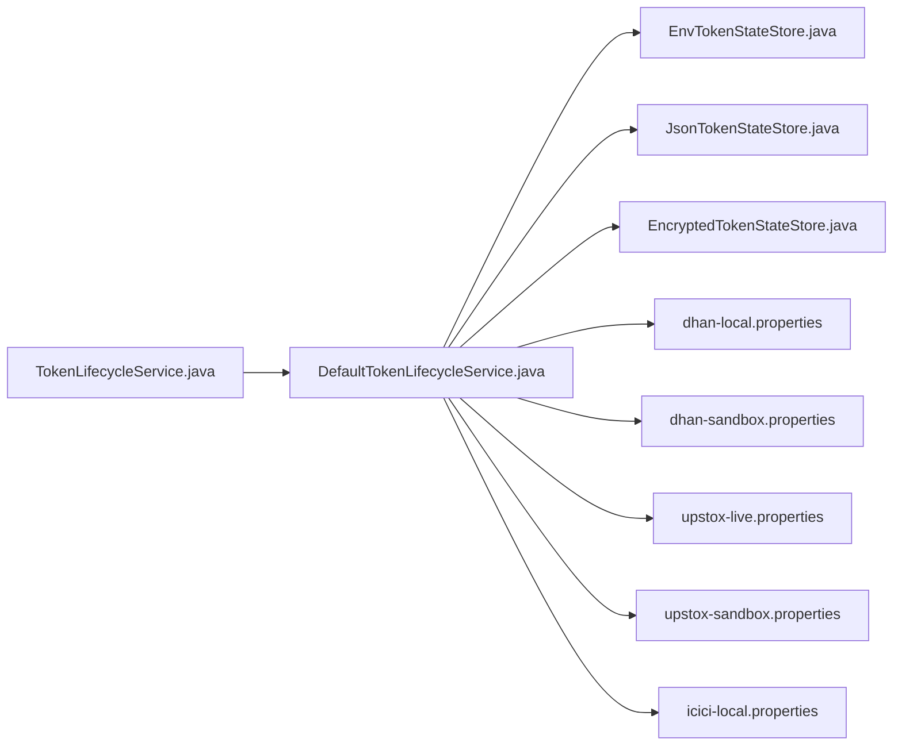

# Authentication & Authorization

<cite>
**Referenced Files in This Document**
- [TokenLifecycleService.java](file://broker/api/src/main/java/com/tradej/broker/api/auth/TokenLifecycleService.java)
- [TokenState.java](file://broker/api/src/main/java/com/tradej/broker/api/auth/TokenState.java)
- [TokenSource.java](file://broker/api/src/main/java/com/tradej/broker/api/auth/TokenSource.java)
- [DefaultTokenLifecycleService.java](file://broker/core/src/main/java/com/tradej/broker/core/auth/DefaultTokenLifecycleService.java)
- [EnvTokenStateStore.java](file://broker/core/src/main/java/com/tradej/broker/core/auth/EnvTokenStateStore.java)
- [JsonTokenStateStore.java](file://broker/core/src/main/java/com/tradej/broker/core/auth/JsonTokenStateStore.java)
- [EncryptedTokenStateStore.java](file://docs/BROKER_INTEGRATION_AUDIT_REPORT.md)
- [dhan-local.properties](file://config/dhan-local.properties)
- [dhan-sandbox.properties](file://config/dhan-sandbox.properties)
- [upstox-live.properties](file://config/upstox-live.properties)
- [upstox-sandbox.properties](file://config/upstox-sandbox.properties)
- [icici-local.properties](file://config/icici-local.properties)
- [BROKER_INTEGRATION_AUDIT_REPORT.md](file://docs/BROKER_INTEGRATION_AUDIT_REPORT.md)
- [DhanTokenLifecycleIntegrationTest.java](file://app/src/test/java/com/tradej/app/integration/DhanTokenLifecycleIntegrationTest.java)
- [IciciTokenLifecycleIntegrationTest.java](file://app/src/test/java/com/tradej/app/integration/IciciTokenLifecycleIntegrationTest.java)
- [refresh-dhan-token.sh](file://scripts/refresh-dhan-token.sh)
- [refresh-icici-session.sh](file://scripts/refresh-icici-session.sh)
- [refresh-upstox-token.sh](file://scripts/refresh-upstox-token.sh)
</cite>

## Table of Contents
1. [Introduction](#introduction)
2. [Project Structure](#project-structure)
3. [Core Components](#core-components)
4. [Architecture Overview](#architecture-overview)
5. [Detailed Component Analysis](#detailed-component-analysis)
6. [Dependency Analysis](#dependency-analysis)
7. [Performance Considerations](#performance-considerations)
8. [Troubleshooting Guide](#troubleshooting-guide)
9. [Conclusion](#conclusion)
10. [Appendices](#appendices)

## Introduction
This document provides comprehensive authentication and authorization guidance for accessing Trade-J APIs across multiple brokers. It covers JWT token management, broker-specific authentication flows, token lifecycle, and security policies. It also documents broker credential setup, OAuth flows, session management, access control mechanisms, best practices, token refresh procedures, and troubleshooting steps. Implementation examples for secure API integration and multi-broker authentication handling are included.

## Project Structure
Authentication and authorization logic is organized around a shared API contract and broker-specific implementations:
- Broker API module defines the token lifecycle contract and token state model.
- Broker Core module implements token lifecycle management and secure token storage.
- Configuration files provide broker credentials per environment.
- Scripts and integration tests demonstrate operational token refresh and lifecycle handling.

**Diagram sources**
- [TokenLifecycleService.java:1-42](file://broker/api/src/main/java/com/tradej/broker/api/auth/TokenLifecycleService.java#L1-L42)
- [TokenState.java:1-37](file://broker/api/src/main/java/com/tradej/broker/api/auth/TokenState.java#L1-L37)
- [TokenSource.java:1-15](file://broker/api/src/main/java/com/tradej/broker/api/auth/TokenSource.java#L1-L15)
- [DefaultTokenLifecycleService.java](file://broker/core/src/main/java/com/tradej/broker/core/auth/DefaultTokenLifecycleService.java)
- [EncryptedTokenStateStore.java:1105-1149](file://docs/BROKER_INTEGRATION_AUDIT_REPORT.md#L1105-L1149)
- [JsonTokenStateStore.java](file://broker/core/src/main/java/com/tradej/broker/core/auth/JsonTokenStateStore.java)
- [EnvTokenStateStore.java](file://broker/core/src/main/java/com/tradej/broker/core/auth/EnvTokenStateStore.java)
- [dhan-local.properties](file://config/dhan-local.properties)
- [dhan-sandbox.properties](file://config/dhan-sandbox.properties)
- [upstox-live.properties](file://config/upstox-live.properties)
- [upstox-sandbox.properties](file://config/upstox-sandbox.properties)
- [icici-local.properties](file://config/icici-local.properties)

**Section sources**
- [TokenLifecycleService.java:1-42](file://broker/api/src/main/java/com/tradej/broker/api/auth/TokenLifecycleService.java#L1-L42)
- [TokenState.java:1-37](file://broker/api/src/main/java/com/tradej/broker/api/auth/TokenState.java#L1-L37)
- [TokenSource.java:1-15](file://broker/api/src/main/java/com/tradej/broker/api/auth/TokenSource.java#L1-L15)
- [DefaultTokenLifecycleService.java](file://broker/core/src/main/java/com/tradej/broker/core/auth/DefaultTokenLifecycleService.java)
- [EncryptedTokenStateStore.java:1105-1149](file://docs/BROKER_INTEGRATION_AUDIT_REPORT.md#L1105-L1149)
- [JsonTokenStateStore.java](file://broker/core/src/main/java/com/tradej/broker/core/auth/JsonTokenStateStore.java)
- [EnvTokenStateStore.java](file://broker/core/src/main/java/com/tradej/broker/core/auth/EnvTokenStateStore.java)
- [dhan-local.properties](file://config/dhan-local.properties)
- [dhan-sandbox.properties](file://config/dhan-sandbox.properties)
- [upstox-live.properties](file://config/upstox-live.properties)
- [upstox-sandbox.properties](file://config/upstox-sandbox.properties)
- [icici-local.properties](file://config/icici-local.properties)

## Core Components
- TokenLifecycleService: Defines the contract for acquiring, refreshing, and validating tokens. It exposes synchronous and asynchronous acquisition methods and a thread-safe ensureValid routine.
- TokenState: Immutable record capturing access token, optional refresh token, issuance and expiry timestamps, and the token source.
- TokenSource: Enumerates supported token acquisition sources: STATIC, TOTP, OAUTH, INTERACTIVE.
- DefaultTokenLifecycleService: Implements broker-specific flows (Dhan TOTP, Upstox OAuth, ICICI interactive) and integrates with token stores.
- TokenStateStore implementations: Persist token state securely (JSON, environment-backed, encrypted on disk).

Key responsibilities:
- Centralized token lifecycle management decoupled from broker specifics.
- Proactive refresh logic based on remaining validity and configurable buffer.
- Secure storage with encryption and restricted file permissions.

**Section sources**
- [TokenLifecycleService.java:1-42](file://broker/api/src/main/java/com/tradej/broker/api/auth/TokenLifecycleService.java#L1-L42)
- [TokenState.java:1-37](file://broker/api/src/main/java/com/tradej/broker/api/auth/TokenState.java#L1-L37)
- [TokenSource.java:1-15](file://broker/api/src/main/java/com/tradej/broker/api/auth/TokenSource.java#L1-L15)
- [DefaultTokenLifecycleService.java](file://broker/core/src/main/java/com/tradej/broker/core/auth/DefaultTokenLifecycleService.java)
- [JsonTokenStateStore.java](file://broker/core/src/main/java/com/tradej/broker/core/auth/JsonTokenStateStore.java)
- [EnvTokenStateStore.java](file://broker/core/src/main/java/com/tradej/broker/core/auth/EnvTokenStateStore.java)

## Architecture Overview
The authentication architecture separates concerns between the application and broker-specific adapters:
- Application invokes ensureValid() before each broker API call.
- TokenManager retrieves current state and triggers refresh if needed.
- TokenStateStore persists refreshed tokens securely.
- Broker adapters consume validated tokens for requests.

**Diagram sources**
- [BROKER_INTEGRATION_AUDIT_REPORT.md:127-145](file://docs/BROKER_INTEGRATION_AUDIT_REPORT.md#L127-L145)
- [DefaultTokenLifecycleService.java](file://broker/core/src/main/java/com/tradej/broker/core/auth/DefaultTokenLifecycleService.java)
- [EncryptedTokenStateStore.java:1105-1149](file://docs/BROKER_INTEGRATION_AUDIT_REPORT.md#L1105-L1149)

**Section sources**
- [BROKER_INTEGRATION_AUDIT_REPORT.md:127-145](file://docs/BROKER_INTEGRATION_AUDIT_REPORT.md#L127-L145)
- [DefaultTokenLifecycleService.java](file://broker/core/src/main/java/com/tradej/broker/core/auth/DefaultTokenLifecycleService.java)

## Detailed Component Analysis

### Token Lifecycle Management
- Acquisition: acquireToken() and acquireTokenAsync() provide blocking and non-blocking initialization.
- Validation: ensureValid() performs thread-safe checks and refreshes as needed.
- State inspection: currentState() returns the current immutable TokenState snapshot.

**Diagram sources**
- [TokenLifecycleService.java:18-42](file://broker/api/src/main/java/com/tradej/broker/api/auth/TokenLifecycleService.java#L18-L42)
- [TokenState.java:13-31](file://broker/api/src/main/java/com/tradej/broker/api/auth/TokenState.java#L13-L31)
- [BROKER_INTEGRATION_AUDIT_REPORT.md:127-145](file://docs/BROKER_INTEGRATION_AUDIT_REPORT.md#L127-L145)

**Section sources**
- [TokenLifecycleService.java:18-42](file://broker/api/src/main/java/com/tradej/broker/api/auth/TokenLifecycleService.java#L18-L42)
- [TokenState.java:13-31](file://broker/api/src/main/java/com/tradej/broker/api/auth/TokenState.java#L13-L31)
- [BROKER_INTEGRATION_AUDIT_REPORT.md:127-145](file://docs/BROKER_INTEGRATION_AUDIT_REPORT.md#L127-L145)

### Token State Model
- Fields: access token, optional refresh token, expiry epoch, issued at epoch, source.
- Methods: valid(), refreshRecommended(bufferMs), remainingMs().
- Behavior: short-lived tokens avoid premature refresh; near-expiry decisions consider buffer thresholds.

**Diagram sources**
- [TokenState.java:6-37](file://broker/api/src/main/java/com/tradej/broker/api/auth/TokenState.java#L6-L37)
- [TokenSource.java:6-15](file://broker/api/src/main/java/com/tradej/broker/api/auth/TokenSource.java#L6-L15)

**Section sources**
- [TokenState.java:6-37](file://broker/api/src/main/java/com/tradej/broker/api/auth/TokenState.java#L6-L37)
- [TokenSource.java:6-15](file://broker/api/src/main/java/com/tradej/broker/api/auth/TokenSource.java#L6-L15)

### Token Storage Strategies
- JSON store: human-readable persistence for development and testing.
- Environment-backed store: inject tokens via environment variables for containerized deployments.
- Encrypted store: AES-GCM encryption with PBKDF2-derived keys, IV, and restricted file permissions for production.

**Diagram sources**
- [JsonTokenStateStore.java](file://broker/core/src/main/java/com/tradej/broker/core/auth/JsonTokenStateStore.java)
- [EnvTokenStateStore.java](file://broker/core/src/main/java/com/tradej/broker/core/auth/EnvTokenStateStore.java)
- [EncryptedTokenStateStore.java:1105-1149](file://docs/BROKER_INTEGRATION_AUDIT_REPORT.md#L1105-L1149)

**Section sources**
- [JsonTokenStateStore.java](file://broker/core/src/main/java/com/tradej/broker/core/auth/JsonTokenStateStore.java)
- [EnvTokenStateStore.java](file://broker/core/src/main/java/com/tradej/broker/core/auth/EnvTokenStateStore.java)
- [EncryptedTokenStateStore.java:1105-1149](file://docs/BROKER_INTEGRATION_AUDIT_REPORT.md#L1105-L1149)

### Broker-Specific Authentication Flows

#### Dhan (TOTP-based)
- Token source: TOTP.
- Typical flow: PIN + TOTP generation to obtain access and refresh tokens.
- Configuration: dhan-local.properties and dhan-sandbox.properties define broker credentials and endpoints.

**Diagram sources**
- [TokenLifecycleService.java:20-29](file://broker/api/src/main/java/com/tradej/broker/api/auth/TokenLifecycleService.java#L20-L29)
- [DefaultTokenLifecycleService.java](file://broker/core/src/main/java/com/tradej/broker/core/auth/DefaultTokenLifecycleService.java)
- [dhan-local.properties](file://config/dhan-local.properties)
- [dhan-sandbox.properties](file://config/dhan-sandbox.properties)

**Section sources**
- [TokenLifecycleService.java:8-13](file://broker/api/src/main/java/com/tradej/broker/api/auth/TokenLifecycleService.java#L8-L13)
- [DefaultTokenLifecycleService.java](file://broker/core/src/main/java/com/tradej/broker/core/auth/DefaultTokenLifecycleService.java)
- [dhan-local.properties](file://config/dhan-local.properties)
- [dhan-sandbox.properties](file://config/dhan-sandbox.properties)

#### Upstox (OAuth 2.0 Authorization Code with PKCE)
- Token source: OAUTH.
- Flow: Authorization code grant with PKCE and refresh token rotation.
- Configuration: upstox-live.properties and upstox-sandbox.properties.

**Diagram sources**
- [TokenLifecycleService.java:10-12](file://broker/api/src/main/java/com/tradej/broker/api/auth/TokenLifecycleService.java#L10-L12)
- [DefaultTokenLifecycleService.java](file://broker/core/src/main/java/com/tradej/broker/core/auth/DefaultTokenLifecycleService.java)
- [upstox-live.properties](file://config/upstox-live.properties)
- [upstox-sandbox.properties](file://config/upstox-sandbox.properties)

**Section sources**
- [TokenLifecycleService.java:10-12](file://broker/api/src/main/java/com/tradej/broker/api/auth/TokenLifecycleService.java#L10-L12)
- [DefaultTokenLifecycleService.java](file://broker/core/src/main/java/com/tradej/broker/core/auth/DefaultTokenLifecycleService.java)
- [upstox-live.properties](file://config/upstox-live.properties)
- [upstox-sandbox.properties](file://config/upstox-sandbox.properties)

#### ICICI (Interactive Session)
- Token source: INTERACTIVE.
- Flow: Interactive login to establish session; token lifecycle managed via ensureValid() and refresh procedures.
- Configuration: icici-local.properties.

**Diagram sources**
- [TokenLifecycleService.java:14-14](file://broker/api/src/main/java/com/tradej/broker/api/auth/TokenLifecycleService.java#L14-L14)
- [DefaultTokenLifecycleService.java](file://broker/core/src/main/java/com/tradej/broker/core/auth/DefaultTokenLifecycleService.java)
- [icici-local.properties](file://config/icici-local.properties)

**Section sources**
- [TokenLifecycleService.java:14-14](file://broker/api/src/main/java/com/tradej/broker/api/auth/TokenLifecycleService.java#L14-L14)
- [DefaultTokenLifecycleService.java](file://broker/core/src/main/java/com/tradej/broker/core/auth/DefaultTokenLifecycleService.java)
- [icici-local.properties](file://config/icici-local.properties)

### Token Refresh Procedures
- Proactive refresh: TokenState.refreshRecommended(bufferMs) determines whether to refresh before expiry.
- Locking: ensureValid() uses double-checked locking to safely refresh concurrently.
- Persistence: refreshed TokenState saved via TokenStateStore and notifies listeners.

**Diagram sources**
- [TokenState.java:13-31](file://broker/api/src/main/java/com/tradej/broker/api/auth/TokenState.java#L13-L31)
- [BROKER_INTEGRATION_AUDIT_REPORT.md:127-145](file://docs/BROKER_INTEGRATION_AUDIT_REPORT.md#L127-L145)
- [EncryptedTokenStateStore.java:1105-1149](file://docs/BROKER_INTEGRATION_AUDIT_REPORT.md#L1105-L1149)

**Section sources**
- [TokenState.java:13-31](file://broker/api/src/main/java/com/tradej/broker/api/auth/TokenState.java#L13-L31)
- [BROKER_INTEGRATION_AUDIT_REPORT.md:127-145](file://docs/BROKER_INTEGRATION_AUDIT_REPORT.md#L127-L145)
- [EncryptedTokenStateStore.java:1105-1149](file://docs/BROKER_INTEGRATION_AUDIT_REPORT.md#L1105-L1149)

### Security Policies and Best Practices
- Encryption: EncryptedTokenStateStore uses AES-GCM with PBKDF2-derived keys and writes IV + ciphertext; restricts file permissions.
- Least privilege: TokenStateStore implementations minimize exposure; environment-backed store avoids persistent secrets.
- Buffer-based refresh: Prevents excessive refresh calls and reduces risk window.
- Thread safety: ensureValid() must be thread-safe with proper synchronization.

**Section sources**
- [EncryptedTokenStateStore.java:1105-1149](file://docs/BROKER_INTEGRATION_AUDIT_REPORT.md#L1105-L1149)
- [TokenState.java:18-31](file://broker/api/src/main/java/com/tradej/broker/api/auth/TokenState.java#L18-L31)
- [BROKER_INTEGRATION_AUDIT_REPORT.md:127-145](file://docs/BROKER_INTEGRATION_AUDIT_REPORT.md#L127-L145)

### Access Control Mechanisms
- Token-based authorization: Broker adapters attach access tokens to API requests.
- Refresh enforcement: ensureValid() guarantees a valid token before each operation.
- Listener notifications: TokenStateStore.notifyRefresh() enables downstream components to react to token updates.

**Section sources**
- [TokenLifecycleService.java:37-42](file://broker/api/src/main/java/com/tradej/broker/api/auth/TokenLifecycleService.java#L37-L42)
- [EncryptedTokenStateStore.java:1105-1149](file://docs/BROKER_INTEGRATION_AUDIT_REPORT.md#L1105-L1149)

### Multi-Broker Authentication Handling
- Unified contract: TokenLifecycleService ensures consistent behavior across Dhan, Upstox, and ICICI.
- Broker-specific adapters: DefaultTokenLifecycleService orchestrates flows per TokenSource.
- Configuration isolation: Separate properties files per broker and environment.

**Section sources**
- [TokenLifecycleService.java:8-13](file://broker/api/src/main/java/com/tradej/broker/api/auth/TokenLifecycleService.java#L8-L13)
- [DefaultTokenLifecycleService.java](file://broker/core/src/main/java/com/tradej/broker/core/auth/DefaultTokenLifecycleService.java)
- [dhan-local.properties](file://config/dhan-local.properties)
- [upstox-live.properties](file://config/upstox-live.properties)
- [icici-local.properties](file://config/icici-local.properties)

## Dependency Analysis

**Diagram sources**
- [TokenLifecycleService.java:1-42](file://broker/api/src/main/java/com/tradej/broker/api/auth/TokenLifecycleService.java#L1-L42)
- [DefaultTokenLifecycleService.java](file://broker/core/src/main/java/com/tradej/broker/core/auth/DefaultTokenLifecycleService.java)
- [EnvTokenStateStore.java](file://broker/core/src/main/java/com/tradej/broker/core/auth/EnvTokenStateStore.java)
- [JsonTokenStateStore.java](file://broker/core/src/main/java/com/tradej/broker/core/auth/JsonTokenStateStore.java)
- [EncryptedTokenStateStore.java:1105-1149](file://docs/BROKER_INTEGRATION_AUDIT_REPORT.md#L1105-L1149)
- [dhan-local.properties](file://config/dhan-local.properties)
- [dhan-sandbox.properties](file://config/dhan-sandbox.properties)
- [upstox-live.properties](file://config/upstox-live.properties)
- [upstox-sandbox.properties](file://config/upstox-sandbox.properties)
- [icici-local.properties](file://config/icici-local.properties)

**Section sources**
- [TokenLifecycleService.java:1-42](file://broker/api/src/main/java/com/tradej/broker/api/auth/TokenLifecycleService.java#L1-L42)
- [DefaultTokenLifecycleService.java](file://broker/core/src/main/java/com/tradej/broker/core/auth/DefaultTokenLifecycleService.java)
- [EnvTokenStateStore.java](file://broker/core/src/main/java/com/tradej/broker/core/auth/EnvTokenStateStore.java)
- [JsonTokenStateStore.java](file://broker/core/src/main/java/com/tradej/broker/core/auth/JsonTokenStateStore.java)
- [EncryptedTokenStateStore.java:1105-1149](file://docs/BROKER_INTEGRATION_AUDIT_REPORT.md#L1105-L1149)
- [dhan-local.properties](file://config/dhan-local.properties)
- [dhan-sandbox.properties](file://config/dhan-sandbox.properties)
- [upstox-live.properties](file://config/upstox-live.properties)
- [upstox-sandbox.properties](file://config/upstox-sandbox.properties)
- [icici-local.properties](file://config/icici-local.properties)

## Performance Considerations
- Minimize refresh frequency: Use refreshRecommended(bufferMs) to avoid unnecessary refreshes.
- Asynchronous acquisition: Prefer acquireTokenAsync() during startup to avoid blocking.
- Concurrency: ensureValid() must be thread-safe; double-checked locking prevents redundant refreshes.
- Storage overhead: Encrypted store adds CPU cost; use for production environments requiring compliance.

[No sources needed since this section provides general guidance]

## Troubleshooting Guide
Common issues and resolutions:
- Expired or near-expiry tokens: Call ensureValid() before API calls; verify bufferMs configuration.
- Refresh failures: Confirm broker credentials and network connectivity; check TokenStateStore persistence.
- Multi-broker conflicts: Verify correct properties file per broker and environment.
- Operational scripts: Use refresh-* scripts to regenerate tokens for Dhan, ICICI, and Upstox.

Operational references:
- Dhan token lifecycle integration test demonstrates end-to-end token handling.
- ICICI token lifecycle integration test validates session refresh behavior.
- Scripts for token refresh: refresh-dhan-token.sh, refresh-icici-session.sh, refresh-upstox-token.sh.

**Section sources**
- [DhanTokenLifecycleIntegrationTest.java](file://app/src/test/java/com/tradej/app/integration/DhanTokenLifecycleIntegrationTest.java)
- [IciciTokenLifecycleIntegrationTest.java](file://app/src/test/java/com/tradej/app/integration/IciciTokenLifecycleIntegrationTest.java)
- [refresh-dhan-token.sh](file://scripts/refresh-dhan-token.sh)
- [refresh-icici-session.sh](file://scripts/refresh-icici-session.sh)
- [refresh-upstox-token.sh](file://scripts/refresh-upstox-token.sh)

## Conclusion
Trade-J’s authentication framework provides a robust, extensible foundation for multi-broker API access. By centralizing token lifecycle management behind a clean contract, enforcing secure storage, and supporting broker-specific flows, the system achieves strong security posture and operational reliability. Following the outlined best practices and leveraging the provided scripts and tests will help maintain secure and resilient integrations.

[No sources needed since this section summarizes without analyzing specific files]

## Appendices

### Implementation Examples
- Initialize and use token lifecycle:
  - Acquire synchronously: [TokenLifecycleService.acquireToken:20-24](file://broker/api/src/main/java/com/tradej/broker/api/auth/TokenLifecycleService.java#L20-L24)
  - Acquire asynchronously: [TokenLifecycleService.acquireTokenAsync:26-29](file://broker/api/src/main/java/com/tradej/broker/api/auth/TokenLifecycleService.java#L26-L29)
  - Validate and refresh: [TokenLifecycleService.ensureValid:37-42](file://broker/api/src/main/java/com/tradej/broker/api/auth/TokenLifecycleService.java#L37-L42)
- Configure broker credentials:
  - Dhan local: [dhan-local.properties](file://config/dhan-local.properties)
  - Dhan sandbox: [dhan-sandbox.properties](file://config/dhan-sandbox.properties)
  - Upstox live: [upstox-live.properties](file://config/upstox-live.properties)
  - Upstox sandbox: [upstox-sandbox.properties](file://config/upstox-sandbox.properties)
  - ICICI local: [icici-local.properties](file://config/icici-local.properties)
- Secure storage:
  - Encrypted store implementation: [EncryptedTokenStateStore.java:1105-1149](file://docs/BROKER_INTEGRATION_AUDIT_REPORT.md#L1105-L1149)
  - JSON store: [JsonTokenStateStore.java](file://broker/core/src/main/java/com/tradej/broker/core/auth/JsonTokenStateStore.java)
  - Environment-backed store: [EnvTokenStateStore.java](file://broker/core/src/main/java/com/tradej/broker/core/auth/EnvTokenStateStore.java)

**Section sources**
- [TokenLifecycleService.java:20-42](file://broker/api/src/main/java/com/tradej/broker/api/auth/TokenLifecycleService.java#L20-L42)
- [dhan-local.properties](file://config/dhan-local.properties)
- [dhan-sandbox.properties](file://config/dhan-sandbox.properties)
- [upstox-live.properties](file://config/upstox-live.properties)
- [upstox-sandbox.properties](file://config/upstox-sandbox.properties)
- [icici-local.properties](file://config/icici-local.properties)
- [EncryptedTokenStateStore.java:1105-1149](file://docs/BROKER_INTEGRATION_AUDIT_REPORT.md#L1105-L1149)
- [JsonTokenStateStore.java](file://broker/core/src/main/java/com/tradej/broker/core/auth/JsonTokenStateStore.java)
- [EnvTokenStateStore.java](file://broker/core/src/main/java/com/tradej/broker/core/auth/EnvTokenStateStore.java)