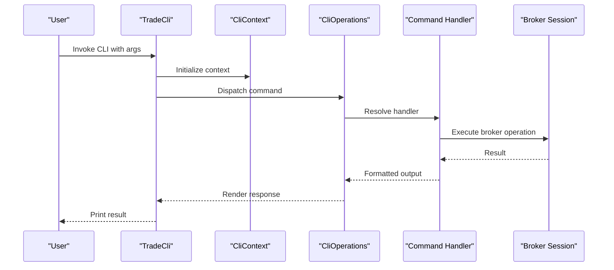
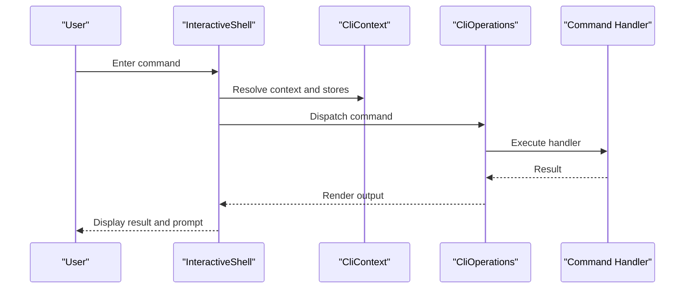
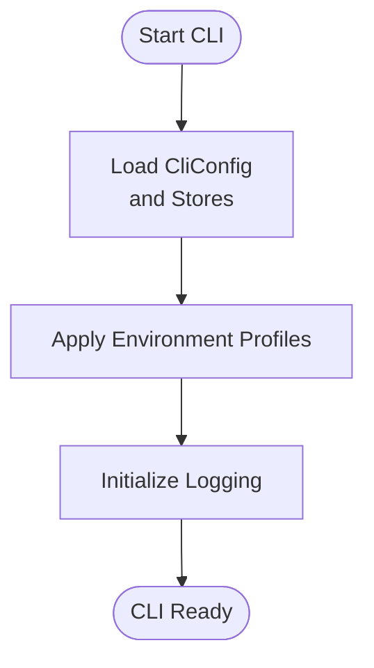
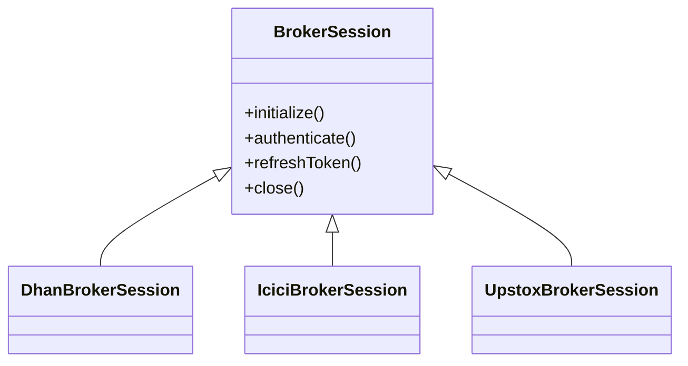

# CLI Client

<cite>
**Referenced Files in This Document**
- [TradeCli.java](file://cli/src/main/java/com/tradej/cli/TradeCli.java)
- [CliContext.java](file://cli/src/main/java/com/tradej/cli/CliContext.java)
- [CliOperations.java](file://cli/src/main/java/com/tradej/cli/CliOperations.java)
- [InteractiveShell.java](file://cli/src/main/java/com/tradej/cli/interactive/InteractiveShell.java)
- [CliConfig.java](file://cli/src/main/java/com/tradej/cli/config/CliConfig.java)
- [AliasStore.java](file://cli/src/main/java/com/tradej/cli/config/AliasStore.java)
- [MacroStore.java](file://cli/src/main/java/com/tradej/cli/config/MacroStore.java)
- [SavedQueryStore.java](file://cli/src/main/java/com/tradej/cli/config/SavedQueryStore.java)
- [CliAnalyticsSupport.java](file://cli/src/main/java/com/tradej/cli/analytics/CliAnalyticsSupport.java)
- [CliDownloadSupport.java](file://cli/src/main/java/com/tradej/cli/download/CliDownloadSupport.java)
- [CliEquityImportSupport.java](file://cli/src/main/java/com/tradej/cli/download/CliEquityImportSupport.java)
- [AttachClient.java](file://cli/src/main/java/com/tradej/cli/attach/AttachClient.java)
- [BrokerSession.java](file://cli/src/main/java/com/tradej/cli/standalone/BrokerSession.java)
- [DhanBrokerSession.java](file://cli/src/main/java/com/tradej/cli/standalone/DhanBrokerSession.java)
- [IciciBrokerSession.java](file://cli/src/main/java/com/tradej/cli/standalone/IciciBrokerSession.java)
- [UpstoxBrokerSession.java](file://cli/src/main/java/com/tradej/cli/standalone/UpstoxBrokerSession.java)
- [CliHelpCommand.java](file://cli/src/main/java/com/tradej/cli/command/CliHelpCommand.java)
- [CliCommandsCommand.java](file://cli/src/main/java/com/tradej/cli/command/CliCommandsCommand.java)
- [CliMarketCommands.java](file://cli/src/main/java/com/tradej/cli/command/CliMarketCommands.java)
- [CliPortfolioCommands.java](file://cli/src/main/java/com/tradej/cli/command/CliPortfolioCommands.java)
- [CliTradingCommands.java](file://cli/src/main/java/com/tradej/cli/command/CliTradingCommands.java)
- [CliDataCommands.java](file://cli/src/main/java/com/tradej/cli/command/CliDataCommands.java)
- [CliHistoricalCommands.java](file://cli/src/main/java/com/tradej/cli/command/CliHistoricalCommands.java)
- [CliDownloadCommands.java](file://cli/src/main/java/com/tradej/cli/command/CliDownloadCommands.java)
- [CliAnalyticsCommands.java](file://cli/src/main/java/com/tradej/cli/command/CliAnalyticsCommands.java)
- [CliBacktestCommands.java](file://cli/src/main/java/com/tradej/cli/command/CliBacktestCommands.java)
- [CliReplayCommands.java](file://cli/src/main/java/com/tradej/cli/command/CliReplayCommands.java)
- [CliBrokerCommands.java](file://cli/src/main/java/com/tradej/cli/command/CliBrokerCommands.java)
- [CliBrokerGatewayCommands.java](file://cli/src/main/java/com/tradej/cli/command/CliBrokerGatewayCommands.java)
- [CliAttachCommands.java](file://cli/src/main/java/com/tradej/cli/command/CliAttachCommands.java)
- [CliCapabilitiesCommand.java](file://cli/src/main/java/com/tradej/cli/command/CliCapabilitiesCommand.java)
- [CliDashboardCommand.java](file://cli/src/main/java/com/tradej/cli/command/CliDashboardCommand.java)
- [CliDoctorCommand.java](file://cli/src/main/java/com/tradej/cli/command/CliDoctorCommand.java)
- [CliMaintenanceCommands.java](file://cli/src/main/java/com/tradej/cli/command/CliMaintenanceCommands.java)
- [CliReadinessCommand.java](file://cli/src/main/java/com/tradej/cli/command/CliReadinessCommand.java)
- [CliScreenerCommands.java](file://cli/src/main/java/com/tradej/cli/command/CliScreenerCommands.java)
- [CliScanCommands.java](file://cli/src/main/java/com/tradej/cli/command/CliScanCommands.java)
- [CliIndicatorsCommand.java](file://cli/src/main/java/com/tradej/cli/command/CliIndicatorsCommand.java)
- [CliComputeCommand.java](file://cli/src/main/java/com/tradej/cli/command/CliComputeCommand.java)
- [CliApiCommand.java](file://cli/src/main/java/com/tradej/cli/command/CliApiCommand.java)
- [CliDocsCommand.java](file://cli/src/main/java/com/tradej/cli/command/CliDocsCommand.java)
- [CliModulesCommand.java](file://cli/src/main/java/com/tradej/cli/command/CliModulesCommand.java)
- [CliPluginsCommand.java](file://cli/src/main/java/com/tradej/cli/command/CliPluginsCommand.java)
- [CliEventsCommand.java](file://cli/src/main/java/com/tradej/cli/command/CliEventsCommand.java)
- [CliFlowsCommand.java](file://cli/src/main/java/com/tradej/cli/command/CliFlowsCommand.java)
- [CliCoverageCommand.java](file://cli/src/main/java/com/tradej/cli/command/CliCoverageCommand.java)
- [CliRegressionCommand.java](file://cli/src/main/java/com/tradej/cli/command/CliRegressionCommand.java)
- [CliBrokerCertCommands.java](file://cli/src/main/java/com/tradej/cli/command/CliBrokerCertCommands.java)
- [CliCertifyCommand.java](file://cli/src/main/java/com/tradej/cli/command/CliCertifyCommand.java)
- [CliCommandSupport.java](file://cli/src/main/java/com/tradej/cli/command/CliCommandSupport.java)
- [CliAttachCommands.java](file://cli/src/main/java/com/tradej/cli/command/CliAttachCommands.java)
- [CLI.md](file://CLI.md)
- [CONFIG.md](file://CONFIG.md)
- [application.yml](file://app/src/main/resources/application.yml)
- [application-dev.yml](file://app/src/main/resources/application-dev.yml)
- [application-prod.yml](file://app/src/main/resources/application-prod.yml)
- [application-icici-prod.yml](file://app/src/main/resources/application-icici-prod.yml)
- [application-upstox-prod.yml](file://app/src/main/resources/application-upstox-prod.yml)
- [application-gateway.yml](file://app/src/main/resources/application-gateway.yml)
- [logback-spring.xml](file://app/src/main/resources/logback-spring.xml)
- [build.gradle](file://cli/build.gradle)
- [gradle.properties](file://gradle.properties)
- [settings.gradle](file://settings.gradle)
- [README.md](file://README.md)
</cite>

## Table of Contents
1. [Introduction](#introduction)
2. [Project Structure](#project-structure)
3. [Core Components](#core-components)
4. [Architecture Overview](#architecture-overview)
5. [Detailed Component Analysis](#detailed-component-analysis)
6. [Dependency Analysis](#dependency-analysis)
7. [Performance Considerations](#performance-considerations)
8. [Troubleshooting Guide](#troubleshooting-guide)
9. [Conclusion](#conclusion)
10. [Appendices](#appendices)

## Introduction
This document describes the Trade-J command-line interface (CLI) client, covering installation, configuration, command structure, interactive shell, batch execution, automation, and operational workflows. It consolidates the CLI architecture, command categories, and integration points with brokers and analytics to enable reliable market data retrieval, order management, portfolio analysis, and system administration via scripts and automation.

## Project Structure
The CLI module is organized around a central entry point, command packages, configuration stores, interactive shell, analytics and download helpers, and standalone broker sessions. Supporting application profiles and logging define runtime behavior and environment-specific settings.

```mermaid
graph TB
subgraph "CLI Core"
TC["TradeCli.java"]
CCtx["CliContext.java"]
Ops["CliOperations.java"]
end
subgraph "Commands"
Help["CliHelpCommand.java"]
Cmds["CliCommandsCommand.java"]
Market["CliMarketCommands.java"]
Portfolio["CliPortfolioCommands.java"]
Trading["CliTradingCommands.java"]
Data["CliDataCommands.java"]
Hist["CliHistoricalCommands.java"]
Download["CliDownloadCommands.java"]
Analytics["CliAnalyticsCommands.java"]
Backtest["CliBacktestCommands.java"]
Replay["CliReplayCommands.java"]
Broker["CliBrokerCommands.java"]
Gateway["CliBrokerGatewayCommands.java"]
Attach["CliAttachCommands.java"]
Cap["CliCapabilitiesCommand.java"]
Dash["CliDashboardCommand.java"]
Doctor["CliDoctorCommand.java"]
Maint["CliMaintenanceCommands.java"]
Ready["CliReadinessCommand.java"]
Screener["CliScreenerCommands.java"]
Scan["CliScanCommands.java"]
Ind["CliIndicatorsCommand.java"]
Compute["CliComputeCommand.java"]
API["CliApiCommand.java"]
Docs["CliDocsCommand.java"]
Modules["CliModulesCommand.java"]
Plugins["CliPluginsCommand.java"]
Events["CliEventsCommand.java"]
Flows["CliFlowsCommand.java"]
Coverage["CliCoverageCommand.java"]
Reg["CliRegressionCommand.java"]
Cert["CliBrokerCertCommands.java"]
Certify["CliCertifyCommand.java"]
CmdSup["CliCommandSupport.java"]
end
subgraph "Interactive"
Shell["InteractiveShell.java"]
end
subgraph "Config"
Cfg["CliConfig.java"]
Aliases["AliasStore.java"]
Macros["MacroStore.java"]
Queries["SavedQueryStore.java"]
end
subgraph "Analytics & Downloads"
AnaSup["CliAnalyticsSupport.java"]
DownSup["CliDownloadSupport.java"]
EqImp["CliEquityImportSupport.java"]
end
subgraph "Standalone Sessions"
BSess["BrokerSession.java"]
DSess["DhanBrokerSession.java"]
ISess["IciciBrokerSession.java"]
USess["UpstoxBrokerSession.java"]
end
subgraph "Attach"
Att["AttachClient.java"]
end
TC --> CCtx
TC --> Ops
CCtx --> Cfg
CCtx --> Aliases
CCtx --> Macros
CCtx --> Queries
Ops --> Market
Ops --> Portfolio
Ops --> Trading
Ops --> Data
Ops --> Hist
Ops --> Download
Ops --> Analytics
Ops --> Backtest
Ops --> Replay
Ops --> Broker
Ops --> Gateway
Ops --> Attach
Ops --> Cap
Ops --> Dash
Ops --> Doctor
Ops --> Maint
Ops --> Ready
Ops --> Screener
Ops --> Scan
Ops --> Ind
Ops --> Compute
Ops --> API
Ops --> Docs
Ops --> Modules
Ops --> Plugins
Ops --> Events
Ops --> Flows
Ops --> Coverage
Ops --> Reg
Ops --> Cert
Ops --> Certify
Ops --> CmdSup
Ops --> AnaSup
Ops --> DownSup
Ops --> EqImp
Ops --> BSess
Ops --> DSess
Ops --> ISess
Ops --> USess
Ops --> Att
CCtx --> Shell
```

**Diagram sources**
- [TradeCli.java:1-200](file://cli/src/main/java/com/tradej/cli/TradeCli.java#L1-L200)
- [CliContext.java:1-200](file://cli/src/main/java/com/tradej/cli/CliContext.java#L1-L200)
- [CliOperations.java:1-200](file://cli/src/main/java/com/tradej/cli/CliOperations.java#L1-L200)
- [InteractiveShell.java:1-200](file://cli/src/main/java/com/tradej/cli/interactive/InteractiveShell.java#L1-L200)
- [CliConfig.java:1-200](file://cli/src/main/java/com/tradej/cli/config/CliConfig.java#L1-L200)
- [AliasStore.java:1-200](file://cli/src/main/java/com/tradej/cli/config/AliasStore.java#L1-L200)
- [MacroStore.java:1-200](file://cli/src/main/java/com/tradej/cli/config/MacroStore.java#L1-L200)
- [SavedQueryStore.java:1-200](file://cli/src/main/java/com/tradej/cli/config/SavedQueryStore.java#L1-L200)
- [CliAnalyticsSupport.java:1-200](file://cli/src/main/java/com/tradej/cli/analytics/CliAnalyticsSupport.java#L1-L200)
- [CliDownloadSupport.java:1-200](file://cli/src/main/java/com/tradej/cli/download/CliDownloadSupport.java#L1-L200)
- [CliEquityImportSupport.java:1-200](file://cli/src/main/java/com/tradej/cli/download/CliEquityImportSupport.java#L1-L200)
- [AttachClient.java:1-200](file://cli/src/main/java/com/tradej/cli/attach/AttachClient.java#L1-L200)
- [BrokerSession.java:1-200](file://cli/src/main/java/com/tradej/cli/standalone/BrokerSession.java#L1-L200)
- [DhanBrokerSession.java:1-200](file://cli/src/main/java/com/tradej/cli/standalone/DhanBrokerSession.java#L1-L200)
- [IciciBrokerSession.java:1-200](file://cli/src/main/java/com/tradej/cli/standalone/IciciBrokerSession.java#L1-L200)
- [UpstoxBrokerSession.java:1-200](file://cli/src/main/java/com/tradej/cli/standalone/UpstoxBrokerSession.java#L1-L200)

**Section sources**
- [TradeCli.java:1-200](file://cli/src/main/java/com/tradej/cli/TradeCli.java#L1-L200)
- [CliContext.java:1-200](file://cli/src/main/java/com/tradej/cli/CliContext.java#L1-L200)
- [CliOperations.java:1-200](file://cli/src/main/java/com/tradej/cli/CliOperations.java#L1-L200)

## Core Components
- TradeCli: Application entry point that parses arguments, initializes context, and dispatches commands.
- CliContext: Central runtime context managing configuration, stores, and broker sessions.
- CliOperations: Orchestrator that routes CLI invocations to specific command handlers.
- InteractiveShell: REPL-style interactive mode for ad-hoc exploration and command chaining.
- Config stores: AliasStore, MacroStore, SavedQueryStore for user-defined shortcuts and persisted queries.
- Analytics and downloads: CliAnalyticsSupport, CliDownloadSupport, CliEquityImportSupport for data export and ingestion.
- Standalone broker sessions: BrokerSession and broker-specific implementations for isolated operations.
- AttachClient: Remote attachment and control client for distributed CLI operations.

**Section sources**
- [TradeCli.java:1-200](file://cli/src/main/java/com/tradej/cli/TradeCli.java#L1-L200)
- [CliContext.java:1-200](file://cli/src/main/java/com/tradej/cli/CliContext.java#L1-L200)
- [CliOperations.java:1-200](file://cli/src/main/java/com/tradej/cli/CliOperations.java#L1-L200)
- [InteractiveShell.java:1-200](file://cli/src/main/java/com/tradej/cli/interactive/InteractiveShell.java#L1-L200)
- [CliConfig.java:1-200](file://cli/src/main/java/com/tradej/cli/config/CliConfig.java#L1-L200)
- [AliasStore.java:1-200](file://cli/src/main/java/com/tradej/cli/config/AliasStore.java#L1-L200)
- [MacroStore.java:1-200](file://cli/src/main/java/com/tradej/cli/config/MacroStore.java#L1-L200)
- [SavedQueryStore.java:1-200](file://cli/src/main/java/com/tradej/cli/config/SavedQueryStore.java#L1-L200)
- [CliAnalyticsSupport.java:1-200](file://cli/src/main/java/com/tradej/cli/analytics/CliAnalyticsSupport.java#L1-L200)
- [CliDownloadSupport.java:1-200](file://cli/src/main/java/com/tradej/cli/download/CliDownloadSupport.java#L1-L200)
- [CliEquityImportSupport.java:1-200](file://cli/src/main/java/com/tradej/cli/download/CliEquityImportSupport.java#L1-L200)
- [AttachClient.java:1-200](file://cli/src/main/java/com/tradej/cli/attach/AttachClient.java#L1-L200)
- [BrokerSession.java:1-200](file://cli/src/main/java/com/tradej/cli/standalone/BrokerSession.java#L1-L200)
- [DhanBrokerSession.java:1-200](file://cli/src/main/java/com/tradej/cli/standalone/DhanBrokerSession.java#L1-L200)
- [IciciBrokerSession.java:1-200](file://cli/src/main/java/com/tradej/cli/standalone/IciciBrokerSession.java#L1-L200)
- [UpstoxBrokerSession.java:1-200](file://cli/src/main/java/com/tradej/cli/standalone/UpstoxBrokerSession.java#L1-L200)

## Architecture Overview
The CLI follows a layered architecture:
- Entry point: TradeCli initializes and delegates to CliContext.
- Context management: CliContext aggregates configuration, stores, and broker session factories.
- Command orchestration: CliOperations selects and executes command handlers.
- Command handlers: Category-specific command classes implement operations for market data, orders, portfolio, analytics, backtesting, replay, broker management, and more.
- Interactive mode: InteractiveShell enables REPL-style command chaining and conditional execution.
- Data and analytics: CliAnalyticsSupport and CliDownloadSupport provide structured export and import utilities.
- Broker sessions: Standalone sessions encapsulate broker-specific authentication and lifecycle for isolated runs.
- Attach client: AttachClient supports remote CLI control and distributed operations.

**Diagram sources**
- [TradeCli.java:1-200](file://cli/src/main/java/com/tradej/cli/TradeCli.java#L1-L200)
- [CliContext.java:1-200](file://cli/src/main/java/com/tradej/cli/CliContext.java#L1-L200)
- [CliOperations.java:1-200](file://cli/src/main/java/com/tradej/cli/CliOperations.java#L1-L200)
- [CliMarketCommands.java:1-200](file://cli/src/main/java/com/tradej/cli/command/CliMarketCommands.java#L1-L200)
- [BrokerSession.java:1-200](file://cli/src/main/java/com/tradej/cli/standalone/BrokerSession.java#L1-L200)

## Detailed Component Analysis

### Command Categories and Reference
The CLI organizes functionality into cohesive categories. Below are the primary command groups and representative handlers.

- Market data retrieval
  - CliMarketCommands: LTP, depth, OHLC, candles, and quote operations.
  - CliDataCommands: Generic data fetch and subscription utilities.
  - CliHistoricalCommands: Historical bars and range queries.
- Order management
  - CliTradingCommands: Place, modify, cancel, and query orders.
  - CliBrokerCommands: Broker-specific order operations and lifecycle.
- Portfolio analysis
  - CliPortfolioCommands: Holdings, positions, and balance queries.
- Analytics and computation
  - CliAnalyticsCommands: Analytics computations and aggregations.
  - CliBacktestCommands: Backtesting orchestrators.
  - CliIndicatorsCommand: Indicator pipelines and computed signals.
  - CliComputeCommand: On-the-fly computation and transformations.
- Replay and simulation
  - CliReplayCommands: Replay sessions and tick/candle reconstruction.
- Configuration and environment
  - CliCapabilitiesCommand: Capability checks and feature flags.
  - CliDashboardCommand: Dashboard and status views.
  - CliDoctorCommand: Health diagnostics and readiness checks.
  - CliMaintenanceCommands: Maintenance and cleanup tasks.
  - CliReadinessCommand: Environment readiness and prerequisites.
- Discovery and help
  - CliHelpCommand: Inline help and usage guidance.
  - CliCommandsCommand: List available commands.
  - CliDocsCommand: Open documentation references.
- Integration and administration
  - CliAttachCommands: Attach and control remote CLI instances.
  - CliBrokerGatewayCommands: Gateway-level operations and routing.
  - CliDownloadCommands: Export data and artifacts.
  - CliApiCommand: API introspection and endpoint discovery.
  - CliModulesCommand, CliPluginsCommand: Module and plugin management.
  - CliEventsCommand, CliFlowsCommand: Event and flow inspection.
  - CliCoverageCommand, CliRegressionCommand: Coverage and regression utilities.
  - CliBrokerCertCommands, CliCertifyCommand: Certification and capability verification.

Representative handlers:
- [CliMarketCommands.java:1-200](file://cli/src/main/java/com/tradej/cli/command/CliMarketCommands.java#L1-L200)
- [CliPortfolioCommands.java:1-200](file://cli/src/main/java/com/tradej/cli/command/CliPortfolioCommands.java#L1-L200)
- [CliTradingCommands.java:1-200](file://cli/src/main/java/com/tradej/cli/command/CliTradingCommands.java#L1-L200)
- [CliDataCommands.java:1-200](file://cli/src/main/java/com/tradej/cli/command/CliDataCommands.java#L1-L200)
- [CliHistoricalCommands.java:1-200](file://cli/src/main/java/com/tradej/cli/command/CliHistoricalCommands.java#L1-L200)
- [CliDownloadCommands.java:1-200](file://cli/src/main/java/com/tradej/cli/command/CliDownloadCommands.java#L1-L200)
- [CliAnalyticsCommands.java:1-200](file://cli/src/main/java/com/tradej/cli/command/CliAnalyticsCommands.java#L1-L200)
- [CliBacktestCommands.java:1-200](file://cli/src/main/java/com/tradej/cli/command/CliBacktestCommands.java#L1-L200)
- [CliReplayCommands.java:1-200](file://cli/src/main/java/com/tradej/cli/command/CliReplayCommands.java#L1-L200)
- [CliBrokerCommands.java:1-200](file://cli/src/main/java/com/tradej/cli/command/CliBrokerCommands.java#L1-L200)
- [CliBrokerGatewayCommands.java:1-200](file://cli/src/main/java/com/tradej/cli/command/CliBrokerGatewayCommands.java#L1-L200)
- [CliAttachCommands.java:1-200](file://cli/src/main/java/com/tradej/cli/command/CliAttachCommands.java#L1-L200)
- [CliCapabilitiesCommand.java:1-200](file://cli/src/main/java/com/tradej/cli/command/CliCapabilitiesCommand.java#L1-L200)
- [CliDashboardCommand.java:1-200](file://cli/src/main/java/com/tradej/cli/command/CliDashboardCommand.java#L1-L200)
- [CliDoctorCommand.java:1-200](file://cli/src/main/java/com/tradej/cli/command/CliDoctorCommand.java#L1-L200)
- [CliMaintenanceCommands.java:1-200](file://cli/src/main/java/com/tradej/cli/command/CliMaintenanceCommands.java#L1-L200)
- [CliReadinessCommand.java:1-200](file://cli/src/main/java/com/tradej/cli/command/CliReadinessCommand.java#L1-L200)
- [CliScreenerCommands.java:1-200](file://cli/src/main/java/com/tradej/cli/command/CliScreenerCommands.java#L1-L200)
- [CliScanCommands.java:1-200](file://cli/src/main/java/com/tradej/cli/command/CliScanCommands.java#L1-L200)
- [CliIndicatorsCommand.java:1-200](file://cli/src/main/java/com/tradej/cli/command/CliIndicatorsCommand.java#L1-L200)
- [CliComputeCommand.java:1-200](file://cli/src/main/java/com/tradej/cli/command/CliComputeCommand.java#L1-L200)
- [CliApiCommand.java:1-200](file://cli/src/main/java/com/tradej/cli/command/CliApiCommand.java#L1-L200)
- [CliDocsCommand.java:1-200](file://cli/src/main/java/com/tradej/cli/command/CliDocsCommand.java#L1-L200)
- [CliModulesCommand.java:1-200](file://cli/src/main/java/com/tradej/cli/command/CliModulesCommand.java#L1-L200)
- [CliPluginsCommand.java:1-200](file://cli/src/main/java/com/tradej/cli/command/CliPluginsCommand.java#L1-L200)
- [CliEventsCommand.java:1-200](file://cli/src/main/java/com/tradej/cli/command/CliEventsCommand.java#L1-L200)
- [CliFlowsCommand.java:1-200](file://cli/src/main/java/com/tradej/cli/command/CliFlowsCommand.java#L1-L200)
- [CliCoverageCommand.java:1-200](file://cli/src/main/java/com/tradej/cli/command/CliCoverageCommand.java#L1-L200)
- [CliRegressionCommand.java:1-200](file://cli/src/main/java/com/tradej/cli/command/CliRegressionCommand.java#L1-L200)
- [CliBrokerCertCommands.java:1-200](file://cli/src/main/java/com/tradej/cli/command/CliBrokerCertCommands.java#L1-L200)
- [CliCertifyCommand.java:1-200](file://cli/src/main/java/com/tradej/cli/command/CliCertifyCommand.java#L1-L200)
- [CliCommandSupport.java:1-200](file://cli/src/main/java/com/tradej/cli/command/CliCommandSupport.java#L1-L200)

**Section sources**
- [CliHelpCommand.java:1-200](file://cli/src/main/java/com/tradej/cli/command/CliHelpCommand.java#L1-L200)
- [CliCommandsCommand.java:1-200](file://cli/src/main/java/com/tradej/cli/command/CliCommandsCommand.java#L1-L200)

### Interactive Shell Functionality
The interactive shell enables REPL-style command execution, history, and real-time feedback. Users can chain commands, use macros and aliases, and leverage saved queries for rapid iteration.

Key capabilities:
- Command parsing and execution loop
- History navigation and editing
- Integration with macro and alias stores
- Status bar and contextual hints

**Diagram sources**
- [InteractiveShell.java:1-200](file://cli/src/main/java/com/tradej/cli/interactive/InteractiveShell.java#L1-L200)
- [CliContext.java:1-200](file://cli/src/main/java/com/tradej/cli/CliContext.java#L1-L200)
- [CliOperations.java:1-200](file://cli/src/main/java/com/tradej/cli/CliOperations.java#L1-L200)

**Section sources**
- [InteractiveShell.java:1-200](file://cli/src/main/java/com/tradej/cli/interactive/InteractiveShell.java#L1-L200)

### Batch Execution and Automation
Batch execution is supported through scriptable command invocation and automation-friendly output formats. Commands can be chained and combined to form automated workflows.

Common automation patterns:
- Scripted command sequences for market data collection
- Automated order placement and monitoring
- Scheduled portfolio and analytics exports
- Replay and backtest orchestration

Representative handlers:
- [CliDownloadCommands.java:1-200](file://cli/src/main/java/com/tradej/cli/command/CliDownloadCommands.java#L1-L200)
- [CliAnalyticsCommands.java:1-200](file://cli/src/main/java/com/tradej/cli/command/CliAnalyticsCommands.java#L1-L200)
- [CliBacktestCommands.java:1-200](file://cli/src/main/java/com/tradej/cli/command/CliBacktestCommands.java#L1-L200)
- [CliReplayCommands.java:1-200](file://cli/src/main/java/com/tradej/cli/command/CliReplayCommands.java#L1-L200)

**Section sources**
- [CliDownloadCommands.java:1-200](file://cli/src/main/java/com/tradej/cli/command/CliDownloadCommands.java#L1-L200)
- [CliAnalyticsCommands.java:1-200](file://cli/src/main/java/com/tradej/cli/command/CliAnalyticsCommands.java#L1-L200)
- [CliBacktestCommands.java:1-200](file://cli/src/main/java/com/tradej/cli/command/CliBacktestCommands.java#L1-L200)
- [CliReplayCommands.java:1-200](file://cli/src/main/java/com/tradej/cli/command/CliReplayCommands.java#L1-L200)

### Configuration Management and Environment Setup
Configuration is managed through CliConfig and supporting stores, with environment-specific application profiles and logging configuration.

Key configuration areas:
- Broker credentials and session management
- Command aliases and macros
- Saved queries and reusable command templates
- Logging and runtime modes

**Diagram sources**
- [CliConfig.java:1-200](file://cli/src/main/java/com/tradej/cli/config/CliConfig.java#L1-L200)
- [AliasStore.java:1-200](file://cli/src/main/java/com/tradej/cli/config/AliasStore.java#L1-L200)
- [MacroStore.java:1-200](file://cli/src/main/java/com/tradej/cli/config/MacroStore.java#L1-L200)
- [SavedQueryStore.java:1-200](file://cli/src/main/java/com/tradej/cli/config/SavedQueryStore.java#L1-L200)
- [application.yml:1-200](file://app/src/main/resources/application.yml#L1-L200)
- [application-dev.yml:1-200](file://app/src/main/resources/application-dev.yml#L1-L200)
- [application-prod.yml:1-200](file://app/src/main/resources/application-prod.yml#L1-L200)
- [application-icici-prod.yml:1-200](file://app/src/main/resources/application-icici-prod.yml#L1-L200)
- [application-upstox-prod.yml:1-200](file://app/src/main/resources/application-upstox-prod.yml#L1-L200)
- [application-gateway.yml:1-200](file://app/src/main/resources/application-gateway.yml#L1-L200)
- [logback-spring.xml:1-200](file://app/src/main/resources/logback-spring.xml#L1-L200)

**Section sources**
- [CliConfig.java:1-200](file://cli/src/main/java/com/tradej/cli/config/CliConfig.java#L1-L200)
- [AliasStore.java:1-200](file://cli/src/main/java/com/tradej/cli/config/AliasStore.java#L1-L200)
- [MacroStore.java:1-200](file://cli/src/main/java/com/tradej/cli/config/MacroStore.java#L1-L200)
- [SavedQueryStore.java:1-200](file://cli/src/main/java/com/tradej/cli/config/SavedQueryStore.java#L1-L200)
- [application.yml:1-200](file://app/src/main/resources/application.yml#L1-L200)
- [application-dev.yml:1-200](file://app/src/main/resources/application-dev.yml#L1-L200)
- [application-prod.yml:1-200](file://app/src/main/resources/application-prod.yml#L1-L200)
- [application-icici-prod.yml:1-200](file://app/src/main/resources/application-icici-prod.yml#L1-L200)
- [application-upstox-prod.yml:1-200](file://app/src/main/resources/application-upstox-prod.yml#L1-L200)
- [application-gateway.yml:1-200](file://app/src/main/resources/application-gateway.yml#L1-L200)
- [logback-spring.xml:1-200](file://app/src/main/resources/logback-spring.xml#L1-L200)

### Authentication Methods
Authentication is broker-specific and managed through standalone broker sessions. Each broker provider offers a dedicated session implementation that handles token lifecycle, re-authentication, and secure credential storage.

Supported providers:
- DhanBrokerSession
- IciciBrokerSession
- UpstoxBrokerSession

**Diagram sources**
- [BrokerSession.java:1-200](file://cli/src/main/java/com/tradej/cli/standalone/BrokerSession.java#L1-L200)
- [DhanBrokerSession.java:1-200](file://cli/src/main/java/com/tradej/cli/standalone/DhanBrokerSession.java#L1-L200)
- [IciciBrokerSession.java:1-200](file://cli/src/main/java/com/tradej/cli/standalone/IciciBrokerSession.java#L1-L200)
- [UpstoxBrokerSession.java:1-200](file://cli/src/main/java/com/tradej/cli/standalone/UpstoxBrokerSession.java#L1-L200)

**Section sources**
- [BrokerSession.java:1-200](file://cli/src/main/java/com/tradej/cli/standalone/BrokerSession.java#L1-L200)
- [DhanBrokerSession.java:1-200](file://cli/src/main/java/com/tradej/cli/standalone/DhanBrokerSession.java#L1-L200)
- [IciciBrokerSession.java:1-200](file://cli/src/main/java/com/tradej/cli/standalone/IciciBrokerSession.java#L1-L200)
- [UpstoxBrokerSession.java:1-200](file://cli/src/main/java/com/tradej/cli/standalone/UpstoxBrokerSession.java#L1-L200)

### Data Export Operations
Export utilities support structured data output for downstream analytics and reporting. Handlers provide standardized formats for market data, portfolio holdings, trades, and analytics results.

Representative handlers:
- [CliDownloadCommands.java:1-200](file://cli/src/main/java/com/tradej/cli/command/CliDownloadCommands.java#L1-L200)
- [CliAnalyticsCommands.java:1-200](file://cli/src/main/java/com/tradej/cli/command/CliAnalyticsCommands.java#L1-L200)
- [CliEquityImportSupport.java:1-200](file://cli/src/main/java/com/tradej/cli/download/CliEquityImportSupport.java#L1-L200)

**Section sources**
- [CliDownloadCommands.java:1-200](file://cli/src/main/java/com/tradej/cli/command/CliDownloadCommands.java#L1-L200)
- [CliAnalyticsCommands.java:1-200](file://cli/src/main/java/com/tradej/cli/command/CliAnalyticsCommands.java#L1-L200)
- [CliEquityImportSupport.java:1-200](file://cli/src/main/java/com/tradej/cli/download/CliEquityImportSupport.java#L1-L200)

### System Administration Tasks
Administrative tasks include readiness checks, maintenance, coverage analysis, regression testing, and certification workflows. These are exposed through dedicated command handlers.

Representative handlers:
- [CliDoctorCommand.java:1-200](file://cli/src/main/java/com/tradej/cli/command/CliDoctorCommand.java#L1-L200)
- [CliMaintenanceCommands.java:1-200](file://cli/src/main/java/com/tradej/cli/command/CliMaintenanceCommands.java#L1-L200)
- [CliReadinessCommand.java:1-200](file://cli/src/main/java/com/tradej/cli/command/CliReadinessCommand.java#L1-L200)
- [CliCoverageCommand.java:1-200](file://cli/src/main/java/com/tradej/cli/command/CliCoverageCommand.java#L1-L200)
- [CliRegressionCommand.java:1-200](file://cli/src/main/java/com/tradej/cli/command/CliRegressionCommand.java#L1-L200)
- [CliBrokerCertCommands.java:1-200](file://cli/src/main/java/com/tradej/cli/command/CliBrokerCertCommands.java#L1-L200)
- [CliCertifyCommand.java:1-200](file://cli/src/main/java/com/tradej/cli/command/CliCertifyCommand.java#L1-L200)

**Section sources**
- [CliDoctorCommand.java:1-200](file://cli/src/main/java/com/tradej/cli/command/CliDoctorCommand.java#L1-L200)
- [CliMaintenanceCommands.java:1-200](file://cli/src/main/java/com/tradej/cli/command/CliMaintenanceCommands.java#L1-L200)
- [CliReadinessCommand.java:1-200](file://cli/src/main/java/com/tradej/cli/command/CliReadinessCommand.java#L1-L200)
- [CliCoverageCommand.java:1-200](file://cli/src/main/java/com/tradej/cli/command/CliCoverageCommand.java#L1-L200)
- [CliRegressionCommand.java:1-200](file://cli/src/main/java/com/tradej/cli/command/CliRegressionCommand.java#L1-L200)
- [CliBrokerCertCommands.java:1-200](file://cli/src/main/java/com/tradej/cli/command/CliBrokerCertCommands.java#L1-L200)
- [CliCertifyCommand.java:1-200](file://cli/src/main/java/com/tradej/cli/command/CliCertifyCommand.java#L1-L200)

### Advanced Features: Command Chaining and Conditional Execution
Command chaining allows combining multiple operations in a single session. Conditional execution can be implemented using shell constructs or by composing commands conditionally based on prior results.

Representative handlers:
- [InteractiveShell.java:1-200](file://cli/src/main/java/com/tradej/cli/interactive/InteractiveShell.java#L1-L200)
- [CliCommandSupport.java:1-200](file://cli/src/main/java/com/tradej/cli/command/CliCommandSupport.java#L1-L200)

**Section sources**
- [InteractiveShell.java:1-200](file://cli/src/main/java/com/tradej/cli/interactive/InteractiveShell.java#L1-L200)
- [CliCommandSupport.java:1-200](file://cli/src/main/java/com/tradej/cli/command/CliCommandSupport.java#L1-L200)

### Integration with External Tools
Integration points include:
- AttachClient for remote CLI control
- Broker sessions for live market connectivity
- Analytics and download helpers for data exchange

Representative handlers:
- [AttachClient.java:1-200](file://cli/src/main/java/com/tradej/cli/attach/AttachClient.java#L1-L200)
- [BrokerSession.java:1-200](file://cli/src/main/java/com/tradej/cli/standalone/BrokerSession.java#L1-L200)
- [CliAnalyticsSupport.java:1-200](file://cli/src/main/java/com/tradej/cli/analytics/CliAnalyticsSupport.java#L1-L200)
- [CliDownloadSupport.java:1-200](file://cli/src/main/java/com/tradej/cli/download/CliDownloadSupport.java#L1-L200)

**Section sources**
- [AttachClient.java:1-200](file://cli/src/main/java/com/tradej/cli/attach/AttachClient.java#L1-L200)
- [BrokerSession.java:1-200](file://cli/src/main/java/com/tradej/cli/standalone/BrokerSession.java#L1-L200)
- [CliAnalyticsSupport.java:1-200](file://cli/src/main/java/com/tradej/cli/analytics/CliAnalyticsSupport.java#L1-L200)
- [CliDownloadSupport.java:1-200](file://cli/src/main/java/com/tradej/cli/download/CliDownloadSupport.java#L1-L200)

## Dependency Analysis
The CLI module exhibits strong cohesion within command categories and clear separation of concerns between orchestration, context, configuration, and specialized utilities.

```mermaid
graph TB
TradeCli["TradeCli.java"] --> CliContext["CliContext.java"]
TradeCli --> CliOperations["CliOperations.java"]
CliContext --> CliConfig["CliConfig.java"]
CliContext --> AliasStore["AliasStore.java"]
CliContext --> MacroStore["MacroStore.java"]
CliContext --> SavedQueryStore["SavedQueryStore.java"]
CliOperations --> MarketCmds["CliMarketCommands.java"]
CliOperations --> PortfolioCmds["CliPortfolioCommands.java"]
CliOperations --> TradingCmds["CliTradingCommands.java"]
CliOperations --> DataCmds["CliDataCommands.java"]
CliOperations --> HistCmds["CliHistoricalCommands.java"]
CliOperations --> DownloadCmds["CliDownloadCommands.java"]
CliOperations --> AnalyticsCmds["CliAnalyticsCommands.java"]
CliOperations --> BacktestCmds["CliBacktestCommands.java"]
CliOperations --> ReplayCmds["CliReplayCommands.java"]
CliOperations --> BrokerCmds["CliBrokerCommands.java"]
CliOperations --> GatewayCmds["CliBrokerGatewayCommands.java"]
CliOperations --> AttachCmds["CliAttachCommands.java"]
CliOperations --> CapCmds["CliCapabilitiesCommand.java"]
CliOperations --> DashCmds["CliDashboardCommand.java"]
CliOperations --> DoctorCmds["CliDoctorCommand.java"]
CliOperations --> MaintCmds["CliMaintenanceCommands.java"]
CliOperations --> ReadyCmds["CliReadinessCommand.java"]
CliOperations --> ScreenerCmds["CliScreenerCommands.java"]
CliOperations --> ScanCmds["CliScanCommands.java"]
CliOperations --> IndCmds["CliIndicatorsCommand.java"]
CliOperations --> ComputeCmds["CliComputeCommand.java"]
CliOperations --> ApiCmds["CliApiCommand.java"]
CliOperations --> DocsCmds["CliDocsCommand.java"]
CliOperations --> ModulesCmds["CliModulesCommand.java"]
CliOperations --> PluginsCmds["CliPluginsCommand.java"]
CliOperations --> EventsCmds["CliEventsCommand.java"]
CliOperations --> FlowsCmds["CliFlowsCommand.java"]
CliOperations --> CoverageCmds["CliCoverageCommand.java"]
CliOperations --> RegCmds["CliRegressionCommand.java"]
CliOperations --> CertCmds["CliBrokerCertCommands.java"]
CliOperations --> CertifyCmds["CliCertifyCommand.java"]
CliOperations --> CmdSup["CliCommandSupport.java"]
CliOperations --> AnaSup["CliAnalyticsSupport.java"]
CliOperations --> DownSup["CliDownloadSupport.java"]
CliOperations --> EqImp["CliEquityImportSupport.java"]
CliOperations --> BSess["BrokerSession.java"]
CliOperations --> DSess["DhanBrokerSession.java"]
CliOperations --> ISess["IciciBrokerSession.java"]
CliOperations --> USess["UpstoxBrokerSession.java"]
CliOperations --> Att["AttachClient.java"]
```

**Diagram sources**
- [TradeCli.java:1-200](file://cli/src/main/java/com/tradej/cli/TradeCli.java#L1-L200)
- [CliContext.java:1-200](file://cli/src/main/java/com/tradej/cli/CliContext.java#L1-L200)
- [CliOperations.java:1-200](file://cli/src/main/java/com/tradej/cli/CliOperations.java#L1-L200)
- [CliConfig.java:1-200](file://cli/src/main/java/com/tradej/cli/config/CliConfig.java#L1-L200)
- [AliasStore.java:1-200](file://cli/src/main/java/com/tradej/cli/config/AliasStore.java#L1-L200)
- [MacroStore.java:1-200](file://cli/src/main/java/com/tradej/cli/config/MacroStore.java#L1-L200)
- [SavedQueryStore.java:1-200](file://cli/src/main/java/com/tradej/cli/config/SavedQueryStore.java#L1-L200)
- [CliMarketCommands.java:1-200](file://cli/src/main/java/com/tradej/cli/command/CliMarketCommands.java#L1-L200)
- [CliPortfolioCommands.java:1-200](file://cli/src/main/java/com/tradej/cli/command/CliPortfolioCommands.java#L1-L200)
- [CliTradingCommands.java:1-200](file://cli/src/main/java/com/tradej/cli/command/CliTradingCommands.java#L1-L200)
- [CliDataCommands.java:1-200](file://cli/src/main/java/com/tradej/cli/command/CliDataCommands.java#L1-L200)
- [CliHistoricalCommands.java:1-200](file://cli/src/main/java/com/tradej/cli/command/CliHistoricalCommands.java#L1-L200)
- [CliDownloadCommands.java:1-200](file://cli/src/main/java/com/tradej/cli/command/CliDownloadCommands.java#L1-L200)
- [CliAnalyticsCommands.java:1-200](file://cli/src/main/java/com/tradej/cli/command/CliAnalyticsCommands.java#L1-L200)
- [CliBacktestCommands.java:1-200](file://cli/src/main/java/com/tradej/cli/command/CliBacktestCommands.java#L1-L200)
- [CliReplayCommands.java:1-200](file://cli/src/main/java/com/tradej/cli/command/CliReplayCommands.java#L1-L200)
- [CliBrokerCommands.java:1-200](file://cli/src/main/java/com/tradej/cli/command/CliBrokerCommands.java#L1-L200)
- [CliBrokerGatewayCommands.java:1-200](file://cli/src/main/java/com/tradej/cli/command/CliBrokerGatewayCommands.java#L1-L200)
- [CliAttachCommands.java:1-200](file://cli/src/main/java/com/tradej/cli/command/CliAttachCommands.java#L1-L200)
- [CliCapabilitiesCommand.java:1-200](file://cli/src/main/java/com/tradej/cli/command/CliCapabilitiesCommand.java#L1-L200)
- [CliDashboardCommand.java:1-200](file://cli/src/main/java/com/tradej/cli/command/CliDashboardCommand.java#L1-L200)
- [CliDoctorCommand.java:1-200](file://cli/src/main/java/com/tradej/cli/command/CliDoctorCommand.java#L1-L200)
- [CliMaintenanceCommands.java:1-200](file://cli/src/main/java/com/tradej/cli/command/CliMaintenanceCommands.java#L1-L200)
- [CliReadinessCommand.java:1-200](file://cli/src/main/java/com/tradej/cli/command/CliReadinessCommand.java#L1-L200)
- [CliScreenerCommands.java:1-200](file://cli/src/main/java/com/tradej/cli/command/CliScreenerCommands.java#L1-L200)
- [CliScanCommands.java:1-200](file://cli/src/main/java/com/tradej/cli/command/CliScanCommands.java#L1-L200)
- [CliIndicatorsCommand.java:1-200](file://cli/src/main/java/com/tradej/cli/command/CliIndicatorsCommand.java#L1-L200)
- [CliComputeCommand.java:1-200](file://cli/src/main/java/com/tradej/cli/command/CliComputeCommand.java#L1-L200)
- [CliApiCommand.java:1-200](file://cli/src/main/java/com/tradej/cli/command/CliApiCommand.java#L1-L200)
- [CliDocsCommand.java:1-200](file://cli/src/main/java/com/tradej/cli/command/CliDocsCommand.java#L1-L200)
- [CliModulesCommand.java:1-200](file://cli/src/main/java/com/tradej/cli/command/CliModulesCommand.java#L1-L200)
- [CliPluginsCommand.java:1-200](file://cli/src/main/java/com/tradej/cli/command/CliPluginsCommand.java#L1-L200)
- [CliEventsCommand.java:1-200](file://cli/src/main/java/com/tradej/cli/command/CliEventsCommand.java#L1-L200)
- [CliFlowsCommand.java:1-200](file://cli/src/main/java/com/tradej/cli/command/CliFlowsCommand.java#L1-L200)
- [CliCoverageCommand.java:1-200](file://cli/src/main/java/com/tradej/cli/command/CliCoverageCommand.java#L1-L200)
- [CliRegressionCommand.java:1-200](file://cli/src/main/java/com/tradej/cli/command/CliRegressionCommand.java#L1-L200)
- [CliBrokerCertCommands.java:1-200](file://cli/src/main/java/com/tradej/cli/command/CliBrokerCertCommands.java#L1-L200)
- [CliCertifyCommand.java:1-200](file://cli/src/main/java/com/tradej/cli/command/CliCertifyCommand.java#L1-L200)
- [CliCommandSupport.java:1-200](file://cli/src/main/java/com/tradej/cli/command/CliCommandSupport.java#L1-L200)
- [CliAnalyticsSupport.java:1-200](file://cli/src/main/java/com/tradej/cli/analytics/CliAnalyticsSupport.java#L1-L200)
- [CliDownloadSupport.java:1-200](file://cli/src/main/java/com/tradej/cli/download/CliDownloadSupport.java#L1-L200)
- [CliEquityImportSupport.java:1-200](file://cli/src/main/java/com/tradej/cli/download/CliEquityImportSupport.java#L1-L200)
- [BrokerSession.java:1-200](file://cli/src/main/java/com/tradej/cli/standalone/BrokerSession.java#L1-L200)
- [DhanBrokerSession.java:1-200](file://cli/src/main/java/com/tradej/cli/standalone/DhanBrokerSession.java#L1-L200)
- [IciciBrokerSession.java:1-200](file://cli/src/main/java/com/tradej/cli/standalone/IciciBrokerSession.java#L1-L200)
- [UpstoxBrokerSession.java:1-200](file://cli/src/main/java/com/tradej/cli/standalone/UpstoxBrokerSession.java#L1-L200)
- [AttachClient.java:1-200](file://cli/src/main/java/com/tradej/cli/attach/AttachClient.java#L1-L200)

**Section sources**
- [TradeCli.java:1-200](file://cli/src/main/java/com/tradej/cli/TradeCli.java#L1-L200)
- [CliContext.java:1-200](file://cli/src/main/java/com/tradej/cli/CliContext.java#L1-L200)
- [CliOperations.java:1-200](file://cli/src/main/java/com/tradej/cli/CliOperations.java#L1-L200)

## Performance Considerations
- Minimize repeated broker authentication by leveraging session reuse and token refresh strategies.
- Use batch operations where available to reduce round trips.
- Prefer streaming or incremental data retrieval for large datasets.
- Utilize saved queries and macros to avoid redundant argument construction.
- Enable appropriate logging levels for diagnostics without impacting throughput.

[No sources needed since this section provides general guidance]

## Troubleshooting Guide
Common issues and resolutions:
- Authentication failures: Verify broker credentials and token lifecycle; use readiness and doctor commands to diagnose environment state.
- Network connectivity: Confirm gateway and broker connectivity; review logs and use attach client for remote diagnostics.
- Output formatting: Ensure correct output format selection and destination; use download commands for structured exports.
- Command errors: Use help and docs commands for usage guidance; inspect command-specific error messages and logs.

Diagnostic commands:
- [CliDoctorCommand.java:1-200](file://cli/src/main/java/com/tradej/cli/command/CliDoctorCommand.java#L1-L200)
- [CliReadinessCommand.java:1-200](file://cli/src/main/java/com/tradej/cli/command/CliReadinessCommand.java#L1-L200)
- [CliCapabilitiesCommand.java:1-200](file://cli/src/main/java/com/tradej/cli/command/CliCapabilitiesCommand.java#L1-L200)
- [CliBrokerCertCommands.java:1-200](file://cli/src/main/java/com/tradej/cli/command/CliBrokerCertCommands.java#L1-L200)
- [CliCertifyCommand.java:1-200](file://cli/src/main/java/com/tradej/cli/command/CliCertifyCommand.java#L1-L200)

**Section sources**
- [CliDoctorCommand.java:1-200](file://cli/src/main/java/com/tradej/cli/command/CliDoctorCommand.java#L1-L200)
- [CliReadinessCommand.java:1-200](file://cli/src/main/java/com/tradej/cli/command/CliReadinessCommand.java#L1-L200)
- [CliCapabilitiesCommand.java:1-200](file://cli/src/main/java/com/tradej/cli/command/CliCapabilitiesCommand.java#L1-L200)
- [CliBrokerCertCommands.java:1-200](file://cli/src/main/java/com/tradej/cli/command/CliBrokerCertCommands.java#L1-L200)
- [CliCertifyCommand.java:1-200](file://cli/src/main/java/com/tradej/cli/command/CliCertifyCommand.java#L1-L200)

## Conclusion
The Trade-J CLI provides a comprehensive, modular, and extensible command surface for market data, order management, portfolio analysis, analytics, replay, and system administration. Its architecture supports both interactive exploration and robust automation, with strong configuration management and diagnostic capabilities.

[No sources needed since this section summarizes without analyzing specific files]

## Appendices

### Installation and Setup
- Build and install the CLI using Gradle.
- Configure broker credentials and environment profiles.
- Initialize logging and runtime modes.

Build and configuration references:
- [build.gradle:1-200](file://cli/build.gradle#L1-L200)
- [gradle.properties:1-200](file://gradle.properties#L1-L200)
- [settings.gradle:1-200](file://settings.gradle#L1-L200)
- [CONFIG.md:1-200](file://CONFIG.md#L1-L200)

**Section sources**
- [build.gradle:1-200](file://cli/build.gradle#L1-L200)
- [gradle.properties:1-200](file://gradle.properties#L1-L200)
- [settings.gradle:1-200](file://settings.gradle#L1-L200)
- [CONFIG.md:1-200](file://CONFIG.md#L1-L200)

### Usage Examples
- Market data retrieval: Use market and data commands to fetch LTP, depth, OHLC, and candles.
- Order management: Place, modify, cancel, and query orders via trading and broker commands.
- Portfolio analysis: Retrieve holdings, positions, and balances using portfolio commands.
- Analytics and backtesting: Compute analytics, run backtests, and replay sessions using analytics and replay commands.
- Data export: Export structured datasets using download commands.
- System administration: Perform readiness checks, maintenance, coverage analysis, and certification using administrative commands.

Representative handlers:
- [CliMarketCommands.java:1-200](file://cli/src/main/java/com/tradej/cli/command/CliMarketCommands.java#L1-L200)
- [CliTradingCommands.java:1-200](file://cli/src/main/java/com/tradej/cli/command/CliTradingCommands.java#L1-L200)
- [CliPortfolioCommands.java:1-200](file://cli/src/main/java/com/tradej/cli/command/CliPortfolioCommands.java#L1-L200)
- [CliAnalyticsCommands.java:1-200](file://cli/src/main/java/com/tradej/cli/command/CliAnalyticsCommands.java#L1-L200)
- [CliBacktestCommands.java:1-200](file://cli/src/main/java/com/tradej/cli/command/CliBacktestCommands.java#L1-L200)
- [CliReplayCommands.java:1-200](file://cli/src/main/java/com/tradej/cli/command/CliReplayCommands.java#L1-L200)
- [CliDownloadCommands.java:1-200](file://cli/src/main/java/com/tradej/cli/command/CliDownloadCommands.java#L1-L200)
- [CliMaintenanceCommands.java:1-200](file://cli/src/main/java/com/tradej/cli/command/CliMaintenanceCommands.java#L1-L200)
- [CliReadinessCommand.java:1-200](file://cli/src/main/java/com/tradej/cli/command/CliReadinessCommand.java#L1-L200)
- [CliCoverageCommand.java:1-200](file://cli/src/main/java/com/tradej/cli/command/CliCoverageCommand.java#L1-L200)
- [CliRegressionCommand.java:1-200](file://cli/src/main/java/com/tradej/cli/command/CliRegressionCommand.java#L1-L200)
- [CliBrokerCertCommands.java:1-200](file://cli/src/main/java/com/tradej/cli/command/CliBrokerCertCommands.java#L1-L200)
- [CliCertifyCommand.java:1-200](file://cli/src/main/java/com/tradej/cli/command/CliCertifyCommand.java#L1-L200)

**Section sources**
- [CliMarketCommands.java:1-200](file://cli/src/main/java/com/tradej/cli/command/CliMarketCommands.java#L1-L200)
- [CliTradingCommands.java:1-200](file://cli/src/main/java/com/tradej/cli/command/CliTradingCommands.java#L1-L200)
- [CliPortfolioCommands.java:1-200](file://cli/src/main/java/com/tradej/cli/command/CliPortfolioCommands.java#L1-L200)
- [CliAnalyticsCommands.java:1-200](file://cli/src/main/java/com/tradej/cli/command/CliAnalyticsCommands.java#L1-L200)
- [CliBacktestCommands.java:1-200](file://cli/src/main/java/com/tradej/cli/command/CliBacktestCommands.java#L1-L200)
- [CliReplayCommands.java:1-200](file://cli/src/main/java/com/tradej/cli/command/CliReplayCommands.java#L1-L200)
- [CliDownloadCommands.java:1-200](file://cli/src/main/java/com/tradej/cli/command/CliDownloadCommands.java#L1-L200)
- [CliMaintenanceCommands.java:1-200](file://cli/src/main/java/com/tradej/cli/command/CliMaintenanceCommands.java#L1-L200)
- [CliReadinessCommand.java:1-200](file://cli/src/main/java/com/tradej/cli/command/CliReadinessCommand.java#L1-L200)
- [CliCoverageCommand.java:1-200](file://cli/src/main/java/com/tradej/cli/command/CliCoverageCommand.java#L1-L200)
- [CliRegressionCommand.java:1-200](file://cli/src/main/java/com/tradej/cli/command/CliRegressionCommand.java#L1-L200)
- [CliBrokerCertCommands.java:1-200](file://cli/src/main/java/com/tradej/cli/command/CliBrokerCertCommands.java#L1-L200)
- [CliCertifyCommand.java:1-200](file://cli/src/main/java/com/tradej/cli/command/CliCertifyCommand.java#L1-L200)

### Command Reference Index
- Market data: [CliMarketCommands.java:1-200](file://cli/src/main/java/com/tradej/cli/command/CliMarketCommands.java#L1-L200), [CliDataCommands.java:1-200](file://cli/src/main/java/com/tradej/cli/command/CliDataCommands.java#L1-L200), [CliHistoricalCommands.java:1-200](file://cli/src/main/java/com/tradej/cli/command/CliHistoricalCommands.java#L1-L200)
- Orders: [CliTradingCommands.java:1-200](file://cli/src/main/java/com/tradej/cli/command/CliTradingCommands.java#L1-L200), [CliBrokerCommands.java:1-200](file://cli/src/main/java/com/tradej/cli/command/CliBrokerCommands.java#L1-L200)
- Portfolio: [CliPortfolioCommands.java:1-200](file://cli/src/main/java/com/tradej/cli/command/CliPortfolioCommands.java#L1-L200)
- Analytics: [CliAnalyticsCommands.java:1-200](file://cli/src/main/java/com/tradej/cli/command/CliAnalyticsCommands.java#L1-L200), [CliIndicatorsCommand.java:1-200](file://cli/src/main/java/com/tradej/cli/command/CliIndicatorsCommand.java#L1-L200), [CliComputeCommand.java:1-200](file://cli/src/main/java/com/tradej/cli/command/CliComputeCommand.java#L1-L200)
- Replay/backtest: [CliBacktestCommands.java:1-200](file://cli/src/main/java/com/tradej/cli/command/CliBacktestCommands.java#L1-L200), [CliReplayCommands.java:1-200](file://cli/src/main/java/com/tradej/cli/command/CliReplayCommands.java#L1-L200)
- Broker/Gateway: [CliBrokerGatewayCommands.java:1-200](file://cli/src/main/java/com/tradej/cli/command/CliBrokerGatewayCommands.java#L1-L200), [AttachClient.java:1-200](file://cli/src/main/java/com/tradej/cli/attach/AttachClient.java#L1-L200)
- Admin: [CliDoctorCommand.java:1-200](file://cli/src/main/java/com/tradej/cli/command/CliDoctorCommand.java#L1-L200), [CliMaintenanceCommands.java:1-200](file://cli/src/main/java/com/tradej/cli/command/CliMaintenanceCommands.java#L1-L200), [CliReadinessCommand.java:1-200](file://cli/src/main/java/com/tradej/cli/command/CliReadinessCommand.java#L1-L200), [CliCoverageCommand.java:1-200](file://cli/src/main/java/com/tradej/cli/command/CliCoverageCommand.java#L1-L200), [CliRegressionCommand.java:1-200](file://cli/src/main/java/com/tradej/cli/command/CliRegressionCommand.java#L1-L200), [CliBrokerCertCommands.java:1-200](file://cli/src/main/java/com/tradej/cli/command/CliBrokerCertCommands.java#L1-L200), [CliCertifyCommand.java:1-200](file://cli/src/main/java/com/tradej/cli/command/CliCertifyCommand.java#L1-L200)
- Discovery: [CliHelpCommand.java:1-200](file://cli/src/main/java/com/tradej/cli/command/CliHelpCommand.java#L1-L200), [CliCommandsCommand.java:1-200](file://cli/src/main/java/com/tradej/cli/command/CliCommandsCommand.java#L1-L200), [CliDocsCommand.java:1-200](file://cli/src/main/java/com/tradej/cli/command/CliDocsCommand.java#L1-L200)
- Utilities: [CliDownloadCommands.java:1-200](file://cli/src/main/java/com/tradej/cli/command/CliDownloadCommands.java#L1-L200), [CliApiCommand.java:1-200](file://cli/src/main/java/com/tradej/cli/command/CliApiCommand.java#L1-L200), [CliModulesCommand.java:1-200](file://cli/src/main/java/com/tradej/cli/command/CliModulesCommand.java#L1-L200), [CliPluginsCommand.java:1-200](file://cli/src/main/java/com/tradej/cli/command/CliPluginsCommand.java#L1-L200), [CliEventsCommand.java:1-200](file://cli/src/main/java/com/tradej/cli/command/CliEventsCommand.java#L1-L200), [CliFlowsCommand.java:1-200](file://cli/src/main/java/com/tradej/cli/command/CliFlowsCommand.java#L1-L200)

**Section sources**
- [CliHelpCommand.java:1-200](file://cli/src/main/java/com/tradej/cli/command/CliHelpCommand.java#L1-L200)
- [CliCommandsCommand.java:1-200](file://cli/src/main/java/com/tradej/cli/command/CliCommandsCommand.java#L1-L200)
- [CliDocsCommand.java:1-200](file://cli/src/main/java/com/tradej/cli/command/CliDocsCommand.java#L1-L200)
- [CliDownloadCommands.java:1-200](file://cli/src/main/java/com/tradej/cli/command/CliDownloadCommands.java#L1-L200)
- [CliApiCommand.java:1-200](file://cli/src/main/java/com/tradej/cli/command/CliApiCommand.java#L1-L200)
- [CliModulesCommand.java:1-200](file://cli/src/main/java/com/tradej/cli/command/CliModulesCommand.java#L1-L200)
- [CliPluginsCommand.java:1-200](file://cli/src/main/java/com/tradej/cli/command/CliPluginsCommand.java#L1-L200)
- [CliEventsCommand.java:1-200](file://cli/src/main/java/com/tradej/cli/command/CliEventsCommand.java#L1-L200)
- [CliFlowsCommand.java:1-200](file://cli/src/main/java/com/tradej/cli/command/CliFlowsCommand.java#L1-L200)