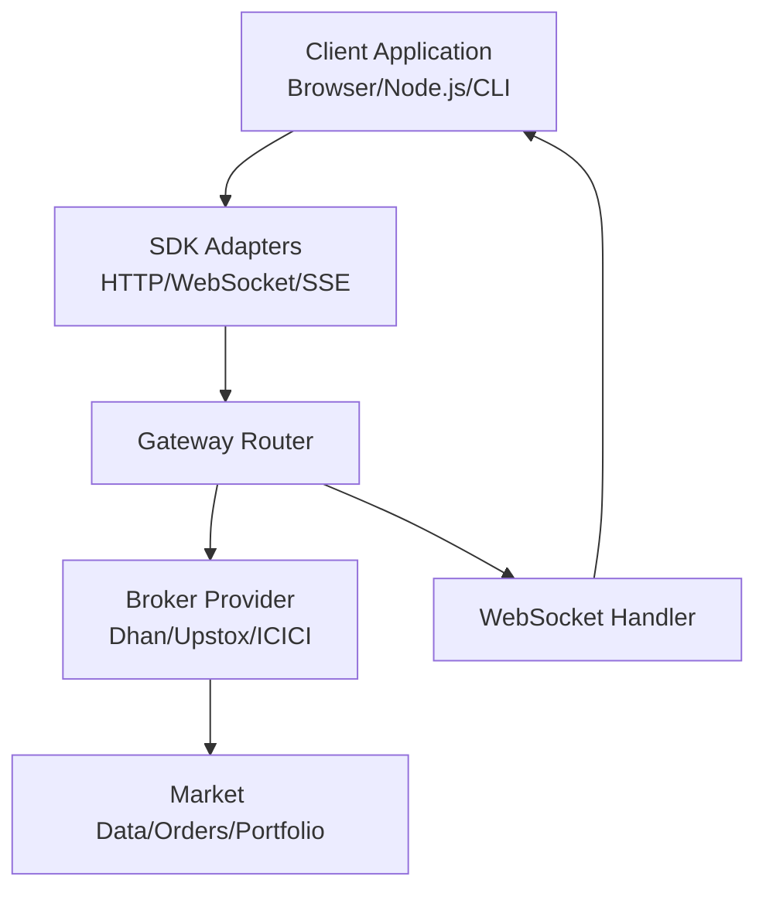
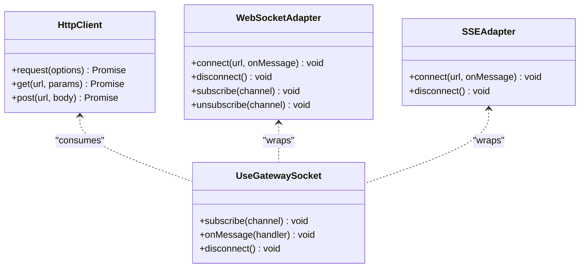
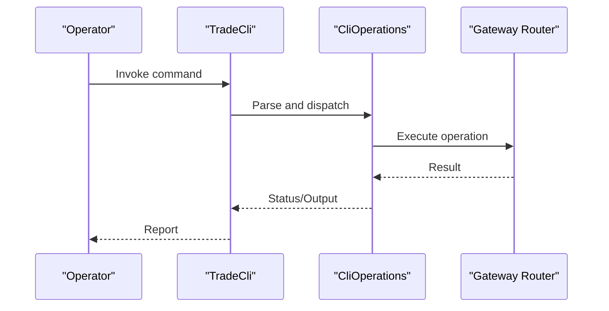
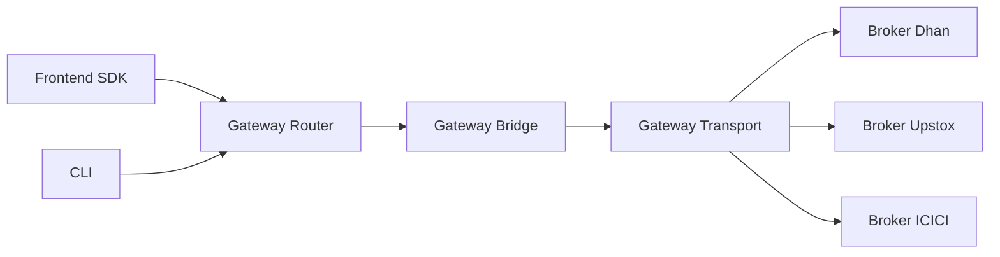

# Client Libraries and SDKs

<cite>
**Referenced Files in This Document**
- [README.md](file://README.md)
- [CLI.md](file://CLI.md)
- [docs/API_DOCUMENTATION.md](file://docs/API_DOCUMENTATION.md)
- [docs/USAGE_GUIDE.md](file://docs/USAGE_GUIDE.md)
- [docs/openapi.yaml](file://docs/openapi.yaml)
- [archive/frontend/src/api/client.ts](file://archive/frontend/src/api/client.ts)
- [archive/frontend/src/api/websocket.ts](file://archive/frontend/src/api/websocket.ts)
- [archive/frontend/src/api/sse.ts](file://archive/frontend/src/api/sse.ts)
- [frontend/src/app/TerminalApp.tsx](file://frontend/src/app/TerminalApp.tsx)
- [frontend/src/hooks/useGatewaySocket.ts](file://frontend/src/hooks/useGatewaySocket.ts)
- [app/src/main/resources/application.yml](file://app/src/main/resources/application.yml)
- [app/src/main/resources/application-dev.yml](file://app/src/main/resources/application-dev.yml)
- [app/src/main/resources/application-prod.yml](file://app/src/main/resources/application-prod.yml)
- [config/dhan-sandbox.properties.example](file://config/dhan-sandbox.properties.example)
- [config/upstox-sandbox.properties.example](file://config/upstox-sandbox.properties.example)
- [config/icici-local.properties.example](file://config/icici-local.properties.example)
- [scripts/dhan-smoke.sh](file://scripts/dhan-smoke.sh)
- [scripts/upstox-smoke.sh](file://scripts/upstox-smoke.sh)
- [scripts/refresh-dhan-token.sh](file://scripts/refresh-dhan-token.sh)
- [scripts/refresh-icici-session.sh](file://scripts/refresh-icici-session.sh)
- [scripts/refresh-upstox-token.sh](file://scripts/refresh-upstox-token.sh)
- [broker/dhan/README.md](file://broker/dhan/README.md)
- [broker/icici/README.md](file://broker/icici/README.md)
- [broker/upstox/README.md](file://broker/upstox/README.md)
- [gateway/src/main/java/com/tradej/gateway/websocket/WebSocketHandler.java](file://gateway/src/main/java/com/tradej/gateway/websocket/WebSocketHandler.java)
- [gateway/src/main/java/com/tradej/gateway/router/GatewayRouter.java](file://gateway/src/main/java/com/tradej/gateway/router/GatewayRouter.java)
- [gateway/src/main/java/com/tradej/gateway/bridge/Bridge.java](file://gateway/src/main/java/com/tradej/gateway/bridge/Bridge.java)
- [gateway/src/main/java/com/tradej/gateway/transport/Transport.java](file://gateway/src/main/java/com/tradej/gateway/transport/Transport.java)
- [broker-gateway/src/main/java/com/tradej/brokergateway/BrokerGateway.java](file://broker-gateway/src/main/java/com/tradej/brokergateway/BrokerGateway.java)
- [core/src/main/java/com/tradej/core/domain/model/Instrument.java](file://core/src/main/java/com/tradej/core/domain/model/Instrument.java)
- [core/src/main/java/com/tradej/core/domain/model/Order.java](file://core/src/main/java/com/tradej/core/domain/model/Order.java)
- [core/src/main/java/com/tradej/core/domain/model/Position.java](file://core/src/main/java/com/tradej/core/domain/model/Position.java)
- [core/src/main/java/com/tradej/core/domain/model/Portfolio.java](file://core/src/main/java/com/tradej/core/domain/model/Portfolio.java)
- [core/src/main/java/com/tradej/core/domain/model/MarketData.java](file://core/src/main/java/com/tradej/core/domain/model/MarketData.java)
- [core/src/main/java/com/tradej/core/domain/model/Trade.java](file://core/src/main/java/com/tradej/core/domain/model/Trade.java)
- [cli/src/main/java/com/tradej/cli/CliOperations.java](file://cli/src/main/java/com/tradej/cli/CliOperations.java)
- [cli/src/main/java/com/tradej/cli/command/Command.java](file://cli/src/main/java/com/tradej/cli/command/Command.java)
- [cli/src/main/java/com/tradej/cli/TradeCli.java](file://cli/src/main/java/com/tradej/cli/TradeCli.java)
</cite>

## Table of Contents
1. [Introduction](#introduction)
2. [Project Structure](#project-structure)
3. [Core Components](#core-components)
4. [Architecture Overview](#architecture-overview)
5. [Detailed Component Analysis](#detailed-component-analysis)
6. [Dependency Analysis](#dependency-analysis)
7. [Performance Considerations](#performance-considerations)
8. [Troubleshooting Guide](#troubleshooting-guide)
9. [Conclusion](#conclusion)
10. [Appendices](#appendices)

## Introduction
This document describes client library and SDK consumption patterns for Trade-J, focusing on:
- JavaScript/TypeScript client SDKs for browser and Node.js environments
- CLI tools for operational tasks and automation
- Integration patterns across brokers (Dhan, Upstox, ICICI)
- Authentication, initialization, installation, and usage examples
- Advanced topics: batch operations, error handling, retry mechanisms, and performance optimization

Trade-J exposes a unified gateway and broker abstraction that enables clients to consume market data, place orders, manage positions, and subscribe to real-time feeds via WebSocket and Server-Sent Events (SSE).

## Project Structure
The repository organizes client-facing components across:
- Frontend SDK (TypeScript) under archive/frontend and frontend
- CLI tools under cli
- Broker integrations under broker/*
- Gateway and routing under gateway
- Core domain models under core

```mermaid
graph TB
subgraph "Client SDKs"
FE_SDK["archive/frontend/src/api/*"]
TS_SDK["frontend/src/app/*"]
end
subgraph "Gateway"
GW_WS["gateway/websocket"]
GW_RT["gateway/router"]
GW_BR["gateway/bridge"]
GW_TP["gateway/transport"]
end
subgraph "Brokers"
BR_DHN["broker/dhan"]
BR_UST["broker/upstox"]
BR_ICI["broker/icici"]
end
subgraph "CLI"
CLI["cli/*"]
end
FE_SDK --> GW_RT
TS_SDK --> GW_WS
GW_RT --> GW_BR
GW_BR --> GW_TP
GW_TP --> BR_DHN
GW_TP --> BR_UST
GW_TP --> BR_ICI
CLI --> GW_RT
```

**Diagram sources**
- [archive/frontend/src/api/client.ts](file://archive/frontend/src/api/client.ts)
- [frontend/src/app/TerminalApp.tsx](file://frontend/src/app/TerminalApp.tsx)
- [gateway/src/main/java/com/tradej/gateway/router/GatewayRouter.java](file://gateway/src/main/java/com/tradej/gateway/router/GatewayRouter.java)
- [gateway/src/main/java/com/tradej/gateway/bridge/Bridge.java](file://gateway/src/main/java/com/tradej/gateway/bridge/Bridge.java)
- [gateway/src/main/java/com/tradej/gateway/transport/Transport.java](file://gateway/src/main/java/com/tradej/gateway/transport/Transport.java)
- [broker/dhan/README.md](file://broker/dhan/README.md)
- [broker/upstox/README.md](file://broker/upstox/README.md)
- [broker/icici/README.md](file://broker/icici/README.md)
- [cli/src/main/java/com/tradej/cli/TradeCli.java](file://cli/src/main/java/com/tradej/cli/TradeCli.java)

**Section sources**
- [README.md](file://README.md)
- [docs/USAGE_GUIDE.md](file://docs/USAGE_GUIDE.md)

## Core Components
- TypeScript/JavaScript client SDKs:
  - HTTP client and WebSocket/SSE adapters for real-time data
  - Hooks and application integration points
- CLI tools:
  - Command-line interface for operational tasks and smoke tests
- Gateway and broker abstraction:
  - Routing, bridging, and transport layers connecting to broker providers
- Configuration and environment profiles:
  - Sandbox and local property files for broker credentials and endpoints

Key implementation anchors:
- Frontend HTTP client and adapters: [archive/frontend/src/api/client.ts](file://archive/frontend/src/api/client.ts), [archive/frontend/src/api/websocket.ts](file://archive/frontend/src/api/websocket.ts), [archive/frontend/src/api/sse.ts](file://archive/frontend/src/api/sse.ts)
- Frontend integration hook: [frontend/src/hooks/useGatewaySocket.ts](file://frontend/src/hooks/useGatewaySocket.ts)
- Gateway router and handler: [gateway/src/main/java/com/tradej/gateway/router/GatewayRouter.java](file://gateway/src/main/java/com/tradej/gateway/router/GatewayRouter.java), [gateway/src/main/java/com/tradej/gateway/websocket/WebSocketHandler.java](file://gateway/src/main/java/com/tradej/gateway/websocket/WebSocketHandler.java)
- Broker integration READMEs: [broker/dhan/README.md](file://broker/dhan/README.md), [broker/upstox/README.md](file://broker/upstox/README.md), [broker/icici/README.md](file://broker/icici/README.md)
- CLI operations: [cli/src/main/java/com/tradej/cli/CliOperations.java](file://cli/src/main/java/com/tradej/cli/CliOperations.java), [cli/src/main/java/com/tradej/cli/TradeCli.java](file://cli/src/main/java/com/tradej/cli/TradeCli.java)

**Section sources**
- [archive/frontend/src/api/client.ts](file://archive/frontend/src/api/client.ts)
- [archive/frontend/src/api/websocket.ts](file://archive/frontend/src/api/websocket.ts)
- [archive/frontend/src/api/sse.ts](file://archive/frontend/src/api/sse.ts)
- [frontend/src/hooks/useGatewaySocket.ts](file://frontend/src/hooks/useGatewaySocket.ts)
- [gateway/src/main/java/com/tradej/gateway/router/GatewayRouter.java](file://gateway/src/main/java/com/tradej/gateway/router/GatewayRouter.java)
- [gateway/src/main/java/com/tradej/gateway/websocket/WebSocketHandler.java](file://gateway/src/main/java/com/tradej/gateway/websocket/WebSocketHandler.java)
- [broker/dhan/README.md](file://broker/dhan/README.md)
- [broker/upstox/README.md](file://broker/upstox/README.md)
- [broker/icici/README.md](file://broker/icici/README.md)
- [cli/src/main/java/com/tradej/cli/CliOperations.java](file://cli/src/main/java/com/tradej/cli/CliOperations.java)
- [cli/src/main/java/com/tradej/cli/TradeCli.java](file://cli/src/main/java/com/tradej/cli/TradeCli.java)

## Architecture Overview
Trade-J’s client-facing architecture connects applications to broker providers through a central gateway. Clients can:
- Use HTTP endpoints for REST-like operations
- Subscribe to real-time streams via WebSocket and SSE
- Orchestrate commands through the CLI for operational tasks



**Diagram sources**
- [archive/frontend/src/api/client.ts](file://archive/frontend/src/api/client.ts)
- [archive/frontend/src/api/websocket.ts](file://archive/frontend/src/api/websocket.ts)
- [archive/frontend/src/api/sse.ts](file://archive/frontend/src/api/sse.ts)
- [gateway/src/main/java/com/tradej/gateway/router/GatewayRouter.java](file://gateway/src/main/java/com/tradej/gateway/router/GatewayRouter.java)
- [gateway/src/main/java/com/tradej/gateway/websocket/WebSocketHandler.java](file://gateway/src/main/java/com/tradej/gateway/websocket/WebSocketHandler.java)
- [broker/dhan/README.md](file://broker/dhan/README.md)
- [broker/upstox/README.md](file://broker/upstox/README.md)
- [broker/icici/README.md](file://broker/icici/README.md)

## Detailed Component Analysis

### JavaScript/TypeScript Client SDKs
The frontend SDK provides:
- HTTP client for REST-like operations
- WebSocket adapter for real-time market data and order updates
- SSE adapter for server-sent events
- React hooks for socket lifecycle management



**Diagram sources**
- [archive/frontend/src/api/client.ts](file://archive/frontend/src/api/client.ts)
- [archive/frontend/src/api/websocket.ts](file://archive/frontend/src/api/websocket.ts)
- [archive/frontend/src/api/sse.ts](file://archive/frontend/src/api/sse.ts)
- [frontend/src/hooks/useGatewaySocket.ts](file://frontend/src/hooks/useGatewaySocket.ts)

Implementation highlights:
- HTTP client encapsulates request construction and response parsing
- WebSocket adapter manages connection lifecycle and channel subscriptions
- SSE adapter handles streaming updates from the gateway
- React hook orchestrates subscription and cleanup

**Section sources**
- [archive/frontend/src/api/client.ts](file://archive/frontend/src/api/client.ts)
- [archive/frontend/src/api/websocket.ts](file://archive/frontend/src/api/websocket.ts)
- [archive/frontend/src/api/sse.ts](file://archive/frontend/src/api/sse.ts)
- [frontend/src/hooks/useGatewaySocket.ts](file://frontend/src/hooks/useGatewaySocket.ts)
- [frontend/src/app/TerminalApp.tsx](file://frontend/src/app/TerminalApp.tsx)

### CLI Tools
The CLI provides operational commands for:
- Broker token/session refresh
- Smoke testing and connectivity checks
- Standalone tasks and automation



**Diagram sources**
- [cli/src/main/java/com/tradej/cli/TradeCli.java](file://cli/src/main/java/com/tradej/cli/TradeCli.java)
- [cli/src/main/java/com/tradej/cli/CliOperations.java](file://cli/src/main/java/com/tradej/cli/CliOperations.java)
- [gateway/src/main/java/com/tradej/gateway/router/GatewayRouter.java](file://gateway/src/main/java/com/tradej/gateway/router/GatewayRouter.java)

Operational scripts:
- Dhan token refresh: [scripts/refresh-dhan-token.sh](file://scripts/refresh-dhan-token.sh)
- ICICI session refresh: [scripts/refresh-icici-session.sh](file://scripts/refresh-icici-session.sh)
- Upstox token refresh: [scripts/refresh-upstox-token.sh](file://scripts/refresh-upstox-token.sh)
- Smoke tests: [scripts/dhan-smoke.sh](file://scripts/dhan-smoke.sh), [scripts/upstox-smoke.sh](file://scripts/upstox-smoke.sh)

**Section sources**
- [cli/src/main/java/com/tradej/cli/TradeCli.java](file://cli/src/main/java/com/tradej/cli/TradeCli.java)
- [cli/src/main/java/com/tradej/cli/CliOperations.java](file://cli/src/main/java/com/tradej/cli/CliOperations.java)
- [scripts/refresh-dhan-token.sh](file://scripts/refresh-dhan-token.sh)
- [scripts/refresh-icici-session.sh](file://scripts/refresh-icici-session.sh)
- [scripts/refresh-upstox-token.sh](file://scripts/refresh-upstox-token.sh)
- [scripts/dhan-smoke.sh](file://scripts/dhan-smoke.sh)
- [scripts/upstox-smoke.sh](file://scripts/upstox-smoke.sh)

### Authentication Setup
Authentication is provider-specific and configured via property files and environment variables. Example sandbox configurations:
- Dhan sandbox: [config/dhan-sandbox.properties.example](file://config/dhan-sandbox.properties.example)
- Upstox sandbox: [config/upstox-sandbox.properties.example](file://config/upstox-sandbox.properties.example)
- ICICI local: [config/icici-local.properties.example](file://config/icici-local.properties.example)

Initialization steps:
- Set broker credentials and endpoints in the appropriate properties file
- Load configuration at application startup using Spring profiles
- Use CLI scripts to refresh tokens/sessions when needed

**Section sources**
- [config/dhan-sandbox.properties.example](file://config/dhan-sandbox.properties.example)
- [config/upstox-sandbox.properties.example](file://config/upstox-sandbox.properties.example)
- [config/icici-local.properties.example](file://config/icici-local.properties.example)
- [app/src/main/resources/application.yml](file://app/src/main/resources/application.yml)
- [app/src/main/resources/application-dev.yml](file://app/src/main/resources/application-dev.yml)
- [app/src/main/resources/application-prod.yml](file://app/src/main/resources/application-prod.yml)

### Installation and Initialization Procedures
- Frontend SDK:
  - Install dependencies and import the SDK modules
  - Initialize the HTTP client with base URL and headers
  - Configure WebSocket/SSE adapters with broker-specific endpoints
- CLI:
  - Build or install the CLI tool
  - Configure broker properties and environment
  - Run commands for token/session refresh and smoke tests

References:
- SDK entry points: [archive/frontend/src/api/client.ts](file://archive/frontend/src/api/client.ts), [archive/frontend/src/api/websocket.ts](file://archive/frontend/src/api/websocket.ts), [archive/frontend/src/api/sse.ts](file://archive/frontend/src/api/sse.ts)
- CLI entry point: [cli/src/main/java/com/tradej/cli/TradeCli.java](file://cli/src/main/java/com/tradej/cli/TradeCli.java)

**Section sources**
- [archive/frontend/src/api/client.ts](file://archive/frontend/src/api/client.ts)
- [archive/frontend/src/api/websocket.ts](file://archive/frontend/src/api/websocket.ts)
- [archive/frontend/src/api/sse.ts](file://archive/frontend/src/api/sse.ts)
- [cli/src/main/java/com/tradej/cli/TradeCli.java](file://cli/src/main/java/com/tradej/cli/TradeCli.java)

### Usage Examples
- Browser/Node.js:
  - Initialize HTTP client and adapters
  - Subscribe to market data channels via WebSocket
  - Handle SSE events for real-time updates
- CLI:
  - Execute token refresh commands
  - Run smoke tests to validate connectivity

References:
- WebSocket usage: [archive/frontend/src/api/websocket.ts](file://archive/frontend/src/api/websocket.ts)
- SSE usage: [archive/frontend/src/api/sse.ts](file://archive/frontend/src/api/sse.ts)
- CLI commands: [cli/src/main/java/com/tradej/cli/CliOperations.java](file://cli/src/main/java/com/tradej/cli/CliOperations.java)

**Section sources**
- [archive/frontend/src/api/websocket.ts](file://archive/frontend/src/api/websocket.ts)
- [archive/frontend/src/api/sse.ts](file://archive/frontend/src/api/sse.ts)
- [cli/src/main/java/com/tradej/cli/CliOperations.java](file://cli/src/main/java/com/tradej/cli/CliOperations.java)

### Advanced Features
- Batch operations:
  - Group multiple requests using the HTTP client
  - Use bulk subscribe/unsubscribe via WebSocket adapter
- Error handling:
  - Centralized HTTP error mapping and retries
  - WebSocket/SSE reconnection strategies
- Retry mechanisms:
  - Exponential backoff for transient failures
  - Idempotent request handling where applicable
- Performance optimization:
  - Connection pooling and keep-alive
  - Efficient subscription management and event throttling

References:
- HTTP client and adapters: [archive/frontend/src/api/client.ts](file://archive/frontend/src/api/client.ts), [archive/frontend/src/api/websocket.ts](file://archive/frontend/src/api/websocket.ts), [archive/frontend/src/api/sse.ts](file://archive/frontend/src/api/sse.ts)

**Section sources**
- [archive/frontend/src/api/client.ts](file://archive/frontend/src/api/client.ts)
- [archive/frontend/src/api/websocket.ts](file://archive/frontend/src/api/websocket.ts)
- [archive/frontend/src/api/sse.ts](file://archive/frontend/src/api/sse.ts)

## Dependency Analysis
Trade-J’s client stack exhibits layered dependencies:
- Frontend SDK depends on HTTP/WebSocket/SSE adapters
- Adapters depend on the gateway router
- Gateway router bridges to broker providers
- CLI depends on gateway router for operational commands



**Diagram sources**
- [archive/frontend/src/api/client.ts](file://archive/frontend/src/api/client.ts)
- [gateway/src/main/java/com/tradej/gateway/router/GatewayRouter.java](file://gateway/src/main/java/com/tradej/gateway/router/GatewayRouter.java)
- [gateway/src/main/java/com/tradej/gateway/bridge/Bridge.java](file://gateway/src/main/java/com/tradej/gateway/bridge/Bridge.java)
- [gateway/src/main/java/com/tradej/gateway/transport/Transport.java](file://gateway/src/main/java/com/tradej/gateway/transport/Transport.java)
- [broker/dhan/README.md](file://broker/dhan/README.md)
- [broker/upstox/README.md](file://broker/upstox/README.md)
- [broker/icici/README.md](file://broker/icici/README.md)
- [cli/src/main/java/com/tradej/cli/TradeCli.java](file://cli/src/main/java/com/tradej/cli/TradeCli.java)

**Section sources**
- [gateway/src/main/java/com/tradej/gateway/router/GatewayRouter.java](file://gateway/src/main/java/com/tradej/gateway/router/GatewayRouter.java)
- [gateway/src/main/java/com/tradej/gateway/bridge/Bridge.java](file://gateway/src/main/java/com/tradej/gateway/bridge/Bridge.java)
- [gateway/src/main/java/com/tradej/gateway/transport/Transport.java](file://gateway/src/main/java/com/tradej/gateway/transport/Transport.java)
- [broker/dhan/README.md](file://broker/dhan/README.md)
- [broker/upstox/README.md](file://broker/upstox/README.md)
- [broker/icici/README.md](file://broker/icici/README.md)
- [cli/src/main/java/com/tradej/cli/TradeCli.java](file://cli/src/main/java/com/tradej/cli/TradeCli.java)

## Performance Considerations
- Minimize connection churn by reusing WebSocket/SSE connections
- Batch subscriptions and unsubscribe unused channels
- Apply throttling for high-frequency updates
- Use connection keep-alive and ping/pong for reliability
- Prefer server-side filtering to reduce payload sizes

[No sources needed since this section provides general guidance]

## Troubleshooting Guide
Common issues and resolutions:
- Authentication failures:
  - Verify broker credentials in properties files
  - Use token/session refresh scripts
- Connectivity problems:
  - Check gateway router and broker provider status
  - Validate endpoint URLs and network access
- Real-time stream interruptions:
  - Reinitialize WebSocket/SSE adapters
  - Implement exponential backoff and re-subscription

References:
- Broker READMEs for provider-specific guidance: [broker/dhan/README.md](file://broker/dhan/README.md), [broker/upstox/README.md](file://broker/upstox/README.md), [broker/icici/README.md](file://broker/icici/README.md)
- Token/session refresh scripts: [scripts/refresh-dhan-token.sh](file://scripts/refresh-dhan-token.sh), [scripts/refresh-icici-session.sh](file://scripts/refresh-icici-session.sh), [scripts/refresh-upstox-token.sh](file://scripts/refresh-upstox-token.sh)

**Section sources**
- [broker/dhan/README.md](file://broker/dhan/README.md)
- [broker/upstox/README.md](file://broker/upstox/README.md)
- [broker/icici/README.md](file://broker/icici/README.md)
- [scripts/refresh-dhan-token.sh](file://scripts/refresh-dhan-token.sh)
- [scripts/refresh-icici-session.sh](file://scripts/refresh-icici-session.sh)
- [scripts/refresh-upstox-token.sh](file://scripts/refresh-upstox-token.sh)

## Conclusion
Trade-J offers a cohesive set of client libraries and tools enabling robust integration with multiple broker providers. The frontend SDK provides flexible HTTP, WebSocket, and SSE adapters, while the CLI supports operational automation. Proper configuration, authentication, and adherence to best practices for error handling and performance ensure reliable client-side consumption of Trade-J APIs.

[No sources needed since this section summarizes without analyzing specific files]

## Appendices
- API documentation and usage guide:
  - [docs/API_DOCUMENTATION.md](file://docs/API_DOCUMENTATION.md)
  - [docs/USAGE_GUIDE.md](file://docs/USAGE_GUIDE.md)
  - [docs/openapi.yaml](file://docs/openapi.yaml)
- Broker capability and integration notes:
  - [broker/dhan/README.md](file://broker/dhan/README.md)
  - [broker/upstox/README.md](file://broker/upstox/README.md)
  - [broker/icici/README.md](file://broker/icici/README.md)

**Section sources**
- [docs/API_DOCUMENTATION.md](file://docs/API_DOCUMENTATION.md)
- [docs/USAGE_GUIDE.md](file://docs/USAGE_GUIDE.md)
- [docs/openapi.yaml](file://docs/openapi.yaml)
- [broker/dhan/README.md](file://broker/dhan/README.md)
- [broker/upstox/README.md](file://broker/upstox/README.md)
- [broker/icici/README.md](file://broker/icici/README.md)