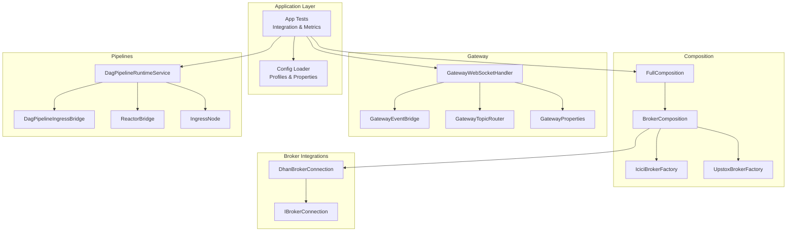
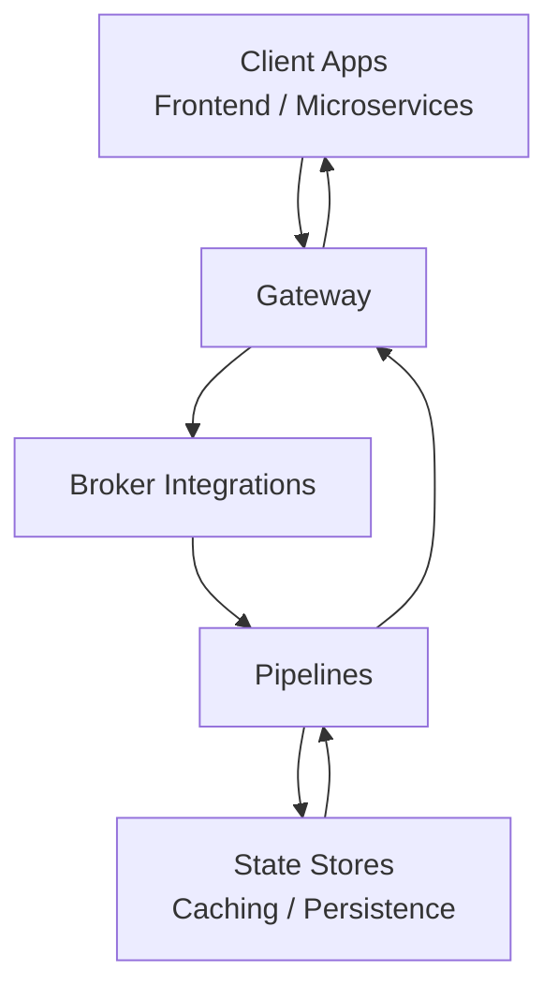
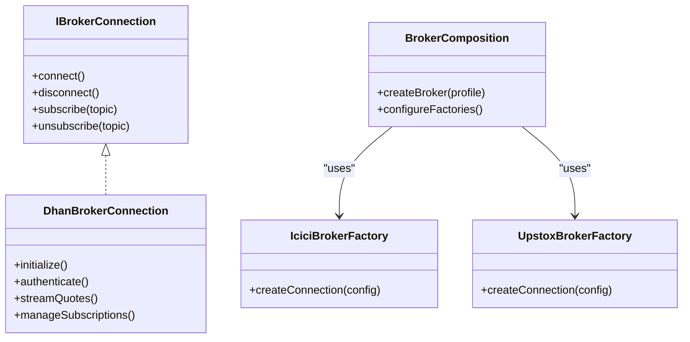
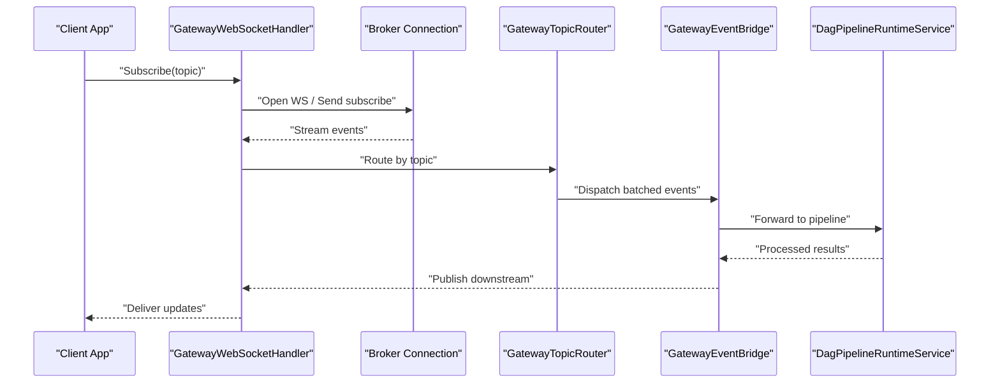
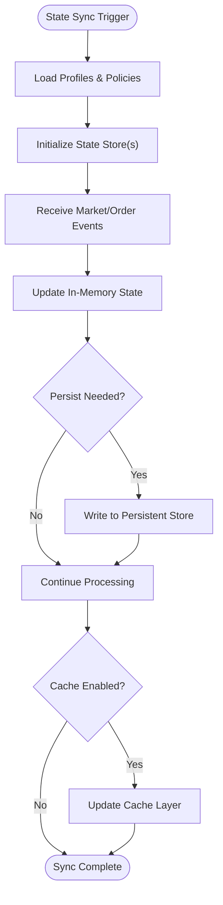
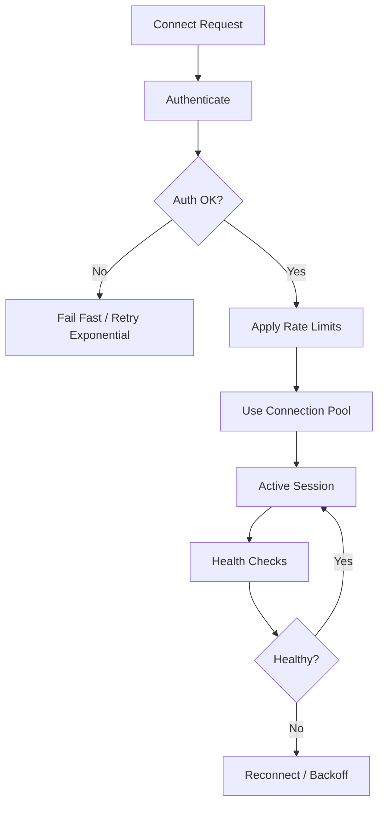
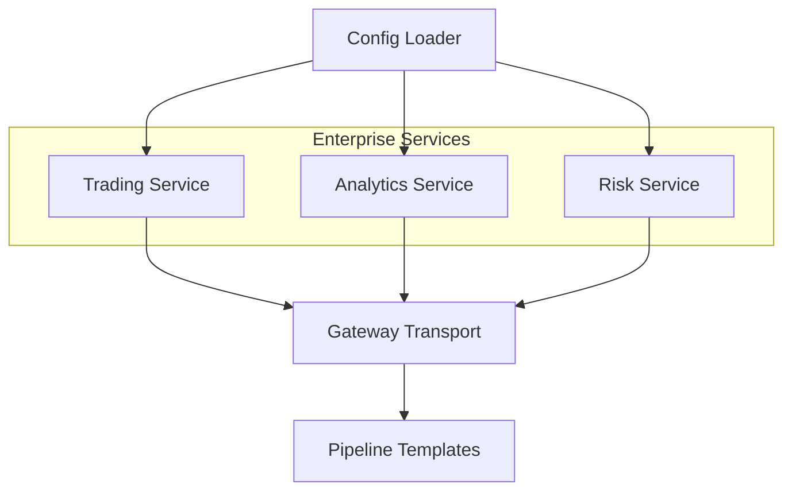
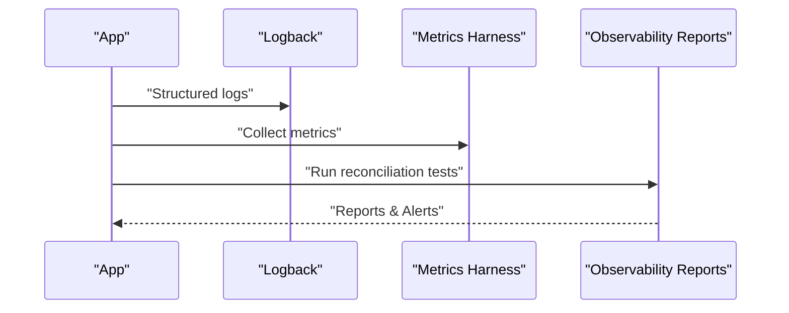
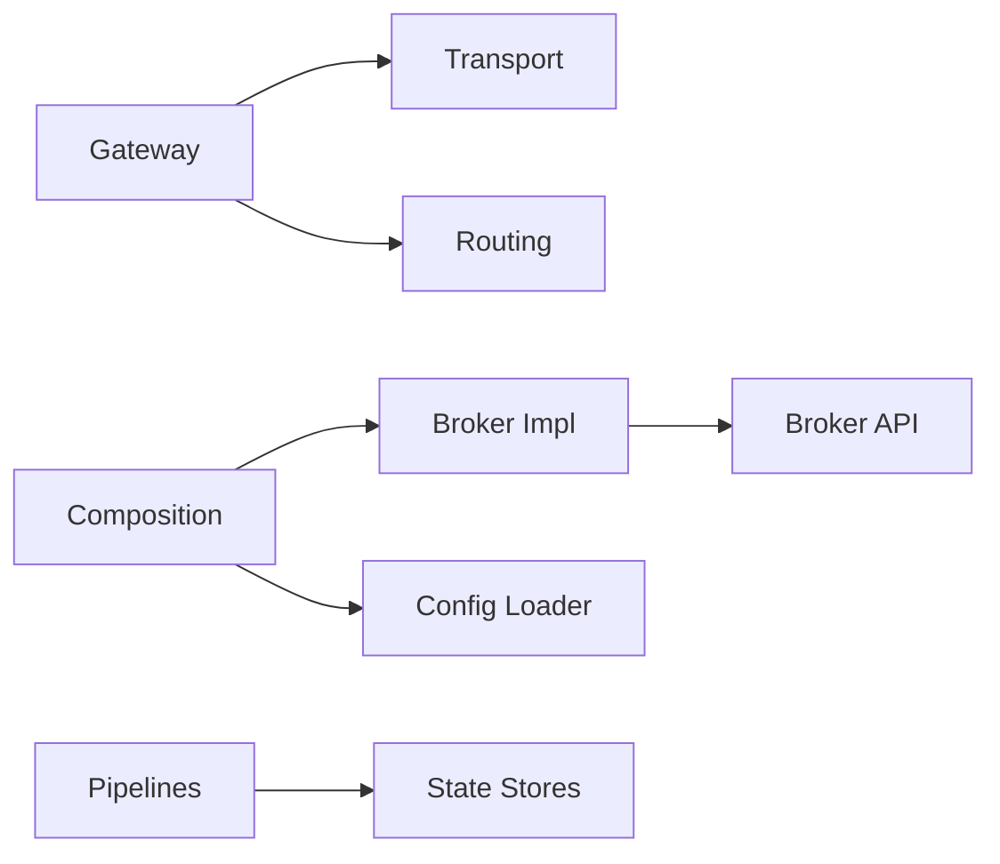

# Integration Patterns and Best Practices

<cite>
**Referenced Files in This Document**
- [README.md](file://README.md)
- [ARCHITECTURE.md](file://ARCHITECTURE.md)
- [TRADEJ_ARCHITECTURE_CLASS_FLOWS_REPORT.md](file://TRADEJ_ARCHITECTURE_CLASS_FLOWS_REPORT.md)
- [BROKER_GATEWAY_ARCHITECTURE_REVIEW.md](file://docs/BROKER_GATEWAY_ARCHITECTURE_REVIEW.md)
- [PIPELINE_DESIGN.md](file://docs/PIPELINE_DESIGN.md)
- [HORIZONTAL_SCALING_DESIGN.md](file://docs/HORIZONTAL_SCALING_DESIGN.md)
- [UPSTOX_API_GAP_ANALYSIS.md](file://docs/UPSTOX_API_GAP_ANALYSIS.md)
- [BROKER_CAPABILITY_MATRIX.md](file://docs/BROKER_CAPABILITY_MATRIX.md)
- [USAGE_GUIDE.md](file://docs/USAGE_GUIDE.md)
- [API_DOCUMENTATION.md](file://docs/API_DOCUMENTATION.md)
- [IBrokerConnection.java](file://broker/api/src/main/java/com/tradej/broker/api/IBrokerConnection.java)
- [DhanBrokerConnection.java](file://broker/dhan/src/main/java/com/tradej/broker/dhan/DhanBrokerConnection.java)
- [GatewayWebSocketHandler.java](file://gateway/src/main/java/com/tradej/gateway/websocket/GatewayWebSocketHandler.java)
- [GatewayEventBridge.java](file://gateway/src/main/java/com/tradej/gateway/bridge/GatewayEventBridge.java)
- [GatewayTopicRouter.java](file://gateway/src/main/java/com/tradej/gateway/router/GatewayTopicRouter.java)
- [GatewayProperties.java](file://gateway/src/main/java/com/tradej/gateway/config/GatewayProperties.java)
- [SpringWebSocketTransport.java](file://gateway/src/main/java/com/tradej/gateway/transport/SpringWebSocketTransport.java)
- [FullComposition.java](file://composition/src/main/java/com/tradej/composition/FullComposition.java)
- [BrokerComposition.java](file://composition/src/main/java/com/tradej/composition/BrokerComposition.java)
- [IciciBrokerFactory.java](file://composition/src/main/java/com/tradej/composition/IciciBrokerFactory.java)
- [UpstoxBrokerFactory.java](file://composition/src/main/java/com/tradej/composition/UpstoxBrokerFactory.java)
- [DagPipelineRuntimeService.java](file://pipeline/runtime/src/main/java/com/tradej/pipeline/service/DagPipelineRuntimeService.java)
- [DagPipelineIngressBridge.java](file://pipeline/runtime/src/main/java/com/tradej/pipeline/service/DagPipelineIngressBridge.java)
- [ReactorBridge.java](file://pipeline/core/src/main/java/com/tradej/pipeline/runtime/ReactorBridge.java)
- [IngressNode.java](file://pipeline/core/src/main/java/com/tradej/pipeline/runtime/IngressNode.java)
- [PipelineRuntime.java](file://pipeline/core/src/main/java/com/tradej/pipeline/runtime/PipelineRuntime.java)
- [PipelineTemplateService.java](file://pipeline/platform/trade-pipeline-platform/src/main/java/com/tradej/pipeline/platform/PipelineTemplateService.java)
- [PipelineDefinition.java](file://pipeline/platform/trade-pipeline-platform/src/main/java/com/tradej/pipeline/platform/PipelineDefinition.java)
- [GatewayEventBridgeAllocationTest.java](file://gateway/src/test/java/com/tradej/gateway/bridge/GatewayEventBridgeAllocationTest.java)
- [GatewayEventBridgeIntegrationTest.java](file://gateway/src/test/java/com/tradej/gateway/bridge/GatewayEventBridgeIntegrationTest.java)
- [GatewayTopicRouterConcurrencyTest.java](file://gateway/src/test/java/com/tradej/gateway/router/GatewayTopicRouterConcurrencyTest.java)
- [GatewayTopicRouterIsolationTest.java](file://gateway/src/test/java/com/tradej/gateway/router/GatewayTopicRouterIsolationTest.java)
- [GatewayWebSocketLifecycleTest.java](file://app/src/test/java/com/tradej/app/integration/GatewayWebSocketLifecycleTest.java)
- [DhanMarketFeedWebSocketIntegrationTest.java](file://app/src/test/java/com/tradej/app/integration/DhanMarketFeedWebSocketIntegrationTest.java)
- [IciciMarketFeedIntegrationTest.java](file://app/src/test/java/com/tradej/app/integration/IciciMarketFeedIntegrationTest.java)
- [UpstoxMarketFeedIntegrationTest.java](file://app/src/test/java/com/tradej/app/integration/UpstoxMarketFeedIntegrationTest.java)
- [BrokerGatewayLiveConnectionTest.java](file://app/src/test/java/com/tradej/app/integration/BrokerGatewayLiveConnectionTest.java)
- [BrokerExplorerTest.java](file://broker-gateway/src/test/java/com/tradej/brokergateway/BrokerExplorerTest.java)
- [BrokerRouterTest.java](file://broker-gateway/src/test/java/com/tradej/brokergateway/BrokerRouterTest.java)
- [BrokerHandleTest.java](file://broker-gateway/src/test/java/com/tradej/brokergateway/BrokerHandleTest.java)
- [BrokerHandleInvokeTest.java](file://broker-gateway/src/test/java/com/tradej/brokergateway/BrokerHandleInvokeTest.java)
- [BrokerHandleAdvancedTest.java](file://broker-gateway/src/test/java/com/tradej/brokergateway/BrokerHandleAdvancedTest.java)
- [BrokerHandleRawCaptureTest.java](file://broker-gateway/src/test/java/com/tradej/brokergateway/BrokerHandleRawCaptureTest.java)
- [BrokerCertificationTest.java](file://broker-gateway/src/test/java/com/tradej/brokergateway/BrokerCertificationTest.java)
- [DhanKillSwitchIntegrationTest.java](file://app/src/test/java/com/tradej/app/integration/DhanKillSwitchIntegrationTest.java)
- [DhanMarginIntegrationTest.java](file://app/src/test/java/com/tradej/app/integration/DhanMarginIntegrationTest.java)
- [DhanOrderLifecycleIntegrationTest.java](file://app/src/test/java/com/tradej/app/integration/DhanOrderLifecycleIntegrationTest.java)
- [DhanPortfolioIntegrationTest.java](file://app/src/test/java/com/tradej/app/integration/DhanPortfolioIntegrationTest.java)
- [IciciOrderLifecycleIntegrationTest.java](file://app/src/test/java/com/tradej/app/integration/IciciOrderLifecycleIntegrationTest.java)
- [IciciPortfolioIntegrationTest.java](file://app/src/test/java/com/tradej/app/integration/IciciPortfolioIntegrationTest.java)
- [UpstoxOrderLifecycleIntegrationTest.java](file://app/src/test/java/com/tradej/app/integration/UpstoxOrderLifecycleIntegrationTest.java)
- [UpstoxPortfolioIntegrationTest.java](file://app/src/test/java/com/tradej/app/integration/UpstoxPortfolioIntegrationTest.java)
- [ObservableMarketDataProviderTest.java](file://app/src/test/java/com/tradej/app/metrics/ObservableMarketDataProviderTest.java)
- [ObservableOrderCommandTest.java](file://app/src/test/java/com/tradej/app/metrics/ObservableOrderCommandTest.java)
- [MetricsLoggerHarnessTest.java](file://app/src/test/java/com/tradej/app/metrics/MetricsLoggerHarnessTest.java)
- [TickReconciliationLiveSessionTest.java](file://app/src/test/java/com/tradej/app/metrics/TickReconciliationLiveSessionTest.java)
- [BrokerStartupOrchestratorAnalyticsTest.java](file://app/src/test/java/com/tradej/app/startup/BrokerStartupOrchestratorAnalyticsTest.java)
- [BrokerStartupValidatorTest.java](file://app/src/test/java/com/tradej/app/startup/BrokerStartupValidatorTest.java)
- [AdminRuntimeAndReconcileTest.java](file://app/src/test/java/com/tradej/app/integration/AdminRuntimeAndReconcileTest.java)
- [TradingRuntimeReconciliationIntegrationTest.java](file://app/src/test/java/com/tradej/app/integration/TradingRuntimeReconciliationIntegrationTest.java)
- [ReplayEndToEndCertificationTest.java](file://app/src/test/java/com/tradej/app/integration/ReplayEndToEndCertificationTest.java)
- [GatewayReplayCommandProcessor.java](file://gateway/src/main/java/com/tradej/gateway/websocket/GatewayReplayCommandProcessor.java)
- [GatewayBinaryCodec.java](file://gateway/src/main/java/com/tradej/gateway/protocol/GatewayBinaryCodec.java)
- [GatewayTopic.java](file://gateway/src/main/java/com/tradej/gateway/protocol/GatewayTopic.java)
- [GatewayProfile.java](file://composition/src/main/java/com/tradej/composition/config/GatewayProfile.java)
- [ConfigLoader.java](file://composition/src/main/java/com/tradej/composition/config/ConfigLoader.java)
- [RiskProfile.java](file://composition/src/main/java/com/tradej/composition/config/RiskProfile.java)
- [ScanProperties.java](file://composition/src/main/java/com/tradej/composition/config/ScanProperties.java)
- [StorageProfile.java](file://composition/src/main/java/com/tradej/composition/config/StorageProfile.java)
- [application.yml](file://app/src/main/resources/application.yml)
- [application-dev.yml](file://app/src/main/resources/application-dev.yml)
- [application-prod.yml](file://app/src/main/resources/application-prod.yml)
- [application-gateway.yml](file://app/src/main/resources/application-gateway.yml)
- [logback-spring.xml](file://app/src/main/resources/logback-spring.xml)
- [openapi.yaml](file://docs/openapi.yaml)
- [BROKER_INTEGRATION_AUDIT_REPORT.md](file://docs/BROKER_INTEGRATION_AUDIT_REPORT.md)
- [BROKER_HARDENING_PLAN.md](file://docs/BROKER_HARDENING_PLAN.md)
- [MULTI_ASSET_CLASS_REVIEW_2026-06-06.md](file://docs/reports/reports_broker_2026-06-08/13_MULTI_BROKER_ISOLATION_REPORT.md)
- [OBSERVABILITY_REPORT.md](file://docs/reports/reports_broker_2026-06-08/14_OBSERVABILITY_REPORT.md)
- [RATE_LIMIT_ANALYSIS.md](file://docs/reports/reports_broker_2026-06-08/08_RATE_LIMIT_ANALYSIS.md)
- [SUBSCRIPTION_MANAGEMENT_REPORT.md](file://docs/reports/reports_broker_2026-06-08/06_SUBSCRIPTION_MANAGEMENT_REPORT.md)
- [RESUBSCRIPTION_REPORT.md](file://docs/reports/reports_broker_2026-06-08/07_RESUBSCRIPTION_REPORT.md)
- [SCALING_REPORT.md](file://docs/reports/reports_broker_2026-06-08/05_SCALING_REPORT.md)
- [TERMINAL_SCALABILITY_REVIEW_2026-06-06.md](file://docs/TERMINAL_SCALABILITY_REVIEW_2026-06-06.md)
- [REACTIVE_ADOPTION_REVIEW_2026-06-06.md](file://docs/REACTIVE_ADOPTION_REVIEW_2026-06-06.md)
- [SIMULATION_REPLAY_BACKTEST_REVIEW_2026-06-06.md](file://docs/SIMULATION_REPLAY_BACKTEST_REVIEW_2026-06-06.md)
- [BROKER_GATEWAY_ARCHITECTURE_REVIEW_2026-06-06.md](file://docs/BROKER_GATEWAY_ARCHITECTURE_REVIEW_2026-06-06.md)
- [ARCHITECTURE_REVIEW_2026-06-06.md](file://docs/ARCHITECTURE_REVIEW_2026-06-06.md)
- [TEST_COVERAGE_CHAOS_REVIEW_2026-06-06.md](file://docs/TEST_COVERAGE_CHAOS_REVIEW_2026-06-06.md)
- [BROKER_CERTIFICATION_REPORT.md](file://docs/BROKER_CERTIFICATION_REPORT.md)
- [BROKER_GATEWAY_ARCHITECTURE_REVIEW.md](file://docs/BROKER_GATEWAY_ARCHITECTURE_REVIEW.md)
- [ENGINEERING_REPORT.md](file://docs/ENGINEERING_REPORT.md)
- [PRODUCTION_DEPLOYMENT.md](file://docs/PRODUCTION_DEPLOYMENT.md)
- [PRODUCTION_HARDENING_PLAN_2026-06-06.md](file://docs/PRODUCTION_HARDENING_PLAN_2026-06-06.md)
- [TRADEJ_INSTITUTIONAL_ARCHITECTURE.md](file://docs/TRADEJ_INSTITUTIONAL_ARCHITECTURE.md)
- [CONSOLE_SMOKE.md](file://docs/CONSOLE_SMOKE.md)
- [E2E_VERIFICATION.md](file://docs/E2E_VERIFICATION.md)
- [CODEBASE_LEAF_INDEX.md](file://docs/CODEBASE_LEAF_INDEX.md)
- [OPENAPI.md](file://docs/openapi.yaml)
- [BROKER_PROFILE.md](file://config/dhan-local.properties.example)
- [ICICI_LOCAL_PROPERTIES_EXAMPLE.md](file://config/icici-local.properties.example)
- [UPSTOX_LIVE_PROPERTIES_EXAMPLE.md](file://config/upstox-live.properties.example)
- [DHAN_SANDBOX_PROPERTIES_EXAMPLE.md](file://config/dhan-sandbox.properties.example)
</cite>

## Table of Contents
1. [Introduction](#introduction)
2. [Project Structure](#project-structure)
3. [Core Components](#core-components)
4. [Architecture Overview](#architecture-overview)
5. [Detailed Component Analysis](#detailed-component-analysis)
6. [Dependency Analysis](#dependency-analysis)
7. [Performance Considerations](#performance-considerations)
8. [Troubleshooting Guide](#troubleshooting-guide)
9. [Conclusion](#conclusion)
10. [Appendices](#appendices)

## Introduction
This document presents comprehensive integration patterns and best practices for Trade-J client libraries. It focuses on connecting multiple brokers, orchestrating concurrent operations, and implementing robust error handling. Advanced scenarios covered include multi-broker coordination, real-time data streaming, and event-driven architectures. We also address state synchronization, caching strategies, performance optimization, security, rate limiting, connection pooling, enterprise integration, microservices communication, distributed system patterns, and observability.

## Project Structure
Trade-J is organized into modular domains:
- Broker integrations (Dhan, ICICI, Upstox) under the broker module
- Gateway for transport and routing under gateway
- Composition layer for runtime wiring under composition
- Pipelines for reactive data processing under pipeline
- Application tests and configurations under app
- Documentation and reports under docs

**Diagram sources**
- [FullComposition.java:1-200](file://composition/src/main/java/com/tradej/composition/FullComposition.java#L1-L200)
- [BrokerComposition.java:1-200](file://composition/src/main/java/com/tradej/composition/BrokerComposition.java#L1-L200)
- [IciciBrokerFactory.java:1-200](file://composition/src/main/java/com/tradej/composition/IciciBrokerFactory.java#L1-L200)
- [UpstoxBrokerFactory.java:1-200](file://composition/src/main/java/com/tradej/composition/UpstoxBrokerFactory.java#L1-L200)
- [GatewayWebSocketHandler.java:1-200](file://gateway/src/main/java/com/tradej/gateway/websocket/GatewayWebSocketHandler.java#L1-L200)
- [GatewayEventBridge.java:1-200](file://gateway/src/main/java/com/tradej/gateway/bridge/GatewayEventBridge.java#L1-L200)
- [GatewayTopicRouter.java:1-200](file://gateway/src/main/java/com/tradej/gateway/router/GatewayTopicRouter.java#L1-L200)
- [GatewayProperties.java:1-200](file://gateway/src/main/java/com/tradej/gateway/config/GatewayProperties.java#L1-L200)
- [DhanBrokerConnection.java:1-200](file://broker/dhan/src/main/java/com/tradej/broker/dhan/DhanBrokerConnection.java#L1-L200)
- [IBrokerConnection.java:1-200](file://broker/api/src/main/java/com/tradej/broker/api/IBrokerConnection.java#L1-L200)
- [DagPipelineRuntimeService.java:1-200](file://pipeline/runtime/src/main/java/com/tradej/pipeline/service/DagPipelineRuntimeService.java#L1-L200)
- [DagPipelineIngressBridge.java:1-200](file://pipeline/runtime/src/main/java/com/tradej/pipeline/service/DagPipelineIngressBridge.java#L1-L200)
- [ReactorBridge.java:1-200](file://pipeline/core/src/main/java/com/tradej/pipeline/runtime/ReactorBridge.java#L1-L200)
- [IngressNode.java:1-200](file://pipeline/core/src/main/java/com/tradej/pipeline/runtime/IngressNode.java#L1-L200)

**Section sources**
- [README.md:1-200](file://README.md#L1-L200)
- [ARCHITECTURE.md:1-200](file://ARCHITECTURE.md#L1-L200)

## Core Components
Key integration components and their roles:
- Broker API and connections: Define contracts and concrete implementations for multiple brokers
- Gateway: Provides WebSocket transport, routing, and bridging for real-time streams
- Composition: Wires brokers, profiles, and runtime configuration
- Pipelines: Reactive processing engine for event-driven architectures
- Tests: Comprehensive integration coverage for multi-broker, streaming, and lifecycle scenarios

**Section sources**
- [IBrokerConnection.java:1-200](file://broker/api/src/main/java/com/tradej/broker/api/IBrokerConnection.java#L1-L200)
- [DhanBrokerConnection.java:1-200](file://broker/dhan/src/main/java/com/tradej/broker/dhan/DhanBrokerConnection.java#L1-L200)
- [GatewayWebSocketHandler.java:1-200](file://gateway/src/main/java/com/tradej/gateway/websocket/GatewayWebSocketHandler.java#L1-L200)
- [GatewayEventBridge.java:1-200](file://gateway/src/main/java/com/tradej/gateway/bridge/GatewayEventBridge.java#L1-L200)
- [GatewayTopicRouter.java:1-200](file://gateway/src/main/java/com/tradej/gateway/router/GatewayTopicRouter.java#L1-L200)
- [FullComposition.java:1-200](file://composition/src/main/java/com/tradej/composition/FullComposition.java#L1-L200)
- [DagPipelineRuntimeService.java:1-200](file://pipeline/runtime/src/main/java/com/tradej/pipeline/service/DagPipelineRuntimeService.java#L1-L200)

## Architecture Overview
Trade-J employs a layered architecture:
- Transport and routing via Gateway (WebSocket, binary codec, topic routing)
- Broker abstraction and implementations for Dhan, ICICI, Upstox
- Composition layer for runtime configuration and broker factories
- Pipelines for reactive, event-driven processing
- Extensive integration tests validating multi-broker, streaming, and operational scenarios

**Diagram sources**
- [GatewayWebSocketHandler.java:1-200](file://gateway/src/main/java/com/tradej/gateway/websocket/GatewayWebSocketHandler.java#L1-L200)
- [GatewayTopicRouter.java:1-200](file://gateway/src/main/java/com/tradej/gateway/router/GatewayTopicRouter.java#L1-L200)
- [GatewayBinaryCodec.java:1-200](file://gateway/src/main/java/com/tradej/gateway/protocol/GatewayBinaryCodec.java#L1-L200)
- [GatewayTopic.java:1-200](file://gateway/src/main/java/com/tradej/gateway/protocol/GatewayTopic.java#L1-L200)
- [DhanBrokerConnection.java:1-200](file://broker/dhan/src/main/java/com/tradej/broker/dhan/DhanBrokerConnection.java#L1-L200)
- [DagPipelineRuntimeService.java:1-200](file://pipeline/runtime/src/main/java/com/tradej/pipeline/service/DagPipelineRuntimeService.java#L1-L200)

## Detailed Component Analysis

### Broker Abstraction and Multi-Broker Coordination
Trade-J defines a broker interface and multiple implementations. The composition layer wires broker-specific factories and profiles, enabling multi-broker orchestration.

**Diagram sources**
- [IBrokerConnection.java:1-200](file://broker/api/src/main/java/com/tradej/broker/api/IBrokerConnection.java#L1-L200)
- [DhanBrokerConnection.java:1-200](file://broker/dhan/src/main/java/com/tradej/broker/dhan/DhanBrokerConnection.java#L1-L200)
- [BrokerComposition.java:1-200](file://composition/src/main/java/com/tradej/composition/BrokerComposition.java#L1-L200)
- [IciciBrokerFactory.java:1-200](file://composition/src/main/java/com/tradej/composition/IciciBrokerFactory.java#L1-L200)
- [UpstoxBrokerFactory.java:1-200](file://composition/src/main/java/com/tradej/composition/UpstoxBrokerFactory.java#L1-L200)

Best practices:
- Treat each broker as a pluggable component behind a common interface
- Centralize configuration via profiles and loaders
- Use factories to encapsulate broker-specific initialization and lifecycle

**Section sources**
- [IBrokerConnection.java:1-200](file://broker/api/src/main/java/com/tradej/broker/api/IBrokerConnection.java#L1-L200)
- [DhanBrokerConnection.java:1-200](file://broker/dhan/src/main/java/com/tradej/broker/dhan/DhanBrokerConnection.java#L1-L200)
- [BrokerComposition.java:1-200](file://composition/src/main/java/com/tradej/composition/BrokerComposition.java#L1-L200)
- [IciciBrokerFactory.java:1-200](file://composition/src/main/java/com/tradej/composition/IciciBrokerFactory.java#L1-L200)
- [UpstoxBrokerFactory.java:1-200](file://composition/src/main/java/com/tradej/composition/UpstoxBrokerFactory.java#L1-L200)

### Real-Time Streaming and Event-Driven Architecture
The Gateway handles WebSocket transport, binary codecs, and topic routing. Event bridging batches and forwards events to pipelines for reactive processing.

**Diagram sources**
- [GatewayWebSocketHandler.java:1-200](file://gateway/src/main/java/com/tradej/gateway/websocket/GatewayWebSocketHandler.java#L1-L200)
- [GatewayTopicRouter.java:1-200](file://gateway/src/main/java/com/tradej/gateway/router/GatewayTopicRouter.java#L1-L200)
- [GatewayEventBridge.java:1-200](file://gateway/src/main/java/com/tradej/gateway/bridge/GatewayEventBridge.java#L1-L200)
- [DagPipelineRuntimeService.java:1-200](file://pipeline/runtime/src/main/java/com/tradej/pipeline/service/DagPipelineRuntimeService.java#L1-L200)

Operational patterns:
- Use topic routing to isolate and scale subscriptions
- Batch events at the bridge to reduce overhead
- Employ reactive pipelines for backpressure and throughput

**Section sources**
- [GatewayWebSocketHandler.java:1-200](file://gateway/src/main/java/com/tradej/gateway/websocket/GatewayWebSocketHandler.java#L1-L200)
- [GatewayTopicRouter.java:1-200](file://gateway/src/main/java/com/tradej/gateway/router/GatewayTopicRouter.java#L1-L200)
- [GatewayEventBridge.java:1-200](file://gateway/src/main/java/com/tradej/gateway/bridge/GatewayEventBridge.java#L1-L200)
- [DagPipelineRuntimeService.java:1-200](file://pipeline/runtime/src/main/java/com/tradej/pipeline/service/DagPipelineRuntimeService.java#L1-L200)

### State Synchronization and Data Caching Strategies
State synchronization and caching are achieved through:
- Pipeline state stores for in-memory and persisted state
- Gateway replay processors for deterministic reprocessing
- Composition profiles controlling cache and storage policies

**Diagram sources**
- [FullComposition.java:1-200](file://composition/src/main/java/com/tradej/composition/FullComposition.java#L1-L200)
- [ConfigLoader.java:1-200](file://composition/src/main/java/com/tradej/composition/config/ConfigLoader.java#L1-L200)
- [GatewayReplayCommandProcessor.java:1-200](file://gateway/src/main/java/com/tradej/gateway/websocket/GatewayReplayCommandProcessor.java#L1-L200)

**Section sources**
- [FullComposition.java:1-200](file://composition/src/main/java/com/tradej/composition/FullComposition.java#L1-L200)
- [ConfigLoader.java:1-200](file://composition/src/main/java/com/tradej/composition/config/ConfigLoader.java#L1-L200)
- [GatewayReplayCommandProcessor.java:1-200](file://gateway/src/main/java/com/tradej/gateway/websocket/GatewayReplayCommandProcessor.java#L1-L200)

### Security, Rate Limiting, and Connection Pooling
Security and resilience patterns:
- Authentication flows per broker (Dhan, ICICI, Upstox)
- Resilience and circuit breaking in broker core
- Rate limiting and throttling controls
- Reconnection and backoff strategies

**Diagram sources**
- [DhanBrokerConnection.java:1-200](file://broker/dhan/src/main/java/com/tradej/broker/dhan/DhanBrokerConnection.java#L1-L200)
- [BrokerExplorerTest.java:1-200](file://broker-gateway/src/test/java/com/tradej/brokergateway/BrokerExplorerTest.java#L1-L200)
- [BrokerRouterTest.java:1-200](file://broker-gateway/src/test/java/com/tradej/brokergateway/BrokerRouterTest.java#L1-L200)

**Section sources**
- [DhanBrokerConnection.java:1-200](file://broker/dhan/src/main/java/com/tradej/broker/dhan/DhanBrokerConnection.java#L1-L200)
- [BrokerExplorerTest.java:1-200](file://broker-gateway/src/test/java/com/tradej/brokergateway/BrokerExplorerTest.java#L1-L200)
- [BrokerRouterTest.java:1-200](file://broker-gateway/src/test/java/com/tradej/brokergateway/BrokerRouterTest.java#L1-L200)

### Enterprise Integration and Microservices Communication
Patterns for enterprise environments:
- Centralized configuration via profiles and property loaders
- API documentation and OpenAPI definitions
- Gateway transport for inter-service messaging
- Pipeline templates for reusable workflows

**Diagram sources**
- [ConfigLoader.java:1-200](file://composition/src/main/java/com/tradej/composition/config/ConfigLoader.java#L1-L200)
- [PipelineTemplateService.java:1-200](file://pipeline/platform/trade-pipeline-platform/src/main/java/com/tradej/pipeline/platform/PipelineTemplateService.java#L1-L200)
- [openapi.yaml:1-200](file://docs/openapi.yaml#L1-L200)

**Section sources**
- [ConfigLoader.java:1-200](file://composition/src/main/java/com/tradej/composition/config/ConfigLoader.java#L1-L200)
- [PipelineTemplateService.java:1-200](file://pipeline/platform/trade-pipeline-platform/src/main/java/com/tradej/pipeline/platform/PipelineTemplateService.java#L1-L200)
- [openapi.yaml:1-200](file://docs/openapi.yaml#L1-L200)

### Monitoring, Logging, and Observability
Observability practices:
- Structured logging with Logback
- Metrics harnesses for market data and order commands
- Reconciliation tests for parity validation
- Gateway lifecycle and subscription load tests

**Diagram sources**
- [logback-spring.xml:1-200](file://app/src/main/resources/logback-spring.xml#L1-L200)
- [ObservableMarketDataProviderTest.java:1-200](file://app/src/test/java/com/tradej/app/metrics/ObservableMarketDataProviderTest.java#L1-L200)
- [ObservableOrderCommandTest.java:1-200](file://app/src/test/java/com/tradej/app/metrics/ObservableOrderCommandTest.java#L1-L200)
- [TickReconciliationLiveSessionTest.java:1-200](file://app/src/test/java/com/tradej/app/metrics/TickReconciliationLiveSessionTest.java#L1-L200)

**Section sources**
- [logback-spring.xml:1-200](file://app/src/main/resources/logback-spring.xml#L1-L200)
- [ObservableMarketDataProviderTest.java:1-200](file://app/src/test/java/com/tradej/app/metrics/ObservableMarketDataProviderTest.java#L1-L200)
- [ObservableOrderCommandTest.java:1-200](file://app/src/test/java/com/tradej/app/metrics/ObservableOrderCommandTest.java#L1-L200)
- [TickReconciliationLiveSessionTest.java:1-200](file://app/src/test/java/com/tradej/app/metrics/TickReconciliationLiveSessionTest.java#L1-L200)

## Dependency Analysis
The system exhibits low coupling and high cohesion:
- Gateway depends on transport and routing abstractions
- Broker implementations depend on shared API contracts
- Composition decouples runtime wiring from business logic
- Pipelines encapsulate processing logic independently

**Diagram sources**
- [GatewayWebSocketHandler.java:1-200](file://gateway/src/main/java/com/tradej/gateway/websocket/GatewayWebSocketHandler.java#L1-L200)
- [GatewayTopicRouter.java:1-200](file://gateway/src/main/java/com/tradej/gateway/router/GatewayTopicRouter.java#L1-L200)
- [IBrokerConnection.java:1-200](file://broker/api/src/main/java/com/tradej/broker/api/IBrokerConnection.java#L1-L200)
- [FullComposition.java:1-200](file://composition/src/main/java/com/tradej/composition/FullComposition.java#L1-L200)
- [ConfigLoader.java:1-200](file://composition/src/main/java/com/tradej/composition/config/ConfigLoader.java#L1-L200)
- [DagPipelineRuntimeService.java:1-200](file://pipeline/runtime/src/main/java/com/tradej/pipeline/service/DagPipelineRuntimeService.java#L1-L200)

**Section sources**
- [GatewayWebSocketHandler.java:1-200](file://gateway/src/main/java/com/tradej/gateway/websocket/GatewayWebSocketHandler.java#L1-L200)
- [GatewayTopicRouter.java:1-200](file://gateway/src/main/java/com/tradej/gateway/router/GatewayTopicRouter.java#L1-L200)
- [IBrokerConnection.java:1-200](file://broker/api/src/main/java/com/tradej/broker/api/IBrokerConnection.java#L1-L200)
- [FullComposition.java:1-200](file://composition/src/main/java/com/tradej/composition/FullComposition.java#L1-L200)
- [ConfigLoader.java:1-200](file://composition/src/main/java/com/tradej/composition/config/ConfigLoader.java#L1-L200)
- [DagPipelineRuntimeService.java:1-200](file://pipeline/runtime/src/main/java/com/tradej/pipeline/service/DagPipelineRuntimeService.java#L1-L200)

## Performance Considerations
- Use batching at the Gateway bridge to reduce overhead
- Apply rate limiting and throttling to prevent broker saturation
- Employ reactive pipelines for backpressure and throughput scaling
- Utilize connection pooling and reconnection strategies
- Optimize state stores and caching policies via composition profiles

[No sources needed since this section provides general guidance]

## Troubleshooting Guide
Common issues and resolutions:
- WebSocket connectivity failures: Validate transport configuration and reconnection logic
- Subscription routing errors: Verify topic routing and allocation tests
- Broker authentication problems: Confirm credentials and token lifecycles
- Pipeline runtime anomalies: Review ingress nodes and reactor bridges
- Observability gaps: Ensure structured logging and metrics collection

**Section sources**
- [GatewayWebSocketLifecycleTest.java:1-200](file://app/src/test/java/com/tradej/app/integration/GatewayWebSocketLifecycleTest.java#L1-L200)
- [GatewayEventBridgeAllocationTest.java:1-200](file://gateway/src/test/java/com/tradej/gateway/bridge/GatewayEventBridgeAllocationTest.java#L1-L200)
- [GatewayTopicRouterConcurrencyTest.java:1-200](file://gateway/src/test/java/com/tradej/gateway/router/GatewayTopicRouterConcurrencyTest.java#L1-L200)
- [GatewayTopicRouterIsolationTest.java:1-200](file://gateway/src/test/java/com/tradej/gateway/router/GatewayTopicRouterIsolationTest.java#L1-L200)
- [BrokerHandleTest.java:1-200](file://broker-gateway/src/test/java/com/tradej/brokergateway/BrokerHandleTest.java#L1-L200)
- [BrokerHandleInvokeTest.java:1-200](file://broker-gateway/src/test/java/com/tradej/brokergateway/BrokerHandleInvokeTest.java#L1-L200)
- [BrokerHandleAdvancedTest.java:1-200](file://broker-gateway/src/test/java/com/tradej/brokergateway/BrokerHandleAdvancedTest.java#L1-L200)
- [BrokerHandleRawCaptureTest.java:1-200](file://broker-gateway/src/test/java/com/tradej/brokergateway/BrokerHandleRawCaptureTest.java#L1-L200)
- [BrokerCertificationTest.java:1-200](file://broker-gateway/src/test/java/com/tradej/brokergateway/BrokerCertificationTest.java#L1-L200)

## Conclusion
Trade-J provides a robust foundation for multi-broker, real-time, and event-driven trading systems. By leveraging the broker abstraction, gateway transport, composition wiring, and reactive pipelines, teams can implement scalable, observable, and resilient client integrations. The included integration tests serve as practical blueprints for connecting multiple clients, managing concurrency, and handling errors across diverse broker ecosystems.

[No sources needed since this section summarizes without analyzing specific files]

## Appendices

### Configuration Profiles and Properties
- Gateway profile configuration
- Broker-specific property examples
- Application profiles for dev/prod/gateway modes

**Section sources**
- [GatewayProfile.java:1-200](file://composition/src/main/java/com/tradej/composition/config/GatewayProfile.java#L1-L200)
- [ConfigLoader.java:1-200](file://composition/src/main/java/com/tradej/composition/config/ConfigLoader.java#L1-L200)
- [application.yml:1-200](file://app/src/main/resources/application.yml#L1-L200)
- [application-dev.yml:1-200](file://app/src/main/resources/application-dev.yml#L1-L200)
- [application-prod.yml:1-200](file://app/src/main/resources/application-prod.yml#L1-L200)
- [application-gateway.yml:1-200](file://app/src/main/resources/application-gateway.yml#L1-L200)
- [DHAN_SANDBOX_PROPERTIES_EXAMPLE.md:1-200](file://config/dhan-sandbox.properties.example#L1-L200)
- [ICICI_LOCAL_PROPERTIES_EXAMPLE.md:1-200](file://config/icici-local.properties.example#L1-L200)
- [UPSTOX_LIVE_PROPERTIES_EXAMPLE.md:1-200](file://config/upstox-live.properties.example#L1-L200)

### API and Contract References
- OpenAPI definitions for gateway and broker APIs
- Broker capability matrices and certification reports
- Capability and rate limit analyses

**Section sources**
- [openapi.yaml:1-200](file://docs/openapi.yaml#L1-L200)
- [BROKER_CAPABILITY_MATRIX.md:1-200](file://docs/BROKER_CAPABILITY_MATRIX.md#L1-L200)
- [RATE_LIMIT_ANALYSIS.md:1-200](file://docs/reports/reports_broker_2026-06-08/08_RATE_LIMIT_ANALYSIS.md#L1-L200)
- [SUBSCRIPTION_MANAGEMENT_REPORT.md:1-200](file://docs/reports/reports_broker_2026-06-08/06_SUBSCRIPTION_MANAGEMENT_REPORT.md#L1-L200)
- [RESUBSCRIPTION_REPORT.md:1-200](file://docs/reports/reports_broker_2026-06-08/07_RESUBSCRIPTION_REPORT.md#L1-L200)
- [BROKER_CERTIFICATION_REPORT.md:1-200](file://docs/BROKER_CERTIFICATION_REPORT.md#L1-L200)