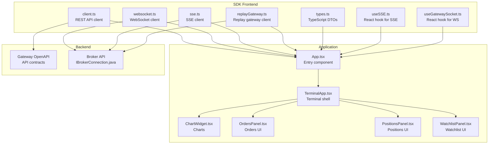
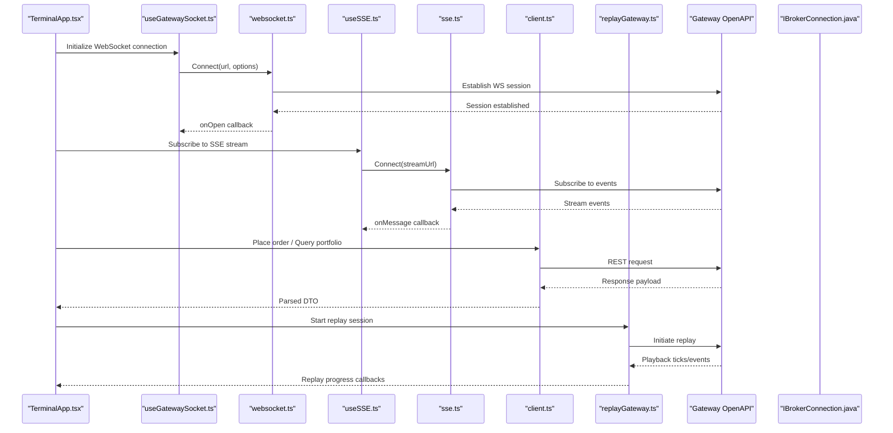
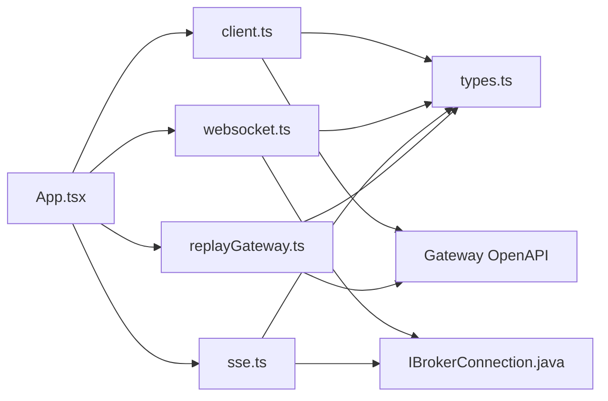

# JavaScript/TypeScript SDK

<cite>
**Referenced Files in This Document**
- [client.ts](file://archive/frontend/src/api/client.ts)
- [websocket.ts](file://archive/frontend/src/api/websocket.ts)
- [sse.ts](file://archive/frontend/src/api/sse.ts)
- [replayGateway.ts](file://archive/frontend/src/api/replayGateway.ts)
- [types.ts](file://archive/frontend/src/dto/types.ts)
- [useSSE.ts](file://archive/frontend/src/hooks/useSSE.ts)
- [useGatewaySocket.ts](file://frontend/src/hooks/useGatewaySocket.ts)
- [TerminalApp.tsx](file://frontend/src/app/TerminalApp.tsx)
- [package.json](file://archive/frontend/package.json)
- [vite.config.ts](file://archive/frontend/vite.config.ts)
- [tsconfig.json](file://archive/frontend/tsconfig.json)
- [index.html](file://archive/frontend/index.html)
- [README.md](file://archive/frontend/README.md)
- [App.tsx](file://archive/frontend/src/App.tsx)
- [ChartWidget.tsx](file://archive/frontend/src/charts/ChartWidget.tsx)
- [OrdersPanel.tsx](file://frontend/src/ui/panels/OrdersPanel.tsx)
- [PositionsPanel.tsx](file://frontend/src/ui/panels/PositionsPanel.tsx)
- [WatchlistPanel.tsx](file://frontend/src/ui/panels/WatchlistPanel.tsx)
- [DOMTradingScreen.tsx](file://frontend/src/ui/widgets/DOM/DOMTradingScreen.tsx)
- [OptionChainTable.tsx](file://frontend/src/ui/widgets/OptionChain/OptionChainTable.tsx)
- [CandlestickChart.tsx](file://frontend/src/ui/widgets/charts/CandlestickChart.tsx)
- [terminalStore.ts](file://frontend/src/state/terminalStore.ts)
- [IBrokerConnection.java](file://broker/api/src/main/java/com/tradej/broker/api/IBrokerConnection.java)
- [gateway openapi.yaml](file://docs/openapi.yaml)
- [runtime mode audit.md](file://docs/runtime-mode-audit.md)
- [ARCHITECTURE.md](file://docs/ARCHITECTURE.md)
- [BROKER_GATEWAY_ARCHITECTURE_REVIEW.md](file://docs/BROKER_GATEWAY_ARCHITECTURE_REVIEW.md)
- [BROKER_CAPABILITY_MATRIX.md](file://docs/BROKER_CAPABILITY_MATRIX.md)
- [BROKER_CERTIFICATION_REPORT.md](file://docs/BROKER_CERTIFICATION_REPORT.md)
- [USAGE_GUIDE.md](file://docs/USAGE_GUIDE.md)
- [API_DOCUMENTATION.md](file://docs/API_DOCUMENTATION.md)
- [test-backend-connection.sh](file://test-backend-connection.sh)
</cite>

## Table of Contents
1. [Introduction](#introduction)
2. [Project Structure](#project-structure)
3. [Core Components](#core-components)
4. [Architecture Overview](#architecture-overview)
5. [Detailed Component Analysis](#detailed-component-analysis)
6. [Dependency Analysis](#dependency-analysis)
7. [Performance Considerations](#performance-considerations)
8. [Troubleshooting Guide](#troubleshooting-guide)
9. [Conclusion](#conclusion)
10. [Appendices](#appendices)

## Introduction
This document describes the JavaScript/TypeScript SDK for integrating with the Trade-J client ecosystem. It covers the SDK architecture, installation and initialization, REST API client configuration, WebSocket connection management, Server-Sent Events (SSE) handling, and replay gateway functionality. It also documents authentication mechanisms, error handling strategies, retry policies, connection lifecycle management, TypeScript type definitions, and integration patterns with React, Node.js, and browser applications. Finally, it provides performance optimization techniques, memory management guidance, and debugging utilities.

## Project Structure
The SDK is primarily implemented in the archived frontend module and integrated into the broader Trade-J architecture. Key areas include:
- API clients for REST, WebSocket, SSE, and replay gateway
- TypeScript DTOs and shared types
- React hooks for SSE and WebSocket
- Frontend application showcasing integration patterns
- Backend gateway and broker APIs supporting the SDK

**Diagram sources**
- [client.ts](file://archive/frontend/src/api/client.ts)
- [websocket.ts](file://archive/frontend/src/api/websocket.ts)
- [sse.ts](file://archive/frontend/src/api/sse.ts)
- [replayGateway.ts](file://archive/frontend/src/api/replayGateway.ts)
- [types.ts](file://archive/frontend/src/dto/types.ts)
- [useSSE.ts](file://archive/frontend/src/hooks/useSSE.ts)
- [useGatewaySocket.ts](file://frontend/src/hooks/useGatewaySocket.ts)
- [App.tsx](file://archive/frontend/src/App.tsx)
- [TerminalApp.tsx](file://frontend/src/app/TerminalApp.tsx)
- [ChartWidget.tsx](file://archive/frontend/src/charts/ChartWidget.tsx)
- [OrdersPanel.tsx](file://frontend/src/ui/panels/OrdersPanel.tsx)
- [PositionsPanel.tsx](file://frontend/src/ui/panels/PositionsPanel.tsx)
- [WatchlistPanel.tsx](file://frontend/src/ui/panels/WatchlistPanel.tsx)
- [gateway openapi.yaml](file://docs/openapi.yaml)
- [IBrokerConnection.java](file://broker/api/src/main/java/com/tradej/broker/api/IBrokerConnection.java)

**Section sources**
- [client.ts](file://archive/frontend/src/api/client.ts)
- [websocket.ts](file://archive/frontend/src/api/websocket.ts)
- [sse.ts](file://archive/frontend/src/api/sse.ts)
- [replayGateway.ts](file://archive/frontend/src/api/replayGateway.ts)
- [types.ts](file://archive/frontend/src/dto/types.ts)
- [useSSE.ts](file://archive/frontend/src/hooks/useSSE.ts)
- [useGatewaySocket.ts](file://frontend/src/hooks/useGatewaySocket.ts)
- [App.tsx](file://archive/frontend/src/App.tsx)
- [TerminalApp.tsx](file://frontend/src/app/TerminalApp.tsx)
- [ChartWidget.tsx](file://archive/frontend/src/charts/ChartWidget.tsx)
- [OrdersPanel.tsx](file://frontend/src/ui/panels/OrdersPanel.tsx)
- [PositionsPanel.tsx](file://frontend/src/ui/panels/PositionsPanel.tsx)
- [WatchlistPanel.tsx](file://frontend/src/ui/panels/WatchlistPanel.tsx)
- [gateway openapi.yaml](file://docs/openapi.yaml)
- [IBrokerConnection.java](file://broker/api/src/main/java/com/tradej/broker/api/IBrokerConnection.java)

## Core Components
This section documents the primary SDK components and their responsibilities.

- REST API Client
  - Provides authenticated HTTP requests to backend endpoints
  - Manages base URL, headers, and request/response transformations
  - Supports JSON serialization and error propagation
  - Example usage patterns include market data retrieval, order placement, and portfolio queries

- WebSocket Client
  - Handles persistent connections for real-time market data and order updates
  - Implements connection lifecycle events (open, close, error)
  - Provides subscription management for instruments and streams
  - Includes reconnection logic and backoff strategies

- SSE Client
  - Subscribes to server-sent event streams for push notifications
  - Parses incoming events and routes them to subscribers
  - Offers automatic retry and recovery on transient failures

- Replay Gateway Client
  - Enables historical playback of market data and order events
  - Supports time-range queries and deterministic replay sessions
  - Integrates with backend replay orchestration services

- TypeScript Types
  - Defines DTOs for market data, order payloads, portfolio positions, and SSE events
  - Ensures type-safe integrations across React components and SDK consumers
  - Includes enums and union types for broker-specific capabilities and statuses

**Section sources**
- [client.ts](file://archive/frontend/src/api/client.ts)
- [websocket.ts](file://archive/frontend/src/api/websocket.ts)
- [sse.ts](file://archive/frontend/src/api/sse.ts)
- [replayGateway.ts](file://archive/frontend/src/api/replayGateway.ts)
- [types.ts](file://archive/frontend/src/dto/types.ts)

## Architecture Overview
The SDK sits between the frontend application and the Trade-J backend gateway and broker APIs. It exposes typed clients and hooks for REST, WebSocket, SSE, and replay functionality, while the application composes these into panels and widgets.

**Diagram sources**
- [TerminalApp.tsx](file://frontend/src/app/TerminalApp.tsx)
- [useGatewaySocket.ts](file://frontend/src/hooks/useGatewaySocket.ts)
- [websocket.ts](file://archive/frontend/src/api/websocket.ts)
- [useSSE.ts](file://archive/frontend/src/hooks/useSSE.ts)
- [sse.ts](file://archive/frontend/src/api/sse.ts)
- [client.ts](file://archive/frontend/src/api/client.ts)
- [replayGateway.ts](file://archive/frontend/src/api/replayGateway.ts)
- [gateway openapi.yaml](file://docs/openapi.yaml)
- [IBrokerConnection.java](file://broker/api/src/main/java/com/tradej/broker/api/IBrokerConnection.java)

## Detailed Component Analysis

### REST API Client
- Responsibilities
  - Configure base URL and authentication headers
  - Serialize/deserialize request/response payloads
  - Centralize error handling and response parsing
  - Provide convenience methods for common operations (orders, portfolio, market data)

- Initialization Pattern
  - Accept configuration object with endpoint base URL, credentials, and optional overrides
  - Expose methods for GET/POST/PUT/DELETE with typed request/response DTOs
  - Support interceptors for logging and retry policies

- Authentication Mechanisms
  - Token-based bearer authentication via Authorization header
  - Optional session refresh flow when tokens expire
  - Environment-aware configuration for sandbox/live modes

- Error Handling and Retry Policies
  - Map HTTP status codes to domain-specific errors
  - Implement exponential backoff with jitter for transient failures
  - Provide retry limits and circuit breaker behavior

- Examples
  - Place order: call REST client with order DTO and handle response
  - Query portfolio: fetch balance, holdings, and positions
  - Retrieve market data: fetch LTP, depth, candles, and OHLC

**Section sources**
- [client.ts](file://archive/frontend/src/api/client.ts)
- [types.ts](file://archive/frontend/src/dto/types.ts)
- [gateway openapi.yaml](file://docs/openapi.yaml)

### WebSocket Client
- Responsibilities
  - Manage WebSocket lifecycle (connect, reconnect, close)
  - Maintain subscription lists per instrument/stream
  - Dispatch messages to registered handlers
  - Enforce heartbeat and ping/pong logic

- Connection Lifecycle Management
  - Automatic reconnection with capped exponential backoff
  - Graceful degradation on network failures
  - Cleanup of subscriptions on disconnect

- Subscription Management
  - Subscribe/unsubscribe to instruments and streams
  - Batch subscribe for performance
  - Deduplicate subscriptions and track state

- Real-time Updates
  - Route incoming messages to appropriate handlers
  - Emit typed events for downstream components
  - Support replay-aware subscriptions

**Section sources**
- [websocket.ts](file://archive/frontend/src/api/websocket.ts)
- [useGatewaySocket.ts](file://frontend/src/hooks/useGatewaySocket.ts)
- [IBrokerConnection.java](file://broker/api/src/main/java/com/tradej/broker/api/IBrokerConnection.java)

### SSE Client
- Responsibilities
  - Establish and maintain long-lived connections to event streams
  - Parse server-sent events and route to subscribers
  - Handle connection interruptions and resume where possible

- Event Handling
  - Define event types and payload shapes
  - Provide subscriber registration and deregistration
  - Emit structured events to React components

- Retry and Recovery
  - Automatic reconnect with backoff
  - Support for Last-Event-ID for resumption
  - Circuit breaker to prevent thrashing

**Section sources**
- [sse.ts](file://archive/frontend/src/api/sse.ts)
- [useSSE.ts](file://archive/frontend/src/hooks/useSSE.ts)
- [IBrokerConnection.java](file://broker/api/src/main/java/com/tradej/broker/api/IBrokerConnection.java)

### Replay Gateway Client
- Responsibilities
  - Initiate and control replay sessions
  - Stream historical ticks and events
  - Provide progress and completion callbacks

- Configuration
  - Define replay window (start/end timestamps)
  - Select replay speed and data sources
  - Handle replay state transitions

- Integration Patterns
  - Feed replay events into charting and analytics components
  - Synchronize UI state with replay progress
  - Pause/resume and fast-forward controls

**Section sources**
- [replayGateway.ts](file://archive/frontend/src/api/replayGateway.ts)
- [runtime mode audit.md](file://docs/runtime-mode-audit.md)

### React Hooks and Application Integration
- useGatewaySocket
  - Encapsulates WebSocket lifecycle and subscriptions
  - Returns connection state, messages, and control methods
  - Integrates with React component rendering

- useSSE
  - Manages SSE subscription and event routing
  - Provides reactive state for SSE-driven UI updates

- Terminal Panels and Widgets
  - OrdersPanel: displays order book and trade updates
  - PositionsPanel: shows holdings and PnL
  - WatchlistPanel: manages instrument lists and quick actions
  - ChartWidget and CandlestickChart: render market data streams
  - DOMTradingScreen and OptionChainTable: specialized trading views

**Section sources**
- [useGatewaySocket.ts](file://frontend/src/hooks/useGatewaySocket.ts)
- [useSSE.ts](file://archive/frontend/src/hooks/useSSE.ts)
- [OrdersPanel.tsx](file://frontend/src/ui/panels/OrdersPanel.tsx)
- [PositionsPanel.tsx](file://frontend/src/ui/panels/PositionsPanel.tsx)
- [WatchlistPanel.tsx](file://frontend/src/ui/panels/WatchlistPanel.tsx)
- [ChartWidget.tsx](file://archive/frontend/src/charts/ChartWidget.tsx)
- [CandlestickChart.tsx](file://frontend/src/ui/widgets/charts/CandlestickChart.tsx)
- [DOMTradingScreen.tsx](file://frontend/src/ui/widgets/DOM/DOMTradingScreen.tsx)
- [OptionChainTable.tsx](file://frontend/src/ui/widgets/OptionChain/OptionChainTable.tsx)
- [TerminalApp.tsx](file://frontend/src/app/TerminalApp.tsx)

### TypeScript Type Definitions
- Market Data Types
  - LTP, Quote, Depth, OHLC, Candle DTOs
  - Instrument metadata and identifiers

- Order and Portfolio Types
  - Order placement and modification DTOs
  - Portfolio balance, holdings, and positions

- SSE Event Types
  - Event envelopes and payload schemas
  - Status and error event definitions

- Broker Capability Types
  - Enumerations for supported features and statuses
  - Capability matrix alignment

**Section sources**
- [types.ts](file://archive/frontend/src/dto/types.ts)
- [BROKER_CAPABILITY_MATRIX.md](file://docs/BROKER_CAPABILITY_MATRIX.md)

## Dependency Analysis
The SDK components depend on shared DTOs and integrate with backend contracts and broker APIs.

**Diagram sources**
- [client.ts](file://archive/frontend/src/api/client.ts)
- [websocket.ts](file://archive/frontend/src/api/websocket.ts)
- [sse.ts](file://archive/frontend/src/api/sse.ts)
- [replayGateway.ts](file://archive/frontend/src/api/replayGateway.ts)
- [types.ts](file://archive/frontend/src/dto/types.ts)
- [gateway openapi.yaml](file://docs/openapi.yaml)
- [IBrokerConnection.java](file://broker/api/src/main/java/com/tradej/broker/api/IBrokerConnection.java)
- [App.tsx](file://archive/frontend/src/App.tsx)

**Section sources**
- [client.ts](file://archive/frontend/src/api/client.ts)
- [websocket.ts](file://archive/frontend/src/api/websocket.ts)
- [sse.ts](file://archive/frontend/src/api/sse.ts)
- [replayGateway.ts](file://archive/frontend/src/api/replayGateway.ts)
- [types.ts](file://archive/frontend/src/dto/types.ts)
- [gateway openapi.yaml](file://docs/openapi.yaml)
- [IBrokerConnection.java](file://broker/api/src/main/java/com/tradej/broker/api/IBrokerConnection.java)
- [App.tsx](file://archive/frontend/src/App.tsx)

## Performance Considerations
- Connection pooling and reuse
  - Share WebSocket connections across multiple subscriptions
  - Batch subscribe/unsubscribe operations to reduce overhead

- Memory management
  - Unsubscribe and dispose of listeners on component unmount
  - Avoid retaining large event buffers; process and discard promptly

- Network efficiency
  - Use compression where supported by the backend
  - Minimize redundant requests; leverage caching for static data

- Rendering optimization
  - Memoize selectors and avoid unnecessary re-renders
  - Virtualize large lists (order book, watchlists)

- Replay performance
  - Tune replay speed and buffer sizes
  - Preload data windows for smoother playback

[No sources needed since this section provides general guidance]

## Troubleshooting Guide
- Connection issues
  - Verify base URLs and authentication tokens
  - Check network connectivity and firewall rules
  - Inspect WebSocket/SSE handshake responses

- Error handling
  - Log HTTP status codes and error bodies
  - Implement circuit breakers to prevent cascading failures
  - Surface user-friendly messages while preserving stack traces for debugging

- Retry policies
  - Apply exponential backoff with jitter for transient errors
  - Limit total retries and implement timeouts
  - Distinguish between retryable and non-retryable errors

- Debugging utilities
  - Enable verbose logging for SDK clients
  - Use browser devtools network panel to inspect requests
  - Validate DTO shapes against OpenAPI schemas

**Section sources**
- [client.ts](file://archive/frontend/src/api/client.ts)
- [websocket.ts](file://archive/frontend/src/api/websocket.ts)
- [sse.ts](file://archive/frontend/src/api/sse.ts)
- [replayGateway.ts](file://archive/frontend/src/api/replayGateway.ts)
- [test-backend-connection.sh](file://test-backend-connection.sh)

## Conclusion
The Trade-J JavaScript/TypeScript SDK provides a cohesive set of clients and hooks for REST, WebSocket, SSE, and replay functionality. By leveraging typed DTOs, robust error handling, and lifecycle management, developers can build responsive trading applications across React, Node.js, and browser environments. The SDK integrates tightly with backend contracts and broker capabilities, enabling scalable and maintainable client integrations.

[No sources needed since this section summarizes without analyzing specific files]

## Appendices

### Installation and Setup
- Install dependencies using the project’s package manager
- Configure environment variables for base URLs and credentials
- Initialize SDK clients with environment-aware settings

**Section sources**
- [package.json](file://archive/frontend/package.json)
- [vite.config.ts](file://archive/frontend/vite.config.ts)
- [tsconfig.json](file://archive/frontend/tsconfig.json)
- [index.html](file://archive/frontend/index.html)

### API Reference Highlights
- REST endpoints: refer to the gateway OpenAPI specification for method signatures and payloads
- WebSocket topics: align with broker capabilities and subscription schemas
- SSE channels: follow event envelope definitions and retry semantics
- Replay sessions: consult runtime mode audit for supported replay features

**Section sources**
- [gateway openapi.yaml](file://docs/openapi.yaml)
- [BROKER_CAPABILITY_MATRIX.md](file://docs/BROKER_CAPABILITY_MATRIX.md)
- [runtime mode audit.md](file://docs/runtime-mode-audit.md)

### Integration Patterns
- React
  - Use hooks for WebSocket and SSE subscriptions
  - Compose panels and widgets around typed DTOs
  - Manage global state with terminal store patterns

- Node.js
  - Instantiate REST and WebSocket clients in server-side processes
  - Handle authentication and token refresh securely
  - Stream market data to external systems or databases

- Browser
  - Load SDK via module bundler or CDN
  - Configure CORS and proxy settings for development
  - Implement offline fallbacks and local caching

**Section sources**
- [TerminalApp.tsx](file://frontend/src/app/TerminalApp.tsx)
- [terminalStore.ts](file://frontend/src/state/terminalStore.ts)
- [client.ts](file://archive/frontend/src/api/client.ts)
- [websocket.ts](file://archive/frontend/src/api/websocket.ts)
- [sse.ts](file://archive/frontend/src/api/sse.ts)

### Usage Examples (paths only)
- Market data subscriptions
  - [websocket.ts](file://archive/frontend/src/api/websocket.ts)
  - [useGatewaySocket.ts](file://frontend/src/hooks/useGatewaySocket.ts)
- Order placement
  - [client.ts](file://archive/frontend/src/api/client.ts)
  - [types.ts](file://archive/frontend/src/dto/types.ts)
- Portfolio queries
  - [client.ts](file://archive/frontend/src/api/client.ts)
  - [types.ts](file://archive/frontend/src/dto/types.ts)
- Real-time updates
  - [useSSE.ts](file://archive/frontend/src/hooks/useSSE.ts)
  - [sse.ts](file://archive/frontend/src/api/sse.ts)
- Replay sessions
  - [replayGateway.ts](file://archive/frontend/src/api/replayGateway.ts)
  - [runtime mode audit.md](file://docs/runtime-mode-audit.md)