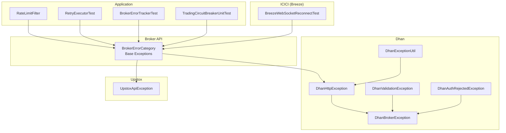
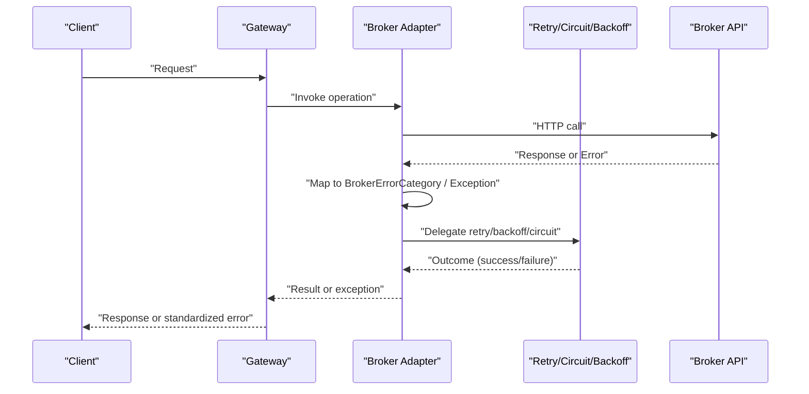
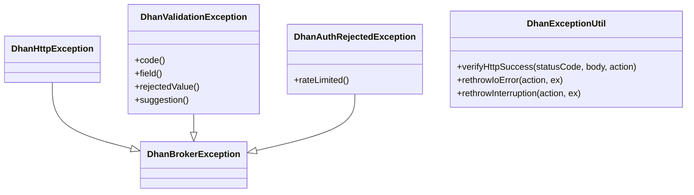
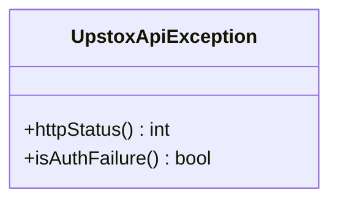
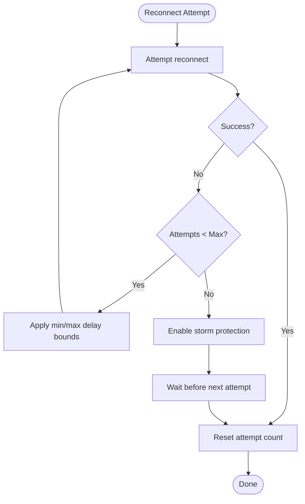
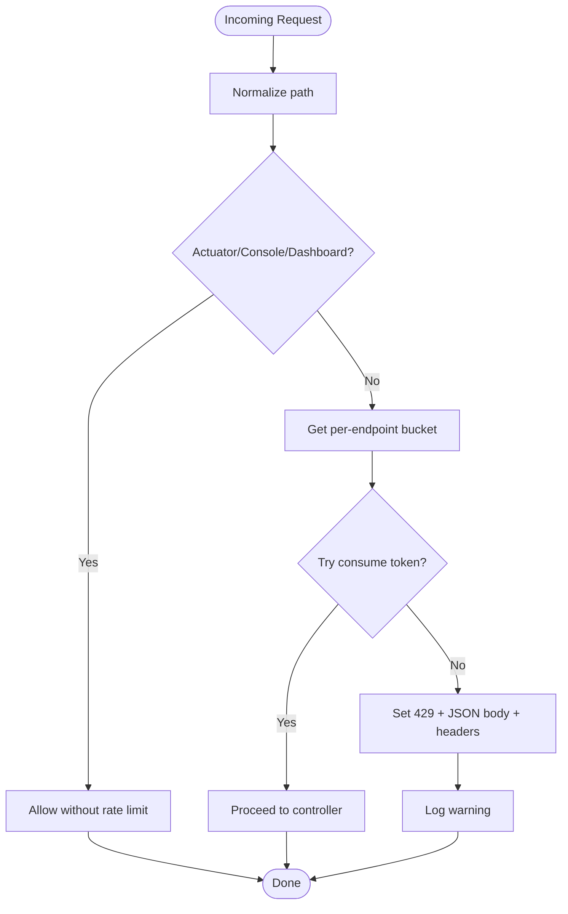
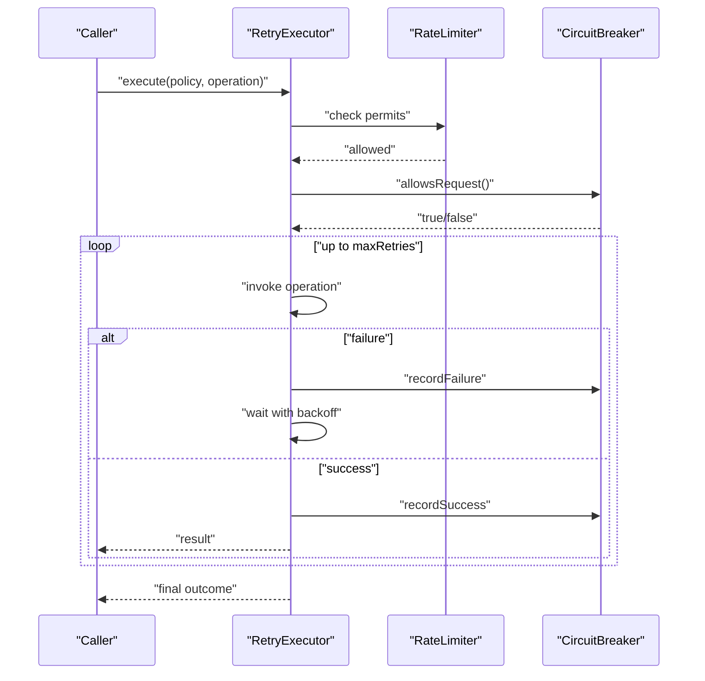
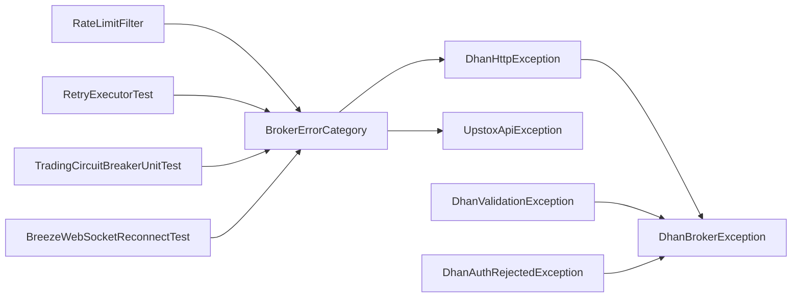

# Error Handling & Status Codes

<cite>
**Referenced Files in This Document**
- [DhanExceptionUtil.java](file://broker/dhan/src/main/java/com/tradej/broker/dhan/exceptions/DhanExceptionUtil.java)
- [DhanHttpException.java](file://broker/dhan/src/main/java/com/tradej/broker/dhan/exceptions/DhanHttpException.java)
- [DhanBrokerException.java](file://broker/dhan/src/main/java/com/tradej/broker/dhan/exceptions/DhanBrokerException.java)
- [DhanValidationException.java](file://broker/dhan/src/main/java/com/tradej/broker/dhan/exceptions/DhanValidationException.java)
- [DhanAuthRejectedException.java](file://broker/dhan/auth/DhanAuthRejectedException.java)
- [BrokerNetworkException.java](file://broker/api/src/main/java/com/tradej/broker/api/exceptions/BrokerNetworkException.java)
- [BrokerRateLimitException.java](file://broker/api/src/main/java/com/tradej/broker/api/exceptions/BrokerRateLimitException.java)
- [BrokerErrorCategory.java](file://broker/api/src/main/java/com/tradej/broker/api/resilience/BrokerErrorCategory.java)
- [UpstoxApiException.java](file://broker/upstox/src/main/java/com/tradej/broker/upstox/http/UpstoxApiException.java)
- [UpstoxInvalidCredentialsTest.java](file://broker/upstox/src/test/java/com/tradej/broker/upstox/http/UpstoxInvalidCredentialsTest.java)
- [BreezeWebSocketReconnectTest.java](file://broker/icici/src/test/java/com/tradej/broker/icici/websocket/BreezeWebSocketReconnectTest.java)
- [RateLimitFilter.java](file://app/src/main/java/com/tradej/app/config/RateLimitFilter.java)
- [RetryExecutorTest.java](file://broker/core/src/test/java/com/tradej/broker/core/resilience/RetryExecutorTest.java)
- [BrokerErrorTrackerTest.java](file://app/src/test/java/com/tradej/app/health/BrokerErrorTrackerTest.java)
- [TradingCircuitBreakerUnitTest.java](file://trading/execution/src/test/java/com/tradej/execution/service/TradingCircuitBreakerUnitTest.java)
- [BROKER_INTEGRATION_AUDIT_REPORT.md](file://docs/BROKER_INTEGRATION_AUDIT_REPORT.md)
</cite>

## Table of Contents
1. [Introduction](#introduction)
2. [Project Structure](#project-structure)
3. [Core Components](#core-components)
4. [Architecture Overview](#architecture-overview)
5. [Detailed Component Analysis](#detailed-component-analysis)
6. [Dependency Analysis](#dependency-analysis)
7. [Performance Considerations](#performance-considerations)
8. [Troubleshooting Guide](#troubleshooting-guide)
9. [Conclusion](#conclusion)
10. [Appendices](#appendices)

## Introduction
This document provides comprehensive error handling guidance for Trade-J API responses. It covers standard error response formats, HTTP status code interpretation, exception types, and error categorization across brokers. It also documents broker-specific handling for Dhan, Upstox, and ICICI (Breeze), network failures, rate limit violations, validation errors, and operational resilience patterns such as retries, backoff, circuit breaking, and recovery strategies. Practical troubleshooting steps and client-side best practices are included to help developers diagnose and resolve common error scenarios effectively.

## Project Structure
Error handling spans several modules:
- Broker API exceptions and resilience categories define a unified classification and base exception hierarchy.
- Broker-specific adapters implement exception translation and categorization for Dhan, Upstox, and ICICI.
- Application-level filters enforce rate limits and surface standardized error payloads.
- Resilience utilities provide retry policies, circuit breaking, and reconnect strategies.

**Diagram sources**
- [BrokerErrorCategory.java:1-58](file://broker/api/src/main/java/com/tradej/broker/api/resilience/BrokerErrorCategory.java#L1-L58)
- [DhanExceptionUtil.java:1-60](file://broker/dhan/src/main/java/com/tradej/broker/dhan/exceptions/DhanExceptionUtil.java#L1-L60)
- [DhanHttpException.java:1-19](file://broker/dhan/src/main/java/com/tradej/broker/dhan/exceptions/DhanHttpException.java#L1-L19)
- [DhanBrokerException.java:1-19](file://broker/dhan/src/main/java/com/tradej/broker/dhan/exceptions/DhanBrokerException.java#L1-L19)
- [DhanValidationException.java:1-52](file://broker/dhan/src/main/java/com/tradej/broker/dhan/exceptions/DhanValidationException.java#L1-L52)
- [DhanAuthRejectedException.java:1-21](file://broker/dhan/auth/DhanAuthRejectedException.java#L1-L21)
- [UpstoxApiException.java](file://broker/upstox/src/main/java/com/tradej/broker/upstox/http/UpstoxApiException.java)
- [RateLimitFilter.java:1-165](file://app/src/main/java/com/tradej/app/config/RateLimitFilter.java#L1-L165)
- [RetryExecutorTest.java:1-51](file://broker/core/src/test/java/com/tradej/broker/core/resilience/RetryExecutorTest.java#L1-L51)
- [BrokerErrorTrackerTest.java:40-117](file://app/src/test/java/com/tradej/app/health/BrokerErrorTrackerTest.java#L40-L117)
- [TradingCircuitBreakerUnitTest.java:39-56](file://trading/execution/src/test/java/com/tradej/execution/service/TradingCircuitBreakerUnitTest.java#L39-L56)
- [BreezeWebSocketReconnectTest.java:45-65](file://broker/icici/src/test/java/com/tradej/broker/icici/websocket/BreezeWebSocketReconnectTest.java#L45-L65)

**Section sources**
- [BrokerErrorCategory.java:1-58](file://broker/api/src/main/java/com/tradej/broker/api/resilience/BrokerErrorCategory.java#L1-L58)
- [RateLimitFilter.java:1-165](file://app/src/main/java/com/tradej/app/config/RateLimitFilter.java#L1-L165)

## Core Components
- Unified error categories: The BrokerErrorCategory class defines reusable categories such as AUTH_EXPIRED, AUTH_REVOKED, RATE_LIMITED, EXCHANGE_REJECTED, SERVICE_DOWN, NETWORK_TRANSIENT, NETWORK_PERMANENT, VALIDATION_ERROR, MAINTENANCE, and UNKNOWN. These categories guide retry/backoff decisions and escalation.
- Base exception hierarchy: Broker-specific exceptions derive from a common base to simplify handling. For example, DhanBrokerException is the root for Dhan-related errors, while UpstoxApiException encapsulates HTTP and business errors for Upstox.
- Network and rate limit exceptions: BrokerNetworkException and BrokerRateLimitException represent transport-level and rate-limit conditions respectively.
- Standardized HTTP handling utilities: DhanExceptionUtil centralizes HTTP status validation and exception raising for authentication and general HTTP failures.

Key exception and category references:
- [BrokerErrorCategory.java:1-58](file://broker/api/src/main/java/com/tradej/broker/api/resilience/BrokerErrorCategory.java#L1-L58)
- [DhanBrokerException.java:1-19](file://broker/dhan/src/main/java/com/tradej/broker/dhan/exceptions/DhanBrokerException.java#L1-L19)
- [DhanExceptionUtil.java:33-42](file://broker/dhan/src/main/java/com/tradej/broker/dhan/exceptions/DhanExceptionUtil.java#L33-L42)
- [BrokerNetworkException.java:1-10](file://broker/api/src/main/java/com/tradej/broker/api/exceptions/BrokerNetworkException.java#L1-L10)
- [BrokerRateLimitException.java](file://broker/api/src/main/java/com/tradej/broker/api/exceptions/BrokerRateLimitException.java)

**Section sources**
- [BrokerErrorCategory.java:1-58](file://broker/api/src/main/java/com/tradej/broker/api/resilience/BrokerErrorCategory.java#L1-L58)
- [DhanBrokerException.java:1-19](file://broker/dhan/src/main/java/com/tradej/broker/dhan/exceptions/DhanBrokerException.java#L1-L19)
- [DhanExceptionUtil.java:19-60](file://broker/dhan/src/main/java/com/tradej/broker/dhan/exceptions/DhanExceptionUtil.java#L19-L60)
- [BrokerNetworkException.java:1-10](file://broker/api/src/main/java/com/tradej/broker/api/exceptions/BrokerNetworkException.java#L1-L10)

## Architecture Overview
The error handling architecture separates concerns across three layers:
- Broker adapters translate external API responses into unified BrokerErrorCategory and specific exceptions.
- Resilience utilities apply retry/backoff, circuit breaking, and reconnect strategies.
- Application filters enforce rate limits and produce standardized JSON error responses.

[No sources needed since this diagram shows conceptual workflow, not actual code structure]

## Detailed Component Analysis

### Dhan Error Handling
Dhan-specific exceptions and utilities:
- DhanExceptionUtil: Validates HTTP status codes and raises authentication or HTTP exceptions consistently.
- DhanHttpException: General HTTP failure wrapper for Dhan.
- DhanBrokerException: Base exception for Dhan operations.
- DhanValidationException: Structured validation errors with code, field, rejected value, and suggestion.
- DhanAuthRejectedException: Business-level authentication rejection (e.g., mint rate limiting).

**Diagram sources**
- [DhanBrokerException.java:1-19](file://broker/dhan/src/main/java/com/tradej/broker/dhan/exceptions/DhanBrokerException.java#L1-L19)
- [DhanHttpException.java:1-19](file://broker/dhan/src/main/java/com/tradej/broker/dhan/exceptions/DhanHttpException.java#L1-L19)
- [DhanValidationException.java:1-52](file://broker/dhan/src/main/java/com/tradej/broker/dhan/exceptions/DhanValidationException.java#L1-L52)
- [DhanAuthRejectedException.java:1-21](file://broker/dhan/auth/DhanAuthRejectedException.java#L1-L21)
- [DhanExceptionUtil.java:19-60](file://broker/dhan/src/main/java/com/tradej/broker/dhan/exceptions/DhanExceptionUtil.java#L19-L60)

**Section sources**
- [DhanExceptionUtil.java:33-42](file://broker/dhan/src/main/java/com/tradej/broker/dhan/exceptions/DhanExceptionUtil.java#L33-L42)
- [DhanValidationException.java:16-36](file://broker/dhan/src/main/java/com/tradej/broker/dhan/exceptions/DhanValidationException.java#L16-L36)
- [DhanAuthRejectedException.java:13-21](file://broker/dhan/auth/DhanAuthRejectedException.java#L13-L21)

### Upstox Error Handling
UpstoxApiException encapsulates HTTP status and broker-specific error codes. Authentication failures are recognized by HTTP 401/403 or specific Upstox error codes. The test suite demonstrates categorization and preservation of HTTP status codes.

**Diagram sources**
- [UpstoxApiException.java](file://broker/upstox/src/main/java/com/tradej/broker/upstox/http/UpstoxApiException.java)
- [UpstoxInvalidCredentialsTest.java:13-46](file://broker/upstox/src/test/java/com/tradej/broker/upstox/http/UpstoxInvalidCredentialsTest.java#L13-L46)

**Section sources**
- [UpstoxInvalidCredentialsTest.java:13-46](file://broker/upstox/src/test/java/com/tradej/broker/upstox/http/UpstoxInvalidCredentialsTest.java#L13-L46)

### ICICI (Breeze) WebSocket Resilience
ICICI’s WebSocket reconnect behavior is validated with a reconnect manager that enforces max attempts, delay bounds, and storm protection after exhaustion. This ensures graceful degradation and prevents thundering herd effects.

**Diagram sources**
- [BreezeWebSocketReconnectTest.java:45-65](file://broker/icici/src/test/java/com/tradej/broker/icici/websocket/BreezeWebSocketReconnectTest.java#L45-L65)

**Section sources**
- [BreezeWebSocketReconnectTest.java:45-65](file://broker/icici/src/test/java/com/tradej/broker/icici/websocket/BreezeWebSocketReconnectTest.java#L45-L65)

### Application-Level Rate Limiting
The RateLimitFilter applies token-bucket rate limiting per endpoint, returning standardized JSON error payloads on 429 with Retry-After and X-RateLimit-* headers. Burst allowances are configured for UI endpoints.

**Diagram sources**
- [RateLimitFilter.java:116-158](file://app/src/main/java/com/tradej/app/config/RateLimitFilter.java#L116-L158)

**Section sources**
- [RateLimitFilter.java:116-158](file://app/src/main/java/com/tradej/app/config/RateLimitFilter.java#L116-L158)

### Retry, Circuit Breaking, and Recovery
RetryExecutorTest demonstrates retry policies that succeed after transient failures, while fast failing on non-retryable errors. Circuit breaker tests show state transitions and half-open probing behavior.

**Diagram sources**
- [RetryExecutorTest.java:22-50](file://broker/core/src/test/java/com/tradej/broker/core/resilience/RetryExecutorTest.java#L22-L50)
- [TradingCircuitBreakerUnitTest.java:39-56](file://trading/execution/src/test/java/com/tradej/execution/service/TradingCircuitBreakerUnitTest.java#L39-L56)

**Section sources**
- [RetryExecutorTest.java:22-50](file://broker/core/src/test/java/com/tradej/broker/core/resilience/RetryExecutorTest.java#L22-L50)
- [TradingCircuitBreakerUnitTest.java:39-56](file://trading/execution/src/test/java/com/tradej/execution/service/TradingCircuitBreakerUnitTest.java#L39-L56)

## Dependency Analysis
Error handling depends on a layered approach:
- Broker adapters depend on BrokerErrorCategory for classification and on base exceptions for propagation.
- Resilience utilities depend on rate limiters and circuit breakers to govern retry behavior.
- Application filters depend on HTTP response semantics to produce standardized error payloads.

**Diagram sources**
- [BrokerErrorCategory.java:1-58](file://broker/api/src/main/java/com/tradej/broker/api/resilience/BrokerErrorCategory.java#L1-L58)
- [DhanHttpException.java:1-19](file://broker/dhan/src/main/java/com/tradej/broker/dhan/exceptions/DhanHttpException.java#L1-L19)
- [DhanBrokerException.java:1-19](file://broker/dhan/src/main/java/com/tradej/broker/dhan/exceptions/DhanBrokerException.java#L1-L19)
- [DhanValidationException.java:1-52](file://broker/dhan/src/main/java/com/tradej/broker/dhan/exceptions/DhanValidationException.java#L1-L52)
- [DhanAuthRejectedException.java:1-21](file://broker/dhan/auth/DhanAuthRejectedException.java#L1-L21)
- [UpstoxApiException.java](file://broker/upstox/src/main/java/com/tradej/broker/upstox/http/UpstoxApiException.java)
- [RateLimitFilter.java:1-165](file://app/src/main/java/com/tradej/app/config/RateLimitFilter.java#L1-L165)
- [RetryExecutorTest.java:1-51](file://broker/core/src/test/java/com/tradej/broker/core/resilience/RetryExecutorTest.java#L1-L51)
- [TradingCircuitBreakerUnitTest.java:39-56](file://trading/execution/src/test/java/com/tradej/execution/service/TradingCircuitBreakerUnitTest.java#L39-L56)
- [BreezeWebSocketReconnectTest.java:45-65](file://broker/icici/src/test/java/com/tradej/broker/icici/websocket/BreezeWebSocketReconnectTest.java#L45-L65)

**Section sources**
- [BrokerErrorCategory.java:1-58](file://broker/api/src/main/java/com/tradej/broker/api/resilience/BrokerErrorCategory.java#L1-L58)
- [RateLimitFilter.java:116-158](file://app/src/main/java/com/tradej/app/config/RateLimitFilter.java#L116-L158)

## Performance Considerations
- Prefer non-blocking rate limiting with endpoint-specific buckets to avoid contention.
- Use exponential backoff with jitter for retries to mitigate thundering herds.
- Circuit breakers should probe periodically in half-open state to detect recovery.
- Validate broker-specific timeouts and connection pools to minimize idle resource consumption.

[No sources needed since this section provides general guidance]

## Troubleshooting Guide

Common error scenarios and recovery strategies:
- Authentication failures (HTTP 401/403 or broker-specific auth codes):
  - Trigger silent token refresh for AUTH_EXPIRED; require full re-auth for AUTH_REVOKED.
  - Examples: [UpstoxInvalidCredentialsTest.java:13-28](file://broker/upstox/src/test/java/com/tradej/broker/upstox/http/UpstoxInvalidCredentialsTest.java#L13-L28)
- Rate limit violations (HTTP 429 or broker-level throttling):
  - Apply backoff and retry; honor Retry-After when present.
  - Example: [RateLimitFilter.java:133-154](file://app/src/main/java/com/tradej/app/config/RateLimitFilter.java#L133-L154)
- Validation errors (HTTP 4xx except 401/403/429):
  - Fix payload; consider a single retry if safe.
  - Example: [BrokerErrorCategory.java:51](file://broker/api/src/main/java/com/tradej/broker/api/resilience/BrokerErrorCategory.java#L51)
- Network failures (timeouts, connection resets, DNS failures):
  - Retry with backoff; classify as transient vs permanent.
  - Example: [BrokerNetworkException.java:1-10](file://broker/api/src/main/java/com/tradej/broker/api/exceptions/BrokerNetworkException.java#L1-L10)
- Exchange rejections (invalid price, insufficient margin):
  - Map to EXCHANGE_REJECTED; do not retry automatically.
  - Example: [BrokerErrorCategory.java:39-40](file://broker/api/src/main/java/com/tradej/broker/api/resilience/BrokerErrorCategory.java#L39-L40)
- Broker outages (HTTP 5xx, connection refused):
  - Open circuit breaker; retry after cooldown.
  - Example: [BrokerErrorCategory.java:42-43](file://broker/api/src/main/java/com/tradej/broker/api/resilience/BrokerErrorCategory.java#L42-L43)
- WebSocket disconnects (ICICI):
  - Use reconnect manager with bounded attempts and storm protection.
  - Example: [BreezeWebSocketReconnectTest.java:45-65](file://broker/icici/src/test/java/com/tradej/broker/icici/websocket/BreezeWebSocketReconnectTest.java#L45-L65)

Client-side best practices:
- Always inspect HTTP status codes and error bodies; map to BrokerErrorCategory.
- Implement retry with exponential backoff and full jitter for transient errors.
- Respect Retry-After headers and X-RateLimit-* headers.
- Log structured error events for observability; track last error details.
  - Example: [BrokerErrorTrackerTest.java:72-81](file://app/src/test/java/com/tradej/app/health/BrokerErrorTrackerTest.java#L72-L81)
- Fail fast on validation errors; avoid retry loops.
- For Dhan, handle DhanAuthRejectedException with rate-limited awareness.
  - Example: [DhanAuthRejectedException.java:18-21](file://broker/dhan/auth/DhanAuthRejectedException.java#L18-L21)

**Section sources**
- [UpstoxInvalidCredentialsTest.java:13-46](file://broker/upstox/src/test/java/com/tradej/broker/upstox/http/UpstoxInvalidCredentialsTest.java#L13-L46)
- [RateLimitFilter.java:133-154](file://app/src/main/java/com/tradej/app/config/RateLimitFilter.java#L133-L154)
- [BrokerErrorCategory.java:39-58](file://broker/api/src/main/java/com/tradej/broker/api/resilience/BrokerErrorCategory.java#L39-L58)
- [BrokerNetworkException.java:1-10](file://broker/api/src/main/java/com/tradej/broker/api/exceptions/BrokerNetworkException.java#L1-L10)
- [BreezeWebSocketReconnectTest.java:45-65](file://broker/icici/src/test/java/com/tradej/broker/icici/websocket/BreezeWebSocketReconnectTest.java#L45-L65)
- [BrokerErrorTrackerTest.java:72-81](file://app/src/test/java/com/tradej/app/health/BrokerErrorTrackerTest.java#L72-L81)
- [DhanAuthRejectedException.java:18-21](file://broker/dhan/auth/DhanAuthRejectedException.java#L18-L21)

## Conclusion
Trade-J employs a robust, layered error handling strategy:
- A unified BrokerErrorCategory enables consistent classification across brokers.
- Broker-specific adapters translate external errors into actionable exceptions.
- Resilience utilities implement retry/backoff, circuit breaking, and reconnect strategies.
- Application filters provide standardized rate-limiting responses.
Adhering to these patterns and best practices ensures reliable, observable, and recoverable interactions with broker APIs.

[No sources needed since this section summarizes without analyzing specific files]

## Appendices

### HTTP Status Code Interpretation
- 401 Unauthorized / 403 Forbidden: Authentication failure; trigger AUTH_EXPIRED or AUTH_REVOKED handling.
- 400 with broker-specific auth code (e.g., Upstox): Treat as authentication failure.
- 400 others: Validation error; fix payload and consider a single retry.
- 429 Too Many Requests: Rate limit; honor Retry-After and backoff.
- 5xx: Service down; open circuit breaker and retry after cooldown.
- Other 4xx: Validation error unless mapped otherwise.

**Section sources**
- [UpstoxInvalidCredentialsTest.java:13-46](file://broker/upstox/src/test/java/com/tradej/broker/upstox/http/UpstoxInvalidCredentialsTest.java#L13-L46)
- [BrokerErrorCategory.java:30-58](file://broker/api/src/main/java/com/tradej/broker/api/resilience/BrokerErrorCategory.java#L30-L58)
- [RateLimitFilter.java:133-154](file://app/src/main/java/com/tradej/app/config/RateLimitFilter.java#L133-L154)

### Standardized Error Payloads
- Application rate limiter returns JSON with error, retryAfterSeconds, and path; includes Retry-After and X-RateLimit-* headers.
- Example reference: [RateLimitFilter.java:144-147](file://app/src/main/java/com/tradej/app/config/RateLimitFilter.java#L144-L147)

**Section sources**
- [RateLimitFilter.java:144-147](file://app/src/main/java/com/tradej/app/config/RateLimitFilter.java#L144-L147)

### Broker-Specific Notes
- Dhan: Use DhanExceptionUtil for HTTP validation; handle DhanAuthRejectedException for mint rate limiting.
  - References: [DhanExceptionUtil.java:33-42](file://broker/dhan/src/main/java/com/tradej/broker/dhan/exceptions/DhanExceptionUtil.java#L33-L42), [DhanAuthRejectedException.java:13-21](file://broker/dhan/auth/DhanAuthRejectedException.java#L13-L21)
- Upstox: Recognize auth failures via HTTP 401/403 or specific error codes; preserve HTTP status codes.
  - References: [UpstoxInvalidCredentialsTest.java:13-46](file://broker/upstox/src/test/java/com/tradej/broker/upstox/http/UpstoxInvalidCredentialsTest.java#L13-L46)
- ICICI (Breeze): Enforce bounded reconnect attempts and storm protection.
  - References: [BreezeWebSocketReconnectTest.java:45-65](file://broker/icici/src/test/java/com/tradej/broker/icici/websocket/BreezeWebSocketReconnectTest.java#L45-L65)

**Section sources**
- [DhanExceptionUtil.java:33-42](file://broker/dhan/src/main/java/com/tradej/broker/dhan/exceptions/DhanExceptionUtil.java#L33-L42)
- [DhanAuthRejectedException.java:13-21](file://broker/dhan/auth/DhanAuthRejectedException.java#L13-L21)
- [UpstoxInvalidCredentialsTest.java:13-46](file://broker/upstox/src/test/java/com/tradej/broker/upstox/http/UpstoxInvalidCredentialsTest.java#L13-L46)
- [BreezeWebSocketReconnectTest.java:45-65](file://broker/icici/src/test/java/com/tradej/broker/icici/websocket/BreezeWebSocketReconnectTest.java#L45-L65)