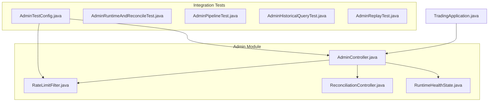
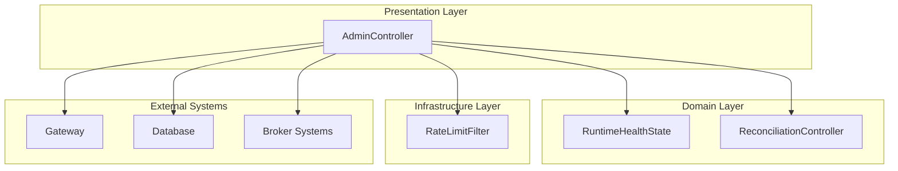
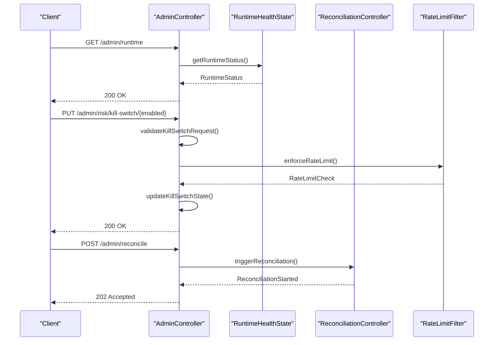
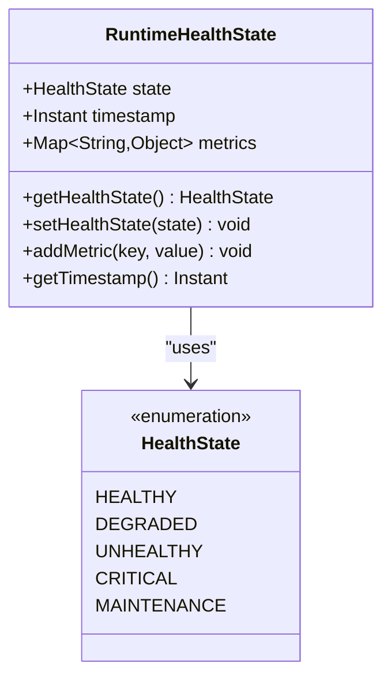
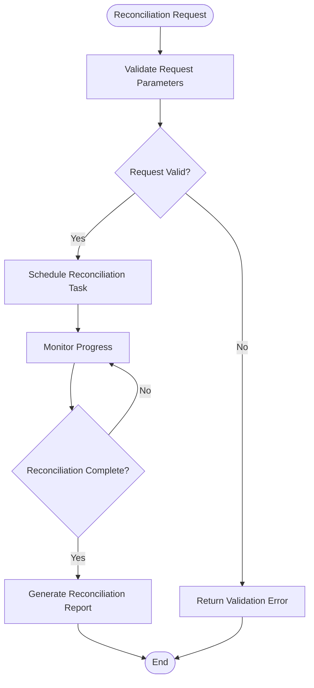
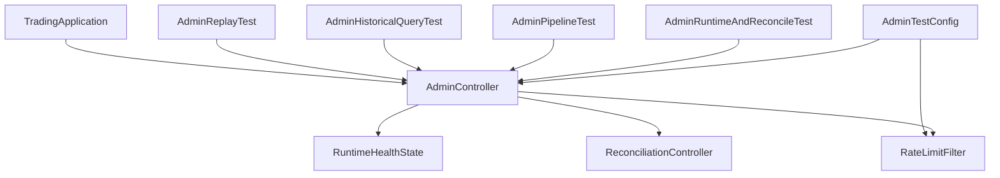

# Administration API

<cite>
**Referenced Files in This Document**
- [AdminController.java](file://app/src/main/java/com/tradej/app/admin/AdminController.java)
- [RuntimeHealthState.java](file://app/src/main/java/com/tradej/app/admin/RuntimeHealthState.java)
- [ReconciliationController.java](file://app/src/main/java/com/tradej/app/admin/ReconciliationController.java)
- [RateLimitFilter.java](file://app/src/main/java/com/tradej/app/config/RateLimitFilter.java)
- [AdminTestConfig.java](file://app/src/test/java/com/tradej/app/integration/AdminTestConfig.java)
- [AdminRuntimeAndReconcileTest.java](file://app/src/test/java/com/tradej/app/integration/AdminRuntimeAndReconcileTest.java)
- [AdminPipelineTest.java](file://app/src/test/java/com/tradej/app/integration/AdminPipelineTest.java)
- [AdminHistoricalQueryTest.java](file://app/src/test/java/com/tradej/app/integration/AdminHistoricalQueryTest.java)
- [AdminReplayTest.java](file://app/src/test/java/com/tradej/app/integration/AdminReplayTest.java)
- [TradingApplication.java](file://app/src/main/java/com/tradej/app/TradingApplication.java)
</cite>

## Table of Contents
1. [Introduction](#introduction)
2. [Project Structure](#project-structure)
3. [Core Components](#core-components)
4. [Architecture Overview](#architecture-overview)
5. [Detailed Component Analysis](#detailed-component-analysis)
6. [Dependency Analysis](#dependency-analysis)
7. [Performance Considerations](#performance-considerations)
8. [Troubleshooting Guide](#troubleshooting-guide)
9. [Conclusion](#conclusion)

## Introduction
This document provides comprehensive REST API documentation for Trade-J administration endpoints. It covers runtime status, kill switch control, pipeline metrics, plugin management, system summary, rate limit monitoring, and reconciliation triggers. The documentation includes operational parameters, security considerations, administrative controls, kill switch states, circuit breaker management, plugin lifecycle, system health monitoring, administrative authentication, audit logging, and operational safety mechanisms. It also provides examples of emergency procedures, system diagnostics, and operational troubleshooting.

## Project Structure
The administration endpoints are implemented within the Trade-J application module. The primary controller for administrative functions is located under the admin package, alongside supporting components for runtime health state, reconciliation, and rate limiting.

**Diagram sources**
- [AdminController.java](file://app/src/main/java/com/tradej/app/admin/AdminController.java)
- [RuntimeHealthState.java](file://app/src/main/java/com/tradej/app/admin/RuntimeHealthState.java)
- [ReconciliationController.java](file://app/src/main/java/com/tradej/app/admin/ReconciliationController.java)
- [RateLimitFilter.java](file://app/src/main/java/com/tradej/app/config/RateLimitFilter.java)
- [AdminTestConfig.java](file://app/src/test/java/com/tradej/app/integration/AdminTestConfig.java)
- [AdminRuntimeAndReconcileTest.java](file://app/src/test/java/com/tradej/app/integration/AdminRuntimeAndReconcileTest.java)
- [AdminPipelineTest.java](file://app/src/test/java/com/tradej/app/integration/AdminPipelineTest.java)
- [AdminHistoricalQueryTest.java](file://app/src/test/java/com/tradej/app/integration/AdminHistoricalQueryTest.java)
- [AdminReplayTest.java](file://app/src/test/java/com/tradej/app/integration/AdminReplayTest.java)
- [TradingApplication.java](file://app/src/main/java/com/tradej/app/TradingApplication.java)

**Section sources**
- [AdminController.java](file://app/src/main/java/com/tradej/app/admin/AdminController.java)
- [AdminTestConfig.java](file://app/src/test/java/com/tradej/app/integration/AdminTestConfig.java)

## Core Components
This section outlines the core administrative components and their responsibilities:
- AdminController: Exposes administrative endpoints for runtime status, kill switch control, pipeline metrics, plugin management, system summary, rate limit monitoring, and reconciliation triggers.
- RuntimeHealthState: Defines runtime health states and associated metadata for system monitoring.
- ReconciliationController: Manages reconciliation-related administrative operations.
- RateLimitFilter: Implements rate limiting for administrative endpoints to prevent abuse and ensure system stability.

Key responsibilities:
- Endpoint exposure and request handling for administrative operations
- Health state reporting and kill switch management
- Plugin lifecycle and strategy management
- Pipeline metrics and system diagnostics
- Audit logging and operational safety mechanisms

**Section sources**
- [AdminController.java](file://app/src/main/java/com/tradej/app/admin/AdminController.java)
- [RuntimeHealthState.java](file://app/src/main/java/com/tradej/app/admin/RuntimeHealthState.java)
- [ReconciliationController.java](file://app/src/main/java/com/tradej/app/admin/ReconciliationController.java)
- [RateLimitFilter.java](file://app/src/main/java/com/tradej/app/config/RateLimitFilter.java)

## Architecture Overview
The administration API follows a layered architecture with clear separation of concerns:
- Presentation Layer: AdminController handles HTTP requests and delegates to service components
- Domain Layer: RuntimeHealthState encapsulates health state logic
- Infrastructure Layer: RateLimitFilter provides cross-cutting security and rate limiting
- Integration Layer: ReconciliationController coordinates administrative operations

**Diagram sources**
- [AdminController.java](file://app/src/main/java/com/tradej/app/admin/AdminController.java)
- [RuntimeHealthState.java](file://app/src/main/java/com/tradej/app/admin/RuntimeHealthState.java)
- [ReconciliationController.java](file://app/src/main/java/com/tradej/app/admin/ReconciliationController.java)
- [RateLimitFilter.java](file://app/src/main/java/com/tradej/app/config/RateLimitFilter.java)

## Detailed Component Analysis

### AdminController Endpoints
The AdminController exposes the following administrative endpoints:

#### Runtime Status Endpoint
- **Path**: `/admin/runtime`
- **Method**: GET
- **Purpose**: Provides current runtime status and health information
- **Response**: JSON containing runtime state, health indicators, and system metrics
- **Security**: Requires administrative authentication
- **Operational Parameters**:
  - No query parameters
  - Response includes system uptime, active connections, and health status

#### Kill Switch Control Endpoint
- **Path**: `/admin/risk/kill-switch/{enabled}`
- **Method**: PUT
- **Purpose**: Controls the kill switch state for risk management
- **Path Parameters**:
  - `enabled`: Boolean value (true/false) to enable/disable kill switch
- **Security**: Administrative access required
- **Operational Parameters**:
  - Validates kill switch state transitions
  - Triggers circuit breaker management when enabled
  - Logs all kill switch state changes

#### Pipeline Metrics Endpoint
- **Path**: `/admin/pipeline`
- **Method**: GET
- **Purpose**: Returns pipeline processing metrics and statistics
- **Response**: JSON containing pipeline throughput, latency, and error rates
- **Security**: Requires administrative privileges
- **Operational Parameters**:
  - No query parameters
  - Includes real-time metrics for all pipeline stages

#### Plugin Management Endpoint
- **Path**: `/admin/strategies`
- **Method**: GET
- **Purpose**: Manages plugin lifecycle and strategy configurations
- **Response**: List of available strategies and their current states
- **Security**: Administrative access required
- **Operational Parameters**:
  - Supports strategy activation/deactivation
  - Provides strategy health monitoring
  - Handles plugin lifecycle events

#### System Summary Endpoint
- **Path**: `/admin/summary`
- **Method**: GET
- **Purpose**: Provides comprehensive system overview
- **Response**: Aggregated system metrics, resource utilization, and operational status
- **Security**: Requires administrative authentication
- **Operational Parameters**:
  - No query parameters
  - Includes broker connectivity, market data feeds, and execution systems

#### Rate Limit Monitoring Endpoint
- **Path**: `/admin/rate-limit`
- **Method**: GET
- **Purpose**: Monitors and reports rate limiting statistics
- **Response**: Current rate limit configuration and usage metrics
- **Security**: Administrative access required
- **Operational Parameters**:
  - Real-time rate limit enforcement metrics
  - Historical usage patterns
  - Threshold alerts and notifications

#### Reconciliation Triggers Endpoint
- **Path**: `/admin/reconcile`
- **Method**: POST
- **Purpose**: Initiates reconciliation processes
- **Response**: Acknowledgement of reconciliation initiation
- **Security**: Administrative privileges required
- **Operational Parameters**:
  - Optional reconciliation type parameter
  - Supports manual reconciliation triggers
  - Provides reconciliation progress monitoring

**Diagram sources**
- [AdminController.java](file://app/src/main/java/com/tradej/app/admin/AdminController.java)
- [RuntimeHealthState.java](file://app/src/main/java/com/tradej/app/admin/RuntimeHealthState.java)
- [ReconciliationController.java](file://app/src/main/java/com/tradej/app/admin/ReconciliationController.java)
- [RateLimitFilter.java](file://app/src/main/java/com/tradej/app/config/RateLimitFilter.java)

**Section sources**
- [AdminController.java](file://app/src/main/java/com/tradej/app/admin/AdminController.java)

### RuntimeHealthState Analysis
The RuntimeHealthState component defines the system's health monitoring capabilities:
- Health state enumeration with predefined values
- Timestamp tracking for state changes
- Health indicator integration
- Circuit breaker coordination

**Diagram sources**
- [RuntimeHealthState.java](file://app/src/main/java/com/tradej/app/admin/RuntimeHealthState.java)

**Section sources**
- [RuntimeHealthState.java](file://app/src/main/java/com/tradej/app/admin/RuntimeHealthState.java)

### ReconciliationController Analysis
The ReconciliationController manages administrative reconciliation operations:
- Manual reconciliation triggers
- Automated reconciliation scheduling
- Progress monitoring and reporting
- Error handling and recovery mechanisms

**Diagram sources**
- [ReconciliationController.java](file://app/src/main/java/com/tradej/app/admin/ReconciliationController.java)

**Section sources**
- [ReconciliationController.java](file://app/src/main/java/com/tradej/app/admin/ReconciliationController.java)

### RateLimitFilter Analysis
The RateLimitFilter provides security and stability through rate limiting:
- Configurable rate limits per endpoint
- Token bucket algorithm implementation
- Dynamic rate adjustment
- Audit logging for rate limit violations

**Section sources**
- [RateLimitFilter.java](file://app/src/main/java/com/tradej/app/config/RateLimitFilter.java)

## Dependency Analysis
The administration API components have the following dependencies:

**Diagram sources**
- [AdminController.java](file://app/src/main/java/com/tradej/app/admin/AdminController.java)
- [RuntimeHealthState.java](file://app/src/main/java/com/tradej/app/admin/RuntimeHealthState.java)
- [ReconciliationController.java](file://app/src/main/java/com/tradej/app/admin/ReconciliationController.java)
- [RateLimitFilter.java](file://app/src/main/java/com/tradej/app/config/RateLimitFilter.java)
- [AdminTestConfig.java](file://app/src/test/java/com/tradej/app/integration/AdminTestConfig.java)
- [AdminRuntimeAndReconcileTest.java](file://app/src/test/java/com/tradej/app/integration/AdminRuntimeAndReconcileTest.java)
- [AdminPipelineTest.java](file://app/src/test/java/com/tradej/app/integration/AdminPipelineTest.java)
- [AdminHistoricalQueryTest.java](file://app/src/test/java/com/tradej/app/integration/AdminHistoricalQueryTest.java)
- [AdminReplayTest.java](file://app/src/test/java/com/tradej/app/integration/AdminReplayTest.java)
- [TradingApplication.java](file://app/src/main/java/com/tradej/app/TradingApplication.java)

**Section sources**
- [AdminTestConfig.java](file://app/src/test/java/com/tradej/app/integration/AdminTestConfig.java)
- [TradingApplication.java](file://app/src/main/java/com/tradej/app/TradingApplication.java)

## Performance Considerations
Administrative endpoints are designed with performance and reliability in mind:
- Asynchronous processing for long-running operations
- Caching mechanisms for frequently accessed data
- Connection pooling for external system integrations
- Resource monitoring and alerting
- Graceful degradation during high load periods

## Troubleshooting Guide
Common administrative operations and their troubleshooting approaches:

### Kill Switch Issues
- Verify kill switch state through runtime status endpoint
- Check circuit breaker status and reset procedures
- Review kill switch change logs for unauthorized modifications
- Validate broker connectivity after kill switch activation

### Pipeline Problems
- Monitor pipeline metrics for bottlenecks
- Check strategy plugin health and dependencies
- Review pipeline stage error rates and retry patterns
- Validate market data feed connectivity

### Reconciliation Failures
- Check reconciliation job status and logs
- Verify database connectivity and permissions
- Review reconciliation thresholds and tolerances
- Monitor broker system availability

### Security and Access
- Validate administrative credentials and permissions
- Check rate limit configurations and violations
- Review audit logs for suspicious activities
- Verify SSL/TLS certificate validity

**Section sources**
- [AdminRuntimeAndReconcileTest.java](file://app/src/test/java/com/tradej/app/integration/AdminRuntimeAndReconcileTest.java)
- [AdminPipelineTest.java](file://app/src/test/java/com/tradej/app/integration/AdminPipelineTest.java)
- [AdminHistoricalQueryTest.java](file://app/src/test/java/com/tradej/app/integration/AdminHistoricalQueryTest.java)
- [AdminReplayTest.java](file://app/src/test/java/com/tradej/app/integration/AdminReplayTest.java)

## Conclusion
The Trade-J administration API provides comprehensive operational controls for managing the trading system. The endpoints cover essential administrative functions including runtime monitoring, risk management, pipeline operations, plugin lifecycle management, system diagnostics, and reconciliation processes. The implementation emphasizes security through rate limiting, administrative authentication, and audit logging while maintaining system stability and performance. The modular architecture ensures maintainability and extensibility for future administrative capabilities.