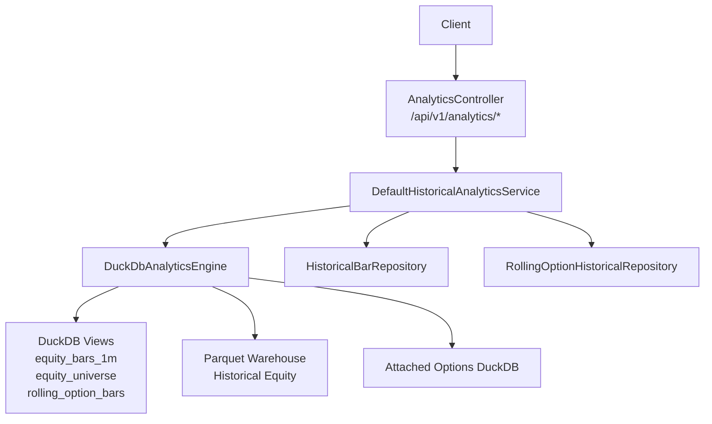
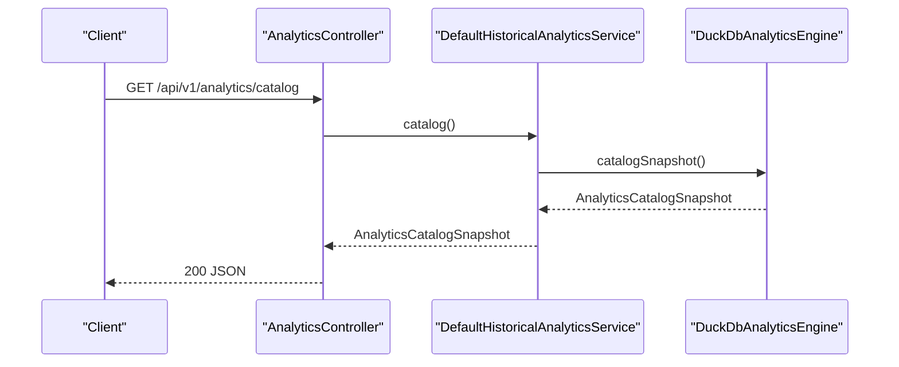
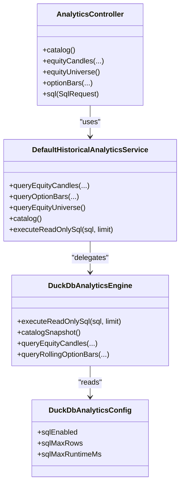

# Analytics API

<cite>
**Referenced Files in This Document**
- [AnalyticsController.java](file://app/src/main/java/com/tradej/app/api/AnalyticsController.java)
- [DefaultHistoricalAnalyticsService.java](file://data/analytics/src/main/java/com/tradej/analytics/service/DefaultHistoricalAnalyticsService.java)
- [DuckDbAnalyticsEngine.java](file://data/analytics/src/main/java/com/tradej/analytics/engine/DuckDbAnalyticsEngine.java)
- [AnalyticsSqlGuard.java](file://data/analytics/src/main/java/com/tradej/analytics/guard/AnalyticsSqlGuard.java)
- [DuckDbAnalyticsConfig.java](file://data/analytics/src/main/java/com/tradej/analytics/config/DuckDbAnalyticsConfig.java)
- [openapi.yaml](file://docs/openapi.yaml)
- [API_DOCUMENTATION.md](file://docs/API_DOCUMENTATION.md)
- [ANALYTICS_CATALOG.md](file://docs/contracts/ANALYTICS_CATALOG.md)
- [CONFIG.md](file://CONFIG.md)
- [ARCHITECTURE.md](file://ARCHITECTURE.md)
- [Candle.java](file://core/src/main/java/com/tradej/core/domain/model/Candle.java)
- [RollingOptionBar.java](file://core/src/main/java/com/tradej/core/domain/model/RollingOptionBar.java)
- [UniverseEntry.java](file://core/src/main/java/com/tradej/core/domain/model/UniverseEntry.java)
- [OptionType.java](file://core/src/main/java/com/tradej/core/domain/value/OptionType.java)
- [ExchangeSegment.java](file://core/src/main/java/com/tradej/core/domain/value/ExchangeSegment.java)
- [CandleHistoryRequest.java](file://core/src/main/java/com/tradej/core/domain/model/CandleHistoryRequest.java)
- [RollingOptionSeriesRequest.java](file://core/src/main/java/com/tradej/core/domain/model/RollingOptionSeriesRequest.java)
- [AnalyticsCatalogSnapshot.java](file://core/src/main/java/com/tradej/core/domain/model/AnalyticsCatalogSnapshot.java)
- [AnalyticsQueryResult.java](file://core/src/main/java/com/tradej/core/domain/model/AnalyticsQueryResult.java)
</cite>

## Table of Contents
1. [Introduction](#introduction)
2. [Project Structure](#project-structure)
3. [Core Components](#core-components)
4. [Architecture Overview](#architecture-overview)
5. [Detailed Component Analysis](#detailed-component-analysis)
6. [Dependency Analysis](#dependency-analysis)
7. [Performance Considerations](#performance-considerations)
8. [Troubleshooting Guide](#troubleshooting-guide)
9. [Conclusion](#conclusion)
10. [Appendices](#appendices)

## Introduction
This document provides comprehensive REST API documentation for Trade-J's analytics endpoints. It covers the catalog snapshot, equity candles, rolling option bars, and SQL query execution endpoints. For each endpoint, you will find detailed parameter specifications, response schemas, filtering options, aggregation capabilities, and practical examples. Additionally, it documents performance limits, query optimization techniques, and data freshness considerations to help you build efficient analytical workflows.

## Project Structure
The analytics API is implemented as a Spring Boot REST controller that delegates to a service layer backed by DuckDB for SQL execution and Parquet-backed repositories for equity and options data.

**Diagram sources**
- [AnalyticsController.java:32-181](file://app/src/main/java/com/tradej/app/api/AnalyticsController.java#L32-L181)
- [DefaultHistoricalAnalyticsService.java:18-71](file://data/analytics/src/main/java/com/tradej/analytics/service/DefaultHistoricalAnalyticsService.java#L18-L71)
- [DuckDbAnalyticsEngine.java:33-132](file://data/analytics/src/main/java/com/tradej/analytics/engine/DuckDbAnalyticsEngine.java#L33-L132)

**Section sources**
- [AnalyticsController.java:32-181](file://app/src/main/java/com/tradej/app/api/AnalyticsController.java#L32-L181)
- [DefaultHistoricalAnalyticsService.java:18-71](file://data/analytics/src/main/java/com/tradej/analytics/service/DefaultHistoricalAnalyticsService.java#L18-L71)
- [DuckDbAnalyticsEngine.java:33-132](file://data/analytics/src/main/java/com/tradej/analytics/engine/DuckDbAnalyticsEngine.java#L33-L132)

## Core Components
- AnalyticsController: Exposes REST endpoints for catalog, equity candles, universe, rolling option bars, and SQL execution.
- DefaultHistoricalAnalyticsService: Orchestrates requests to repositories and the DuckDB engine.
- DuckDbAnalyticsEngine: Manages DuckDB connection, bootstraps views, executes read-only SQL, and exposes catalog metadata.
- AnalyticsSqlGuard: Validates and sanitizes SQL queries to ensure read-only execution.
- DuckDbAnalyticsConfig: Provides configuration for SQL enablement, row limits, runtime caps, and warehouse paths.

**Section sources**
- [AnalyticsController.java:32-181](file://app/src/main/java/com/tradej/app/api/AnalyticsController.java#L32-L181)
- [DefaultHistoricalAnalyticsService.java:18-71](file://data/analytics/src/main/java/com/tradej/analytics/service/DefaultHistoricalAnalyticsService.java#L18-L71)
- [DuckDbAnalyticsEngine.java:33-132](file://data/analytics/src/main/java/com/tradej/analytics/engine/DuckDbAnalyticsEngine.java#L33-L132)
- [AnalyticsSqlGuard.java:6-44](file://data/analytics/src/main/java/com/tradej/analytics/guard/AnalyticsSqlGuard.java#L6-L44)
- [DuckDbAnalyticsConfig.java:5-26](file://data/analytics/src/main/java/com/tradej/analytics/config/DuckDbAnalyticsConfig.java#L5-L26)

## Architecture Overview
The analytics API follows a layered architecture:
- Presentation: Spring MVC controller handles HTTP requests and responses.
- Application: Service layer validates inputs, normalizes symbols, and orchestrates data retrieval.
- Persistence: DuckDB engine reads from Parquet warehouses and optionally attaches external DuckDB files for options and runtime data.
- Data models: Strongly typed models represent candles, rolling option bars, universes, and query results.

**Diagram sources**
- [AnalyticsController.java:47-50](file://app/src/main/java/com/tradej/app/api/AnalyticsController.java#L47-L50)
- [DefaultHistoricalAnalyticsService.java:53-55](file://data/analytics/src/main/java/com/tradej/analytics/service/DefaultHistoricalAnalyticsService.java#L53-L55)
- [DuckDbAnalyticsEngine.java:386-429](file://data/analytics/src/main/java/com/tradej/analytics/engine/DuckDbAnalyticsEngine.java#L386-L429)

**Section sources**
- [AnalyticsController.java:47-50](file://app/src/main/java/com/tradej/app/api/AnalyticsController.java#L47-L50)
- [DefaultHistoricalAnalyticsService.java:53-55](file://data/analytics/src/main/java/com/tradej/analytics/service/DefaultHistoricalAnalyticsService.java#L53-L55)
- [DuckDbAnalyticsEngine.java:386-429](file://data/analytics/src/main/java/com/tradej/analytics/engine/DuckDbAnalyticsEngine.java#L386-L429)

## Detailed Component Analysis

### Endpoint: GET /api/v1/analytics/catalog
- Purpose: Returns a catalog snapshot containing dataset metadata, freshness windows, and row counts.
- Response schema:
  - equityRoot: string
  - optionsWarehousePath: string
  - equitySymbols: integer
  - barFileCount: integer
  - equityMinBarTimeMs: date-time or null
  - equityMaxBarTimeMs: date-time or null
  - universeRows: integer
  - optionsBars: integer
  - optionsMinBarTimeMs: date-time or null
  - optionsMaxBarTimeMs: date-time or null
  - optionsAttached: boolean
  - runtimeAttached: boolean
  - views: map of view names to descriptions

- Notes:
  - Uses DuckDB engine to compute counts and min/max timestamps from views.
  - Reflects whether the options and runtime databases are attached.

**Section sources**
- [AnalyticsController.java:47-50](file://app/src/main/java/com/tradej/app/api/AnalyticsController.java#L47-L50)
- [DuckDbAnalyticsEngine.java:386-429](file://data/analytics/src/main/java/com/tradej/analytics/engine/DuckDbAnalyticsEngine.java#L386-L429)
- [AnalyticsCatalogSnapshot.java](file://core/src/main/java/com/tradej/core/domain/model/AnalyticsCatalogSnapshot.java)

### Endpoint: GET /api/v1/analytics/equity/candles
- Purpose: Fetch equity candles for a symbol within a date range, with optional interval and limit.
- Parameters:
  - symbol: string, required
  - exchangeSegment: enum string, default NSE_EQ
  - interval: string, required (e.g., "1m", "1h", "1d")
  - from: date string, required
  - to: date string, required
  - limit: integer, default 5000

- Response schema:
  - symbol: string
  - exchangeSegment: enum string
  - interval: string
  - from: date string
  - to: date string
  - count: integer
  - candles: array of candle objects
    - symbol: string
    - interval: string
    - barTimeMs: integer (epoch milliseconds)
    - openPaisa: integer
    - highPaisa: integer
    - lowPaisa: integer
    - closePaisa: integer
    - volume: integer

- Filtering and aggregation:
  - Filters by symbol, interval, and date range.
  - Honors limit to cap returned candles.
  - Uses Parquet partitioning for efficient range scans.

- Data freshness:
  - Bar times are epoch milliseconds in IST session context.
  - Product APIs resample via dedicated resamplers anchored at 09:15 IST; avoid resampling in ad-hoc SQL for parity.

**Section sources**
- [AnalyticsController.java:52-80](file://app/src/main/java/com/tradej/app/api/AnalyticsController.java#L52-L80)
- [Candle.java](file://core/src/main/java/com/tradej/core/domain/model/Candle.java)
- [CandleHistoryRequest.java](file://core/src/main/java/com/tradej/core/domain/model/CandleHistoryRequest.java)
- [ExchangeSegment.java](file://core/src/main/java/com/tradej/core/domain/value/ExchangeSegment.java)
- [ANALYTICS_CATALOG.md:64-68](file://docs/contracts/ANALYTICS_CATALOG.md#L64-L68)

### Endpoint: GET /api/v1/analytics/equity/universe
- Purpose: Retrieve the Nifty 500 universe listing with metadata.
- Response schema:
  - count: integer
  - symbols: array of universe entries
    - symbol: string
    - companyName: string
    - isin: string
    - industry: string
    - macroSector: string
    - asOfDate: date or null

- Notes:
  - Builds universe from equity_bars_1m view and optional industry metadata parquet.

**Section sources**
- [AnalyticsController.java:82-89](file://app/src/main/java/com/tradej/app/api/AnalyticsController.java#L82-L89)
- [UniverseEntry.java](file://core/src/main/java/com/tradej/core/domain/model/UniverseEntry.java)

### Endpoint: GET /api/v1/analytics/options/bars
- Purpose: Fetch rolling option bars for a specific option series within a time window.
- Parameters:
  - underlying: string, required
  - expiryKind: string, required
  - expiryCode: integer, required
  - strikeOffset: integer, required
  - optionType: enum string, required (CALL, PUT, UNKNOWN)
  - intervalMin: integer, default 5
  - from: integer, required (epoch milliseconds)
  - to: integer, required (epoch milliseconds)
  - limit: integer, default 1000

- Response schema:
  - underlying: string
  - expiryKind: string
  - expiryCode: integer
  - strikeOffset: integer
  - optionType: enum string
  - intervalMin: integer
  - from: integer (epoch milliseconds)
  - to: integer (epoch milliseconds)
  - count: integer
  - bars: array of rolling option bar objects
    - timestampMs: integer (epoch milliseconds)
    - openPaisa: integer
    - highPaisa: integer
    - lowPaisa: integer
    - closePaisa: integer
    - volume: integer
    - iv: float (implied volatility)
    - oi: integer (open interest)
    - spotPaisa: integer
    - strikePaisa: integer

- Filtering and aggregation:
  - Filters by underlying, expiry kind/code, strike offset, option type, interval, and time range.
  - Requires options warehouse to be present; otherwise returns empty view.

- Data freshness:
  - Latest option trading day can be determined via engine helpers.

**Section sources**
- [AnalyticsController.java:91-126](file://app/src/main/java/com/tradej/app/api/AnalyticsController.java#L91-L126)
- [RollingOptionSeriesRequest.java](file://core/src/main/java/com/tradej/core/domain/model/RollingOptionSeriesRequest.java)
- [RollingOptionBar.java](file://core/src/main/java/com/tradej/core/domain/model/RollingOptionBar.java)
- [OptionType.java](file://core/src/main/java/com/tradej/core/domain/value/OptionType.java)

### Endpoint: POST /api/v1/analytics/sql
- Purpose: Execute a guarded read-only SQL query against DuckDB views.
- Request body:
  - sql: string, required (SELECT, WITH, DESCRIBE, or SHOW)
  - limit: integer, optional (row limit applied if not specified in SQL)

- Response schema:
  - columns: array of column names
  - rows: array of row objects keyed by column names
  - count: integer
  - elapsedMs: integer

- Security and guardrails:
  - Only SELECT, WITH, DESCRIBE, and SHOW statements are allowed.
  - Forbidden keywords are blocked (e.g., CREATE, DROP, INSERT, UPDATE).
  - Multi-statement SQL is disallowed.
  - Automatically applies a row limit if none is provided.

- Configuration:
  - Enabled/disabled via trade.analytics.sql-enabled.
  - Max rows and max runtime controlled by trade.analytics.sql-max-rows and trade.analytics.sql-max-runtime-ms.

- Supported views:
  - equity_bars_1m: Parquet-backed Nifty 500 1-minute bars with normalized intervals.
  - equity_universe: Universe metadata joined from symbols and industry parquets.
  - rolling_option_bars: Attached options warehouse rolling bars (optional).

- Examples:
  - Count records per symbol in daily bars: SELECT symbol, count(*) FROM equity_bars_1m WHERE interval = '1d' GROUP BY symbol LIMIT 10
  - Cross-asset join between equity and options bars aligned by bar_time_ms

**Section sources**
- [AnalyticsController.java:128-137](file://app/src/main/java/com/tradej/app/api/AnalyticsController.java#L128-L137)
- [DuckDbAnalyticsEngine.java:431-457](file://data/analytics/src/main/java/com/tradej/analytics/engine/DuckDbAnalyticsEngine.java#L431-L457)
- [AnalyticsSqlGuard.java:16-42](file://data/analytics/src/main/java/com/tradej/analytics/guard/AnalyticsSqlGuard.java#L16-L42)
- [DuckDbAnalyticsConfig.java:5-26](file://data/analytics/src/main/java/com/tradej/analytics/config/DuckDbAnalyticsConfig.java#L5-L26)
- [openapi.yaml:279-302](file://docs/openapi.yaml#L279-L302)
- [API_DOCUMENTATION.md:162-171](file://docs/API_DOCUMENTATION.md#L162-L171)
- [ANALYTICS_CATALOG.md:21-29](file://docs/contracts/ANALYTICS_CATALOG.md#L21-L29)

## Dependency Analysis
The analytics API exhibits clean separation of concerns:
- Controller depends on HistoricalAnalyticsService interface.
- Service depends on repositories and DuckDB engine.
- Engine depends on configuration and filesystem paths for Parquet and attached DuckDB.

**Diagram sources**
- [AnalyticsController.java:32-181](file://app/src/main/java/com/tradej/app/api/AnalyticsController.java#L32-L181)
- [DefaultHistoricalAnalyticsService.java:18-71](file://data/analytics/src/main/java/com/tradej/analytics/service/DefaultHistoricalAnalyticsService.java#L18-L71)
- [DuckDbAnalyticsEngine.java:33-132](file://data/analytics/src/main/java/com/tradej/analytics/engine/DuckDbAnalyticsEngine.java#L33-L132)
- [DuckDbAnalyticsConfig.java:5-26](file://data/analytics/src/main/java/com/tradej/analytics/config/DuckDbAnalyticsConfig.java#L5-L26)

**Section sources**
- [AnalyticsController.java:32-181](file://app/src/main/java/com/tradej/app/api/AnalyticsController.java#L32-L181)
- [DefaultHistoricalAnalyticsService.java:18-71](file://data/analytics/src/main/java/com/tradej/analytics/service/DefaultHistoricalAnalyticsService.java#L18-L71)
- [DuckDbAnalyticsEngine.java:33-132](file://data/analytics/src/main/java/com/tradej/analytics/engine/DuckDbAnalyticsEngine.java#L33-L132)
- [DuckDbAnalyticsConfig.java:5-26](file://data/analytics/src/main/java/com/tradej/analytics/config/DuckDbAnalyticsConfig.java#L5-L26)

## Performance Considerations
- Row limits and timeouts:
  - SQL queries are subject to a configurable maximum row count and maximum runtime. The controller enforces the smaller of the request limit and configured maximum.
- Partition pruning:
  - Equity candle queries leverage Parquet partitioning by date to reduce I/O.
- Timezone semantics:
  - Bar times are epoch milliseconds in IST. Queries should align with this convention to avoid misalignment with product resampling.
- View availability:
  - Options bars require an attached options warehouse; otherwise, the rolling_option_bars view is empty and queries will return no data.
- Export patterns:
  - Use the SQL endpoint to export results; avoid direct file path access to keep workspace root resolution centralized.

**Section sources**
- [AnalyticsController.java:128-137](file://app/src/main/java/com/tradej/app/api/AnalyticsController.java#L128-L137)
- [DuckDbAnalyticsEngine.java:431-457](file://data/analytics/src/main/java/com/tradej/analytics/engine/DuckDbAnalyticsEngine.java#L431-L457)
- [DuckDbAnalyticsConfig.java:5-26](file://data/analytics/src/main/java/com/tradej/analytics/config/DuckDbAnalyticsConfig.java#L5-L26)
- [ANALYTICS_CATALOG.md:64-68](file://docs/contracts/ANALYTICS_CATALOG.md#L64-L68)

## Troubleshooting Guide
- SQL disabled:
  - If trade.analytics.sql-enabled is false, POST /api/v1/analytics/sql will fail with an error indicating SQL is disabled.
- SQL validation failures:
  - Queries must be SELECT, WITH, DESCRIBE, or SHOW; forbidden keywords or multi-statement SQL will be rejected.
- Options warehouse not attached:
  - If the options DuckDB file is missing, rolling_option_bars view is empty. Queries will return no option bars.
- Rate limiting:
  - The SQL endpoint is rate-limited; excessive requests may be throttled.

**Section sources**
- [AnalyticsController.java:128-137](file://app/src/main/java/com/tradej/app/api/AnalyticsController.java#L128-L137)
- [AnalyticsSqlGuard.java:16-42](file://data/analytics/src/main/java/com/tradej/analytics/guard/AnalyticsSqlGuard.java#L16-L42)
- [DuckDbAnalyticsEngine.java:134-183](file://data/analytics/src/main/java/com/tradej/analytics/engine/DuckDbAnalyticsEngine.java#L134-L183)
- [CONFIG.md:116-118](file://CONFIG.md#L116-L118)

## Conclusion
The Trade-J analytics API provides a robust, secure, and performant interface for accessing historical market data. By leveraging DuckDB views over Parquet warehouses and enforcing strict SQL guardrails, it enables flexible analytical workflows while maintaining data integrity and performance. Use the catalog endpoint to discover datasets, the typed endpoints for common queries, and the SQL endpoint for ad-hoc analytics with built-in safety and performance controls.

## Appendices

### API Reference Summary
- GET /api/v1/analytics/catalog: Returns catalog snapshot metadata.
- GET /api/v1/analytics/equity/candles: Returns equity candles with date-range and limit controls.
- GET /api/v1/analytics/equity/universe: Returns Nifty 500 universe listing.
- GET /api/v1/analytics/options/bars: Returns rolling option bars for a series.
- POST /api/v1/analytics/sql: Executes guarded read-only SQL with automatic row limit.

**Section sources**
- [openapi.yaml:199-302](file://docs/openapi.yaml#L199-L302)
- [API_DOCUMENTATION.md:115-171](file://docs/API_DOCUMENTATION.md#L115-L171)
- [ARCHITECTURE.md:1031-1035](file://ARCHITECTURE.md#L1031-L1035)

### Example Queries
- Cross-asset alignment:
  - Join equity_bars_1m and rolling_option_bars on bar_time_ms for matched timestamps.
- Series filtering:
  - Filter by underlying, option_type, strike_offset, and interval_min for precise option series selection.
- Universe enrichment:
  - Join equity_universe with equity_bars_1m to enrich symbols with metadata.

**Section sources**
- [ANALYTICS_CATALOG.md:69-81](file://docs/contracts/ANALYTICS_CATALOG.md#L69-L81)