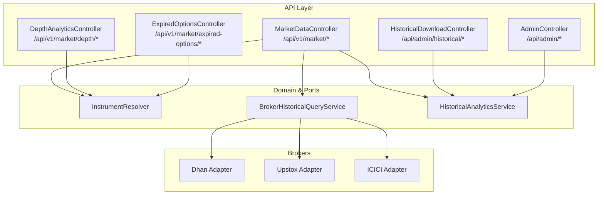
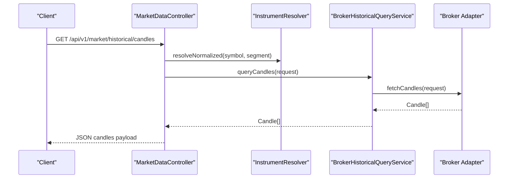
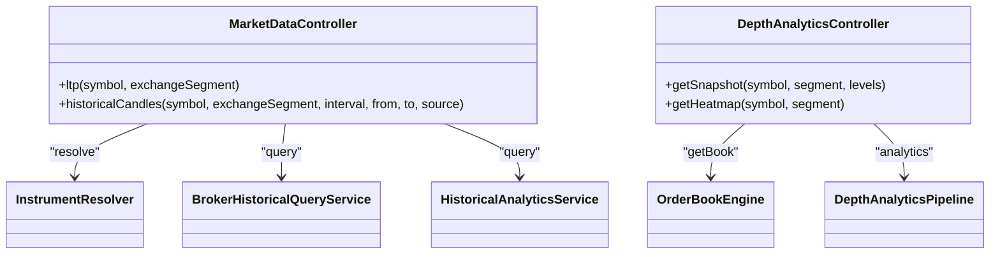

# Market Data API

<cite>
**Referenced Files in This Document**
- [MarketDataController.java](file://app/src/main/java/com/tradej/app/api/MarketDataController.java)
- [openapi.yaml](file://docs/openapi.yaml)
- [DepthAnalyticsController.java](file://app/src/main/java/com/tradej/app/api/DepthAnalyticsController.java)
- [ExpiredOptionsController.java](file://app/src/main/java/com/tradej/app/api/ExpiredOptionsController.java)
- [HistoricalDownloadController.java](file://app/src/main/java/com/tradej/app/admin/HistoricalDownloadController.java)
- [AdminController.java](file://app/src/main/java/com/tradej/app/admin/AdminController.java)
- [DhanApiEndpoints.java](file://broker/dhan/src/main/java/com/tradej/broker/dhan/constants/DhanApiEndpoints.java)
- [UpstoxMarketDataProvider.java](file://broker/upstox/src/main/java/com/tradej/broker/upstox/adapter/UpstoxMarketDataProvider.java)
- [MarketDepthOrchestrator.java](file://trading/execution/src/main/java/com/tradej/execution/marketdata/MarketDepthOrchestrator.java)
- [RateLimitFilter.java](file://app/src/main/java/com/tradej/app/config/RateLimitFilter.java)
- [ExchangeSegment.java](file://core/src/main/java/com/tradej/core/domain/value/ExchangeSegment.java)
- [SymbolController.java](file://app/src/main/java/com/tradej/app/api/SymbolController.java)
- [MarketDataHealthIndicator.java](file://app/src/main/java/com/tradej/app/health/MarketDataHealthIndicator.java)
- [MarketDataValidationTest.java](file://app/src/test/java/com/tradej/app/integration/MarketDataValidationTest.java)
- [DhanMarketDataProviderRequestTest.java](file://broker/dhan/src/test/java/com/tradej/broker/dhan/adapter/DhanMarketDataProviderRequestTest.java)
- [UpstoxMarketDataIntegrationTest.java](file://app/src/test/java/com/tradej/app/integration/UpstoxMarketDataIntegrationTest.java)
- [IciciMarketDataIntegrationTest.java](file://app/src/test/java/com/tradej/app/integration/IciciMarketDataIntegrationTest.java)
- [08_RATE_LIMIT_ANALYSIS.md](file://docs/reports/reports_broker_2026-06-08/08_RATE_LIMIT_ANALYSIS.md)
- [05_SCALING_REPORT.md](file://docs/reports/reports_broker_2026-06-08/05_SCALING_REPORT.md)
- [PLUGIN_MARKET_UTILS_REVIEW_2026-06-06.md](file://docs/reports/PLUGIN_MARKET_UTILS_REVIEW_2026-06-06.md)
</cite>

## Table of Contents
1. [Introduction](#introduction)
2. [Project Structure](#project-structure)
3. [Core Components](#core-components)
4. [Architecture Overview](#architecture-overview)
5. [Detailed Component Analysis](#detailed-component-analysis)
6. [Dependency Analysis](#dependency-analysis)
7. [Performance Considerations](#performance-considerations)
8. [Troubleshooting Guide](#troubleshooting-guide)
9. [Conclusion](#conclusion)
10. [Appendices](#appendices)

## Introduction
This document provides comprehensive REST API documentation for Trade-J market data endpoints. It covers:
- Last Traded Price (LTP) retrieval
- Historical candle data
- Expired options functionality
- Market depth endpoints
It also documents exchange segment enumerations, instrument symbol formats, timestamp handling, caching mechanisms, rate limiting, and performance considerations for high-frequency market data access.

## Project Structure
The market data API surface is primarily exposed via Spring MVC controllers under the application module, with backend integrations to broker adapters and analytical services. OpenAPI definitions and integration tests provide additional specification and validation.

**Diagram sources**
- [MarketDataController.java:25-84](file://app/src/main/java/com/tradej/app/api/MarketDataController.java#L25-L84)
- [DepthAnalyticsController.java:12-43](file://app/src/main/java/com/tradej/app/api/DepthAnalyticsController.java#L12-L43)
- [ExpiredOptionsController.java](file://app/src/main/java/com/tradej/app/api/ExpiredOptionsController.java)
- [HistoricalDownloadController.java:262-292](file://app/src/main/java/com/tradej/app/admin/HistoricalDownloadController.java#L262-L292)
- [AdminController.java:205-232](file://app/src/main/java/com/tradej/app/admin/AdminController.java#L205-L232)

**Section sources**
- [MarketDataController.java:25-84](file://app/src/main/java/com/tradej/app/api/MarketDataController.java#L25-L84)
- [openapi.yaml:51-91](file://docs/openapi.yaml#L51-L91)

## Core Components
- MarketDataController: Exposes LTP and historical candles endpoints.
- DepthAnalyticsController: Provides market depth snapshots and heatmap data.
- ExpiredOptionsController: Handles expired options analytics.
- HistoricalDownloadController and AdminController: Provide administrative historical candle queries.
- InstrumentResolver and HistoricalAnalyticsService: Normalize symbols and serve analytical datasets.
- Broker adapters (Dhan, Upstox, ICICI): Implement market data retrieval and mapping.

**Section sources**
- [MarketDataController.java:25-84](file://app/src/main/java/com/tradej/app/api/MarketDataController.java#L25-L84)
- [DepthAnalyticsController.java:12-43](file://app/src/main/java/com/tradej/app/api/DepthAnalyticsController.java#L12-L43)
- [ExpiredOptionsController.java](file://app/src/main/java/com/tradej/app/api/ExpiredOptionsController.java)
- [HistoricalDownloadController.java:262-292](file://app/src/main/java/com/tradej/app/admin/HistoricalDownloadController.java#L262-L292)
- [AdminController.java:205-232](file://app/src/main/java/com/tradej/app/admin/AdminController.java#L205-L232)

## Architecture Overview
The API layer delegates to domain services and broker adapters. Historical data can be served from broker feeds or analytical parquet storage depending on the source parameter.

**Diagram sources**
- [MarketDataController.java:60-84](file://app/src/main/java/com/tradej/app/api/MarketDataController.java#L60-L84)
- [UpstoxMarketDataProvider.java:109-112](file://broker/upstox/src/main/java/com/tradej/broker/upstox/adapter/UpstoxMarketDataProvider.java#L109-L112)

## Detailed Component Analysis

### Endpoint: GET /api/v1/market/ltp
- Purpose: Retrieve last traded price for a given instrument.
- Path: /api/v1/market/ltp
- Method: GET
- Produces: application/json

Parameters
- symbol: string, required. Instrument symbol. See Symbol Formats below.
- exchangeSegment: enum, required. Segment identifier. See Exchange Segments below.

Response Schema
- symbol: string. Canonical symbol.
- canonicalSymbol: string. Same as symbol.
- exchangeSegment: string. Name of the ExchangeSegment enum.
- ltpPaisa: integer. Last traded price in paisa (1 rupee = 100 paisa).

Example Request
- GET /api/v1/market/ltp?symbol=NIFTY&exchangeSegment=NSE_FO

Example Response
{
  "symbol": "NIFTY",
  "canonicalSymbol": "NIFTY",
  "exchangeSegment": "NSE_FO",
  "ltpPaisa": 2215000
}

Error Handling
- Returns 500 if broker market data is not configured.

Notes
- The endpoint resolves the instrument via InstrumentResolver and queries the broker historical query service for LTP in paisa.

**Section sources**
- [MarketDataController.java:43-58](file://app/src/main/java/com/tradej/app/api/MarketDataController.java#L43-L58)

### Endpoint: GET /api/v1/market/historical/candles
- Purpose: Retrieve historical candle data for a given instrument and date range.
- Path: /api/v1/market/historical/candles
- Method: GET
- Produces: application/json

Parameters
- symbol: string, required.
- exchangeSegment: enum, required.
- interval: string, optional, default 1d. Supported intervals include 1m, 5m, 15m, 1h, 1d.
- from: date, required. ISO date (yyyy-MM-dd).
- to: date, required. ISO date (yyyy-MM-dd).
- source: string, optional, default broker. Allowed values: broker, parquet.

Response Schema
- symbol: string. Canonical symbol.
- canonicalSymbol: string.
- exchangeSegment: string.
- interval: string.
- from: string (ISO date).
- to: string (ISO date).
- source: string.
- count: integer. Number of candles returned.
- candles: array of candle objects:
  - startTimeMs: integer. Milliseconds since epoch.
  - endTimeMs: integer. Milliseconds since epoch.
  - openPaisa: integer.
  - highPaisa: integer.
  - lowPaisa: integer.
  - closePaisa: integer.
  - volume: integer.

Example Request
- GET /api/v1/market/historical/candles?symbol=NIFTY&exchangeSegment=NSE_FO&interval=5m&from=2026-05-01&to=2026-05-10&source=broker

Example Response
{
  "symbol": "NIFTY",
  "canonicalSymbol": "NIFTY",
  "exchangeSegment": "NSE_FO",
  "interval": "5m",
  "from": "2026-05-01",
  "to": "2026-05-10",
  "source": "broker",
  "count": 120,
  "candles": [
    {
      "startTimeMs": 1746038400000,
      "endTimeMs": 1746038700000,
      "openPaisa": 2210000,
      "highPaisa": 2215000,
      "lowPaisa": 2209000,
      "closePaisa": 2214000,
      "volume": 15000
    }
  ]
}

Error Handling
- Returns 500 if broker market data is not configured.

Notes
- Supports switching between broker and parquet sources via the source parameter.
- Uses InstrumentResolver to normalize symbol and segment.

**Section sources**
- [MarketDataController.java:60-84](file://app/src/main/java/com/tradej/app/api/MarketDataController.java#L60-L84)
- [openapi.yaml:51-91](file://docs/openapi.yaml#L51-L91)

### Endpoint: GET /api/v1/market/expired-options/*
- Purpose: Provide expired options analytics and related data.
- Path: /api/v1/market/expired-options/*
- Method: GET
- Produces: application/json

Parameters
- Varies by sub-endpoint. Consult controller implementation for exact parameters.

Response Schema
- Depends on the specific sub-endpoint.

Notes
- Implementation resides in ExpiredOptionsController.

**Section sources**
- [ExpiredOptionsController.java](file://app/src/main/java/com/tradej/app/api/ExpiredOptionsController.java)

### Endpoint: GET /api/v1/market/depth/{symbol}
- Purpose: Retrieve market depth snapshot for a symbol.
- Path: /api/v1/market/depth/{symbol}
- Method: GET
- Produces: application/json

Parameters
- symbol: path parameter, required.
- segment: query parameter, optional, default NSE_EQ.
- levels: query parameter, optional, default 20.

Response Schema
- symbol: string.
- segment: string.
- bids: array of bid entries (pricePaisa, quantity).
- asks: array of ask entries (pricePaisa, quantity).
- totalBidQty: integer.
- totalAskQty: integer.
- mid: float.
- timestamp: long.

Notes
- Returns empty snapshot if no order book exists for the symbol.

**Section sources**
- [DepthAnalyticsController.java:24-35](file://app/src/main/java/com/tradej/app/api/DepthAnalyticsController.java#L24-L35)

### Endpoint: GET /api/v1/market/depth/{symbol}/heatmap
- Purpose: Retrieve depth heatmap data for a symbol.
- Path: /api/v1/market/depth/{symbol}/heatmap
- Method: GET
- Produces: application/json

Parameters
- symbol: path parameter, required.
- segment: query parameter, optional, default NSE_EQ.

Response Schema
- Heatmap chunk data for depth analytics.

**Section sources**
- [DepthAnalyticsController.java:37-42](file://app/src/main/java/com/tradej/app/api/DepthAnalyticsController.java#L37-L42)

### Administrative Historical Candle Endpoints
- GET /api/admin/historical/equity/candles
  - Deprecated in favor of analytics endpoint.
  - Parameters: symbol, from (epoch ms), to (epoch ms), limit (default 5000).
  - Response: symbol, from, to, count, candles.

- GET /api/admin/historical/candles
  - Parameters: symbol, interval (default 5m), from (epoch ms), to (epoch ms), limit (default 1000).
  - Response: symbol, interval, from, to, count, candles.

**Section sources**
- [HistoricalDownloadController.java:262-292](file://app/src/main/java/com/tradej/app/admin/HistoricalDownloadController.java#L262-L292)
- [AdminController.java:205-232](file://app/src/main/java/com/tradej/app/admin/AdminController.java#L205-L232)

## Dependency Analysis
- MarketDataController depends on InstrumentResolver, BrokerHistoricalQueryService, and HistoricalAnalyticsService.
- BrokerHistoricalQueryService routes to broker adapters (Dhan, Upstox, ICICI) for data retrieval.
- DepthAnalyticsController depends on OrderBookEngine and DepthAnalyticsPipeline.
- ExpiredOptionsController depends on instrument resolution and analytics services.

**Diagram sources**
- [MarketDataController.java:25-84](file://app/src/main/java/com/tradej/app/api/MarketDataController.java#L25-L84)
- [DepthAnalyticsController.java:12-43](file://app/src/main/java/com/tradej/app/api/DepthAnalyticsController.java#L12-L43)

**Section sources**
- [MarketDataController.java:25-84](file://app/src/main/java/com/tradej/app/api/MarketDataController.java#L25-L84)
- [DepthAnalyticsController.java:12-43](file://app/src/main/java/com/tradej/app/api/DepthAnalyticsController.java#L12-L43)

## Performance Considerations
- ExchangeSegment lookup: A linear scan over a small enum is used in hot paths. Consider replacing with a static map for O(1) lookup to reduce CPU and GC pressure at high tick rates.
- Symbol normalization: Case-sensitive equality can cause resolution failures if input casing differs from catalog. Normalize to uppercase during symbol construction.
- Scaling limits:
  - Upstox: Recommended sustainable instrument count is ~500–1000 before optimizing linear scans and contention-prone counters.
  - ICICI: No enforced subscription limits in code; verify broker-side throttling and connection pooling.
- Rate limiting:
  - Dhan REST categories include DATA (2.0 tokens/s, capacity 1), QUOTE (0.5), OPTION_CHAIN (~0.34), and ORDER (7.0). Burst quote requests can block subsequent calls for ~2 seconds.
  - WebSocket control channel is generally not rate-limited; burst subscribe may trigger broker-side throttling.
- Token bucket limiter: The hot path pipeline supports a configurable token bucket limiter for rate limiting market ticks.

Recommendations
- Normalize symbols to uppercase and cache resolved instruments.
- Batch requests where possible to reduce overhead.
- Tune rate limits per category and avoid blocking operations in hot paths.

**Section sources**
- [PLUGIN_MARKET_UTILS_REVIEW_2026-06-06.md:301-338](file://docs/reports/PLUGIN_MARKET_UTILS_REVIEW_2026-06-06.md#L301-L338)
- [05_SCALING_REPORT.md:44-92](file://docs/reports/reports_broker_2026-06-08/05_SCALING_REPORT.md#L44-L92)
- [08_RATE_LIMIT_ANALYSIS.md:78-87](file://docs/reports/reports_broker_2026-06-08/08_RATE_LIMIT_ANALYSIS.md#L78-L87)
- [MarketDataPipelineTest.java:221-280](file://runtime/hotpath/src/test/java/com/tradej/hotpath/MarketDataPipelineTest.java#L221-L280)

## Troubleshooting Guide
Common Issues and Resolutions
- Broker not configured: LTP endpoint returns 500 if broker market data is unavailable. Verify broker configuration and connectivity.
- Invalid symbol or segment: Ensure symbol casing matches catalog expectations and exchangeSegment is valid.
- Rate limit exceeded: Dhan REST endpoints enforce strict quotas. Reduce request frequency or batch requests.
- WebSocket subscribe bursts: Excessive subscribe/unsubscribe bursts can trigger broker throttling. Stagger subscriptions and reuse connections.

Validation and Tests
- MarketDataValidationTest: Validates market data responses and error conditions.
- DhanMarketDataProviderRequestTest: Confirms request formatting and response parsing.
- UpstoxMarketDataIntegrationTest and IciciMarketDataIntegrationTest: Verify end-to-end market data flows.

**Section sources**
- [MarketDataValidationTest.java](file://app/src/test/java/com/tradej/app/integration/MarketDataValidationTest.java)
- [DhanMarketDataProviderRequestTest.java](file://broker/dhan/src/test/java/com/tradej/broker/dhan/adapter/DhanMarketDataProviderRequestTest.java)
- [UpstoxMarketDataIntegrationTest.java](file://app/src/test/java/com/tradej/app/integration/UpstoxMarketDataIntegrationTest.java)
- [IciciMarketDataIntegrationTest.java](file://app/src/test/java/com/tradej/app/integration/IciciMarketDataIntegrationTest.java)

## Conclusion
Trade-J exposes a robust set of market data endpoints with clear separation between API, domain services, and broker adapters. The LTP and historical candles endpoints support flexible segment and interval parameters, while depth endpoints enable granular order book insights. Performance and reliability are ensured through rate limiting, scaling reports, and integration tests. Adopt the normalization and caching recommendations to optimize high-frequency access.

## Appendices

### Exchange Segments
Supported exchange segments include, but are not limited to:
- NSE_EQ
- NSE_FO
- BSE_EQ
- BSE_FO
- MCX_COMM
- CDE_CUR

Resolution
- ExchangeSegment enumeration is used across the API. Ensure the incoming segment matches the enum names.

**Section sources**
- [ExchangeSegment.java:28-35](file://core/src/main/java/com/tradej/core/domain/value/ExchangeSegment.java#L28-L35)
- [MarketDataController.java:46-46](file://app/src/main/java/com/tradej/app/api/MarketDataController.java#L46-L46)

### Instrument Symbol Formats
- Symbols are normalized via InstrumentResolver. Case sensitivity matters; ensure uppercase symbols align with the catalog.
- Derivation logic maps instrument types and segments for classification.

**Section sources**
- [SymbolController.java:101-128](file://app/src/main/java/com/tradej/app/api/SymbolController.java#L101-L128)
- [PLUGIN_MARKET_UTILS_REVIEW_2026-06-06.md:320-338](file://docs/reports/PLUGIN_MARKET_UTILS_REVIEW_2026-06-06.md#L320-L338)

### Timestamp Handling
- Date parameters use ISO date strings (yyyy-MM-dd).
- Candle timestamps are expressed in milliseconds since epoch.

**Section sources**
- [MarketDataController.java:65-66](file://app/src/main/java/com/tradej/app/api/MarketDataController.java#L65-L66)
- [HistoricalDownloadController.java:273-274](file://app/src/main/java/com/tradej/app/admin/HistoricalDownloadController.java#L273-L274)

### Caching Mechanisms
- LTP and quote retrieval are broker-driven. Implement application-level caching for frequently accessed symbols to reduce broker calls.
- Historical candles can be served from parquet storage when source=parquet, reducing broker load.

**Section sources**
- [MarketDataController.java:69-71](file://app/src/main/java/com/tradej/app/api/MarketDataController.java#L69-L71)

### Rate Limiting
- Dhan REST categories:
  - ORDER: 7.0 tokens/s, capacity 10
  - DATA: 2.0 tokens/s, capacity 1
  - QUOTE: 0.5 tokens/s, capacity 1
  - OPTION_CHAIN: ~0.34 tokens/s, capacity 1
  - NON_TRADING: 15.0 tokens/s, capacity 20
- WebSocket control channel is generally not rate-limited; avoid burst subscribe operations.

**Section sources**
- [08_RATE_LIMIT_ANALYSIS.md:78-87](file://docs/reports/reports_broker_2026-06-08/08_RATE_LIMIT_ANALYSIS.md#L78-L87)

### Market Depth Orchestration
- MarketDepthOrchestrator subscribes to depth feeds using WebSocketMultiplexer with FeedMode.DEPTH_20.

**Section sources**
- [MarketDepthOrchestrator.java:16-18](file://trading/execution/src/main/java/com/tradej/execution/marketdata/MarketDepthOrchestrator.java#L16-L18)

### Health Monitoring
- MarketDataHealthIndicator monitors market data health and availability.

**Section sources**
- [MarketDataHealthIndicator.java](file://app/src/main/java/com/tradej/app/health/MarketDataHealthIndicator.java)