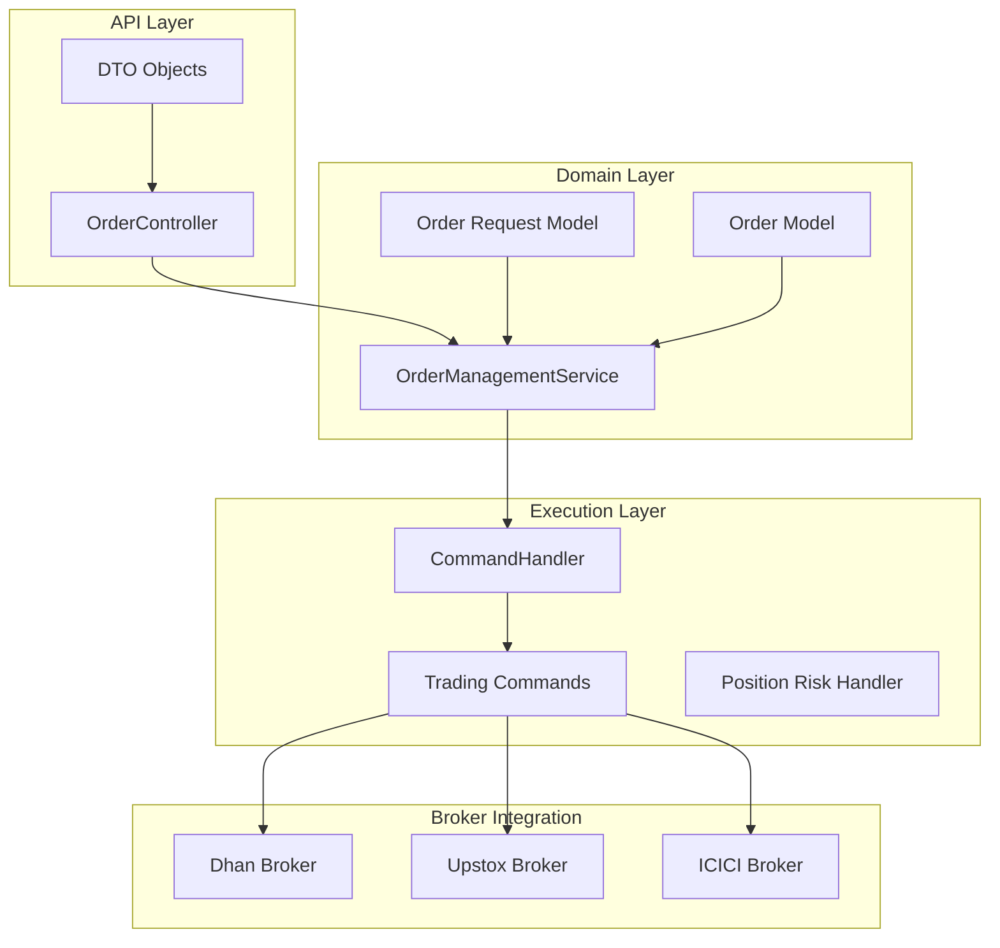
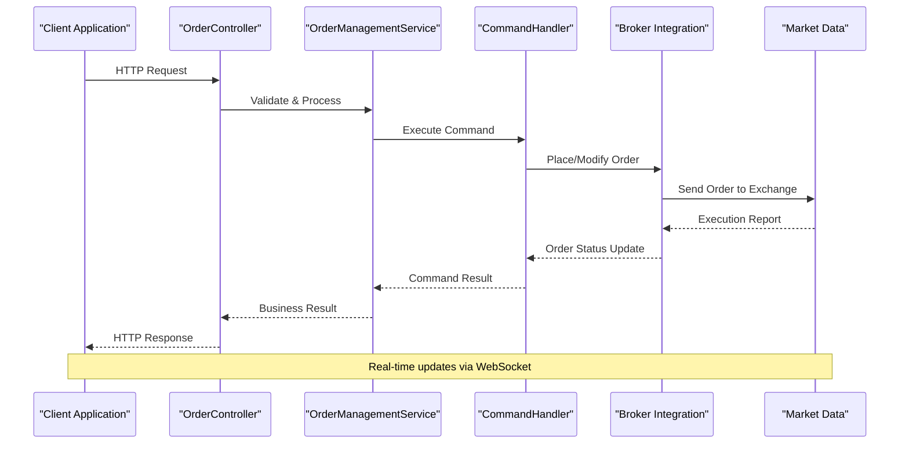
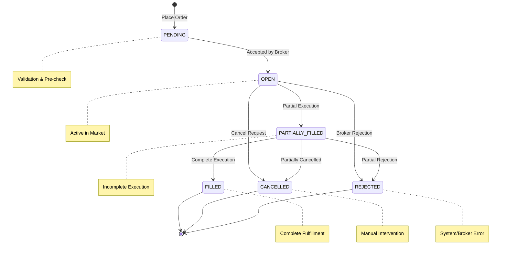

# Order Management API

<cite>
**Referenced Files in This Document**
- [OrderController.java](file://app/src/main/java/com/tradej/app/api/OrderController.java)
- [PlaceOrderRequest.java](file://app/src/main/java/com/tradej/app/api/dto/PlaceOrderRequest.java)
- [ModifyOrderApiRequest.java](file://app/src/main/java/com/tradej/app/api/dto/ModifyOrderApiRequest.java)
- [OrderResponse.java](file://app/src/main/java/com/tradej/app/api/dto/OrderResponse.java)
- [OrderProjectionResponse.java](file://app/src/main/java/com/tradej/app/api/dto/OrderProjectionResponse.java)
- [OrderControllerComponentTest.java](file://app/src/test/java/com/tradej/app/api/OrderControllerComponentTest.java)
- [DhanOrderLifecycleIntegrationTest.java](file://app/src/test/java/com/tradej/app/integration/DhanOrderLifecycleIntegrationTest.java)
- [DhanOrderModifyIntegrationTest.java](file://app/src/test/java/com/tradej/app/integration/DhanOrderModifyIntegrationTest.java)
- [DhanOrderQueryIntegrationTest.java](file://app/src/test/java/com/tradej/app/integration/DhanOrderQueryIntegrationTest.java)
- [DhanOrderQueryLiveIntegrationTest.java](file://app/src/test/java/com/tradej/app/integration/DhanOrderQueryLiveIntegrationTest.java)
- [DhanSliceOrderIntegrationTest.java](file://app/src/test/java/com/tradej/app/integration/DhanSliceOrderIntegrationTest.java)
- [DhanSuperOrderIntegrationTest.java](file://app/src/test/java/com/tradej/app/integration/DhanSuperOrderIntegrationTest.java)
- [order-book.json](file://certification-artifacts/dhan/market-data/order-book.json)
- [bracket-orders.json](file://certification-artifacts/dhan/advanced-orders/bracket-orders.json)
- [gtt-orders.json](file://certification-artifacts/dhan/advanced-orders/gtt-orders.json)
- [slice-orders.json](file://certification-artifacts/dhan/advanced-orders/slice-orders.json)
</cite>

## Table of Contents
1. [Introduction](#introduction)
2. [Project Structure](#project-structure)
3. [Core Components](#core-components)
4. [Architecture Overview](#architecture-overview)
5. [Detailed Component Analysis](#detailed-component-analysis)
6. [Order Types and Advanced Features](#order-types-and-advanced-features)
7. [Order State Management](#order-state-management)
8. [Error Handling and Validation](#error-handling-and-validation)
9. [Real-time Updates and WebSockets](#real-time-updates-and-websockets)
10. [Performance Considerations](#performance-considerations)
11. [Troubleshooting Guide](#troubleshooting-guide)
12. [Conclusion](#conclusion)

## Introduction
The Trade-J Order Management API provides comprehensive order lifecycle management capabilities for trading applications. This REST API enables clients to place, modify, cancel, and query orders while supporting advanced order types and real-time market data integration. The system operates across multiple broker integrations including Dhan, Upstox, and ICICI, providing unified order management capabilities.

The API follows RESTful principles with clear resource-based URLs and standardized response formats. It supports both synchronous order placement and asynchronous order lifecycle management through WebSocket connections for real-time updates.

## Project Structure
The order management functionality is primarily implemented in the application module with supporting components across the codebase:

**Diagram sources**
- [OrderController.java:32-116](file://app/src/main/java/com/tradej/app/api/OrderController.java#L32-L116)
- [OrderController.java:36-51](file://app/src/main/java/com/tradej/app/api/OrderController.java#L36-L51)

**Section sources**
- [OrderController.java:1-116](file://app/src/main/java/com/tradej/app/api/OrderController.java#L1-L116)

## Core Components
The order management system consists of several key components working together to provide comprehensive order lifecycle management:

### OrderController
The primary REST controller handling all order-related HTTP requests. It exposes endpoints for order placement, modification, cancellation, and querying with proper HTTP status code handling.

### DTO Objects
Structured data transfer objects defining request and response schemas for order operations:
- PlaceOrderRequest: Defines the structure for new order creation
- ModifyOrderApiRequest: Specifies order modification parameters
- OrderResponse: Standardized response format for order operations
- OrderProjectionResponse: Lightweight order projection for listings

### OrderManagementService
Core service managing order lifecycle operations, validation, and business logic enforcement.

### CommandHandler
Executes trading commands through the appropriate broker integration with proper error handling and state management.

**Section sources**
- [OrderController.java:32-116](file://app/src/main/java/com/tradej/app/api/OrderController.java#L32-L116)
- [OrderController.java:36-51](file://app/src/main/java/com/tradej/app/api/OrderController.java#L36-L51)

## Architecture Overview
The order management architecture follows a layered approach with clear separation of concerns:

**Diagram sources**
- [OrderController.java:77-116](file://app/src/main/java/com/tradej/app/api/OrderController.java#L77-L116)
- [OrderController.java:53-75](file://app/src/main/java/com/tradej/app/api/OrderController.java#L53-L75)

The architecture supports multiple broker integrations while maintaining a unified API interface. The system handles order validation, risk management, and real-time status updates through WebSocket connections.

## Detailed Component Analysis

### Order Placement Endpoint
The order placement endpoint provides the primary interface for creating new orders in the system.

**Endpoint**: `POST /api/v1/orders/place`
**Method**: POST
**Content-Type**: application/json

#### Request Schema
The PlaceOrderRequest DTO defines the structure for order placement:

| Field | Type | Required | Description |
|-------|------|----------|-------------|
| symbol | string | Yes | Trading symbol identifier |
| transactionType | enum | Yes | BUY or SELL |
| orderType | enum | Yes | Market, Limit, StopLoss, etc. |
| productType | enum | Yes | Intraday, Delivery, Margin, etc. |
| quantity | integer | Yes | Order quantity in shares/contracts |
| price | number | Conditional | Required for Limit orders |
| triggerPrice | number | Conditional | Required for Stop/StopLoss orders |
| validity | enum | No | DAY, IOC, GTD, etc. |
| disclosedQuantity | integer | No | Quantity to disclose publicly |
| userParams | object | No | Custom user-defined parameters |

#### Response Schema
Successful order placement returns an OrderResponse object:

| Field | Type | Description |
|-------|------|-------------|
| orderId | string | Unique order identifier generated by the system |
| correlationId | string | Client-supplied correlation identifier |
| status | enum | Initial order status (OPEN, PENDING, etc.) |
| symbol | string | Trading symbol |
| transactionType | enum | BUY or SELL |
| orderType | enum | Order type placed |
| quantity | integer | Filled quantity |
| price | number | Executed price |
| averagePrice | number | Average execution price |
| timestamp | datetime | Order placement timestamp |

#### Implementation Details
The order placement process involves multiple validation steps and broker-specific processing. The system generates unique order IDs and maintains correlation IDs for audit trails.

**Section sources**
- [OrderController.java:77-116](file://app/src/main/java/com/tradej/app/api/OrderController.java#L77-L116)
- [PlaceOrderRequest.java](file://app/src/main/java/com/tradej/app/api/dto/PlaceOrderRequest.java)

### Order Modification Endpoint
The order modification endpoint allows clients to adjust existing orders before execution.

**Endpoint**: `PUT /api/v1/orders/modify/{orderId}`
**Method**: PUT
**Content-Type**: application/json

#### Request Schema
The ModifyOrderApiRequest DTO supports selective order modifications:

| Field | Type | Required | Description |
|-------|------|----------|-------------|
| orderId | string | Yes | Target order identifier |
| quantity | integer | No | New quantity (must be <= original) |
| price | number | No | New price (market orders ignored) |
| triggerPrice | number | No | New trigger price |
| disclosedQuantity | integer | No | New disclosed quantity |

#### Response Schema
Returns the modified OrderResponse with updated status and execution details.

#### Implementation Notes
Order modifications must maintain order validity constraints and cannot exceed original order quantities. The system validates modification requests against current order state.

**Section sources**
- [ModifyOrderApiRequest.java](file://app/src/main/java/com/tradej/app/api/dto/ModifyOrderApiRequest.java)

### Order Cancellation Endpoint
The order cancellation endpoint provides mechanisms to cancel open orders.

**Endpoint**: `DELETE /api/v1/orders/cancel/{orderId}`
**Method**: DELETE

#### Request Schema
Simple cancellation requires only the orderId parameter.

#### Response Schema
Returns cancellation confirmation with updated order status.

#### Implementation Details
Cancellation requests are processed asynchronously. The system maintains order state consistency and prevents double-cancellation scenarios.

**Section sources**
- [OrderController.java:77-116](file://app/src/main/java/com/tradej/app/api/OrderController.java#L77-L116)

### Order Query Endpoint
The order query endpoint provides comprehensive order information retrieval.

**Endpoint**: `GET /api/v1/orders/query/{orderId}`
**Method**: GET

#### Response Schema
Returns complete order details including:
- Order metadata (IDs, timestamps)
- Execution statistics (filled quantities, prices)
- Status history and current state
- Commission and fee breakdown
- Linked order relationships (for advanced orders)

#### Implementation Details
The query endpoint provides detailed order information for audit trails and reporting purposes.

**Section sources**
- [OrderController.java:53-75](file://app/src/main/java/com/tradej/app/api/OrderController.java#L53-L75)

### Order Book Snapshot Endpoint
The order book snapshot endpoint provides market depth information for liquidity analysis.

**Endpoint**: `GET /api/v1/orders/book/{symbol}`
**Method**: GET

#### Response Schema
Returns market depth data organized by price levels:

| Field | Type | Description |
|-------|------|-------------|
| symbol | string | Trading symbol |
| bids | array | Buy orders sorted by price (highest first) |
| asks | array | Sell orders sorted by price (lowest first) |
| timestamp | datetime | Market data timestamp |
| totalBidQuantity | integer | Total quantity available to buy |
| totalAskQuantity | integer | Total quantity available to sell |

Each bid/ask entry contains:
- price: Order price level
- quantity: Total quantity at that price
- orders: Individual order count at this level

#### Implementation Details
Order book data is maintained in real-time and refreshed through WebSocket connections. The endpoint provides aggregated market depth for liquidity analysis.

**Section sources**
- [order-book.json](file://certification-artifacts/dhan/market-data/order-book.json)

## Order Types and Advanced Features

### Basic Order Types
The system supports standard order types commonly used in Indian equity markets:

#### Market Orders
- Execute immediately at market price
- Highest priority in execution
- No price guarantee

#### Limit Orders
- Specify maximum buy or minimum sell price
- Execute only at specified price or better
- Price guarantee with no immediate execution

#### Stop Orders
- Trigger when market reaches specified stop price
- Convert to market order upon triggering
- Used for stop-loss and take-profit execution

#### Stop-Limit Orders
- Combination of stop and limit functionality
- Trigger at stop price, then execute as limit order
- Provides both trigger and price protection

### Advanced Order Types

#### Bracket Orders
Bracket orders consist of three linked orders: one main order and two opposite-side orders (stop-loss and target).

**Structure**:
- Main Order: Initial order (BUY/SELL)
- Stop Loss: Opposite-side order triggered by main order
- Target: Opposite-side order at profit target level

**Implementation Features**:
- Automatic order linking and dependency management
- Risk management automation
- Profit-taking and stop-loss coordination

#### Good-Till-Time (GTT) Orders
GTT orders remain active until expiry or execution, providing extended validity periods.

**Features**:
- Custom expiry date/time specification
- Flexible validity period selection
- Automatic cancellation after expiry

#### Slice Orders
Slice orders break large orders into smaller, manageable portions for execution.

**Benefits**:
- Reduced market impact
- Improved average execution prices
- Better liquidity utilization

**Section sources**
- [bracket-orders.json](file://certification-artifacts/dhan/advanced-orders/bracket-orders.json)
- [gtt-orders.json](file://certification-artifacts/dhan/advanced-orders/gtt-orders.json)
- [slice-orders.json](file://certification-artifacts/dhan/advanced-orders/slice-orders.json)

## Order State Management
The order lifecycle follows a well-defined state transition model:

**Diagram sources**
- [OrderController.java:53-75](file://app/src/main/java/com/tradej/app/api/OrderController.java#L53-L75)

### State Transitions
The system enforces strict state transition rules:
- Orders can only move forward in the lifecycle
- Certain states prevent specific operations
- State changes trigger appropriate notifications

### Status Codes and Error Handling
The API returns appropriate HTTP status codes for different scenarios:
- 200 OK: Successful operations
- 400 Bad Request: Invalid request format
- 404 Not Found: Non-existent order
- 422 Unprocessable Entity: Business validation failures
- 500 Internal Server Error: System errors

**Section sources**
- [OrderController.java:107-116](file://app/src/main/java/com/tradej/app/api/OrderController.java#L107-L116)

## Error Handling and Validation
The order management system implements comprehensive error handling and validation:

### Request Validation
- Mandatory field validation
- Data type verification
- Business rule compliance checks
- Broker-specific constraint validation

### Error Response Format
Standardized error responses include:
- HTTP status code indicating error type
- Error message describing the issue
- Optional reason code for programmatic handling
- Correlation ID for audit purposes

### Common Error Scenarios
- Insufficient funds or margins
- Invalid trading symbols or instruments
- Quantity/price format violations
- Order type restrictions
- Position limit breaches
- Market closure or circuit breaker events

**Section sources**
- [OrderController.java:107-116](file://app/src/main/java/com/tradej/app/api/OrderController.java#L107-L116)

## Real-time Updates and WebSockets
The system provides real-time order status updates through WebSocket connections:

### WebSocket Endpoints
- `/ws/orders`: Real-time order status updates
- `/ws/marketdata/{symbol}`: Market data streams
- `/ws/portfolio`: Portfolio value changes

### Update Frequency and Content
- Real-time status change notifications
- Execution reports and fill confirmations
- Market depth updates for liquidity monitoring
- Portfolio value and margin changes

### Connection Management
- Persistent connection handling
- Automatic reconnection on failures
- Heartbeat mechanism for connection health
- Message queuing during connection drops

**Section sources**
- [DhanOrderLifecycleIntegrationTest.java](file://app/src/test/java/com/tradej/app/integration/DhanOrderLifecycleIntegrationTest.java)
- [DhanOrderQueryLiveIntegrationTest.java](file://app/src/test/java/com/tradej/app/integration/DhanOrderQueryLiveIntegrationTest.java)

## Performance Considerations
The order management system is designed for high-performance trading environments:

### Scalability Features
- Asynchronous order processing
- Non-blocking I/O operations
- Connection pooling for broker communications
- Efficient caching of frequently accessed data

### Latency Optimization
- Minimal serialization overhead
- Optimized database queries
- Efficient message routing
- Batch processing for bulk operations

### Resource Management
- Connection limits and throttling
- Memory-efficient data structures
- Garbage collection optimization
- Monitoring and alerting for performance issues

## Troubleshooting Guide

### Common Issues and Solutions
**Order Placement Failures**:
- Verify broker connectivity and authentication
- Check margin availability and position limits
- Validate order parameters against exchange rules
- Review market hours and trading permissions

**Missing Order Updates**:
- Confirm WebSocket connection status
- Check for connection timeouts or network issues
- Verify subscription to correct symbols
- Review rate limiting and quota exhaustion

**Duplicate Order IDs**:
- Implement proper correlation ID usage
- Check for request retries without idempotency
- Verify client-side deduplication logic
- Review system clock synchronization

### Debugging Tools and Logs
The system provides comprehensive logging for troubleshooting:
- Request/response logging with correlation IDs
- Broker communication traces
- Performance metrics and latency measurements
- Error stack traces and exception details

**Section sources**
- [OrderControllerComponentTest.java](file://app/src/test/java/com/tradej/app/api/OrderControllerComponentTest.java)
- [DhanOrderModifyIntegrationTest.java](file://app/src/test/java/com/tradej/app/integration/DhanOrderModifyIntegrationTest.java)
- [DhanOrderQueryIntegrationTest.java](file://app/src/test/java/com/tradej/app/integration/DhanOrderQueryIntegrationTest.java)

## Conclusion
The Trade-J Order Management API provides a comprehensive, production-ready solution for order lifecycle management in trading applications. The system's modular architecture, robust error handling, and real-time capabilities make it suitable for high-frequency trading environments.

Key strengths include:
- Unified API across multiple broker integrations
- Comprehensive order type support including advanced orders
- Real-time market data and order status updates
- Strong validation and error handling mechanisms
- Scalable architecture designed for high-performance trading

The API's design balances flexibility with reliability, providing traders with the tools needed for sophisticated order management while maintaining system stability and performance.