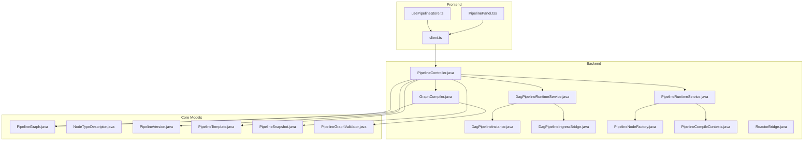
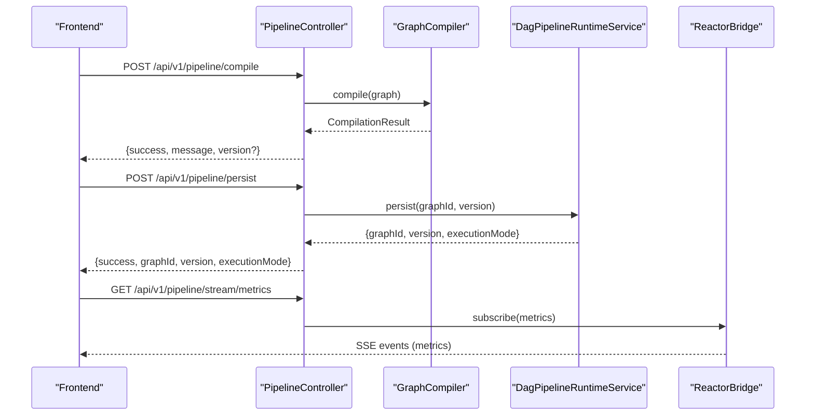
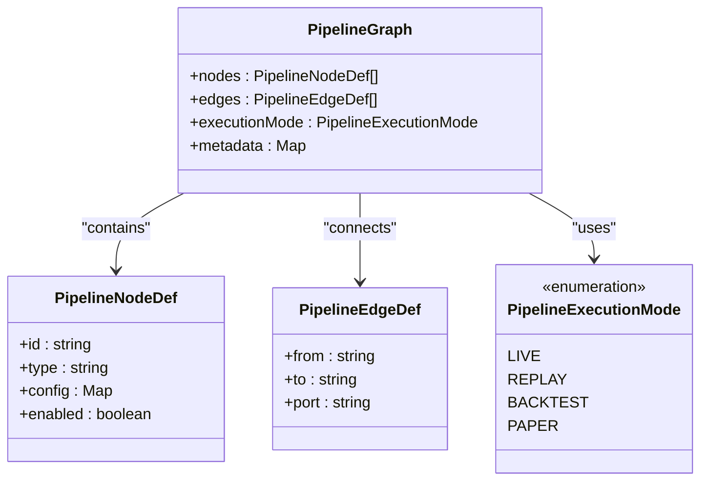
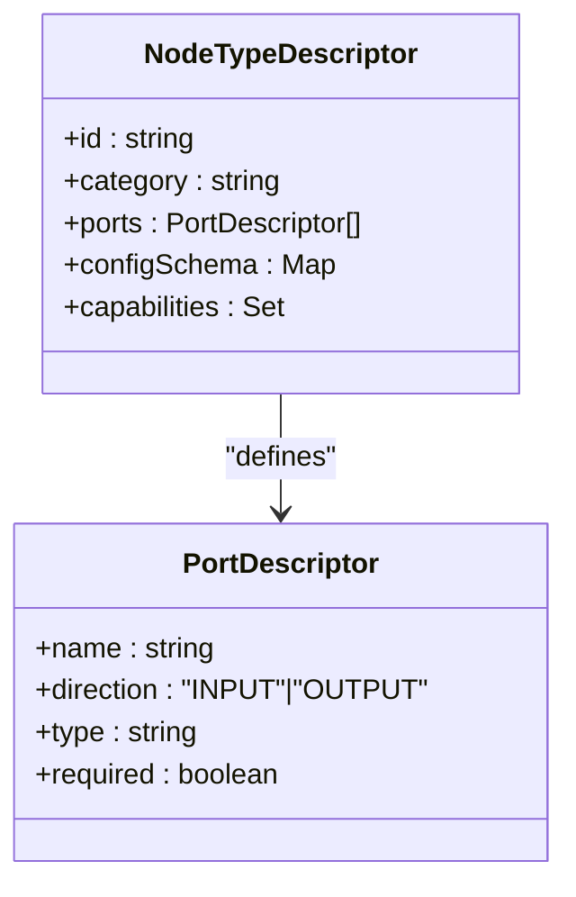
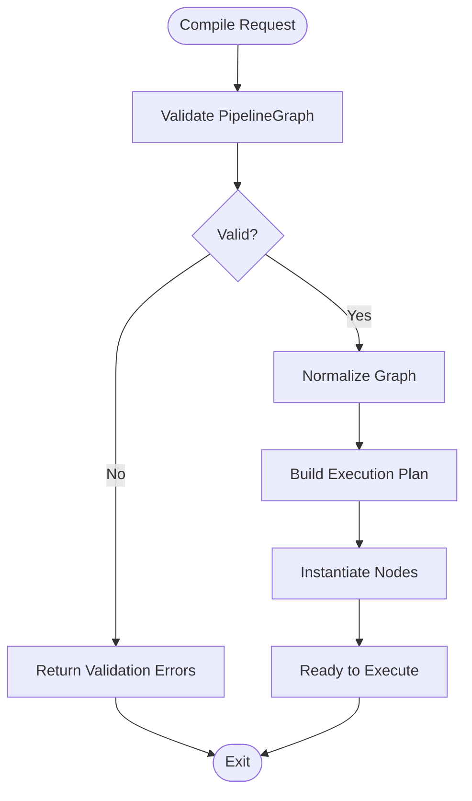
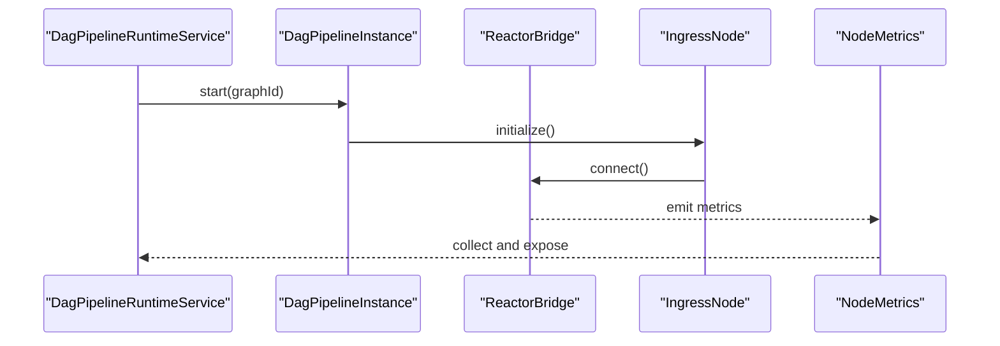
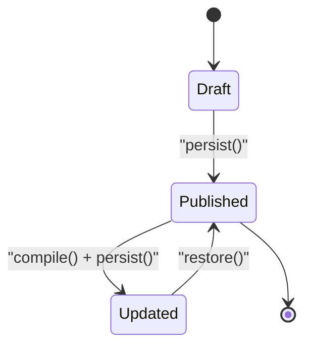
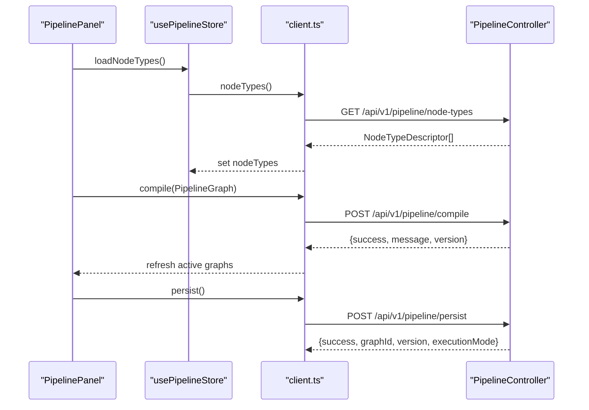
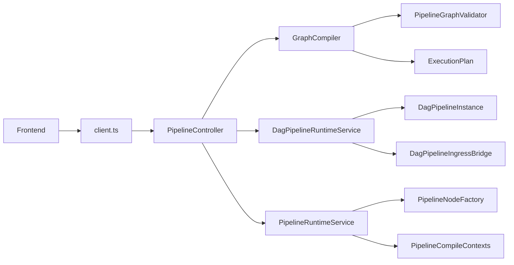

# Pipeline API

<cite>
**Referenced Files in This Document**
- [openapi.yaml](file://docs/openapi.yaml)
- [client.ts](file://archive/frontend/src/api/client.ts)
- [PipelinePanel.tsx](file://archive/frontend/src/components/PipelinePanel.tsx)
- [usePipelineStore.ts](file://archive/frontend/src/store/usePipelineStore.ts)
- [PipelineController.java](file://app/src/main/java/com/tradej/app/api/PipelineController.java)
- [PipelineGraph.java](file://pipeline/core/src/main/java/com/tradej/pipeline/graph/PipelineGraph.java)
- [NodeTypeDescriptor.java](file://pipeline/core/src/main/java/com/tradej/pipeline/registry/NodeTypeDescriptor.java)
- [PipelineTemplate.java](file://pipeline/platform/trade-pipeline-platform/src/main/java/com/tradej/pipeline/platform/PipelineTemplate.java)
- [PipelineVersion.java](file://pipeline/platform/trade-pipeline-platform/src/main/java/com/tradej/pipeline/platform/PipelineVersion.java)
- [PipelineSnapshot.java](file://pipeline/platform/trade-pipeline-platform/src/main/java/com/tradej/pipeline/platform/PipelineSnapshot.java)
- [PipelineGraphValidator.java](file://pipeline/core/src/main/java/com/tradej/pipeline/graph/PipelineGraphValidator.java)
- [GraphCompiler.java](file://pipeline/core/src/main/java/com/tradej/pipeline/runtime/GraphCompiler.java)
- [DagPipelineRuntimeService.java](file://pipeline/runtime/src/main/java/com/tradej/pipeline/service/DagPipelineRuntimeService.java)
- [DagPipelineInstance.java](file://pipeline/runtime/src/main/java/com/tradej/pipeline/service/DagPipelineInstance.java)
- [DagPipelineIngressBridge.java](file://pipeline/runtime/src/main/java/com/tradej/pipeline/service/DagPipelineIngressBridge.java)
- [PipelineRuntimeService.java](file://pipeline/runtime/src/main/java/com/tradej/pipeline/service/PipelineRuntimeService.java)
- [PipelineNodeFactory.java](file://pipeline/runtime/src/main/java/com/tradej/pipeline/service/PipelineNodeFactory.java)
- [PipelineCompileContexts.java](file://pipeline/runtime/src/main/java/com/tradej/pipeline/service/PipelineCompileContexts.java)
- [ReactorBridge.java](file://pipeline/core/src/main/java/com/tradej/pipeline/reactor/ReactorBridge.java)
- [ReactorBridgeMetrics.java](file://pipeline/runtime/src/main/java/com/tradej/pipeline/service/reactor/ReactorBridgeMetrics.java)
- [IngressNode.java](file://pipeline/core/src/main/java/com/tradej/pipeline/runtime/IngressNode.java)
- [BasePipelineNode.java](file://pipeline/core/src/main/java/com/tradej/pipeline/runtime/BasePipelineNode.java)
- [ReactivePipelineNode.java](file://pipeline/core/src/main/java/com/tradej/pipeline/runtime/ReactivePipelineNode.java)
- [ExecutionPlan.java](file://pipeline/core/src/main/java/com/tradej/pipeline/runtime/ExecutionPlan.java)
- [PipelineContext.java](file://pipeline/core/src/main/java/com/tradej/pipeline/runtime/PipelineContext.java)
- [VirtualClock.java](file://pipeline/core/src/main/java/com/tradej/pipeline/clock/VirtualClock.java)
- [EventTimestamps.java](file://pipeline/core/src/main/java/com/tradej/pipeline/clock/EventTimestamps.java)
- [GraphRuntime.java](file://pipeline/core/src/main/java/com/tradej/pipeline/runtime/GraphRuntime.java)
- [NodeMetrics.java](file://pipeline/core/src/main/java/com/tradej/pipeline/runtime/NodeMetrics.java)
- [NodeState.java](file://pipeline/core/src/main/java/com/tradej/pipeline/runtime/NodeState.java)
- [PartitionedNode.java](file://pipeline/core/src/main/java/com/tradej/pipeline/runtime/PartitionedNode.java)
- [PipelineRuntimeBridge.java](file://pipeline/core/src/main/java/com/tradej/pipeline/runtime/PipelineRuntimeBridge.java)
- [PipelineRuntime.java](file://pipeline/core/src/main/java/com/tradej/pipeline/runtime/PipelineRuntime.java)
- [PipelineNodeTypes.java](file://pipeline/core/src/main/java/com/tradej/pipeline/runtime/PipelineNodeTypes.java)
- [InMemoryStateStore.java](file://pipeline/core/src/main/java/com/tradej/pipeline/state/InMemoryStateStore.java)
- [BacktestFillModel.java](file://pipeline/core/src/main/java/com/tradej/pipeline/runtime/BacktestFillModel.java)
- [DefaultBacktestFillModel.java](file://pipeline/core/src/main/java/com/tradej/pipeline/runtime/DefaultBacktestFillModel.java)
- [MultiTimeframeContext.java](file://replay/engine/src/main/java/com/tradej/replay/engine/MultiTimeframeContext.java)
- [ReplayController.java](file://replay/engine/src/main/java/com/tradej/replay/engine/ReplayController.java)
- [CandleReplaySession.java](file://replay/engine/src/main/java/com/tradej/replay/engine/CandleReplaySession.java)
</cite>

## Table of Contents
1. [Introduction](#introduction)
2. [Project Structure](#project-structure)
3. [Core Components](#core-components)
4. [Architecture Overview](#architecture-overview)
5. [Detailed Component Analysis](#detailed-component-analysis)
6. [Dependency Analysis](#dependency-analysis)
7. [Performance Considerations](#performance-considerations)
8. [Troubleshooting Guide](#troubleshooting-guide)
9. [Conclusion](#conclusion)
10. [Appendices](#appendices)

## Introduction
This document provides comprehensive REST API documentation for Trade-J pipeline management endpoints. It covers template retrieval, node type discovery, graph management, compilation, and version control. It also documents pipeline graph validation, node type specifications, runtime compilation processes, persistence, versioning, rollback capabilities, and execution monitoring via Server-Sent Events (SSE).

## Project Structure
The pipeline API spans backend controllers, core graph models, runtime services, and frontend integration. The OpenAPI specification defines endpoint contracts, while frontend components demonstrate usage patterns for SSE streaming and action orchestration.

**Diagram sources**
- [PipelineController.java](file://app/src/main/java/com/tradej/app/api/PipelineController.java)
- [GraphCompiler.java](file://pipeline/core/src/main/java/com/tradej/pipeline/runtime/GraphCompiler.java)
- [DagPipelineRuntimeService.java](file://pipeline/runtime/src/main/java/com/tradej/pipeline/service/DagPipelineRuntimeService.java)
- [DagPipelineInstance.java](file://pipeline/runtime/src/main/java/com/tradej/pipeline/service/DagPipelineInstance.java)
- [DagPipelineIngressBridge.java](file://pipeline/runtime/src/main/java/com/tradej/pipeline/service/DagPipelineIngressBridge.java)
- [PipelineRuntimeService.java](file://pipeline/runtime/src/main/java/com/tradej/pipeline/service/PipelineRuntimeService.java)
- [PipelineNodeFactory.java](file://pipeline/runtime/src/main/java/com/tradej/pipeline/service/PipelineNodeFactory.java)
- [PipelineCompileContexts.java](file://pipeline/runtime/src/main/java/com/tradej/pipeline/service/PipelineCompileContexts.java)
- [ReactorBridge.java](file://pipeline/core/src/main/java/com/tradej/pipeline/reactor/ReactorBridge.java)
- [PipelineGraph.java](file://pipeline/core/src/main/java/com/tradej/pipeline/graph/PipelineGraph.java)
- [NodeTypeDescriptor.java](file://pipeline/core/src/main/java/com/tradej/pipeline/registry/NodeTypeDescriptor.java)
- [PipelineVersion.java](file://pipeline/platform/trade-pipeline-platform/src/main/java/com/tradej/pipeline/platform/PipelineVersion.java)
- [PipelineTemplate.java](file://pipeline/platform/trade-pipeline-platform/src/main/java/com/tradej/pipeline/platform/PipelineTemplate.java)
- [PipelineSnapshot.java](file://pipeline/platform/trade-pipeline-platform/src/main/java/com/tradej/pipeline/platform/PipelineSnapshot.java)
- [PipelineGraphValidator.java](file://pipeline/core/src/main/java/com/tradej/pipeline/graph/PipelineGraphValidator.java)
- [client.ts](file://archive/frontend/src/api/client.ts)
- [PipelinePanel.tsx](file://archive/frontend/src/components/PipelinePanel.tsx)
- [usePipelineStore.ts](file://archive/frontend/src/store/usePipelineStore.ts)

**Section sources**
- [openapi.yaml](file://docs/openapi.yaml)
- [client.ts](file://archive/frontend/src/api/client.ts)
- [PipelinePanel.tsx](file://archive/frontend/src/components/PipelinePanel.tsx)
- [usePipelineStore.ts](file://archive/frontend/src/store/usePipelineStore.ts)

## Core Components
- PipelineController: Exposes REST endpoints for templates, node types, graph management, compilation, persistence, history, and SSE metrics streaming.
- PipelineGraph: Core data model representing nodes, edges, and execution metadata.
- NodeTypeDescriptor: Describes node capabilities, ports, and configuration schemas.
- GraphCompiler/Runtime Services: Compile and execute pipeline graphs with reactive bridges and runtime contexts.
- Versioning and Persistence: PipelineTemplate, PipelineVersion, PipelineSnapshot manage lifecycle and rollback.

**Section sources**
- [PipelineController.java](file://app/src/main/java/com/tradej/app/api/PipelineController.java)
- [PipelineGraph.java](file://pipeline/core/src/main/java/com/tradej/pipeline/graph/PipelineGraph.java)
- [NodeTypeDescriptor.java](file://pipeline/core/src/main/java/com/tradej/pipeline/registry/NodeTypeDescriptor.java)
- [GraphCompiler.java](file://pipeline/core/src/main/java/com/tradej/pipeline/runtime/GraphCompiler.java)
- [PipelineRuntimeService.java](file://pipeline/runtime/src/main/java/com/tradej/pipeline/service/PipelineRuntimeService.java)
- [PipelineTemplate.java](file://pipeline/platform/trade-pipeline-platform/src/main/java/com/tradej/pipeline/platform/PipelineTemplate.java)
- [PipelineVersion.java](file://pipeline/platform/trade-pipeline-platform/src/main/java/com/tradej/pipeline/platform/PipelineVersion.java)
- [PipelineSnapshot.java](file://pipeline/platform/trade-pipeline-platform/src/main/java/com/tradej/pipeline/platform/PipelineSnapshot.java)

## Architecture Overview
The pipeline API follows a layered architecture:
- Presentation: REST endpoints and SSE streams
- Application: Controllers orchestrate graph operations
- Domain/Core: Graph models, validators, and runtime compilers
- Infrastructure: Runtime services, bridges, and state stores

**Diagram sources**
- [openapi.yaml](file://docs/openapi.yaml)
- [client.ts](file://archive/frontend/src/api/client.ts)
- [PipelineController.java](file://app/src/main/java/com/tradej/app/api/PipelineController.java)
- [GraphCompiler.java](file://pipeline/core/src/main/java/com/tradej/pipeline/runtime/GraphCompiler.java)
- [DagPipelineRuntimeService.java](file://pipeline/runtime/src/main/java/com/tradej/pipeline/service/DagPipelineRuntimeService.java)
- [ReactorBridge.java](file://pipeline/core/src/main/java/com/tradej/pipeline/reactor/ReactorBridge.java)

## Detailed Component Analysis

### Endpoint Catalog and Schemas

#### Template Retrieval
- Endpoint: GET /api/v1/pipeline/templates
- Purpose: Retrieve pipeline templates for reuse and scaffolding.
- Notes: Template objects include metadata and initial graph structure.

**Section sources**
- [openapi.yaml](file://docs/openapi.yaml)

#### Node Type Discovery
- Endpoint: GET /api/v1/pipeline/node-types
- Purpose: Enumerate available node types with descriptors.
- Response: Array of NodeTypeDescriptor entries.

- Endpoint: GET /api/v1/pipeline/node-types/categories
- Purpose: List node type categories.

- Endpoint: GET /api/v1/pipeline/node-types/category/{category}
- Purpose: Filter node types by category.

**Section sources**
- [openapi.yaml](file://docs/openapi.yaml)
- [NodeTypeDescriptor.java](file://pipeline/core/src/main/java/com/tradej/pipeline/registry/NodeTypeDescriptor.java)

#### Graph Management
- Endpoint: GET /api/v1/pipeline/graph
- Purpose: Fetch the active pipeline graph.
- Response: PipelineGraph.

- Endpoint: GET /api/v1/pipeline/dag/graphs
- Purpose: Retrieve active DAG graphs as a map.

- Endpoint: GET /api/v1/pipeline/dag/graph/{graphId}
- Purpose: Retrieve a specific DAG graph by ID.

**Section sources**
- [openapi.yaml](file://docs/openapi.yaml)
- [PipelineGraph.java](file://pipeline/core/src/main/java/com/tradej/pipeline/graph/PipelineGraph.java)

#### Compilation
- Endpoint: POST /api/v1/pipeline/compile
- Purpose: Compile and reload the pipeline graph.
- Request: PipelineGraph
- Response: {success, message, version?}

**Section sources**
- [openapi.yaml](file://docs/openapi.yaml)
- [GraphCompiler.java](file://pipeline/core/src/main/java/com/tradej/pipeline/runtime/GraphCompiler.java)

#### Persistence and Version Control
- Endpoint: POST /api/v1/pipeline/persist
- Purpose: Persist the active graph.
- Response: {success, graphId, version, executionMode}

- Endpoint: GET /api/v1/pipeline/history/{graphId}
- Purpose: List versions for a graph.
- Response: Array of versions.

- Endpoint: GET /api/v1/pipeline/history/{graphId}/{version}
- Purpose: Retrieve a specific version of the graph.
- Response: PipelineGraph at version.

- Endpoint: POST /api/v1/pipeline/restore/{graphId}/{version}
- Purpose: Restore a specific version as the active graph.

**Section sources**
- [openapi.yaml](file://docs/openapi.yaml)
- [PipelineTemplate.java](file://pipeline/platform/trade-pipeline-platform/src/main/java/com/tradej/pipeline/platform/PipelineTemplate.java)
- [PipelineVersion.java](file://pipeline/platform/trade-pipeline-platform/src/main/java/com/tradej/pipeline/platform/PipelineVersion.java)
- [PipelineSnapshot.java](file://pipeline/platform/trade-pipeline-platform/src/main/java/com/tradej/pipeline/platform/PipelineSnapshot.java)

#### SSE Metrics Streaming
- Endpoint: GET /api/v1/pipeline/stream/metrics
- Purpose: Stream real-time metrics for active pipeline graphs.
- Frontend usage: Subscribed via useSSE hook in PipelinePanel.

**Section sources**
- [openapi.yaml](file://docs/openapi.yaml)
- [client.ts](file://archive/frontend/src/api/client.ts)
- [PipelinePanel.tsx](file://archive/frontend/src/components/PipelinePanel.tsx)
- [usePipelineStore.ts](file://archive/frontend/src/store/usePipelineStore.ts)

### Pipeline Graph Schema
- Nodes: Array of PipelineNodeDef with identifiers, type, configuration, and state.
- Edges: Array of PipelineEdgeDef connecting nodes.
- Execution Mode: PipelineExecutionMode (e.g., LIVE, REPLAY, BACKTEST, PAPER).
- Metadata: Timestamps, version, and runtime context.

**Diagram sources**
- [PipelineGraph.java](file://pipeline/core/src/main/java/com/tradej/pipeline/graph/PipelineGraph.java)
- [PipelineNodeDef.java](file://pipeline/core/src/main/java/com/tradej/pipeline/graph/PipelineNodeDef.java)
- [PipelineEdgeDef.java](file://pipeline/core/src/main/java/com/tradej/pipeline/graph/PipelineEdgeDef.java)
- [PipelineExecutionMode.java](file://pipeline/core/src/main/java/com/tradej/pipeline/graph/PipelineExecutionMode.java)

**Section sources**
- [PipelineGraph.java](file://pipeline/core/src/main/java/com/tradej/pipeline/graph/PipelineGraph.java)

### Node Type Specifications
- NodeTypeDescriptor includes:
  - Identifier and category
  - Input/Output port descriptors
  - Config schema for UI and validation
  - Capabilities and execution hints

**Diagram sources**
- [NodeTypeDescriptor.java](file://pipeline/core/src/main/java/com/tradej/pipeline/registry/NodeTypeDescriptor.java)
- [PortDescriptor.java](file://pipeline/core/src/main/java/com/tradej/pipeline/registry/PortDescriptor.java)

**Section sources**
- [NodeTypeDescriptor.java](file://pipeline/core/src/main/java/com/tradej/pipeline/registry/NodeTypeDescriptor.java)

### Graph Validation and Compilation
- Validation: PipelineGraphValidator ensures structural integrity and connectivity.
- Compilation: GraphCompiler transforms PipelineGraph into executable runtime representation.
- Runtime: DagPipelineRuntimeService manages instances, ingress bridges, and reactive execution.

**Diagram sources**
- [PipelineGraphValidator.java](file://pipeline/core/src/main/java/com/tradej/pipeline/graph/PipelineGraphValidator.java)
- [GraphCompiler.java](file://pipeline/core/src/main/java/com/tradej/pipeline/runtime/GraphCompiler.java)
- [ExecutionPlan.java](file://pipeline/core/src/main/java/com/tradej/pipeline/runtime/ExecutionPlan.java)

**Section sources**
- [PipelineGraphValidator.java](file://pipeline/core/src/main/java/com/tradej/pipeline/graph/PipelineGraphValidator.java)
- [GraphCompiler.java](file://pipeline/core/src/main/java/com/tradej/pipeline/runtime/GraphCompiler.java)
- [ExecutionPlan.java](file://pipeline/core/src/main/java/com/tradej/pipeline/runtime/ExecutionPlan.java)

### Runtime Execution and Monitoring
- Runtime Services: PipelineRuntimeService orchestrates node lifecycle and metrics.
- Bridges: ReactorBridge integrates reactive streams; ReactorBridgeMetrics tracks performance.
- Ingress/Nodes: IngressNode and BasePipelineNode define execution boundaries.
- State and Metrics: NodeState and NodeMetrics track runtime behavior.

**Diagram sources**
- [DagPipelineRuntimeService.java](file://pipeline/runtime/src/main/java/com/tradej/pipeline/service/DagPipelineRuntimeService.java)
- [DagPipelineInstance.java](file://pipeline/runtime/src/main/java/com/tradej/pipeline/service/DagPipelineInstance.java)
- [ReactorBridge.java](file://pipeline/core/src/main/java/com/tradej/pipeline/reactor/ReactorBridge.java)
- [IngressNode.java](file://pipeline/core/src/main/java/com/tradej/pipeline/runtime/IngressNode.java)
- [NodeMetrics.java](file://pipeline/core/src/main/java/com/tradej/pipeline/runtime/NodeMetrics.java)

**Section sources**
- [DagPipelineRuntimeService.java](file://pipeline/runtime/src/main/java/com/tradej/pipeline/service/DagPipelineRuntimeService.java)
- [DagPipelineInstance.java](file://pipeline/runtime/src/main/java/com/tradej/pipeline/service/DagPipelineInstance.java)
- [ReactorBridge.java](file://pipeline/core/src/main/java/com/tradej/pipeline/reactor/ReactorBridge.java)
- [IngressNode.java](file://pipeline/core/src/main/java/com/tradej/pipeline/runtime/IngressNode.java)
- [NodeMetrics.java](file://pipeline/core/src/main/java/com/tradej/pipeline/runtime/NodeMetrics.java)

### Versioning and Rollback
- PipelineTemplate: Defines template metadata and lifecycle.
- PipelineVersion: Tracks version history per graph.
- PipelineSnapshot: Captures graph state at a version.
- Restore: POST /api/v1/pipeline/restore/{graphId}/{version} applies a previous snapshot.

**Diagram sources**
- [PipelineTemplate.java](file://pipeline/platform/trade-pipeline-platform/src/main/java/com/tradej/pipeline/platform/PipelineTemplate.java)
- [PipelineVersion.java](file://pipeline/platform/trade-pipeline-platform/src/main/java/com/tradej/pipeline/platform/PipelineVersion.java)
- [PipelineSnapshot.java](file://pipeline/platform/trade-pipeline-platform/src/main/java/com/tradej/pipeline/platform/PipelineSnapshot.java)

**Section sources**
- [PipelineTemplate.java](file://pipeline/platform/trade-pipeline-platform/src/main/java/com/tradej/pipeline/platform/PipelineTemplate.java)
- [PipelineVersion.java](file://pipeline/platform/trade-pipeline-platform/src/main/java/com/tradej/pipeline/platform/PipelineVersion.java)
- [PipelineSnapshot.java](file://pipeline/platform/trade-pipeline-platform/src/main/java/com/tradej/pipeline/platform/PipelineSnapshot.java)

### Frontend Integration and Examples
- Client API: Methods for node types, categories, active graphs, compile, persist, history, and restore.
- Pipeline Panel: Demonstrates SSE metrics subscription and compile/persist actions.
- Store: Manages node types, categories, active graphs, and metrics.

**Diagram sources**
- [client.ts](file://archive/frontend/src/api/client.ts)
- [PipelinePanel.tsx](file://archive/frontend/src/components/PipelinePanel.tsx)
- [usePipelineStore.ts](file://archive/frontend/src/store/usePipelineStore.ts)
- [PipelineController.java](file://app/src/main/java/com/tradej/app/api/PipelineController.java)

**Section sources**
- [client.ts](file://archive/frontend/src/api/client.ts)
- [PipelinePanel.tsx](file://archive/frontend/src/components/PipelinePanel.tsx)
- [usePipelineStore.ts](file://archive/frontend/src/store/usePipelineStore.ts)

## Dependency Analysis
- Controllers depend on runtime services and graph models.
- Runtime services depend on node factories and compile contexts.
- GraphCompiler depends on validators and execution plans.
- Frontend depends on client API and SSE hooks.

**Diagram sources**
- [PipelineController.java](file://app/src/main/java/com/tradej/app/api/PipelineController.java)
- [GraphCompiler.java](file://pipeline/core/src/main/java/com/tradej/pipeline/runtime/GraphCompiler.java)
- [DagPipelineRuntimeService.java](file://pipeline/runtime/src/main/java/com/tradej/pipeline/service/DagPipelineRuntimeService.java)
- [DagPipelineInstance.java](file://pipeline/runtime/src/main/java/com/tradej/pipeline/service/DagPipelineInstance.java)
- [DagPipelineIngressBridge.java](file://pipeline/runtime/src/main/java/com/tradej/pipeline/service/DagPipelineIngressBridge.java)
- [PipelineRuntimeService.java](file://pipeline/runtime/src/main/java/com/tradej/pipeline/service/PipelineRuntimeService.java)
- [PipelineNodeFactory.java](file://pipeline/runtime/src/main/java/com/tradej/pipeline/service/PipelineNodeFactory.java)
- [PipelineCompileContexts.java](file://pipeline/runtime/src/main/java/com/tradej/pipeline/service/PipelineCompileContexts.java)
- [PipelineGraphValidator.java](file://pipeline/core/src/main/java/com/tradej/pipeline/graph/PipelineGraphValidator.java)
- [ExecutionPlan.java](file://pipeline/core/src/main/java/com/tradej/pipeline/runtime/ExecutionPlan.java)
- [client.ts](file://archive/frontend/src/api/client.ts)

**Section sources**
- [PipelineController.java](file://app/src/main/java/com/tradej/app/api/PipelineController.java)
- [client.ts](file://archive/frontend/src/api/client.ts)

## Performance Considerations
- Use SSE for lightweight, continuous metrics updates instead of polling.
- Prefer incremental graph updates and targeted compiles to minimize overhead.
- Leverage partitioned nodes and reactive bridges for scalable throughput.
- Monitor NodeMetrics and ReactorBridgeMetrics to identify bottlenecks.

## Troubleshooting Guide
- Validation Failures: Review PipelineGraphValidator errors during compile.
- Runtime Errors: Inspect NodeState and NodeMetrics for failure traces.
- Persistence Issues: Verify PipelineVersion and PipelineSnapshot consistency.
- SSE Not Updating: Confirm subscription path and frontend useSSE hook.

**Section sources**
- [PipelineGraphValidator.java](file://pipeline/core/src/main/java/com/tradej/pipeline/graph/PipelineGraphValidator.java)
- [NodeMetrics.java](file://pipeline/core/src/main/java/com/tradej/pipeline/runtime/NodeMetrics.java)
- [PipelineVersion.java](file://pipeline/platform/trade-pipeline-platform/src/main/java/com/tradej/pipeline/platform/PipelineVersion.java)
- [PipelineSnapshot.java](file://pipeline/platform/trade-pipeline-platform/src/main/java/com/tradej/pipeline/platform/PipelineSnapshot.java)

## Conclusion
The Trade-J pipeline API provides a robust framework for designing, validating, compiling, executing, persisting, and versioning trading pipelines. Its REST endpoints and SSE streams enable real-time monitoring and iterative development, while the underlying runtime services ensure scalable execution across multiple modes.

## Appendices

### Example Workflows

#### Constructing and Executing a Pipeline
- Retrieve node types and categories.
- Build a PipelineGraph with nodes and edges.
- Compile the graph; on success, persist to establish a versioned baseline.
- Subscribe to SSE metrics for monitoring.
- Start, pause, resume, or stop the graph as needed.

**Section sources**
- [client.ts](file://archive/frontend/src/api/client.ts)
- [PipelinePanel.tsx](file://archive/frontend/src/components/PipelinePanel.tsx)
- [usePipelineStore.ts](file://archive/frontend/src/store/usePipelineStore.ts)

### Execution Modes
- LIVE: Real-time market data ingestion and order execution.
- REPLAY: Historical data playback for testing.
- BACKTEST: Strategy evaluation against historical datasets.
- PAPER: Paper trading without live risk exposure.

**Section sources**
- [PipelineExecutionMode.java](file://pipeline/core/src/main/java/com/tradej/pipeline/graph/PipelineExecutionMode.java)