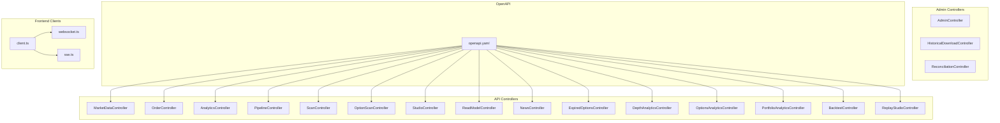
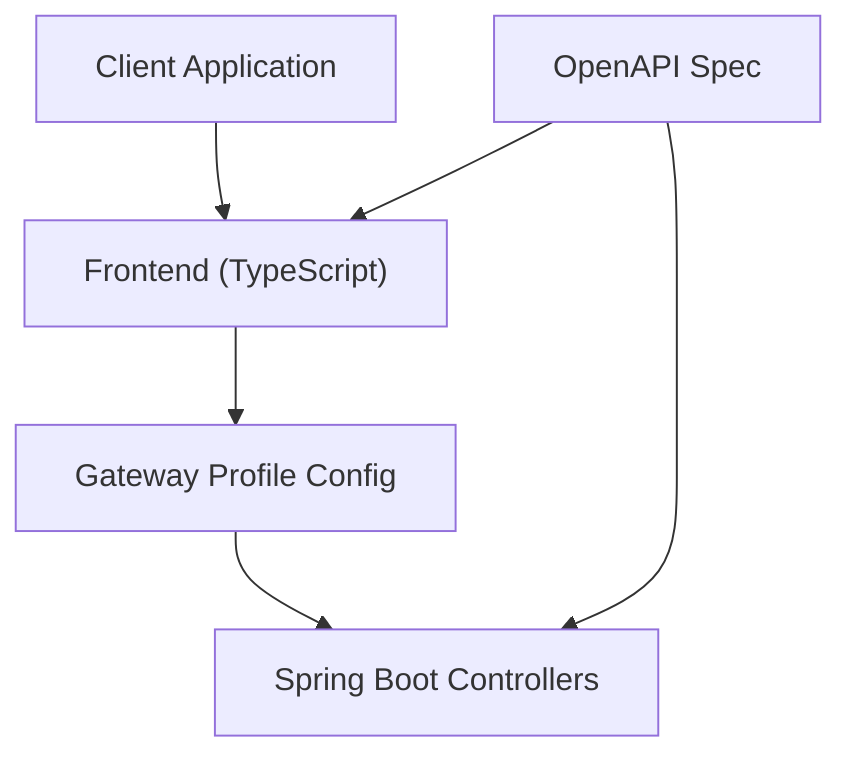
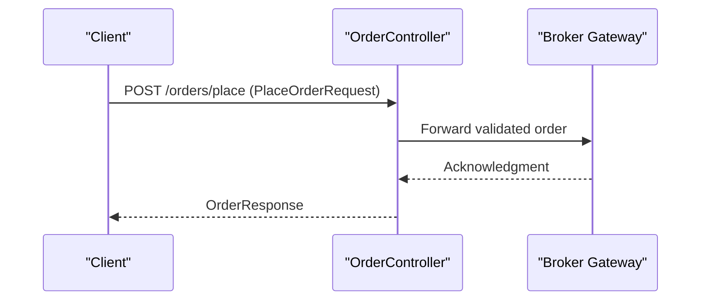
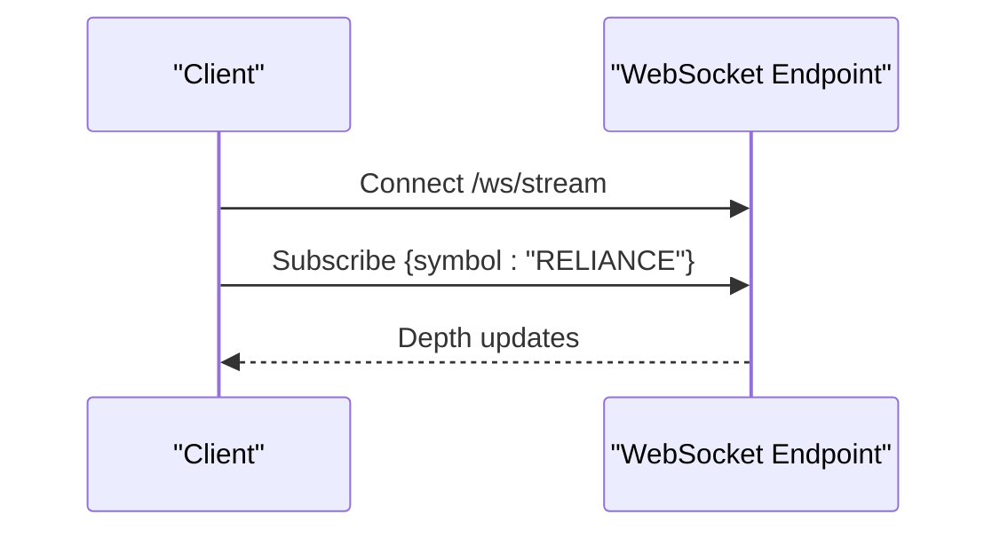

# REST API Endpoints

<cite>
**Referenced Files in This Document**
- [openapi.yaml](file://docs/openapi.yaml)
- [API_DOCUMENTATION.md](file://docs/API_DOCUMENTATION.md)
- [USAGE_GUIDE.md](file://docs/USAGE_GUIDE.md)
- [AdminController.java](file://app/src/main/java/com/tradej/app/admin/AdminController.java)
- [HistoricalDownloadController.java](file://app/src/main/java/com/tradej/app/admin/HistoricalDownloadController.java)
- [ReconciliationController.java](file://app/src/main/java/com/tradej/app/admin/ReconciliationController.java)
- [AnalyticsController.java](file://app/src/main/java/com/tradej/app/api/AnalyticsController.java)
- [BacktestController.java](file://app/src/main/java/com/tradej/app/api/BacktestController.java)
- [DepthAnalyticsController.java](file://app/src/main/java/com/tradej/app/api/DepthAnalyticsController.java)
- [ExpiredOptionsController.java](file://app/src/main/java/com/tradej/app/api/ExpiredOptionsController.java)
- [MarketDataController.java](file://app/src/main/java/com/tradej/app/api/MarketDataController.java)
- [NewsController.java](file://app/src/main/java/com/tradej/app/api/NewsController.java)
- [OptionScanController.java](file://app/src/main/java/com/tradej/app/api/OptionScanController.java)
- [OptionsAnalyticsController.java](file://app/src/main/java/com/tradej/app/api/OptionsAnalyticsController.java)
- [OrderController.java](file://app/src/main/java/com/tradej/app/api/OrderController.java)
- [PipelineController.java](file://app/src/main/java/com/tradej/app/api/PipelineController.java)
- [PortfolioAnalyticsController.java](file://app/src/main/java/com/tradej/app/api/PortfolioAnalyticsController.java)
- [ReadModelController.java](file://app/src/main/java/com/tradej/app/api/ReadModelController.java)
- [ReplayStudioController.java](file://app/src/main/java/com/tradej/app/api/ReplayStudioController.java)
- [ScanController.java](file://app/src/main/java/com/tradej/app/api/ScanController.java)
- [StudioController.java](file://app/src/main/java/com/tradej/app/api/StudioController.java)
- [SymbolController.java](file://app/src/main/java/com/tradej/app/api/SymbolController.java)
- [PlaceOrderRequest.java](file://app/src/main/java/com/tradej/app/api/dto/PlaceOrderRequest.java)
- [ModifyOrderApiRequest.java](file://app/src/main/java/com/tradej/app/api/dto/ModifyOrderApiRequest.java)
- [OrderResponse.java](file://app/src/main/java/com/tradej/app/api/dto/OrderResponse.java)
- [OrderProjectionResponse.java](file://app/src/main/java/com/tradej/app/api/dto/OrderProjectionResponse.java)
- [application.yml](file://app/src/main/resources/application.yml)
- [application-gateway.yml](file://app/src/main/resources/application-gateway.yml)
- [client.ts](file://frontend/src/api/client.ts)
- [websocket.ts](file://frontend/src/api/websocket.ts)
- [sse.ts](file://frontend/src/api/sse.ts)
</cite>

## Table of Contents
1. [Introduction](#introduction)
2. [Project Structure](#project-structure)
3. [Core Components](#core-components)
4. [Architecture Overview](#architecture-overview)
5. [Detailed Component Analysis](#detailed-component-analysis)
6. [Dependency Analysis](#dependency-analysis)
7. [Performance Considerations](#performance-considerations)
8. [Troubleshooting Guide](#troubleshooting-guide)
9. [Conclusion](#conclusion)
10. [Appendices](#appendices)

## Introduction
This document provides comprehensive REST API documentation for Trade-J endpoints. It covers HTTP methods, URL patterns, request/response schemas, authentication, and security schemes as defined in the OpenAPI specification. It also documents endpoint categories for market data, order management, analytics, pipeline operations, scans, and administrative functions, along with practical usage examples and client integration guidelines.

## Project Structure
Trade-J exposes REST endpoints via Spring Boot controllers grouped under the API and Admin packages. The OpenAPI specification centralizes endpoint definitions, while configuration files define runtime profiles and gateway routing. Frontend TypeScript clients demonstrate WebSocket and SSE integrations.

**Diagram sources**
- [openapi.yaml](file://docs/openapi.yaml)
- [MarketDataController.java](file://app/src/main/java/com/tradej/app/api/MarketDataController.java)
- [OrderController.java](file://app/src/main/java/com/tradej/app/api/OrderController.java)
- [AnalyticsController.java](file://app/src/main/java/com/tradej/app/api/AnalyticsController.java)
- [PipelineController.java](file://app/src/main/java/com/tradej/app/api/PipelineController.java)
- [ScanController.java](file://app/src/main/java/com/tradej/app/api/ScanController.java)
- [OptionScanController.java](file://app/src/main/java/com/tradej/app/api/OptionScanController.java)
- [StudioController.java](file://app/src/main/java/com/tradej/app/api/StudioController.java)
- [ReadModelController.java](file://app/src/main/java/com/tradej/app/api/ReadModelController.java)
- [NewsController.java](file://app/src/main/java/com/tradej/app/api/NewsController.java)
- [ExpiredOptionsController.java](file://app/src/main/java/com/tradej/app/api/ExpiredOptionsController.java)
- [DepthAnalyticsController.java](file://app/src/main/java/com/tradej/app/api/DepthAnalyticsController.java)
- [OptionsAnalyticsController.java](file://app/src/main/java/com/tradej/app/api/OptionsAnalyticsController.java)
- [PortfolioAnalyticsController.java](file://app/src/main/java/com/tradej/app/api/PortfolioAnalyticsController.java)
- [BacktestController.java](file://app/src/main/java/com/tradej/app/api/BacktestController.java)
- [ReplayStudioController.java](file://app/src/main/java/com/tradej/app/api/ReplayStudioController.java)
- [AdminController.java](file://app/src/main/java/com/tradej/app/admin/AdminController.java)
- [HistoricalDownloadController.java](file://app/src/main/java/com/tradej/app/admin/HistoricalDownloadController.java)
- [ReconciliationController.java](file://app/src/main/java/com/tradej/app/admin/ReconciliationController.java)
- [client.ts](file://frontend/src/api/client.ts)
- [websocket.ts](file://frontend/src/api/websocket.ts)
- [sse.ts](file://frontend/src/api/sse.ts)

**Section sources**
- [openapi.yaml](file://docs/openapi.yaml)
- [application.yml](file://app/src/main/resources/application.yml)
- [application-gateway.yml](file://app/src/main/resources/application-gateway.yml)

## Core Components
- OpenAPI Specification: Defines all endpoints, parameters, schemas, and security schemes.
- API Controllers: Implement endpoint handlers for market data, orders, analytics, scans, studio, pipeline, and read models.
- Admin Controllers: Provide administrative operations including historical downloads and reconciliation.
- Frontend Clients: Demonstrate HTTP client usage, WebSocket subscriptions, and Server-Sent Events consumption.

Key implementation patterns:
- Controllers expose REST endpoints mapped to HTTP methods and URL patterns.
- DTOs encapsulate request/response schemas for type safety and documentation alignment.
- Security schemes are defined centrally in the OpenAPI spec and enforced by the gateway/profile configuration.

**Section sources**
- [openapi.yaml](file://docs/openapi.yaml)
- [PlaceOrderRequest.java](file://app/src/main/java/com/tradej/app/api/dto/PlaceOrderRequest.java)
- [ModifyOrderApiRequest.java](file://app/src/main/java/com/tradej/app/api/dto/ModifyOrderApiRequest.java)
- [OrderResponse.java](file://app/src/main/java/com/tradej/app/api/dto/OrderResponse.java)
- [OrderProjectionResponse.java](file://app/src/main/java/com/tradej/app/api/dto/OrderProjectionResponse.java)

## Architecture Overview
Trade-J integrates a centralized OpenAPI definition with Spring Boot controllers. The gateway profile configuration routes requests to appropriate backend services. Frontend clients consume REST endpoints and subscribe to real-time streams.

**Diagram sources**
- [openapi.yaml](file://docs/openapi.yaml)
- [application-gateway.yml](file://app/src/main/resources/application-gateway.yml)
- [client.ts](file://frontend/src/api/client.ts)

## Detailed Component Analysis

### Authentication and Security
- Security schemes are defined in the OpenAPI specification and enforced by the gateway and runtime profiles.
- Authentication methods include bearer tokens and API keys as per the OpenAPI security definitions.
- Profiles such as application-gateway.yml configure route-level security policies.

Practical guidance:
- Use bearer tokens for protected endpoints.
- Configure API keys for broker-specific endpoints where applicable.
- Apply rate limiting and circuit breaker policies as defined in the gateway configuration.

**Section sources**
- [openapi.yaml](file://docs/openapi.yaml)
- [application-gateway.yml](file://app/src/main/resources/application-gateway.yml)

### Market Data Endpoints
- Purpose: Retrieve real-time and historical market data, quotes, depth, and OHLC bars.
- Typical endpoints:
  - GET /marketdata/instruments/{symbol}
  - GET /marketdata/quote/{symbol}
  - GET /marketdata/depth/{symbol}
  - GET /marketdata/candles/{symbol}
  - GET /marketdata/news
- Request parameters:
  - Path parameters: symbol, timeframe, expiryDate
  - Query parameters: startTime, endTime, count, interval
- Response schemas:
  - Quote, Depth, Candle, and News DTOs aligned with OpenAPI models.
- Error codes:
  - 400 Bad Request for invalid parameters.
  - 404 Not Found for unknown instruments.
  - 500 Internal Server Error for broker failures.

Usage example:
- Fetch LTP and depth for a symbol using GET /marketdata/quote/{symbol} and GET /marketdata/depth/{symbol}.

**Section sources**
- [openapi.yaml](file://docs/openapi.yaml)
- [MarketDataController.java](file://app/src/main/java/com/tradej/app/api/MarketDataController.java)
- [NewsController.java](file://app/src/main/java/com/tradej/app/api/NewsController.java)

### Order Management Endpoints
- Purpose: Place, modify, cancel, and query orders.
- Typical endpoints:
  - POST /orders/place
  - PUT /orders/modify
  - DELETE /orders/cancel
  - GET /orders/{orderId}
  - GET /orders/projections
- Request bodies:
  - PlaceOrderRequest: order type, quantity, price, validity, product type.
  - ModifyOrderApiRequest: change quantity/price for existing orders.
- Response bodies:
  - OrderResponse: order ID, status, fills, timestamps.
  - OrderProjectionResponse: projection of order lifecycle events.
- Error codes:
  - 400 Bad Request for malformed requests.
  - 409 Conflict for duplicate order IDs or invalid modifications.
  - 500 Internal Server Error for broker errors.

Usage example:
- Place a market buy order using POST /orders/place with PlaceOrderRequest payload.

**Section sources**
- [openapi.yaml](file://docs/openapi.yaml)
- [OrderController.java](file://app/src/main/java/com/tradej/app/api/OrderController.java)
- [PlaceOrderRequest.java](file://app/src/main/java/com/tradej/app/api/dto/PlaceOrderRequest.java)
- [ModifyOrderApiRequest.java](file://app/src/main/java/com/tradej/app/api/dto/ModifyOrderApiRequest.java)
- [OrderResponse.java](file://app/src/main/java/com/tradej/app/api/dto/OrderResponse.java)
- [OrderProjectionResponse.java](file://app/src/main/java/com/tradej/app/api/dto/OrderProjectionResponse.java)

### Analytics Endpoints
- Purpose: Retrieve portfolio analytics, options analytics, depth analytics, and PnL metrics.
- Typical endpoints:
  - GET /analytics/portfolio
  - GET /analytics/options
  - GET /analytics/depth
  - GET /analytics/pnl
- Request parameters:
  - Query parameters: dateRange, interval, symbol, portfolioId.
- Response schemas:
  - PortfolioAnalyticsResponse, OptionsAnalyticsResponse, DepthAnalyticsResponse, PnLResponse.
- Error codes:
  - 400 Bad Request for invalid date range.
  - 404 Not Found for missing analytics data.
  - 500 Internal Server Error for computation failures.

Usage example:
- Get portfolio holdings and PnL using GET /analytics/portfolio with dateRange parameters.

**Section sources**
- [openapi.yaml](file://docs/openapi.yaml)
- [PortfolioAnalyticsController.java](file://app/src/main/java/com/tradej/app/api/PortfolioAnalyticsController.java)
- [OptionsAnalyticsController.java](file://app/src/main/java/com/tradej/app/api/OptionsAnalyticsController.java)
- [DepthAnalyticsController.java](file://app/src/main/java/com/tradej/app/api/DepthAnalyticsController.java)

### Pipeline Operations Endpoints
- Purpose: Manage and inspect pipeline DAGs, compile routes, and monitor runtime instances.
- Typical endpoints:
  - POST /pipeline/compile
  - GET /pipeline/nodes
  - GET /pipeline/instances/{id}
  - POST /pipeline/ingest
- Request bodies:
  - CompileRequest, NodeDescriptor, PipelineInstance.
- Response schemas:
  - CompileResponse, NodeDescriptor, PipelineInstance.
- Error codes:
  - 400 Bad Request for invalid DAG definitions.
  - 404 Not Found for unknown pipeline instances.
  - 500 Internal Server Error for runtime errors.

Usage example:
- Compile a pipeline DAG using POST /pipeline/compile with DAG definition.

**Section sources**
- [openapi.yaml](file://docs/openapi.yaml)
- [PipelineController.java](file://app/src/main/java/com/tradej/app/api/PipelineController.java)

### Scans and Screening Endpoints
- Purpose: Perform institutional scans and option screening.
- Typical endpoints:
  - POST /scans/institutional
  - POST /scans/options
  - GET /scans/{scanId}
- Request bodies:
  - ScanRequest: filters, criteria, watchlists.
- Response schemas:
  - ScanResult, OptionChain, ScreeningMetrics.
- Error codes:
  - 400 Bad Request for invalid scan criteria.
  - 404 Not Found for unknown scan results.
  - 500 Internal Server Error for scan engine failures.

Usage example:
- Submit an institutional scan using POST /scans/institutional with scan criteria.

**Section sources**
- [openapi.yaml](file://docs/openapi.yaml)
- [ScanController.java](file://app/src/main/java/com/tradej/app/api/ScanController.java)
- [OptionScanController.java](file://app/src/main/java/com/tradej/app/api/OptionScanController.java)

### Administrative Functions Endpoints
- Purpose: Administrative tasks such as historical data downloads and reconciliation.
- Typical endpoints:
  - GET /admin/historical/download
  - POST /admin/reconcile
- Request parameters:
  - Query parameters: broker, instrument, dateRange.
  - Body parameters: reconcileRequest.
- Response schemas:
  - DownloadLink, ReconciliationReport.
- Error codes:
  - 400 Bad Request for invalid reconciliation requests.
  - 500 Internal Server Error for reconciliation failures.

Usage example:
- Trigger reconciliation using POST /admin/reconcile with reconcileRequest.

**Section sources**
- [openapi.yaml](file://docs/openapi.yaml)
- [AdminController.java](file://app/src/main/java/com/tradej/app/admin/AdminController.java)
- [HistoricalDownloadController.java](file://app/src/main/java/com/tradej/app/admin/HistoricalDownloadController.java)
- [ReconciliationController.java](file://app/src/main/java/com/tradej/app/admin/ReconciliationController.java)

### Studio and Read Model Endpoints
- Purpose: Studio operations for charting and read-model queries.
- Typical endpoints:
  - GET /studio/chart/{symbol}
  - GET /readmodel/{entity}/{id}
- Request parameters:
  - Path parameters: symbol, entity, id.
- Response schemas:
  - ChartData, ReadModelEntity.
- Error codes:
  - 404 Not Found for missing chart/read model data.
  - 500 Internal Server Error for query failures.

Usage example:
- Fetch chart data using GET /studio/chart/{symbol}.

**Section sources**
- [openapi.yaml](file://docs/openapi.yaml)
- [StudioController.java](file://app/src/main/java/com/tradej/app/api/StudioController.java)
- [ReadModelController.java](file://app/src/main/java/com/tradej/app/api/ReadModelController.java)

### Backtesting and Replay Endpoints
- Purpose: Backtesting and replay operations for historical simulations.
- Typical endpoints:
  - POST /backtest/run
  - GET /replay/{sessionId}
- Request bodies:
  - BacktestRequest: strategy, dateRange, initialCapital.
  - ReplaySession.
- Response schemas:
  - BacktestResult, ReplaySession.
- Error codes:
  - 400 Bad Request for invalid backtest configurations.
  - 404 Not Found for missing replay sessions.
  - 500 Internal Server Error for simulation failures.

Usage example:
- Run a backtest using POST /backtest/run with BacktestRequest.

**Section sources**
- [openapi.yaml](file://docs/openapi.yaml)
- [BacktestController.java](file://app/src/main/java/com/tradej/app/api/BacktestController.java)
- [ReplayStudioController.java](file://app/src/main/java/com/tradej/app/api/ReplayStudioController.java)

### Real-Time Streaming Endpoints
- Purpose: WebSocket and SSE endpoints for real-time market updates.
- Endpoints:
  - WebSocket: /ws/stream
  - SSE: /events/stream
- Subscriptions:
  - Subscribe to symbols, depth, trades, and news.
- Client integration:
  - Use frontend websocket.ts and sse.ts for connection and event handling.

Usage example:
- Connect via WebSocket and subscribe to symbols using frontend websocket.ts.

**Section sources**
- [openapi.yaml](file://docs/openapi.yaml)
- [websocket.ts](file://frontend/src/api/websocket.ts)
- [sse.ts](file://frontend/src/api/sse.ts)

## Dependency Analysis
Controllers depend on the OpenAPI specification for endpoint definitions and schemas. Frontend clients depend on the OpenAPI spec and gateway configuration for routing and security.

```mermaid
graph TB
OAS["openapi.yaml"]
MD["MarketDataController"]
ORD["OrderController"]
ANA["AnalyticsController"]
PIPE["PipelineController"]
SCAN["ScanController"]
OPTSCAN["OptionScanController"]
STU["StudioController"]
RMD["ReadModelController"]
NEWS["NewsController"]
EXPIRED["ExpiredOptionsController"]
DEPTHA["DepthAnalyticsController"]
OPTANA["OptionsAnalyticsController"]
PORTF["PortfolioAnalyticsController"]
BACK["BacktestController"]
REPLAY["ReplayStudioController"]
ADM["AdminController"]
HISTDL["HistoricalDownloadController"]
REC["ReconciliationController"]
FE["client.ts / websocket.ts / sse.ts"]
OAS --> MD
OAS --> ORD
OAS --> ANA
OAS --> PIPE
OAS --> SCAN
OAS --> OPTSCAN
OAS --> STU
OAS --> RMD
OAS --> NEWS
OAS --> EXPIRED
OAS --> DEPTHA
OAS --> OPTANA
OAS --> PORTF
OAS --> BACK
OAS --> REPLAY
OAS --> ADM
OAS --> HISTDL
OAS --> REC
FE --> OAS
FE --> MD
FE --> ORD
FE --> ANA
FE --> PIPE
FE --> SCAN
FE --> OPTSCAN
FE --> STU
FE --> RMD
FE --> NEWS
FE --> EXPIRED
FE --> DEPTHA
FE --> OPTANA
FE --> PORTF
FE --> BACK
FE --> REPLAY
FE --> ADM
FE --> HISTDL
FE --> REC
```

**Diagram sources**
- [openapi.yaml](file://docs/openapi.yaml)
- [client.ts](file://frontend/src/api/client.ts)
- [websocket.ts](file://frontend/src/api/websocket.ts)
- [sse.ts](file://frontend/src/api/sse.ts)

**Section sources**
- [openapi.yaml](file://docs/openapi.yaml)
- [application-gateway.yml](file://app/src/main/resources/application-gateway.yml)

## Performance Considerations
- Rate limits and quotas are enforced by the gateway profile configuration.
- Circuit breakers protect downstream brokers from overload.
- Batch endpoints reduce request overhead for market data and order operations.
- Streaming endpoints minimize latency for real-time updates.

[No sources needed since this section provides general guidance]

## Troubleshooting Guide
Common issues and resolutions:
- Authentication failures: Verify bearer tokens and API keys in request headers.
- Endpoint not found: Confirm URL pattern and method match OpenAPI definitions.
- Broker errors: Check gateway logs and retry after backoff.
- Streaming disconnects: Reconnect WebSocket/SSE with exponential backoff.

**Section sources**
- [openapi.yaml](file://docs/openapi.yaml)
- [application-gateway.yml](file://app/src/main/resources/application-gateway.yml)

## Conclusion
Trade-J’s REST API is comprehensively defined in the OpenAPI specification and implemented via Spring Boot controllers. Administrators and developers can manage market data, orders, analytics, pipelines, scans, and administrative tasks with clear schemas, authentication, and streaming integrations. The frontend clients demonstrate practical integration patterns for HTTP, WebSocket, and SSE.

[No sources needed since this section summarizes without analyzing specific files]

## Appendices

### Client Implementation Guidelines
- HTTP Client: Use the TypeScript client to construct requests aligned with OpenAPI schemas.
- WebSocket: Establish connections and subscribe to symbols using websocket.ts.
- SSE: Consume server-sent events using sse.ts for real-time updates.

**Section sources**
- [client.ts](file://frontend/src/api/client.ts)
- [websocket.ts](file://frontend/src/api/websocket.ts)
- [sse.ts](file://frontend/src/api/sse.ts)

### Example Workflows

#### Place an Order

**Diagram sources**
- [OrderController.java](file://app/src/main/java/com/tradej/app/api/OrderController.java)
- [PlaceOrderRequest.java](file://app/src/main/java/com/tradej/app/api/dto/PlaceOrderRequest.java)
- [OrderResponse.java](file://app/src/main/java/com/tradej/app/api/dto/OrderResponse.java)

#### Subscribe to Market Depth

**Diagram sources**
- [openapi.yaml](file://docs/openapi.yaml)
- [websocket.ts](file://frontend/src/api/websocket.ts)