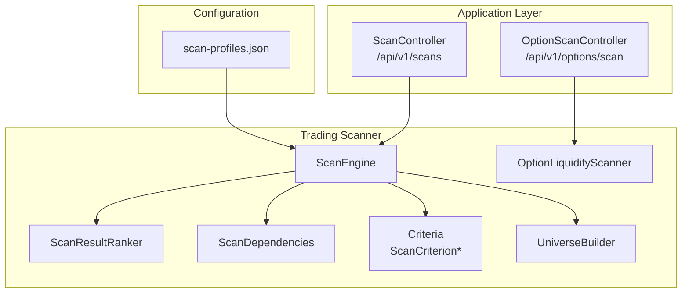
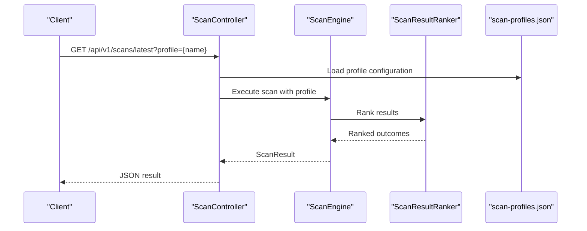
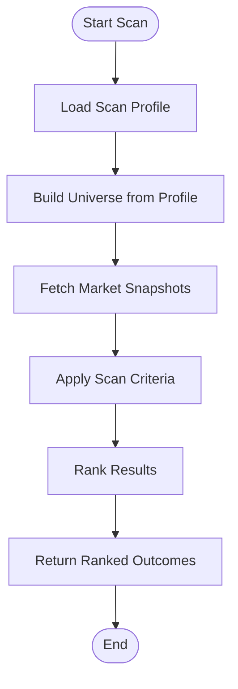
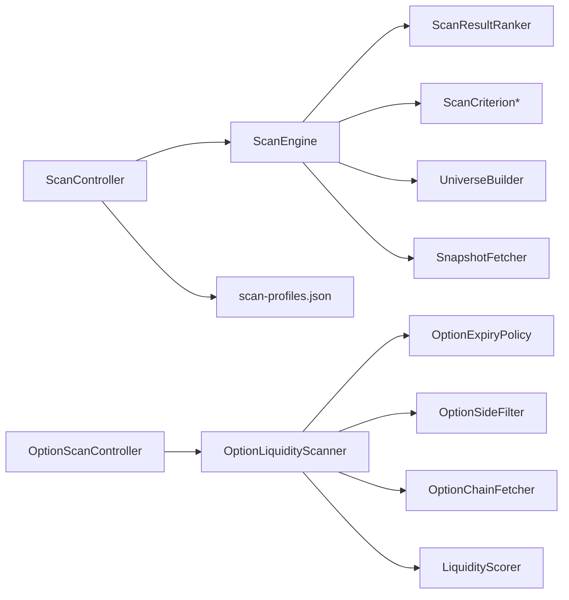

# Scanner API

<cite>
**Referenced Files in This Document**
- [ScanController.java](file://app/src/main/java/com/tradej/app/api/ScanController.java)
- [OptionScanController.java](file://app/src/main/java/com/tradej/app/api/OptionScanController.java)
- [API_DOCUMENTATION.md](file://docs/API_DOCUMENTATION.md)
- [scan-profiles.json](file://config/scan-profiles.json)
- [ScanEngine.java](file://trading/scanner/src/main/java/com/tradej/scanner/engine/ScanEngine.java)
- [ScanResultRanker.java](file://trading/scanner/src/main/java/com/tradej/scanner/engine/ScanResultRanker.java)
- [ScanDependencies.java](file://trading/scanner/src/main/java/com/tradej/scanner/engine/ScanDependencies.java)
- [ScanCriterion.java](file://trading/scanner/src/main/java/com/tradej/scanner/criterion/ScanCriterion.java)
- [ScanCriterionFactory.java](file://trading/scanner/src/main/java/com/tradej/scanner/criterion/ScanCriterionFactory.java)
- [OptionLiquidityScanner.java](file://trading/scanner/src/main/java/com/tradej/scanner/option/OptionLiquidityScanner.java)
- [OptionScanRequest.java](file://trading/scanner/src/main/java/com/tradej/scanner/option/OptionScanRequest.java)
- [OptionScanResult.java](file://trading/scanner/src/main/java/com/tradej/scanner/option/OptionScanResult.java)
- [OptionExpiryPolicy.java](file://trading/scanner/src/main/java/com/tradej/scanner/option/OptionExpiryPolicy.java)
- [OptionContractHit.java](file://trading/scanner/src/main/java/com/tradej/scanner/option/OptionContractHit.java)
- [OptionSideFilter.java](file://trading/scanner/src/main/java/com/tradej/scanner/option/OptionSideFilter.java)
- [LiquidityScorer.java](file://trading/scanner/src/main/java/com/tradej/scanner/option/LiquidityScorer.java)
- [UniverseBuilder.java](file://trading/scanner/src/main/java/com/tradej/scanner/universe/UniverseBuilder.java)
- [IndexConstituentsLoader.java](file://trading/scanner/src/main/java/com/tradej/scanner/universe/IndexConstituentsLoader.java)
- [SnapshotFetcher.java](file://trading/scanner/src/main/java/com/tradej/scanner/fetch/SnapshotFetcher.java)
- [OptionChainFetcher.java](file://trading/scanner/src/main/java/com/tradej/scanner/fetch/OptionChainFetcher.java)
- [ScanProfile.java](file://trading/scanner/src/main/java/com/tradej/scanner/model/ScanProfile.java)
- [RestScanSpec.java](file://trading/scanner/src/main/java/com/tradej/scanner/model/RestScanSpec.java)
- [OptionScanSpec.java](file://trading/scanner/src/main/java/com/tradej/scanner/model/OptionScanSpec.java)
- [ScanContext.java](file://trading/scanner/src/main/java/com/tradej/scanner/model/ScanContext.java)
- [ScanMode.java](file://trading/scanner/src/main/java/com/tradej/scanner/model/ScanMode.java)
- [ScanAsset.java](file://trading/scanner/src/main/java/com/tradej/scanner/model/ScanAsset.java)
- [InstitutionalScanResult.java](file://trading/institutional-scanner/src/main/java/com/tradej/institutional/model/InstitutionalScanResult.java)
- [ScanServiceInstitutionalComponentTest.java](file://app/src/test/java/com/tradej/app/integration/ScanServiceInstitutionalComponentTest.java)
- [InstitutionalScanIntegrationTest.java](file://app/src/test/java/com/tradej/app/integration/InstitutionalScanIntegrationTest.java)
</cite>

## Table of Contents
1. [Introduction](#introduction)
2. [Project Structure](#project-structure)
3. [Core Components](#core-components)
4. [Architecture Overview](#architecture-overview)
5. [Detailed Component Analysis](#detailed-component-analysis)
6. [Dependency Analysis](#dependency-analysis)
7. [Performance Considerations](#performance-considerations)
8. [Troubleshooting Guide](#troubleshooting-guide)
9. [Conclusion](#conclusion)
10. [Appendices](#appendices)

## Introduction
This document provides comprehensive REST API documentation for Trade-J scanner endpoints. It covers institutional equity scans, specific scan result retrieval, option contract ranking, and option expiry listings. For each endpoint, we specify parameters, scoring algorithms, filtering criteria, and result schemas. We also document scan profile configurations, institutional scan parameters, option screening criteria, execution triggers, result caching, and performance optimization strategies. Examples of scan configurations, result interpretation, and integration patterns for automated trading strategies are included.

## Project Structure
The scanner functionality spans several modules:
- Application API controllers expose REST endpoints for scanning and option analytics.
- Trading scanner module implements scan engines, criteria, universes, and option scanners.
- Configuration defines scan profiles used by the system.
- Tests validate institutional and scanner integrations.

**Diagram sources**
- [ScanController.java](file://app/src/main/java/com/tradej/app/api/ScanController.java)
- [OptionScanController.java](file://app/src/main/java/com/tradej/app/api/OptionScanController.java)
- [ScanEngine.java](file://trading/scanner/src/main/java/com/tradej/scanner/engine/ScanEngine.java)
- [ScanResultRanker.java](file://trading/scanner/src/main/java/com/tradej/scanner/engine/ScanResultRanker.java)
- [ScanDependencies.java](file://trading/scanner/src/main/java/com/tradej/scanner/engine/ScanDependencies.java)
- [ScanCriterion.java](file://trading/scanner/src/main/java/com/tradej/scanner/criterion/ScanCriterion.java)
- [UniverseBuilder.java](file://trading/scanner/src/main/java/com/tradej/scanner/universe/UniverseBuilder.java)
- [OptionLiquidityScanner.java](file://trading/scanner/src/main/java/com/tradej/scanner/option/OptionLiquidityScanner.java)
- [scan-profiles.json](file://config/scan-profiles.json)

**Section sources**
- [ScanController.java](file://app/src/main/java/com/tradej/app/api/ScanController.java)
- [OptionScanController.java](file://app/src/main/java/com/tradej/app/api/OptionScanController.java)
- [scan-profiles.json](file://config/scan-profiles.json)

## Core Components
- ScanController: Exposes endpoints for listing recent runs, retrieving latest results by profile, retrieving a specific run by runId, and triggering new scan runs.
- OptionScanController: Provides option contract ranking and expiry listing endpoints.
- ScanEngine: Orchestrates scan execution, applies criteria, and ranks results.
- ScanResultRanker: Implements ranking algorithms for scan outcomes.
- OptionLiquidityScanner: Performs option contract screening with liquidity scoring and filters.
- Configuration: scan-profiles.json defines available scan profiles and their parameters.

Key responsibilities:
- Endpoint exposure and request parameter binding
- Orchestration of scan execution via ScanEngine
- Option-specific ranking and expiry resolution
- Profile-driven configuration and universe building

**Section sources**
- [ScanController.java](file://app/src/main/java/com/tradej/app/api/ScanController.java)
- [OptionScanController.java](file://app/src/main/java/com/tradej/app/api/OptionScanController.java)
- [ScanEngine.java](file://trading/scanner/src/main/java/com/tradej/scanner/engine/ScanEngine.java)
- [ScanResultRanker.java](file://trading/scanner/src/main/java/com/tradej/scanner/engine/ScanResultRanker.java)
- [OptionLiquidityScanner.java](file://trading/scanner/src/main/java/com/tradej/scanner/option/OptionLiquidityScanner.java)
- [scan-profiles.json](file://config/scan-profiles.json)

## Architecture Overview
The scanner architecture integrates REST controllers with the trading scanner engine and option analytics. Controllers translate HTTP requests into domain models, invoke the engine, and serialize results.

**Diagram sources**
- [ScanController.java](file://app/src/main/java/com/tradej/app/api/ScanController.java)
- [ScanEngine.java](file://trading/scanner/src/main/java/com/tradej/scanner/engine/ScanEngine.java)
- [ScanResultRanker.java](file://trading/scanner/src/main/java/com/tradej/scanner/engine/ScanResultRanker.java)
- [scan-profiles.json](file://config/scan-profiles.json)

## Detailed Component Analysis

### REST Endpoints

#### Institutional Scans: /api/v1/scans
- GET /api/v1/scans/latest
  - Purpose: Retrieve the latest scan result for a given profile.
  - Parameters:
    - profile (string, required): Name of the scan profile.
  - Response: Serialized scan result body or 404 if not found.
  - Notes: Uses the configured scan profile to execute or fetch the latest run.

- GET /api/v1/scans/{runId}
  - Purpose: Retrieve a specific scan run by its run identifier.
  - Parameters:
    - runId (string, required): Unique scan run identifier.
  - Response: Serialized scan result body or 404 if not found.

- GET /api/v1/scans
  - Purpose: List recent scan runs for a profile.
  - Parameters:
    - profile (string, required): Name of the scan profile.
    - limit (integer, optional, default 10): Maximum number of runs to return.
  - Response: Array of scan run metadata.

- POST /api/v1/scans/run
  - Purpose: Trigger a new scan run for the specified profile (or default if omitted).
  - Parameters:
    - profile (string, optional): Scan profile name; uses default if absent.
  - Response: Accepted with run identifier or immediate result depending on implementation.

**Section sources**
- [API_DOCUMENTATION.md](file://docs/API_DOCUMENTATION.md)
- [ScanController.java](file://app/src/main/java/com/tradej/app/api/ScanController.java)

#### Option Contract Ranking: /api/v1/options/scan
- POST /api/v1/options/scan
  - Purpose: Rank option contracts based on configurable criteria and liquidity scoring.
  - Request Body Schema:
    - underlying (string, required): Underlying symbol identifier.
    - expiries (array[string], optional): Target expiry dates; if omitted, resolves applicable expiries.
    - side (string, optional): Filter by option side ("call" or "put"); defaults to both.
    - limit (integer, optional): Maximum number of ranked contracts to return.
    - criteria (array[object], optional): List of screening criteria with parameters.
      - type (string): Criterion type (e.g., volume_spike, pcr_range, max_oi_strike).
      - params (object): Criterion-specific parameters.
    - sortBy (string, optional): Sorting metric ("liquidity_score" recommended).
    - sortOrder (string, optional): "asc" or "desc"; default "desc".
  - Response Schema:
    - results (array[object]): Ranked option contracts.
      - symbol (string): Option contract symbol.
      - underlying (string): Underlying symbol.
      - expiry (string): Expiry date.
      - side (string): "call" or "put".
      - strike (number): Strike price.
      - liquidity_score (number): Ranking score.
      - criteria_scores (array[object]): Scores per applied criterion.
        - name (string): Criterion name.
        - score (number): Score value.
    - metadata (object):
      - processed_count (integer): Number of contracts evaluated.
      - filtered_count (integer): Number after applying filters.
      - profile_used (string): Scan profile name if applicable.
  - Notes:
    - Expiries are resolved via OptionExpiryPolicy if not provided.
    - Side filter via OptionSideFilter reduces evaluation scope.
    - LiquidityScorer computes scores based on market data fetched by OptionChainFetcher.

**Section sources**
- [OptionScanController.java](file://app/src/main/java/com/tradej/app/api/OptionScanController.java)
- [OptionLiquidityScanner.java](file://trading/scanner/src/main/java/com/tradej/scanner/option/OptionLiquidityScanner.java)
- [OptionScanRequest.java](file://trading/scanner/src/main/java/com/tradej/scanner/option/OptionScanRequest.java)
- [OptionScanResult.java](file://trading/scanner/src/main/java/com/tradej/scanner/option/OptionScanResult.java)
- [OptionExpiryPolicy.java](file://trading/scanner/src/main/java/com/tradej/scanner/option/OptionExpiryPolicy.java)
- [OptionSideFilter.java](file://trading/scanner/src/main/java/com/tradej/scanner/option/OptionSideFilter.java)
- [LiquidityScorer.java](file://trading/scanner/src/main/java/com/tradej/scanner/option/LiquidityScorer.java)
- [OptionChainFetcher.java](file://trading/scanner/src/main/java/com/tradej/scanner/fetch/OptionChainFetcher.java)

#### Option Expiry Listings: /api/v1/options/scan/expiries
- GET /api/v1/options/scan/expiries
  - Purpose: List available option expiries for a given underlying.
  - Parameters:
    - underlying (string, required): Underlying symbol identifier.
  - Response: Array of expiry dates (strings).
  - Notes: Uses OptionExpiryPolicy to resolve applicable expiries.

**Section sources**
- [OptionScanController.java](file://app/src/main/java/com/tradej/app/api/OptionScanController.java)
- [OptionExpiryPolicy.java](file://trading/scanner/src/main/java/com/tradej/scanner/option/OptionExpiryPolicy.java)

### Scan Profiles and Configuration
- scan-profiles.json defines named scan profiles containing:
  - Universe specification (indices, sectors, custom lists).
  - Mode of operation (real-time streaming vs batch).
  - Asset filters (instrument types, exchange segments).
  - Criteria definitions with parameters.
  - Ranking and aggregation rules.
- These profiles drive ScanEngine execution and result ranking.

**Section sources**
- [scan-profiles.json](file://config/scan-profiles.json)
- [ScanProfile.java](file://trading/scanner/src/main/java/com/tradej/scanner/model/ScanProfile.java)
- [RestScanSpec.java](file://trading/scanner/src/main/java/com/tradej/scanner/model/RestScanSpec.java)
- [UniverseBuilder.java](file://trading/scanner/src/main/java/com/tradej/scanner/universe/UniverseBuilder.java)
- [IndexConstituentsLoader.java](file://trading/scanner/src/main/java/com/tradej/scanner/universe/IndexConstituentsLoader.java)

### Institutional Scan Results
- InstitutionalScanResult encapsulates institutional scan outputs:
  - scanDate, scanTime: Timestamp of the scan.
  - selectionMode: Selection methodology used.
  - candidates: List of scored bars (instruments) with scores and provenance metadata.
- This structure supports downstream analytics and strategy execution.

**Section sources**
- [InstitutionalScanResult.java](file://trading/institutional-scanner/src/main/java/com/tradej/institutional/model/InstitutionalScanResult.java)

### Scoring Algorithms and Filtering Criteria
- ScanEngine applies configured criteria to raw market data snapshots.
- ScanResultRanker assigns composite scores to candidates.
- OptionLiquidityScanner:
  - Fetches option chains via OptionChainFetcher.
  - Applies OptionSideFilter to restrict to desired sides.
  - Computes liquidity scores via LiquidityScorer.
  - Ranks results and returns top contracts.

**Diagram sources**
- [ScanEngine.java](file://trading/scanner/src/main/java/com/tradej/scanner/engine/ScanEngine.java)
- [ScanResultRanker.java](file://trading/scanner/src/main/java/com/tradej/scanner/engine/ScanResultRanker.java)
- [SnapshotFetcher.java](file://trading/scanner/src/main/java/com/tradej/scanner/fetch/SnapshotFetcher.java)
- [ScanCriterion.java](file://trading/scanner/src/main/java/com/tradej/scanner/criterion/ScanCriterion.java)
- [ScanCriterionFactory.java](file://trading/scanner/src/main/java/com/tradej/scanner/criterion/ScanCriterionFactory.java)

**Section sources**
- [ScanEngine.java](file://trading/scanner/src/main/java/com/tradej/scanner/engine/ScanEngine.java)
- [ScanResultRanker.java](file://trading/scanner/src/main/java/com/tradej/scanner/engine/ScanResultRanker.java)
- [SnapshotFetcher.java](file://trading/scanner/src/main/java/com/tradej/scanner/fetch/SnapshotFetcher.java)
- [ScanCriterion.java](file://trading/scanner/src/main/java/com/tradej/scanner/criterion/ScanCriterion.java)
- [ScanCriterionFactory.java](file://trading/scanner/src/main/java/com/tradej/scanner/criterion/ScanCriterionFactory.java)

### Option Screening Criteria
Common criterion types include:
- Volume Spike: Identifies unusual volume increases.
- Percent Change From Open: Filters by intraday movement from open.
- Percent Change From Previous Close: Filters by overnight or session change.
- PCR Range: Filters by Put-Call Ratio within a specified range.
- Max OI Strike: Filters by strike with maximum Open Interest.
- StreamingScanCriterion: Enables real-time or streaming-based criteria.

Parameters are defined per criterion and supplied via the scan profile or request body.

**Section sources**
- [ScanCriterion.java](file://trading/scanner/src/main/java/com/tradej/scanner/criterion/ScanCriterion.java)
- [ScanCriterionFactory.java](file://trading/scanner/src/main/java/com/tradej/scanner/criterion/ScanCriterionFactory.java)

### Scan Execution Triggers and Result Caching
- Triggering:
  - POST /api/v1/scans/run initiates a new scan run using the specified profile.
  - GET /api/v1/scans/latest retrieves the most recent result for a profile.
- Caching:
  - Latest results are cached per profile and returned by GET /api/v1/scans/latest.
  - Pagination and listing endpoints return recent runs without re-execution.

**Section sources**
- [API_DOCUMENTATION.md](file://docs/API_DOCUMENTATION.md)
- [ScanController.java](file://app/src/main/java/com/tradej/app/api/ScanController.java)

### Result Interpretation and Integration Patterns
- Institutional results:
  - Use candidates' scores to rank instruments for selection.
  - Provenance metadata supports auditability and reproducibility.
- Option rankings:
  - Integrate liquidity scores into execution strategies.
  - Combine with volatility forecasts and Greeks for dynamic hedging.
- Automated strategies:
  - Poll GET /api/v1/scans/latest for periodic updates.
  - Subscribe to streaming feeds where supported to react immediately to new scans.

**Section sources**
- [InstitutionalScanResult.java](file://trading/institutional-scanner/src/main/java/com/tradej/institutional/model/InstitutionalScanResult.java)
- [OptionScanResult.java](file://trading/scanner/src/main/java/com/tradej/scanner/option/OptionScanResult.java)

## Dependency Analysis
The scanner API depends on:
- Application controllers for HTTP exposure.
- Trading scanner engine for orchestration and ranking.
- Option analytics for liquidity scoring and expiry resolution.
- Configuration for profile-driven behavior.

**Diagram sources**
- [ScanController.java](file://app/src/main/java/com/tradej/app/api/ScanController.java)
- [OptionScanController.java](file://app/src/main/java/com/tradej/app/api/OptionScanController.java)
- [ScanEngine.java](file://trading/scanner/src/main/java/com/tradej/scanner/engine/ScanEngine.java)
- [ScanResultRanker.java](file://trading/scanner/src/main/java/com/tradej/scanner/engine/ScanResultRanker.java)
- [ScanCriterion.java](file://trading/scanner/src/main/java/com/tradej/scanner/criterion/ScanCriterion.java)
- [UniverseBuilder.java](file://trading/scanner/src/main/java/com/tradej/scanner/universe/UniverseBuilder.java)
- [SnapshotFetcher.java](file://trading/scanner/src/main/java/com/tradej/scanner/fetch/SnapshotFetcher.java)
- [OptionLiquidityScanner.java](file://trading/scanner/src/main/java/com/tradej/scanner/option/OptionLiquidityScanner.java)
- [OptionExpiryPolicy.java](file://trading/scanner/src/main/java/com/tradej/scanner/option/OptionExpiryPolicy.java)
- [OptionSideFilter.java](file://trading/scanner/src/main/java/com/tradej/scanner/option/OptionSideFilter.java)
- [OptionChainFetcher.java](file://trading/scanner/src/main/java/com/tradej/scanner/fetch/OptionChainFetcher.java)
- [LiquidityScorer.java](file://trading/scanner/src/main/java/com/tradej/scanner/option/LiquidityScorer.java)
- [scan-profiles.json](file://config/scan-profiles.json)

**Section sources**
- [ScanController.java](file://app/src/main/java/com/tradej/app/api/ScanController.java)
- [OptionScanController.java](file://app/src/main/java/com/tradej/app/api/OptionScanController.java)
- [ScanEngine.java](file://trading/scanner/src/main/java/com/tradej/scanner/engine/ScanEngine.java)
- [OptionLiquidityScanner.java](file://trading/scanner/src/main/java/com/tradej/scanner/option/OptionLiquidityScanner.java)
- [scan-profiles.json](file://config/scan-profiles.json)

## Performance Considerations
- Universe pruning: Use UniverseBuilder and IndexConstituentsLoader to narrow candidate sets early.
- Streaming criteria: Leverage StreamingScanCriterion for real-time filtering to reduce latency.
- Option-side filtering: Apply OptionSideFilter to minimize evaluation scope.
- Caching: Utilize GET /api/v1/scans/latest to avoid repeated computation.
- Pagination: Limit results with the limit parameter to control payload sizes.
- Parallelism: OptionChainFetcher and SnapshotFetcher should operate in parallel where feasible.

[No sources needed since this section provides general guidance]

## Troubleshooting Guide
- 404 Not Found:
  - Occurs when a requested runId does not exist or latest result is unavailable for a profile.
- Validation errors:
  - Ensure required parameters (profile, underlying) are present.
  - Verify criterion types and parameter formats match registered criteria.
- Performance issues:
  - Reduce limit and refine universes.
  - Use expiries and side filters for options.
- Integration tips:
  - Poll latest endpoint for periodic updates.
  - Use expiries endpoint to discover valid expiry dates before ranking.

**Section sources**
- [API_DOCUMENTATION.md](file://docs/API_DOCUMENTATION.md)
- [ScanController.java](file://app/src/main/java/com/tradej/app/api/ScanController.java)
- [OptionScanController.java](file://app/src/main/java/com/tradej/app/api/OptionScanController.java)

## Conclusion
The Trade-J scanner API provides robust endpoints for institutional and options scanning. By leveraging configurable scan profiles, efficient ranking algorithms, and option-specific liquidity scoring, users can integrate automated trading strategies effectively. Proper use of caching, pagination, and filtering ensures optimal performance and scalability.

[No sources needed since this section summarizes without analyzing specific files]

## Appendices

### Appendix A: Endpoint Reference Summary
- GET /api/v1/scans/latest?profile={name}
- GET /api/v1/scans/{runId}
- GET /api/v1/scans?profile={name}&limit={n}
- POST /api/v1/scans/run?profile={name}
- POST /api/v1/options/scan
- GET /api/v1/options/scan/expiries?underlying={symbol}

**Section sources**
- [API_DOCUMENTATION.md](file://docs/API_DOCUMENTATION.md)

### Appendix B: Example Configuration and Usage
- Configure scan profiles in scan-profiles.json to define universes, modes, asset filters, and criteria.
- Trigger scans via POST /api/v1/scans/run and retrieve results via GET /api/v1/scans/latest.
- For options, call POST /api/v1/options/scan with underlying and optional filters; use GET /api/v1/options/scan/expiries to discover expiries.

**Section sources**
- [scan-profiles.json](file://config/scan-profiles.json)
- [API_DOCUMENTATION.md](file://docs/API_DOCUMENTATION.md)