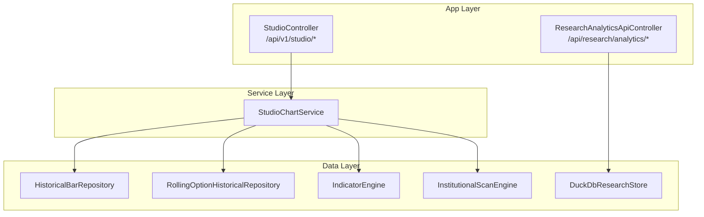
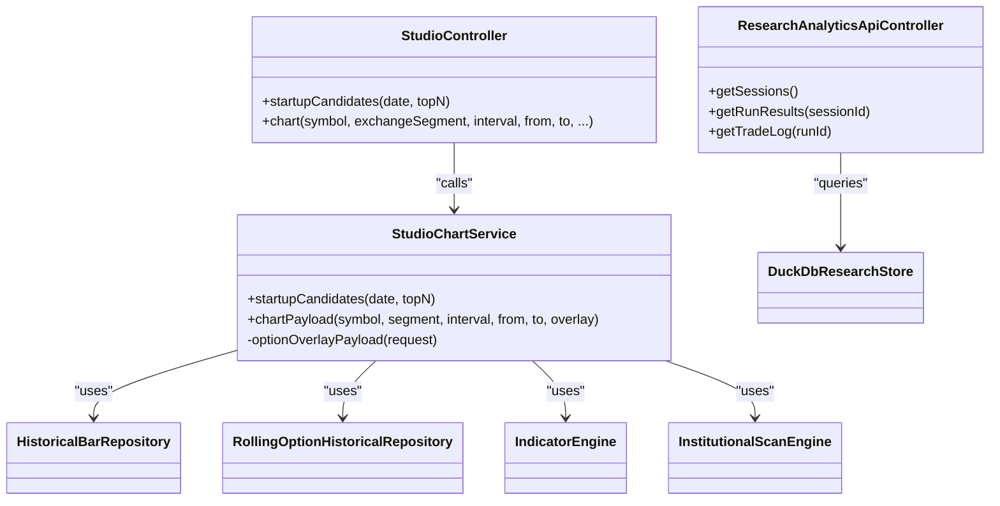

# Studio API

<cite>
**Referenced Files in This Document**
- [StudioController.java](file://app/src/main/java/com/tradej/app/api/StudioController.java)
- [StudioChartService.java](file://trading/strategy/src/main/java/com/tradej/strategy/studio/StudioChartService.java)
- [ResearchAnalyticsApiController.java](file://research/api/src/main/java/com/tradej/research/api/ResearchAnalyticsApiController.java)
- [types.test.ts](file://archive/frontend/src/dto/types.test.ts)
- [client.ts](file://archive/frontend/src/api/client.ts)
- [StudioControllerContractTest.java](file://app/src/test/java/com/tradej/app/api/StudioControllerContractTest.java)
- [ARCHITECTURE.md](file://ARCHITECTURE.md)
- [MODULES_AND_APIS.md](file://docs/MODULES_AND_APIS.md)
- [API_DOCUMENTATION.md](file://docs/API_DOCUMENTATION.md)
- [FRONTEND_BACKEND_CONNECTION_TEST.md](file://FRONTEND_BACKEND_CONNECTION_TEST.md)
- [test-api.sh](file://scripts/test-api.sh)
</cite>

## Table of Contents
1. [Introduction](#introduction)
2. [Project Structure](#project-structure)
3. [Core Components](#core-components)
4. [Architecture Overview](#architecture-overview)
5. [Detailed Component Analysis](#detailed-component-analysis)
6. [Dependency Analysis](#dependency-analysis)
7. [Performance Considerations](#performance-considerations)
8. [Troubleshooting Guide](#troubleshooting-guide)
9. [Conclusion](#conclusion)
10. [Appendices](#appendices)

## Introduction
This document provides comprehensive REST API documentation for Trade-J studio endpoints. It covers:
- Startup candidate discovery for scanning and screening
- Chart data generation with technical overlays and option chain integration
- Research analytics endpoints for accessing DuckDB-backed research data

The documentation specifies endpoint parameters, response schemas, data formatting, and practical examples for composing charts, integrating option chains, and visualizing research datasets.

## Project Structure
The studio APIs are implemented as Spring Boot REST controllers within the application module, backed by services that orchestrate data retrieval from repositories and indicator engines. Research analytics are exposed via dedicated controller endpoints backed by DuckDB.



**Diagram sources**
- [StudioController.java:20-101](file://app/src/main/java/com/tradej/app/api/StudioController.java#L20-L101)
- [StudioChartService.java:22-187](file://trading/strategy/src/main/java/com/tradej/strategy/studio/StudioChartService.java#L22-L187)
- [ResearchAnalyticsApiController.java:24-89](file://research/api/src/main/java/com/tradej/research/api/ResearchAnalyticsApiController.java#L24-L89)

**Section sources**
- [StudioController.java:20-101](file://app/src/main/java/com/tradej/app/api/StudioController.java#L20-L101)
- [StudioChartService.java:22-187](file://trading/strategy/src/main/java/com/tradej/strategy/studio/StudioChartService.java#L22-L187)
- [ResearchAnalyticsApiController.java:24-89](file://research/api/src/main/java/com/tradej/research/api/ResearchAnalyticsApiController.java#L24-L89)

## Core Components
- StudioController: Exposes endpoints for startup candidates and chart data generation.
- StudioChartService: Orchestrates candle retrieval, indicator enrichment, and optional option chain overlay construction.
- ResearchAnalyticsApiController: Provides endpoints for sessions, run results, and trade logs backed by DuckDB.

Key responsibilities:
- Parameter validation and conversion (dates, intervals, segments)
- Overlay request building for rolling option series
- Response payload shaping for chart overlays and research datasets

**Section sources**
- [StudioController.java:20-101](file://app/src/main/java/com/tradej/app/api/StudioController.java#L20-L101)
- [StudioChartService.java:22-187](file://trading/strategy/src/main/java/com/tradej/strategy/studio/StudioChartService.java#L22-L187)
- [ResearchAnalyticsApiController.java:24-89](file://research/api/src/main/java/com/tradej/research/api/ResearchAnalyticsApiController.java#L24-L89)

## Architecture Overview
Studio endpoints are REST-first, returning JSON payloads designed for frontend charting libraries. Research endpoints expose read-only analytics queries against DuckDB.

```mermaid
sequenceDiagram
participant FE as "Frontend"
participant API as "StudioController"
participant SVC as "StudioChartService"
participant IND as "IndicatorEngine"
participant HIST as "HistoricalBarRepository"
participant OPT as "RollingOptionHistoricalRepository"
FE->>API : GET /api/v1/studio/chart
API->>SVC : chartPayload(symbol, segment, interval, from, to, overlay?)
SVC->>HIST : queryCandles(instrument, interval, from, to)
HIST-->>SVC : candles[]
SVC->>IND : enrich(candles)
IND-->>SVC : enriched chart data
SVC->>OPT : queryBars(overlay request?) (optional)
OPT-->>SVC : option bars (if overlay present)
SVC-->>API : composed payload
API-->>FE : JSON response
```

**Diagram sources**
- [StudioController.java:40-67](file://app/src/main/java/com/tradej/app/api/StudioController.java#L40-L67)
- [StudioChartService.java:61-122](file://trading/strategy/src/main/java/com/tradej/strategy/studio/StudioChartService.java#L61-L122)

**Section sources**
- [StudioController.java:20-101](file://app/src/main/java/com/tradej/app/api/StudioController.java#L20-L101)
- [StudioChartService.java:22-187](file://trading/strategy/src/main/java/com/tradej/strategy/studio/StudioChartService.java#L22-L187)

## Detailed Component Analysis

### Endpoint: Startup Candidate Discovery
- Path: `/api/v1/studio/startup-candidates`
- Method: GET
- Produces: application/json

Parameters:
- date (optional): LocalDate in YYYY-MM-DD format; defaults to latest scan day if omitted
- topN (optional): integer; default is 3; limits number of returned candidates

Response structure:
- scanDate: string (YYYY-MM-DD)
- scanTime: string (HH:mm:ss)
- requestedScanTime: string (HH:mm:ss)
- chartLookbackDays: integer (fixed value)
- selectionMode: string
- provenance: object containing metadata
- candidates: array of scored candidates

Candidate item fields:
- symbol: string
- rank: integer
- masterScore: number
- rsScore: number
- volumeExpansionScore: number
- trendEfficiencyScore: number
- openingDriveScore: number
- closePaisa: integer (price in paisa)
- barTimeMs: integer (epoch milliseconds)

Example request:
- GET /api/v1/studio/startup-candidates?topN=5&date=2026-05-29

Example response keys and types are validated by frontend DTO tests.

**Section sources**
- [StudioController.java:32-38](file://app/src/main/java/com/tradej/app/api/StudioController.java#L32-L38)
- [StudioChartService.java:43-59](file://trading/strategy/src/main/java/com/tradej/strategy/studio/StudioChartService.java#L43-L59)
- [StudioControllerContractTest.java:38-56](file://app/src/test/java/com/tradej/app/api/StudioControllerContractTest.java#L38-L56)
- [types.test.ts:5-18](file://archive/frontend/src/dto/types.test.ts#L5-L18)

### Endpoint: Chart Data Generation
- Path: `/api/v1/studio/chart`
- Method: GET
- Produces: application/json

Required parameters:
- symbol: string (instrument identifier)
- exchangeSegment: enum string (default: NSE_EQ)
- interval: string (default: 5m)
- from: LocalDate (YYYY-MM-DD)
- to: LocalDate (YYYY-MM-DD)

Optional parameters for option chain overlay:
- optionUnderlying: string (underlying symbol)
- optionExpiryKind: string (expiry designation)
- optionExpiryCode: integer (expiry code)
- optionStrikeOffset: integer (strike offset)
- optionType: string (call or put)
- optionIntervalMin: integer (default: 5)

Behavior:
- If all option overlay parameters are provided, a rolling option series request is built and included in the response under optionOverlay.
- If any overlay parameter is missing, no overlay is included.
- Date range defaults to the latest available trading day if either from or to is null.

Response structure:
- symbol: string
- exchangeSegment: enum string
- interval: string
- from: string (YYYY-MM-DD)
- to: string (YYYY-MM-DD)
- count: integer
- candles: array of candle objects
- halfTrend: array of indicator points
- cvd: array of cumulative delta points
- bollingerSqueeze: array of squeeze bands
- markers: array of chart markers
- orderBlockZones: array of order block zones
- optionOverlay: object (present only when overlay parameters are provided)

Candle fields:
- startTimeMs: integer (epoch milliseconds)
- endTimeMs: integer (epoch milliseconds)
- openPaisa: integer
- highPaisa: integer
- lowPaisa: integer
- closePaisa: integer
- volume: integer

Option overlay fields:
- underlying: string
- expiryKind: string
- expiryCode: integer
- strikeOffset: integer
- optionType: string
- intervalMin: integer
- count: integer
- bars: array of option bar objects
  - timestampMs: integer (epoch milliseconds)
  - closePaisa: integer
  - volume: integer
  - iv: integer
  - oi: integer

Technical indicator arrays:
- halfTrend: value, direction, high, low
- cvd: cvd, volumeDelta
- bollingerSqueeze: middle, upper, lower, squeeze
- markers: type, timeMs, price
- orderBlockZones: startTimeMs, endTimeMs, top, bottom, bias

Example requests:
- Basic chart: GET /api/v1/studio/chart?symbol=NIFTY&exchangeSegment=IDX_I&from=2026-05-01&to=2026-05-30
- With overlay: Add all six option overlay parameters to include optionOverlay in response

**Section sources**
- [StudioController.java:40-67](file://app/src/main/java/com/tradej/app/api/StudioController.java#L40-L67)
- [StudioChartService.java:61-142](file://trading/strategy/src/main/java/com/tradej/strategy/studio/StudioChartService.java#L61-L142)
- [types.test.ts:20-50](file://archive/frontend/src/dto/types.test.ts#L20-L50)
- [client.ts:49-55](file://archive/frontend/src/api/client.ts#L49-L55)

### Endpoint: Research Analytics
- Base path: `/api/research/analytics`
- Method: GET

Endpoints:
- GET /api/research/analytics/sessions
  - Returns distinct session identifiers ordered by descending session ID.
- GET /api/research/analytics/run-results
  - Query parameters:
    - sessionId (optional): filters results by session ID
  - Returns run results ordered by start_time_ms descending; if sessionId provided, filtered by session ID.
- GET /api/research/analytics/trade-log
  - Query parameters:
    - runId: required; filters trade log entries by run ID
  - Returns trade log entries ordered by entry_time_ms ascending.

Response format:
- Array of objects representing rows from DuckDB tables (run_results, trade_log).
- Each row object maps column names to values.

Notes:
- Queries are executed against DuckDbResearchStore connection.
- On SQL errors, returns HTTP 500.

**Section sources**
- [ResearchAnalyticsApiController.java:35-87](file://research/api/src/main/java/com/tradej/research/api/ResearchAnalyticsApiController.java#L35-L87)

## Dependency Analysis
StudioController depends on StudioChartService, which in turn depends on:
- HistoricalBarRepository (candle data)
- RollingOptionHistoricalRepository (option chain bars)
- IndicatorEngine (technical indicators)
- InstitutionalScanEngine (startup candidate scoring)

Research endpoints depend on DuckDbResearchStore for read-only queries.



**Diagram sources**
- [StudioController.java:20-101](file://app/src/main/java/com/tradej/app/api/StudioController.java#L20-L101)
- [StudioChartService.java:22-187](file://trading/strategy/src/main/java/com/tradej/strategy/studio/StudioChartService.java#L22-L187)
- [ResearchAnalyticsApiController.java:24-89](file://research/api/src/main/java/com/tradej/research/api/ResearchAnalyticsApiController.java#L24-L89)

**Section sources**
- [StudioController.java:20-101](file://app/src/main/java/com/tradej/app/api/StudioController.java#L20-L101)
- [StudioChartService.java:22-187](file://trading/strategy/src/main/java/com/tradej/strategy/studio/StudioChartService.java#L22-L187)
- [ResearchAnalyticsApiController.java:24-89](file://research/api/src/main/java/com/tradej/research/api/ResearchAnalyticsApiController.java#L24-L89)

## Performance Considerations
- Date range selection: Keep from-to windows reasonable to limit candle and indicator computation.
- Overlay inclusion: Adding option chain overlays increases query load; use only when needed.
- Indicator computation: Enrichment operations scale with candle count; large ranges impact latency.
- DuckDB queries: Use sessionId filtering for run-results to reduce result set size.

## Troubleshooting Guide
Common issues and resolutions:
- No candles returned: Verify symbol and exchangeSegment; ensure from-to range includes trading days; check latest available trading day resolution.
- Missing option overlay: Confirm all six overlay parameters are provided; verify underlying, expiry kind/code, strike offset, and option type are non-blank.
- SQL errors in research endpoints: Inspect sessionId/runId parameters; ensure the referenced IDs exist in DuckDB tables.
- Frontend integration: Validate parameter encoding for symbol and date formats; refer to frontend client usage.

**Section sources**
- [StudioChartService.java:78-82](file://trading/strategy/src/main/java/com/tradej/strategy/studio/StudioChartService.java#L78-L82)
- [StudioController.java:79-85](file://app/src/main/java/com/tradej/app/api/StudioController.java#L79-L85)
- [ResearchAnalyticsApiController.java:83-85](file://research/api/src/main/java/com/tradej/research/api/ResearchAnalyticsApiController.java#L83-L85)

## Conclusion
The Trade-J Studio API provides a cohesive set of endpoints for discovering startup candidates, generating enriched chart data with technical overlays, and accessing research analytics from DuckDB. By adhering to the documented parameter specifications and response schemas, clients can compose charts, integrate option chains, and visualize research datasets effectively.

## Appendices

### Endpoint Reference Summary
- Studio
  - GET /api/v1/studio/startup-candidates
    - Params: date (optional), topN (optional)
    - Response: scan metadata + candidates[]
  - GET /api/v1/studio/chart
    - Required: symbol, exchangeSegment (default NSE_EQ), interval (default 5m), from, to
    - Optional overlay: optionUnderlying, optionExpiryKind, optionExpiryCode, optionStrikeOffset, optionType, optionIntervalMin (default 5)
    - Response: chart payload with candles, indicators, optional optionOverlay
- Research Analytics
  - GET /api/research/analytics/sessions
  - GET /api/research/analytics/run-results?sessionId={optional}
  - GET /api/research/analytics/trade-log?runId={required}

**Section sources**
- [ARCHITECTURE.md:1076-1077](file://ARCHITECTURE.md#L1076-L1077)
- [MODULES_AND_APIS.md:152-157](file://docs/MODULES_AND_APIS.md#L152-L157)
- [API_DOCUMENTATION.md:373-385](file://docs/API_DOCUMENTATION.md#L373-L385)
- [FRONTEND_BACKEND_CONNECTION_TEST.md:40-41](file://FRONTEND_BACKEND_CONNECTION_TEST.md#L40-L41)
- [test-api.sh:108-109](file://scripts/test-api.sh#L108-L109)