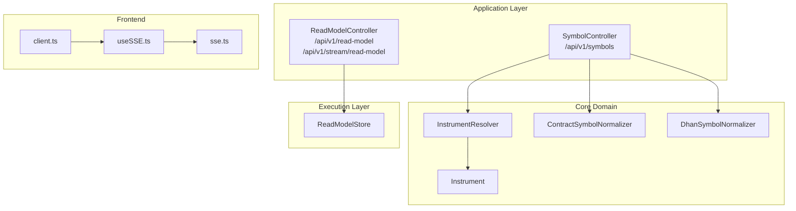
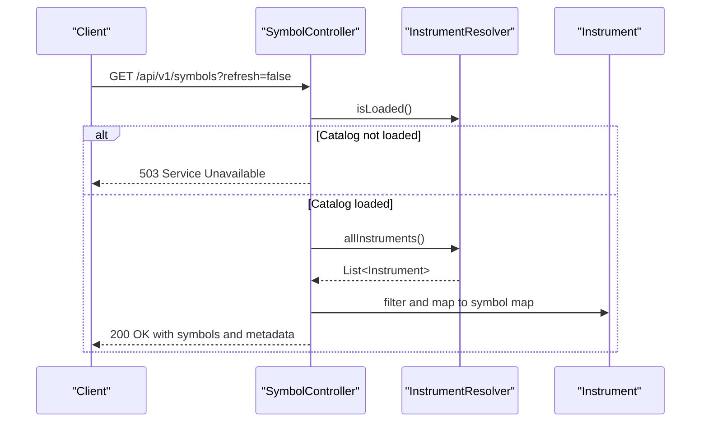
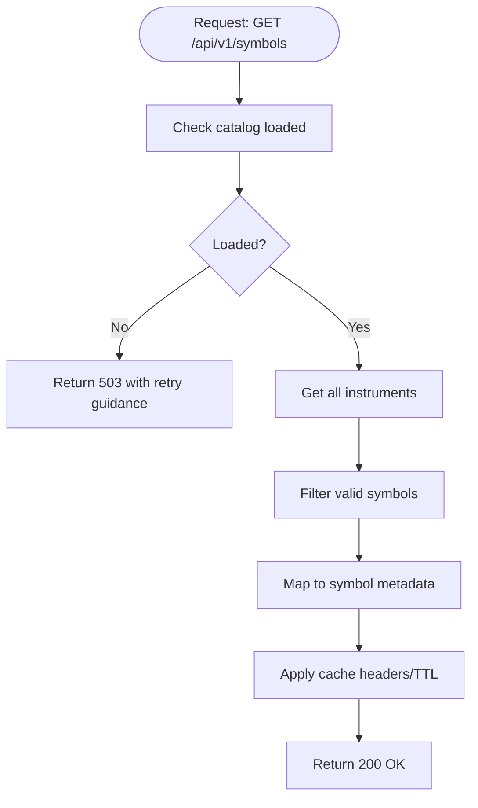
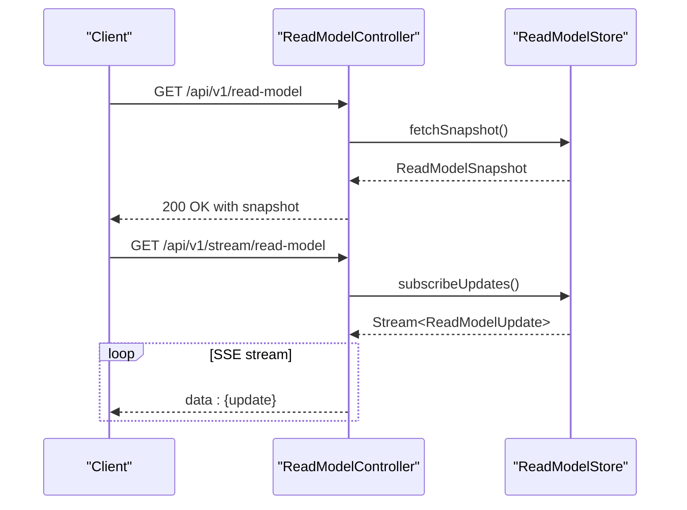
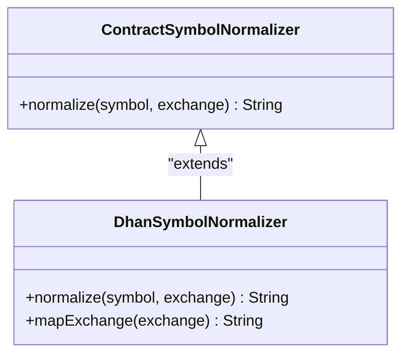
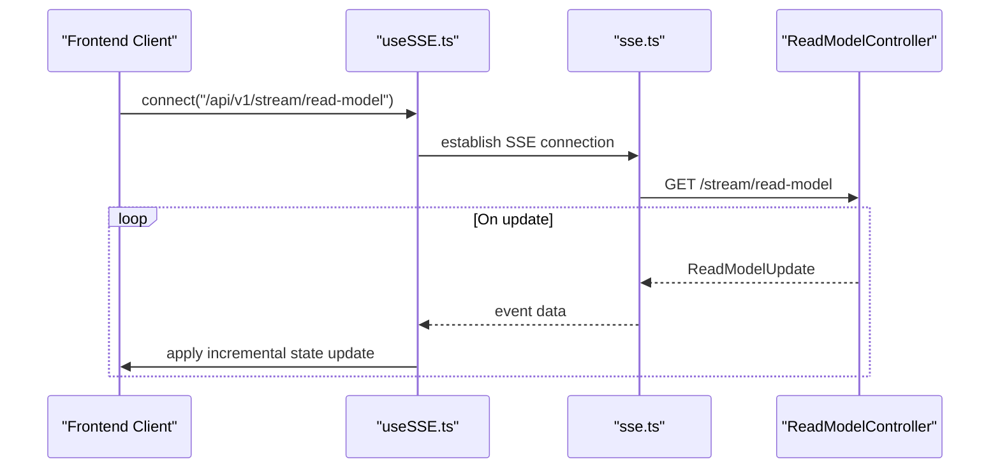
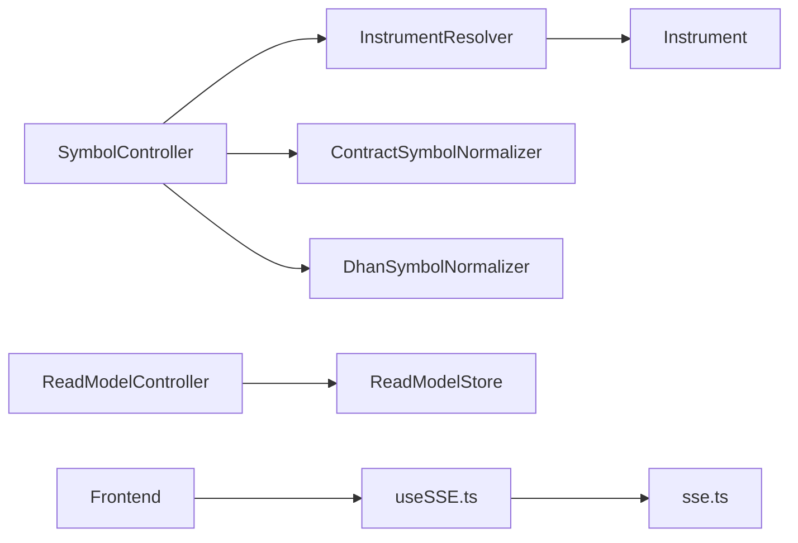

# Symbols and Read Model API

<cite>
**Referenced Files in This Document**
- [SymbolController.java](file://app/src/main/java/com/tradej/app/api/SymbolController.java)
- [ReadModelController.java](file://app/src/main/java/com/tradej/app/api/ReadModelController.java)
- [Instrument.java](file://core/src/main/java/com/tradej/core/domain/model/Instrument.java)
- [InstrumentResolver.java](file://core/src/main/java/com/tradej/core/domain/instrument/InstrumentResolver.java)
- [ContractSymbolNormalizer.java](file://core/src/main/java/com/tradej/core/domain/instrument/ContractSymbolNormalizer.java)
- [DhanSymbolNormalizer.java](file://broker/dhan/src/main/java/com/tradej/broker/dhan/instrument/DhanSymbolNormalizer.java)
- [ReadModelStore.java](file://trading/execution/src/main/java/com/tradej/execution/readmodel/ReadModelStore.java)
- [API_DOCUMENTATION.md](file://docs/API_DOCUMENTATION.md)
- [openapi.yaml](file://docs/openapi.yaml)
- [SymbolControllerIntegrationTest.java](file://app/src/test/java/com/tradej/app/integration/SymbolControllerIntegrationTest.java)
- [useSSE.ts](file://archive/frontend/dist/src/hooks/useSSE.ts)
- [client.ts](file://archive/frontend/dist/src/api/client.ts)
- [sse.ts](file://archive/frontend/dist/src/api/sse.ts)
</cite>

## Table of Contents
1. [Introduction](#introduction)
2. [Project Structure](#project-structure)
3. [Core Components](#core-components)
4. [Architecture Overview](#architecture-overview)
5. [Detailed Component Analysis](#detailed-component-analysis)
6. [Dependency Analysis](#dependency-analysis)
7. [Performance Considerations](#performance-considerations)
8. [Troubleshooting Guide](#troubleshooting-guide)
9. [Conclusion](#conclusion)

## Introduction
This document provides comprehensive REST API documentation for Trade-J's symbols and read model endpoints. It covers:
- Symbol catalog endpoints (`/api/v1/symbols`) for symbol discovery, instrument metadata, and cache management
- Read model endpoints (`/api/v1/read-model` and `/api/v1/stream/read-model`) for real-time state snapshots, order positions, market data, and performance metrics
- Detailed schemas for instrument definitions, market state, portfolio holdings, and streaming events
- Symbol normalization, exchange mappings, and real-time update mechanisms
- Server-Sent Events (SSE) streaming protocols, event filtering, and client-side state management patterns

## Project Structure
The API surface for symbols and read models spans several modules:
- Application layer controllers for HTTP endpoints
- Core domain models for instruments and symbol resolution
- Execution read model store for runtime state aggregation
- Frontend utilities for SSE consumption and client-side state management

**Diagram sources**
- [SymbolController.java:1-120](file://app/src/main/java/com/tradej/app/api/SymbolController.java#L1-L120)
- [ReadModelController.java:1-200](file://app/src/main/java/com/tradej/app/api/ReadModelController.java#L1-L200)
- [InstrumentResolver.java:1-200](file://core/src/main/java/com/tradej/core/domain/instrument/InstrumentResolver.java#L1-L200)
- [Instrument.java:1-200](file://core/src/main/java/com/tradej/core/domain/model/Instrument.java#L1-L200)
- [ContractSymbolNormalizer.java:1-200](file://core/src/main/java/com/tradej/core/domain/instrument/ContractSymbolNormalizer.java#L1-L200)
- [DhanSymbolNormalizer.java:1-200](file://broker/dhan/src/main/java/com/tradej/broker/dhan/instrument/DhanSymbolNormalizer.java#L1-L200)
- [ReadModelStore.java:1-200](file://trading/execution/src/main/java/com/tradej/execution/readmodel/ReadModelStore.java#L1-L200)
- [useSSE.ts:1-200](file://archive/frontend/dist/src/hooks/useSSE.ts#L1-L200)
- [client.ts:1-200](file://archive/frontend/dist/src/api/client.ts#L1-L200)
- [sse.ts:1-200](file://archive/frontend/dist/src/api/sse.ts#L1-L200)

**Section sources**
- [SymbolController.java:1-120](file://app/src/main/java/com/tradej/app/api/SymbolController.java#L1-L120)
- [ReadModelController.java:1-200](file://app/src/main/java/com/tradej/app/api/ReadModelController.java#L1-L200)
- [InstrumentResolver.java:1-200](file://core/src/main/java/com/tradej/core/domain/instrument/InstrumentResolver.java#L1-L200)
- [Instrument.java:1-200](file://core/src/main/java/com/tradej/core/domain/model/Instrument.java#L1-L200)
- [ContractSymbolNormalizer.java:1-200](file://core/src/main/java/com/tradej/core/domain/instrument/ContractSymbolNormalizer.java#L1-L200)
- [DhanSymbolNormalizer.java:1-200](file://broker/dhan/src/main/java/com/tradej/broker/dhan/instrument/DhanSymbolNormalizer.java#L1-L200)
- [ReadModelStore.java:1-200](file://trading/execution/src/main/java/com/tradej/execution/readmodel/ReadModelStore.java#L1-L200)
- [useSSE.ts:1-200](file://archive/frontend/dist/src/hooks/useSSE.ts#L1-L200)
- [client.ts:1-200](file://archive/frontend/dist/src/api/client.ts#L1-L200)
- [sse.ts:1-200](file://archive/frontend/dist/src/api/sse.ts#L1-L200)

## Core Components
This section documents the primary components involved in symbols and read model APIs.

- SymbolController: Handles symbol catalog retrieval, metadata exposure, and caching behavior
- ReadModelController: Provides snapshot and streaming read model endpoints
- InstrumentResolver: Supplies instrument catalog and resolves instruments
- Instrument: Core domain model representing tradable instruments
- ContractSymbolNormalizer and DhanSymbolNormalizer: Normalize symbols across exchanges
- ReadModelStore: Aggregates runtime state for read model consumers
- Frontend SSE utilities: Client-side SSE consumption and state management

Key responsibilities:
- Symbol discovery and metadata: Retrieve active/tradable instruments with optional refresh
- Cache management: TTL-based caching and availability checks
- Real-time streaming: Server-Sent Events for continuous state updates
- Client-side state: SSE event parsing and incremental state updates

**Section sources**
- [SymbolController.java:1-120](file://app/src/main/java/com/tradej/app/api/SymbolController.java#L1-L120)
- [ReadModelController.java:1-200](file://app/src/main/java/com/tradej/app/api/ReadModelController.java#L1-L200)
- [InstrumentResolver.java:1-200](file://core/src/main/java/com/tradej/core/domain/instrument/InstrumentResolver.java#L1-L200)
- [Instrument.java:1-200](file://core/src/main/java/com/tradej/core/domain/model/Instrument.java#L1-L200)
- [ContractSymbolNormalizer.java:1-200](file://core/src/main/java/com/tradej/core/domain/instrument/ContractSymbolNormalizer.java#L1-L200)
- [DhanSymbolNormalizer.java:1-200](file://broker/dhan/src/main/java/com/tradej/broker/dhan/instrument/DhanSymbolNormalizer.java#L1-L200)
- [ReadModelStore.java:1-200](file://trading/execution/src/main/java/com/tradej/execution/readmodel/ReadModelStore.java#L1-L200)

## Architecture Overview
The symbols and read model APIs follow a layered architecture:
- Presentation layer: Controllers expose HTTP endpoints
- Domain layer: Instrument resolution and normalization
- Execution layer: Read model aggregation and storage
- Frontend layer: SSE consumption and reactive state updates

**Diagram sources**
- [SymbolController.java:38-120](file://app/src/main/java/com/tradej/app/api/SymbolController.java#L38-L120)
- [InstrumentResolver.java:1-200](file://core/src/main/java/com/tradej/core/domain/instrument/InstrumentResolver.java#L1-L200)
- [Instrument.java:1-200](file://core/src/main/java/com/tradej/core/domain/model/Instrument.java#L1-L200)

**Section sources**
- [SymbolController.java:38-120](file://app/src/main/java/com/tradej/app/api/SymbolController.java#L38-L120)
- [InstrumentResolver.java:1-200](file://core/src/main/java/com/tradej/core/domain/instrument/InstrumentResolver.java#L1-L200)
- [Instrument.java:1-200](file://core/src/main/java/com/tradej/core/domain/model/Instrument.java#L1-L200)

## Detailed Component Analysis

### Symbol Catalog Endpoints
- Endpoint: `GET /api/v1/symbols`
- Purpose: Discover available trading symbols with metadata and manage cache behavior
- Query parameters:
  - `refresh`: Boolean to force catalog refresh
- Response:
  - 200 OK: Array of symbol entries with metadata
  - 503 Service Unavailable: When catalog is not loaded, includes retry guidance

Processing logic:
- Availability check: Returns 503 if catalog is not loaded
- Instrument filtering: Filters out null or blank symbols
- Metadata mapping: Converts Instrument instances to symbol maps
- Caching: Uses controller-level TTL for caching behavior

**Diagram sources**
- [SymbolController.java:38-120](file://app/src/main/java/com/tradej/app/api/SymbolController.java#L38-L120)

**Section sources**
- [SymbolController.java:38-120](file://app/src/main/java/com/tradej/app/api/SymbolController.java#L38-L120)
- [API_DOCUMENTATION.md:423-436](file://docs/API_DOCUMENTATION.md#L423-L436)
- [openapi.yaml:695-712](file://docs/openapi.yaml#L695-L712)

### Read Model Endpoints
- Endpoint: `GET /api/v1/read-model`
  - Purpose: Snapshot of runtime state including orders, positions, market data, signals, and PnL
  - Response: JSON payload conforming to the read model snapshot schema
- Endpoint: `GET /api/v1/stream/read-model`
  - Purpose: Server-Sent Events stream of read model updates
  - Protocol: SSE with event-driven updates

Processing logic:
- Snapshot endpoint: Aggregates current state from the read model store
- Streaming endpoint: Establishes persistent connection emitting incremental updates

**Diagram sources**
- [ReadModelController.java:1-200](file://app/src/main/java/com/tradej/app/api/ReadModelController.java#L1-L200)
- [ReadModelStore.java:1-200](file://trading/execution/src/main/java/com/tradej/execution/readmodel/ReadModelStore.java#L1-L200)

**Section sources**
- [ReadModelController.java:1-200](file://app/src/main/java/com/tradej/app/api/ReadModelController.java#L1-L200)
- [ReadModelStore.java:1-200](file://trading/execution/src/main/java/com/tradej/execution/readmodel/ReadModelStore.java#L1-L200)
- [API_DOCUMENTATION.md:438-452](file://docs/API_DOCUMENTATION.md#L438-L452)
- [openapi.yaml:716-726](file://docs/openapi.yaml#L716-L726)

### Symbol Normalization and Exchange Mappings
Normalization ensures consistent symbol representation across brokers and exchanges:
- ContractSymbolNormalizer: Core normalization logic for standardized symbol forms
- DhanSymbolNormalizer: Broker-specific normalization tailored for Dhan exchange mappings

Exchange mappings:
- Standardized segments and identifiers for consistent cross-broker symbol usage
- Broker-specific overrides and transformations handled by dedicated normalizers

**Diagram sources**
- [ContractSymbolNormalizer.java:1-200](file://core/src/main/java/com/tradej/core/domain/instrument/ContractSymbolNormalizer.java#L1-L200)
- [DhanSymbolNormalizer.java:1-200](file://broker/dhan/src/main/java/com/tradej/broker/dhan/instrument/DhanSymbolNormalizer.java#L1-L200)

**Section sources**
- [ContractSymbolNormalizer.java:1-200](file://core/src/main/java/com/tradej/core/domain/instrument/ContractSymbolNormalizer.java#L1-L200)
- [DhanSymbolNormalizer.java:1-200](file://broker/dhan/src/main/java/com/tradej/broker/dhan/instrument/DhanSymbolNormalizer.java#L1-L200)

### Real-Time Update Mechanisms and SSE Streaming
SSE streaming provides efficient, server-initiated updates:
- Event format: Text/event-stream with structured data payloads
- Filtering: Clients can filter events by symbol or category
- Client-side consumption: Frontend utilities parse and apply updates incrementally

**Diagram sources**
- [useSSE.ts:1-200](file://archive/frontend/dist/src/hooks/useSSE.ts#L1-L200)
- [sse.ts:1-200](file://archive/frontend/dist/src/api/sse.ts#L1-L200)
- [ReadModelController.java:1-200](file://app/src/main/java/com/tradej/app/api/ReadModelController.java#L1-L200)

**Section sources**
- [useSSE.ts:1-200](file://archive/frontend/dist/src/hooks/useSSE.ts#L1-L200)
- [sse.ts:1-200](file://archive/frontend/dist/src/api/sse.ts#L1-L200)
- [ReadModelController.java:1-200](file://app/src/main/java/com/tradej/app/api/ReadModelController.java#L1-L200)

## Dependency Analysis
The symbol and read model APIs depend on core domain models and execution stores. Dependencies are intentionally decoupled to support modular operation and testing.

**Diagram sources**
- [SymbolController.java:1-120](file://app/src/main/java/com/tradej/app/api/SymbolController.java#L1-L120)
- [ReadModelController.java:1-200](file://app/src/main/java/com/tradej/app/api/ReadModelController.java#L1-L200)
- [InstrumentResolver.java:1-200](file://core/src/main/java/com/tradej/core/domain/instrument/InstrumentResolver.java#L1-L200)
- [Instrument.java:1-200](file://core/src/main/java/com/tradej/core/domain/model/Instrument.java#L1-L200)
- [ContractSymbolNormalizer.java:1-200](file://core/src/main/java/com/tradej/core/domain/instrument/ContractSymbolNormalizer.java#L1-L200)
- [DhanSymbolNormalizer.java:1-200](file://broker/dhan/src/main/java/com/tradej/broker/dhan/instrument/DhanSymbolNormalizer.java#L1-L200)
- [ReadModelStore.java:1-200](file://trading/execution/src/main/java/com/tradej/execution/readmodel/ReadModelStore.java#L1-L200)
- [useSSE.ts:1-200](file://archive/frontend/dist/src/hooks/useSSE.ts#L1-L200)
- [sse.ts:1-200](file://archive/frontend/dist/src/api/sse.ts#L1-L200)

**Section sources**
- [SymbolController.java:1-120](file://app/src/main/java/com/tradej/app/api/SymbolController.java#L1-L120)
- [ReadModelController.java:1-200](file://app/src/main/java/com/tradej/app/api/ReadModelController.java#L1-L200)
- [InstrumentResolver.java:1-200](file://core/src/main/java/com/tradej/core/domain/instrument/InstrumentResolver.java#L1-L200)
- [Instrument.java:1-200](file://core/src/main/java/com/tradej/core/domain/model/Instrument.java#L1-L200)
- [ContractSymbolNormalizer.java:1-200](file://core/src/main/java/com/tradej/core/domain/instrument/ContractSymbolNormalizer.java#L1-L200)
- [DhanSymbolNormalizer.java:1-200](file://broker/dhan/src/main/java/com/tradej/broker/dhan/instrument/DhanSymbolNormalizer.java#L1-L200)
- [ReadModelStore.java:1-200](file://trading/execution/src/main/java/com/tradej/execution/readmodel/ReadModelStore.java#L1-L200)
- [useSSE.ts:1-200](file://archive/frontend/dist/src/hooks/useSSE.ts#L1-L200)
- [sse.ts:1-200](file://archive/frontend/dist/src/api/sse.ts#L1-L200)

## Performance Considerations
- Symbol catalog caching: Controller enforces TTL-based caching to reduce load on instrument resolver
- Availability gating: Returns 503 when catalog is unavailable to prevent partial or stale data
- Streaming efficiency: SSE minimizes bandwidth and CPU overhead compared to polling
- Client-side batching: Frontend utilities can batch updates to reduce render churn

[No sources needed since this section provides general guidance]

## Troubleshooting Guide
Common issues and resolutions:
- 503 Service Unavailable on symbols: Indicates catalog not loaded; retry after the suggested interval
- Empty symbol list: Verify instrument filters and ensure symbols are not blank
- Streaming disconnections: Implement exponential backoff and reconnection logic in the client
- Event filtering: Ensure client filters align with server-side event categories

**Section sources**
- [SymbolController.java:51-59](file://app/src/main/java/com/tradej/app/api/SymbolController.java#L51-L59)
- [SymbolControllerIntegrationTest.java:1-200](file://app/src/test/java/com/tradej/app/integration/SymbolControllerIntegrationTest.java#L1-L200)
- [useSSE.ts:1-200](file://archive/frontend/dist/src/hooks/useSSE.ts#L1-L200)

## Conclusion
The Trade-J symbols and read model APIs provide a robust foundation for trading applications:
- Efficient symbol discovery with caching and availability safeguards
- Comprehensive read model snapshot and streaming capabilities
- Strong normalization and exchange mapping for cross-broker compatibility
- Well-defined schemas and SSE protocols for reliable client integrations

These components enable scalable, real-time trading interfaces while maintaining clean separation of concerns across layers.