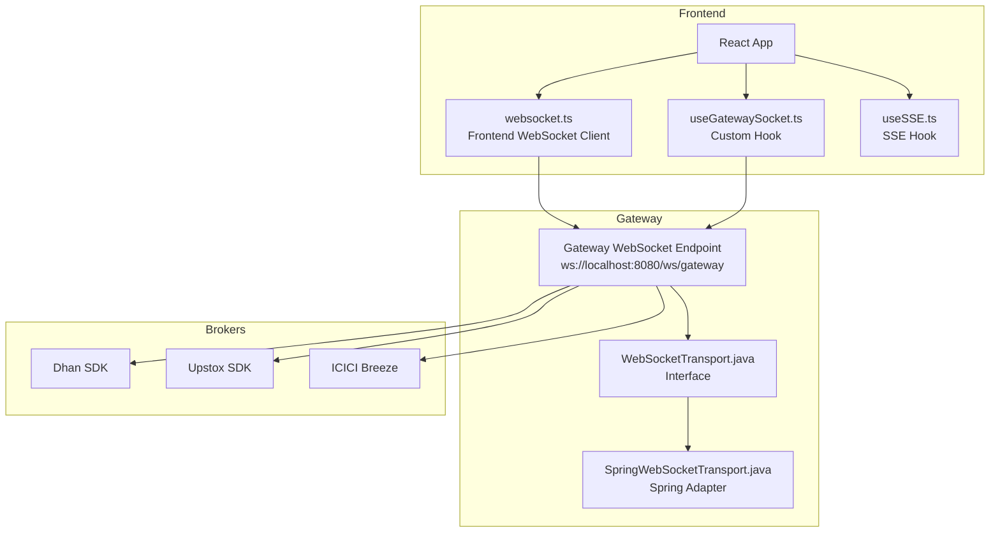
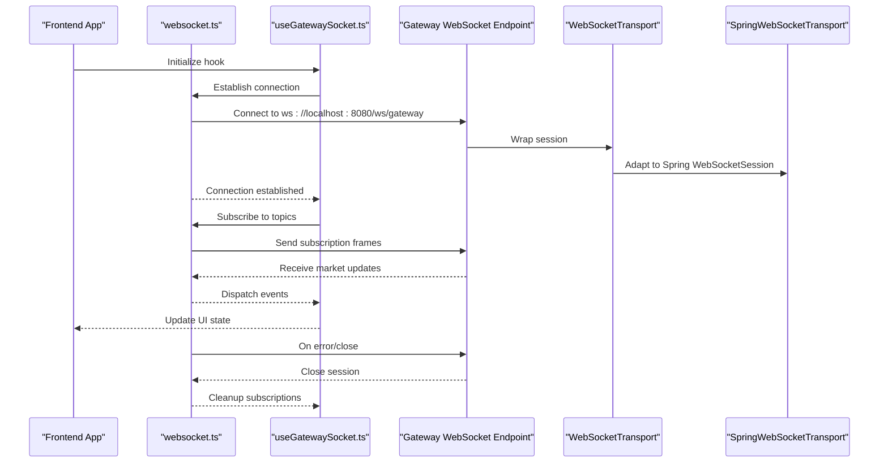
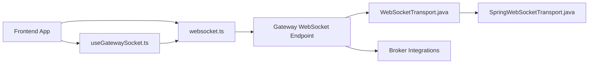

# Client Integration

<cite>
**Referenced Files in This Document**
- [websocket.ts](file://archive/frontend/src/api/websocket.ts)
- [useGatewaySocket.ts](file://frontend/src/hooks/useGatewaySocket.ts)
- [client.ts](file://archive/frontend/src/api/client.ts)
- [sse.ts](file://archive/frontend/src/api/sse.ts)
- [useSSE.ts](file://archive/frontend/src/hooks/useSSE.ts)
- [WebSocketTransport.java](file://gateway/src/main/java/com/tradej/gateway/transport/WebSocketTransport.java)
- [SpringWebSocketTransport.java](file://gateway/src/main/java/com/tradej/gateway/transport/SpringWebSocketTransport.java)
- [FRONTEND_BACKEND_CONNECTION_TEST.md](file://FRONTEND_BACKEND_CONNECTION_TEST.md)
- [BreezeWebSocketMultiplexer.java](file://broker/icici/src/main/java/com/tradej/broker/icici/websocket/BreezeWebSocketMultiplexer.java)
- [TokenState.java](file://broker/api/src/main/java/com/tradej/broker/api/auth/TokenState.java)
</cite>

## Table of Contents
1. [Introduction](#introduction)
2. [Project Structure](#project-structure)
3. [Core Components](#core-components)
4. [Architecture Overview](#architecture-overview)
5. [Detailed Component Analysis](#detailed-component-analysis)
6. [Dependency Analysis](#dependency-analysis)
7. [Performance Considerations](#performance-considerations)
8. [Troubleshooting Guide](#troubleshooting-guide)
9. [Conclusion](#conclusion)
10. [Appendices](#appendices)

## Introduction
This document provides comprehensive WebSocket client integration guidance for Trade-J, covering both frontend React applications and backend services. It explains the frontend websocket.ts implementation, connection establishment, event handling, the useGatewaySocket hook, subscription management, and error handling. It also documents backend WebSocketTransport implementations and server-side integration patterns, authentication mechanisms, connection parameters, configuration options, complete integration examples, best practices for error recovery, and performance optimization guidelines. Common integration challenges and troubleshooting approaches are addressed to help teams deploy reliable real-time feeds.

## Project Structure
Trade-J integrates WebSocket connectivity across three primary layers:
- Frontend React application with a dedicated WebSocket client and a custom hook for gateway connections.
- Gateway server exposing a WebSocket endpoint with a transport abstraction decoupled from Spring’s WebSocket implementation.
- Broker integrations that maintain separate WebSocket connections per product stream.

**Diagram sources**
- [websocket.ts](file://archive/frontend/src/api/websocket.ts)
- [useGatewaySocket.ts](file://frontend/src/hooks/useGatewaySocket.ts)
- [WebSocketTransport.java](file://gateway/src/main/java/com/tradej/gateway/transport/WebSocketTransport.java)
- [SpringWebSocketTransport.java](file://gateway/src/main/java/com/tradej/gateway/transport/SpringWebSocketTransport.java)
- [FRONTEND_BACKEND_CONNECTION_TEST.md](file://FRONTEND_BACKEND_CONNECTION_TEST.md)

**Section sources**
- [FRONTEND_BACKEND_CONNECTION_TEST.md](file://FRONTEND_BACKEND_CONNECTION_TEST.md)
- [websocket.ts](file://archive/frontend/src/api/websocket.ts)
- [useGatewaySocket.ts](file://frontend/src/hooks/useGatewaySocket.ts)

## Core Components
- Frontend WebSocket client: Implements connection lifecycle, message framing, subscription management, and error handling.
- useGatewaySocket hook: Encapsulates connection establishment, subscription orchestration, and cleanup for React components.
- Gateway WebSocketTransport: Transport-agnostic interface for sending binary frames, checking connection state, and closing sessions.
- SpringWebSocketTransport: Spring adapter implementing the transport interface around WebSocketSession.
- Broker integrations: Maintain separate WebSocket connections for quotes and order feeds, with token management and reconnect logic.

**Section sources**
- [websocket.ts](file://archive/frontend/src/api/websocket.ts)
- [useGatewaySocket.ts](file://frontend/src/hooks/useGatewaySocket.ts)
- [WebSocketTransport.java](file://gateway/src/main/java/com/tradej/gateway/transport/WebSocketTransport.java)
- [SpringWebSocketTransport.java](file://gateway/src/main/java/com/tradej/gateway/transport/SpringWebSocketTransport.java)
- [BreezeWebSocketMultiplexer.java](file://broker/icici/src/main/java/com/tradej/broker/icici/websocket/BreezeWebSocketMultiplexer.java)

## Architecture Overview
The frontend connects to the gateway via a WebSocket endpoint. The gateway routes messages to broker integrations and vice versa. The transport abstraction ensures the routing and codec logic remain independent of the underlying WebSocket framework.

**Diagram sources**
- [websocket.ts](file://archive/frontend/src/api/websocket.ts)
- [useGatewaySocket.ts](file://frontend/src/hooks/useGatewaySocket.ts)
- [WebSocketTransport.java](file://gateway/src/main/java/com/tradej/gateway/transport/WebSocketTransport.java)
- [SpringWebSocketTransport.java](file://gateway/src/main/java/com/tradej/gateway/transport/SpringWebSocketTransport.java)
- [FRONTEND_BACKEND_CONNECTION_TEST.md](file://FRONTEND_BACKEND_CONNECTION_TEST.md)

## Detailed Component Analysis

### Frontend WebSocket Client (websocket.ts)
Responsibilities:
- Establish and maintain a WebSocket connection to the gateway endpoint.
- Manage subscription lifecycle for topics such as market ticks, candles, order updates, and position updates.
- Parse incoming binary frames and route events to registered handlers.
- Implement robust error handling and reconnection strategies.
- Provide a clean API for components to subscribe/unsubscribe and handle errors.

Implementation highlights:
- Connection establishment: Uses the gateway WebSocket endpoint and handles opening handshake.
- Message framing: Expects a binary protocol with a 9-byte header plus JSON payload.
- Subscription management: Tracks active subscriptions and sends subscription commands to the server.
- Event handling: Routes incoming messages to topic-specific callbacks.
- Error handling: Distinguishes between network errors, protocol errors, and application-level errors; triggers reconnection or fallback actions.

Integration example (paths):
- Connection initialization and subscription: [websocket.ts](file://archive/frontend/src/api/websocket.ts)
- Topic subscription patterns: [websocket.ts](file://archive/frontend/src/api/websocket.ts)
- Error handling and reconnection logic: [websocket.ts](file://archive/frontend/src/api/websocket.ts)

Best practices:
- Always unsubscribe on component unmount to prevent leaks.
- Batch subscription requests to reduce overhead.
- Validate incoming data against expected schemas before dispatching to UI.

**Section sources**
- [websocket.ts](file://archive/frontend/src/api/websocket.ts)
- [FRONTEND_BACKEND_CONNECTION_TEST.md](file://FRONTEND_BACKEND_CONNECTION_TEST.md)

### useGatewaySocket Hook
Responsibilities:
- Encapsulate connection state, subscriptions, and event handling in a reusable React hook.
- Provide a simple interface for components to subscribe to topics and receive updates.
- Manage cleanup and reconnection logic internally.

Usage patterns:
- Initialize the hook in a component and pass topic lists to subscribe.
- Register callbacks for specific topics to update local state.
- Unsubscribe automatically when the component unmounts.

Integration example (paths):
- Hook definition and subscription orchestration: [useGatewaySocket.ts](file://frontend/src/hooks/useGatewaySocket.ts)
- Example component usage: [useGatewaySocket.ts](file://frontend/src/hooks/useGatewaySocket.ts)

Error handling:
- Defer to the underlying WebSocket client for low-level error management.
- Surface meaningful errors to UI layers for user feedback.

**Section sources**
- [useGatewaySocket.ts](file://frontend/src/hooks/useGatewaySocket.ts)

### Backend WebSocketTransport Implementations
Transport abstraction:
- WebSocketTransport defines a minimal contract for sending binary frames, checking connection state, retrieving session identifiers, and closing connections.

Spring adapter:
- SpringWebSocketTransport adapts Spring’s WebSocketSession to the transport interface, ensuring thread-safe message sending and proper session lifecycle management.

Gateway integration:
- The gateway exposes a WebSocket endpoint that accepts binary frames and routes them to appropriate topics.
- The transport abstraction enables pluggable adapters and simplifies testing.

Integration example (paths):
- Transport interface: [WebSocketTransport.java](file://gateway/src/main/java/com/tradej/gateway/transport/WebSocketTransport.java)
- Spring adapter: [SpringWebSocketTransport.java](file://gateway/src/main/java/com/tradej/gateway/transport/SpringWebSocketTransport.java)

**Section sources**
- [WebSocketTransport.java](file://gateway/src/main/java/com/tradej/gateway/transport/WebSocketTransport.java)
- [SpringWebSocketTransport.java](file://gateway/src/main/java/com/tradej/gateway/transport/SpringWebSocketTransport.java)

### Broker WebSocket Integrations
Broker integrations maintain separate WebSocket connections for different streams:
- ICICI Breeze multiplexer opens distinct sockets for quotes and order feeds, using token provider session credentials.
- Token management ensures valid sessions before connecting and coordinates reconnect listeners.

Integration example (paths):
- ICICI Breeze multiplexer: [BreezeWebSocketMultiplexer.java](file://broker/icici/src/main/java/com/tradej/broker/icici/websocket/BreezeWebSocketMultiplexer.java)
- Token state management: [TokenState.java](file://broker/api/src/main/java/com/tradej/broker/api/auth/TokenState.java)

**Section sources**
- [BreezeWebSocketMultiplexer.java](file://broker/icici/src/main/java/com/tradej/broker/icici/websocket/BreezeWebSocketMultiplexer.java)
- [TokenState.java](file://broker/api/src/main/java/com/tradej/broker/api/auth/TokenState.java)

### SSE Alternative (useSSE Hook)
While WebSocket is the primary real-time transport, SSE can complement REST APIs for event streaming:
- useSSE hook manages an SSE connection lifecycle, allowing components to subscribe to server-sent events.
- Provides a pattern for handling server-initiated updates alongside WebSocket streams.

Integration example (paths):
- SSE client and hook: [sse.ts](file://archive/frontend/src/api/sse.ts), [useSSE.ts](file://archive/frontend/src/hooks/useSSE.ts)

**Section sources**
- [sse.ts](file://archive/frontend/src/api/sse.ts)
- [useSSE.ts](file://archive/frontend/src/hooks/useSSE.ts)

## Dependency Analysis
The frontend depends on the gateway for real-time data, while the gateway depends on broker integrations for market data and order updates. The transport abstraction reduces coupling between the gateway and the WebSocket framework.

**Diagram sources**
- [websocket.ts](file://archive/frontend/src/api/websocket.ts)
- [useGatewaySocket.ts](file://frontend/src/hooks/useGatewaySocket.ts)
- [WebSocketTransport.java](file://gateway/src/main/java/com/tradej/gateway/transport/WebSocketTransport.java)
- [SpringWebSocketTransport.java](file://gateway/src/main/java/com/tradej/gateway/transport/SpringWebSocketTransport.java)

**Section sources**
- [FRONTEND_BACKEND_CONNECTION_TEST.md](file://FRONTEND_BACKEND_CONNECTION_TEST.md)

## Performance Considerations
- Connection pooling and reuse: Maintain a single WebSocket connection per user session to minimize overhead.
- Subscription batching: Group topic subscriptions to reduce handshake traffic.
- Backpressure handling: Throttle UI updates when receiving high-frequency ticks to avoid rendering bottlenecks.
- Efficient parsing: Parse binary frames off the main thread when possible to keep UI responsive.
- Memory management: Unsubscribe inactive topics and clear event handlers on component unmount.
- Retry strategy: Implement exponential backoff for reconnection attempts with jitter to avoid thundering herd.

[No sources needed since this section provides general guidance]

## Troubleshooting Guide
Common issues and resolutions:
- Connection failures:
  - Verify the gateway endpoint URL and network accessibility.
  - Check firewall and proxy configurations blocking WebSocket upgrades.
- Authentication errors:
  - Confirm token validity and refresh logic before connecting.
  - Ensure session credentials are present and not expired.
- Subscription errors:
  - Validate topic names and ensure the gateway supports the requested topics.
  - Confirm subscription messages match the expected binary frame format.
- Performance degradation:
  - Reduce subscription count or frequency of updates.
  - Debounce UI updates and avoid unnecessary re-renders.
- Broker connectivity:
  - For broker-specific sockets, confirm separate connections for quotes and order feeds.
  - Monitor token provider lifecycles and reconnect listeners.

Diagnostic steps:
- Enable verbose logging for WebSocket frames and subscription messages.
- Capture and inspect binary frames to verify header and payload structure.
- Monitor gateway logs for routing errors or broker integration failures.

**Section sources**
- [FRONTEND_BACKEND_CONNECTION_TEST.md](file://FRONTEND_BACKEND_CONNECTION_TEST.md)
- [websocket.ts](file://archive/frontend/src/api/websocket.ts)
- [useGatewaySocket.ts](file://frontend/src/hooks/useGatewaySocket.ts)
- [BreezeWebSocketMultiplexer.java](file://broker/icici/src/main/java/com/tradej/broker/icici/websocket/BreezeWebSocketMultiplexer.java)
- [TokenState.java](file://broker/api/src/main/java/com/tradej/broker/api/auth/TokenState.java)

## Conclusion
Trade-J provides a robust, transport-abstraction-backed WebSocket integration suitable for both frontend React applications and backend services. The frontend websocket.ts client and useGatewaySocket hook offer a clean, reusable pattern for establishing connections, managing subscriptions, and handling errors. The backend’s WebSocketTransport and SpringWebSocketTransport implementations decouple routing logic from the WebSocket framework, enabling scalable and maintainable real-time data delivery. By following the integration examples, best practices, and troubleshooting approaches outlined here, teams can deploy reliable, high-performance WebSocket clients across the Trade-J ecosystem.

[No sources needed since this section summarizes without analyzing specific files]

## Appendices

### Integration Examples

Frontend integration (paths):
- Initialize WebSocket client and subscribe to topics: [websocket.ts](file://archive/frontend/src/api/websocket.ts)
- Use the hook in a component: [useGatewaySocket.ts](file://frontend/src/hooks/useGatewaySocket.ts)

Backend integration (paths):
- Define transport interface: [WebSocketTransport.java](file://gateway/src/main/java/com/tradej/gateway/transport/WebSocketTransport.java)
- Implement Spring adapter: [SpringWebSocketTransport.java](file://gateway/src/main/java/com/tradej/gateway/transport/SpringWebSocketTransport.java)

Broker integration (paths):
- Manage separate sockets for quotes and orders: [BreezeWebSocketMultiplexer.java](file://broker/icici/src/main/java/com/tradej/broker/icici/websocket/BreezeWebSocketMultiplexer.java)
- Token lifecycle and refresh logic: [TokenState.java](file://broker/api/src/main/java/com/tradej/broker/api/auth/TokenState.java)

**Section sources**
- [websocket.ts](file://archive/frontend/src/api/websocket.ts)
- [useGatewaySocket.ts](file://frontend/src/hooks/useGatewaySocket.ts)
- [WebSocketTransport.java](file://gateway/src/main/java/com/tradej/gateway/transport/WebSocketTransport.java)
- [SpringWebSocketTransport.java](file://gateway/src/main/java/com/tradej/gateway/transport/SpringWebSocketTransport.java)
- [BreezeWebSocketMultiplexer.java](file://broker/icici/src/main/java/com/tradej/broker/icici/websocket/BreezeWebSocketMultiplexer.java)
- [TokenState.java](file://broker/api/src/main/java/com/tradej/broker/api/auth/TokenState.java)