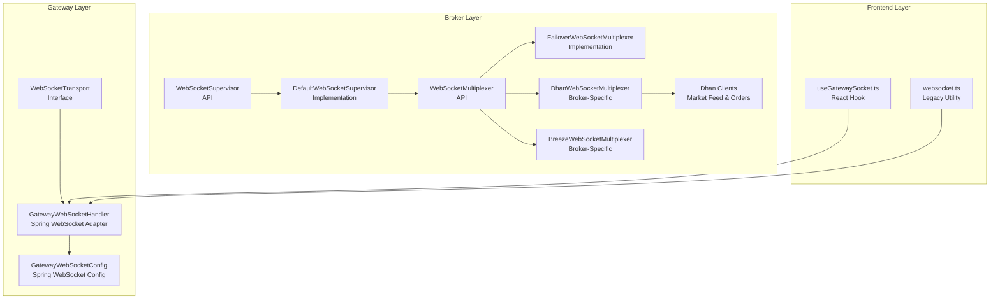
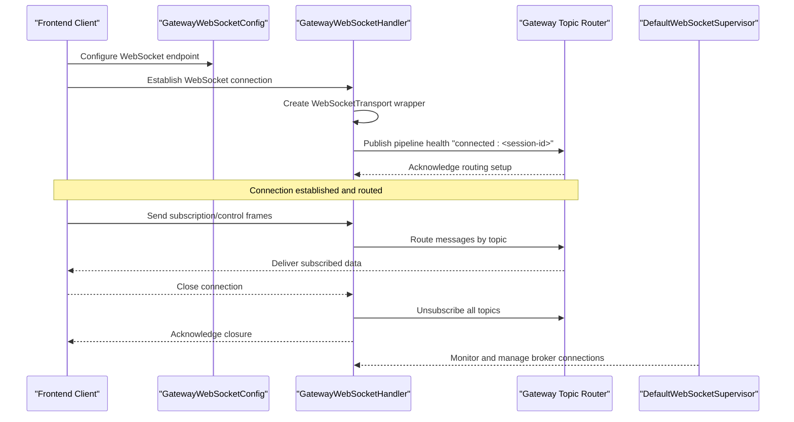
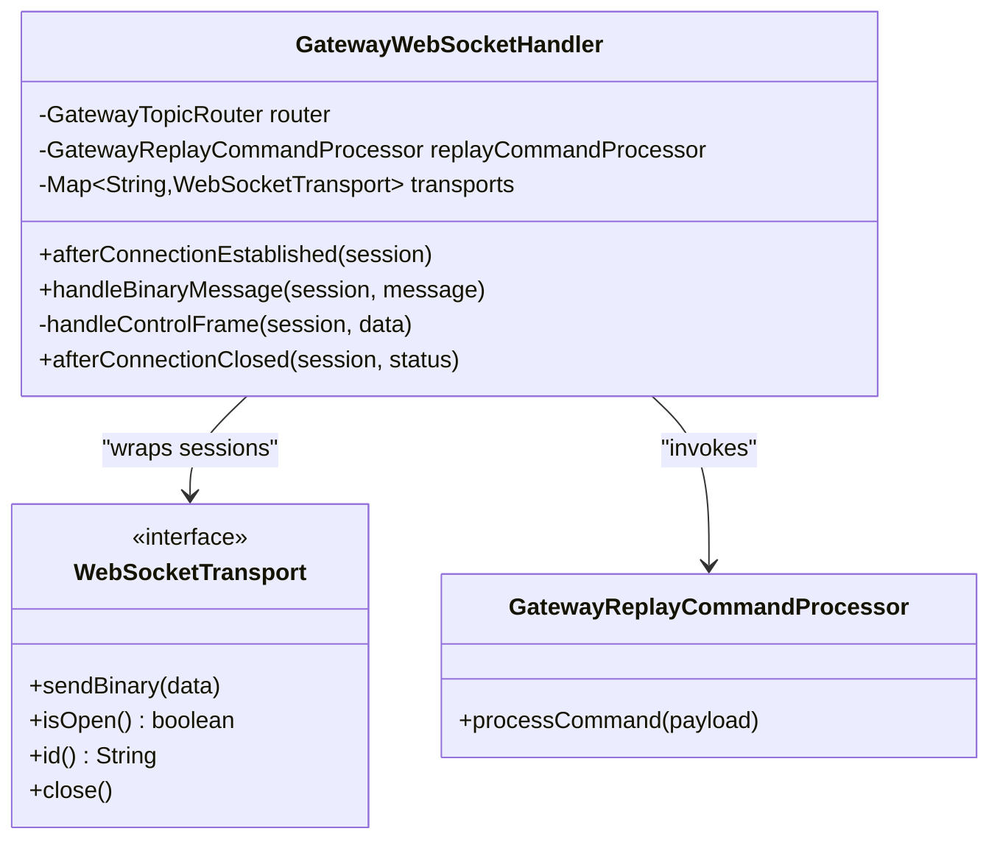
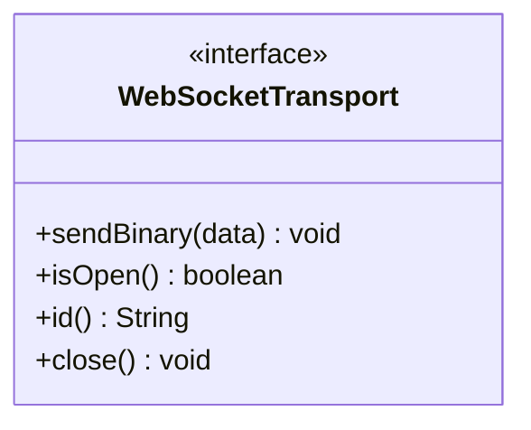
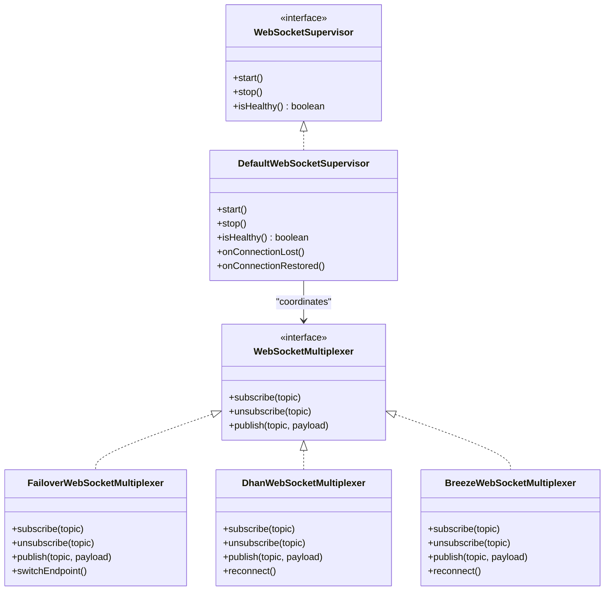
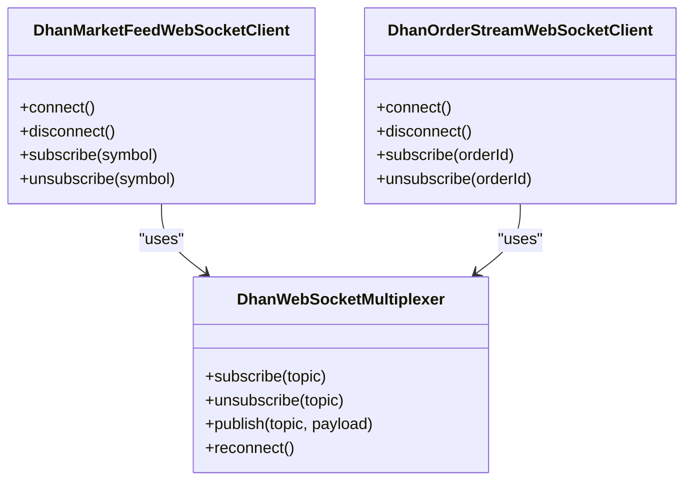
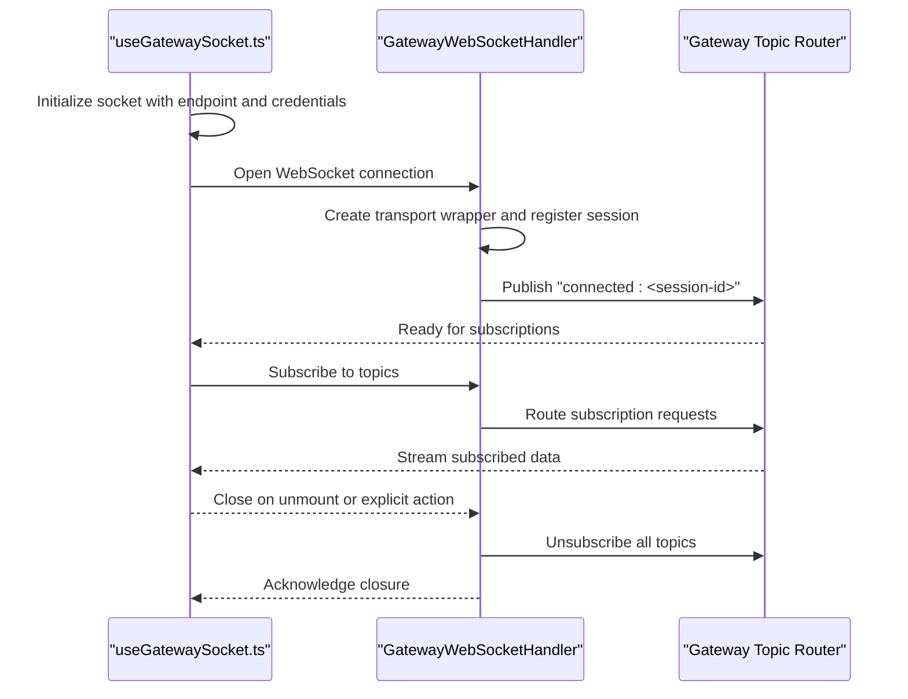
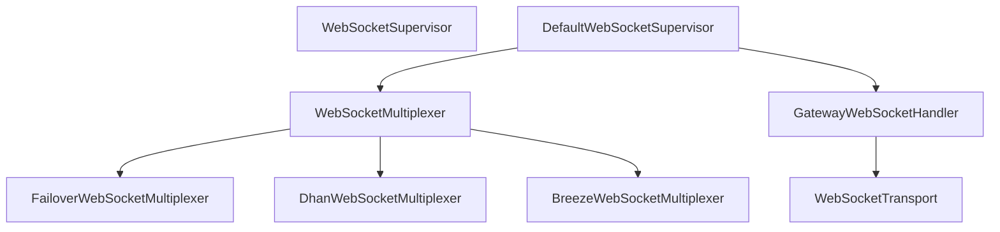

# Connection Management

<cite>
**Referenced Files in This Document**
- [WebSocketTransport.java](file://gateway/src/main/java/com/tradej/gateway/transport/WebSocketTransport.java)
- [GatewayWebSocketHandler.java](file://gateway/src/main/java/com/tradej/gateway/websocket/GatewayWebSocketHandler.java)
- [GatewayReplayCommandProcessor.java](file://gateway/src/main/java/com/tradej/gateway/websocket/GatewayReplayCommandProcessor.java)
- [GatewayWebSocketConfig.java](file://app/src/main/java/com/tradej/app/config/GatewayWebSocketConfig.java)
- [GatewayWebSocketLifecycleTest.java](file://app/src/test/java/com/tradej/app/integration/GatewayWebSocketLifecycleTest.java)
- [WebSocketSupervisor.java](file://broker/api/src/main/java/com/tradej/broker/api/websocket/WebSocketSupervisor.java)
- [DefaultWebSocketSupervisor.java](file://broker/core/src/main/java/com/tradej/broker/core/websocket/DefaultWebSocketSupervisor.java)
- [WebSocketMultiplexer.java](file://broker/api/src/main/java/com/tradej/broker/api/port/WebSocketMultiplexer.java)
- [FailoverWebSocketMultiplexer.java](file://broker/core/src/main/java/com/tradej/broker/core/routing/FailoverWebSocketMultiplexer.java)
- [DhanMarketFeedWebSocketClient.java](file://broker/dhan/src/main/java/com/tradej/broker/dhan/websocket/DhanMarketFeedWebSocketClient.java)
- [DhanOrderStreamWebSocketClient.java](file://broker/dhan/src/main/java/com/tradej/broker/dhan/websocket/DhanOrderStreamWebSocketClient.java)
- [DhanWebSocketMultiplexer.java](file://broker/dhan/src/main/java/com/tradej/broker/dhan/websocket/DhanWebSocketMultiplexer.java)
- [BreezeWebSocketMultiplexer.java](file://broker/icici/src/main/java/com/tradej/broker/icici/websocket/BreezeWebSocketMultiplexer.java)
- [useGatewaySocket.ts](file://frontend/src/hooks/useGatewaySocket.ts)
- [websocket.ts](file://archive/frontend/src/api/websocket.ts)
</cite>

## Table of Contents
1. [Introduction](#introduction)
2. [Project Structure](#project-structure)
3. [Core Components](#core-components)
4. [Architecture Overview](#architecture-overview)
5. [Detailed Component Analysis](#detailed-component-analysis)
6. [Dependency Analysis](#dependency-analysis)
7. [Performance Considerations](#performance-considerations)
8. [Troubleshooting Guide](#troubleshooting-guide)
9. [Conclusion](#conclusion)
10. [Appendices](#appendices)

## Introduction
This document provides comprehensive WebSocket connection management documentation for Trade-J. It covers the connection lifecycle from initialization through shutdown, including connection establishment, authentication, and session management. It documents the WebSocketTransport interface and GatewayWebSocketHandler implementation, explains connection pooling, session tracking, and connection state management, and details reconnection logic, heartbeat mechanisms, and graceful disconnection handling. Error handling strategies, connection timeouts, and recovery procedures are included, along with practical examples of connection setup in both backend and frontend contexts.

## Project Structure
Trade-J implements WebSocket connectivity across three primary layers:
- Gateway Layer: Provides transport abstraction and server-side WebSocket handling.
- Broker Layer: Implements broker-specific clients, supervisors, and multiplexers for connection management and failover.
- Frontend Layer: Offers client-side hooks and utilities for establishing and managing WebSocket connections.

**Diagram sources**
- [WebSocketTransport.java:1-20](file://gateway/src/main/java/com/tradej/gateway/transport/WebSocketTransport.java#L1-L20)
- [GatewayWebSocketHandler.java:32-110](file://gateway/src/main/java/com/tradej/gateway/websocket/GatewayWebSocketHandler.java#L32-L110)
- [GatewayWebSocketConfig.java](file://app/src/main/java/com/tradej/app/config/GatewayWebSocketConfig.java)
- [WebSocketSupervisor.java](file://broker/api/src/main/java/com/tradej/broker/api/websocket/WebSocketSupervisor.java)
- [DefaultWebSocketSupervisor.java](file://broker/core/src/main/java/com/tradej/broker/core/websocket/DefaultWebSocketSupervisor.java)
- [WebSocketMultiplexer.java](file://broker/api/src/main/java/com/tradej/broker/api/port/WebSocketMultiplexer.java)
- [FailoverWebSocketMultiplexer.java](file://broker/core/src/main/java/com/tradej/broker/core/routing/FailoverWebSocketMultiplexer.java)
- [DhanWebSocketMultiplexer.java](file://broker/dhan/src/main/java/com/tradej/broker/dhan/websocket/DhanWebSocketMultiplexer.java)
- [BreezeWebSocketMultiplexer.java](file://broker/icici/src/main/java/com/tradej/broker/icici/websocket/BreezeWebSocketMultiplexer.java)
- [useGatewaySocket.ts](file://frontend/src/hooks/useGatewaySocket.ts)
- [websocket.ts](file://archive/frontend/src/api/websocket.ts)

**Section sources**
- [WebSocketTransport.java:1-20](file://gateway/src/main/java/com/tradej/gateway/transport/WebSocketTransport.java#L1-L20)
- [GatewayWebSocketHandler.java:32-110](file://gateway/src/main/java/com/tradej/gateway/websocket/GatewayWebSocketHandler.java#L32-L110)
- [GatewayWebSocketConfig.java](file://app/src/main/java/com/tradej/app/config/GatewayWebSocketConfig.java)
- [WebSocketSupervisor.java](file://broker/api/src/main/java/com/tradej/broker/api/websocket/WebSocketSupervisor.java)
- [DefaultWebSocketSupervisor.java](file://broker/core/src/main/java/com/tradej/broker/core/websocket/DefaultWebSocketSupervisor.java)
- [WebSocketMultiplexer.java](file://broker/api/src/main/java/com/tradej/broker/api/port/WebSocketMultiplexer.java)
- [FailoverWebSocketMultiplexer.java](file://broker/core/src/main/java/com/tradej/broker/core/routing/FailoverWebSocketMultiplexer.java)
- [DhanWebSocketMultiplexer.java](file://broker/dhan/src/main/java/com/tradej/broker/dhan/websocket/DhanWebSocketMultiplexer.java)
- [BreezeWebSocketMultiplexer.java](file://broker/icici/src/main/java/com/tradej/broker/icici/websocket/BreezeWebSocketMultiplexer.java)
- [useGatewaySocket.ts](file://frontend/src/hooks/useGatewaySocket.ts)
- [websocket.ts](file://archive/frontend/src/api/websocket.ts)

## Core Components
This section documents the foundational WebSocket components and their roles in connection lifecycle management.

- WebSocketTransport interface
  - Purpose: Transport-agnostic abstraction for a WebSocket session.
  - Responsibilities: Sending binary frames, checking connection state, retrieving session ID, and closing connections.
  - Implementation pattern: Broker clients wrap transport-specific sessions into this interface for gateway routing and codec logic decoupling.

- GatewayWebSocketHandler
  - Purpose: Spring WebSocket handler bridging gateway routing and codec logic with transport sessions.
  - Lifecycle events:
    - Connection established: Creates a transport wrapper, stores it by session ID, publishes pipeline health notification.
    - Binary message handling: Routes subscription requests, handles control frames, and forwards data to router.
    - Control frames: Parses gateway frames, processes replay commands via replay processor.
    - Connection closed: Removes transport, unsubscribes all topics, logs disconnect.
  - Session tracking: Maintains a map keyed by session ID for active transports.

- GatewayReplayCommandProcessor
  - Purpose: Processes replay control commands received from gateway control frames.
  - Integration: Called by GatewayWebSocketHandler during control frame handling.

- WebSocketSupervisor (API) and DefaultWebSocketSupervisor (Implementation)
  - Purpose: Centralized supervisor for managing broker WebSocket connections, including lifecycle, health monitoring, and failover.
  - Responsibilities: Starting/stopping connections, monitoring health, coordinating multiplexers, and applying reconnection policies.

- WebSocketMultiplexer (API) and Multiplexer Implementations
  - Purpose: Abstraction for multiplexing multiple logical streams over a single physical connection.
  - Implementations:
    - FailoverWebSocketMultiplexer: Provides failover routing across multiple endpoints.
    - DhanWebSocketMultiplexer: Broker-specific multiplexer for Dhan.
    - BreezeWebSocketMultiplexer: Broker-specific multiplexer for ICICI.
  - Role: Encapsulate connection pooling, subscription management, and reconnection logic.

- Dhan WebSocket Clients
  - DhanMarketFeedWebSocketClient: Handles market feed data streams.
  - DhanOrderStreamWebSocketClient: Manages order stream updates.
  - Integration: Work with DhanWebSocketMultiplexer for connection management and subscription routing.

**Section sources**
- [WebSocketTransport.java:1-20](file://gateway/src/main/java/com/tradej/gateway/transport/WebSocketTransport.java#L1-L20)
- [GatewayWebSocketHandler.java:32-110](file://gateway/src/main/java/com/tradej/gateway/websocket/GatewayWebSocketHandler.java#L32-L110)
- [GatewayReplayCommandProcessor.java](file://gateway/src/main/java/com/tradej/gateway/websocket/GatewayReplayCommandProcessor.java)
- [WebSocketSupervisor.java](file://broker/api/src/main/java/com/tradej/broker/api/websocket/WebSocketSupervisor.java)
- [DefaultWebSocketSupervisor.java](file://broker/core/src/main/java/com/tradej/broker/core/websocket/DefaultWebSocketSupervisor.java)
- [WebSocketMultiplexer.java](file://broker/api/src/main/java/com/tradej/broker/api/port/WebSocketMultiplexer.java)
- [FailoverWebSocketMultiplexer.java](file://broker/core/src/main/java/com/tradej/broker/core/routing/FailoverWebSocketMultiplexer.java)
- [DhanMarketFeedWebSocketClient.java](file://broker/dhan/src/main/java/com/tradej/broker/dhan/websocket/DhanMarketFeedWebSocketClient.java)
- [DhanOrderStreamWebSocketClient.java](file://broker/dhan/src/main/java/com/tradej/broker/dhan/websocket/DhanOrderStreamWebSocketClient.java)
- [DhanWebSocketMultiplexer.java](file://broker/dhan/src/main/java/com/tradej/broker/dhan/websocket/DhanWebSocketMultiplexer.java)

## Architecture Overview
The WebSocket connection management architecture spans gateway, broker, and frontend layers. The gateway exposes a Spring WebSocket endpoint handled by GatewayWebSocketHandler, which uses WebSocketTransport to decouple routing and codec logic from transport specifics. Broker clients implement connection supervision, multiplexing, and failover strategies. Frontend provides React hooks and legacy utilities for client-side connection management.

**Diagram sources**
- [GatewayWebSocketConfig.java](file://app/src/main/java/com/tradej/app/config/GatewayWebSocketConfig.java)
- [GatewayWebSocketHandler.java:32-110](file://gateway/src/main/java/com/tradej/gateway/websocket/GatewayWebSocketHandler.java#L32-L110)
- [WebSocketSupervisor.java](file://broker/api/src/main/java/com/tradej/broker/api/websocket/WebSocketSupervisor.java)
- [DefaultWebSocketSupervisor.java](file://broker/core/src/main/java/com/tradej/broker/core/websocket/DefaultWebSocketSupervisor.java)

## Detailed Component Analysis

### GatewayWebSocketHandler Analysis
GatewayWebSocketHandler integrates Spring WebSocket with Trade-J's routing and codec systems. It manages session lifecycle, binary message routing, and control frame processing.

**Diagram sources**
- [GatewayWebSocketHandler.java:32-110](file://gateway/src/main/java/com/tradej/gateway/websocket/GatewayWebSocketHandler.java#L32-L110)
- [WebSocketTransport.java:1-20](file://gateway/src/main/java/com/tradej/gateway/transport/WebSocketTransport.java#L1-L20)
- [GatewayReplayCommandProcessor.java](file://gateway/src/main/java/com/tradej/gateway/websocket/GatewayReplayCommandProcessor.java)

Key behaviors:
- Session establishment: Wraps Spring WebSocketSession into WebSocketTransport, stores by session ID, and publishes pipeline health notification.
- Message routing: Extracts binary payload, handles subscription bytes, and forwards data to router; control frames are decoded and processed for replay commands.
- Graceful closure: Removes transport from registry, unsubscribes all topics, and logs disconnect.

**Section sources**
- [GatewayWebSocketHandler.java:32-110](file://gateway/src/main/java/com/tradej/gateway/websocket/GatewayWebSocketHandler.java#L32-L110)

### WebSocketTransport Interface Analysis
WebSocketTransport defines a minimal, transport-agnostic contract for WebSocket sessions, enabling gateway logic to remain independent of specific WebSocket libraries.

**Diagram sources**
- [WebSocketTransport.java:1-20](file://gateway/src/main/java/com/tradej/gateway/transport/WebSocketTransport.java#L1-L20)

Responsibilities:
- Sending binary frames to the remote endpoint.
- Checking connection state.
- Retrieving a unique session identifier.
- Closing the connection gracefully.

**Section sources**
- [WebSocketTransport.java:1-20](file://gateway/src/main/java/com/tradej/gateway/transport/WebSocketTransport.java#L1-L20)

### Broker WebSocket Supervisor and Multiplexer Analysis
Broker components implement connection supervision, multiplexing, and failover to ensure resilient market data and order stream delivery.

**Diagram sources**
- [WebSocketSupervisor.java](file://broker/api/src/main/java/com/tradej/broker/api/websocket/WebSocketSupervisor.java)
- [DefaultWebSocketSupervisor.java](file://broker/core/src/main/java/com/tradej/broker/core/websocket/DefaultWebSocketSupervisor.java)
- [WebSocketMultiplexer.java](file://broker/api/src/main/java/com/tradej/broker/api/port/WebSocketMultiplexer.java)
- [FailoverWebSocketMultiplexer.java](file://broker/core/src/main/java/com/tradej/broker/core/routing/FailoverWebSocketMultiplexer.java)
- [DhanWebSocketMultiplexer.java](file://broker/dhan/src/main/java/com/tradej/broker/dhan/websocket/DhanWebSocketMultiplexer.java)
- [BreezeWebSocketMultiplexer.java](file://broker/icici/src/main/java/com/tradej/broker/icici/websocket/BreezeWebSocketMultiplexer.java)

Key responsibilities:
- DefaultWebSocketSupervisor: Starts/stops connections, monitors health, triggers reconnection on failure, and coordinates multiplexer operations.
- FailoverWebSocketMultiplexer: Distributes subscriptions across endpoints and switches to alternate endpoints on failure.
- DhanWebSocketMultiplexer and BreezeWebSocketMultiplexer: Broker-specific implementations encapsulating connection pooling, subscription management, and reconnection logic.

**Section sources**
- [WebSocketSupervisor.java](file://broker/api/src/main/java/com/tradej/broker/api/websocket/WebSocketSupervisor.java)
- [DefaultWebSocketSupervisor.java](file://broker/core/src/main/java/com/tradej/broker/core/websocket/DefaultWebSocketSupervisor.java)
- [WebSocketMultiplexer.java](file://broker/api/src/main/java/com/tradej/broker/api/port/WebSocketMultiplexer.java)
- [FailoverWebSocketMultiplexer.java](file://broker/core/src/main/java/com/tradej/broker/core/routing/FailoverWebSocketMultiplexer.java)
- [DhanWebSocketMultiplexer.java](file://broker/dhan/src/main/java/com/tradej/broker/dhan/websocket/DhanWebSocketMultiplexer.java)
- [BreezeWebSocketMultiplexer.java](file://broker/icici/src/main/java/com/tradej/broker/icici/websocket/BreezeWebSocketMultiplexer.java)

### Dhan WebSocket Clients Analysis
Dhan clients provide specialized WebSocket connectivity for market feed and order streams, leveraging broker multiplexers for robust connection management.

**Diagram sources**
- [DhanMarketFeedWebSocketClient.java](file://broker/dhan/src/main/java/com/tradej/broker/dhan/websocket/DhanMarketFeedWebSocketClient.java)
- [DhanOrderStreamWebSocketClient.java](file://broker/dhan/src/main/java/com/tradej/broker/dhan/websocket/DhanOrderStreamWebSocketClient.java)
- [DhanWebSocketMultiplexer.java](file://broker/dhan/src/main/java/com/tradej/broker/dhan/websocket/DhanWebSocketMultiplexer.java)

Operational characteristics:
- Market feed client: Connects to market data endpoints, subscribes to symbols, and handles streaming quotes and depth.
- Order stream client: Subscribes to order-specific topics, receives updates, and coordinates with multiplexer for reconnection and failover.

**Section sources**
- [DhanMarketFeedWebSocketClient.java](file://broker/dhan/src/main/java/com/tradej/broker/dhan/websocket/DhanMarketFeedWebSocketClient.java)
- [DhanOrderStreamWebSocketClient.java](file://broker/dhan/src/main/java/com/tradej/broker/dhan/websocket/DhanOrderStreamWebSocketClient.java)
- [DhanWebSocketMultiplexer.java](file://broker/dhan/src/main/java/com/tradej/broker/dhan/websocket/DhanWebSocketMultiplexer.java)

### Frontend Connection Setup Analysis
Frontend provides two approaches for WebSocket connection management: a modern React hook and a legacy utility.

**Diagram sources**
- [useGatewaySocket.ts](file://frontend/src/hooks/useGatewaySocket.ts)
- [GatewayWebSocketHandler.java:32-110](file://gateway/src/main/java/com/tradej/gateway/websocket/GatewayWebSocketHandler.java#L32-L110)

Legacy utility:
- websocket.ts provides a basic WebSocket client for older integrations, complementing the modern hook-based approach.

**Section sources**
- [useGatewaySocket.ts](file://frontend/src/hooks/useGatewaySocket.ts)
- [websocket.ts](file://archive/frontend/src/api/websocket.ts)

## Dependency Analysis
The WebSocket subsystem exhibits layered dependencies with clear separation of concerns:
- Gateway depends on transport abstraction for decoupling.
- Broker clients depend on supervisors and multiplexers for lifecycle and routing.
- Frontend depends on gateway handlers for connection orchestration.

**Diagram sources**
- [GatewayWebSocketHandler.java:32-110](file://gateway/src/main/java/com/tradej/gateway/websocket/GatewayWebSocketHandler.java#L32-L110)
- [WebSocketTransport.java:1-20](file://gateway/src/main/java/com/tradej/gateway/transport/WebSocketTransport.java#L1-L20)
- [WebSocketSupervisor.java](file://broker/api/src/main/java/com/tradej/broker/api/websocket/WebSocketSupervisor.java)
- [DefaultWebSocketSupervisor.java](file://broker/core/src/main/java/com/tradej/broker/core/websocket/DefaultWebSocketSupervisor.java)
- [WebSocketMultiplexer.java](file://broker/api/src/main/java/com/tradej/broker/api/port/WebSocketMultiplexer.java)
- [FailoverWebSocketMultiplexer.java](file://broker/core/src/main/java/com/tradej/broker/core/routing/FailoverWebSocketMultiplexer.java)
- [DhanWebSocketMultiplexer.java](file://broker/dhan/src/main/java/com/tradej/broker/dhan/websocket/DhanWebSocketMultiplexer.java)
- [BreezeWebSocketMultiplexer.java](file://broker/icici/src/main/java/com/tradej/broker/icici/websocket/BreezeWebSocketMultiplexer.java)

**Section sources**
- [GatewayWebSocketHandler.java:32-110](file://gateway/src/main/java/com/tradej/gateway/websocket/GatewayWebSocketHandler.java#L32-L110)
- [WebSocketTransport.java:1-20](file://gateway/src/main/java/com/tradej/gateway/transport/WebSocketTransport.java#L1-L20)
- [WebSocketSupervisor.java](file://broker/api/src/main/java/com/tradej/broker/api/websocket/WebSocketSupervisor.java)
- [DefaultWebSocketSupervisor.java](file://broker/core/src/main/java/com/tradej/broker/core/websocket/DefaultWebSocketSupervisor.java)
- [WebSocketMultiplexer.java](file://broker/api/src/main/java/com/tradej/broker/api/port/WebSocketMultiplexer.java)
- [FailoverWebSocketMultiplexer.java](file://broker/core/src/main/java/com/tradej/broker/core/routing/FailoverWebSocketMultiplexer.java)
- [DhanWebSocketMultiplexer.java](file://broker/dhan/src/main/java/com/tradej/broker/dhan/websocket/DhanWebSocketMultiplexer.java)
- [BreezeWebSocketMultiplexer.java](file://broker/icici/src/main/java/com/tradej/broker/icici/websocket/BreezeWebSocketMultiplexer.java)

## Performance Considerations
- Connection pooling: Multiplexers encapsulate pooling strategies to minimize overhead and improve throughput across multiple logical streams.
- Subscription batching: Grouping subscriptions reduces handshake overhead and improves responsiveness.
- Heartbeat and keep-alive: Implement periodic ping/pong to detect stale connections and maintain network liveness.
- Backpressure handling: Gateways and routers should apply backpressure to prevent overload during high-frequency market data bursts.
- Memory footprint: Efficient buffer management and timely cleanup of closed sessions reduce memory pressure.

[No sources needed since this section provides general guidance]

## Troubleshooting Guide
Common issues and recovery procedures:
- Connection failures:
  - Symptoms: Frequent disconnects, inability to subscribe, or control frame errors.
  - Actions: Verify endpoint URLs, credentials, and network connectivity; inspect supervisor health checks and multiplexer failover logs.
  - Recovery: Trigger manual reconnect via supervisor APIs; switch endpoints if failover multiplexer is configured.
- Authentication problems:
  - Symptoms: Immediate disconnect after connection or unauthorized access errors.
  - Actions: Validate token lifecycle and refresh mechanisms; confirm session validity.
  - Recovery: Re-authenticate and re-establish transport; update stored credentials.
- Timeout handling:
  - Symptoms: Slow response or timeouts during subscription.
  - Actions: Adjust timeout thresholds; implement retry with exponential backoff.
  - Recovery: Retry failed subscriptions; monitor heartbeat intervals.
- Graceful shutdown:
  - Actions: Unsubscribe all topics, close transport gracefully, and deregister from router.
  - Verification: Confirm all sessions removed from transport registry and router unsubscribe acknowledged.

**Section sources**
- [GatewayWebSocketHandler.java:32-110](file://gateway/src/main/java/com/tradej/gateway/websocket/GatewayWebSocketHandler.java#L32-L110)
- [DefaultWebSocketSupervisor.java](file://broker/core/src/main/java/com/tradej/broker/core/websocket/DefaultWebSocketSupervisor.java)
- [FailoverWebSocketMultiplexer.java](file://broker/core/src/main/java/com/tradej/broker/core/routing/FailoverWebSocketMultiplexer.java)

## Conclusion
Trade-J’s WebSocket connection management combines transport abstraction, centralized supervision, and broker-specific multiplexing to deliver resilient, scalable connectivity. The gateway layer ensures decoupling through WebSocketTransport and Spring integration, while broker components provide robust lifecycle management, failover, and reconnection strategies. Frontend integration offers modern hooks for seamless connection setup and teardown. Together, these components form a cohesive system supporting real-time market data and order stream delivery under diverse operational conditions.

[No sources needed since this section summarizes without analyzing specific files]

## Appendices

### Practical Examples

- Backend setup (Spring WebSocket configuration):
  - Configure WebSocket endpoint and handler registration using GatewayWebSocketConfig.
  - Ensure GatewayWebSocketHandler is wired to the configured endpoint.
  - Reference: [GatewayWebSocketConfig.java](file://app/src/main/java/com/tradej/app/config/GatewayWebSocketConfig.java)

- Frontend setup (React hook):
  - Use useGatewaySocket.ts to initialize and manage WebSocket connections.
  - Subscribe to topics and handle incoming data streams.
  - Reference: [useGatewaySocket.ts](file://frontend/src/hooks/useGatewaySocket.ts)

- Broker client integration:
  - Initialize DhanMarketFeedWebSocketClient or DhanOrderStreamWebSocketClient.
  - Leverage DhanWebSocketMultiplexer for connection pooling and reconnection.
  - References:
    - [DhanMarketFeedWebSocketClient.java](file://broker/dhan/src/main/java/com/tradej/broker/dhan/websocket/DhanMarketFeedWebSocketClient.java)
    - [DhanOrderStreamWebSocketClient.java](file://broker/dhan/src/main/java/com/tradej/broker/dhan/websocket/DhanOrderStreamWebSocketClient.java)
    - [DhanWebSocketMultiplexer.java](file://broker/dhan/src/main/java/com/tradej/broker/dhan/websocket/DhanWebSocketMultiplexer.java)

- Lifecycle tests:
  - Validate connection establishment, subscription, and graceful closure using GatewayWebSocketLifecycleTest.
  - Reference: [GatewayWebSocketLifecycleTest.java](file://app/src/test/java/com/tradej/app/integration/GatewayWebSocketLifecycleTest.java)

**Section sources**
- [GatewayWebSocketConfig.java](file://app/src/main/java/com/tradej/app/config/GatewayWebSocketConfig.java)
- [useGatewaySocket.ts](file://frontend/src/hooks/useGatewaySocket.ts)
- [DhanMarketFeedWebSocketClient.java](file://broker/dhan/src/main/java/com/tradej/broker/dhan/websocket/DhanMarketFeedWebSocketClient.java)
- [DhanOrderStreamWebSocketClient.java](file://broker/dhan/src/main/java/com/tradej/broker/dhan/websocket/DhanOrderStreamWebSocketClient.java)
- [DhanWebSocketMultiplexer.java](file://broker/dhan/src/main/java/com/tradej/broker/dhan/websocket/DhanWebSocketMultiplexer.java)
- [GatewayWebSocketLifecycleTest.java](file://app/src/test/java/com/tradej/app/integration/GatewayWebSocketLifecycleTest.java)