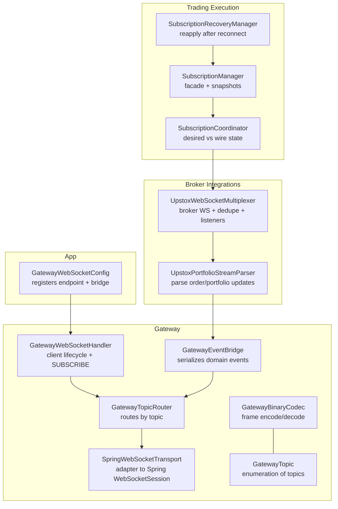
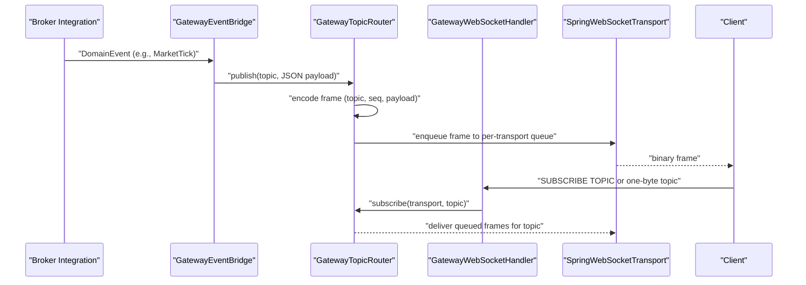
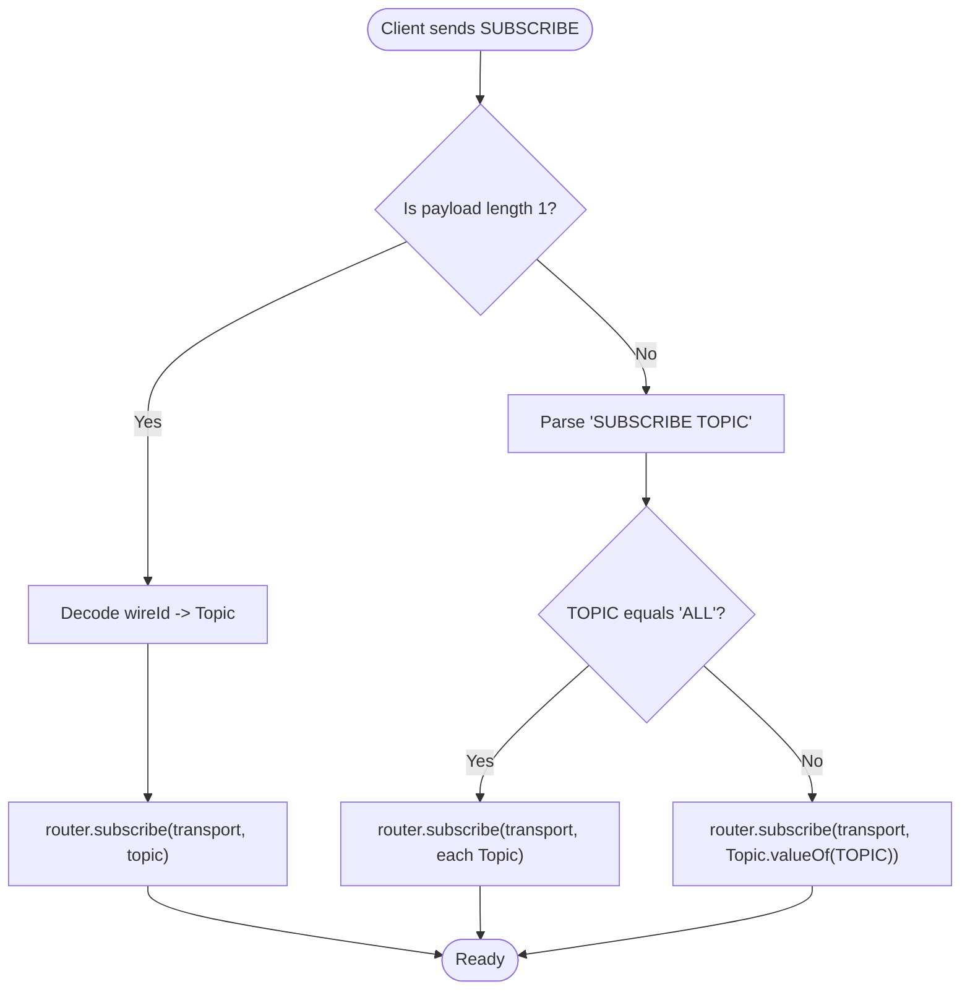
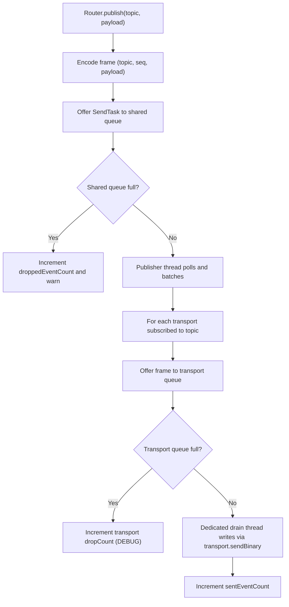
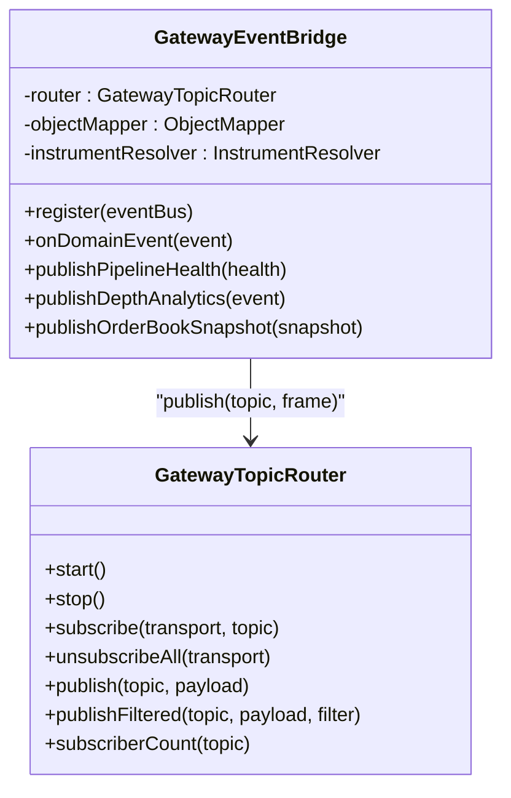
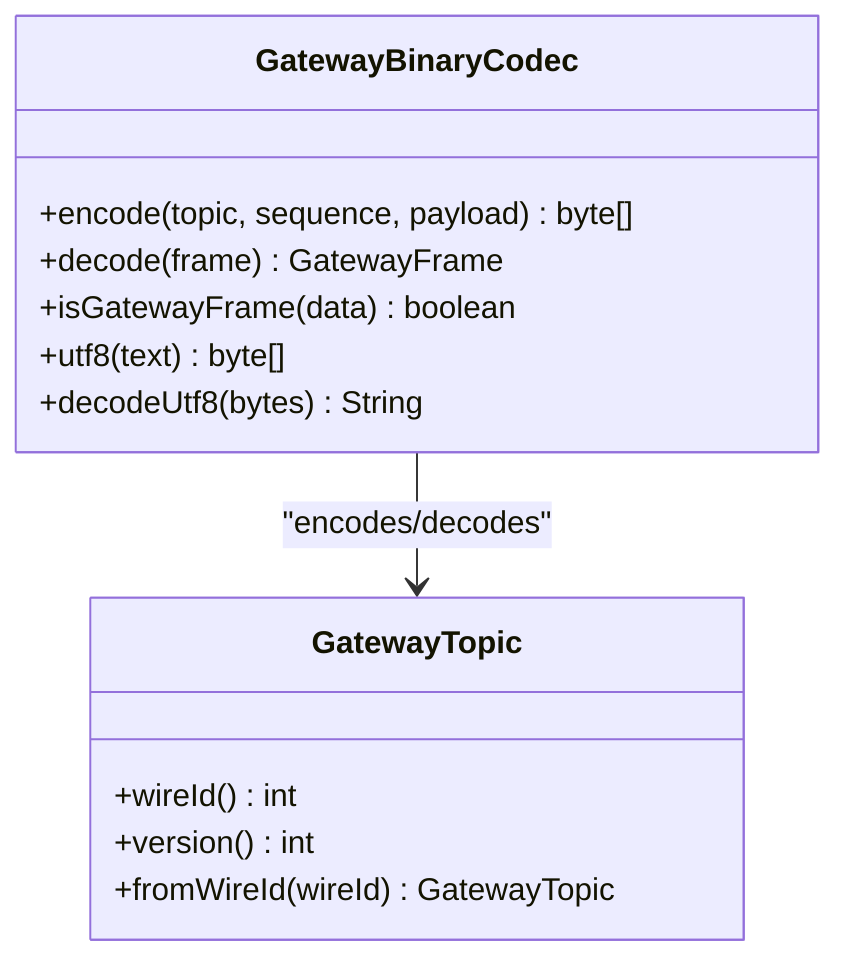
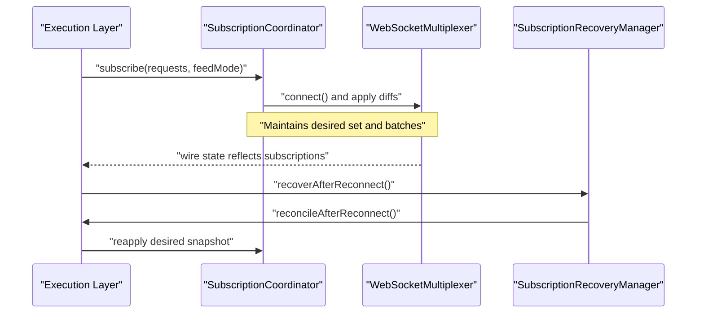
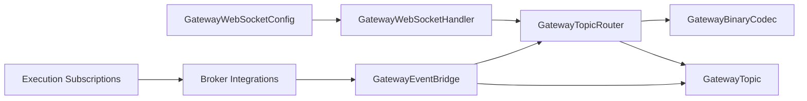

# Event Streaming

<cite>
**Referenced Files in This Document**
- [GatewayEventBridge.java](file://gateway/src/main/java/com/tradej/gateway/bridge/GatewayEventBridge.java)
- [GatewayTopicRouter.java](file://gateway/src/main/java/com/tradej/gateway/router/GatewayTopicRouter.java)
- [GatewayWebSocketHandler.java](file://gateway/src/main/java/com/tradej/gateway/websocket/GatewayWebSocketHandler.java)
- [GatewayTopic.java](file://gateway/src/main/java/com/tradej/gateway/protocol/GatewayTopic.java)
- [GatewayBinaryCodec.java](file://gateway/src/main/java/com/tradej/gateway/protocol/GatewayBinaryCodec.java)
- [SpringWebSocketTransport.java](file://gateway/src/main/java/com/tradej/gateway/transport/SpringWebSocketTransport.java)
- [GatewayWebSocketConfig.java](file://app/src/main/java/com/tradej/app/config/GatewayWebSocketConfig.java)
- [GatewayReplayCommandProcessor.java](file://gateway/src/main/java/com/tradej/gateway/websocket/GatewayReplayCommandProcessor.java)
- [REACTIVE_ADOPTION_REVIEW_2026-06-06.md](file://docs/reports/REACTIVE_ADOPTION_REVIEW_2026-06-06.md)
- [BROKER_GATEWAY_ARCHITECTURE_REVIEW_2026-06-06.md](file://docs/reports/BROKER_GATEWAY_ARCHITECTURE_REVIEW_2026-06-06.md)
- [UpstoxPortfolioStreamParser.java](file://broker/upstox/src/main/java/com/tradej/broker/upstox/websocket/UpstoxPortfolioStreamParser.java)
- [UpstoxWebSocketMultiplexer.java](file://broker/upstox/src/main/java/com/tradej/broker/upstox/websocket/UpstoxWebSocketMultiplexer.java)
- [SubscriptionCoordinator.java](file://trading/execution/src/main/java/com/tradej/execution/subscription/SubscriptionCoordinator.java)
- [SubscriptionManager.java](file://trading/execution/src/main/java/com/tradej/execution/subscription/SubscriptionManager.java)
- [SubscriptionRecoveryManager.java](file://trading/execution/src/main/java/com/tradej/execution/subscription/SubscriptionRecoveryManager.java)
</cite>

## Table of Contents
1. [Introduction](#introduction)
2. [Project Structure](#project-structure)
3. [Core Components](#core-components)
4. [Architecture Overview](#architecture-overview)
5. [Detailed Component Analysis](#detailed-component-analysis)
6. [Dependency Analysis](#dependency-analysis)
7. [Performance Considerations](#performance-considerations)
8. [Troubleshooting Guide](#troubleshooting-guide)
9. [Conclusion](#conclusion)
10. [Appendices](#appendices)

## Introduction
This document explains Trade-J’s WebSocket event streaming for real-time distribution of market data, order updates, and system events. It covers event types, subscription management, routing, batching, delivery semantics, ordering guarantees, duplicate handling, recovery, and client-side processing patterns. It also documents the GatewayEventBridge implementation and the topic-based routing pipeline, and provides guidance for building robust, high-performance clients.

## Project Structure
The WebSocket streaming stack spans several modules:
- Gateway: event bridging, routing, transport, and protocol encoding
- App: Spring configuration wiring the WebSocket endpoint and bridge
- Broker integrations: parsing and emitting domain events
- Trading execution: subscription coordination and recovery

**Diagram sources**
- [GatewayEventBridge.java:45-145](file://gateway/src/main/java/com/tradej/gateway/bridge/GatewayEventBridge.java#L45-L145)
- [GatewayTopicRouter.java:40-190](file://gateway/src/main/java/com/tradej/gateway/router/GatewayTopicRouter.java#L40-L190)
- [GatewayWebSocketHandler.java:24-111](file://gateway/src/main/java/com/tradej/gateway/websocket/GatewayWebSocketHandler.java#L24-L111)
- [GatewayBinaryCodec.java:9-91](file://gateway/src/main/java/com/tradej/gateway/protocol/GatewayBinaryCodec.java#L9-L91)
- [SpringWebSocketTransport.java:10-44](file://gateway/src/main/java/com/tradej/gateway/transport/SpringWebSocketTransport.java#L10-L44)
- [GatewayTopic.java:8-52](file://gateway/src/main/java/com/tradej/gateway/protocol/GatewayTopic.java#L8-L52)
- [GatewayWebSocketConfig.java:36-73](file://app/src/main/java/com/tradej/app/config/GatewayWebSocketConfig.java#L36-L73)
- [UpstoxPortfolioStreamParser.java:58-89](file://broker/upstox/src/main/java/com/tradej/broker/upstox/websocket/UpstoxPortfolioStreamParser.java#L58-L89)
- [UpstoxWebSocketMultiplexer.java:396-426](file://broker/upstox/src/main/java/com/tradej/broker/upstox/websocket/UpstoxWebSocketMultiplexer.java#L396-L426)
- [SubscriptionCoordinator.java:18-46](file://trading/execution/src/main/java/com/tradej/execution/subscription/SubscriptionCoordinator.java#L18-L46)
- [SubscriptionManager.java:17-33](file://trading/execution/src/main/java/com/tradej/execution/subscription/SubscriptionManager.java#L17-L33)
- [SubscriptionRecoveryManager.java:8-19](file://trading/execution/src/main/java/com/tradej/execution/subscription/SubscriptionRecoveryManager.java#L8-L19)

**Section sources**
- [GatewayWebSocketConfig.java:36-73](file://app/src/main/java/com/tradej/app/config/GatewayWebSocketConfig.java#L36-L73)

## Core Components
- GatewayEventBridge: Subscribes to domain events and publishes them to the topic router with JSON payloads. It maps domain events to GatewayTopic values and encodes payloads via Jackson.
- GatewayTopicRouter: Maintains topic-to-transports and transport-to-topics mappings, enqueues outbound frames, and dispatches to per-transport write queues. It supports filtered publishing and per-transport drop counters.
- GatewayWebSocketHandler: Bridges Spring WebSocket sessions to the router, handles subscription commands, and processes control frames (e.g., replay).
- GatewayBinaryCodec: Encodes/decodes frames with a compact header (topic wire ID + 8-byte sequence + payload) and provides control frame detection.
- SpringWebSocketTransport: Transport-agnostic wrapper around Spring’s WebSocketSession.
- GatewayTopic: Enumeration of topics (market ticks, depth, candles, order/position updates, signals, PnL, replay control, pipeline health, and analytics).
- Broker integrations: Parse broker-specific messages and emit domain events consumed by the bridge.
- Trading execution subscriptions: Manage desired subscriptions and reconcile with wire state for recovery.

**Section sources**
- [GatewayEventBridge.java:45-145](file://gateway/src/main/java/com/tradej/gateway/bridge/GatewayEventBridge.java#L45-L145)
- [GatewayTopicRouter.java:40-190](file://gateway/src/main/java/com/tradej/gateway/router/GatewayTopicRouter.java#L40-L190)
- [GatewayWebSocketHandler.java:24-111](file://gateway/src/main/java/com/tradej/gateway/websocket/GatewayWebSocketHandler.java#L24-L111)
- [GatewayBinaryCodec.java:9-91](file://gateway/src/main/java/com/tradej/gateway/protocol/GatewayBinaryCodec.java#L9-L91)
- [SpringWebSocketTransport.java:10-44](file://gateway/src/main/java/com/tradej/gateway/transport/SpringWebSocketTransport.java#L10-L44)
- [GatewayTopic.java:8-52](file://gateway/src/main/java/com/tradej/gateway/protocol/GatewayTopic.java#L8-L52)
- [UpstoxPortfolioStreamParser.java:58-89](file://broker/upstox/src/main/java/com/tradej/broker/upstox/websocket/UpstoxPortfolioStreamParser.java#L58-L89)
- [UpstoxWebSocketMultiplexer.java:396-426](file://broker/upstox/src/main/java/com/tradej/broker/upstox/websocket/UpstoxWebSocketMultiplexer.java#L396-L426)
- [SubscriptionCoordinator.java:18-46](file://trading/execution/src/main/java/com/tradej/execution/subscription/SubscriptionCoordinator.java#L18-L46)
- [SubscriptionManager.java:17-33](file://trading/execution/src/main/java/com/tradej/execution/subscription/SubscriptionManager.java#L17-L33)
- [SubscriptionRecoveryManager.java:8-19](file://trading/execution/src/main/java/com/tradej/execution/subscription/SubscriptionRecoveryManager.java#L8-L19)

## Architecture Overview
The streaming pipeline is event-driven and topic-based:
- Domain events are emitted by broker integrations and consumed by GatewayEventBridge.
- Bridge serializes events to JSON and publishes to GatewayTopicRouter with a monotonically increasing sequence number.
- Router encodes frames, enqueues send tasks, and dispatches to per-transport queues.
- Each transport has a dedicated drain thread writing frames to the client, ensuring isolation.
- Clients subscribe by sending a one-byte topic ID or a text “SUBSCRIBE TOPIC” command.

**Diagram sources**
- [GatewayEventBridge.java:90-140](file://gateway/src/main/java/com/tradej/gateway/bridge/GatewayEventBridge.java#L90-L140)
- [GatewayTopicRouter.java:220-318](file://gateway/src/main/java/com/tradej/gateway/router/GatewayTopicRouter.java#L220-L318)
- [GatewayWebSocketHandler.java:50-85](file://gateway/src/main/java/com/tradej/gateway/websocket/GatewayWebSocketHandler.java#L50-L85)
- [SpringWebSocketTransport.java:18-38](file://gateway/src/main/java/com/tradej/gateway/transport/SpringWebSocketTransport.java#L18-L38)

## Detailed Component Analysis

### Event Types and Topics
GatewayTopic enumerates the event streams available over WebSocket:
- Market data: MARKET_TICK, MARKET_DEPTH, CANDLE_DEVELOPING, CANDLE_CLOSED
- Orders and positions: ORDER_UPDATE, POSITION_UPDATE
- Strategy/system: STRATEGY_SIGNAL, SCAN_COMPLETED, PNL_UPDATE
- Analytics: DEPTH_IMBALANCE, HEATMAP_CHUNK, ICEBERG_ALERT, ABSORPTION_ALERT, SR_LEVELS_UPDATE, ORDER_BOOK_SNAPSHOT
- Control: REPLAY_CONTROL, PIPELINE_HEALTH

Each event type maps to a specific topic. The bridge routes serialized payloads accordingly.

**Section sources**
- [GatewayTopic.java:8-52](file://gateway/src/main/java/com/tradej/gateway/protocol/GatewayTopic.java#L8-L52)
- [GatewayEventBridge.java:97-135](file://gateway/src/main/java/com/tradej/gateway/bridge/GatewayEventBridge.java#L97-L135)

### Subscription Management
Clients can:
- Subscribe to a single topic using a one-byte wire ID
- Subscribe to all topics using the “SUBSCRIBE ALL” text command
- Unsubscribe implicitly by closing the connection; the router removes all topic subscriptions for the transport

The handler delegates to the router’s subscribe/unsubscribe APIs and supports replay control frames.

**Diagram sources**
- [GatewayWebSocketHandler.java:64-80](file://gateway/src/main/java/com/tradej/gateway/websocket/GatewayWebSocketHandler.java#L64-L80)
- [GatewayTopicRouter.java:192-218](file://gateway/src/main/java/com/tradej/gateway/router/GatewayTopicRouter.java#L192-L218)

**Section sources**
- [GatewayWebSocketHandler.java:50-85](file://gateway/src/main/java/com/tradej/gateway/websocket/GatewayWebSocketHandler.java#L50-L85)
- [GatewayTopicRouter.java:192-218](file://gateway/src/main/java/com/tradej/gateway/router/GatewayTopicRouter.java#L192-L218)

### Event Routing and Delivery Semantics
- Non-blocking publish: Router enqueues send tasks into a bounded queue; if full, events are dropped with a warning and a global counter increments.
- Per-transport isolation: Each transport has a dedicated write queue and drain thread. Slow transports only drop their own frames, not others.
- Batching: The publisher drains up to a fixed batch size to amortize dispatch overhead.
- Sequence numbers: Each frame carries a monotonically increasing sequence number for ordering within a topic.
- Filtering: Router supports filtered publishing to subsets of transports via a predicate.

**Diagram sources**
- [GatewayTopicRouter.java:220-318](file://gateway/src/main/java/com/tradej/gateway/router/GatewayTopicRouter.java#L220-L318)

**Section sources**
- [GatewayTopicRouter.java:273-318](file://gateway/src/main/java/com/tradej/gateway/router/GatewayTopicRouter.java#L273-L318)

### GatewayEventBridge Implementation
- Subscriptions: Bridge registers handlers for specific domain event types to reduce overhead.
- Serialization: Uses Jackson to convert payloads to JSON; some analytics payloads are passed through as-is.
- Canonicalization: Optionally resolves canonical symbols and exchange segments via InstrumentResolver.
- Publishing: For each event, bridge selects the appropriate topic and calls router.publish.

**Diagram sources**
- [GatewayEventBridge.java:45-145](file://gateway/src/main/java/com/tradej/gateway/bridge/GatewayEventBridge.java#L45-L145)
- [GatewayTopicRouter.java:147-190](file://gateway/src/main/java/com/tradej/gateway/router/GatewayTopicRouter.java#L147-L190)

**Section sources**
- [GatewayEventBridge.java:70-140](file://gateway/src/main/java/com/tradej/gateway/bridge/GatewayEventBridge.java#L70-L140)

### Protocol Encoding and Frames
- Header: 1 byte topic wire ID + 8 bytes sequence number (big-endian)
- Payload: JSON-encoded event body
- Control frames: Detectable via wire ID; replay control is supported

**Diagram sources**
- [GatewayBinaryCodec.java:9-91](file://gateway/src/main/java/com/tradej/gateway/protocol/GatewayBinaryCodec.java#L9-L91)
- [GatewayTopic.java:27-50](file://gateway/src/main/java/com/tradej/gateway/protocol/GatewayTopic.java#L27-L50)

**Section sources**
- [GatewayBinaryCodec.java:19-53](file://gateway/src/main/java/com/tradej/gateway/protocol/GatewayBinaryCodec.java#L19-L53)

### Replay and Control
- Replay control frames are detected and forwarded to a processor if configured.
- The handler logs invalid control frames and ignores them.

**Section sources**
- [GatewayWebSocketHandler.java:87-100](file://gateway/src/main/java/com/tradej/gateway/websocket/GatewayWebSocketHandler.java#L87-L100)
- [GatewayReplayCommandProcessor.java:6-11](file://gateway/src/main/java/com/tradej/gateway/websocket/GatewayReplayCommandProcessor.java#L6-L11)

### Broker Integration and Duplicate Handling
- Broker integrations parse broker-specific messages and emit domain events.
- Some integrations implement duplicate detection for order events before forwarding to listeners.

**Section sources**
- [UpstoxPortfolioStreamParser.java:58-89](file://broker/upstox/src/main/java/com/tradej/broker/upstox/websocket/UpstoxPortfolioStreamParser.java#L58-L89)
- [UpstoxWebSocketMultiplexer.java:416-426](file://broker/upstox/src/main/java/com/tradej/broker/upstox/websocket/UpstoxWebSocketMultiplexer.java#L416-L426)

### Subscription Lifecycle and Recovery
- Desired vs wire state reconciliation ensures accurate subscription sets.
- After broker reconnect, the desired snapshot is reapplied to restore subscriptions.

**Diagram sources**
- [SubscriptionCoordinator.java:33-46](file://trading/execution/src/main/java/com/tradej/execution/subscription/SubscriptionCoordinator.java#L33-L46)
- [SubscriptionManager.java:27-33](file://trading/execution/src/main/java/com/tradej/execution/subscription/SubscriptionManager.java#L27-L33)
- [SubscriptionRecoveryManager.java:16-18](file://trading/execution/src/main/java/com/tradej/execution/subscription/SubscriptionRecoveryManager.java#L16-L18)

**Section sources**
- [SubscriptionCoordinator.java:18-46](file://trading/execution/src/main/java/com/tradej/execution/subscription/SubscriptionCoordinator.java#L18-L46)
- [SubscriptionManager.java:17-33](file://trading/execution/src/main/java/com/tradej/execution/subscription/SubscriptionManager.java#L17-L33)
- [SubscriptionRecoveryManager.java:8-19](file://trading/execution/src/main/java/com/tradej/execution/subscription/SubscriptionRecoveryManager.java#L8-L19)

## Dependency Analysis
- GatewayWebSocketConfig wires the endpoint, topic router, handler, and event bridge into the Spring application context.
- GatewayEventBridge depends on Jackson for serialization and optionally on InstrumentResolver for symbol normalization.
- GatewayTopicRouter depends on GatewayBinaryCodec and GatewayTopic for framing and routing.
- GatewayWebSocketHandler depends on GatewayTopicRouter and optional replay processor.
- Broker integrations depend on the event bus and produce domain events consumed by the bridge.

**Diagram sources**
- [GatewayWebSocketConfig.java:36-73](file://app/src/main/java/com/tradej/app/config/GatewayWebSocketConfig.java#L36-L73)
- [GatewayEventBridge.java:49-63](file://gateway/src/main/java/com/tradej/gateway/bridge/GatewayEventBridge.java#L49-L63)
- [GatewayTopicRouter.java:40-60](file://gateway/src/main/java/com/tradej/gateway/router/GatewayTopicRouter.java#L40-L60)
- [GatewayBinaryCodec.java:9-32](file://gateway/src/main/java/com/tradej/gateway/protocol/GatewayBinaryCodec.java#L9-L32)
- [GatewayTopic.java:8-33](file://gateway/src/main/java/com/tradej/gateway/protocol/GatewayTopic.java#L8-L33)

**Section sources**
- [GatewayWebSocketConfig.java:36-73](file://app/src/main/java/com/tradej/app/config/GatewayWebSocketConfig.java#L36-L73)

## Performance Considerations
- Non-blocking design: Shared send queue and per-transport queues prevent head-of-line blocking.
- Batching: Publisher drains in batches to reduce dispatch overhead.
- Concurrency: Dedicated drain threads per transport isolate slow clients.
- Backpressure: Per-transport queues drop frames for slow clients; global queue drops frames under overload.
- Reactive upgrade path: A proposed reactive pipeline with groupBy(topic), boundedElastic scheduling, and per-topic concurrency can improve throughput and backpressure behavior.

**Section sources**
- [GatewayTopicRouter.java:273-318](file://gateway/src/main/java/com/tradej/gateway/router/GatewayTopicRouter.java#L273-L318)
- [REACTIVE_ADOPTION_REVIEW_2026-06-06.md:52-73](file://docs/reports/REACTIVE_ADOPTION_REVIEW_2026-06-06.md#L52-L73)

## Troubleshooting Guide
- Memory leak risk: The bridge does not unsubscribe from the event bus on close. Ensure proper cleanup by unsubscribing on close.
- Slow client impact: If a transport’s queue fills, only that client drops frames. Monitor per-transport drop counters.
- Global overflow: If the shared queue fills, events are dropped globally with warnings.
- Replay control: Invalid control frames are ignored; ensure clients send valid JSON payloads for replay control.
- Broker duplicates: Some broker integrations filter duplicates before emitting events; verify deduplication behavior for order updates.

**Section sources**
- [BROKER_GATEWAY_ARCHITECTURE_REVIEW_2026-06-06.md:316-318](file://docs/reports/BROKER_GATEWAY_ARCHITECTURE_REVIEW_2026-06-06.md#L316-L318)
- [GatewayTopicRouter.java:220-240](file://gateway/src/main/java/com/tradej/gateway/router/GatewayTopicRouter.java#L220-L240)
- [GatewayWebSocketHandler.java:87-100](file://gateway/src/main/java/com/tradej/gateway/websocket/GatewayWebSocketHandler.java#L87-L100)
- [UpstoxWebSocketMultiplexer.java:416-426](file://broker/upstox/src/main/java/com/tradej/broker/upstox/websocket/UpstoxWebSocketMultiplexer.java#L416-L426)

## Conclusion
Trade-J’s WebSocket streaming is built around a topic-based, non-blocking router with per-transport isolation and sequence-numbered frames. The GatewayEventBridge translates domain events into JSON payloads and routes them efficiently. Clients subscribe by topic, receive batches of events, and can manage subscriptions dynamically. For high-scale scenarios, adopting a reactive pipeline can further improve throughput and backpressure behavior.

## Appendices

### Event Ordering Guaranties and Delivery Semantics
- Ordering: Monotonically increasing sequence numbers ensure per-topic ordering.
- Delivery: Best-effort delivery; frames may be dropped under overload (global or per-transport).
- Idempotency: Clients should tolerate duplicates and missing frames; implement idempotent processing and re-subscription on disconnect.

**Section sources**
- [GatewayBinaryCodec.java:19-53](file://gateway/src/main/java/com/tradej/gateway/protocol/GatewayBinaryCodec.java#L19-L53)
- [GatewayTopicRouter.java:220-240](file://gateway/src/main/java/com/tradej/gateway/router/GatewayTopicRouter.java#L220-L240)

### Client-Side Processing Patterns
- Subscribe to specific topics (e.g., MARKET_TICK, ORDER_UPDATE) or ALL.
- Buffer and batch incoming frames; apply per-topic sequence checks.
- Implement exponential backoff on reconnect and resubscribe using the desired snapshot.
- Use per-transport queues to avoid stalling other topics when one client is slow.

**Section sources**
- [GatewayWebSocketHandler.java:64-80](file://gateway/src/main/java/com/tradej/gateway/websocket/GatewayWebSocketHandler.java#L64-L80)
- [SubscriptionCoordinator.java:33-46](file://trading/execution/src/main/java/com/tradej/execution/subscription/SubscriptionCoordinator.java#L33-L46)