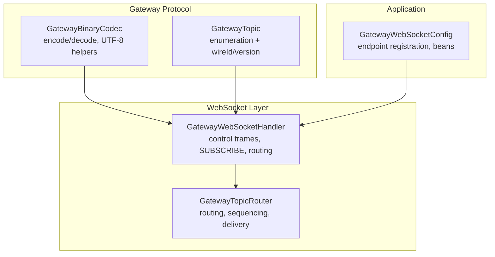
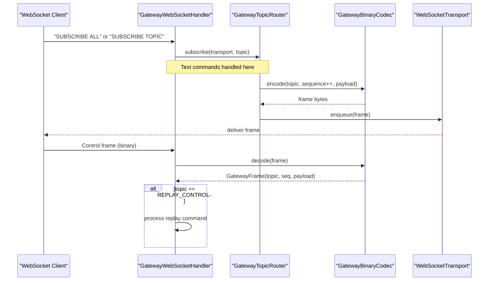
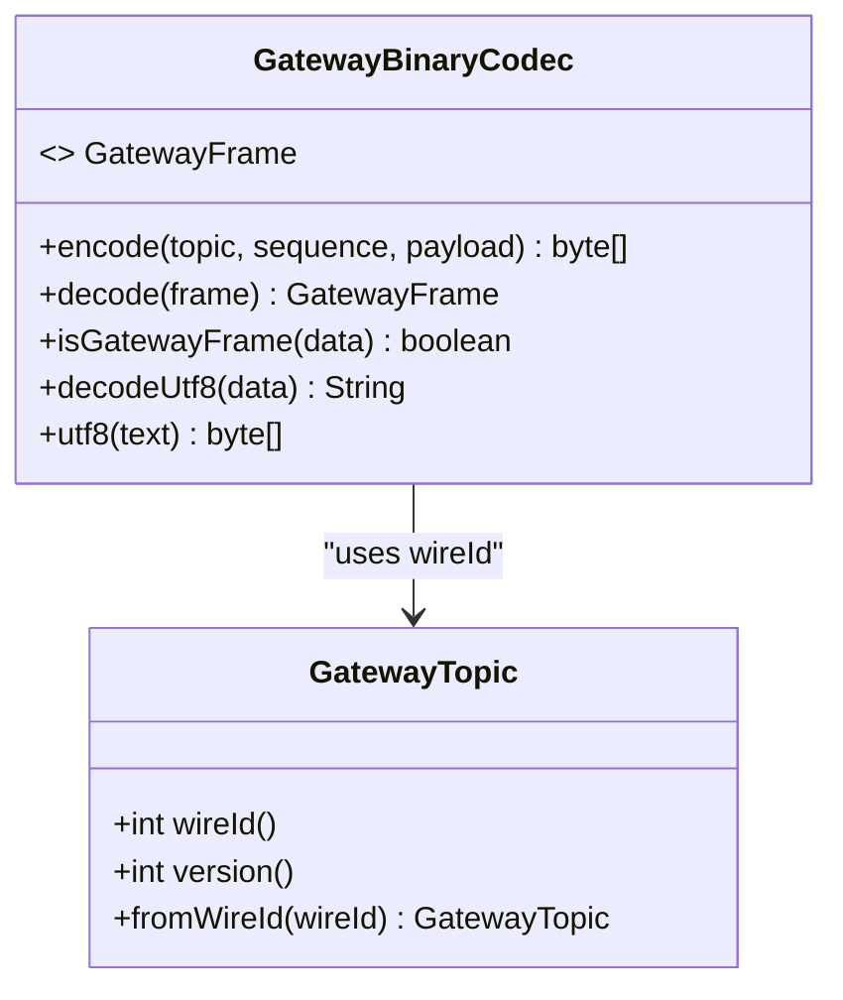
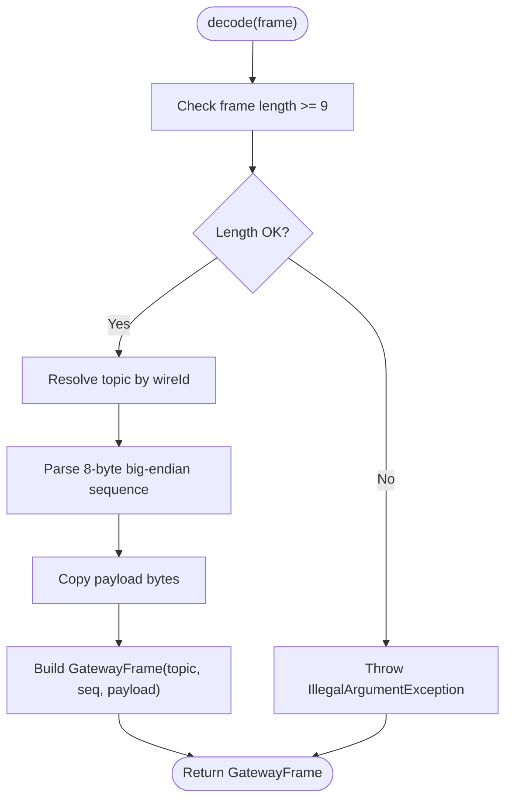
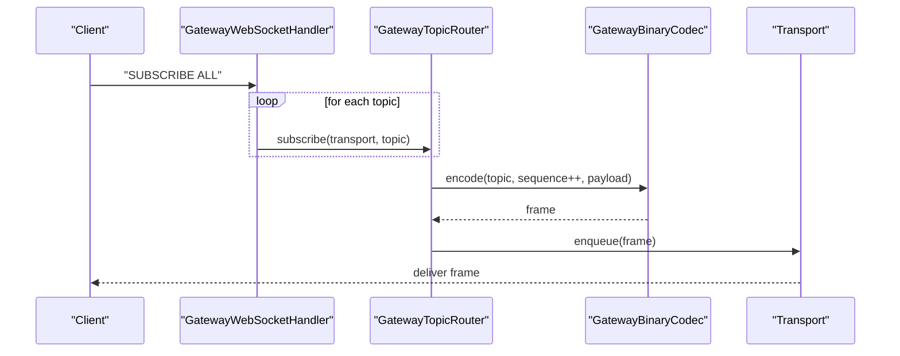
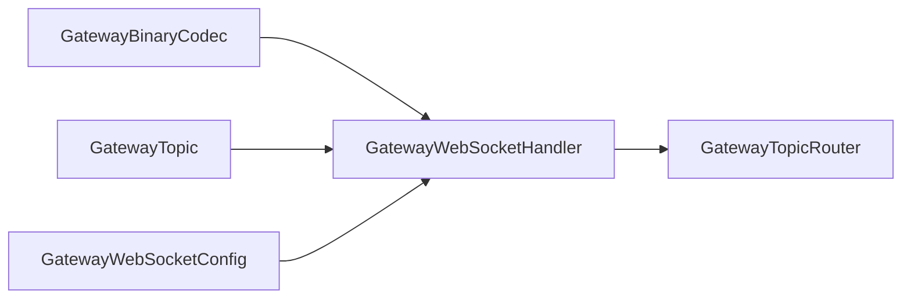

# Message Protocol

<cite>
**Referenced Files in This Document**
- [GatewayBinaryCodec.java](file://gateway/src/main/java/com/tradej/gateway/protocol/GatewayBinaryCodec.java)
- [GatewayTopic.java](file://gateway/src/main/java/com/tradej/gateway/protocol/GatewayTopic.java)
- [GatewayWebSocketHandler.java](file://gateway/src/main/java/com/tradej/gateway/websocket/GatewayWebSocketHandler.java)
- [GatewayTopicRouter.java](file://gateway/src/main/java/com/tradej/gateway/router/GatewayTopicRouter.java)
- [GatewayWebSocketConfig.java](file://app/src/main/java/com/tradej/app/config/GatewayWebSocketConfig.java)
</cite>

## Table of Contents
1. [Introduction](#introduction)
2. [Project Structure](#project-structure)
3. [Core Components](#core-components)
4. [Architecture Overview](#architecture-overview)
5. [Detailed Component Analysis](#detailed-component-analysis)
6. [Dependency Analysis](#dependency-analysis)
7. [Performance Considerations](#performance-considerations)
8. [Troubleshooting Guide](#troubleshooting-guide)
9. [Conclusion](#conclusion)

## Introduction
This document specifies the Trade-J WebSocket message protocol used by the gateway. It defines the binary wire protocol frame structure, header format, encoding schemes, and the GatewayBinaryCodec implementation. It also documents topic-based routing, sequence numbering, payload handling, supported message types, serialization formats, protocol versioning, delivery guarantees, and practical guidelines for implementation and debugging.

## Project Structure
The WebSocket protocol is implemented within the gateway module and integrated into the application’s Spring WebSocket configuration. The key elements are:
- Protocol encoder/decoder and frame model
- Topic enumeration and versioning
- WebSocket handler for client control and subscription
- Router for topic-based routing, sequencing, and delivery
- Application configuration wiring

**Diagram sources**
- [GatewayBinaryCodec.java:19-53](file://gateway/src/main/java/com/tradej/gateway/protocol/GatewayBinaryCodec.java#L19-L53)
- [GatewayTopic.java:8-25](file://gateway/src/main/java/com/tradej/gateway/protocol/GatewayTopic.java#L8-L25)
- [GatewayWebSocketHandler.java:50-85](file://gateway/src/main/java/com/tradej/gateway/websocket/GatewayWebSocketHandler.java#L50-L85)
- [GatewayTopicRouter.java:220-240](file://gateway/src/main/java/com/tradej/gateway/router/GatewayTopicRouter.java#L220-L240)
- [GatewayWebSocketConfig.java:36-56](file://app/src/main/java/com/tradej/app/config/GatewayWebSocketConfig.java#L36-L56)

**Section sources**
- [GatewayBinaryCodec.java:19-53](file://gateway/src/main/java/com/tradej/gateway/protocol/GatewayBinaryCodec.java#L19-L53)
- [GatewayTopic.java:8-25](file://gateway/src/main/java/com/tradej/gateway/protocol/GatewayTopic.java#L8-L25)
- [GatewayWebSocketHandler.java:50-85](file://gateway/src/main/java/com/tradej/gateway/websocket/GatewayWebSocketHandler.java#L50-L85)
- [GatewayTopicRouter.java:220-240](file://gateway/src/main/java/com/tradej/gateway/router/GatewayTopicRouter.java#L220-L240)
- [GatewayWebSocketConfig.java:36-56](file://app/src/main/java/com/tradej/app/config/GatewayWebSocketConfig.java#L36-L56)

## Core Components
- GatewayBinaryCodec: Encodes/decodes frames with a 9-byte header (1-byte topic + 8-byte big-endian sequence) followed by arbitrary payload bytes. Includes helpers for UTF-8 decoding/encoding and control-frame detection.
- GatewayTopic: Enumerates supported topics with wireId and version. Provides lookup by wireId and enum name resolution for textual subscriptions.
- GatewayWebSocketHandler: Bridges Spring WebSocket sessions to the router. Handles control frames, subscription commands, and replay control.
- GatewayTopicRouter: Maintains topic-to-transport and transport-to-topic mappings, assigns monotonically increasing sequence numbers, and delivers messages asynchronously with per-transport isolation and bounded queues.

**Section sources**
- [GatewayBinaryCodec.java:19-53](file://gateway/src/main/java/com/tradej/gateway/protocol/GatewayBinaryCodec.java#L19-L53)
- [GatewayTopic.java:8-25](file://gateway/src/main/java/com/tradej/gateway/protocol/GatewayTopic.java#L8-L25)
- [GatewayWebSocketHandler.java:50-85](file://gateway/src/main/java/com/tradej/gateway/websocket/GatewayWebSocketHandler.java#L50-L85)
- [GatewayTopicRouter.java:220-240](file://gateway/src/main/java/com/tradej/gateway/router/GatewayTopicRouter.java#L220-L240)

## Architecture Overview
The protocol operates over Spring WebSocket with a binary codec and a topic router. Publishers encode frames and enqueue them into a shared queue. A background publisher drains the queue and dispatches to subscribed transports. Each transport has its own write queue and drain thread for isolation.

**Diagram sources**
- [GatewayWebSocketHandler.java:50-100](file://gateway/src/main/java/com/tradej/gateway/websocket/GatewayWebSocketHandler.java#L50-L100)
- [GatewayTopicRouter.java:220-318](file://gateway/src/main/java/com/tradej/gateway/router/GatewayTopicRouter.java#L220-L318)
- [GatewayBinaryCodec.java:19-53](file://gateway/src/main/java/com/tradej/gateway/protocol/GatewayBinaryCodec.java#L19-L53)

## Detailed Component Analysis

### Binary Wire Protocol Specification
- Frame structure
  - Header: 9 bytes
    - Topic identifier: 1 byte (wireId)
    - Sequence number: 8 bytes, big-endian unsigned long
  - Payload: variable-length bytes
- Encoding schemes
  - Topic enumeration uses wireId mapping
  - Control frames are detected by header presence and valid wireId
  - UTF-8 is used for text control messages and replay payloads
- Protocol versioning
  - Topics carry a version field indicating compatibility semantics per topic

**Diagram sources**
- [GatewayBinaryCodec.java:19-83](file://gateway/src/main/java/com/tradej/gateway/protocol/GatewayBinaryCodec.java#L19-L83)
- [GatewayTopic.java:35-50](file://gateway/src/main/java/com/tradej/gateway/protocol/GatewayTopic.java#L35-L50)

**Section sources**
- [GatewayBinaryCodec.java:11-32](file://gateway/src/main/java/com/tradej/gateway/protocol/GatewayBinaryCodec.java#L11-L32)
- [GatewayTopic.java:27-41](file://gateway/src/main/java/com/tradej/gateway/protocol/GatewayTopic.java#L27-L41)

### GatewayBinaryCodec Implementation
- encode(topic, sequence, payload)
  - Constructs a frame: [1-byte topic][8-byte sequence][payload bytes]
  - Sequence is stored big-endian
- decode(frame)
  - Validates minimum header length
  - Resolves topic by wireId
  - Extracts sequence and payload
- isGatewayFrame(data)
  - Checks minimum length and validates wireId against known topics
- UTF-8 helpers
  - decodeUtf8: converts bytes to string
  - utf8: converts string to UTF-8 bytes

**Diagram sources**
- [GatewayBinaryCodec.java:37-53](file://gateway/src/main/java/com/tradej/gateway/protocol/GatewayBinaryCodec.java#L37-L53)

**Section sources**
- [GatewayBinaryCodec.java:19-53](file://gateway/src/main/java/com/tradej/gateway/protocol/GatewayBinaryCodec.java#L19-L53)

### Topic-Based Routing and Delivery
- Subscriptions
  - Clients send a single-byte wireId to subscribe to a specific topic
  - Clients can send a textual "SUBSCRIBE" command with either "ALL" or a topic name
- Routing
  - Router maintains topic-to-transports and transport-to-topics maps
  - On publish, router encodes a frame with an incrementing sequence number and enqueues for delivery
- Delivery guarantees
  - Non-blocking publishing with bounded shared queue; overflow drops events with warning logs
  - Per-transport write queues with dedicated drain threads for isolation; overflow drops with debug logs
  - Graceful shutdown drains remaining items and logs totals

**Diagram sources**
- [GatewayWebSocketHandler.java:70-79](file://gateway/src/main/java/com/tradej/gateway/websocket/GatewayWebSocketHandler.java#L70-L79)
- [GatewayTopicRouter.java:220-240](file://gateway/src/main/java/com/tradej/gateway/router/GatewayTopicRouter.java#L220-L240)
- [GatewayBinaryCodec.java:19-32](file://gateway/src/main/java/com/tradej/gateway/protocol/GatewayBinaryCodec.java#L19-L32)

**Section sources**
- [GatewayWebSocketHandler.java:64-85](file://gateway/src/main/java/com/tradej/gateway/websocket/GatewayWebSocketHandler.java#L64-L85)
- [GatewayTopicRouter.java:220-318](file://gateway/src/main/java/com/tradej/gateway/router/GatewayTopicRouter.java#L220-L318)

### Supported Message Types and Versioning
- Topics and wireId/version mapping are defined in the topic enumeration
- Version indicates topic-specific compatibility semantics
- Unknown wireIds are rejected with an illegal argument exception

**Section sources**
- [GatewayTopic.java:8-25](file://gateway/src/main/java/com/tradej/gateway/protocol/GatewayTopic.java#L8-L25)
- [GatewayTopic.java:43-50](file://gateway/src/main/java/com/tradej/gateway/protocol/GatewayTopic.java#L43-L50)

### Serialization Formats
- Binary frames: topic + sequence + payload
- Text control messages: UTF-8 encoded strings for subscription commands and replay control payloads
- Payloads: arbitrary bytes; consumers interpret according to topic semantics

**Section sources**
- [GatewayBinaryCodec.java:19-32](file://gateway/src/main/java/com/tradej/gateway/protocol/GatewayBinaryCodec.java#L19-L32)
- [GatewayBinaryCodec.java:74-83](file://gateway/src/main/java/com/tradej/gateway/protocol/GatewayBinaryCodec.java#L74-L83)
- [GatewayWebSocketHandler.java:69-96](file://gateway/src/main/java/com/tradej/gateway/websocket/GatewayWebSocketHandler.java#L69-L96)

### Protocol Validation
- Frame validation
  - Minimum length check
  - Header wireId must correspond to a known topic
- Control frame detection
  - isGatewayFrame checks header validity
- Topic resolution
  - fromWireId throws on unknown wireId

**Section sources**
- [GatewayBinaryCodec.java:37-69](file://gateway/src/main/java/com/tradej/gateway/protocol/GatewayBinaryCodec.java#L37-L69)
- [GatewayTopic.java:43-50](file://gateway/src/main/java/com/tradej/gateway/protocol/GatewayTopic.java#L43-L50)

### Examples

- Encoding a frame
  - Inputs: topic (by wireId), sequence number, payload bytes
  - Output: frame bytes [wireId][sequence big-endian][payload]
  - Reference: [GatewayBinaryCodec.java:19-32](file://gateway/src/main/java/com/tradej/gateway/protocol/GatewayBinaryCodec.java#L19-L32)

- Decoding a frame
  - Input: frame bytes
  - Output: GatewayFrame(topic, sequence, payload)
  - Reference: [GatewayBinaryCodec.java:37-53](file://gateway/src/main/java/com/tradej/gateway/protocol/GatewayBinaryCodec.java#L37-L53)

- Constructing a subscription control message
  - Text: "SUBSCRIBE ALL" or "SUBSCRIBE TOPIC_NAME"
  - Reference: [GatewayWebSocketHandler.java:69-79](file://gateway/src/main/java/com/tradej/gateway/websocket/GatewayWebSocketHandler.java#L69-L79)

- Handling a replay control frame
  - Detect control frame: [GatewayBinaryCodec.java:82-84](file://gateway/src/main/java/com/tradej/gateway/protocol/GatewayBinaryCodec.java#L82-L84)
  - Decode payload: [GatewayBinaryCodec.java:89-96](file://gateway/src/main/java/com/tradej/gateway/protocol/GatewayBinaryCodec.java#L89-L96)
  - Process command: [GatewayWebSocketHandler.java:90-96](file://gateway/src/main/java/com/tradej/gateway/websocket/GatewayWebSocketHandler.java#L90-L96)

## Dependency Analysis
The WebSocket protocol depends on:
- GatewayBinaryCodec for frame encoding/decoding and control-frame detection
- GatewayTopic for topic identity and versioning
- GatewayTopicRouter for routing, sequencing, and delivery
- GatewayWebSocketHandler for client control and subscription
- Application configuration wires the handler and router into the Spring WebSocket stack

**Diagram sources**
- [GatewayBinaryCodec.java:19-53](file://gateway/src/main/java/com/tradej/gateway/protocol/GatewayBinaryCodec.java#L19-L53)
- [GatewayTopic.java:8-25](file://gateway/src/main/java/com/tradej/gateway/protocol/GatewayTopic.java#L8-L25)
- [GatewayWebSocketHandler.java:50-85](file://gateway/src/main/java/com/tradej/gateway/websocket/GatewayWebSocketHandler.java#L50-L85)
- [GatewayTopicRouter.java:220-240](file://gateway/src/main/java/com/tradej/gateway/router/GatewayTopicRouter.java#L220-L240)
- [GatewayWebSocketConfig.java:36-56](file://app/src/main/java/com/tradej/app/config/GatewayWebSocketConfig.java#L36-L56)

**Section sources**
- [GatewayBinaryCodec.java:19-53](file://gateway/src/main/java/com/tradej/gateway/protocol/GatewayBinaryCodec.java#L19-L53)
- [GatewayTopic.java:8-25](file://gateway/src/main/java/com/tradej/gateway/protocol/GatewayTopic.java#L8-L25)
- [GatewayWebSocketHandler.java:50-85](file://gateway/src/main/java/com/tradej/gateway/websocket/GatewayWebSocketHandler.java#L50-L85)
- [GatewayTopicRouter.java:220-240](file://gateway/src/main/java/com/tradej/gateway/router/GatewayTopicRouter.java#L220-L240)
- [GatewayWebSocketConfig.java:36-56](file://app/src/main/java/com/tradej/app/config/GatewayWebSocketConfig.java#L36-L56)

## Performance Considerations
- Non-blocking publishing
  - Shared send queue with bounded capacity; overflow leads to dropped events with warnings
- Per-transport isolation
  - Each transport has its own write queue and drain thread; slow transports do not block others
- Batch dispatch
  - Publisher drains in batches to reduce overhead
- Queue sizing
  - Default capacities are defined in the router; adjust based on throughput and latency targets

[No sources needed since this section provides general guidance]

## Troubleshooting Guide
Common issues and diagnostics:
- Frame too short
  - Symptom: IllegalArgumentException during decode
  - Cause: Packet smaller than 9 bytes
  - Action: Verify client framing and transport buffering
  - Reference: [GatewayBinaryCodec.java:38-40](file://gateway/src/main/java/com/tradej/gateway/protocol/GatewayBinaryCodec.java#L38-L40)

- Unknown topic wireId
  - Symptom: IllegalArgumentException on topic resolution
  - Cause: Invalid or unsupported wireId
  - Action: Confirm topic enumeration and client wireId mapping
  - Reference: [GatewayTopic.java:49](file://gateway/src/main/java/com/tradej/gateway/protocol/GatewayTopic.java#L49)

- Control frame parsing errors
  - Symptom: Debug logs for invalid gateway control frame
  - Cause: Malformed control frame or unexpected payload
  - Action: Validate control frame structure and payload encoding
  - Reference: [GatewayWebSocketHandler.java:97-99](file://gateway/src/main/java/com/tradej/gateway/websocket/GatewayWebSocketHandler.java#L97-L99)

- Subscription command format
  - Symptom: No subscription effect
  - Cause: Incorrect text format or unknown topic name
  - Action: Use "SUBSCRIBE ALL" or "SUBSCRIBE TOPIC_NAME" with valid topic enum name
  - Reference: [GatewayWebSocketHandler.java:69-79](file://gateway/src/main/java/com/tradej/gateway/websocket/GatewayWebSocketHandler.java#L69-L79)

- Delivery drops
  - Symptom: Dropped event counters increasing
  - Causes: Shared send queue overflow or per-transport queue overflow
  - Actions: Increase queue capacities, reduce publish rate, or scale consumers
  - References:
    - [GatewayTopicRouter.java:222-226](file://gateway/src/main/java/com/tradej/gateway/router/GatewayTopicRouter.java#L222-L226)
    - [GatewayTopicRouter.java:92-96](file://gateway/src/main/java/com/tradej/gateway/router/GatewayTopicRouter.java#L92-L96)

**Section sources**
- [GatewayBinaryCodec.java:38-40](file://gateway/src/main/java/com/tradej/gateway/protocol/GatewayBinaryCodec.java#L38-L40)
- [GatewayTopic.java:49](file://gateway/src/main/java/com/tradej/gateway/protocol/GatewayTopic.java#L49)
- [GatewayWebSocketHandler.java:97-99](file://gateway/src/main/java/com/tradej/gateway/websocket/GatewayWebSocketHandler.java#L97-L99)
- [GatewayWebSocketHandler.java:69-79](file://gateway/src/main/java/com/tradej/gateway/websocket/GatewayWebSocketHandler.java#L69-L79)
- [GatewayTopicRouter.java:222-226](file://gateway/src/main/java/com/tradej/gateway/router/GatewayTopicRouter.java#L222-L226)
- [GatewayTopicRouter.java:92-96](file://gateway/src/main/java/com/tradej/gateway/router/GatewayTopicRouter.java#L92-L96)

## Conclusion
The Trade-J WebSocket protocol uses a compact binary frame with a 1-byte topic and 8-byte big-endian sequence number, enabling efficient, versioned topic routing. The GatewayBinaryCodec provides robust encoding/decoding and control-frame detection, while the GatewayTopicRouter ensures scalable, isolated delivery with bounded queues and clear overflow semantics. Clients should adhere to the control-message formats and validate frames against the wireId and length constraints described here.