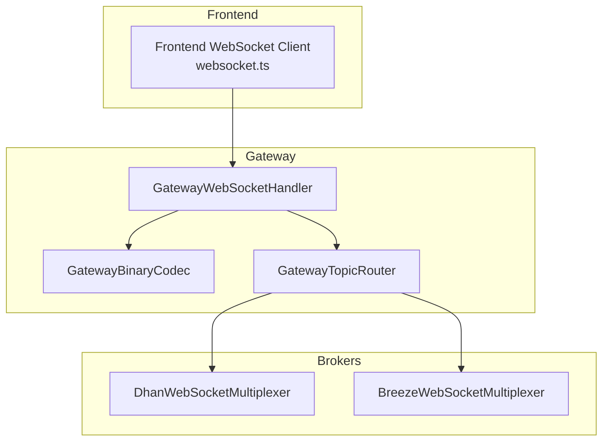
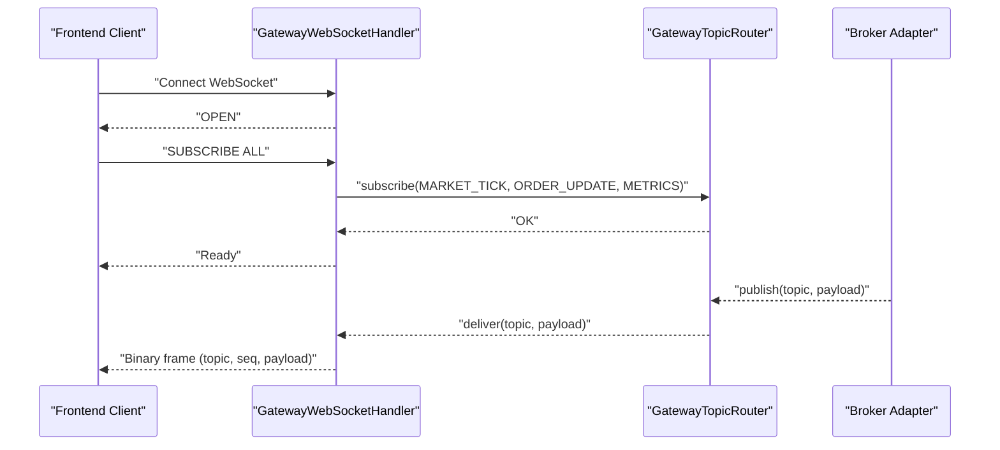
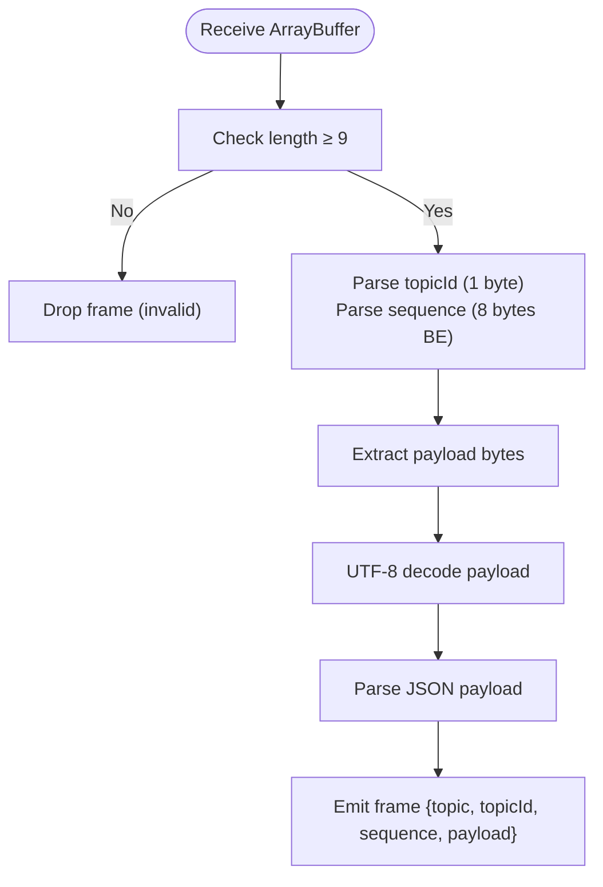
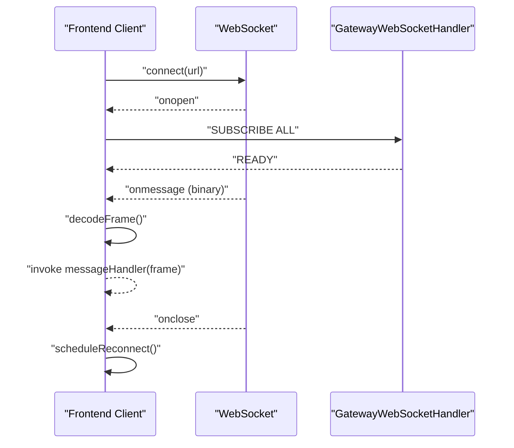
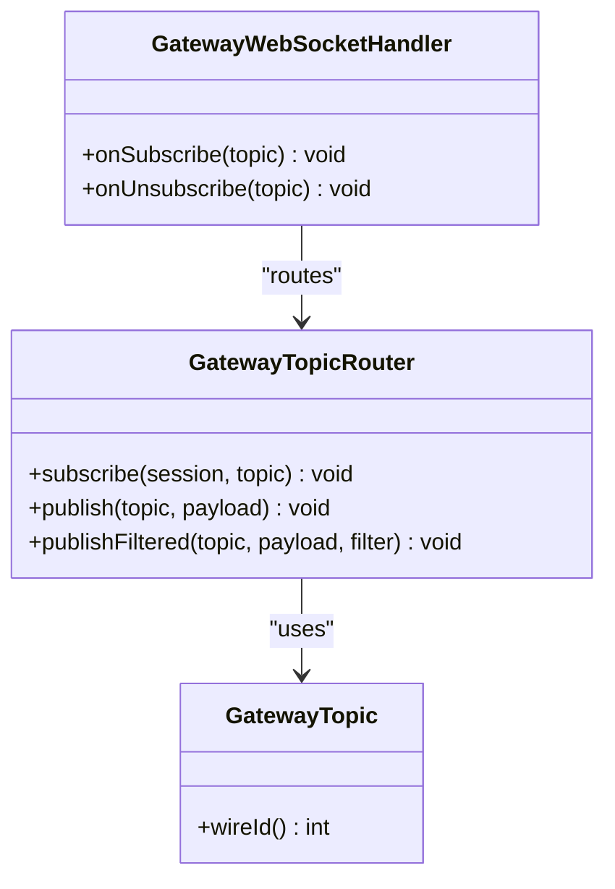
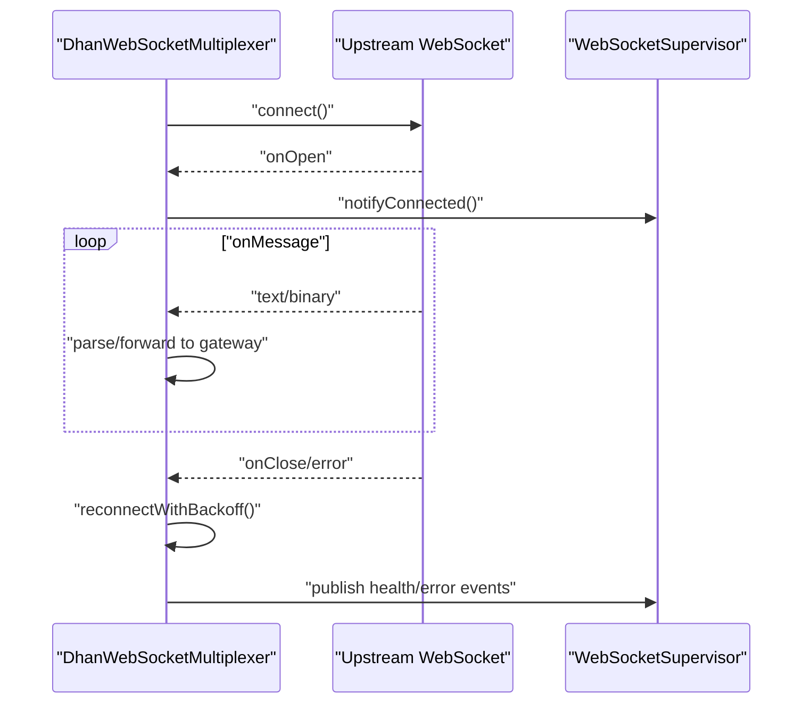
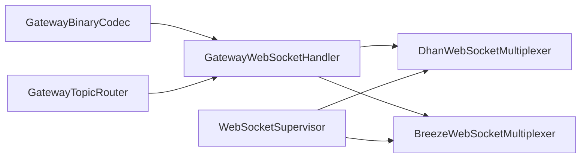

# WebSocket API

<cite>
**Referenced Files in This Document**
- [GatewayBinaryCodec.java](file://gateway/src/main/java/com/tradej/gateway/protocol/GatewayBinaryCodec.java)
- [GatewayTopic.java](file://gateway/src/main/java/com/tradej/gateway/protocol/GatewayTopic.java)
- [GatewayWebSocketHandler.java](file://gateway/src/main/java/com/tradej/gateway/websocket/GatewayWebSocketHandler.java)
- [GatewayTopicRouter.java](file://gateway/src/main/java/com/tradej/gateway/router/GatewayTopicRouter.java)
- [GatewayTopicRouterTest.java](file://gateway/src/test/java/com/tradej/gateway/router/GatewayTopicRouterTest.java)
- [WebSocketSupervisor.java](file://broker/api/src/main/java/com/tradej/broker/api/websocket/WebSocketSupervisor.java)
- [DefaultWebSocketSupervisor.java](file://broker/core/src/main/java/com/tradej/broker/core/websocket/DefaultWebSocketSupervisor.java)
- [DhanWebSocketMultiplexer.java](file://broker/dhan/src/main/java/com/tradej/broker/dhan/websocket/DhanWebSocketMultiplexer.java)
- [BreezeWebSocketMultiplexer.java](file://broker/icici/src/main/java/com/tradej/broker/icici/websocket/BreezeWebSocketMultiplexer.java)
- [websocket.ts](file://archive/frontend/src/api/websocket.ts)
- [websocket.ts](file://docs/archive/frontend/src/api/websocket.ts)
- [GatewayOrderStreamWebSocketClient.java](file://broker/dhan/src/main/java/com/tradej/broker/dhan/websocket/GatewayOrderStreamWebSocketClient.java)
</cite>

## Table of Contents
1. [Introduction](#introduction)
2. [Project Structure](#project-structure)
3. [Core Components](#core-components)
4. [Architecture Overview](#architecture-overview)
5. [Detailed Component Analysis](#detailed-component-analysis)
6. [Dependency Analysis](#dependency-analysis)
7. [Performance Considerations](#performance-considerations)
8. [Troubleshooting Guide](#troubleshooting-guide)
9. [Conclusion](#conclusion)
10. [Appendices](#appendices)

## Introduction
This document specifies the WebSocket API used by Trade-J for real-time market data, order updates, and pipeline metrics streaming. It covers connection lifecycle, message framing, topic routing, subscription semantics, error handling, reconnection strategies, and client implementation guidelines. Protocol examples and binary codecs are provided to enable robust client integrations.

## Project Structure
The WebSocket stack spans three layers:
- Frontend client library implementing the wire protocol and reconnection logic
- Gateway server handling WebSocket sessions, routing, and encoding
- Broker adapters implementing per-broker WebSocket multiplexing and reconnection

**Diagram sources**
- [GatewayWebSocketHandler.java:1-200](file://gateway/src/main/java/com/tradej/gateway/websocket/GatewayWebSocketHandler.java#L1-L200)
- [GatewayBinaryCodec.java:1-32](file://gateway/src/main/java/com/tradej/gateway/protocol/GatewayBinaryCodec.java#L1-L32)
- [GatewayTopicRouter.java:1-200](file://gateway/src/main/java/com/tradej/gateway/router/GatewayTopicRouter.java#L1-L200)
- [DhanWebSocketMultiplexer.java:337-370](file://broker/dhan/src/main/java/com/tradej/broker/dhan/websocket/DhanWebSocketMultiplexer.java#L337-L370)
- [BreezeWebSocketMultiplexer.java:88-112](file://broker/icici/src/main/java/com/tradej/broker/icici/websocket/BreezeWebSocketMultiplexer.java#L88-L112)

**Section sources**
- [GatewayWebSocketHandler.java:1-200](file://gateway/src/main/java/com/tradej/gateway/websocket/GatewayWebSocketHandler.java#L1-L200)
- [GatewayBinaryCodec.java:1-32](file://gateway/src/main/java/com/tradej/gateway/protocol/GatewayBinaryCodec.java#L1-L32)
- [GatewayTopicRouter.java:1-200](file://gateway/src/main/java/com/tradej/gateway/router/GatewayTopicRouter.java#L1-L200)
- [DhanWebSocketMultiplexer.java:337-370](file://broker/dhan/src/main/java/com/tradej/broker/dhan/websocket/DhanWebSocketMultiplexer.java#L337-L370)
- [BreezeWebSocketMultiplexer.java:88-112](file://broker/icici/src/main/java/com/tradej/broker/icici/websocket/BreezeWebSocketMultiplexer.java#L88-L112)

## Core Components
- Binary wire protocol: Fixed 9-byte header (1-byte topic ID + 8-byte sequence) followed by JSON payload
- Topic enumeration: Broker-agnostic topic identifiers routed by the gateway
- Session handler: Accepts WebSocket connections, decodes frames, and dispatches to subscribers
- Router: Publishes topic events to subscribed sessions with backpressure and filtering
- Supervisor: Manages connection state, heartbeats, and staleness detection for broker adapters
- Frontend client: Implements binary decoding, subscription, and exponential backoff reconnection

**Section sources**
- [GatewayBinaryCodec.java:1-32](file://gateway/src/main/java/com/tradej/gateway/protocol/GatewayBinaryCodec.java#L1-L32)
- [GatewayTopic.java:1-200](file://gateway/src/main/java/com/tradej/gateway/protocol/GatewayTopic.java#L1-L200)
- [GatewayWebSocketHandler.java:1-200](file://gateway/src/main/java/com/tradej/gateway/websocket/GatewayWebSocketHandler.java#L1-L200)
- [GatewayTopicRouter.java:1-200](file://gateway/src/main/java/com/tradej/gateway/router/GatewayTopicRouter.java#L1-L200)
- [WebSocketSupervisor.java:1-67](file://broker/api/src/main/java/com/tradej/broker/api/websocket/WebSocketSupervisor.java#L1-L67)
- [DefaultWebSocketSupervisor.java:1-200](file://broker/core/src/main/java/com/tradej/broker/core/websocket/DefaultWebSocketSupervisor.java#L1-L200)
- [websocket.ts:35-146](file://archive/frontend/src/api/websocket.ts#L35-L146)

## Architecture Overview
The gateway exposes a WebSocket endpoint. Clients connect, optionally subscribe to topics, and receive binary frames. The router publishes topic events to subscribed sessions. Broker adapters maintain separate upstream connections and stream broker-specific messages back to the gateway.

**Diagram sources**
- [GatewayWebSocketHandler.java:70-120](file://gateway/src/main/java/com/tradej/gateway/websocket/GatewayWebSocketHandler.java#L70-L120)
- [GatewayTopicRouter.java:1-200](file://gateway/src/main/java/com/tradej/gateway/router/GatewayTopicRouter.java#L1-L200)
- [GatewayTopicRouterTest.java:200-223](file://gateway/src/test/java/com/tradej/gateway/router/GatewayTopicRouterTest.java#L200-L223)
- [websocket.ts:70-91](file://archive/frontend/src/api/websocket.ts#L70-L91)

## Detailed Component Analysis

### Binary Wire Protocol and Frame Format
- Header: 1 byte topic ID, 8 bytes sequence number (big-endian)
- Payload: UTF-8 JSON
- Decoding: Frontend client reconstructs topic name from ID and parses JSON payload

**Diagram sources**
- [GatewayBinaryCodec.java:16-32](file://gateway/src/main/java/com/tradej/gateway/protocol/GatewayBinaryCodec.java#L16-L32)
- [websocket.ts:38-61](file://archive/frontend/src/api/websocket.ts#L38-L61)

**Section sources**
- [GatewayBinaryCodec.java:1-32](file://gateway/src/main/java/com/tradej/gateway/protocol/GatewayBinaryCodec.java#L1-L32)
- [websocket.ts:38-61](file://archive/frontend/src/api/websocket.ts#L38-L61)

### Connection Lifecycle and Subscription Management
- Client connects to the gateway WebSocket URL
- On open, client sends a text “SUBSCRIBE ALL” to subscribe to all topics
- Binary frames carry topic, sequence, and JSON payload
- Text frames may carry informational or error messages from the gateway

**Diagram sources**
- [websocket.ts:70-128](file://archive/frontend/src/api/websocket.ts#L70-L128)
- [GatewayWebSocketHandler.java:70-120](file://gateway/src/main/java/com/tradej/gateway/websocket/GatewayWebSocketHandler.java#L70-L120)

**Section sources**
- [websocket.ts:70-128](file://archive/frontend/src/api/websocket.ts#L70-L128)
- [GatewayWebSocketHandler.java:70-120](file://gateway/src/main/java/com/tradej/gateway/websocket/GatewayWebSocketHandler.java#L70-L120)

### Topic Routing and Publishing
- Topics are enumerated and mapped to wire IDs
- Router subscribes sessions to topics and publishes filtered events
- Backpressure drops events when queue capacity is exceeded

**Diagram sources**
- [GatewayTopic.java:1-200](file://gateway/src/main/java/com/tradej/gateway/protocol/GatewayTopic.java#L1-L200)
- [GatewayTopicRouter.java:1-200](file://gateway/src/main/java/com/tradej/gateway/router/GatewayTopicRouter.java#L1-L200)
- [GatewayWebSocketHandler.java:1-200](file://gateway/src/main/java/com/tradej/gateway/websocket/GatewayWebSocketHandler.java#L1-L200)

**Section sources**
- [GatewayTopicRouterTest.java:200-223](file://gateway/src/test/java/com/tradej/gateway/router/GatewayTopicRouterTest.java#L200-L223)
- [GatewayTopicRouterTest.java:284-313](file://gateway/src/test/java/com/tradej/gateway/router/GatewayTopicRouterTest.java#L284-L313)

### Broker Adapter Multiplexing and Reconnection
- Dhan and ICICI adapters maintain separate upstream WebSocket connections
- Reconnection uses exponential backoff with a failure threshold and circuit breaker
- Heartbeats and staleness detection are managed via the supervisor contract

**Diagram sources**
- [DhanWebSocketMultiplexer.java:337-370](file://broker/dhan/src/main/java/com/tradej/broker/dhan/websocket/DhanWebSocketMultiplexer.java#L337-L370)
- [WebSocketSupervisor.java:1-67](file://broker/api/src/main/java/com/tradej/broker/api/websocket/WebSocketSupervisor.java#L1-L67)
- [DefaultWebSocketSupervisor.java:1-200](file://broker/core/src/main/java/com/tradej/broker/core/websocket/DefaultWebSocketSupervisor.java#L1-L200)

**Section sources**
- [DhanWebSocketMultiplexer.java:337-370](file://broker/dhan/src/main/java/com/tradej/broker/dhan/websocket/DhanWebSocketMultiplexer.java#L337-L370)
- [BreezeWebSocketMultiplexer.java:88-112](file://broker/icici/src/main/java/com/tradej/broker/icici/websocket/BreezeWebSocketMultiplexer.java#L88-L112)
- [WebSocketSupervisor.java:1-67](file://broker/api/src/main/java/com/tradej/broker/api/websocket/WebSocketSupervisor.java#L1-L67)

### Client Implementation Guidelines
- Connect to the gateway WebSocket URL
- Set binaryType to ArrayBuffer
- On open, send “SUBSCRIBE ALL”
- Implement binary frame decoding using the 9-byte header and JSON payload
- Handle text frames as informational or error messages
- Implement exponential backoff reconnection with jitter
- Track connection status and handle intentional vs. unintentional closures

**Section sources**
- [websocket.ts:35-146](file://archive/frontend/src/api/websocket.ts#L35-L146)

### Event Streaming Overview
- Market data: LTP, OHLC, depth, candles
- Order updates: acknowledgments, fills, cancellations
- Pipeline metrics: throughput, queue depths, rates

Topics are enumerated and routed by the gateway. Subscribers receive only events matching their subscriptions.

**Section sources**
- [GatewayTopic.java:1-200](file://gateway/src/main/java/com/tradej/gateway/protocol/GatewayTopic.java#L1-L200)
- [GatewayTopicRouterTest.java:200-223](file://gateway/src/test/java/com/tradej/gateway/router/GatewayTopicRouterTest.java#L200-L223)

## Dependency Analysis
The gateway depends on the codec and router for framing and delivery. Broker adapters depend on the supervisor contract for lifecycle management.

**Diagram sources**
- [GatewayBinaryCodec.java:1-32](file://gateway/src/main/java/com/tradej/gateway/protocol/GatewayBinaryCodec.java#L1-L32)
- [GatewayWebSocketHandler.java:1-200](file://gateway/src/main/java/com/tradej/gateway/websocket/GatewayWebSocketHandler.java#L1-L200)
- [GatewayTopicRouter.java:1-200](file://gateway/src/main/java/com/tradej/gateway/router/GatewayTopicRouter.java#L1-L200)
- [WebSocketSupervisor.java:1-67](file://broker/api/src/main/java/com/tradej/broker/api/websocket/WebSocketSupervisor.java#L1-L67)

**Section sources**
- [GatewayBinaryCodec.java:1-32](file://gateway/src/main/java/com/tradej/gateway/protocol/GatewayBinaryCodec.java#L1-L32)
- [GatewayWebSocketHandler.java:1-200](file://gateway/src/main/java/com/tradej/gateway/websocket/GatewayWebSocketHandler.java#L1-L200)
- [GatewayTopicRouter.java:1-200](file://gateway/src/main/java/com/tradej/gateway/router/GatewayTopicRouter.java#L1-L200)
- [WebSocketSupervisor.java:1-67](file://broker/api/src/main/java/com/tradej/broker/api/websocket/WebSocketSupervisor.java#L1-L67)

## Performance Considerations
- Binary framing minimizes overhead; ensure clients decode efficiently
- Router enforces backpressure and drops events when queues overflow
- Use targeted subscriptions to reduce bandwidth and CPU
- Implement heartbeats and staleness detection to detect dead connections early
- Batch or debounce UI updates to avoid excessive rendering work

[No sources needed since this section provides general guidance]

## Troubleshooting Guide
Common issues and remedies:
- Invalid frames: Verify minimum frame length and proper header parsing
- JSON parse errors: Ensure complete JSON payloads and handle fragmented text frames
- Reconnection storms: Confirm exponential backoff and circuit breaker thresholds
- Stale connections: Monitor last message timestamps and trigger reconnection on staleness
- Broker upstream failures: Inspect adapter logs and health events for upstream errors

**Section sources**
- [websocket.ts:93-128](file://archive/frontend/src/api/websocket.ts#L93-L128)
- [DhanWebSocketMultiplexer.java:337-370](file://broker/dhan/src/main/java/com/tradej/broker/dhan/websocket/DhanWebSocketMultiplexer.java#L337-L370)
- [GatewayTopicRouterTest.java:284-313](file://gateway/src/test/java/com/tradej/gateway/router/GatewayTopicRouterTest.java#L284-L313)

## Conclusion
Trade-J’s WebSocket API provides a compact, efficient binary protocol with clear topic routing and robust reconnection strategies. By adhering to the framing specification, implementing proper subscription semantics, and leveraging the supervisor contract, clients can achieve reliable real-time streaming across market data, order updates, and pipeline metrics.

[No sources needed since this section summarizes without analyzing specific files]

## Appendices

### Appendix A: Binary Frame Decoding Pseudocode
- Read 1-byte topic ID
- Read 8-byte sequence (big-endian)
- Remaining bytes form UTF-8 payload
- Parse JSON payload
- Emit frame with topic, topicId, sequence, payload

**Section sources**
- [GatewayBinaryCodec.java:16-32](file://gateway/src/main/java/com/tradej/gateway/protocol/GatewayBinaryCodec.java#L16-L32)
- [websocket.ts:38-61](file://archive/frontend/src/api/websocket.ts#L38-L61)

### Appendix B: Example Client Flow (Text and Binary)
- Connect to WebSocket
- On open, send “SUBSCRIBE ALL”
- onmessage:
  - If ArrayBuffer and length ≥ 9: decode binary frame and emit
  - Else if string: attempt JSON parse; otherwise log as text
- onclose: schedule exponential backoff reconnect
- onerror: no-op; rely on close handler

**Section sources**
- [websocket.ts:70-128](file://archive/frontend/src/api/websocket.ts#L70-L128)