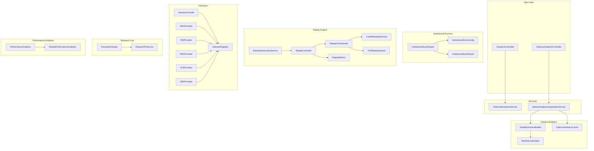
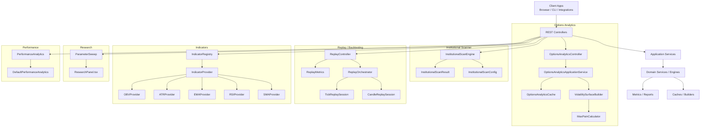
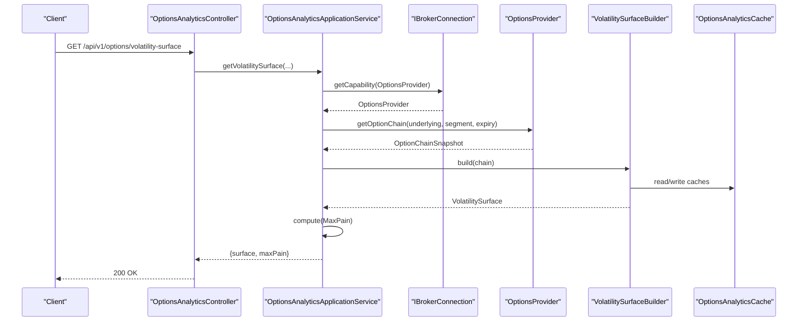
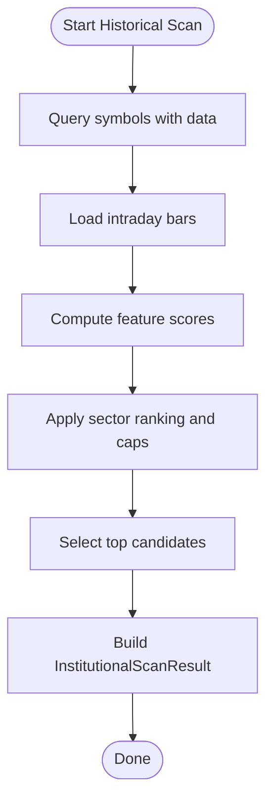
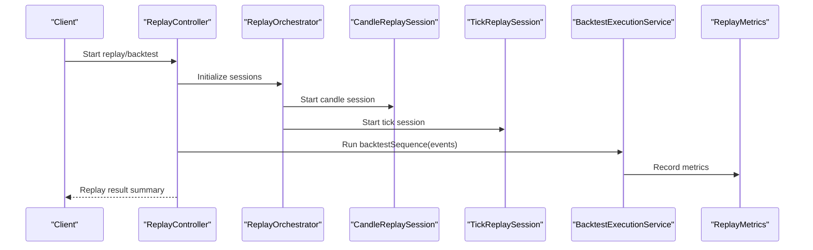
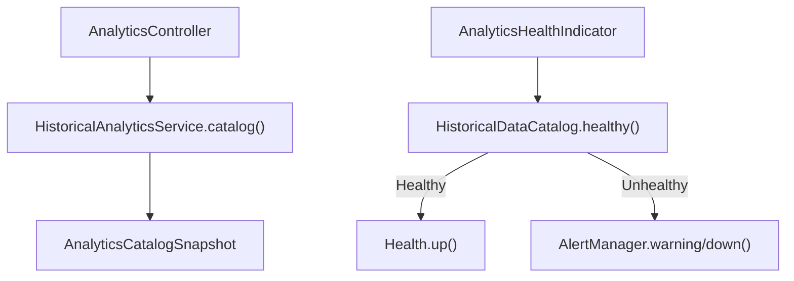
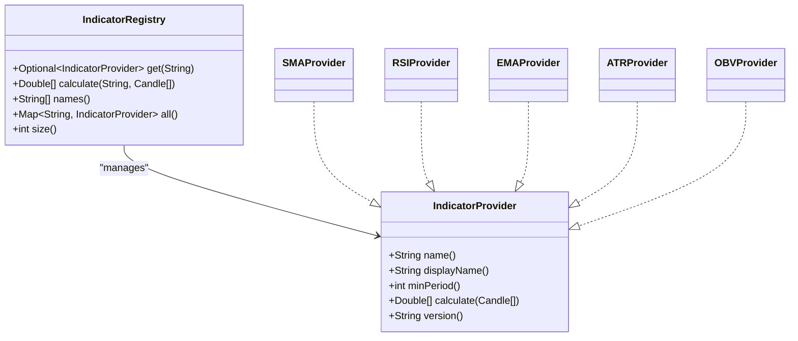
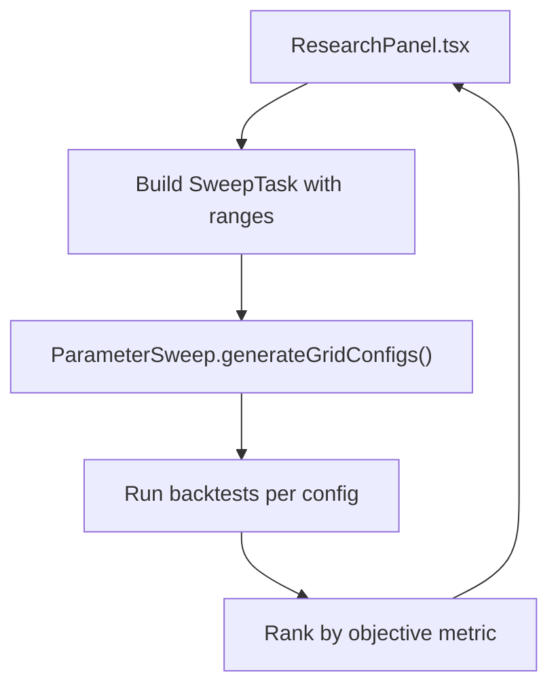
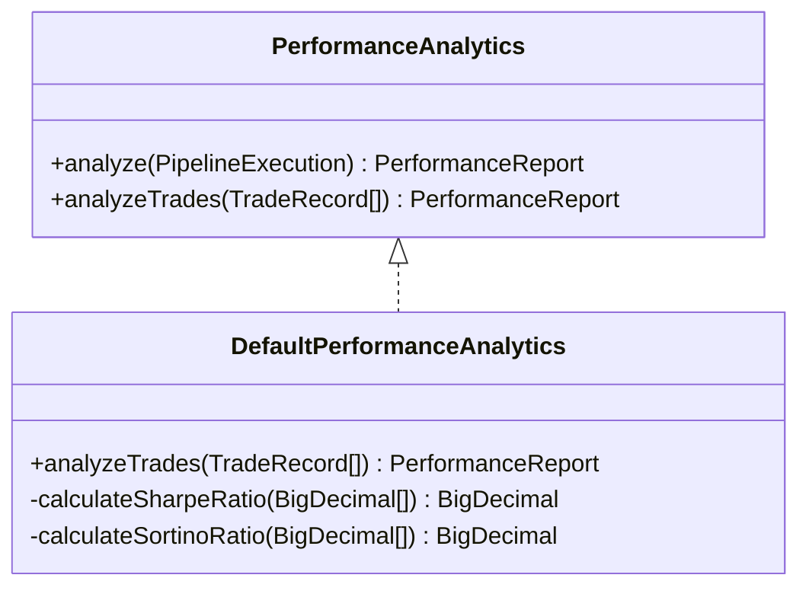
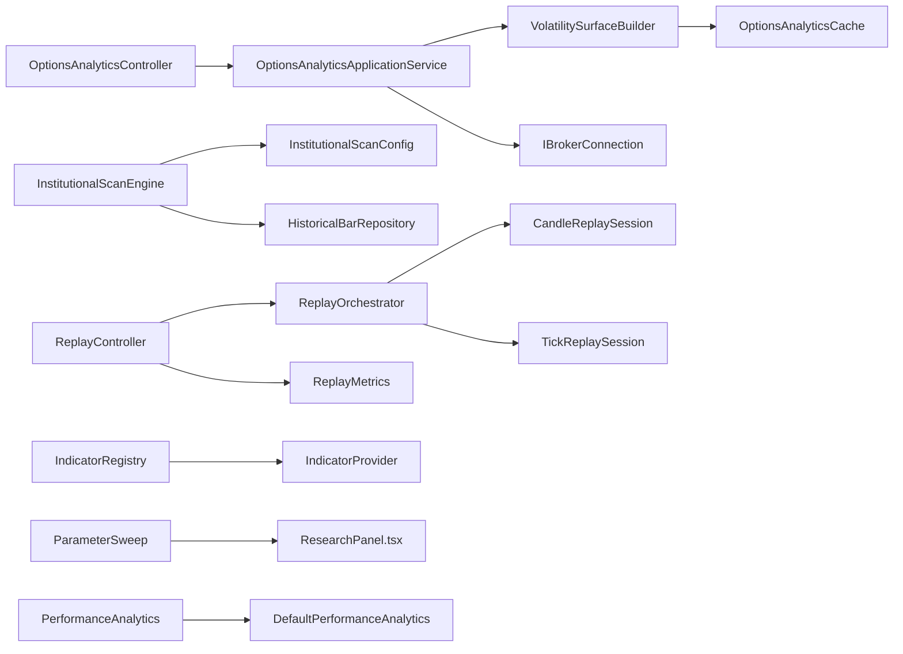

# Analytics & Insights

<cite>
**Referenced Files in This Document**
- [OptionsAnalyticsController.java](file://app/src/main/java/com/tradej/app/api/OptionsAnalyticsController.java)
- [OptionsAnalyticsApplicationService.java](file://app/src/main/java/com/tradej/app/service/OptionsAnalyticsApplicationService.java)
- [OptionsAnalyticsCache.java](file://trading/options-analytics/src/main/java/com/tradej/options/greeks/OptionsAnalyticsCache.java)
- [VolatilitySurfaceBuilder.java](file://trading/options-analytics/src/main/java/com/tradej/options/surface/VolatilitySurfaceBuilder.java)
- [MaxPainCalculator.java](file://trading/options-analytics/src/main/java/com/tradej/options/calculator/MaxPainCalculator.java)
- [InstitutionalScanEngine.java](file://trading/institutional-scanner/src/main/java/com/tradej/institutional/InstitutionalScanEngine.java)
- [InstitutionalScanConfig.java](file://trading/institutional-scanner/src/main/java/com/tradej/institutional/model/InstitutionalScanConfig.java)
- [InstitutionalScanResult.java](file://trading/institutional-scanner/src/main/java/com/tradej/institutional/model/InstitutionalScanResult.java)
- [NoOpInstitutionalScanEngine.java](file://trading/institutional-scanner/src/main/java/com/tradej/institutional/NoOpInstitutionalScanEngine.java)
- [BacktestExecutionService.java](file://replay/engine/src/main/java/com/tradej/replay/engine/BacktestExecutionService.java)
- [ReplayController.java](file://replay/engine/src/main/java/com/tradej/replay/engine/ReplayController.java)
- [ReplayOrchestrator.java](file://replay/engine/src/main/java/com/tradej/replay/engine/ReplayOrchestrator.java)
- [CandleReplaySession.java](file://replay/engine/src/main/java/com/tradej/replay/engine/CandleReplaySession.java)
- [TickReplaySession.java](file://replay/engine/src/main/java/com/tradej/replay/engine/TickReplaySession.java)
- [ReplayMetrics.java](file://data/persistence/src/main/java/com/tradej/persistence/replay/ReplayMetrics.java)
- [AnalyticsController.java](file://app/src/main/java/com/tradej/app/api/AnalyticsController.java)
- [HistoricalAnalyticsService.java](file://core/src/main/java/com/tradej/core/domain/port/HistoricalAnalyticsService.java)
- [AnalyticsCatalogSnapshot.java](file://core/src/main/java/com/tradej/core/domain/model/AnalyticsCatalogSnapshot.java)
- [AnalyticsHealthIndicator.java](file://app/src/main/java/com/tradej/app/health/AnalyticsHealthIndicator.java)
- [IndicatorProvider.java](file://trading/indicators/src/main/java/com/tradej/indicators/spi/IndicatorProvider.java)
- [IndicatorRegistry.java](file://trading/indicators/src/main/java/com/tradej/indicators/spi/IndicatorRegistry.java)
- [SMAProvider.java](file://trading/indicators/src/main/java/com/tradej/indicators/spi/builtin/SMAProvider.java)
- [RSIProvider.java](file://trading/indicators/src/main/java/com/tradej/indicators/spi/builtin/RSIProvider.java)
- [EMAProvider.java](file://trading/indicators/src/main/java/com/tradej/indicators/spi/builtin/EMAProvider.java)
- [ATRProvider.java](file://trading/indicators/src/main/java/com/tradej/indicators/spi/builtin/ATRProvider.java)
- [OBVProvider.java](file://trading/indicators/src/main/java/com/tradej/indicators/spi/builtin/OBVProvider.java)
- [CliIndicatorsCommand.java](file://cli/src/main/java/com/tradej/cli/command/CliIndicatorsCommand.java)
- [ParameterSweep.java](file://research/lab/src/main/java/com/tradej/research/lab/ParameterSweep.java)
- [ResearchPanel.tsx](file://trade_j_frontend/src/components/ResearchPanel.tsx)
- [PerformanceAnalytics.java](file://pipeline/analytics/trade-analytics/src/main/java/com/tradej/analytics/PerformanceAnalytics.java)
- [DefaultPerformanceAnalytics.java](file://pipeline/analytics/trade-analytics/src/main/java/com/tradej/analytics/DefaultPerformanceAnalytics.java)
</cite>

## Table of Contents
1. [Introduction](#introduction)
2. [Project Structure](#project-structure)
3. [Core Components](#core-components)
4. [Architecture Overview](#architecture-overview)
5. [Detailed Component Analysis](#detailed-component-analysis)
6. [Dependency Analysis](#dependency-analysis)
7. [Performance Considerations](#performance-considerations)
8. [Troubleshooting Guide](#troubleshooting-guide)
9. [Conclusion](#conclusion)
10. [Appendices](#appendices)

## Introduction
This document presents TradeJ’s analytics and insights capabilities across options analytics, market scanning, technical indicators, backtesting and replay, performance analytics, research labs, and reporting. It explains how Greeks and volatility surfaces are computed, how institutional scans are executed, how the backtesting engine replays events, and how performance metrics are derived. It also documents the indicator framework, extensibility via SPI, and the research lab parameter sweep functionality.

## Project Structure
TradeJ organizes analytics-related functionality across several modules:
- Options analytics: REST controller, application service, caching, and volatility surface building
- Institutional scanning: configurable scan engine and results
- Replay/backtesting: orchestration, sessions, and metrics
- Analytics catalog and health: REST endpoints and health checks
- Indicators: SPI-based provider framework with built-in implementations
- Research lab: parameter sweep generation and frontend integration
- Performance analytics: interfaces and default implementations for performance metrics

**Diagram sources**
- [AnalyticsController.java:32-50](file://app/src/main/java/com/tradej/app/api/AnalyticsController.java#L32-L50)
- [OptionsAnalyticsController.java:1-35](file://app/src/main/java/com/tradej/app/api/OptionsAnalyticsController.java#L1-L35)
- [OptionsAnalyticsApplicationService.java:1-62](file://app/src/main/java/com/tradej/app/service/OptionsAnalyticsApplicationService.java#L1-L62)
- [VolatilitySurfaceBuilder.java:1-23](file://trading/options-analytics/src/main/java/com/tradej/options/surface/VolatilitySurfaceBuilder.java#L1-L23)
- [OptionsAnalyticsCache.java:1-37](file://trading/options-analytics/src/main/java/com/tradej/options/greeks/OptionsAnalyticsCache.java#L1-L37)
- [MaxPainCalculator.java](file://trading/options-analytics/src/main/java/com/tradej/options/calculator/MaxPainCalculator.java)
- [InstitutionalScanEngine.java:1-61](file://trading/institutional-scanner/src/main/java/com/tradej/institutional/InstitutionalScanEngine.java#L1-L61)
- [InstitutionalScanConfig.java:1-30](file://trading/institutional-scanner/src/main/java/com/tradej/institutional/model/InstitutionalScanConfig.java#L1-L30)
- [InstitutionalScanResult.java:1-14](file://trading/institutional-scanner/src/main/java/com/tradej/institutional/model/InstitutionalScanResult.java#L1-L14)
- [BacktestExecutionService.java:1-45](file://replay/engine/src/main/java/com/tradej/replay/engine/BacktestExecutionService.java#L1-L45)
- [ReplayController.java](file://replay/engine/src/main/java/com/tradej/replay/engine/ReplayController.java)
- [ReplayOrchestrator.java](file://replay/engine/src/main/java/com/tradej/replay/engine/ReplayOrchestrator.java)
- [CandleReplaySession.java](file://replay/engine/src/main/java/com/tradej/replay/engine/CandleReplaySession.java)
- [TickReplaySession.java](file://replay/engine/src/main/java/com/tradej/replay/engine/TickReplaySession.java)
- [ReplayMetrics.java:1-37](file://data/persistence/src/main/java/com/tradej/persistence/replay/ReplayMetrics.java#L1-L37)
- [IndicatorProvider.java:1-62](file://trading/indicators/src/main/java/com/tradej/indicators/spi/IndicatorProvider.java#L1-L62)
- [IndicatorRegistry.java:65-104](file://trading/indicators/src/main/java/com/tradej/indicators/spi/IndicatorRegistry.java#L65-L104)
- [SMAProvider.java:1-15](file://trading/indicators/src/main/java/com/tradej/indicators/spi/builtin/SMAProvider.java#L1-L15)
- [RSIProvider.java:1-15](file://trading/indicators/src/main/java/com/tradej/indicators/spi/builtin/RSIProvider.java#L1-L15)
- [EMAProvider.java:1-15](file://trading/indicators/src/main/java/com/tradej/indicators/spi/builtin/EMAProvider.java#L1-L15)
- [ATRProvider.java:1-15](file://trading/indicators/src/main/java/com/tradej/indicators/spi/builtin/ATRProvider.java#L1-L15)
- [OBVProvider.java:1-20](file://trading/indicators/src/main/java/com/tradej/indicators/spi/builtin/OBVProvider.java#L1-L20)
- [ParameterSweep.java:1-37](file://research/lab/src/main/java/com/tradej/research/lab/ParameterSweep.java#L1-L37)
- [ResearchPanel.tsx:583-844](file://trade_j_frontend/src/components/ResearchPanel.tsx#L583-L844)
- [PerformanceAnalytics.java:1-20](file://pipeline/analytics/trade-analytics/src/main/java/com/tradej/analytics/PerformanceAnalytics.java#L1-L20)
- [DefaultPerformanceAnalytics.java:113-176](file://pipeline/analytics/trade-analytics/src/main/java/com/tradej/analytics/DefaultPerformanceAnalytics.java#L113-L176)

**Section sources**
- [AnalyticsController.java:32-50](file://app/src/main/java/com/tradej/app/api/AnalyticsController.java#L32-L50)
- [OptionsAnalyticsController.java:1-35](file://app/src/main/java/com/tradej/app/api/OptionsAnalyticsController.java#L1-L35)
- [OptionsAnalyticsApplicationService.java:1-62](file://app/src/main/java/com/tradej/app/service/OptionsAnalyticsApplicationService.java#L1-L62)
- [VolatilitySurfaceBuilder.java:1-23](file://trading/options-analytics/src/main/java/com/tradej/options/surface/VolatilitySurfaceBuilder.java#L1-L23)
- [OptionsAnalyticsCache.java:1-37](file://trading/options-analytics/src/main/java/com/tradej/options/greeks/OptionsAnalyticsCache.java#L1-L37)
- [MaxPainCalculator.java](file://trading/options-analytics/src/main/java/com/tradej/options/calculator/MaxPainCalculator.java)
- [InstitutionalScanEngine.java:1-61](file://trading/institutional-scanner/src/main/java/com/tradej/institutional/InstitutionalScanEngine.java#L1-L61)
- [InstitutionalScanConfig.java:1-30](file://trading/institutional-scanner/src/main/java/com/tradej/institutional/model/InstitutionalScanConfig.java#L1-L30)
- [InstitutionalScanResult.java:1-14](file://trading/institutional-scanner/src/main/java/com/tradej/institutional/model/InstitutionalScanResult.java#L1-L14)
- [BacktestExecutionService.java:1-45](file://replay/engine/src/main/java/com/tradej/replay/engine/BacktestExecutionService.java#L1-L45)
- [ReplayController.java](file://replay/engine/src/main/java/com/tradej/replay/engine/ReplayController.java)
- [ReplayOrchestrator.java](file://replay/engine/src/main/java/com/tradej/replay/engine/ReplayOrchestrator.java)
- [CandleReplaySession.java](file://replay/engine/src/main/java/com/tradej/replay/engine/CandleReplaySession.java)
- [TickReplaySession.java](file://replay/engine/src/main/java/com/tradej/replay/engine/TickReplaySession.java)
- [ReplayMetrics.java:1-37](file://data/persistence/src/main/java/com/tradej/persistence/replay/ReplayMetrics.java#L1-L37)
- [IndicatorProvider.java:1-62](file://trading/indicators/src/main/java/com/tradej/indicators/spi/IndicatorProvider.java#L1-L62)
- [IndicatorRegistry.java:65-104](file://trading/indicators/src/main/java/com/tradej/indicators/spi/IndicatorRegistry.java#L65-L104)
- [SMAProvider.java:1-15](file://trading/indicators/src/main/java/com/tradej/indicators/spi/builtin/SMAProvider.java#L1-L15)
- [RSIProvider.java:1-15](file://trading/indicators/src/main/java/com/tradej/indicators/spi/builtin/RSIProvider.java#L1-L15)
- [EMAProvider.java:1-15](file://trading/indicators/src/main/java/com/tradej/indicators/spi/builtin/EMAProvider.java#L1-L15)
- [ATRProvider.java:1-15](file://trading/indicators/src/main/java/com/tradej/indicators/spi/builtin/ATRProvider.java#L1-L15)
- [OBVProvider.java:1-20](file://trading/indicators/src/main/java/com/tradej/indicators/spi/builtin/OBVProvider.java#L1-L20)
- [ParameterSweep.java:1-37](file://research/lab/src/main/java/com/tradej/research/lab/ParameterSweep.java#L1-L37)
- [ResearchPanel.tsx:583-844](file://trade_j_frontend/src/components/ResearchPanel.tsx#L583-L844)
- [PerformanceAnalytics.java:1-20](file://pipeline/analytics/trade-analytics/src/main/java/com/tradej/analytics/PerformanceAnalytics.java#L1-L20)
- [DefaultPerformanceAnalytics.java:113-176](file://pipeline/analytics/trade-analytics/src/main/java/com/tradej/analytics/DefaultPerformanceAnalytics.java#L113-L176)

## Core Components
- Options analytics: REST endpoint exposes volatility surface and max pain calculations backed by an options provider and a volatility surface builder with caching.
- Institutional scanner: configurable scan engine that computes scores across sectors and selects candidates based on weights and limits.
- Replay/backtesting: orchestrated replay sessions with metrics and state isolation, enabling deterministic backtests.
- Analytics catalog and health: REST endpoints expose catalog snapshots and health status for analytics subsystems.
- Indicators: SPI-based provider framework with built-in implementations (SMA, RSI, EMA, ATR, OBV) and discovery via registry.
- Research lab: parameter sweep generation for grid search across strategy configurations.
- Performance analytics: interfaces and default implementations for performance metrics (Sharpe, Sortino, Calmar, win rate, etc.).

**Section sources**
- [OptionsAnalyticsController.java:1-35](file://app/src/main/java/com/tradej/app/api/OptionsAnalyticsController.java#L1-L35)
- [OptionsAnalyticsApplicationService.java:1-62](file://app/src/main/java/com/tradej/app/service/OptionsAnalyticsApplicationService.java#L1-L62)
- [VolatilitySurfaceBuilder.java:1-23](file://trading/options-analytics/src/main/java/com/tradej/options/surface/VolatilitySurfaceBuilder.java#L1-L23)
- [OptionsAnalyticsCache.java:1-37](file://trading/options-analytics/src/main/java/com/tradej/options/greeks/OptionsAnalyticsCache.java#L1-L37)
- [MaxPainCalculator.java](file://trading/options-analytics/src/main/java/com/tradej/options/calculator/MaxPainCalculator.java)
- [InstitutionalScanEngine.java:1-61](file://trading/institutional-scanner/src/main/java/com/tradej/institutional/InstitutionalScanEngine.java#L1-L61)
- [InstitutionalScanConfig.java:1-30](file://trading/institutional-scanner/src/main/java/com/tradej/institutional/model/InstitutionalScanConfig.java#L1-L30)
- [InstitutionalScanResult.java:1-14](file://trading/institutional-scanner/src/main/java/com/tradej/institutional/model/InstitutionalScanResult.java#L1-L14)
- [BacktestExecutionService.java:1-45](file://replay/engine/src/main/java/com/tradej/replay/engine/BacktestExecutionService.java#L1-L45)
- [ReplayController.java](file://replay/engine/src/main/java/com/tradej/replay/engine/ReplayController.java)
- [ReplayOrchestrator.java](file://replay/engine/src/main/java/com/tradej/replay/engine/ReplayOrchestrator.java)
- [CandleReplaySession.java](file://replay/engine/src/main/java/com/tradej/replay/engine/CandleReplaySession.java)
- [TickReplaySession.java](file://replay/engine/src/main/java/com/tradej/replay/engine/TickReplaySession.java)
- [ReplayMetrics.java:1-37](file://data/persistence/src/main/java/com/tradej/persistence/replay/ReplayMetrics.java#L1-L37)
- [AnalyticsController.java:32-50](file://app/src/main/java/com/tradej/app/api/AnalyticsController.java#L32-L50)
- [HistoricalAnalyticsService.java:1-24](file://core/src/main/java/com/tradej/core/domain/port/HistoricalAnalyticsService.java#L1-L24)
- [AnalyticsCatalogSnapshot.java:1-21](file://core/src/main/java/com/tradej/core/domain/model/AnalyticsCatalogSnapshot.java#L1-L21)
- [AnalyticsHealthIndicator.java:1-36](file://app/src/main/java/com/tradej/app/health/AnalyticsHealthIndicator.java#L1-L36)
- [IndicatorProvider.java:1-62](file://trading/indicators/src/main/java/com/tradej/indicators/spi/IndicatorProvider.java#L1-L62)
- [IndicatorRegistry.java:65-104](file://trading/indicators/src/main/java/com/tradej/indicators/spi/IndicatorRegistry.java#L65-L104)
- [ParameterSweep.java:1-37](file://research/lab/src/main/java/com/tradej/research/lab/ParameterSweep.java#L1-L37)
- [PerformanceAnalytics.java:1-20](file://pipeline/analytics/trade-analytics/src/main/java/com/tradej/analytics/PerformanceAnalytics.java#L1-L20)
- [DefaultPerformanceAnalytics.java:113-176](file://pipeline/analytics/trade-analytics/src/main/java/com/tradej/analytics/DefaultPerformanceAnalytics.java#L113-L176)

## Architecture Overview
The analytics subsystem integrates REST controllers, application services, domain services, and specialized engines. Options analytics relies on broker capabilities and caches for performance. Institutional scanning queries historical bars and computes sector-aware scores. Replay/backtesting orchestrates deterministic event playback. Indicators are pluggable via SPI. Research lab generates strategy configurations for parameter sweeps. Performance analytics computes standardized metrics.

**Diagram sources**
- [OptionsAnalyticsController.java:1-35](file://app/src/main/java/com/tradej/app/api/OptionsAnalyticsController.java#L1-L35)
- [OptionsAnalyticsApplicationService.java:1-62](file://app/src/main/java/com/tradej/app/service/OptionsAnalyticsApplicationService.java#L1-L62)
- [VolatilitySurfaceBuilder.java:1-23](file://trading/options-analytics/src/main/java/com/tradej/options/surface/VolatilitySurfaceBuilder.java#L1-L23)
- [OptionsAnalyticsCache.java:1-37](file://trading/options-analytics/src/main/java/com/tradej/options/greeks/OptionsAnalyticsCache.java#L1-L37)
- [MaxPainCalculator.java](file://trading/options-analytics/src/main/java/com/tradej/options/calculator/MaxPainCalculator.java)
- [InstitutionalScanEngine.java:1-61](file://trading/institutional-scanner/src/main/java/com/tradej/institutional/InstitutionalScanEngine.java#L1-L61)
- [InstitutionalScanConfig.java:1-30](file://trading/institutional-scanner/src/main/java/com/tradej/institutional/model/InstitutionalScanConfig.java#L1-L30)
- [InstitutionalScanResult.java:1-14](file://trading/institutional-scanner/src/main/java/com/tradej/institutional/model/InstitutionalScanResult.java#L1-L14)
- [BacktestExecutionService.java:1-45](file://replay/engine/src/main/java/com/tradej/replay/engine/BacktestExecutionService.java#L1-L45)
- [ReplayController.java](file://replay/engine/src/main/java/com/tradej/replay/engine/ReplayController.java)
- [ReplayOrchestrator.java](file://replay/engine/src/main/java/com/tradej/replay/engine/ReplayOrchestrator.java)
- [CandleReplaySession.java](file://replay/engine/src/main/java/com/tradej/replay/engine/CandleReplaySession.java)
- [TickReplaySession.java](file://replay/engine/src/main/java/com/tradej/replay/engine/TickReplaySession.java)
- [ReplayMetrics.java:1-37](file://data/persistence/src/main/java/com/tradej/persistence/replay/ReplayMetrics.java#L1-L37)
- [IndicatorProvider.java:1-62](file://trading/indicators/src/main/java/com/tradej/indicators/spi/IndicatorProvider.java#L1-L62)
- [IndicatorRegistry.java:65-104](file://trading/indicators/src/main/java/com/tradej/indicators/spi/IndicatorRegistry.java#L65-L104)
- [SMAProvider.java:1-15](file://trading/indicators/src/main/java/com/tradej/indicators/spi/builtin/SMAProvider.java#L1-L15)
- [RSIProvider.java:1-15](file://trading/indicators/src/main/java/com/tradej/indicators/spi/builtin/RSIProvider.java#L1-L15)
- [EMAProvider.java:1-15](file://trading/indicators/src/main/java/com/tradej/indicators/spi/builtin/EMAProvider.java#L1-L15)
- [ATRProvider.java:1-15](file://trading/indicators/src/main/java/com/tradej/indicators/spi/builtin/ATRProvider.java#L1-L15)
- [OBVProvider.java:1-20](file://trading/indicators/src/main/java/com/tradej/indicators/spi/builtin/OBVProvider.java#L1-L20)
- [ParameterSweep.java:1-37](file://research/lab/src/main/java/com/tradej/research/lab/ParameterSweep.java#L1-L37)
- [ResearchPanel.tsx:583-844](file://trade_j_frontend/src/components/ResearchPanel.tsx#L583-L844)
- [PerformanceAnalytics.java:1-20](file://pipeline/analytics/trade-analytics/src/main/java/com/tradej/analytics/PerformanceAnalytics.java#L1-L20)
- [DefaultPerformanceAnalytics.java:113-176](file://pipeline/analytics/trade-analytics/src/main/java/com/tradej/analytics/DefaultPerformanceAnalytics.java#L113-L176)

## Detailed Component Analysis

### Options Analytics System
- REST endpoint: Exposes volatility surface and max pain for an underlying and expiry.
- Application service: Retrieves option chain from broker, builds volatility surface, and computes max pain.
- Surface builder: Uses cached Greeks and IV surfaces; applies risk-free rate and time-to-expiry logic.
- Cache: LRU caches for Greeks, gamma exposure, and IV surfaces with TTL.

**Diagram sources**
- [OptionsAnalyticsController.java:1-35](file://app/src/main/java/com/tradej/app/api/OptionsAnalyticsController.java#L1-L35)
- [OptionsAnalyticsApplicationService.java:1-62](file://app/src/main/java/com/tradej/app/service/OptionsAnalyticsApplicationService.java#L1-L62)
- [VolatilitySurfaceBuilder.java:1-23](file://trading/options-analytics/src/main/java/com/tradej/options/surface/VolatilitySurfaceBuilder.java#L1-L23)
- [OptionsAnalyticsCache.java:1-37](file://trading/options-analytics/src/main/java/com/tradej/options/greeks/OptionsAnalyticsCache.java#L1-L37)
- [MaxPainCalculator.java](file://trading/options-analytics/src/main/java/com/tradej/options/calculator/MaxPainCalculator.java)

**Section sources**
- [OptionsAnalyticsController.java:1-35](file://app/src/main/java/com/tradej/app/api/OptionsAnalyticsController.java#L1-L35)
- [OptionsAnalyticsApplicationService.java:1-62](file://app/src/main/java/com/tradej/app/service/OptionsAnalyticsApplicationService.java#L1-L62)
- [VolatilitySurfaceBuilder.java:1-23](file://trading/options-analytics/src/main/java/com/tradej/options/surface/VolatilitySurfaceBuilder.java#L1-L23)
- [OptionsAnalyticsCache.java:1-37](file://trading/options-analytics/src/main/java/com/tradej/options/greeks/OptionsAnalyticsCache.java#L1-L37)

### Institutional Screening Engine
- Configurable scoring weights and limits for stocks, top-N selections, and per-sector caps.
- Historical scan runs against intraday bars, computes scores, ranks by sector, and returns candidates.

**Diagram sources**
- [InstitutionalScanEngine.java:1-61](file://trading/institutional-scanner/src/main/java/com/tradej/institutional/InstitutionalScanEngine.java#L1-L61)
- [InstitutionalScanConfig.java:1-30](file://trading/institutional-scanner/src/main/java/com/tradej/institutional/model/InstitutionalScanConfig.java#L1-L30)
- [InstitutionalScanResult.java:1-14](file://trading/institutional-scanner/src/main/java/com/tradej/institutional/model/InstitutionalScanResult.java#L1-L14)

**Section sources**
- [InstitutionalScanEngine.java:1-61](file://trading/institutional-scanner/src/main/java/com/tradej/institutional/InstitutionalScanEngine.java#L1-L61)
- [InstitutionalScanConfig.java:1-30](file://trading/institutional-scanner/src/main/java/com/tradej/institutional/model/InstitutionalScanConfig.java#L1-L30)
- [InstitutionalScanResult.java:1-14](file://trading/institutional-scanner/src/main/java/com/tradej/institutional/model/InstitutionalScanResult.java#L1-L14)

### Backtesting Engine and Replay Functionality
- Backtest execution service runs a pipeline backtest sequence with a fill model and state manager lifecycle.
- Replay controller orchestrates replay sessions (tick/candle), manages virtual clock and state isolation.
- Replay metrics track events processed, failures, durations, and throughput.

**Diagram sources**
- [BacktestExecutionService.java:1-45](file://replay/engine/src/main/java/com/tradej/replay/engine/BacktestExecutionService.java#L1-L45)
- [ReplayController.java](file://replay/engine/src/main/java/com/tradej/replay/engine/ReplayController.java)
- [ReplayOrchestrator.java](file://replay/engine/src/main/java/com/tradej/replay/engine/ReplayOrchestrator.java)
- [CandleReplaySession.java](file://replay/engine/src/main/java/com/tradej/replay/engine/CandleReplaySession.java)
- [TickReplaySession.java](file://replay/engine/src/main/java/com/tradej/replay/engine/TickReplaySession.java)
- [ReplayMetrics.java:1-37](file://data/persistence/src/main/java/com/tradej/persistence/replay/ReplayMetrics.java#L1-L37)

**Section sources**
- [BacktestExecutionService.java:1-45](file://replay/engine/src/main/java/com/tradej/replay/engine/BacktestExecutionService.java#L1-L45)
- [ReplayController.java](file://replay/engine/src/main/java/com/tradej/replay/engine/ReplayController.java)
- [ReplayOrchestrator.java](file://replay/engine/src/main/java/com/tradej/replay/engine/ReplayOrchestrator.java)
- [CandleReplaySession.java](file://replay/engine/src/main/java/com/tradej/replay/engine/CandleReplaySession.java)
- [TickReplaySession.java](file://replay/engine/src/main/java/com/tradej/replay/engine/TickReplaySession.java)
- [ReplayMetrics.java:1-37](file://data/persistence/src/main/java/com/tradej/persistence/replay/ReplayMetrics.java#L1-L37)

### Analytics Catalog and Reporting
- REST endpoint returns an analytics catalog snapshot with equity and options coverage, date ranges, and attached data sources.
- Health indicator reports catalog health and emits alerts when missing equity symbols.

**Diagram sources**
- [AnalyticsController.java:32-50](file://app/src/main/java/com/tradej/app/api/AnalyticsController.java#L32-L50)
- [HistoricalAnalyticsService.java:1-24](file://core/src/main/java/com/tradej/core/domain/port/HistoricalAnalyticsService.java#L1-L24)
- [AnalyticsCatalogSnapshot.java:1-21](file://core/src/main/java/com/tradej/core/domain/model/AnalyticsCatalogSnapshot.java#L1-L21)
- [AnalyticsHealthIndicator.java:1-36](file://app/src/main/java/com/tradej/app/health/AnalyticsHealthIndicator.java#L1-L36)

**Section sources**
- [AnalyticsController.java:32-50](file://app/src/main/java/com/tradej/app/api/AnalyticsController.java#L32-L50)
- [HistoricalAnalyticsService.java:1-24](file://core/src/main/java/com/tradej/core/domain/port/HistoricalAnalyticsService.java#L1-L24)
- [AnalyticsCatalogSnapshot.java:1-21](file://core/src/main/java/com/tradej/core/domain/model/AnalyticsCatalogSnapshot.java#L1-L21)
- [AnalyticsHealthIndicator.java:1-36](file://app/src/main/java/com/tradej/app/health/AnalyticsHealthIndicator.java#L1-L36)

### Technical Indicator Framework
- SPI defines indicator providers with name, display name, minimum period, and calculation method.
- Registry discovers providers via ServiceLoader and supports lookup and bulk calculation.
- Built-in providers include SMA, RSI, EMA, ATR, and OBV.

**Diagram sources**
- [IndicatorProvider.java:1-62](file://trading/indicators/src/main/java/com/tradej/indicators/spi/IndicatorProvider.java#L1-L62)
- [IndicatorRegistry.java:65-104](file://trading/indicators/src/main/java/com/tradej/indicators/spi/IndicatorRegistry.java#L65-L104)
- [SMAProvider.java:1-15](file://trading/indicators/src/main/java/com/tradej/indicators/spi/builtin/SMAProvider.java#L1-L15)
- [RSIProvider.java:1-15](file://trading/indicators/src/main/java/com/tradej/indicators/spi/builtin/RSIProvider.java#L1-L15)
- [EMAProvider.java:1-15](file://trading/indicators/src/main/java/com/tradej/indicators/spi/builtin/EMAProvider.java#L1-L15)
- [ATRProvider.java:1-15](file://trading/indicators/src/main/java/com/tradej/indicators/spi/builtin/ATRProvider.java#L1-L15)
- [OBVProvider.java:1-20](file://trading/indicators/src/main/java/com/tradej/indicators/spi/builtin/OBVProvider.java#L1-L20)

**Section sources**
- [IndicatorProvider.java:1-62](file://trading/indicators/src/main/java/com/tradej/indicators/spi/IndicatorProvider.java#L1-L62)
- [IndicatorRegistry.java:65-104](file://trading/indicators/src/main/java/com/tradej/indicators/spi/IndicatorRegistry.java#L65-L104)
- [SMAProvider.java:1-15](file://trading/indicators/src/main/java/com/tradej/indicators/spi/builtin/SMAProvider.java#L1-L15)
- [RSIProvider.java:1-15](file://trading/indicators/src/main/java/com/tradej/indicators/spi/builtin/RSIProvider.java#L1-L15)
- [EMAProvider.java:1-15](file://trading/indicators/src/main/java/com/tradej/indicators/spi/builtin/EMAProvider.java#L1-L15)
- [ATRProvider.java:1-15](file://trading/indicators/src/main/java/com/tradej/indicators/spi/builtin/ATRProvider.java#L1-L15)
- [OBVProvider.java:1-20](file://trading/indicators/src/main/java/com/tradej/indicators/spi/builtin/OBVProvider.java#L1-L20)

### Research Lab and Parameter Sweep
- Parameter sweep generates Cartesian product configurations for multi-variable grid search.
- Frontend panel collects strategy parameters, ranges, and objective metric, then submits sweep tasks.

**Diagram sources**
- [ParameterSweep.java:1-37](file://research/lab/src/main/java/com/tradej/research/lab/ParameterSweep.java#L1-L37)
- [ResearchPanel.tsx:583-844](file://trade_j_frontend/src/components/ResearchPanel.tsx#L583-L844)

**Section sources**
- [ParameterSweep.java:1-37](file://research/lab/src/main/java/com/tradej/research/lab/ParameterSweep.java#L1-L37)
- [ResearchPanel.tsx:583-844](file://trade_j_frontend/src/components/ResearchPanel.tsx#L583-L844)

### Performance Analytics
- Interfaces define performance analysis over pipeline executions or trade records.
- Default implementation computes Sharpe, Sortino, Calmar, win rate, profit factor, expectancy, and more.

**Diagram sources**
- [PerformanceAnalytics.java:1-20](file://pipeline/analytics/trade-analytics/src/main/java/com/tradej/analytics/PerformanceAnalytics.java#L1-L20)
- [DefaultPerformanceAnalytics.java:113-176](file://pipeline/analytics/trade-analytics/src/main/java/com/tradej/analytics/DefaultPerformanceAnalytics.java#L113-L176)

**Section sources**
- [PerformanceAnalytics.java:1-20](file://pipeline/analytics/trade-analytics/src/main/java/com/tradej/analytics/PerformanceAnalytics.java#L1-L20)
- [DefaultPerformanceAnalytics.java:113-176](file://pipeline/analytics/trade-analytics/src/main/java/com/tradej/analytics/DefaultPerformanceAnalytics.java#L113-L176)

## Dependency Analysis
- Options analytics depends on broker options provider, volatility surface builder, and cache.
- Institutional scanning depends on historical bar repository and configuration.
- Replay/backtesting depends on pipeline runtime and replay state manager.
- Indicators depend on SPI registry and built-in provider implementations.
- Research lab depends on parameter sweep and frontend integration.
- Performance analytics depends on trade records and returns series.

**Diagram sources**
- [OptionsAnalyticsController.java:1-35](file://app/src/main/java/com/tradej/app/api/OptionsAnalyticsController.java#L1-L35)
- [OptionsAnalyticsApplicationService.java:1-62](file://app/src/main/java/com/tradej/app/service/OptionsAnalyticsApplicationService.java#L1-L62)
- [VolatilitySurfaceBuilder.java:1-23](file://trading/options-analytics/src/main/java/com/tradej/options/surface/VolatilitySurfaceBuilder.java#L1-L23)
- [OptionsAnalyticsCache.java:1-37](file://trading/options-analytics/src/main/java/com/tradej/options/greeks/OptionsAnalyticsCache.java#L1-L37)
- [InstitutionalScanEngine.java:1-61](file://trading/institutional-scanner/src/main/java/com/tradej/institutional/InstitutionalScanEngine.java#L1-L61)
- [InstitutionalScanConfig.java:1-30](file://trading/institutional-scanner/src/main/java/com/tradej/institutional/model/InstitutionalScanConfig.java#L1-L30)
- [ReplayController.java](file://replay/engine/src/main/java/com/tradej/replay/engine/ReplayController.java)
- [ReplayOrchestrator.java](file://replay/engine/src/main/java/com/tradej/replay/engine/ReplayOrchestrator.java)
- [CandleReplaySession.java](file://replay/engine/src/main/java/com/tradej/replay/engine/CandleReplaySession.java)
- [TickReplaySession.java](file://replay/engine/src/main/java/com/tradej/replay/engine/TickReplaySession.java)
- [ReplayMetrics.java:1-37](file://data/persistence/src/main/java/com/tradej/persistence/replay/ReplayMetrics.java#L1-L37)
- [IndicatorRegistry.java:65-104](file://trading/indicators/src/main/java/com/tradej/indicators/spi/IndicatorRegistry.java#L65-L104)
- [IndicatorProvider.java:1-62](file://trading/indicators/src/main/java/com/tradej/indicators/spi/IndicatorProvider.java#L1-L62)
- [ParameterSweep.java:1-37](file://research/lab/src/main/java/com/tradej/research/lab/ParameterSweep.java#L1-L37)
- [ResearchPanel.tsx:583-844](file://trade_j_frontend/src/components/ResearchPanel.tsx#L583-L844)
- [PerformanceAnalytics.java:1-20](file://pipeline/analytics/trade-analytics/src/main/java/com/tradej/analytics/PerformanceAnalytics.java#L1-L20)
- [DefaultPerformanceAnalytics.java:113-176](file://pipeline/analytics/trade-analytics/src/main/java/com/tradej/analytics/DefaultPerformanceAnalytics.java#L113-L176)

**Section sources**
- [OptionsAnalyticsController.java:1-35](file://app/src/main/java/com/tradej/app/api/OptionsAnalyticsController.java#L1-L35)
- [OptionsAnalyticsApplicationService.java:1-62](file://app/src/main/java/com/tradej/app/service/OptionsAnalyticsApplicationService.java#L1-L62)
- [VolatilitySurfaceBuilder.java:1-23](file://trading/options-analytics/src/main/java/com/tradej/options/surface/VolatilitySurfaceBuilder.java#L1-L23)
- [OptionsAnalyticsCache.java:1-37](file://trading/options-analytics/src/main/java/com/tradej/options/greeks/OptionsAnalyticsCache.java#L1-L37)
- [InstitutionalScanEngine.java:1-61](file://trading/institutional-scanner/src/main/java/com/tradej/institutional/InstitutionalScanEngine.java#L1-L61)
- [InstitutionalScanConfig.java:1-30](file://trading/institutional-scanner/src/main/java/com/tradej/institutional/model/InstitutionalScanConfig.java#L1-L30)
- [ReplayController.java](file://replay/engine/src/main/java/com/tradej/replay/engine/ReplayController.java)
- [ReplayOrchestrator.java](file://replay/engine/src/main/java/com/tradej/replay/engine/ReplayOrchestrator.java)
- [CandleReplaySession.java](file://replay/engine/src/main/java/com/tradej/replay/engine/CandleReplaySession.java)
- [TickReplaySession.java](file://replay/engine/src/main/java/com/tradej/replay/engine/TickReplaySession.java)
- [ReplayMetrics.java:1-37](file://data/persistence/src/main/java/com/tradej/persistence/replay/ReplayMetrics.java#L1-L37)
- [IndicatorRegistry.java:65-104](file://trading/indicators/src/main/java/com/tradej/indicators/spi/IndicatorRegistry.java#L65-L104)
- [IndicatorProvider.java:1-62](file://trading/indicators/src/main/java/com/tradej/indicators/spi/IndicatorProvider.java#L1-L62)
- [ParameterSweep.java:1-37](file://research/lab/src/main/java/com/tradej/research/lab/ParameterSweep.java#L1-L37)
- [ResearchPanel.tsx:583-844](file://trade_j_frontend/src/components/ResearchPanel.tsx#L583-L844)
- [PerformanceAnalytics.java:1-20](file://pipeline/analytics/trade-analytics/src/main/java/com/tradej/analytics/PerformanceAnalytics.java#L1-L20)
- [DefaultPerformanceAnalytics.java:113-176](file://pipeline/analytics/trade-analytics/src/main/java/com/tradej/analytics/DefaultPerformanceAnalytics.java#L113-L176)

## Performance Considerations
- Options analytics caches reduce repeated computations for Greeks and IV surfaces; tune TTL and sizes for latency vs. freshness.
- Replay metrics enable monitoring throughput and failure rates; consider batching and state isolation overhead.
- Indicator calculations require sufficient history; ensure minPeriod thresholds are met to avoid NaN propagation.
- Parameter sweep grid size grows combinatorially; cap ranges and use early stopping or objective-driven pruning.

[No sources needed since this section provides general guidance]

## Troubleshooting Guide
- Options analytics endpoint returns errors when broker options provider is unavailable or analytics not enabled; verify broker connectivity and provider registration.
- Institutional scan fails if no symbols or intraday data are available for the selected date; confirm data availability and repository configuration.
- Replay/backtest returns unknown graph errors if pipeline graph is inactive; ensure graph activation and runtime readiness.
- Analytics catalog health down indicates missing equity symbols; check catalog population and alert manager notifications.
- Indicator registry returns empty lists for unregistered names; verify SPI registration and provider names.

**Section sources**
- [OptionsAnalyticsApplicationService.java:1-62](file://app/src/main/java/com/tradej/app/service/OptionsAnalyticsApplicationService.java#L1-L62)
- [InstitutionalScanEngine.java:1-61](file://trading/institutional-scanner/src/main/java/com/tradej/institutional/InstitutionalScanEngine.java#L1-L61)
- [BacktestExecutionService.java:1-45](file://replay/engine/src/main/java/com/tradej/replay/engine/BacktestExecutionService.java#L1-L45)
- [AnalyticsHealthIndicator.java:1-36](file://app/src/main/java/com/tradej/app/health/AnalyticsHealthIndicator.java#L1-L36)
- [IndicatorRegistry.java:65-104](file://trading/indicators/src/main/java/com/tradej/indicators/spi/IndicatorRegistry.java#L65-L104)

## Conclusion
TradeJ’s analytics stack combines robust options analytics with volatility surfaces and max pain, institutional screening with configurable scoring, replay/backtesting for deterministic evaluation, a flexible indicator framework via SPI, and research lab parameter sweeps. Performance analytics provides standardized metrics for strategy evaluation. Together, these components enable comprehensive research, testing, and operational insights.

[No sources needed since this section summarizes without analyzing specific files]

## Appendices
- CLI indicator discovery: Use the CLI to enumerate registered indicator providers and their metadata.
- Frontend research panel: Configure parameter ranges and run sweeps directly from the terminal UI.

**Section sources**
- [CliIndicatorsCommand.java:1-41](file://cli/src/main/java/com/tradej/cli/command/CliIndicatorsCommand.java#L1-L41)
- [ResearchPanel.tsx:583-844](file://trade_j_frontend/src/components/ResearchPanel.tsx#L583-L844)