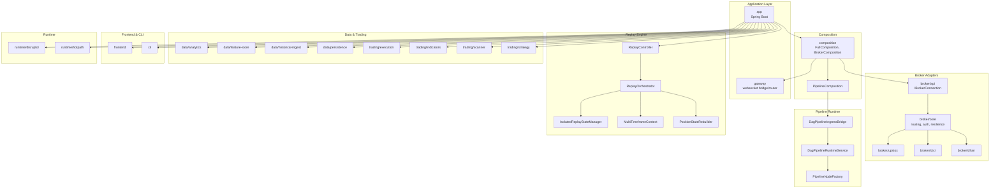
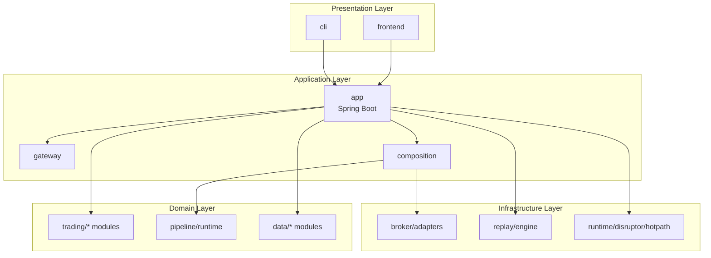
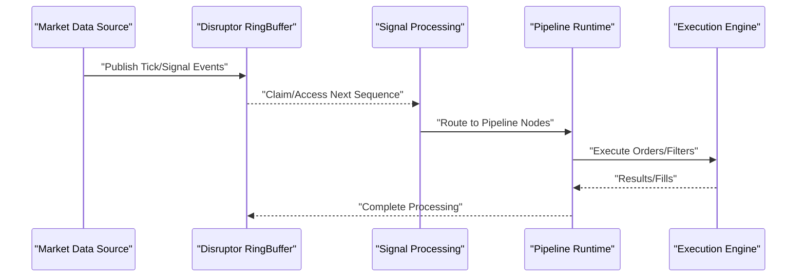
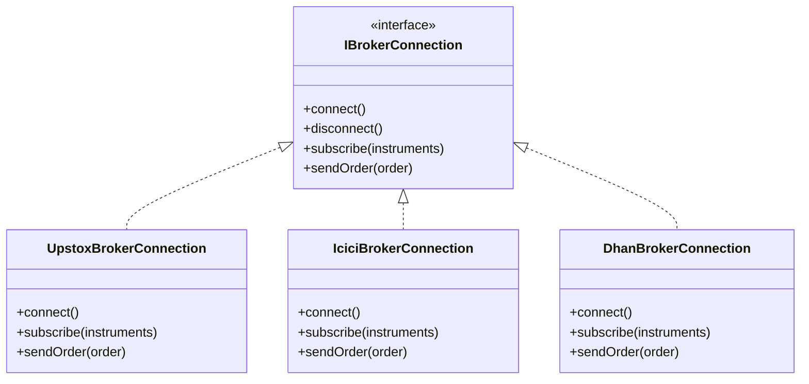
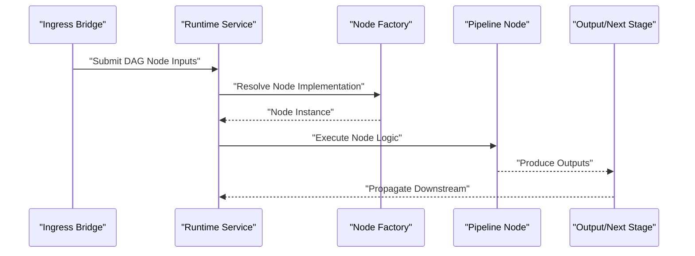
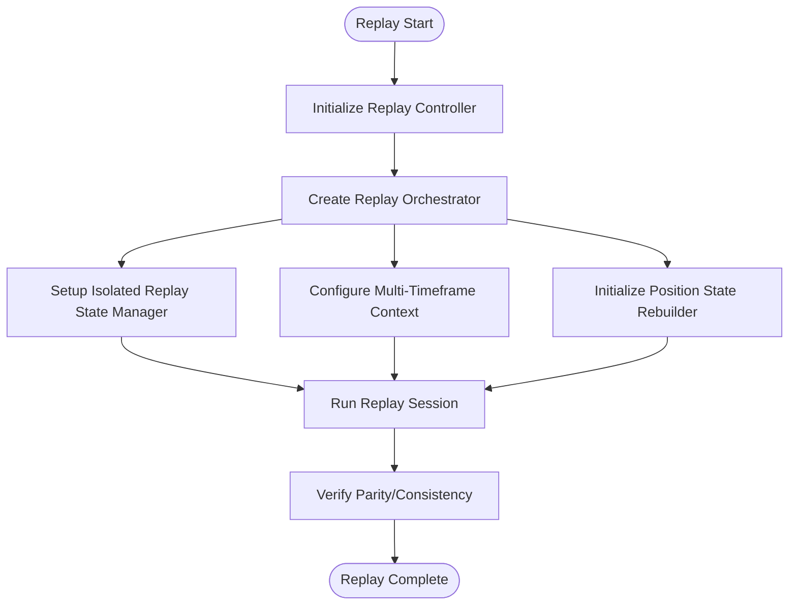
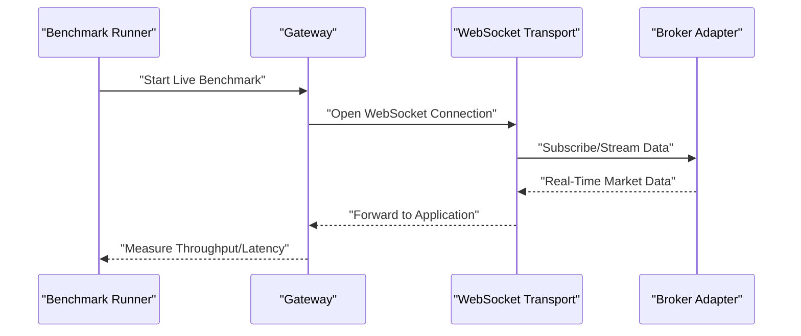
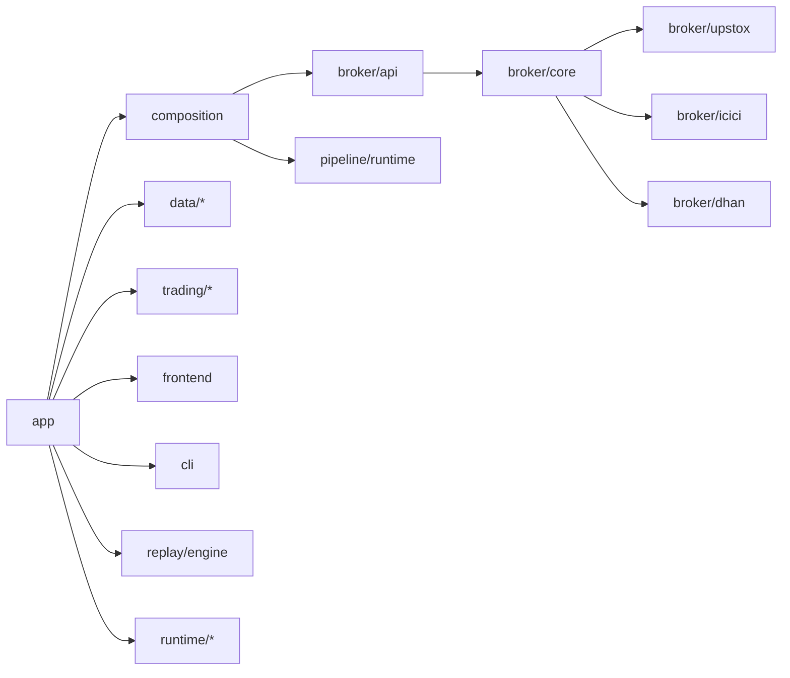
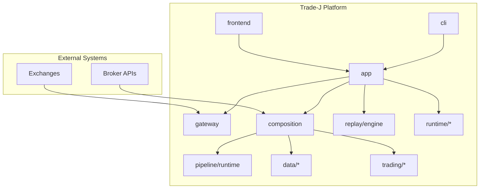

# Architecture Overview

<cite>
**Referenced Files in This Document**
- [ARCHITECTURE.md](file://docs/ARCHITECTURE.md)
- [ARCHITECTURE_REPORT.md](file://docs/ARCHITECTURE_REPORT.md)
- [TRADEJ_INSTITUTIONAL_ARCHITECTURE.md](file://docs/TRADEJ_INSTITUTIONAL_ARCHITECTURE.md)
- [PIPELINE_DESIGN.md](file://docs/PIPELINE_DESIGN.md)
- [BROKER_INTEGRATION_AUDIT_REPORT.md](file://docs/BROKER_INTEGRATION_AUDIT_REPORT.md)
- [application.yml](file://app/src/main/resources/application.yml)
- [application-dev.yml](file://app/src/main/resources/application-dev.yml)
- [application-prod.yml](file://app/src/main/resources/application-prod.yml)
- [application-gateway.yml](file://app/src/main/resources/application-gateway.yml)
- [application-upstox-prod.yml](file://app/src/main/resources/application-upstox-prod.yml)
- [application-icici-prod.yml](file://app/src/main/resources/application-icici-prod.yml)
- [application-replay.yml](file://app/src/main/resources/application-replay.yml)
- [application-upstox-analytics.yml](file://app/src/main/resources/application-upstox-analytics.yml)
- [logback-spring.xml](file://app/src/main/resources/logback-spring.xml)
- [FullComposition.java](file://composition/src/main/java/com/tradej/composition/FullComposition.java)
- [BrokerComposition.java](file://composition/src/main/java/com/tradej/composition/BrokerComposition.java)
- [PipelineComposition.java](file://composition/src/main/java/com/tradej/composition/PipelineComposition.java)
- [UpstoxBrokerFactory.java](file://composition/src/main/java/com/tradej/composition/UpstoxBrokerFactory.java)
- [IBrokerConnection.java](file://broker/api/src/main/java/com/tradej/broker/api/IBrokerConnection.java)
- [DhanBrokerConnection.java](file://broker/dhan/src/main/java/com/tradej/broker/dhan/DhanBrokerConnection.java)
- [IciciBrokerConnection.java](file://broker/icici/src/main/java/com/tradej/broker/icici/IciciBrokerConnection.java)
- [UpstoxBrokerConnection.java](file://broker/upstox/src/main/java/com/tradej/broker/upstox/UpstoxBrokerConnection.java)
- [DisruptorSignalToExecutionComponentTest.java](file://app/src/test/java/com/tradej/app/integration/DisruptorSignalToExecutionComponentTest.java)
- [DisruptorTickToCandleComponentTest.java](file://app/src/test/java/com/tradej/app/integration/DisruptorTickToCandleComponentTest.java)
- [GatewayWebSocketLifecycleTest.java](file://app/src/test/java/com/tradej/app/integration/GatewayWebSocketLifecycleTest.java)
- [GatewayLiveBenchmark.java](file://app/src/test/java/com/tradej/app/integration/GatewayLiveBenchmark.java)
- [GatewayProfileContextComponentTest.java](file://app/src/test/java/com/tradej/app/config/GatewayProfileContextComponentTest.java)
- [DagPipelineIngressBridge.java](file://pipeline/runtime/src/main/java/com/tradej/pipeline/service/DagPipelineIngressBridge.java)
- [DagPipelineRuntimeService.java](file://pipeline/runtime/src/main/java/com/tradej/pipeline/service/DagPipelineRuntimeService.java)
- [PipelineRuntimeService.java](file://pipeline/runtime/src/main/java/com/tradej/pipeline/service/PipelineRuntimeService.java)
- [PipelineNodeFactory.java](file://pipeline/runtime/src/main/java/com/tradej/pipeline/service/PipelineNodeFactory.java)
- [DagPipelineIngressTest.java](file://app/src/test/java/com/tradej/app/pipeline/DagPipelineIngressTest.java)
- [PipelineCompileRoutingTest.java](file://app/src/test/java/com/tradej/app/pipeline/PipelineCompileRoutingTest.java)
- [ReplayParityHashTest.java](file://app/src/test/java/com/tradej/app/pipeline/ReplayParityHashTest.java)
- [ObservableMarketDataProviderTest.java](file://app/src/test/java/com/tradej/app/metrics/ObservableMarketDataProviderTest.java)
- [TickReconciliationLiveSessionTest.java](file://app/src/test/java/com/tradej/app/metrics/TickReconciliationLiveSessionTest.java)
- [OrderReplayIntegrationTest.java](file://app/src/test/java/com/tradej/app/integration/OrderReplayIntegrationTest.java)
- [TradingRuntimeReconciliationIntegrationTest.java](file://app/src/test/java/com/tradej/app/integration/TradingRuntimeReconciliationIntegrationTest.java)
- [TripleModePNLParityTest.java](file://app/src/test/java/com/tradej/app/integration/TripleModePNLParityTest.java)
- [ReplayController.java](file://replay/engine/src/main/java/com/tradej/replay/engine/ReplayController.java)
- [ReplayOrchestrator.java](file://replay/engine/src/main/java/com/tradej/replay/engine/ReplayOrchestrator.java)
- [IsolatedReplayStateManager.java](file://replay/engine/src/main/java/com/tradej/replay/engine/IsolatedReplayStateManager.java)
- [MultiTimeframeContext.java](file://replay/engine/src/main/java/com/tradej/replay/engine/MultiTimeframeContext.java)
- [PositionStateRebuilder.java](file://replay/engine/src/main/java/com/tradej/replay/engine/PositionStateRebuilder.java)
- [GatewayCheckSpeedLiveTest.java](file://app/src/test/java/com/tradej/app/integration/GatewayCheckSpeedLiveTest.java)
- [GatewayReplaySmokeTest.java](file://app/src/test/java/com/tradej/app/integration/GatewayReplaySmokeTest.java)
- [LiveUpstoxTestSupport.java](file://app/src/test/java/com/tradej/app/integration/LiveUpstoxTestSupport.java)
- [LiveIciciTestSupport.java](file://app/src/test/java/com/tradej/app/integration/LiveIciciTestSupport.java)
- [LiveDhanTestSupport.java](file://app/src/test/java/com/tradej/app/integration/LiveDhanTestSupport.java)
- [build.gradle](file://app/build.gradle)
- [gateway build.gradle](file://gateway/build.gradle)
- [disruptor build.gradle](file://runtime/disruptor/build.gradle)
- [pipeline runtime build.gradle](file://pipeline/runtime/build.gradle)
- [broker api build.gradle](file://broker/api/build.gradle)
- [broker core build.gradle](file://broker/core/build.gradle)
- [broker dhan build.gradle](file://broker/dhan/build.gradle)
- [broker icici build.gradle](file://broker/icici/build.gradle)
- [broker upstox build.gradle](file://broker/upstox/build.gradle)
- [composition build.gradle](file://composition/build.gradle)
- [core build.gradle](file://core/build.gradle)
- [data analytics build.gradle](file://data/analytics/build.gradle)
- [data feature-store build.gradle](file://data/feature-store/build.gradle)
- [data historical-ingest build.gradle](file://data/historical-ingest/build.gradle)
- [data persistence build.gradle](file://data/persistence/build.gradle)
- [frontend build.gradle](file://frontend/build.gradle)
- [cli build.gradle](file://cli/build.gradle)
- [research api build.gradle](file://research/api/build.gradle)
- [research core build.gradle](file://research/core/build.gradle)
- [research lab build.gradle](file://research/lab/build.gradle)
- [trading execution build.gradle](file://trading/execution/build.gradle)
- [trading indicators build.gradle](file://trading/indicators/build.gradle)
- [trading scanner build.gradle](file://trading/scanner/build.gradle)
- [trading strategy build.gradle](file://trading/strategy/build.gradle)
- [nodes trade-node-library build.gradle](file://nodes/trade-node-library/build.gradle)
- [mcp-server build.gradle](file://mcp-server/build.gradle)
- [replay engine build.gradle](file://replay/engine/build.gradle)
- [hotpath build.gradle](file://runtime/hotpath/build.gradle)
- [architecture-test build.gradle](file://architecture-test/build.gradle)
</cite>

## Table of Contents
1. [Introduction](#introduction)
2. [Project Structure](#project-structure)
3. [Core Components](#core-components)
4. [Architecture Overview](#architecture-overview)
5. [Detailed Component Analysis](#detailed-component-analysis)
6. [Dependency Analysis](#dependency-analysis)
7. [Performance Considerations](#performance-considerations)
8. [Troubleshooting Guide](#troubleshooting-guide)
9. [Conclusion](#conclusion)
10. [Appendices](#appendices)

## Introduction
This document presents the architecture of the Trade-J platform, focusing on its modular, event-driven design for multi-broker, real-time trading systems. It describes the layered architecture (presentation, application, domain, infrastructure), the pipeline-based workflow execution, and the event-driven processing powered by LMAX Disruptor. The document also covers the broker adapter pattern, system boundaries, integration points, and scalability considerations derived from the repository’s configuration, composition, and integration tests.

## Project Structure
Trade-J is organized as a multi-module Gradle project with clear separation of concerns across layers and domains. Key modules include:
- Application layer: app module with Spring Boot configuration and profiles for dev, prod, gateway, replay, and analytics.
- Composition: orchestration of brokers, pipelines, and runtime services.
- Broker adapters: Upstox, ICICI, Dhan, and generic broker API/core abstractions.
- Pipeline runtime: DAG-based pipeline execution and ingress bridges.
- Replay engine: isolated replay and state reconstruction for backtesting and verification.
- Data modules: analytics, feature store, historical ingest, and persistence.
- Trading modules: execution, indicators, scanner, strategy, and simulation.
- Frontend and CLI: user interfaces and command-line tools.
- Runtime: Disruptor-based event processing and hot-path optimizations.

**Diagram sources**
- [FullComposition.java:1-200](file://composition/src/main/java/com/tradej/composition/FullComposition.java#L1-L200)
- [BrokerComposition.java:1-200](file://composition/src/main/java/com/tradej/composition/BrokerComposition.java#L1-L200)
- [PipelineComposition.java:1-200](file://composition/src/main/java/com/tradej/composition/PipelineComposition.java#L1-L200)
- [IBrokerConnection.java:1-200](file://broker/api/src/main/java/com/tradej/broker/api/IBrokerConnection.java#L1-L200)
- [DagPipelineIngressBridge.java:1-200](file://pipeline/runtime/src/main/java/com/tradej/pipeline/service/DagPipelineIngressBridge.java#L1-L200)
- [DagPipelineRuntimeService.java:1-200](file://pipeline/runtime/src/main/java/com/tradej/pipeline/service/DagPipelineRuntimeService.java#L1-L200)
- [ReplayController.java:1-200](file://replay/engine/src/main/java/com/tradej/replay/engine/ReplayController.java#L1-L200)

**Section sources**
- [build.gradle:1-200](file://app/build.gradle#L1-L200)
- [gateway build.gradle:1-200](file://gateway/build.gradle#L1-L200)
- [disruptor build.gradle:1-200](file://runtime/disruptor/build.gradle#L1-L200)
- [pipeline runtime build.gradle:1-200](file://pipeline/runtime/build.gradle#L1-L200)
- [broker api build.gradle:1-200](file://broker/api/build.gradle#L1-L200)
- [broker core build.gradle:1-200](file://broker/core/build.gradle#L1-L200)
- [broker dhan build.gradle:1-200](file://broker/dhan/build.gradle#L1-L200)
- [broker icici build.gradle:1-200](file://broker/icici/build.gradle#L1-L200)
- [broker upstox build.gradle:1-200](file://broker/upstox/build.gradle#L1-L200)
- [composition build.gradle:1-200](file://composition/build.gradle#L1-L200)
- [core build.gradle:1-200](file://core/build.gradle#L1-L200)
- [data analytics build.gradle:1-200](file://data/analytics/build.gradle#L1-L200)
- [data feature-store build.gradle:1-200](file://data/feature-store/build.gradle#L1-L200)
- [data historical-ingest build.gradle:1-200](file://data/historical-ingest/build.gradle#L1-L200)
- [data persistence build.gradle:1-200](file://data/persistence/build.gradle#L1-L200)
- [frontend build.gradle:1-200](file://frontend/build.gradle#L1-L200)
- [cli build.gradle:1-200](file://cli/build.gradle#L1-L200)
- [research api build.gradle:1-200](file://research/api/build.gradle#L1-L200)
- [research core build.gradle:1-200](file://research/core/build.gradle#L1-L200)
- [research lab build.gradle:1-200](file://research/lab/build.gradle#L1-L200)
- [trading execution build.gradle:1-200](file://trading/execution/build.gradle#L1-L200)
- [trading indicators build.gradle:1-200](file://trading/indicators/build.gradle#L1-L200)
- [trading scanner build.gradle:1-200](file://trading/scanner/build.gradle#L1-L200)
- [trading strategy build.gradle:1-200](file://trading/strategy/build.gradle#L1-L200)
- [nodes trade-node-library build.gradle:1-200](file://nodes/trade-node-library/build.gradle#L1-L200)
- [mcp-server build.gradle:1-200](file://mcp-server/build.gradle#L1-L200)
- [replay engine build.gradle:1-200](file://replay/engine/build.gradle#L1-L200)
- [hotpath build.gradle:1-200](file://runtime/hotpath/build.gradle#L1-L200)
- [architecture-test build.gradle:1-200](file://architecture-test/build.gradle#L1-L200)

## Core Components
- Application configuration and profiles define runtime modes (dev, prod, gateway, replay, analytics) and broker-specific configurations.
- Composition orchestrates broker connections, pipeline runtime, and clock/data services.
- Broker adapters implement a common interface and provide Upstox, ICICI, and Dhan integrations.
- Pipeline runtime executes DAG-based workflows with ingress bridging and node factories.
- Replay engine supports isolated replay sessions and state reconstruction for verification.
- Data modules provide analytics, feature store, historical ingestion, and persistence.
- Trading modules encapsulate execution, indicators, scanners, strategies, and simulations.
- Frontend and CLI offer user interfaces and operational tools.
- Runtime modules include Disruptor-based event processing and hot-path optimizations.

**Section sources**
- [application.yml:1-200](file://app/src/main/resources/application.yml#L1-L200)
- [application-dev.yml:1-200](file://app/src/main/resources/application-dev.yml#L1-L200)
- [application-prod.yml:1-200](file://app/src/main/resources/application-prod.yml#L1-L200)
- [application-gateway.yml:1-200](file://app/src/main/resources/application-gateway.yml#L1-L200)
- [application-replay.yml:1-200](file://app/src/main/resources/application-replay.yml#L1-L200)
- [application-upstox-analytics.yml:1-200](file://app/src/main/resources/application-upstox-analytics.yml#L1-L200)
- [FullComposition.java:1-200](file://composition/src/main/java/com/tradej/composition/FullComposition.java#L1-L200)
- [BrokerComposition.java:1-200](file://composition/src/main/java/com/tradej/composition/BrokerComposition.java#L1-L200)
- [PipelineComposition.java:1-200](file://composition/src/main/java/com/tradej/composition/PipelineComposition.java#L1-L200)
- [IBrokerConnection.java:1-200](file://broker/api/src/main/java/com/tradej/broker/api/IBrokerConnection.java#L1-L200)
- [DagPipelineIngressBridge.java:1-200](file://pipeline/runtime/src/main/java/com/tradej/pipeline/service/DagPipelineIngressBridge.java#L1-L200)
- [DagPipelineRuntimeService.java:1-200](file://pipeline/runtime/src/main/java/com/tradej/pipeline/service/DagPipelineRuntimeService.java#L1-L200)
- [ReplayController.java:1-200](file://replay/engine/src/main/java/com/tradej/replay/engine/ReplayController.java#L1-L200)

## Architecture Overview
Trade-J employs a layered architecture with clear separation between presentation, application, domain, and infrastructure layers. The system is event-driven and pipeline-centric, enabling real-time processing and multi-broker orchestration.

- Presentation layer: frontend and CLI provide user interfaces and operational commands.
- Application layer: Spring Boot configuration, gateway, and runtime services manage lifecycle and integration.
- Domain layer: trading logic, strategies, scanners, and indicators encapsulate business rules.
- Infrastructure layer: broker adapters, data persistence, analytics, and replay engine provide cross-cutting capabilities.

**Diagram sources**
- [application.yml:1-200](file://app/src/main/resources/application.yml#L1-L200)
- [FullComposition.java:1-200](file://composition/src/main/java/com/tradej/composition/FullComposition.java#L1-L200)
- [BrokerComposition.java:1-200](file://composition/src/main/java/com/tradej/composition/BrokerComposition.java#L1-L200)
- [PipelineComposition.java:1-200](file://composition/src/main/java/com/tradej/composition/PipelineComposition.java#L1-L200)

## Detailed Component Analysis

### Event-Driven Architecture with LMAX Disruptor
Trade-J leverages LMAX Disruptor for high-throughput, low-latency event processing. Integration tests validate signal-to-execution and tick-to-candle processing via Disruptor.

**Diagram sources**
- [DisruptorSignalToExecutionComponentTest.java:1-200](file://app/src/test/java/com/tradej/app/integration/DisruptorSignalToExecutionComponentTest.java#L1-L200)
- [DisruptorTickToCandleComponentTest.java:1-200](file://app/src/test/java/com/tradej/app/integration/DisruptorTickToCandleComponentTest.java#L1-L200)

**Section sources**
- [DisruptorSignalToExecutionComponentTest.java:1-200](file://app/src/test/java/com/tradej/app/integration/DisruptorSignalToExecutionComponentTest.java#L1-L200)
- [DisruptorTickToCandleComponentTest.java:1-200](file://app/src/test/java/com/tradej/app/integration/DisruptorTickToCandleComponentTest.java#L1-L200)

### Broker Adapter Pattern and Multi-Broker Design
Trade-J implements a common broker connection interface and specialized adapters for Upstox, ICICI, and Dhan. Composition selects and wires broker instances according to runtime profiles.

**Diagram sources**
- [IBrokerConnection.java:1-200](file://broker/api/src/main/java/com/tradej/broker/api/IBrokerConnection.java#L1-L200)
- [UpstoxBrokerConnection.java:1-200](file://broker/upstox/src/main/java/com/tradej/broker/upstox/UpstoxBrokerConnection.java#L1-L200)
- [IciciBrokerConnection.java:1-200](file://broker/icici/src/main/java/com/tradej/broker/icici/IciciBrokerConnection.java#L1-L200)
- [DhanBrokerConnection.java:1-200](file://broker/dhan/src/main/java/com/tradej/broker/dhan/DhanBrokerConnection.java#L1-L200)

**Section sources**
- [IBrokerConnection.java:1-200](file://broker/api/src/main/java/com/tradej/broker/api/IBrokerConnection.java#L1-L200)
- [UpstoxBrokerConnection.java:1-200](file://broker/upstox/src/main/java/com/tradej/broker/upstox/UpstoxBrokerConnection.java#L1-L200)
- [IciciBrokerConnection.java:1-200](file://broker/icici/src/main/java/com/tradej/broker/icici/IciciBrokerConnection.java#L1-L200)
- [DhanBrokerConnection.java:1-200](file://broker/dhan/src/main/java/com/tradej/broker/dhan/DhanBrokerConnection.java#L1-L200)

### Pipeline-Based Workflow Execution
The pipeline runtime executes DAG-based workflows with an ingress bridge and node factory. Tests validate compilation, routing, and parity checks.

**Diagram sources**
- [DagPipelineIngressBridge.java:1-200](file://pipeline/runtime/src/main/java/com/tradej/pipeline/service/DagPipelineIngressBridge.java#L1-L200)
- [DagPipelineRuntimeService.java:1-200](file://pipeline/runtime/src/main/java/com/tradej/pipeline/service/DagPipelineRuntimeService.java#L1-L200)
- [PipelineNodeFactory.java:1-200](file://pipeline/runtime/src/main/java/com/tradej/pipeline/service/PipelineNodeFactory.java#L1-L200)

**Section sources**
- [DagPipelineIngressBridge.java:1-200](file://pipeline/runtime/src/main/java/com/tradej/pipeline/service/DagPipelineIngressBridge.java#L1-L200)
- [DagPipelineRuntimeService.java:1-200](file://pipeline/runtime/src/main/java/com/tradej/pipeline/service/DagPipelineRuntimeService.java#L1-L200)
- [PipelineNodeFactory.java:1-200](file://pipeline/runtime/src/main/java/com/tradej/pipeline/service/PipelineNodeFactory.java#L1-L200)
- [DagPipelineIngressTest.java:1-200](file://app/src/test/java/com/tradej/app/pipeline/DagPipelineIngressTest.java#L1-L200)
- [PipelineCompileRoutingTest.java:1-200](file://app/src/test/java/com/tradej/app/pipeline/PipelineCompileRoutingTest.java#L1-L200)
- [ReplayParityHashTest.java:1-200](file://app/src/test/java/com/tradej/app/pipeline/ReplayParityHashTest.java#L1-L200)

### Replay Engine and State Reconstruction
The replay engine orchestrates isolated replay sessions, manages multi-timeframe contexts, and rebuilds position states for verification and backtesting.

**Diagram sources**
- [ReplayController.java:1-200](file://replay/engine/src/main/java/com/tradej/replay/engine/ReplayController.java#L1-L200)
- [ReplayOrchestrator.java:1-200](file://replay/engine/src/main/java/com/tradej/replay/engine/ReplayOrchestrator.java#L1-L200)
- [IsolatedReplayStateManager.java:1-200](file://replay/engine/src/main/java/com/tradej/replay/engine/IsolatedReplayStateManager.java#L1-L200)
- [MultiTimeframeContext.java:1-200](file://replay/engine/src/main/java/com/tradej/replay/engine/MultiTimeframeContext.java#L1-L200)
- [PositionStateRebuilder.java:1-200](file://replay/engine/src/main/java/com/tradej/replay/engine/PositionStateRebuilder.java#L1-L200)

**Section sources**
- [ReplayController.java:1-200](file://replay/engine/src/main/java/com/tradej/replay/engine/ReplayController.java#L1-L200)
- [ReplayOrchestrator.java:1-200](file://replay/engine/src/main/java/com/tradej/replay/engine/ReplayOrchestrator.java#L1-L200)
- [IsolatedReplayStateManager.java:1-200](file://replay/engine/src/main/java/com/tradej/replay/engine/IsolatedReplayStateManager.java#L1-L200)
- [MultiTimeframeContext.java:1-200](file://replay/engine/src/main/java/com/tradej/replay/engine/MultiTimeframeContext.java#L1-L200)
- [PositionStateRebuilder.java:1-200](file://replay/engine/src/main/java/com/tradej/replay/engine/PositionStateRebuilder.java#L1-L200)

### Real-Time Processing and Benchmarking
Integration tests demonstrate live benchmarking and WebSocket lifecycle validation, ensuring throughput and reliability under load.

**Diagram sources**
- [GatewayLiveBenchmark.java:1-200](file://app/src/test/java/com/tradej/app/integration/GatewayLiveBenchmark.java#L1-L200)
- [GatewayWebSocketLifecycleTest.java:1-200](file://app/src/test/java/com/tradej/app/integration/GatewayWebSocketLifecycleTest.java#L1-L200)

**Section sources**
- [GatewayLiveBenchmark.java:1-200](file://app/src/test/java/com/tradej/app/integration/GatewayLiveBenchmark.java#L1-L200)
- [GatewayWebSocketLifecycleTest.java:1-200](file://app/src/test/java/com/tradej/app/integration/GatewayWebSocketLifecycleTest.java#L1-L200)

## Dependency Analysis
Modules depend on each other through well-defined interfaces and composition. The composition layer centralizes wiring, while broker adapters and pipeline runtime are decoupled from presentation and data modules.

**Diagram sources**
- [FullComposition.java:1-200](file://composition/src/main/java/com/tradej/composition/FullComposition.java#L1-L200)
- [BrokerComposition.java:1-200](file://composition/src/main/java/com/tradej/composition/BrokerComposition.java#L1-L200)
- [PipelineComposition.java:1-200](file://composition/src/main/java/com/tradej/composition/PipelineComposition.java#L1-L200)

**Section sources**
- [FullComposition.java:1-200](file://composition/src/main/java/com/tradej/composition/FullComposition.java#L1-L200)
- [BrokerComposition.java:1-200](file://composition/src/main/java/com/tradej/composition/BrokerComposition.java#L1-L200)
- [PipelineComposition.java:1-200](file://composition/src/main/java/com/tradej/composition/PipelineComposition.java#L1-L200)

## Performance Considerations
- Event-driven processing with LMAX Disruptor minimizes contention and maximizes throughput for market data and order signals.
- Pipeline-based execution enables parallelism and composability of processing stages.
- Broker adapters encapsulate latency-sensitive operations behind resilient connections and subscriptions.
- Replay engine supports deterministic verification and performance regression testing.
- Logging and metrics integration enable monitoring and tuning of real-time workloads.

[No sources needed since this section provides general guidance]

## Troubleshooting Guide
Common areas to investigate during troubleshooting:
- Gateway WebSocket lifecycle and connectivity issues.
- Broker authentication and session management failures.
- Pipeline compilation and routing errors.
- Replay parity and state reconstruction inconsistencies.
- Live benchmark performance regressions.

**Section sources**
- [GatewayWebSocketLifecycleTest.java:1-200](file://app/src/test/java/com/tradej/app/integration/GatewayWebSocketLifecycleTest.java#L1-L200)
- [GatewayCheckSpeedLiveTest.java:1-200](file://app/src/test/java/com/tradej/app/integration/GatewayCheckSpeedLiveTest.java#L1-L200)
- [GatewayReplaySmokeTest.java:1-200](file://app/src/test/java/com/tradej/app/integration/GatewayReplaySmokeTest.java#L1-L200)
- [ObservableMarketDataProviderTest.java:1-200](file://app/src/test/java/com/tradej/app/metrics/ObservableMarketDataProviderTest.java#L1-L200)
- [TickReconciliationLiveSessionTest.java:1-200](file://app/src/test/java/com/tradej/app/metrics/TickReconciliationLiveSessionTest.java#L1-L200)
- [OrderReplayIntegrationTest.java:1-200](file://app/src/test/java/com/tradej/app/integration/OrderReplayIntegrationTest.java#L1-L200)
- [TradingRuntimeReconciliationIntegrationTest.java:1-200](file://app/src/test/java/com/tradej/app/integration/TradingRuntimeReconciliationIntegrationTest.java#L1-L200)
- [TripleModePNLParityTest.java:1-200](file://app/src/test/java/com/tradej/app/integration/TripleModePNLParityTest.java#L1-L200)

## Conclusion
Trade-J’s architecture combines a layered design with event-driven, pipeline-based processing and a robust multi-broker adapter pattern. The system emphasizes real-time performance, scalability, and verifiability through replay and benchmarking. The composition layer ensures clean separation of concerns and flexible runtime configuration across environments.

[No sources needed since this section summarizes without analyzing specific files]

## Appendices

### System Context Diagram

**Diagram sources**
- [application.yml:1-200](file://app/src/main/resources/application.yml#L1-L200)
- [FullComposition.java:1-200](file://composition/src/main/java/com/tradej/composition/FullComposition.java#L1-L200)
- [BrokerComposition.java:1-200](file://composition/src/main/java/com/tradej/composition/BrokerComposition.java#L1-L200)
- [PipelineComposition.java:1-200](file://composition/src/main/java/com/tradej/composition/PipelineComposition.java#L1-L200)

### Configuration Profiles and Environments
- Dev, prod, gateway, replay, and analytics profiles configure runtime behavior and broker endpoints.
- Broker-specific profiles tailor authentication, endpoints, and feature flags per provider.

**Section sources**
- [application-dev.yml:1-200](file://app/src/main/resources/application-dev.yml#L1-L200)
- [application-prod.yml:1-200](file://app/src/main/resources/application-prod.yml#L1-L200)
- [application-gateway.yml:1-200](file://app/src/main/resources/application-gateway.yml#L1-L200)
- [application-replay.yml:1-200](file://app/src/main/resources/application-replay.yml#L1-L200)
- [application-upstox-prod.yml:1-200](file://app/src/main/resources/application-upstox-prod.yml#L1-L200)
- [application-icici-prod.yml:1-200](file://app/src/main/resources/application-icici-prod.yml#L1-L200)
- [application-upstox-analytics.yml:1-200](file://app/src/main/resources/application-upstox-analytics.yml#L1-L200)

### Broker Integration Audit Highlights
- Comprehensive audit documents coverage and remediation plans for broker integrations.
- Focus areas include authentication, streaming, order routing, and resilience.

**Section sources**
- [BROKER_INTEGRATION_AUDIT_REPORT.md:1-200](file://docs/BROKER_INTEGRATION_AUDIT_REPORT.md#L1-L200)