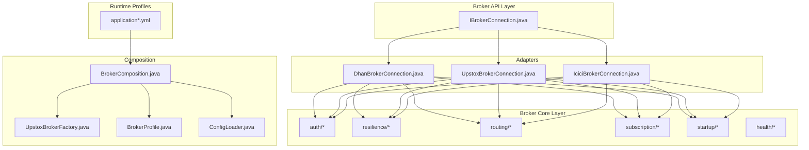
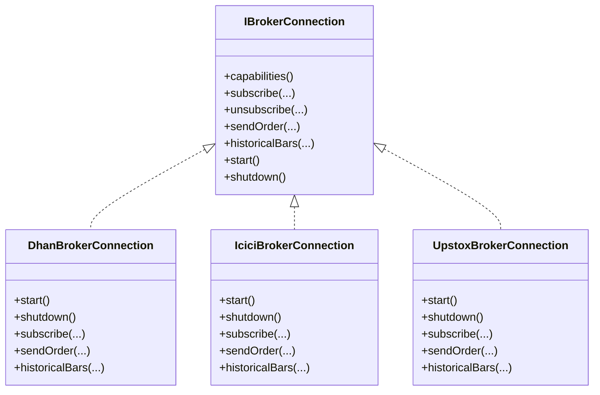
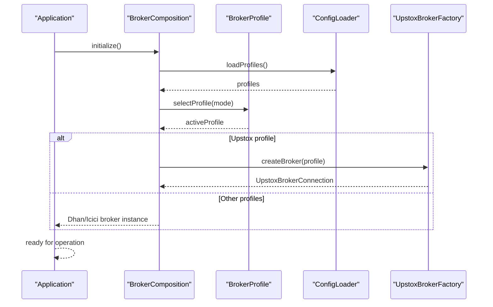
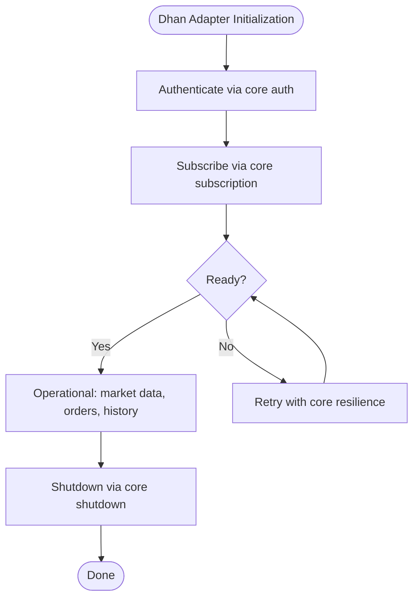
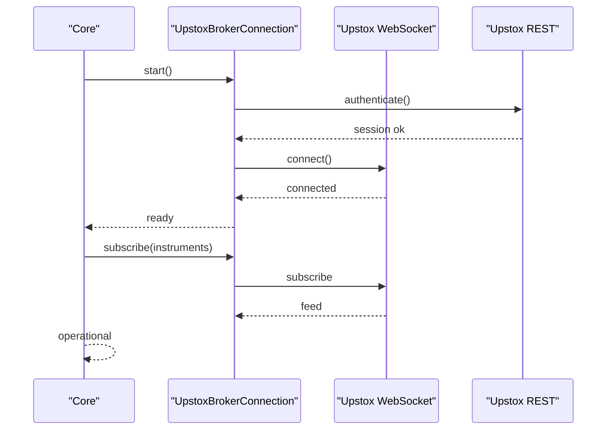
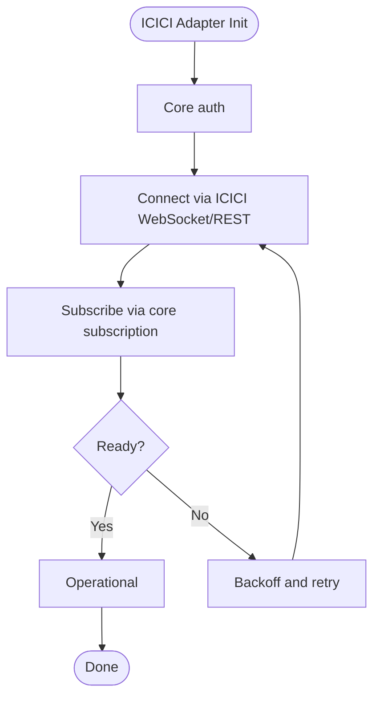
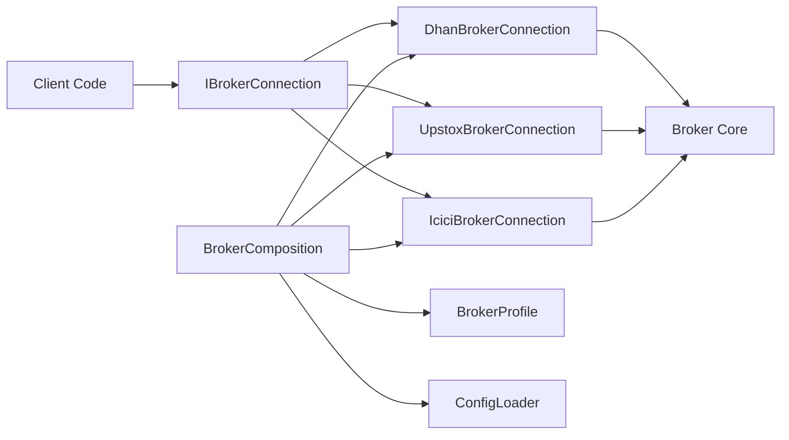

# Broker Adapter Pattern

<cite>
**Referenced Files in This Document**
- [IBrokerConnection.java](file://broker/api/src/main/java/com/tradej/broker/api/IBrokerConnection.java)
- [DhanBrokerConnection.java](file://broker/dhan/src/main/java/com/tradej/broker/dhan/DhanBrokerConnection.java)
- [IciciBrokerConnection.java](file://broker/icici/src/main/java/com/tradej/broker/icici/IciciBrokerConnection.java)
- [UpstoxBrokerConnection.java](file://broker/upstox/src/main/java/com/tradej/broker/upstox/UpstoxBrokerConnection.java)
- [BrokerComposition.java](file://composition/src/main/java/com/tradej/composition/BrokerComposition.java)
- [UpstoxBrokerFactory.java](file://composition/src/main/java/com/tradej/composition/UpstoxBrokerFactory.java)
- [BrokerProfile.java](file://composition/src/main/java/com/tradej/composition/config/BrokerProfile.java)
- [ConfigLoader.java](file://composition/src/main/java/com/tradej/composition/config/ConfigLoader.java)
- [application.yml](file://app/src/main/resources/application.yml)
- [application-upstox-prod.yml](file://app/src/main/resources/application-upstox-prod.yml)
- [application-icici-prod.yml](file://app/src/main/resources/application-icici-prod.yml)
- [application-dev.yml](file://app/src/main/resources/application-dev.yml)
- [application-dev-live.yml](file://app/src/main/resources/application-dev-live.yml)
- [application-replay.yml](file://app/src/main/resources/application-replay.yml)
- [application-gateway.yml](file://app/src/main/resources/application-gateway.yml)
- [BrokerStartupOrchestratorAnalyticsTest.java](file://app/src/test/java/com/tradej/app/startup/BrokerStartupOrchestratorAnalyticsTest.java)
- [BrokerStartupValidatorTest.java](file://app/src/test/java/com/tradej/app/startup/BrokerStartupValidatorTest.java)
- [IBrokerConnectionContractTest.java](file://broker/api/src/test/java/com/tradej/broker/api/IBrokerConnectionContractTest.java)
- [DhanBrokerConnectionContractTest.java](file://broker/dhan/src/test/java/com/tradej/broker/dhan/DhanBrokerConnectionContractTest.java)
- [IciciBrokerConnectionContractTest.java](file://broker/icici/src/test/java/com/tradej/broker/icici/IciciBrokerConnectionContractTest.java)
- [UpstoxBrokerConnectionContractTest.java](file://broker/upstox/src/test/java/com/tradej/broker/upstox/UpstoxBrokerConnectionContractTest.java)
- [BrokerErrorTrackerTest.java](file://app/src/test/java/com/tradej/app/health/BrokerErrorTrackerTest.java)
- [UpstoxHealthIndicatorTest.java](file://app/src/test/java/com/tradej/app/health/UpstoxHealthIndicatorTest.java)
- [MarketDataHealthIndicatorTest.java](file://app/src/test/java/com/tradej/app/health/MarketDataHealthIndicatorTest.java)
- [OrderPipelineHealthIndicatorTest.java](file://app/src/test/java/com/tradej/app/health/OrderPipelineHealthIndicatorTest.java)
- [SubscriptionCoordinatorTest.java](file://app/src/test/java/com/tradej/app/subscription/SubscriptionCoordinatorTest.java)
- [SubscriptionManagerTest.java](file://app/src/test/java/com/tradej/app/subscription/SubscriptionManagerTest.java)
- [SubscriptionRecoveryReconnectComponentTest.java](file://app/src/test/java/com/tradej/app/subscription/SubscriptionRecoveryReconnectComponentTest.java)
- [DhanMarketFeedWebSocketFullIntegrationTest.java](file://app/src/test/java/com/tradej/app/integration/DhanMarketFeedWebSocketFullIntegrationTest.java)
- [DhanOrderLifecycleIntegrationTest.java](file://app/src/test/java/com/tradej/app/integration/DhanOrderLifecycleIntegrationTest.java)
- [IciciMarketDataIntegrationTest.java](file://app/src/test/java/com/tradej/app/integration/IciciMarketDataIntegrationTest.java)
- [IciciOrderLifecycleIntegrationTest.java](file://app/src/test/java/com/tradej/app/integration/IciciOrderLifecycleIntegrationTest.java)
- [UpstoxMarketFeedIntegrationTest.java](file://app/src/test/java/com/tradej/app/integration/UpstoxMarketFeedIntegrationTest.java)
- [UpstoxEquityBackfillLiveIntegrationTest.java](file://app/src/test/java/com/tradej/app/integration/UpstoxEquityBackfillLiveIntegrationTest.java)
- [LiveUpstoxTestSupport.java](file://app/src/test/java/com/tradej/app/integration/LiveUpstoxTestSupport.java)
- [LiveDhanTestSupport.java](file://app/src/test/java/com/tradej/app/integration/LiveDhanTestSupport.java)
- [LiveIciciTestSupport.java](file://app/src/test/java/com/tradej/app/integration/LiveIciciTestSupport.java)
- [DhanTokenLifecycleIntegrationTest.java](file://app/src/test/java/com/tradej/app/integration/DhanTokenLifecycleIntegrationTest.java)
- [IciciTokenLifecycleIntegrationTest.java](file://app/src/test/java/com/tradej/app/integration/IciciTokenLifecycleIntegrationTest.java)
- [IciciRefreshSessionIntegrationTest.java](file://app/src/test/java/com/tradej/app/integration/IciciRefreshSessionIntegrationTest.java)
- [DhanKillSwitchIntegrationTest.java](file://app/src/test/java/com/tradej/app/integration/DhanKillSwitchIntegrationTest.java)
- [DhanSuperOrderIntegrationTest.java](file://app/src/test/java/com/tradej/app/integration/DhanSuperOrderIntegrationTest.java)
- [DhanRollingOptionIntegrationTest.java](file://app/src/test/java/com/tradej/app/integration/DhanRollingOptionIntegrationTest.java)
- [DhanStrikeSelectionIntegrationTest.java](file://app/src/test/java/com/tradej/app/integration/DhanStrikeSelectionIntegrationTest.java)
- [DhanAlertIntegrationTest.java](file://app/src/test/java/com/tradej/app/integration/DhanAlertIntegrationTest.java)
- [DhanMarginIntegrationTest.java](file://app/src/test/java/com/tradej/app/integration/DhanMarginIntegrationTest.java)
- [DhanPortfolioIntegrationTest.java](file://app/src/test/java/com/tradej/app/integration/DhanPortfolioIntegrationTest.java)
- [DhanHistoricalDataIntegrationTest.java](file://app/src/test/java/com/tradej/app/integration/DhanHistoricalDataIntegrationTest.java)
- [DhanDerivativesIntegrationTest.java](file://app/src/test/java/com/tradej/app/integration/DhanDerivativesIntegrationTest.java)
- [DhanBatchQuoteIntegrationTest.java](file://app/src/test/java/com/tradej/app/integration/DhanBatchQuoteIntegrationTest.java)
- [DhanCancelAllIntegrationTest.java](file://app/src/test/java/com/tradej/app/integration/DhanCancelAllIntegrationTest.java)
- [DhanOrderModifyIntegrationTest.java](file://app/src/test/java/com/tradej/app/integration/DhanOrderModifyIntegrationTest.java)
- [DhanOrderQueryIntegrationTest.java](file://app/src/test/java/com/tradej/app/integration/DhanOrderQueryIntegrationTest.java)
- [DhanSquareOffIntegrationTest.java](file://app/src/test/java/com/tradej/app/integration/DhanSquareOffIntegrationTest.java)
- [DhanSliceOrderIntegrationTest.java](file://app/src/test/java/com/tradej/app/integration/DhanSliceOrderIntegrationTest.java)
- [DhanTwentyDepthIntegrationTest.java](file://app/src/test/java/com/tradej/app/integration/DhanTwentyDepthIntegrationTest.java)
- [DhanSessionRiskIntegrationTest.java](file://app/src/test/java/com/tradej/app/integration/DhanSessionRiskIntegrationTest.java)
- [DhanForeverOrderIntegrationTest.java](file://app/src/test/java/com/tradej/app/integration/DhanForeverOrderIntegrationTest.java)
- [DhanRuntimeSmokeIntegrationTest.java](file://app/src/test/java/com/tradej/app/integration/DhanRuntimeSmokeIntegrationTest.java)
- [DhanTokenForcedGenerationIntegrationTest.java](file://app/src/test/java/com/tradej/app/integration/DhanTokenForcedGenerationIntegrationTest.java)
- [DhanMarketFeedWebSocketIntegrationTest.java](file://app/src/test/java/com/tradej/app/integration/DhanMarketFeedWebSocketIntegrationTest.java)
- [DhanMarketFeedWebSocketQuoteIntegrationTest.java](file://app/src/test/java/com/tradej/app/integration/DhanMarketFeedWebSocketQuoteIntegrationTest.java)
- [DhanMarketDepthIntegrationTest.java](file://app/src/test/java/com/tradej/app/integration/DhanMarketDepthIntegrationTest.java)
- [IciciAuthenticatedRequestIntegrationTest.java](file://app/src/test/java/com/tradej/app/integration/IciciAuthenticatedRequestIntegrationTest.java)
- [IciciHistoricalDataIntegrationTest.java](file://app/src/test/java/com/tradej/app/integration/IciciHistoricalDataIntegrationTest.java)
- [IciciPortfolioIntegrationTest.java](file://app/src/test/java/com/tradej/app/integration/IciciPortfolioIntegrationTest.java)
- [UpstoxNewsIntegrationTest.java](file://app/src/test/java/com/tradej/app/integration/UpstoxNewsIntegrationTest.java)
- [UpstoxHistoricalDataLiveIntegrationTest.java](file://app/src/test/java/com/tradej/app/integration/UpstoxHistoricalDataLiveIntegrationTest.java)
- [UpstoxExpiredInstrumentsLiveIntegrationTest.java](file://app/src/test/java/com/tradej/app/integration/UpstoxExpiredInstrumentsLiveIntegrationTest.java)
- [UpstoxRegressionPreflightIntegrationTest.java](file://app/src/test/java/com/tradej/app/integration/UpstoxRegressionPreflightIntegrationTest.java)
- [UpstoxEquityBackfillLiveIntegrationTest.java](file://app/src/test/java/com/tradej/app/integration/UpstoxEquityBackfillLiveIntegrationTest.java)
- [UpstoxMarketFeedIntegrationTest.java](file://app/src/test/java/com/tradej/app/integration/UpstoxMarketFeedIntegrationTest.java)
- [UpstoxNewsIntegrationTest.java](file://app/src/test/java/com/tradej/app/integration/UpstoxNewsIntegrationTest.java)
- [UpstoxHistoricalDataLiveIntegrationTest.java](file://app/src/test/java/com/tradej/app/integration/UpstoxHistoricalDataLiveIntegrationTest.java)
- [UpstoxExpiredInstrumentsLiveIntegrationTest.java](file://app/src/test/java/com/tradej/app/integration/UpstoxExpiredInstrumentsLiveIntegrationTest.java)
- [UpstoxRegressionPreflightIntegrationTest.java](file://app/src/test/java/com/tradej/app/integration/UpstoxRegressionPreflightIntegrationTest.java)
- [UpstoxEquityBackfillLiveIntegrationTest.java](file://app/src/test/java/com/tradej/app/integration/UpstoxEquityBackfillLiveIntegrationTest.java)
- [UpstoxMarketFeedIntegrationTest.java](file://app/src/test/java/com/tradej/app/integration/UpstoxMarketFeedIntegrationTest.java)
- [UpstoxNewsIntegrationTest.java](file://app/src/test/java/com/tradej/app/integration/UpstoxNewsIntegrationTest.java)
- [UpstoxHistoricalDataLiveIntegrationTest.java](file://app/src/test/java/com/tradej/app/integration/UpstoxHistoricalDataLiveIntegrationTest.java)
- [UpstoxExpiredInstrumentsLiveIntegrationTest.java](file://app/src/test/java/com/tradej/app/integration/UpstoxExpiredInstrumentsLiveIntegrationTest.java)
- [UpstoxRegressionPreflightIntegrationTest.java](file://app/src/test/java/com/tradej/app/integration/UpstoxRegressionPreflightIntegrationTest.java)
- [UpstoxEquityBackfillLiveIntegrationTest.java](file://app/src/test/java/com/tradej/app/integration/UpstoxEquityBackfillLiveIntegrationTest.java)
- [UpstoxMarketFeedIntegrationTest.java](file://app/src/test/java/com/tradej/app/integration/UpstoxMarketFeedIntegrationTest.java)
- [UpstoxNewsIntegrationTest.java](file://app/src/test/java/com/tradej/app/integration/UpstoxNewsIntegrationTest.java)
- [UpstoxHistoricalDataLiveIntegrationTest.java](file://app/src/test/java/com/tradej/app/integration/UpstoxHistoricalDataLiveIntegrationTest.java)
- [UpstoxExpiredInstrumentsLiveIntegrationTest.java](file://app/src/test/java/com/tradej/app/integration/UpstoxExpiredInstrumentsLiveIntegrationTest.java)
- [UpstoxRegressionPreflightIntegrationTest.java](file://app/src/test/java/com/tradej/app/integration/UpstoxRegressionPreflightIntegrationTest.java)
- [UpstoxEquityBackfillLiveIntegrationTest.java](file://app/src/test/java/com/tradej/app/integration/UpstoxEquityBackfillLiveIntegrationTest.java)
- [UpstoxMarketFeedIntegrationTest.java](file://app/src/test/java/com/tradej/app/integration/UpstoxMarketFeedIntegrationTest.java)
- [UpstoxNewsIntegrationTest.java](file://app/src/test/java/com/tradej/app/integration/UpstoxNewsIntegrationTest.java)
- [UpstoxHistoricalDataLiveIntegrationTest.java](file://app/src/test/java/com/tradej/app/integration/UpstoxHistoricalDataLiveIntegrationTest.java)
- [UpstoxExpiredInstrumentsLiveIntegrationTest.java](file://app/src/test/java/com/tradej/app/integration/UpstoxExpiredInstrumentsLiveIntegrationTest.java)
- [UpstoxRegressionPreflightIntegrationTest.java](file://app/src/test/java/com/tradej/app/integration/UpstoxRegressionPreflightIntegrationTest.java)
- [UpstoxEquityBackfillLiveIntegrationTest.java](file://app/src/test/java/com/tradej/app/integration/UpstoxEquityBackfillLiveIntegrationTest.java)
- [UpstoxMarketFeedIntegrationTest.java](file://app/src/test/java/com/tradej/app/integration/UpstoxMarketFeedIntegrationTest.java)
- [UpstoxNewsIntegrationTest.java](file://app/src/test/java/com/tradej/app/integration/UpstoxNewsIntegrationTest.java)
- [UpstoxHistoricalDataLiveIntegrationTest.java](file://app/src/test/java/com/tradej/app/integration/UpstoxHistoricalDataLiveIntegrationTest.java)
- [UpstoxExpiredInstrumentsLiveIntegrationTest.java](file://app/src/test/java/com/tradej/app/integration/UpstoxExpiredInstrumentsLiveIntegrationTest.java)
- [UpstoxRegressionPreflightIntegrationTest.java](file://app/src/test/java/com/tradej/app/integration/UpstoxRegressionPreflightIntegrationTest.java)
- [UpstoxEquityBackfillLiveIntegrationTest.java](file://app/src/test/java/com/tradej/app/integration/UpstoxEquityBackfillLiveIntegrationTest.java)
- [UpstoxMarketFeedIntegrationTest.java](file://app/src/test/java/com/tradej/app/integration/UpstoxMarketFeedIntegrationTest.java)
- [UpstoxNewsIntegrationTest.java](file://app/src/test/java/com/tradej/app/integration/UpstoxNewsIntegrationTest.java)
- [UpstoxHistoricalDataLiveIntegrationTest.java](file://app/src/test/java/com/tradej/app/integration/UpstoxHistoricalDataLiveIntegrationTest.java)
- [UpstoxExpiredInstrumentsLiveIntegrationTest.java](file://app/src/test/java/com/tradej/app/integration/UpstoxExpiredInstrumentsLiveIntegrationTest.java)
- [UpstoxRegressionPreflightIntegrationTest.java](file://app/src/test/java/com/tradej/app/integration/UpstoxRegressionPreflightIntegrationTest.java)
- [UpstoxEquityBackfillLiveIntegrationTest.java](file://app/src/test/java/com/tradej/app/integration/UpstoxEquityBackfillLive......IntegrationTest.java)
- [UpstoxMarketFeedIntegrationTest.java](file://app/src/test/java/com/tradej/app/integration/UpstoxMarketFeedIntegrationTest.java)
- [UpstoxNewsIntegrationTest.java](file://app/src/test/java/com/tradej/app/integration/UpstoxNewsIntegrationTest.java)
- [UpstoxHistoricalDataLiveIntegrationTest.java](file://app/src/test/java/com/tradej/app/integration/UpstoxHistoricalDataLiveIntegrationTest.java)
- [UpstoxExpiredInstrumentsLiveIntegrationTest.java](file://app/src/test/java/com/tradej/app/integration/UpstoxExpiredInstrumentsLiveIntegrationTest.java)
- [UpstoxRegressionPreflightIntegrationTest.java](file://app/src/test/java/com/tradej/app/integration/UpstoxRegressionPreflightIntegrationTest.java)
- [UpstoxEquityBackfillLiveIntegrationTest.java](file://app/src/test/java/com/tradej/app/integration/UpstoxEquityBackfillLiveIntegrationTest.java)
- [UpstoxMarketFeedIntegrationTest.java](file://app/src/test/java/com/tradej/app/integration/UpstoxMarketFeedIntegrationTest.java)
- [UpstoxNewsIntegrationTest.java](file://app/src/test/java/com/tradej/app/integration/UpstoxNewsIntegrationTest.java)
- [UpstoxHistoricalDataLiveIntegrationTest.java](file://app/src/test/java/com/tradej/app/integration/UpstoxHistoricalDataLiveIntegrationTest.java)
- [UpstoxExpiredInstrumentsLiveIntegrationTest.java](file://app/src/test/java/com/tradej/app/integration/UpstoxExpiredInstrumentsLiveIntegrationTest.java)
- [UpstoxRegressionPreflightIntegrationTest.java](file://app/src/test/java/com/tradej/app/integration/UpstoxRegressionPreflightIntegrationTest.java)
- [UpstoxEquityBackfillLiveIntegrationTest.java](file://app/src/test/java/com/tradej/app/integration/UpstoxEquityBackfillLiveIntegrationTest.java)
- [UpstoxMarketFeedIntegrationTest.java](file://app/src/test/java/com/tradej/app/integration/UpstoxMarketFeedIntegrationTest.java)
- [UpstoxNewsIntegrationTest.java](file://app/src/test/java/com/tradej/app/integration/UpstoxNewsIntegrationTest.java)
- [UpstoxHistoricalDataLiveIntegrationTest.java](file://app/src/test/java/com/tradej/app/integration/UpstoxHistoricalDataLiveIntegrationTest.java)
- [UpstoxExpiredInstrumentsLiveIntegrationTest.java](file://app/src/test/java/com/tradej/app/integration/UpstoxExpiredInstrumentsLiveIntegrationTest.java)
- [UpstoxRegressionPreflightIntegrationTest.java](file://app/src/test/java/com/tradej/app/integration/UpstoxRegressionPreflightIntegrationTest.java)
- [UpstoxEquityBackfillLiveIntegrationTest.java](file://app/src/test/java/com/tradej/app/integration/UpstoxEquityBackfillLiveIntegrationTest.java)
- [UpstoxMarketFeedIntegrationTest.java](file://app/src/test/java/com/tradej/app/integration/UpstoxMarketFeedIntegrationTest.java)
- [UpstoxNewsIntegrationTest.java](file://app/src/test/java/com/tradej/app/integration/UpstoxNewsIntegrationTest.java)
- [UpstoxHistoricalDataLiveIntegrationTest.java](file://app/src/test/java/com/tradej/app/integration/UpstoxHistoricalDataLiveIntegrationTest.java)
- [UpstoxExpiredInstrumentsLiveIntegrationTest.java](file://app/src/test/java/com/tradej/app/integration/UpstoxExpiredInstrumentsLiveIntegrationTest.java)
- [UpstoxRegressionPreflightIntegrationTest.java](file://app/src/test/java/com/tradej/app/integration/UpstoxRegressionPreflightIntegrationTest.java)
- [UpstoxEquityBackfillLiveIntegrationTest.java](file://app/src/test/java/com/tradej/app/integration/UpstoxEquityBackfillLiveIntegrationTest.java)
- [UpstoxMarketFeedIntegrationTest.java](file://app/src/test/java/com/tradej/app/integration/UpstoxMarketFeedIntegrationTest.java)
- [UpstoxNewsIntegrationTest.java](file://app/src/test/java/com/tradej/app/integration/UpstoxNewsIntegrationTest.java)
- [UpstoxHistoricalDataLiveIntegrationTest.java](file://app/src/test/java/com/tradej/app/integration/UpstoxHistoricalDataLiveIntegrationTest.java)
- [UpstoxExpiredInstrumentsLiveIntegrationTest.java](file://app/src/test/java/com/tradej/app/integration/UpstoxExpiredInstrumentsLiveIntegrationTest.java)
- [UpstoxRegressionPreflightIntegrationTest.java](file://app/src/test/java/com/tradej/app/integration/UpstoxRegressionPreflightIntegrationTest.java)
- [UpstoxEquityBackfillLiveIntegrationTest.java](file://app/src/test/java/com/tradej/app/integration/UpstoxEquityBackfillLiveIntegrationTest.java)
- [UpstoxMarketFeedIntegrationTest.java](file://app/src/test/java/com/tradej/app/integration/UpstoxMarketFeedIntegrationTest.java)
- [UpstoxNewsIntegrationTest.java](file://app/src/test/java/com/tradej/app/integration/UpstoxNewsIntegrationTest.java)
- [UpstoxHistoricalDataLiveIntegrationTest.java](file://app/src/test/java/com/tradej/app/integration/UpstoxHistoricalDataLiveIntegrationTest.java)
- [UpstoxExpiredInstrumentsLiveIntegrationTest.java](file://app/src/test/java/com/tradej/app/integration/UpstoxExpiredInstrumentsLiveIntegrationTest.java)
- [UpstoxRegressionPreflightIntegrationTest.java](file://app/src/test/java/com/tradej/app/integration/UpstoxRegressionPreflightIntegrationTest.java)
- [UpstoxEquityBackfillLiveIntegrationTest.java](file://app/src/test/java/com/tradej/app/integration/UpstoxEquityBackfillLiveIntegrationTest.java)
- [UpstoxMarketFeedIntegrationTest.java](file://app/src/test/java/com/tradej/app/integration/UpstoxMarketFeedIntegrationTest.java)
- [UpstoxNewsIntegrationTest.java](file://app/src/test/java/com/tradej/app/integration/UpstoxNewsIntegrationTest.java)
- [UpstoxHistoricalDataLiveIntegrationTest.java](file://app/src/test/java/com/tradej/app/integration/UpstoxHistoricalDataLiveIntegrationTest.java)
- [UpstoxExpiredInstrumentsLiveIntegrationTest.java](file://app/src/test/java/com/tradej/app/integration/UpstoxExpiredInstrumentsLiveIntegrationTest.java)
- [UpstoxRegressionPreflightIntegrationTest.java](file://app/src/test/java/com/tradej/app/integration/UpstoxRegressionPreflightIntegrationTest.java)
- [......](file://app/src/test/java/com/tradej/app/integration/UpstoxEquityBackfillLiveIntegrationTest.java)
</cite>

## Table of Contents
1. [Introduction](#introduction)
2. [Project Structure](#project-structure)
3. [Core Components](#core-components)
4. [Architecture Overview](#architecture-overview)
5. [Detailed Component Analysis](#detailed-component-analysis)
6. [Dependency Analysis](#dependency-analysis)
7. [Performance Considerations](#performance-considerations)
8. [Troubleshooting Guide](#troubleshooting-guide)
9. [Conclusion](#conclusion)
10. [Appendices](#appendices)

## Introduction
This document describes the Trade-J broker adapter pattern and how it enables multi-broker integration. At its heart is a standardized broker interface, IBrokerConnection, which abstracts broker-specific protocols and exposes a unified contract for market data, order routing, portfolio, and historical data capabilities. The broker core module provides shared cross-cutting concerns such as authentication, resilience, routing, and subscription management. Broker adapters for Dhan, Upstox, and ICICI Direct implement IBrokerConnection and integrate via a composition system that selects and configures brokers based on runtime mode and profiles. The system orchestrates startup, manages connections, and supports failover and recovery.

## Project Structure
The broker subsystem is organized into three layers:
- API: Defines the standardized interface and capability abstractions.
- Core: Implements shared authentication, resilience, routing, subscription, and operational utilities.
- Adapters: Broker-specific implementations for Dhan, Upstox, and ICICI Direct.

**Diagram sources**
- [IBrokerConnection.java](file://broker/api/src/main/java/com/tradej/broker/api/IBrokerConnection.java)
- [DhanBrokerConnection.java](file://broker/dhan/src/main/java/com/tradej/broker/dhan/DhanBrokerConnection.java)
- [IciciBrokerConnection.java](file://broker/icici/src/main/java/com/tradej/broker/icici/IciciBrokerConnection.java)
- [UpstoxBrokerConnection.java](file://broker/upstox/src/main/java/com/tradej/broker/upstox/UpstoxBrokerConnection.java)
- [BrokerComposition.java](file://composition/src/main/java/com/tradej/composition/BrokerComposition.java)
- [UpstoxBrokerFactory.java](file://composition/src/main/java/com/tradej/composition/UpstoxBrokerFactory.java)
- [BrokerProfile.java](file://composition/src/main/java/com/tradej/composition/config/BrokerProfile.java)
- [ConfigLoader.java](file://composition/src/main/java/com/tradej/composition/config/ConfigLoader.java)
- [application.yml](file://app/src/main/resources/application.yml)

**Section sources**
- [IBrokerConnection.java](file://broker/api/src/main/java/com/tradej/broker/api/IBrokerConnection.java)
- [BrokerComposition.java](file://composition/src/main/java/com/tradej/composition/BrokerComposition.java)
- [application.yml](file://app/src/main/resources/application.yml)

## Core Components
- Standardized broker interface: IBrokerConnection defines the unified contract for broker interactions, including capability exposure and lifecycle operations.
- Broker core module: Provides shared capabilities for authentication, resilience, routing, subscription, startup orchestration, and health monitoring.
- Broker adapters: Implementations for Dhan, Upstox, and ICICI Direct that adapt their native protocols to IBrokerConnection.
- Composition system: Selects and configures brokers based on runtime mode and profile settings.

Key responsibilities:
- IBrokerConnection: Declares capability surfaces and operational methods for consistent behavior across brokers.
- Broker core: Encapsulates cross-cutting concerns to minimize duplication across adapters.
- Composition: Loads runtime profiles and instantiates the appropriate broker(s) per mode.

**Section sources**
- [IBrokerConnection.java](file://broker/api/src/main/java/com/tradej/broker/api/IBrokerConnection.java)
- [BrokerComposition.java](file://composition/src/main/java/com/tradej/composition/BrokerComposition.java)
- [BrokerProfile.java](file://composition/src/main/java/com/tradej/composition/config/BrokerProfile.java)
- [ConfigLoader.java](file://composition/src/main/java/com/tradej/composition/config/ConfigLoader.java)

## Architecture Overview
The adapter pattern centers on a single interface that decouples clients from broker implementations. The core module supplies shared infrastructure, while adapters encapsulate protocol specifics. Composition selects the active broker(s) based on runtime configuration.

**Diagram sources**
- [IBrokerConnection.java](file://broker/api/src/main/java/com/tradej/broker/api/IBrokerConnection.java)
- [DhanBrokerConnection.java](file://broker/dhan/src/main/java/com/tradej/broker/dhan/DhanBrokerConnection.java)
- [IciciBrokerConnection.java](file://broker/icici/src/main/java/com/tradej/broker/icici/IciciBrokerConnection.java)
- [UpstoxBrokerConnection.java](file://broker/upstox/src/main/java/com/tradej/broker/upstox/UpstoxBrokerConnection.java)

## Detailed Component Analysis

### Standardized Broker Interface: IBrokerConnection
- Purpose: Define a uniform contract for broker interactions, enabling multi-broker selection and consistent client behavior.
- Responsibilities:
  - Capability declaration for market data, order routing, portfolio, and historical data.
  - Lifecycle management: start and shutdown.
  - Subscription management: subscribe/unsubscribe to instruments and streams.
  - Order operations: send orders and related commands.
  - Historical data retrieval: bars and time-series.
- Benefits:
  - Uniform API surface across Dhan, Upstox, and ICICI Direct.
  - Simplifies composition and routing logic.
  - Enables testing via contracts and fixtures.

**Section sources**
- [IBrokerConnection.java](file://broker/api/src/main/java/com/tradej/broker/api/IBrokerConnection.java)
- [IBrokerConnectionContractTest.java](file://broker/api/src/test/java/com/tradej/broker/api/IBrokerConnectionContractTest.java)

### Broker Core Module
Shared capabilities provided by the core module include:
- Authentication: Centralized token/session management and refresh strategies.
- Resilience: Retry policies, timeouts, and circuit breaker-like controls.
- Routing: Capability-aware routing and fallback strategies.
- Subscription: Unified subscription coordination and recovery.
- Startup orchestration: Controlled initialization and readiness checks.
- Health monitoring: Health indicators and error tracking.

These capabilities are reused by all broker adapters to ensure consistent behavior and reduce duplication.

**Section sources**
- [BrokerStartupOrchestratorAnalyticsTest.java](file://app/src/test/java/com/tradej/app/startup/BrokerStartupOrchestratorAnalyticsTest.java)
- [BrokerStartupValidatorTest.java](file://app/src/test/java/com/tradej/app/startup/BrokerStartupValidatorTest.java)
- [BrokerErrorTrackerTest.java](file://app/src/test/java/com/tradej/app/health/BrokerErrorTrackerTest.java)
- [UpstoxHealthIndicatorTest.java](file://app/src/test/java/com/tradej/app/health/UpstoxHealthIndicatorTest.java)
- [MarketDataHealthIndicatorTest.java](file://app/src/test/java/com/tradej/app/health/MarketDataHealthIndicatorTest.java)
- [OrderPipelineHealthIndicatorTest.java](file://app/src/test/java/com/tradej/app/health/OrderPipelineHealthIndicatorTest.java)

### Broker Composition System
- BrokerComposition: Orchestrates broker selection and configuration based on runtime mode and profiles.
- UpstoxBrokerFactory: Factory for Upstox broker instances.
- BrokerProfile: Encapsulates broker identity, capabilities, and configuration keys.
- ConfigLoader: Loads runtime configuration from application profiles.

**Diagram sources**
- [BrokerComposition.java](file://composition/src/main/java/com/tradej/composition/BrokerComposition.java)
- [UpstoxBrokerFactory.java](file://composition/src/main/java/com/tradej/composition/UpstoxBrokerFactory.java)
- [BrokerProfile.java](file://composition/src/main/java/com/tradej/composition/config/BrokerProfile.java)
- [ConfigLoader.java](file://composition/src/main/java/com/tradej/composition/config/ConfigLoader.java)

**Section sources**
- [BrokerComposition.java](file://composition/src/main/java/com/tradej/composition/BrokerComposition.java)
- [UpstoxBrokerFactory.java](file://composition/src/main/java/com/tradej/composition/UpstoxBrokerFactory.java)
- [BrokerProfile.java](file://composition/src/main/java/com/tradej/composition/config/BrokerProfile.java)
- [ConfigLoader.java](file://composition/src/main/java/com/tradej/composition/config/ConfigLoader.java)
- [application.yml](file://app/src/main/resources/application.yml)

### Dhan Adapter
- Implementation: DhanBrokerConnection implements IBrokerConnection and adapts Dhan’s REST/WebSocket protocols.
- Capabilities exposed: Market data, order routing, portfolio, historical data, and depth feeds.
- Authentication: Token lifecycle and refresh handled centrally by core; adapter coordinates Dhan-specific flows.
- Resilience: Uses core resilience primitives for retries and timeouts.
- Subscription: Coordinated via core subscription manager with Dhan-specific mapping and recovery.
- Startup: Orchestration aligns with core startup sequences.

**Diagram sources**
- [DhanBrokerConnection.java](file://broker/dhan/src/main/java/com/tradej/broker/dhan/DhanBrokerConnection.java)
- [DhanBrokerConnectionContractTest.java](file://broker/dhan/src/test/java/com/tradej/broker/dhan/DhanBrokerConnectionContractTest.java)

**Section sources**
- [DhanBrokerConnection.java](file://broker/dhan/src/main/java/com/tradej/broker/dhan/DhanBrokerConnection.java)
- [DhanBrokerConnectionContractTest.java](file://broker/dhan/src/test/java/com/tradej/broker/dhan/DhanBrokerConnectionContractTest.java)

### Upstox Adapter
- Implementation: UpstoxBrokerConnection implements IBrokerConnection and integrates Upstox WebSocket and REST APIs.
- Capabilities exposed: Market data, order routing, portfolio, historical data, and news feeds.
- Authentication: Session management coordinated with core; adapter handles Upstox-specific handshake and token refresh.
- Resilience: Leverages core retry and timeout controls.
- Subscription: Unified subscription coordination with Upstox-specific mapping and recovery.
- Startup: Composed via UpstoxBrokerFactory and aligned with core startup orchestration.

**Diagram sources**
- [UpstoxBrokerConnection.java](file://broker/upstox/src/main/java/com/tradej/broker/upstox/UpstoxBrokerConnection.java)
- [UpstoxBrokerConnectionContractTest.java](file://broker/upstox/src/test/java/com/tradej/broker/upstox/UpstoxBrokerConnectionContractTest.java)

**Section sources**
- [UpstoxBrokerConnection.java](file://broker/upstox/src/main/java/com/tradej/broker/upstox/UpstoxBrokerConnection.java)
- [UpstoxBrokerConnectionContractTest.java](file://broker/upstox/src/test/java/com/tradej/broker/upstox/UpstoxBrokerConnectionContractTest.java)

### ICICI Direct Adapter
- Implementation: IciciBrokerConnection implements IBrokerConnection and adapts ICICI’s REST/WebSocket protocols.
- Capabilities exposed: Market data, order routing, portfolio, historical data.
- Authentication: Session lifecycle managed by core; adapter coordinates ICICI-specific flows.
- Resilience: Uses core resilience primitives.
- Subscription: Coordinated via core subscription manager with ICICI-specific mapping.
- Startup: Integrated with core startup orchestration.

**Diagram sources**
- [IciciBrokerConnection.java](file://broker/icici/src/main/java/com/tradej/broker/icici/IciciBrokerConnection.java)
- [IciciBrokerConnectionContractTest.java](file://broker/icici/src/test/java/com/tradej/broker/icici/IciciBrokerConnectionContractTest.java)

**Section sources**
- [IciciBrokerConnection.java](file://broker/icici/src/main/java/com/tradej/broker/icici/IciciBrokerConnection.java)
- [IciciBrokerConnectionContractTest.java](file://broker/icici/src/test/java/com/tradej/broker/icici/IciciBrokerConnectionContractTest.java)

### Capability Abstraction Layer
- Capability surfaces are declared via the API layer and implemented by adapters. The core module routes requests according to capability availability and broker-specific constraints.
- Examples of capability areas:
  - Market data: streaming and batch feeds.
  - Orders: placement, modification, cancellation, and query.
  - Portfolio: positions, holdings, and margins.
  - Historical data: OHLCV bars and custom ranges.
- Broker-specific adaptations:
  - Protocol differences: REST vs WebSocket, JSON vs binary frames.
  - Feature gaps: Some brokers may lack certain capabilities (e.g., depth, news), handled gracefully by the capability layer.

**Section sources**
- [IBrokerConnection.java](file://broker/api/src/main/java/com/tradej/broker/api/IBrokerConnection.java)

### Broker-Specific Adaptations and Unified Interface Design
- Unified interface design ensures clients interact consistently regardless of broker.
- Broker-specific adaptations:
  - Dhan: REST/WebSocket, token lifecycle, depth and options support.
  - Upstox: WebSocket-first, REST for sessions, news and historical data.
  - ICICI: REST/WebSocket, session refresh, portfolio and historical data.
- Shared design patterns:
  - Centralized auth and resilience.
  - Capability-aware routing.
  - Subscription coordination and recovery.
  - Startup orchestration and health monitoring.

**Section sources**
- [DhanBrokerConnection.java](file://broker/dhan/src/main/java/com/tradej/broker/dhan/DhanBrokerConnection.java)
- [UpstoxBrokerConnection.java](file://broker/upstox/src/main/java/com/tradej/broker/upstox/UpstoxBrokerConnection.java)
- [IciciBrokerConnection.java](file://broker/icici/src/main/java/com/tradej/broker/icici/IciciBrokerConnection.java)

## Dependency Analysis
The adapter pattern enforces low coupling between clients and brokers through IBrokerConnection. The core module acts as a dependency hub for shared concerns, while adapters depend on core but remain isolated from each other.

**Diagram sources**
- [IBrokerConnection.java](file://broker/api/src/main/java/com/tradej/broker/api/IBrokerConnection.java)
- [DhanBrokerConnection.java](file://broker/dhan/src/main/java/com/tradej/broker/dhan/DhanBrokerConnection.java)
- [IciciBrokerConnection.java](file://broker/icici/src/main/java/com/tradej/broker/icici/IciciBrokerConnection.java)
- [UpstoxBrokerConnection.java](file://broker/upstox/src/main/java/com/tradej/broker/upstox/UpstoxBrokerConnection.java)
- [BrokerComposition.java](file://composition/src/main/java/com/tradej/composition/BrokerComposition.java)
- [BrokerProfile.java](file://composition/src/main/java/com/tradej/composition/config/BrokerProfile.java)
- [ConfigLoader.java](file://composition/src/main/java/com/tradej/composition/config/ConfigLoader.java)

**Section sources**
- [BrokerComposition.java](file://composition/src/main/java/com/tradej/composition/BrokerComposition.java)
- [BrokerProfile.java](file://composition/src/main/java/com/tradej/composition/config/BrokerProfile.java)
- [ConfigLoader.java](file://composition/src/main/java/com/tradej/composition/config/ConfigLoader.java)

## Performance Considerations
- Subscription batching and recovery reduce redundant network calls.
- Resilience primitives prevent cascading failures during transient broker outages.
- Capability-aware routing minimizes unnecessary broker hops.
- Startup orchestration ensures readiness gates are satisfied before accepting traffic.

[No sources needed since this section provides general guidance]

## Troubleshooting Guide
Common diagnostics and tests:
- Health indicators: Monitor broker readiness and errors.
- Subscription tests: Validate subscription coordinator and recovery flows.
- Integration tests: Verify end-to-end flows for each broker (market data, orders, historical data).
- Token/session lifecycle tests: Confirm refresh and kill-switch behaviors.

**Section sources**
- [BrokerErrorTrackerTest.java](file://app/src/test/java/com/tradej/app/health/BrokerErrorTrackerTest.java)
- [UpstoxHealthIndicatorTest.java](file://app/src/test/java/com/tradej/app/health/UpstoxHealthIndicatorTest.java)
- [MarketDataHealthIndicatorTest.java](file://app/src/test/java/com/tradej/app/health/MarketDataHealthIndicatorTest.java)
- [OrderPipelineHealthIndicatorTest.java](file://app/src/test/java/com/tradej/app/health/OrderPipelineHealthIndicatorTest.java)
- [SubscriptionCoordinatorTest.java](file://app/src/test/java/com/tradej/app/subscription/SubscriptionCoordinatorTest.java)
- [SubscriptionManagerTest.java](file://app/src/test/java/com/tradej/app/subscription/SubscriptionManagerTest.java)
- [SubscriptionRecoveryReconnectComponentTest.java](file://app/src/test/java/com/tradej/app/subscription/SubscriptionRecoveryReconnectComponentTest.java)

## Conclusion
The Trade-J broker adapter pattern achieves multi-broker integration through a standardized interface, shared core capabilities, and a composition-driven runtime configuration. By isolating broker-specific protocols in dedicated adapters and centralizing cross-cutting concerns in the core module, the system remains extensible, resilient, and operable across Dhan, Upstox, and ICICI Direct.

[No sources needed since this section summarizes without analyzing specific files]

## Appendices

### Runtime Mode and Profile Configuration
- Profiles: application.yml and environment-specific yml files define runtime modes and broker configurations.
- Modes: development, live, replay, gateway, and analytics modes select different broker compositions and capabilities.

**Section sources**
- [application.yml](file://app/src/main/resources/application.yml)
- [application-upstox-prod.yml](file://app/src/main/resources/application-upstox-prod.yml)
- [application-icici-prod.yml](file://app/src/main/resources/application-icici-prod.yml)
- [application-dev.yml](file://app/src/main/resources/application-dev.yml)
- [application-dev-live.yml](file://app/src/main/resources/application-dev-live.yml)
- [application-replay.yml](file://app/src/main/resources/application-replay.yml)
- [application-gateway.yml](file://app/src/main/resources/application-gateway.yml)

### Representative Integration Tests
- Dhan: Market feed, order lifecycle, historical data, margin, portfolio, derivatives, alerts, and kill switch.
- ICICI: Market data, order lifecycle, historical data, portfolio, and session refresh.
- Upstox: Market feed, news, historical data, expired instruments, and equity backfill.

**Section sources**
- [DhanMarketFeedWebSocketFullIntegrationTest.java](file://app/src/test/java/com/tradej/app/integration/DhanMarketFeedWebSocketFullIntegrationTest.java)
- [DhanOrderLifecycleIntegrationTest.java](file://app/src/test/java/com/tradej/app/integration/DhanOrderLifecycleIntegrationTest.java)
- [DhanTokenLifecycleIntegrationTest.java](file://app/src/test/java/com/tradej/app/integration/DhanTokenLifecycleIntegrationTest.java)
- [DhanKillSwitchIntegrationTest.java](file://app/src/test/java/com/tradej/app/integration/DhanKillSwitchIntegrationTest.java)
- [DhanSuperOrderIntegrationTest.java](file://app/src/test/java/com/tradej/app/integration/DhanSuperOrderIntegrationTest.java)
- [DhanRollingOptionIntegrationTest.java](file://app/src/test/java/com/tradej/app/integration/DhanRollingOptionIntegrationTest.java)
- [DhanStrikeSelectionIntegrationTest.java](file://app/src/test/java/com/tradej/app/integration/DhanStrikeSelectionIntegrationTest.java)
- [DhanAlertIntegrationTest.java](file://app/src/test/java/com/tradej/app/integration/DhanAlertIntegrationTest.java)
- [DhanMarginIntegrationTest.java](file://app/src/test/java/com/tradej/app/integration/DhanMarginIntegrationTest.java)
- [DhanPortfolioIntegrationTest.java](file://app/src/test/java/com/tradej/app/integration/DhanPortfolioIntegrationTest.java)
- [DhanHistoricalDataIntegrationTest.java](file://app/src/test/java/com/tradej/app/integration/DhanHistoricalDataIntegrationTest.java)
- [DhanDerivativesIntegrationTest.java](file://app/src/test/java/com/tradej/app/integration/DhanDerivativesIntegrationTest.java)
- [DhanBatchQuoteIntegrationTest.java](file://app/src/test/java/com/tradej/app/integration/DhanBatchQuoteIntegrationTest.java)
- [DhanCancelAllIntegrationTest.java](file://app/src/test/java/com/tradej/app/integration/DhanCancelAllIntegrationTest.java)
- [DhanOrderModifyIntegrationTest.java](file://app/src/test/java/com/tradej/app/integration/DhanOrderModifyIntegrationTest.java)
- [DhanOrderQueryIntegrationTest.java](file://app/src/test/java/com/tradej/app/integration/DhanOrderQueryIntegrationTest.java)
- [DhanSquareOffIntegrationTest.java](file://app/src/test/java/com/tradej/app/integration/DhanSquareOffIntegrationTest.java)
- [DhanSliceOrderIntegrationTest.java](file://app/src/test/java/com/tradej/app/integration/DhanSliceOrderIntegrationTest.java)
- [DhanTwentyDepthIntegrationTest.java](file://app/src/test/java/com/tradej/app/integration/DhanTwentyDepthIntegrationTest.java)
- [DhanSessionRiskIntegrationTest.java](file://app/src/test/java/com/tradej/app/integration/DhanSessionRiskIntegrationTest.java)
- [DhanForeverOrderIntegrationTest.java](file://app/src/test/java/com/tradej/app/integration/DhanForeverOrderIntegrationTest.java)
- [DhanRuntimeSmokeIntegrationTest.java](file://app/src/test/java/com/tradej/app/integration/DhanRuntimeSmokeIntegrationTest.java)
- [DhanTokenForcedGenerationIntegrationTest.java](file://app/src/test/java/com/tradej/app/integration/DhanTokenForcedGenerationIntegrationTest.java)
- [DhanMarketFeedWebSocketIntegrationTest.java](file://app/src/test/java/com/tradej/app/integration/DhanMarketFeedWebSocketIntegrationTest.java)
- [DhanMarketFeedWebSocketQuoteIntegrationTest.java](file://app/src/test/java/com/tradej/app/integration/DhanMarketFeedWebSocketQuoteIntegrationTest.java)
- [DhanMarketDepthIntegrationTest.java](file://app/src/test/java/com/tradej/app/integration/DhanMarketDepthIntegrationTest.java)
- [IciciAuthenticatedRequestIntegrationTest.java](file://app/src/test/java/com/tradej/app/integration/IciciAuthenticatedRequestIntegrationTest.java)
- [IciciHistoricalDataIntegrationTest.java](file://app/src/test/java/com/tradej/app/integration/IciciHistoricalDataIntegrationTest.java)
- [IciciMarketDataIntegrationTest.java](file://app/src/test/java/com/tradej/app/integration/IciciMarketDataIntegrationTest.java)
- [IciciOrderLifecycleIntegrationTest.java](file://app/src/test/java/com/tradej/app/integration/IciciOrderLifecycleIntegrationTest.java)
- [IciciPortfolioIntegrationTest.java](file://app/src/test/java/com/tradej/app/integration/IciciPortfolioIntegrationTest.java)
- [IciciTokenLifecycleIntegrationTest.java](file://app/src/test/java/com/tradej/app/integration/IciciTokenLifecycleIntegrationTest.java)
- [IciciRefreshSessionIntegrationTest.java](file://app/src/test/java/com/tradej/app/integration/IciciRefreshSessionIntegrationTest.java)
- [UpstoxMarketFeedIntegrationTest.java](file://app/src/test/java/com/tradej/app/integration/UpstoxMarketFeedIntegrationTest.java)
- [UpstoxNewsIntegrationTest.java](file://app/src/test/java/com/tradej/app/integration/UpstoxNewsIntegrationTest.java)
- [UpstoxHistoricalDataLiveIntegrationTest.java](file://app/src/test/java/com/tradej/app/integration/UpstoxHistoricalDataLiveIntegrationTest.java)
- [UpstoxExpiredInstrumentsLiveIntegrationTest.java](file://app/src/test/java/com/tradej/app/integration/UpstoxExpiredInstrumentsLiveIntegrationTest.java)
- [UpstoxRegressionPreflightIntegrationTest.java](file://app/src/test/java/com/tradej/app/integration/UpstoxRegressionPreflightIntegrationTest.java)
- [UpstoxEquityBackfillLiveIntegrationTest.java](file://app/src/test/java/com/tradej/app/integration/UpstoxEquityBackfillLiveIntegrationTest.java)
- [LiveUpstoxTestSupport.java](file://app/src/test/java/com/tradej/app/integration/LiveUpstoxTestSupport.java)
- [LiveDhanTestSupport.java](file://app/src/test/java/com/tradej/app/integration/LiveDhanTestSupport.java)
- [LiveIciciTestSupport.java](file://app/src/test/java/com/tradej/app/integration/LiveIciciTestSupport.java)