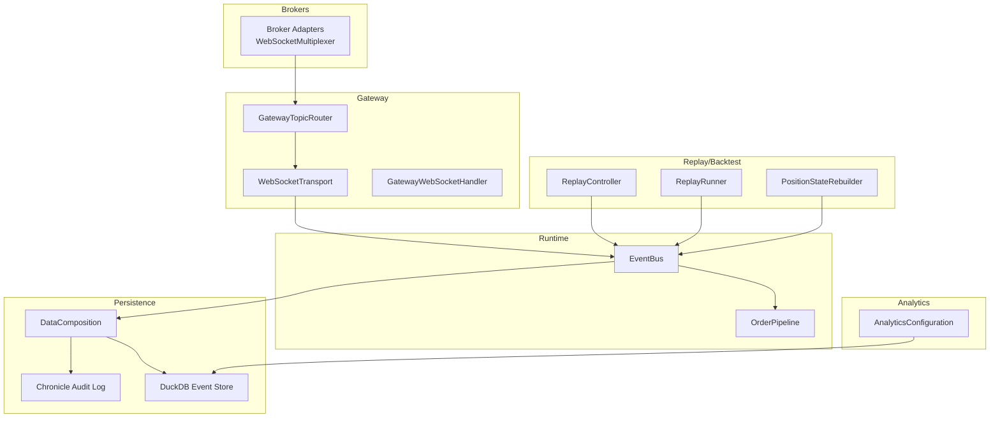
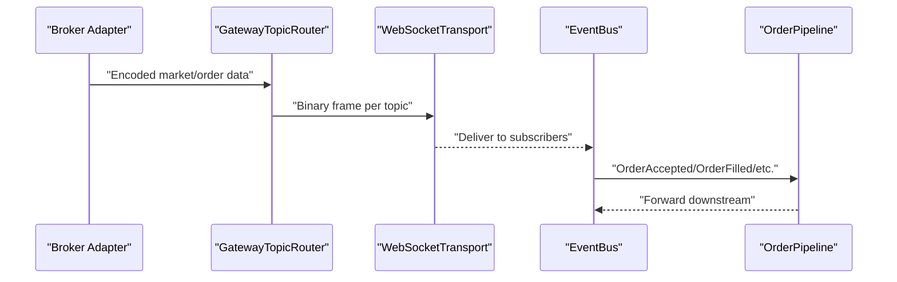
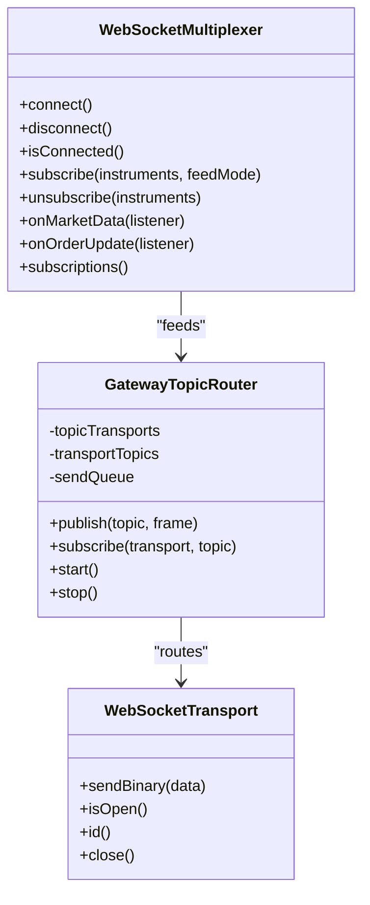
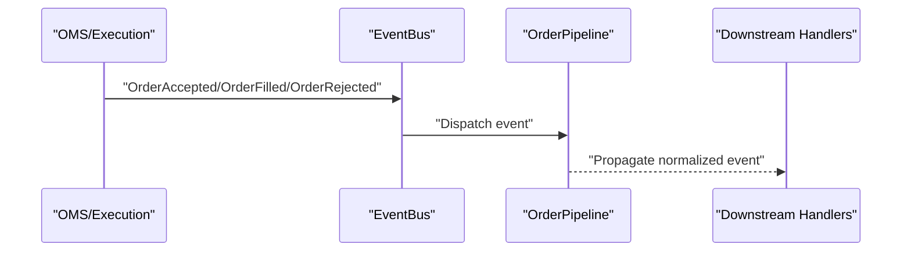
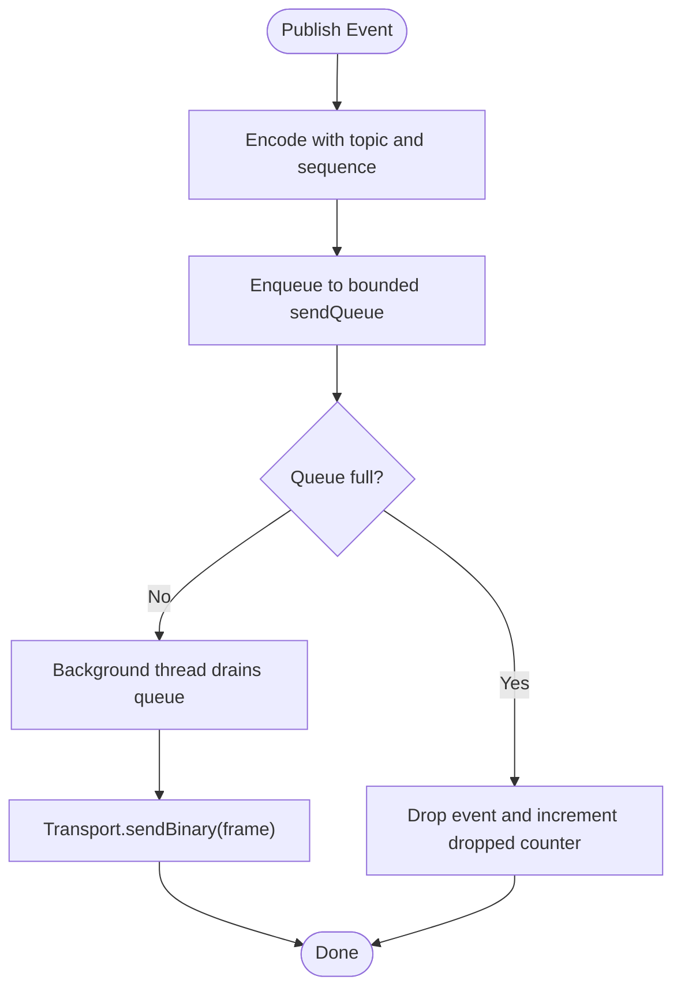
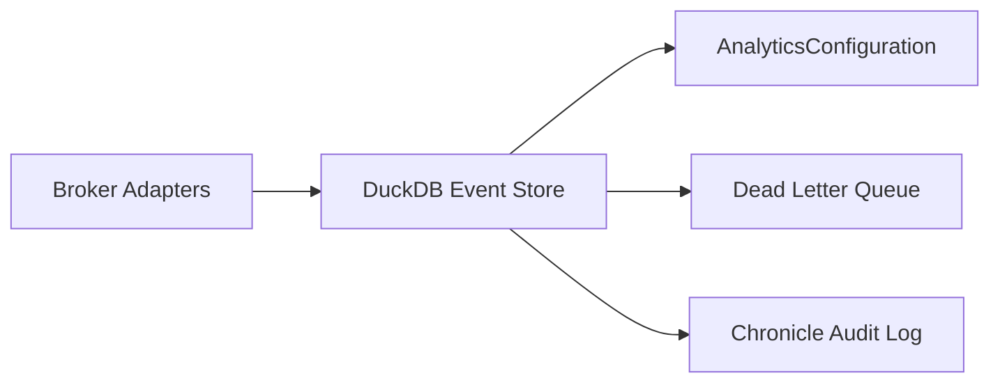
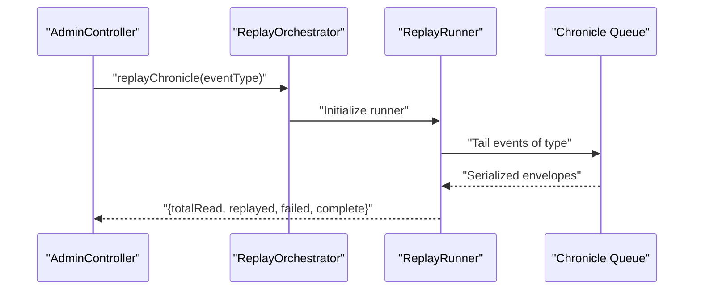
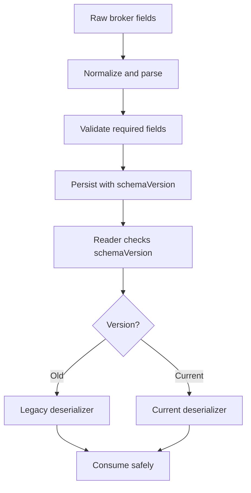
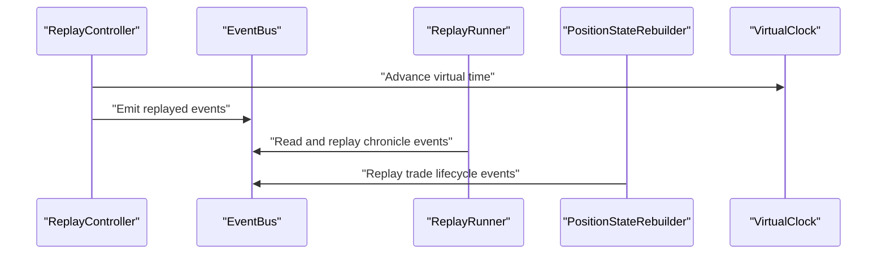
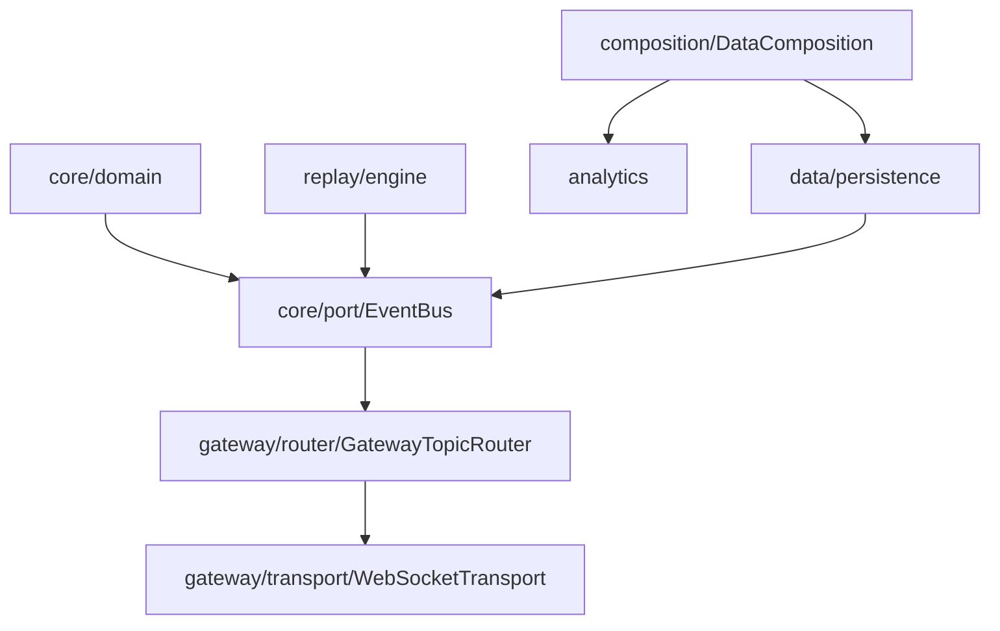

# Data Flow Patterns

<cite>
**Referenced Files in This Document**
- [DomainEvent.java](file://core/src/main/java/com/tradej/core/domain/event/DomainEvent.java)
- [EventMetadata.java](file://core/src/main/java/com/tradej/core/domain/event/EventMetadata.java)
- [EventBus.java](file://core/src/main/java/com/tradej/core/domain/port/EventBus.java)
- [WebSocketMultiplexer.java](file://broker/api/src/main/java/com/tradej/broker/api/port/WebSocketMultiplexer.java)
- [GatewayTopicRouter.java](file://gateway/src/main/java/com/tradej/gateway/router/GatewayTopicRouter.java)
- [GatewayWebSocketHandler.java](file://gateway/src/main/java/com/tradej/gateway/websocket/GatewayWebSocketHandler.java)
- [WebSocketTransport.java](file://gateway/src/main/java/com/tradej/gateway/transport/WebSocketTransport.java)
- [GatewayEventBridgeIntegrationTest.java](file://gateway/src/test/java/com/tradej/gateway/bridge/GatewayEventBridgeIntegrationTest.java)
- [OrderReplayIntegrationTest.java](file://app/src/test/java/com/tradej/app/integration/OrderReplayIntegrationTest.java)
- [ReplayRunner.java](file://data/persistence/src/main/java/com/tradej/persistence/replay/ReplayRunner.java)
- [PositionStateRebuilder.java](file://replay/engine/src/main/java/com/tradej/replay/engine/PositionStateRebuilder.java)
- [ReplayController.java](file://replay/engine/src/main/java/com/tradej/replay/engine/ReplayController.java)
- [VirtualClock.java](file://docs/archive/ARCHITECTURE_EVOLUTION_PIPELINE_OS.md)
- [event-schema-evolution.md](file://docs/event-schema-evolution.md)
- [DataComposition.java](file://composition/src/main/java/com/tradej/composition/DataComposition.java)
- [AnalyticsConfiguration.java](file://app/src/main/java/com/tradej/app/config/AnalyticsConfiguration.java)
- [AdminController.java](file://app/src/main/java/com/tradej/app/admin/AdminController.java)
- [DhanInstrumentLoader.java](file://broker/dhan/src/main/java/com/tradej/broker/dhan/instrument/DhanInstrumentLoader.java)
- [OrderPipelineTest.java](file://runtime/hotpath/src/test/java/com/tradej/hotpath/OrderPipelineTest.java)
</cite>

## Table of Contents
1. [Introduction](#introduction)
2. [Project Structure](#project-structure)
3. [Core Components](#core-components)
4. [Architecture Overview](#architecture-overview)
5. [Detailed Component Analysis](#detailed-component-analysis)
6. [Dependency Analysis](#dependency-analysis)
7. [Performance Considerations](#performance-considerations)
8. [Troubleshooting Guide](#troubleshooting-guide)
9. [Conclusion](#conclusion)
10. [Appendices](#appendices)

## Introduction
This document describes the data flow patterns in Trade-J, focusing on:
- Market data ingestion from brokers and WebSocket multiplexing
- Order lifecycle processing and event propagation
- Real-time streaming via the gateway with topic routing and backpressure
- Historical data ingestion, persistence, and analytics
- Event journaling for audit trails and state reconstruction
- Data transformation, normalization, and schema evolution
- Replay and backtesting flows with virtual time and deterministic execution
- Consistency guarantees, eventual consistency patterns, and conflict resolution

## Project Structure
Trade-J is organized into modules that separate concerns across brokerage adapters, gateway, pipeline runtime, replay/backtesting, persistence, analytics, and CLI/admin tooling. The data plane spans broker integrations, the gateway, the event bus, and persistent stores.

**Diagram sources**
- [WebSocketMultiplexer.java:1-30](file://broker/api/src/main/java/com/tradej/broker/api/port/WebSocketMultiplexer.java#L1-L30)
- [GatewayTopicRouter.java:1-73](file://gateway/src/main/java/com/tradej/gateway/router/GatewayTopicRouter.java#L1-L73)
- [GatewayWebSocketHandler.java:32-67](file://gateway/src/main/java/com/tradej/gateway/websocket/GatewayWebSocketHandler.java#L32-L67)
- [WebSocketTransport.java:1-20](file://gateway/src/main/java/com/tradej/gateway/transport/WebSocketTransport.java#L1-L20)
- [EventBus.java](file://core/src/main/java/com/tradej/core/domain/port/EventBus.java)
- [OrderPipelineTest.java:40-87](file://runtime/hotpath/src/test/java/com/tradej/hotpath/OrderPipelineTest.java#L40-L87)
- [DataComposition.java:31-55](file://composition/src/main/java/com/tradej/composition/DataComposition.java#L31-L55)
- [AnalyticsConfiguration.java:50-90](file://app/src/main/java/com/tradej/app/config/AnalyticsConfiguration.java#L50-L90)
- [ReplayController.java:38-216](file://replay/engine/src/main/java/com/tradej/replay/engine/ReplayController.java#L38-L216)
- [ReplayRunner.java:47-72](file://data/persistence/src/main/java/com/tradej/persistence/replay/ReplayRunner.java#L47-L72)
- [PositionStateRebuilder.java:1-27](file://replay/engine/src/main/java/com/tradej/replay/engine/PositionStateRebuilder.java#L1-L27)

**Section sources**
- [WebSocketMultiplexer.java:1-30](file://broker/api/src/main/java/com/tradej/broker/api/port/WebSocketMultiplexer.java#L1-L30)
- [GatewayTopicRouter.java:1-73](file://gateway/src/main/java/com/tradej/gateway/router/GatewayTopicRouter.java#L1-L73)
- [GatewayWebSocketHandler.java:32-67](file://gateway/src/main/java/com/tradej/gateway/websocket/GatewayWebSocketHandler.java#L32-L67)
- [WebSocketTransport.java:1-20](file://gateway/src/main/java/com/tradej/gateway/transport/WebSocketTransport.java#L1-L20)
- [EventBus.java](file://core/src/main/java/com/tradej/core/domain/port/EventBus.java)
- [OrderPipelineTest.java:40-87](file://runtime/hotpath/src/test/java/com/tradej/hotpath/OrderPipelineTest.java#L40-L87)
- [DataComposition.java:31-55](file://composition/src/main/java/com/tradej/composition/DataComposition.java#L31-L55)
- [AnalyticsConfiguration.java:50-90](file://app/src/main/java/com/tradej/app/config/AnalyticsConfiguration.java#L50-L90)
- [ReplayController.java:38-216](file://replay/engine/src/main/java/com/tradej/replay/engine/ReplayController.java#L38-L216)
- [ReplayRunner.java:47-72](file://data/persistence/src/main/java/com/tradej/persistence/replay/ReplayRunner.java#L47-L72)
- [PositionStateRebuilder.java:1-27](file://replay/engine/src/main/java/com/tradej/replay/engine/PositionStateRebuilder.java#L1-L27)

## Core Components
- Domain events and metadata define immutable, versioned records of state changes across the system.
- The EventBus decouples producers and consumers, enabling asynchronous propagation.
- Broker adapters expose a WebSocketMultiplexer abstraction for multiplexed market data and order updates.
- The Gateway routes binary frames to subscribed WebSocket transports with non-blocking publish semantics and backpressure.
- Persistence is handled by Chronicle for audit logs and DuckDB for event storage and analytics.
- Replay and backtesting orchestrate deterministic execution using virtual time and state rebuilding.

**Section sources**
- [DomainEvent.java](file://core/src/main/java/com/tradej/core/domain/event/DomainEvent.java)
- [EventMetadata.java](file://core/src/main/java/com/tradej/core/domain/event/EventMetadata.java)
- [EventBus.java](file://core/src/main/java/com/tradej/core/domain/port/EventBus.java)
- [WebSocketMultiplexer.java:1-30](file://broker/api/src/main/java/com/tradej/broker/api/port/WebSocketMultiplexer.java#L1-L30)
- [GatewayTopicRouter.java:1-73](file://gateway/src/main/java/com/tradej/gateway/router/GatewayTopicRouter.java#L1-L73)
- [GatewayWebSocketHandler.java:32-67](file://gateway/src/main/java/com/tradej/gateway/websocket/GatewayWebSocketHandler.java#L32-L67)
- [WebSocketTransport.java:1-20](file://gateway/src/main/java/com/tradej/gateway/transport/WebSocketTransport.java#L1-L20)
- [DataComposition.java:31-55](file://composition/src/main/java/com/tradej/composition/DataComposition.java#L31-L55)
- [AnalyticsConfiguration.java:50-90](file://app/src/main/java/com/tradej/app/config/AnalyticsConfiguration.java#L50-L90)
- [ReplayController.java:38-216](file://replay/engine/src/main/java/com/tradej/replay/engine/ReplayController.java#L38-L216)
- [ReplayRunner.java:47-72](file://data/persistence/src/main/java/com/tradej/persistence/replay/ReplayRunner.java#L47-L72)
- [PositionStateRebuilder.java:1-27](file://replay/engine/src/main/java/com/tradej/replay/engine/PositionStateRebuilder.java#L1-L27)

## Architecture Overview
The system’s data plane is event-driven. Brokers ingest market data and order updates via WebSocketMultiplexer, which are normalized and published to the EventBus. The Gateway subscribes to topics and streams binary frames to clients. Persistent stores capture events for audit and analytics. Replay and backtesting consume persisted events to reconstruct state deterministically.

**Diagram sources**
- [GatewayTopicRouter.java:1-73](file://gateway/src/main/java/com/tradej/gateway/router/GatewayTopicRouter.java#L1-L73)
- [GatewayWebSocketHandler.java:32-67](file://gateway/src/main/java/com/tradej/gateway/websocket/GatewayWebSocketHandler.java#L32-L67)
- [WebSocketTransport.java:1-20](file://gateway/src/main/java/com/tradej/gateway/transport/WebSocketTransport.java#L1-L20)
- [EventBus.java](file://core/src/main/java/com/tradej/core/domain/port/EventBus.java)
- [OrderPipelineTest.java:40-87](file://runtime/hotpath/src/test/java/com/tradej/hotpath/OrderPipelineTest.java#L40-L87)

## Detailed Component Analysis

### Market Data Ingestion and WebSocket Multiplexing
- Broker adapters expose a WebSocketMultiplexer interface to connect, subscribe/unsubscribe, and receive callbacks for market data and order updates.
- The Gateway aggregates subscriptions and publishes binary frames to transports, with non-blocking enqueue and bounded queues to prevent memory pressure.

**Diagram sources**
- [WebSocketMultiplexer.java:1-30](file://broker/api/src/main/java/com/tradej/broker/api/port/WebSocketMultiplexer.java#L1-L30)
- [GatewayTopicRouter.java:1-73](file://gateway/src/main/java/com/tradej/gateway/router/GatewayTopicRouter.java#L1-L73)
- [WebSocketTransport.java:1-20](file://gateway/src/main/java/com/tradej/gateway/transport/WebSocketTransport.java#L1-L20)

**Section sources**
- [WebSocketMultiplexer.java:1-30](file://broker/api/src/main/java/com/tradej/broker/api/port/WebSocketMultiplexer.java#L1-L30)
- [GatewayTopicRouter.java:1-73](file://gateway/src/main/java/com/tradej/gateway/router/GatewayTopicRouter.java#L1-L73)
- [GatewayWebSocketHandler.java:32-67](file://gateway/src/main/java/com/tradej/gateway/websocket/GatewayWebSocketHandler.java#L32-L67)
- [WebSocketTransport.java:1-20](file://gateway/src/main/java/com/tradej/gateway/transport/WebSocketTransport.java#L1-L20)
- [GatewayEventBridgeIntegrationTest.java:285-440](file://gateway/src/test/java/com/tradej/gateway/bridge/GatewayEventBridgeIntegrationTest.java#L285-L440)

### Order Lifecycle Processing and Event Propagation
- The EventBus delivers domain events to subscribers. Tests demonstrate forwarding of OrderAccepted, OrderFilled, OrderRejected, and similar lifecycle events.
- The OrderPipeline forwards events downstream, preserving ingestion order and handling nulls gracefully.

**Diagram sources**
- [EventBus.java](file://core/src/main/java/com/tradej/core/domain/port/EventBus.java)
- [OrderPipelineTest.java:40-87](file://runtime/hotpath/src/test/java/com/tradej/hotpath/OrderPipelineTest.java#L40-L87)

**Section sources**
- [EventBus.java](file://core/src/main/java/com/tradej/core/domain/port/EventBus.java)
- [OrderPipelineTest.java:40-87](file://runtime/hotpath/src/test/java/com/tradej/hotpath/OrderPipelineTest.java#L40-L87)

### Real-Time Streaming Architecture
- The Gateway maintains a non-blocking publish queue with backpressure. It tracks topic-to-transport and transport-to-topic mappings and encodes messages with monotonic sequence numbers.
- Subscriptions are managed via single-byte topic identifiers and binary frames.

**Diagram sources**
- [GatewayTopicRouter.java:1-73](file://gateway/src/main/java/com/tradej/gateway/router/GatewayTopicRouter.java#L1-L73)
- [GatewayWebSocketHandler.java:32-67](file://gateway/src/main/java/com/tradej/gateway/websocket/GatewayWebSocketHandler.java#L32-L67)

**Section sources**
- [GatewayTopicRouter.java:1-73](file://gateway/src/main/java/com/tradej/gateway/router/GatewayTopicRouter.java#L1-L73)
- [GatewayWebSocketHandler.java:32-67](file://gateway/src/main/java/com/tradej/gateway/websocket/GatewayWebSocketHandler.java#L32-L67)
- [GatewayEventBridgeIntegrationTest.java:285-440](file://gateway/src/test/java/com/tradej/gateway/bridge/GatewayEventBridgeIntegrationTest.java#L285-L440)

### Historical Data Processing Pipeline
- DuckDB persists events and supports analytics queries. The AnalyticsConfiguration wires repositories and engines for historical bars and rolling options.
- DataComposition sets up Chronicle audit logging and DuckDB stores for async ingestion and graph persistence.

**Diagram sources**
- [AnalyticsConfiguration.java:50-90](file://app/src/main/java/com/tradej/app/config/AnalyticsConfiguration.java#L50-L90)
- [DataComposition.java:31-55](file://composition/src/main/java/com/tradej/composition/DataComposition.java#L31-L55)

**Section sources**
- [AnalyticsConfiguration.java:50-90](file://app/src/main/java/com/tradej/app/config/AnalyticsConfiguration.java#L50-L90)
- [DataComposition.java:31-55](file://composition/src/main/java/com/tradej/composition/DataComposition.java#L31-L55)

### Event Journaling and Audit Trails
- ChronicleAuditLogWriter captures typed events with schemaVersion headers for robust deserialization.
- AdminController exposes endpoints to trigger chronicle replay by event type, returning counts of read, replayed, skipped, and failed entries.

**Diagram sources**
- [AdminController.java:459-487](file://app/src/main/java/com/tradej/app/admin/AdminController.java#L459-L487)
- [ReplayRunner.java:47-72](file://data/persistence/src/main/java/com/tradej/persistence/replay/ReplayRunner.java#L47-L72)

**Section sources**
- [AdminController.java:459-487](file://app/src/main/java/com/tradej/app/admin/AdminController.java#L459-L487)
- [ReplayRunner.java:47-72](file://data/persistence/src/main/java/com/tradej/persistence/replay/ReplayRunner.java#L47-L72)

### Data Transformation, Normalization, and Schema Evolution
- Instrument loaders normalize and parse broker-provided fields into canonical types and units.
- Schema evolution uses per-type versioning with deprecation windows and consumer-first migrations. DuckDB and Chronicle serialization include schemaVersion metadata.

**Diagram sources**
- [DhanInstrumentLoader.java:197-240](file://broker/dhan/src/main/java/com/tradej/broker/dhan/instrument/DhanInstrumentLoader.java#L197-L240)
- [event-schema-evolution.md:40-197](file://docs/event-schema-evolution.md#L40-L197)

**Section sources**
- [DhanInstrumentLoader.java:197-240](file://broker/dhan/src/main/java/com/tradej/broker/dhan/instrument/DhanInstrumentLoader.java#L197-L240)
- [event-schema-evolution.md:40-197](file://docs/event-schema-evolution.md#L40-L197)

### Replay and Backtesting Data Flows
- ReplayController drives deterministic playback using a scheduled loop and a speed multiplier. It advances through historical candles and emits events at controlled intervals.
- ReplayRunner reads typed envelopes from Chronicle, filters by eventType, and reports counters for auditing.
- PositionStateRebuilder replays trade lifecycle events to reconstruct position state at startup.
- VirtualClock provides injectable time for deterministic execution in replay/backtest mode.

**Diagram sources**
- [ReplayController.java:38-216](file://replay/engine/src/main/java/com/tradej/replay/engine/ReplayController.java#L38-L216)
- [ReplayRunner.java:47-72](file://data/persistence/src/main/java/com/tradej/persistence/replay/ReplayRunner.java#L47-L72)
- [PositionStateRebuilder.java:1-27](file://replay/engine/src/main/java/com/tradej/replay/engine/PositionStateRebuilder.java#L1-L27)
- [VirtualClock.java:1894-1931](file://docs/archive/ARCHITECTURE_EVOLUTION_PIPELINE_OS.md#L1894-L1931)

**Section sources**
- [ReplayController.java:38-216](file://replay/engine/src/main/java/com/tradej/replay/engine/ReplayController.java#L38-L216)
- [ReplayRunner.java:47-72](file://data/persistence/src/main/java/com/tradej/persistence/replay/ReplayRunner.java#L47-L72)
- [PositionStateRebuilder.java:1-27](file://replay/engine/src/main/java/com/tradej/replay/engine/PositionStateRebuilder.java#L1-L27)
- [VirtualClock.java:1894-1931](file://docs/archive/ARCHITECTURE_EVOLUTION_PIPELINE_OS.md#L1894-L1931)

### Event Ordering and Determinism
- Tests confirm replay preserves ingestion order and that null events are ignored, ensuring robustness in event processing.
- Replay orchestrators snapshot and restore node state to guarantee deterministic execution across runs.

**Section sources**
- [OrderReplayIntegrationTest.java:94-122](file://app/src/test/java/com/tradej/app/integration/OrderReplayIntegrationTest.java#L94-L122)
- [OrderPipelineTest.java:40-87](file://runtime/hotpath/src/test/java/com/tradej/hotpath/OrderPipelineTest.java#L40-L87)
- [docs/archive/ARCHITECTURE_EVOLUTION_PIPELINE_OS.md:1146-1209](file://docs/archive/ARCHITECTURE_EVOLUTION_PIPELINE_OS.md#L1146-L1209)

## Dependency Analysis
The following diagram highlights module-level dependencies among core runtime, gateway, persistence, analytics, and replay components.

**Diagram sources**
- [EventBus.java](file://core/src/main/java/com/tradej/core/domain/port/EventBus.java)
- [GatewayTopicRouter.java:1-73](file://gateway/src/main/java/com/tradej/gateway/router/GatewayTopicRouter.java#L1-L73)
- [WebSocketTransport.java:1-20](file://gateway/src/main/java/com/tradej/gateway/transport/WebSocketTransport.java#L1-L20)
- [DataComposition.java:31-55](file://composition/src/main/java/com/tradej/composition/DataComposition.java#L31-L55)
- [ReplayRunner.java:47-72](file://data/persistence/src/main/java/com/tradej/persistence/replay/ReplayRunner.java#L47-L72)
- [AnalyticsConfiguration.java:50-90](file://app/src/main/java/com/tradej/app/config/AnalyticsConfiguration.java#L50-L90)

**Section sources**
- [EventBus.java](file://core/src/main/java/com/tradej/core/domain/port/EventBus.java)
- [GatewayTopicRouter.java:1-73](file://gateway/src/main/java/com/tradej/gateway/router/GatewayTopicRouter.java#L1-L73)
- [WebSocketTransport.java:1-20](file://gateway/src/main/java/com/tradej/gateway/transport/WebSocketTransport.java#L1-L20)
- [DataComposition.java:31-55](file://composition/src/main/java/com/tradej/composition/DataComposition.java#L31-L55)
- [ReplayRunner.java:47-72](file://data/persistence/src/main/java/com/tradej/persistence/replay/ReplayRunner.java#L47-L72)
- [AnalyticsConfiguration.java:50-90](file://app/src/main/java/com/tradej/app/config/AnalyticsConfiguration.java#L50-L90)

## Performance Considerations
- Non-blocking publish with bounded queues prevents memory exhaustion under high volatility; dropped events are tracked for observability.
- Backpressure is enforced by dropping frames when the send queue is full.
- Replay speed is adjustable to balance throughput and fidelity; scheduling caps maximum frequency.
- DuckDB-backed event stores enable efficient analytics and historical queries.

[No sources needed since this section provides general guidance]

## Troubleshooting Guide
- Gateway delivery anomalies: Verify session subscription and router start/stop behavior; tests demonstrate per-session topic isolation and restart continuity.
- Replay parity: Use admin endpoints to replay chronicle events by type and inspect counters for silent data loss.
- Schema evolution: Ensure deprecation windows and consumer-first migrations; DuckDB and Chronicle readers branch on schemaVersion.

**Section sources**
- [GatewayEventBridgeIntegrationTest.java:285-440](file://gateway/src/test/java/com/tradej/gateway/bridge/GatewayEventBridgeIntegrationTest.java#L285-L440)
- [AdminController.java:459-487](file://app/src/main/java/com/tradej/app/admin/AdminController.java#L459-L487)
- [event-schema-evolution.md:40-197](file://docs/event-schema-evolution.md#L40-L197)

## Conclusion
Trade-J employs an event-driven architecture with clear separation between ingestion, routing, processing, persistence, and replay. The gateway’s non-blocking routing, robust schema evolution, and replay/backtesting with virtual time enable deterministic execution and strong auditability. Persistence via DuckDB and Chronicle supports both analytics and compliance needs.

[No sources needed since this section summarizes without analyzing specific files]

## Appendices

### Data Consistency and Conflict Resolution
- Event journaling with schemaVersion headers and monotonic sequencing supports eventual consistency and auditability.
- Replay orchestrators snapshot and restore node state to resolve inconsistencies during transitions between live and replay modes.
- Dead letter queues capture malformed or undeliverable entries for offline remediation.

**Section sources**
- [event-schema-evolution.md:40-197](file://docs/event-schema-evolution.md#L40-L197)
- [docs/archive/ARCHITECTURE_EVOLUTION_PIPELINE_OS.md:1146-1209](file://docs/archive/ARCHITECTURE_EVOLUTION_PIPELINE_OS.md#L1146-L1209)
- [DataComposition.java:31-55](file://composition/src/main/java/com/tradej/composition/DataComposition.java#L31-L55)