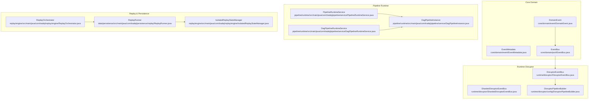
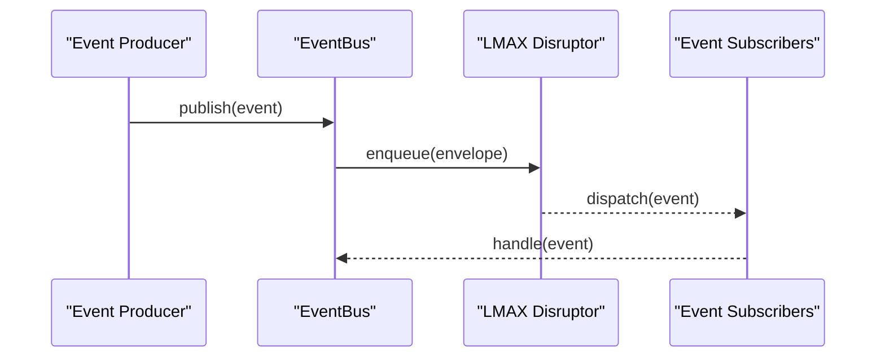
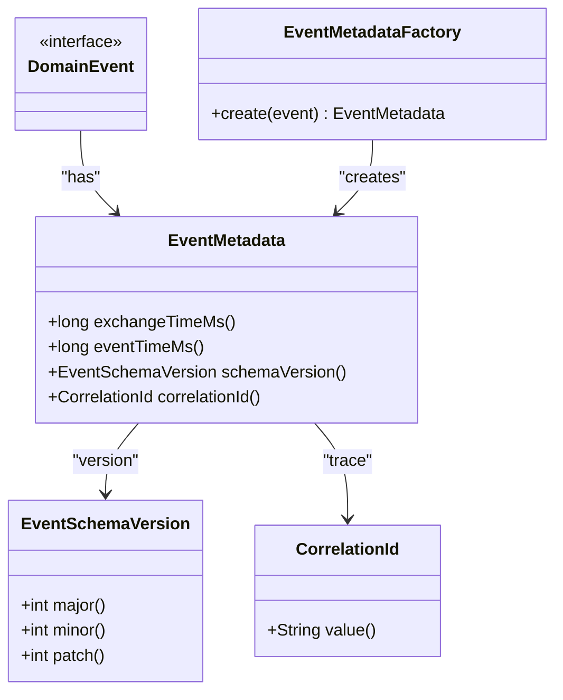
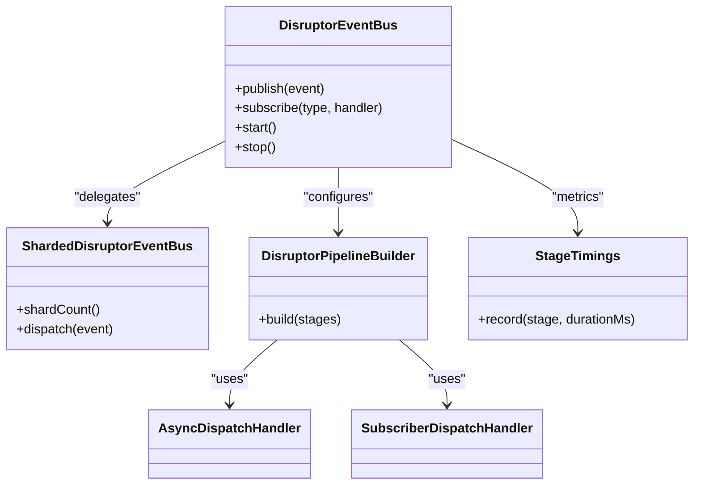
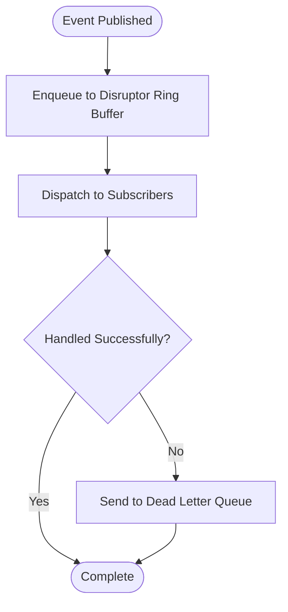
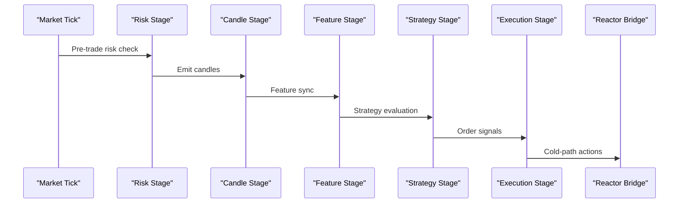
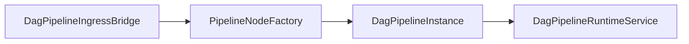
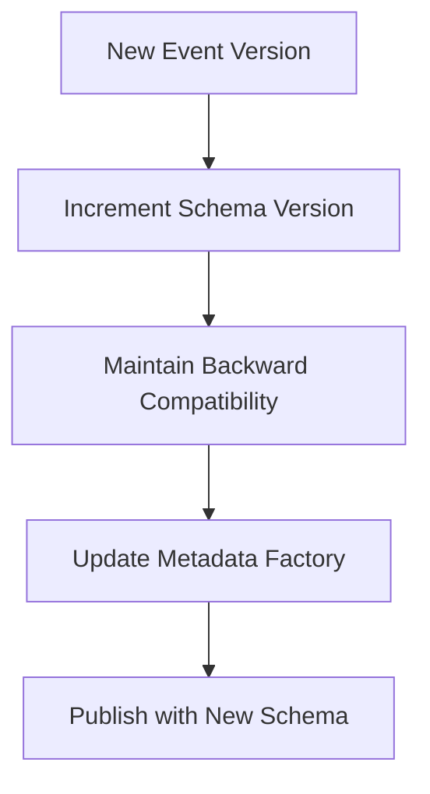
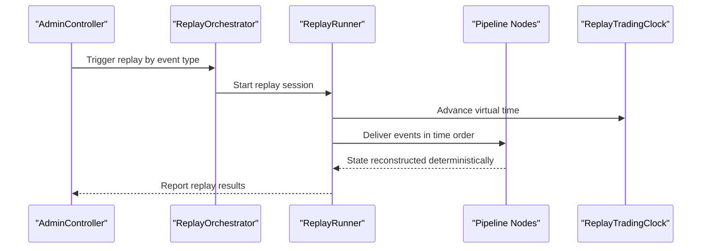
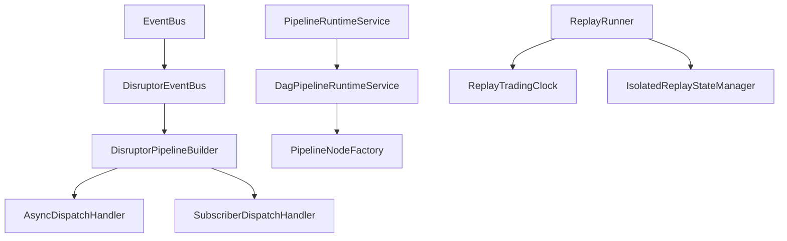

# Event-Driven Architecture

<cite>
**Referenced Files in This Document**
- [DomainEvent.java](file://core/src/main/java/com/tradej/core/domain/event/DomainEvent.java)
- [EventMetadata.java](file://core/src/main/java/com/tradej/core/domain/event/EventMetadata.java)
- [EventMetadataFactory.java](file://core/src/main/java/com/tradej/core/domain/event/EventMetadataFactory.java)
- [EventSchemaVersion.java](file://core/src/main/java/com/tradej/core/domain/event/EventSchemaVersion.java)
- [CorrelationId.java](file://core/src/main/java/com/tradej/core/value/CorrelationId.java)
- [EventBus.java](file://core/src/main/java/com/tradej/core/domain/port/EventBus.java)
- [DeadLetterQueue.java](file://core/src/main/java/com/tradej/core/port/DeadLetterQueue.java)
- [DisruptorEventBus.java](file://runtime/disruptor/src/main/java/com/tradej/disruptor/DisruptorEventBus.java)
- [ShardedDisruptorEventBus.java](file://runtime/disruptor/src/main/java/com/tradej/disruptor/ShardedDisruptorEventBus.java)
- [DisruptorPipelineBuilder.java](file://runtime/disruptor/src/main/java/com/tradej/disruptor/config/DisruptorPipelineBuilder.java)
- [StageTimings.java](file://runtime/disruptor/src/main/java/com/tradej/disruptor/config/StageTimings.java)
- [StageTiming.java](file://runtime/disruptor/src/main/java/com/tradej/disruptor/config/StageTiming.java)
- [AsyncDispatchHandler.java](file://runtime/disruptor/src/main/java/com/tradej/disruptor/config/AsyncDispatchHandler.java)
- [SubscriberDispatchHandler.java](file://runtime/disruptor/src/main/java/com/tradej/disruptor/config/SubscriberDispatchHandler.java)
- [MutableDomainEventEnvelope.java](file://runtime/disruptor/src/main/java/com/tradej/disruptor/MutableDomainEventEnvelope.java)
- [PipelineRuntimeService.java](file://pipeline/runtime/src/main/java/com/tradej/pipeline/service/PipelineRuntimeService.java)
- [DagPipelineRuntimeService.java](file://pipeline/runtime/src/main/java/com/tradej/pipeline/service/DagPipelineRuntimeService.java)
- [DagPipelineInstance.java](file://pipeline/runtime/src/main/java/com/tradej/pipeline/service/DagPipelineInstance.java)
- [DagPipelineIngressBridge.java](file://pipeline/runtime/src/main/java/com/tradej/pipeline/service/DagPipelineIngressBridge.java)
- [PipelineNodeFactory.java](file://pipeline/runtime/src/main/java/com/tradej/pipeline/service/PipelineNodeFactory.java)
- [PipelineCompileContexts.java](file://pipeline/runtime/src/main/java/com/tradej/pipeline/service/PipelineCompileContexts.java)
- [PipelineConfig.java](file://runtime/hotpath/src/main/java/com/tradej/hotpath/PipelineConfig.java)
- [AdminController.java](file://app/src/main/java/com/tradej/app/admin/AdminController.java)
- [ReplayRunner.java](file://data/persistence/src/main/java/com/tradej/persistence/replay/ReplayRunner.java)
- [ReplayOrchestrator.java](file://replay/engine/src/main/java/com/tradej/replay/engine/ReplayOrchestrator.java)
- [IsolatedReplayStateManager.java](file://replay/engine/src/main/java/com/tradej/replay/engine/IsolatedReplayStateManager.java)
- [PositionStateRebuilder.java](file://replay/engine/src/main/java/com/tradej/replay/engine/PositionStateRebuilder.java)
- [ReplayController.java](file://replay/engine/src/main/java/com/tradej/replay/engine/ReplayController.java)
- [MultiTimeframeContext.java](file://replay/engine/src/main/java/com/tradej/replay/engine/MultiTimeframeContext.java)
- [TradingClock.java](file://core/src/main/java/com/tradej/core/time/TradingClock.java)
- [LiveTradingClock.java](file://core/src/main/java/com/tradej/core/time/LiveTradingClock.java)
- [ReplayTradingClock.java](file://core/src/main/java/com/tradej/core/time/ReplayTradingClock.java)
- [ReplayTimeChangedEvent.java](file://core/src/main/java/com/tradej/core/domain/event/ReplayTimeChangedEvent.java)
- [OrderReplayIntegrationTest.java](file://app/src/test/java/com/tradej/app/integration/OrderReplayIntegrationTest.java)
- [FillReplayIntegrationTest.java](file://app/src/test/java/com/tradej/app/integration/FillReplayIntegrationTest.java)
- [DisruptorHighThroughputStressTest.java](file://runtime/hotpath/src/test/java/com/tradej/hotpath/DisruptorHighThroughputStressTest.java)
- [ARCHITECTURE.md](file://docs/ARCHITECTURE.md)
- [PIPELINE_DESIGN.md](file://docs/PIPELINE_DESIGN.md)
- [event-schema-evolution.md](file://docs/event-schema-evolution.md)
- [Trade-J-Architecture-Visual.html](file://docs/visuals/Trade-J-Architecture-Visual.html)
</cite>

## Table of Contents
1. [Introduction](#introduction)
2. [Project Structure](#project-structure)
3. [Core Components](#core-components)
4. [Architecture Overview](#architecture-overview)
5. [Detailed Component Analysis](#detailed-component-analysis)
6. [Dependency Analysis](#dependency-analysis)
7. [Performance Considerations](#performance-considerations)
8. [Troubleshooting Guide](#troubleshooting-guide)
9. [Conclusion](#conclusion)
10. [Appendices](#appendices)

## Introduction
This document describes the Trade-J event-driven architecture with a focus on the core event model built on DomainEvent and Event Sourcing patterns, the LMAX Disruptor implementation for sub-millisecond event processing, the event bus architecture and message routing, and the dual pipeline architectures: the legacy hot path (risk → candle → strategy → execution) and the graph runtime for composable DAG workflows. It also covers event schema evolution, metadata and correlation ID tracking, event replay, audit logging, state reconstruction, performance characteristics, backpressure handling, and fault tolerance.

## Project Structure
Trade-J organizes event-driven concerns across several modules:
- Core domain and ports define the event model, metadata, and event bus contract.
- Runtime modules implement high-throughput event processing via LMAX Disruptor.
- Pipeline runtime implements both the legacy hot path and the graph-based DAG runtime.
- Replay engine and persistence enable audit logging, replay, and state reconstruction.
- Application admin APIs expose operational controls for replay and diagnostics.

**Diagram sources**
- [DomainEvent.java:1-200](file://core/src/main/java/com/tradej/core/domain/event/DomainEvent.java#L1-L200)
- [EventMetadata.java:1-120](file://core/src/main/java/com/tradej/core/domain/event/EventMetadata.java#L1-L120)
- [EventBus.java:1-120](file://core/src/main/java/com/tradej/core/domain/port/EventBus.java#L1-L120)
- [DisruptorEventBus.java:1-200](file://runtime/disruptor/src/main/java/com/tradej/disruptor/DisruptorEventBus.java#L1-L200)
- [ShardedDisruptorEventBus.java:1-200](file://runtime/disruptor/src/main/java/com/tradej/disruptor/ShardedDisruptorEventBus.java#L1-L200)
- [DisruptorPipelineBuilder.java:1-200](file://runtime/disruptor/src/main/java/com/tradej/disruptor/config/DisruptorPipelineBuilder.java#L1-L200)
- [PipelineRuntimeService.java:180-210](file://pipeline/runtime/src/main/java/com/tradej/pipeline/service/PipelineRuntimeService.java#L180-L210)
- [DagPipelineRuntimeService.java:1-200](file://pipeline/runtime/src/main/java/com/tradej/pipeline/service/DagPipelineRuntimeService.java#L1-L200)
- [DagPipelineInstance.java:1-200](file://pipeline/runtime/src/main/java/com/tradej/pipeline/service/DagPipelineInstance.java#L1-L200)
- [ReplayOrchestrator.java:1-200](file://replay/engine/src/main/java/com/tradej/replay/engine/ReplayOrchestrator.java#L1-L200)
- [ReplayRunner.java:100-130](file://data/persistence/src/main/java/com/tradej/persistence/replay/ReplayRunner.java#L100-L130)
- [IsolatedReplayStateManager.java:1-200](file://replay/engine/src/main/java/com/tradej/replay/engine/IsolatedReplayStateManager.java#L1-L200)

**Section sources**
- [ARCHITECTURE.md:1-200](file://docs/ARCHITECTURE.md#L1-L200)
- [PIPELINE_DESIGN.md:1-200](file://docs/PIPELINE_DESIGN.md#L1-L200)

## Core Components
- DomainEvent: The foundational event interface representing immutable business facts. See [DomainEvent.java:1-200](file://core/src/main/java/com/tradej/core/domain/event/DomainEvent.java#L1-L200).
- EventMetadata: Carries cross-cutting attributes such as timestamps, schema version, and correlation identifiers. See [EventMetadata.java:1-120](file://core/src/main/java/com/tradej/core/domain/event/EventMetadata.java#L1-L120).
- EventMetadataFactory: Produces standardized metadata for emitted events. See [EventMetadataFactory.java:1-120](file://core/src/main/java/com/tradej/core/domain/event/EventMetadataFactory.java#L1-L120).
- EventSchemaVersion: Encodes schema versioning for safe evolution. See [EventSchemaVersion.java:1-120](file://core/src/main/java/com/tradej/core/domain/event/EventSchemaVersion.java#L1-L120).
- CorrelationId: Provides end-to-end traceability across event streams. See [CorrelationId.java:1-120](file://core/src/main/java/com/tradej/core/value/CorrelationId.java#L1-L120).
- EventBus: The event bus contract enabling publish/subscribe semantics. See [EventBus.java:1-120](file://core/src/main/java/com/tradej/core/domain/port/EventBus.java#L1-L120).
- DeadLetterQueue: Mechanism for handling unprocessable events. See [DeadLetterQueue.java:1-120](file://core/src/main/java/com/tradej/core/port/DeadLetterQueue.java#L1-L120).

**Section sources**
- [DomainEvent.java:1-200](file://core/src/main/java/com/tradej/core/domain/event/DomainEvent.java#L1-L200)
- [EventMetadata.java:1-120](file://core/src/main/java/com/tradej/core/domain/event/EventMetadata.java#L1-L120)
- [EventMetadataFactory.java:1-120](file://core/src/main/java/com/tradej/core/domain/event/EventMetadataFactory.java#L1-L120)
- [EventSchemaVersion.java:1-120](file://core/src/main/java/com/tradej/core/domain/event/EventSchemaVersion.java#L1-L120)
- [CorrelationId.java:1-120](file://core/src/main/java/com/tradej/core/value/CorrelationId.java#L1-L120)
- [EventBus.java:1-120](file://core/src/main/java/com/tradej/core/domain/port/EventBus.java#L1-L120)
- [DeadLetterQueue.java:1-120](file://core/src/main/java/com/tradej/core/port/DeadLetterQueue.java#L1-L120)

## Architecture Overview
Trade-J employs an event-centric design with:
- Event model: Immutable DomainEvent with typed metadata and schema versioning.
- Event bus: Publish-subscribe via EventBus, backed by LMAX Disruptor for high throughput and low latency.
- Pipelines: Legacy hot path with fixed stage order and a graph runtime for composable DAG workflows.
- Replay and audit: Persistent event stores and replay orchestration for deterministic state reconstruction.

**Diagram sources**
- [EventBus.java:1-120](file://core/src/main/java/com/tradej/core/domain/port/EventBus.java#L1-L120)
- [DisruptorEventBus.java:1-200](file://runtime/disruptor/src/main/java/com/tradej/disruptor/DisruptorEventBus.java#L1-L200)
- [MutableDomainEventEnvelope.java:1-120](file://runtime/disruptor/src/main/java/com/tradej/disruptor/MutableDomainEventEnvelope.java#L1-L120)

## Detailed Component Analysis

### Event Model and Event Sourcing
- DomainEvent defines the contract for all events. See [DomainEvent.java:1-200](file://core/src/main/java/com/tradej/core/domain/event/DomainEvent.java#L1-L200).
- EventMetadata captures exchange time, event time, schema version, and correlation ID. See [EventMetadata.java:1-120](file://core/src/main/java/com/tradej/core/domain/event/EventMetadata.java#L1-L120).
- EventMetadataFactory centralizes metadata creation. See [EventMetadataFactory.java:1-120](file://core/src/main/java/com/tradej/core/domain/event/EventMetadataFactory.java#L1-L120).
- EventSchemaVersion enables schema evolution without breaking consumers. See [EventSchemaVersion.java:1-120](file://core/src/main/java/com/tradej/core/domain/event/EventSchemaVersion.java#L1-L120).
- CorrelationId ensures end-to-end traceability across systems. See [CorrelationId.java:1-120](file://core/src/main/java/com/tradej/core/value/CorrelationId.java#L1-L120).

**Diagram sources**
- [DomainEvent.java:1-200](file://core/src/main/java/com/tradej/core/domain/event/DomainEvent.java#L1-L200)
- [EventMetadata.java:1-120](file://core/src/main/java/com/tradej/core/domain/event/EventMetadata.java#L1-L120)
- [EventMetadataFactory.java:1-120](file://core/src/main/java/com/tradej/core/domain/event/EventMetadataFactory.java#L1-L120)
- [EventSchemaVersion.java:1-120](file://core/src/main/java/com/tradej/core/domain/event/EventSchemaVersion.java#L1-L120)
- [CorrelationId.java:1-120](file://core/src/main/java/com/tradej/core/value/CorrelationId.java#L1-L120)

**Section sources**
- [DomainEvent.java:1-200](file://core/src/main/java/com/tradej/core/domain/event/DomainEvent.java#L1-L200)
- [EventMetadata.java:1-120](file://core/src/main/java/com/tradej/core/domain/event/EventMetadata.java#L1-L120)
- [EventMetadataFactory.java:1-120](file://core/src/main/java/com/tradej/core/domain/event/EventMetadataFactory.java#L1-L120)
- [EventSchemaVersion.java:1-120](file://core/src/main/java/com/tradej/core/domain/event/EventSchemaVersion.java#L1-L120)
- [CorrelationId.java:1-120](file://core/src/main/java/com/tradej/core/value/CorrelationId.java#L1-L120)

### LMAX Disruptor Implementation
- DisruptorEventBus provides high-throughput event bus backed by LMAX Disruptor. See [DisruptorEventBus.java:1-200](file://runtime/disruptor/src/main/java/com/tradej/disruptor/DisruptorEventBus.java#L1-L200).
- ShardedDisruptorEventBus scales horizontally across shards. See [ShardedDisruptorEventBus.java:1-200](file://runtime/disruptor/src/main/java/com/tradej/disruptor/ShardedDisruptorEventBus.java#L1-L200).
- DisruptorPipelineBuilder configures stage ordering and handlers. See [DisruptorPipelineBuilder.java:1-200](file://runtime/disruptor/src/main/java/com/tradej/disruptor/config/DisruptorPipelineBuilder.java#L1-L200).
- StageTimings and StageTiming capture per-stage latency metrics. See [StageTimings.java:1-120](file://runtime/disruptor/src/main/java/com/tradej/disruptor/config/StageTimings.java#L1-L120) and [StageTiming.java:1-120](file://runtime/disruptor/src/main/java/com/tradej/disruptor/config/StageTiming.java#L1-L120).
- AsyncDispatchHandler and SubscriberDispatchHandler manage dispatch strategies. See [AsyncDispatchHandler.java:1-120](file://runtime/disruptor/src/main/java/com/tradej/disruptor/config/AsyncDispatchHandler.java#L1-L120) and [SubscriberDispatchHandler.java:1-120](file://runtime/disruptor/src/main/java/com/tradej/disruptor/config/SubscriberDispatchHandler.java#L1-L120).
- MutableDomainEventEnvelope carries events through the ring buffer efficiently. See [MutableDomainEventEnvelope.java:1-120](file://runtime/disruptor/src/main/java/com/tradej/disruptor/MutableDomainEventEnvelope.java#L1-L120).

**Diagram sources**
- [DisruptorEventBus.java:1-200](file://runtime/disruptor/src/main/java/com/tradej/disruptor/DisruptorEventBus.java#L1-L200)
- [ShardedDisruptorEventBus.java:1-200](file://runtime/disruptor/src/main/java/com/tradej/disruptor/ShardedDisruptorEventBus.java#L1-L200)
- [DisruptorPipelineBuilder.java:1-200](file://runtime/disruptor/src/main/java/com/tradej/disruptor/config/DisruptorPipelineBuilder.java#L1-L200)
- [StageTimings.java:1-120](file://runtime/disruptor/src/main/java/com/tradej/disruptor/config/StageTimings.java#L1-L120)
- [AsyncDispatchHandler.java:1-120](file://runtime/disruptor/src/main/java/com/tradej/disruptor/config/AsyncDispatchHandler.java#L1-L120)
- [SubscriberDispatchHandler.java:1-120](file://runtime/disruptor/src/main/java/com/tradej/disruptor/config/SubscriberDispatchHandler.java#L1-L120)

**Section sources**
- [DisruptorEventBus.java:1-200](file://runtime/disruptor/src/main/java/com/tradej/disruptor/DisruptorEventBus.java#L1-L200)
- [ShardedDisruptorEventBus.java:1-200](file://runtime/disruptor/src/main/java/com/tradej/disruptor/ShardedDisruptorEventBus.java#L1-L200)
- [DisruptorPipelineBuilder.java:1-200](file://runtime/disruptor/src/main/java/com/tradej/disruptor/config/DisruptorPipelineBuilder.java#L1-L200)
- [StageTimings.java:1-120](file://runtime/disruptor/src/main/java/com/tradej/disruptor/config/StageTimings.java#L1-L120)
- [StageTiming.java:1-120](file://runtime/disruptor/src/main/java/com/tradej/disruptor/config/StageTiming.java#L1-L120)
- [AsyncDispatchHandler.java:1-120](file://runtime/disruptor/src/main/java/com/tradej/disruptor/config/AsyncDispatchHandler.java#L1-L120)
- [SubscriberDispatchHandler.java:1-120](file://runtime/disruptor/src/main/java/com/tradej/disruptor/config/SubscriberDispatchHandler.java#L1-L120)
- [MutableDomainEventEnvelope.java:1-120](file://runtime/disruptor/src/main/java/com/tradej/disruptor/MutableDomainEventEnvelope.java#L1-L120)

### Event Bus Architecture and Message Routing
- EventBus defines the contract for publish/subscribe. See [EventBus.java:1-120](file://core/src/main/java/com/tradej/core/domain/port/EventBus.java#L1-L120).
- DeadLetterQueue handles undeliverable or unprocessable events. See [DeadLetterQueue.java:1-120](file://core/src/main/java/com/tradej/core/port/DeadLetterQueue.java#L1-L120).
- Backpressure is managed through Disruptor buffers and stage timings; tests validate sub-millisecond RTT under load. See [DisruptorHighThroughputStressTest.java:56-82](file://runtime/hotpath/src/test/java/com/tradej/hotpath/DisruptorHighThroughputStressTest.java#L56-L82).

**Diagram sources**
- [EventBus.java:1-120](file://core/src/main/java/com/tradej/core/domain/port/EventBus.java#L1-L120)
- [DeadLetterQueue.java:1-120](file://core/src/main/java/com/tradej/core/port/DeadLetterQueue.java#L1-L120)
- [DisruptorEventBus.java:1-200](file://runtime/disruptor/src/main/java/com/tradej/disruptor/DisruptorEventBus.java#L1-L200)

**Section sources**
- [EventBus.java:1-120](file://core/src/main/java/com/tradej/core/domain/port/EventBus.java#L1-L120)
- [DeadLetterQueue.java:1-120](file://core/src/main/java/com/tradej/core/port/DeadLetterQueue.java#L1-L120)
- [DisruptorHighThroughputStressTest.java:56-82](file://runtime/hotpath/src/test/java/com/tradej/hotpath/DisruptorHighThroughputStressTest.java#L56-L82)

### Legacy Hot Path Pipeline (Fixed Stage Order)
- PipelineConfig wires the hot path stages: risk → candle → feature → strategy → execution → reactor cold-path bridge. See [PipelineConfig.java:39-175](file://runtime/hotpath/src/main/java/com/tradej/hotpath/PipelineConfig.java#L39-L175).
- PipelineRuntimeService.defaultHotPathGraph defines the default node graph and edges. See [PipelineRuntimeService.java:184-210](file://pipeline/runtime/src/main/java/com/tradej/pipeline/service/PipelineRuntimeService.java#L184-L210).

**Diagram sources**
- [PipelineConfig.java:39-175](file://runtime/hotpath/src/main/java/com/tradej/hotpath/PipelineConfig.java#L39-L175)
- [PipelineRuntimeService.java:184-210](file://pipeline/runtime/src/main/java/com/tradej/pipeline/service/PipelineRuntimeService.java#L184-L210)

**Section sources**
- [PipelineConfig.java:39-175](file://runtime/hotpath/src/main/java/com/tradej/hotpath/PipelineConfig.java#L39-L175)
- [PipelineRuntimeService.java:184-210](file://pipeline/runtime/src/main/java/com/tradej/pipeline/service/PipelineRuntimeService.java#L184-L210)

### Graph Runtime Pipeline (Composable DAG Workflows)
- DagPipelineRuntimeService orchestrates DAG-based pipelines. See [DagPipelineRuntimeService.java:1-200](file://pipeline/runtime/src/main/java/com/tradej/pipeline/service/DagPipelineRuntimeService.java#L1-L200).
- DagPipelineInstance manages individual DAG runtime instances. See [DagPipelineInstance.java:1-200](file://pipeline/runtime/src/main/java/com/tradej/pipeline/service/DagPipelineInstance.java#L1-L200).
- DagPipelineIngressBridge connects external events into the DAG runtime. See [DagPipelineIngressBridge.java:1-200](file://pipeline/runtime/src/main/java/com/tradej/pipeline/service/DagPipelineIngressBridge.java#L1-L200).
- PipelineNodeFactory creates nodes from definitions. See [PipelineNodeFactory.java:1-200](file://pipeline/runtime/src/main/java/com/tradej/pipeline/service/PipelineNodeFactory.java#L1-L200).
- PipelineCompileContexts holds compilation state and bindings. See [PipelineCompileContexts.java:1-200](file://pipeline/runtime/src/main/java/com/tradej/pipeline/service/PipelineCompileContexts.java#L1-L200).

**Diagram sources**
- [DagPipelineRuntimeService.java:1-200](file://pipeline/runtime/src/main/java/com/tradej/pipeline/service/DagPipelineRuntimeService.java#L1-L200)
- [DagPipelineInstance.java:1-200](file://pipeline/runtime/src/main/java/com/tradej/pipeline/service/DagPipelineInstance.java#L1-L200)
- [DagPipelineIngressBridge.java:1-200](file://pipeline/runtime/src/main/java/com/tradej/pipeline/service/DagPipelineIngressBridge.java#L1-L200)
- [PipelineNodeFactory.java:1-200](file://pipeline/runtime/src/main/java/com/tradej/pipeline/service/PipelineNodeFactory.java#L1-L200)
- [PipelineCompileContexts.java:1-200](file://pipeline/runtime/src/main/java/com/tradej/pipeline/service/PipelineCompileContexts.java#L1-L200)

**Section sources**
- [DagPipelineRuntimeService.java:1-200](file://pipeline/runtime/src/main/java/com/tradej/pipeline/service/DagPipelineRuntimeService.java#L1-L200)
- [DagPipelineInstance.java:1-200](file://pipeline/runtime/src/main/java/com/tradej/pipeline/service/DagPipelineInstance.java#L1-L200)
- [DagPipelineIngressBridge.java:1-200](file://pipeline/runtime/src/main/java/com/tradej/pipeline/service/DagPipelineIngressBridge.java#L1-L200)
- [PipelineNodeFactory.java:1-200](file://pipeline/runtime/src/main/java/com/tradej/pipeline/service/PipelineNodeFactory.java#L1-L200)
- [PipelineCompileContexts.java:1-200](file://pipeline/runtime/src/main/java/com/tradej/pipeline/service/PipelineCompileContexts.java#L1-L200)

### Event Schema Evolution and Metadata
- EventSchemaVersion supports backward-compatible evolution. See [EventSchemaVersion.java:1-120](file://core/src/main/java/com/tradej/core/domain/event/EventSchemaVersion.java#L1-L120).
- EventMetadata tracks exchange and event timestamps, aiding replay and audit. See [EventMetadata.java:1-120](file://core/src/main/java/com/tradej/core/domain/event/EventMetadata.java#L1-L120).
- Schema evolution guidance is documented in [event-schema-evolution.md:1-200](file://docs/event-schema-evolution.md#L1-L200).

**Diagram sources**
- [EventSchemaVersion.java:1-120](file://core/src/main/java/com/tradej/core/domain/event/EventSchemaVersion.java#L1-L120)
- [EventMetadataFactory.java:1-120](file://core/src/main/java/com/tradej/core/domain/event/EventMetadataFactory.java#L1-L120)
- [event-schema-evolution.md:1-200](file://docs/event-schema-evolution.md#L1-L200)

**Section sources**
- [EventSchemaVersion.java:1-120](file://core/src/main/java/com/tradej/core/domain/event/EventSchemaVersion.java#L1-L120)
- [EventMetadata.java:1-120](file://core/src/main/java/com/tradej/core/domain/event/EventMetadata.java#L1-L120)
- [EventMetadataFactory.java:1-120](file://core/src/main/java/com/tradej/core/domain/event/EventMetadataFactory.java#L1-L120)
- [event-schema-evolution.md:1-200](file://docs/event-schema-evolution.md#L1-L200)

### Event Replay, Audit Logging, and State Reconstruction
- AdminController exposes APIs to trigger chronicle replay by event type. See [AdminController.java:459-487](file://app/src/main/java/com/tradej/app/admin/AdminController.java#L459-L487).
- ReplayRunner coordinates replay execution and advances virtual clocks. See [ReplayRunner.java:110-123](file://data/persistence/src/main/java/com/tradej/persistence/replay/ReplayRunner.java#L110-L123).
- ReplayOrchestrator drives replay sessions. See [ReplayOrchestrator.java:1-200](file://replay/engine/src/main/java/com/tradej/replay/engine/ReplayOrchestrator.java#L1-L200).
- IsolatedReplayStateManager manages isolated replay state. See [IsolatedReplayStateManager.java:1-200](file://replay/engine/src/main/java/com/tradej/replay/engine/IsolatedReplayStateManager.java#L1-L200).
- PositionStateRebuilder reconstructs node positions deterministically. See [PositionStateRebuilder.java:1-200](file://replay/engine/src/main/java/com/tradej/replay/engine/PositionStateRebuilder.java#L1-L200).
- ReplayController coordinates replay lifecycle. See [ReplayController.java:1-200](file://replay/engine/src/main/java/com/tradej/replay/engine/ReplayController.java#L1-L200).
- MultiTimeframeContext supports multi-timeframe replay contexts. See [MultiTimeframeContext.java:1-200](file://replay/engine/src/main/java/com/tradej/replay/engine/MultiTimeframeContext.java#L1-L200).
- TradingClock and derived clocks (LiveTradingClock, ReplayTradingClock) manage time semantics during replay. See [TradingClock.java:1-120](file://core/src/main/java/com/tradej/core/time/TradingClock.java#L1-L120), [LiveTradingClock.java:1-120](file://core/src/main/java/com/tradej/core/time/LiveTradingClock.java#L1-L120), [ReplayTradingClock.java:1-120](file://core/src/main/java/com/tradej/core/time/ReplayTradingClock.java#L1-L120).
- ReplayTimeChangedEvent signals time transitions during replay. See [ReplayTimeChangedEvent.java:1-120](file://core/src/main/java/com/tradej/core/domain/event/ReplayTimeChangedEvent.java#L1-L120).
- Integration tests demonstrate replay collection and parity verification. See [OrderReplayIntegrationTest.java:359-382](file://app/src/test/java/com/tradej/app/integration/OrderReplayIntegrationTest.java#L359-L382) and [FillReplayIntegrationTest.java:517-560](file://app/src/test/java/com/tradej/app/integration/FillReplayIntegrationTest.java#L517-L560).

**Diagram sources**
- [AdminController.java:459-487](file://app/src/main/java/com/tradej/app/admin/AdminController.java#L459-L487)
- [ReplayOrchestrator.java:1-200](file://replay/engine/src/main/java/com/tradej/replay/engine/ReplayOrchestrator.java#L1-L200)
- [ReplayRunner.java:110-123](file://data/persistence/src/main/java/com/tradej/persistence/replay/ReplayRunner.java#L110-L123)
- [ReplayTradingClock.java:1-120](file://core/src/main/java/com/tradej/core/time/ReplayTradingClock.java#L1-L120)
- [ReplayController.java:1-200](file://replay/engine/src/main/java/com/tradej/replay/engine/ReplayController.java#L1-L200)

**Section sources**
- [AdminController.java:459-487](file://app/src/main/java/com/tradej/app/admin/AdminController.java#L459-L487)
- [ReplayRunner.java:110-123](file://data/persistence/src/main/java/com/tradej/persistence/replay/ReplayRunner.java#L110-L123)
- [ReplayOrchestrator.java:1-200](file://replay/engine/src/main/java/com/tradej/replay/engine/ReplayOrchestrator.java#L1-L200)
- [IsolatedReplayStateManager.java:1-200](file://replay/engine/src/main/java/com/tradej/replay/engine/IsolatedReplayStateManager.java#L1-L200)
- [PositionStateRebuilder.java:1-200](file://replay/engine/src/main/java/com/tradej/replay/engine/PositionStateRebuilder.java#L1-L200)
- [ReplayController.java:1-200](file://replay/engine/src/main/java/com/tradej/replay/engine/ReplayController.java#L1-L200)
- [MultiTimeframeContext.java:1-200](file://replay/engine/src/main/java/com/tradej/replay/engine/MultiTimeframeContext.java#L1-L200)
- [TradingClock.java:1-120](file://core/src/main/java/com/tradej/core/time/TradingClock.java#L1-L120)
- [LiveTradingClock.java:1-120](file://core/src/main/java/com/tradej/core/time/LiveTradingClock.java#L1-L120)
- [ReplayTradingClock.java:1-120](file://core/src/main/java/com/tradej/core/time/ReplayTradingClock.java#L1-L120)
- [ReplayTimeChangedEvent.java:1-120](file://core/src/main/java/com/tradej/core/domain/event/ReplayTimeChangedEvent.java#L1-L120)
- [OrderReplayIntegrationTest.java:359-382](file://app/src/test/java/com/tradej/app/integration/OrderReplayIntegrationTest.java#L359-L382)
- [FillReplayIntegrationTest.java:517-560](file://app/src/test/java/com/tradej/app/integration/FillReplayIntegrationTest.java#L517-L560)

## Dependency Analysis
- EventBus is the central dependency for producers and subscribers.
- DisruptorEventBus depends on DisruptorPipelineBuilder and dispatch handlers.
- PipelineRuntimeService and DagPipelineRuntimeService depend on node factories and compile contexts.
- Replay subsystem depends on trading clocks and state managers.

**Diagram sources**
- [EventBus.java:1-120](file://core/src/main/java/com/tradej/core/domain/port/EventBus.java#L1-L120)
- [DisruptorEventBus.java:1-200](file://runtime/disruptor/src/main/java/com/tradej/disruptor/DisruptorEventBus.java#L1-L200)
- [DisruptorPipelineBuilder.java:1-200](file://runtime/disruptor/src/main/java/com/tradej/disruptor/config/DisruptorPipelineBuilder.java#L1-L200)
- [AsyncDispatchHandler.java:1-120](file://runtime/disruptor/src/main/java/com/tradej/disruptor/config/AsyncDispatchHandler.java#L1-L120)
- [SubscriberDispatchHandler.java:1-120](file://runtime/disruptor/src/main/java/com/tradej/disruptor/config/SubscriberDispatchHandler.java#L1-L120)
- [PipelineRuntimeService.java:184-210](file://pipeline/runtime/src/main/java/com/tradej/pipeline/service/PipelineRuntimeService.java#L184-L210)
- [DagPipelineRuntimeService.java:1-200](file://pipeline/runtime/src/main/java/com/tradej/pipeline/service/DagPipelineRuntimeService.java#L1-L200)
- [PipelineNodeFactory.java:1-200](file://pipeline/runtime/src/main/java/com/tradej/pipeline/service/PipelineNodeFactory.java#L1-L200)
- [ReplayRunner.java:110-123](file://data/persistence/src/main/java/com/tradej/persistence/replay/ReplayRunner.java#L110-L123)
- [ReplayTradingClock.java:1-120](file://core/src/main/java/com/tradej/core/time/ReplayTradingClock.java#L1-L120)
- [IsolatedReplayStateManager.java:1-200](file://replay/engine/src/main/java/com/tradej/replay/engine/IsolatedReplayStateManager.java#L1-L200)

**Section sources**
- [EventBus.java:1-120](file://core/src/main/java/com/tradej/core/domain/port/EventBus.java#L1-L120)
- [DisruptorEventBus.java:1-200](file://runtime/disruptor/src/main/java/com/tradej/disruptor/DisruptorEventBus.java#L1-L200)
- [DisruptorPipelineBuilder.java:1-200](file://runtime/disruptor/src/main/java/com/tradej/disruptor/config/DisruptorPipelineBuilder.java#L1-L200)
- [AsyncDispatchHandler.java:1-120](file://runtime/disruptor/src/main/java/com/tradej/disruptor/config/AsyncDispatchHandler.java#L1-L120)
- [SubscriberDispatchHandler.java:1-120](file://runtime/disruptor/src/main/java/com/tradej/disruptor/config/SubscriberDispatchHandler.java#L1-L120)
- [PipelineRuntimeService.java:184-210](file://pipeline/runtime/src/main/java/com/tradej/pipeline/service/PipelineRuntimeService.java#L184-L210)
- [DagPipelineRuntimeService.java:1-200](file://pipeline/runtime/src/main/java/com/tradej/pipeline/service/DagPipelineRuntimeService.java#L1-L200)
- [PipelineNodeFactory.java:1-200](file://pipeline/runtime/src/main/java/com/tradej/pipeline/service/PipelineNodeFactory.java#L1-L200)
- [ReplayRunner.java:110-123](file://data/persistence/src/main/java/com/tradej/persistence/replay/ReplayRunner.java#L110-L123)
- [ReplayTradingClock.java:1-120](file://core/src/main/java/com/tradej/core/time/ReplayTradingClock.java#L1-L120)
- [IsolatedReplayStateManager.java:1-200](file://replay/engine/src/main/java/com/tradej/replay/engine/IsolatedReplayStateManager.java#L1-L200)

## Performance Considerations
- Sub-millisecond latency is validated under stress in [DisruptorHighThroughputStressTest.java:56-82](file://runtime/hotpath/src/test/java/com/tradej/hotpath/DisruptorHighThroughputStressTest.java#L56-L82).
- StageTimings and StageTiming provide per-stage latency insights for optimization. See [StageTimings.java:1-120](file://runtime/disruptor/src/main/java/com/tradej/disruptor/config/StageTimings.java#L1-L120) and [StageTiming.java:1-120](file://runtime/disruptor/src/main/java/com/tradej/disruptor/config/StageTiming.java#L1-L120).
- ShardedDisruptorEventBus scales horizontally to increase throughput. See [ShardedDisruptorEventBus.java:1-200](file://runtime/disruptor/src/main/java/com/tradej/disruptor/ShardedDisruptorEventBus.java#L1-L200).

[No sources needed since this section provides general guidance]

## Troubleshooting Guide
- Use AdminController endpoints to trigger and inspect replay sessions. See [AdminController.java:459-487](file://app/src/main/java/com/tradej/app/admin/AdminController.java#L459-L487).
- Verify replay results and completeness via ReplayRunner. See [ReplayRunner.java:110-123](file://data/persistence/src/main/java/com/tradej/persistence/replay/ReplayRunner.java#L110-L123).
- Inspect event collections in integration tests for parity and replay validation. See [OrderReplayIntegrationTest.java:359-382](file://app/src/test/java/com/tradej/app/integration/OrderReplayIntegrationTest.java#L359-L382) and [FillReplayIntegrationTest.java:517-560](file://app/src/test/java/com/tradej/app/integration/FillReplayIntegrationTest.java#L517-L560).
- Monitor backpressure and throughput using Disruptor metrics and stage timings. See [DisruptorEventBus.java:1-200](file://runtime/disruptor/src/main/java/com/tradej/disruptor/DisruptorEventBus.java#L1-L200) and [StageTimings.java:1-120](file://runtime/disruptor/src/main/java/com/tradej/disruptor/config/StageTimings.java#L1-L120).

**Section sources**
- [AdminController.java:459-487](file://app/src/main/java/com/tradej/app/admin/AdminController.java#L459-L487)
- [ReplayRunner.java:110-123](file://data/persistence/src/main/java/com/tradej/persistence/replay/ReplayRunner.java#L110-L123)
- [OrderReplayIntegrationTest.java:359-382](file://app/src/test/java/com/tradej/app/integration/OrderReplayIntegrationTest.java#L359-L382)
- [FillReplayIntegrationTest.java:517-560](file://app/src/test/java/com/tradej/app/integration/FillReplayIntegrationTest.java#L517-L560)
- [DisruptorEventBus.java:1-200](file://runtime/disruptor/src/main/java/com/tradej/disruptor/DisruptorEventBus.java#L1-L200)
- [StageTimings.java:1-120](file://runtime/disruptor/src/main/java/com/tradej/disruptor/config/StageTimings.java#L1-L120)

## Conclusion
Trade-J’s event-driven architecture combines a robust DomainEvent model with Event Sourcing-friendly metadata and schema versioning, a high-performance LMAX Disruptor-backed event bus, and dual pipeline strategies: a fixed-stage legacy hot path and a flexible graph runtime for DAG workflows. Replay and audit capabilities are integrated with deterministic state reconstruction, while operational tooling and metrics support continuous monitoring and optimization.

[No sources needed since this section summarizes without analyzing specific files]

## Appendices
- Conceptual architecture visualization is available in [Trade-J-Architecture-Visual.html:416-426](file://docs/visuals/Trade-J-Architecture-Visual.html#L416-L426).

[No sources needed since this section doesn't analyze specific source files]