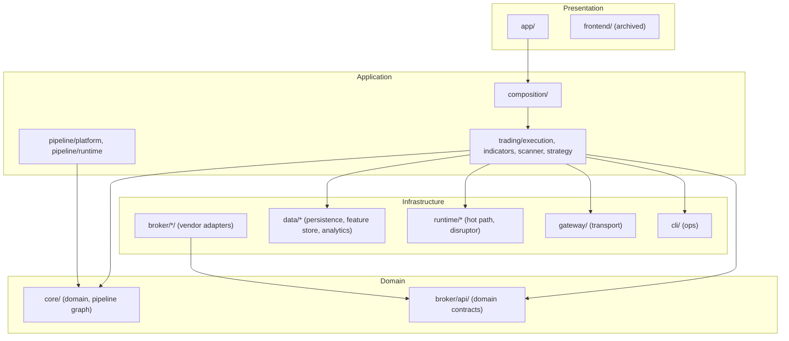
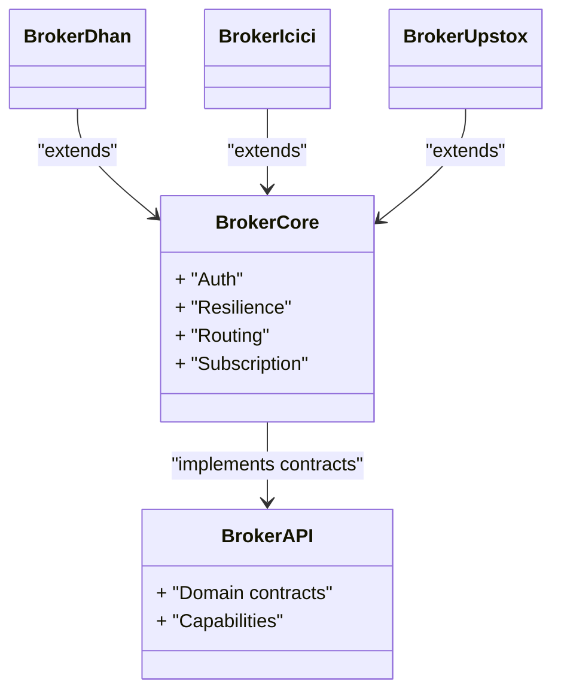
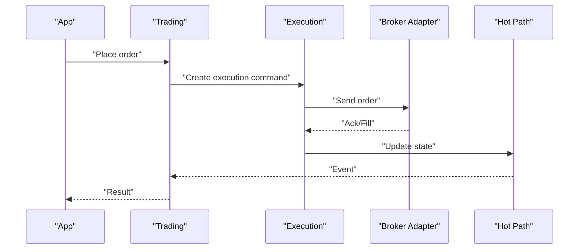
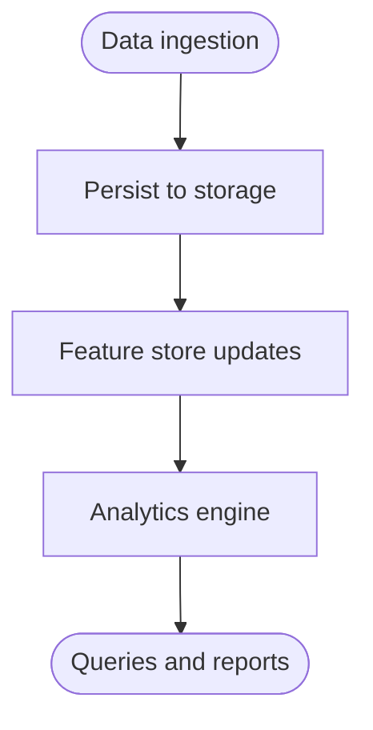
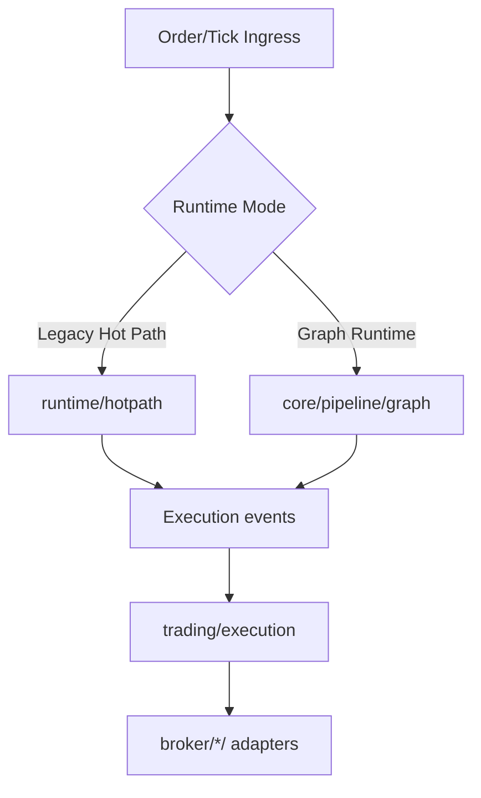
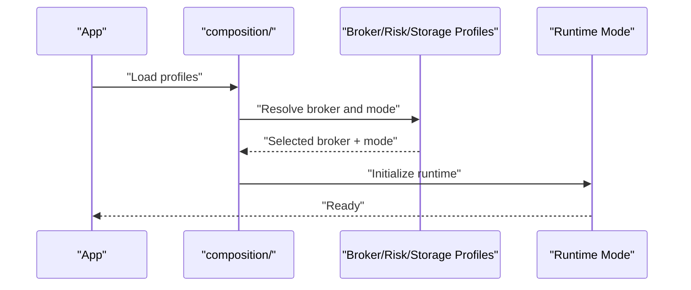
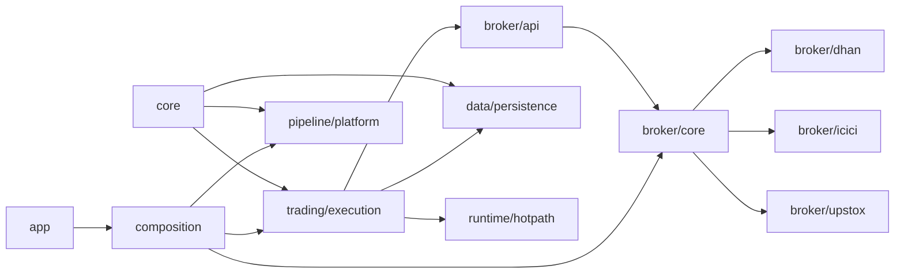

# Modular Architecture

<cite>
**Referenced Files in This Document**
- [settings.gradle](file://settings.gradle)
- [build.gradle](file://build.gradle)
- [ARCHITECTURE.md](file://docs/ARCHITECTURE.md)
- [core/build.gradle](file://core/build.gradle)
- [broker/api/build.gradle](file://broker/api/build.gradle)
- [broker/core/build.gradle](file://broker/core/build.gradle)
- [broker/dhan/build.gradle](file://broker/dhan/build.gradle)
- [broker/icici/build.gradle](file://broker/icici/build.gradle)
- [broker/upstox/build.gradle](file://broker/upstox/build.gradle)
- [trading/execution/build.gradle](file://trading/execution/build.gradle)
- [data/persistence/build.gradle](file://data/persistence/build.gradle)
- [runtime/hotpath/build.gradle](file://runtime/hotpath/build.gradle)
- [app/build.gradle](file://app/build.gradle)
- [gateway/build.gradle](file://gateway/build.gradle)
- [cli/build.gradle](file://cli/build.gradle)
- [composition/build.gradle](file://composition/build.gradle)
- [pipeline/platform/trade-pipeline-platform/build.gradle](file://pipeline/platform/trade-pipeline-platform/build.gradle)
- [pipeline/runtime/build.gradle](file://pipeline/runtime/build.gradle)
- [replay/engine/build.gradle](file://replay/engine/build.gradle)
- [nodes/trade-node-library/build.gradle](file://nodes/trade-node-library/build.gradle)
- [research/api/build.gradle](file://research/api/build.gradle)
- [mcp-server/build.gradle](file://mcp-server/build.gradle)
</cite>

## Table of Contents
1. [Introduction](#introduction)
2. [Project Structure](#project-structure)
3. [Core Components](#core-components)
4. [Architecture Overview](#architecture-overview)
5. [Detailed Component Analysis](#detailed-component-analysis)
6. [Dependency Analysis](#dependency-analysis)
7. [Performance Considerations](#performance-considerations)
8. [Troubleshooting Guide](#troubleshooting-guide)
9. [Conclusion](#conclusion)
10. [Appendices](#appendices)

## Introduction
This document describes the modular architecture of Trade-J, a Java-based trading system composed of multiple Gradle modules organized around clear functional and layer boundaries. The architecture follows a layered pattern across presentation, application, domain, and infrastructure layers, while enabling flexible runtime modes and broker integrations. It also documents the dual pipeline architecture supporting both a legacy hot path and a modern graph runtime, along with the broker selection mechanism and runtime mode configurations.

## Project Structure
Trade-J uses a Gradle multi-module setup where each functional area is a separate module. The root build and settings files define module inclusion and shared configuration. Modules are grouped by responsibility: core, broker ecosystem, trading, data, runtime, app, gateway, cli, pipeline, nodes, research, and replay.

Key characteristics:
- Functional separation: Each module encapsulates a bounded responsibility (e.g., broker integrations, trading logic, data persistence).
- Layered design: Presentation, application, domain, and infrastructure layers are represented across modules.
- Dual pipeline: Legacy hot path and graph runtime coexist to enable incremental migration.
- Runtime flexibility: Different runtime modes and broker profiles are configured via profiles and composition.

```mermaid
graph TB
Root["Root Build<br/>settings.gradle + build.gradle"]
Core["core/"]
BrokerAPI["broker/api/"]
BrokerCore["broker/core/"]
BrokerDhan["broker/dhan/"]
BrokerIcici["broker/icici/"]
BrokerUpstox["broker/upstox/"]
TradingExec["trading/execution/"]
DataPersistence["data/persistence/"]
RuntimeHot["runtime/hotpath/"]
App["app/"]
Gateway["gateway/"]
Cli["cli/"]
Composition["composition/"]
PipelinePlatform["pipeline/platform/trade-pipeline-platform/"]
PipelineRuntime["pipeline/runtime/"]
ReplayEngine["replay/engine/"]
NodesLib["nodes/trade-node-library/"]
ResearchApi["research/api/"]
McpServer["mcp-server/"]
Root --> Core
Root --> BrokerAPI
Root --> BrokerCore
Root --> BrokerDhan
Root --> BrokerIcici
Root --> BrokerUpstox
Root --> TradingExec
Root --> DataPersistence
Root --> RuntimeHot
Root --> App
Root --> Gateway
Root --> Cli
Root --> Composition
Root --> PipelinePlatform
Root --> PipelineRuntime
Root --> ReplayEngine
Root --> NodesLib
Root --> ResearchApi
Root --> McpServer
```

**Diagram sources**
- [settings.gradle](file://settings.gradle)
- [build.gradle](file://build.gradle)

**Section sources**
- [settings.gradle](file://settings.gradle)
- [build.gradle](file://build.gradle)

## Core Components
This section outlines the primary modules and their responsibilities, aligned with the layered architecture.

- core/: Domain and infrastructure abstractions, pipeline graph runtime, and cross-cutting concerns.
- broker/: Broker-agnostic API, shared core logic, and vendor-specific adapters (Dhan, Icici, Upstox).
- trading/: Execution, indicators, scanners, strategies, and related analytics.
- data/: Persistence, feature store, and analytics engines.
- runtime/: Hot path and disruptor-based runtime components.
- app/: Application entrypoints and Spring Boot configuration.
- gateway/: Transport and routing for external connections.
- cli/: Command-line interface for operational tasks.
- composition/: Runtime composition and broker profile orchestration.
- pipeline/: Platform and runtime services for DAG pipelines.
- replay/: Engine for historical replay and position rebuilding.
- nodes/: Node library for building pipeline nodes.
- research/: Research API and tools.
- mcp-server/: MCP server controller.

Module map (physical paths vs. project IDs):
- core -> core
- broker/api -> broker-api
- broker/core -> broker-core
- broker/dhan -> broker-dhan
- broker/icici -> broker-icici
- broker/upstox -> broker-upstox
- trading/execution -> trading-execution
- data/persistence -> data-persistence
- runtime/hotpath -> runtime-hotpath
- app -> app
- gateway -> gateway
- cli -> cli
- composition -> composition
- pipeline/platform/trade-pipeline-platform -> pipeline-platform
- pipeline/runtime -> pipeline-runtime
- replay/engine -> replay-engine
- nodes/trade-node-library -> nodes-trade-node-library
- research/api -> research-api
- mcp-server -> mcp-server

**Section sources**
- [core/build.gradle](file://core/build.gradle)
- [broker/api/build.gradle](file://broker/api/build.gradle)
- [broker/core/build.gradle](file://broker/core/build.gradle)
- [broker/dhan/build.gradle](file://broker/dhan/build.gradle)
- [broker/icici/build.gradle](file://broker/icici/build.gradle)
- [broker/upstox/build.gradle](file://broker/upstox/build.gradle)
- [trading/execution/build.gradle](file://trading/execution/build.gradle)
- [data/persistence/build.gradle](file://data/persistence/build.gradle)
- [runtime/hotpath/build.gradle](file://runtime/hotpath/build.gradle)
- [app/build.gradle](file://app/build.gradle)
- [gateway/build.gradle](file://gateway/build.gradle)
- [cli/build.gradle](file://cli/build.gradle)
- [composition/build.gradle](file://composition/build.gradle)
- [pipeline/platform/trade-pipeline-platform/build.gradle](file://pipeline/platform/trade-pipeline-platform/build.gradle)
- [pipeline/runtime/build.gradle](file://pipeline/runtime/build.gradle)
- [replay/engine/build.gradle](file://replay/engine/build.gradle)
- [nodes/trade-node-library/build.gradle](file://nodes/trade-node-library/build.gradle)
- [research/api/build.gradle](file://research/api/build.gradle)
- [mcp-server/build.gradle](file://mcp-server/build.gradle)

## Architecture Overview
Trade-J employs a layered architecture:
- Presentation: app/ and frontend/ (frontend is archived but app/ remains active).
- Application: composition/, trading/, and pipeline modules coordinate business workflows.
- Domain: core/ and broker/api/ define domain models and capabilities.
- Infrastructure: broker/*/ adapters, data/*, runtime/*, gateway/, and cli/.

Dual pipeline architecture:
- Legacy hot path: runtime/hotpath/ provides low-latency order lifecycle handling.
- Graph runtime: core/pipeline/graph runtime enables declarative, composable processing.

Broker selection and runtime modes:
- Broker profiles and risk/storage profiles are loaded via composition/.
- Runtime mode is configurable through application profiles and composition logic.

**Diagram sources**
- [app/build.gradle](file://app/build.gradle)
- [composition/build.gradle](file://composition/build.gradle)
- [trading/execution/build.gradle](file://trading/execution/build.gradle)
- [core/build.gradle](file://core/build.gradle)
- [broker/api/build.gradle](file://broker/api/build.gradle)
- [data/persistence/build.gradle](file://data/persistence/build.gradle)
- [runtime/hotpath/build.gradle](file://runtime/hotpath/build.gradle)
- [gateway/build.gradle](file://gateway/build.gradle)
- [cli/build.gradle](file://cli/build.gradle)

## Detailed Component Analysis

### Broker Ecosystem
The broker subsystem provides a unified API and shared core logic, with vendor-specific implementations.

**Diagram sources**
- [broker/api/build.gradle](file://broker/api/build.gradle)
- [broker/core/build.gradle](file://broker/core/build.gradle)
- [broker/dhan/build.gradle](file://broker/dhan/build.gradle)
- [broker/icici/build.gradle](file://broker/icici/build.gradle)
- [broker/upstox/build.gradle](file://broker/upstox/build.gradle)

**Section sources**
- [broker/api/build.gradle](file://broker/api/build.gradle)
- [broker/core/build.gradle](file://broker/core/build.gradle)
- [broker/dhan/build.gradle](file://broker/dhan/build.gradle)
- [broker/icici/build.gradle](file://broker/icici/build.gradle)
- [broker/upstox/build.gradle](file://broker/upstox/build.gradle)

### Trading and Execution
Trading orchestrates order lifecycle, indicators, scanners, and strategies. Execution integrates with broker adapters and runtime.

**Diagram sources**
- [trading/execution/build.gradle](file://trading/execution/build.gradle)
- [runtime/hotpath/build.gradle](file://runtime/hotpath/build.gradle)
- [broker/dhan/build.gradle](file://broker/dhan/build.gradle)
- [broker/icici/build.gradle](file://broker/icici/build.gradle)
- [broker/upstox/build.gradle](file://broker/upstox/build.gradle)

**Section sources**
- [trading/execution/build.gradle](file://trading/execution/build.gradle)
- [runtime/hotpath/build.gradle](file://runtime/hotpath/build.gradle)

### Data and Persistence
Data modules provide persistence, feature store, and analytics engines.

**Diagram sources**
- [data/persistence/build.gradle](file://data/persistence/build.gradle)
- [nodes/trade-node-library/build.gradle](file://nodes/trade-node-library/build.gradle)

**Section sources**
- [data/persistence/build.gradle](file://data/persistence/build.gradle)
- [nodes/trade-node-library/build.gradle](file://nodes/trade-node-library/build.gradle)

### Pipeline Runtime and Graph Runtime
Trade-J supports both a legacy hot path and a modern graph runtime.

**Diagram sources**
- [runtime/hotpath/build.gradle](file://runtime/hotpath/build.gradle)
- [core/build.gradle](file://core/build.gradle)
- [trading/execution/build.gradle](file://trading/execution/build.gradle)
- [broker/api/build.gradle](file://broker/api/build.gradle)

**Section sources**
- [runtime/hotpath/build.gradle](file://runtime/hotpath/build.gradle)
- [core/build.gradle](file://core/build.gradle)

### Broker Selection Mechanism and Runtime Modes
Broker selection and runtime mode are configured via composition and application profiles.

**Diagram sources**
- [composition/build.gradle](file://composition/build.gradle)
- [app/build.gradle](file://app/build.gradle)

**Section sources**
- [composition/build.gradle](file://composition/build.gradle)
- [app/build.gradle](file://app/build.gradle)

## Dependency Analysis
Modules are decoupled by clear interfaces. Dependencies generally flow from infrastructure toward application and domain layers, with specialized modules depending on broker API and core.

**Diagram sources**
- [broker/api/build.gradle](file://broker/api/build.gradle)
- [broker/core/build.gradle](file://broker/core/build.gradle)
- [broker/dhan/build.gradle](file://broker/dhan/build.gradle)
- [broker/icici/build.gradle](file://broker/icici/build.gradle)
- [broker/upstox/build.gradle](file://broker/upstox/build.gradle)
- [core/build.gradle](file://core/build.gradle)
- [trading/execution/build.gradle](file://trading/execution/build.gradle)
- [data/persistence/build.gradle](file://data/persistence/build.gradle)
- [runtime/hotpath/build.gradle](file://runtime/hotpath/build.gradle)
- [app/build.gradle](file://app/build.gradle)
- [composition/build.gradle](file://composition/build.gradle)
- [pipeline/platform/trade-pipeline-platform/build.gradle](file://pipeline/platform/trade-pipeline-platform/build.gradle)

**Section sources**
- [broker/api/build.gradle](file://broker/api/build.gradle)
- [broker/core/build.gradle](file://broker/core/build.gradle)
- [broker/dhan/build.gradle](file://broker/dhan/build.gradle)
- [broker/icici/build.gradle](file://broker/icici/build.gradle)
- [broker/upstox/build.gradle](file://broker/upstox/build.gradle)
- [core/build.gradle](file://core/build.gradle)
- [trading/execution/build.gradle](file://trading/execution/build.gradle)
- [data/persistence/build.gradle](file://data/persistence/build.gradle)
- [runtime/hotpath/build.gradle](file://runtime/hotpath/build.gradle)
- [app/build.gradle](file://app/build.gradle)
- [composition/build.gradle](file://composition/build.gradle)
- [pipeline/platform/trade-pipeline-platform/build.gradle](file://pipeline/platform/trade-pipeline-platform/build.gradle)

## Performance Considerations
- Hot path latency: runtime/hotpath/ is optimized for low-latency order lifecycle handling.
- Graph runtime throughput: core/pipeline/graph enables scalable, composable processing.
- Broker adapter efficiency: broker/*/ adapters encapsulate vendor-specific overhead and retries.
- Data persistence: data/persistence/ should leverage asynchronous writes and batching where appropriate.
- Gateway transport: gateway/ handles connection pooling and protocol framing to minimize overhead.

[No sources needed since this section provides general guidance]

## Troubleshooting Guide
Common areas to inspect:
- Broker connectivity: Verify broker/*/ adapter health and resilience configurations.
- Runtime mode: Confirm selected runtime mode aligns with intended performance profile.
- Pipeline compilation: Validate pipeline platform and runtime services for DAG correctness.
- Replay engine: Use replay/engine/ to diagnose historical parity and position rebuild issues.

**Section sources**
- [runtime/hotpath/build.gradle](file://runtime/hotpath/build.gradle)
- [pipeline/platform/trade-pipeline-platform/build.gradle](file://pipeline/platform/trade-pipeline-platform/build.gradle)
- [pipeline/runtime/build.gradle](file://pipeline/runtime/build.gradle)
- [replay/engine/build.gradle](file://replay/engine/build.gradle)

## Conclusion
Trade-J’s modular architecture cleanly separates concerns across layers and modules, enabling independent evolution of brokers, trading logic, data, and runtime. The dual pipeline architecture supports both immediate performance needs and future graph-based processing. Composition and profiles provide flexible broker selection and runtime mode configuration, while clear module boundaries facilitate testing, deployment, and maintenance.

[No sources needed since this section summarizes without analyzing specific files]

## Appendices

### Module Map and Project IDs
- core -> core
- broker/api -> broker-api
- broker/core -> broker-core
- broker/dhan -> broker-dhan
- broker/icici -> broker-icici
- broker/upstox -> broker-upstox
- trading/execution -> trading-execution
- data/persistence -> data-persistence
- runtime/hotpath -> runtime-hotpath
- app -> app
- gateway -> gateway
- cli -> cli
- composition -> composition
- pipeline/platform/trade-pipeline-platform -> pipeline-platform
- pipeline/runtime -> pipeline-runtime
- replay/engine -> replay-engine
- nodes/trade-node-library -> nodes-trade-node-library
- research/api -> research-api
- mcp-server -> mcp-server

**Section sources**
- [core/build.gradle](file://core/build.gradle)
- [broker/api/build.gradle](file://broker/api/build.gradle)
- [broker/core/build.gradle](file://broker/core/build.gradle)
- [broker/dhan/build.gradle](file://broker/dhan/build.gradle)
- [broker/icici/build.gradle](file://broker/icici/build.gradle)
- [broker/upstox/build.gradle](file://broker/upstox/build.gradle)
- [trading/execution/build.gradle](file://trading/execution/build.gradle)
- [data/persistence/build.gradle](file://data/persistence/build.gradle)
- [runtime/hotpath/build.gradle](file://runtime/hotpath/build.gradle)
- [app/build.gradle](file://app/build.gradle)
- [gateway/build.gradle](file://gateway/build.gradle)
- [cli/build.gradle](file://cli/build.gradle)
- [composition/build.gradle](file://composition/build.gradle)
- [pipeline/platform/trade-pipeline-platform/build.gradle](file://pipeline/platform/trade-pipeline-platform/build.gradle)
- [pipeline/runtime/build.gradle](file://pipeline/runtime/build.gradle)
- [replay/engine/build.gradle](file://replay/engine/build.gradle)
- [nodes/trade-node-library/build.gradle](file://nodes/trade-node-library/build.gradle)
- [research/api/build.gradle](file://research/api/build.gradle)
- [mcp-server/build.gradle](file://mcp-server/build.gradle)