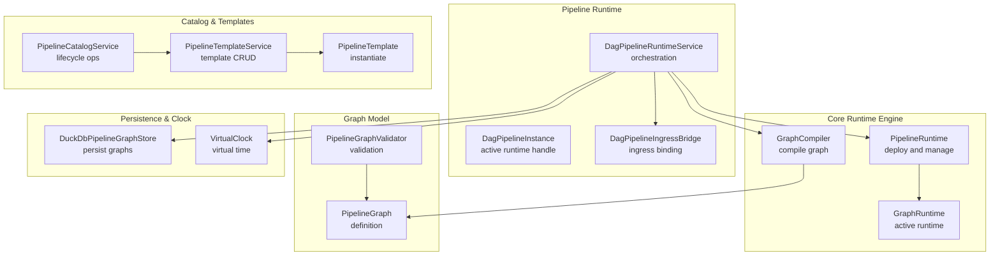
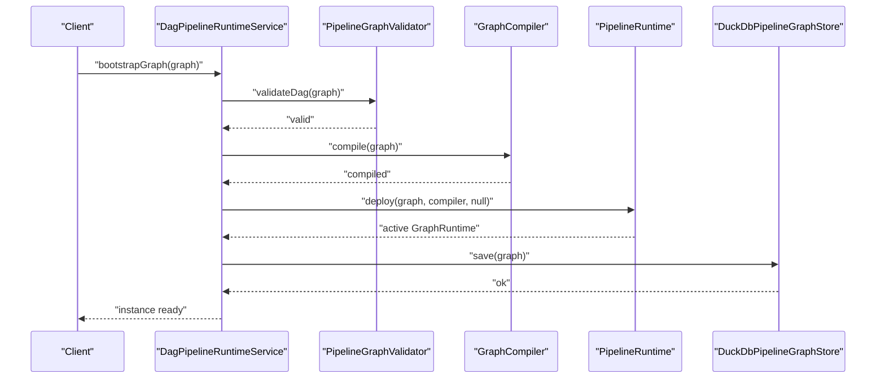
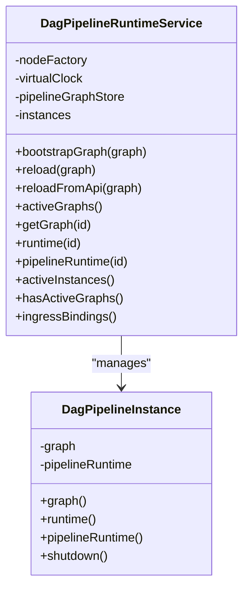
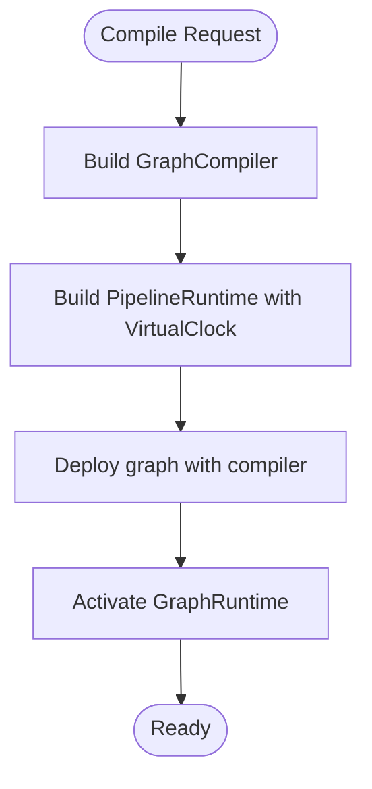
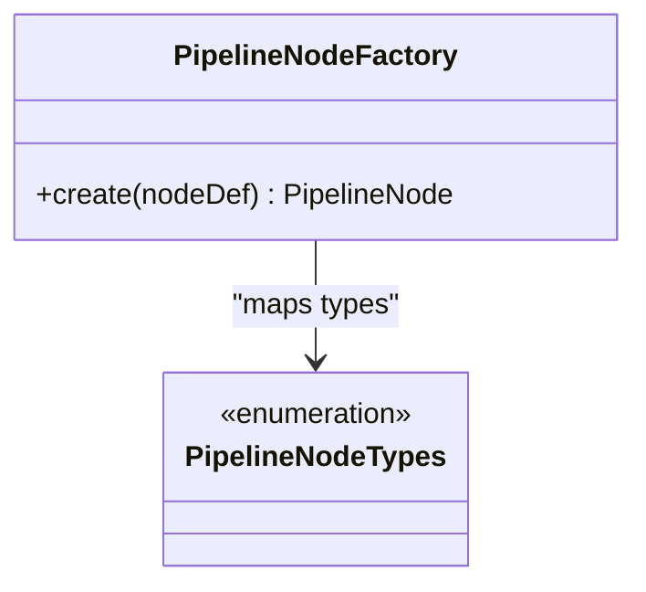
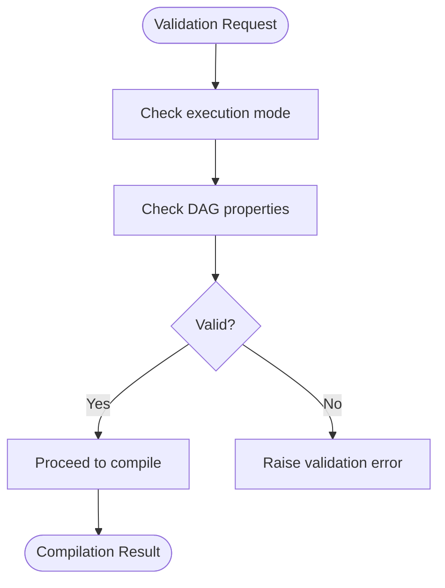
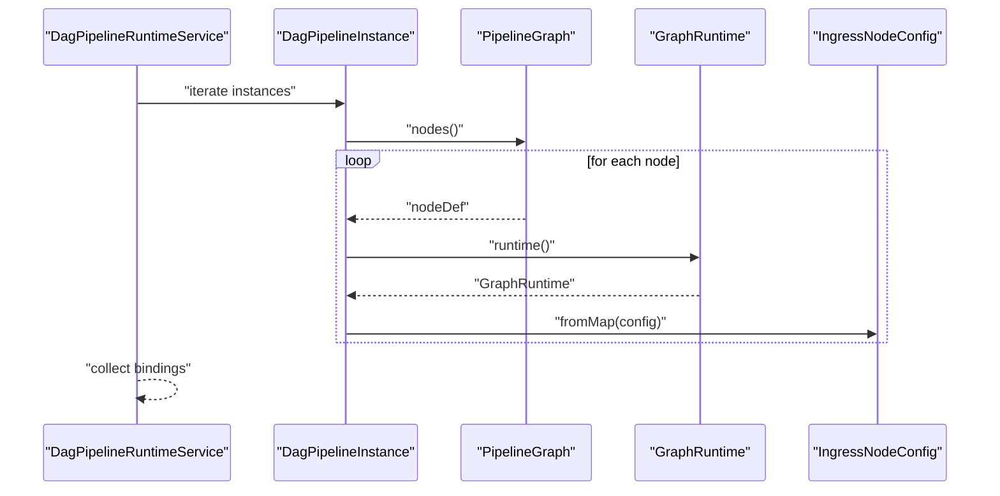
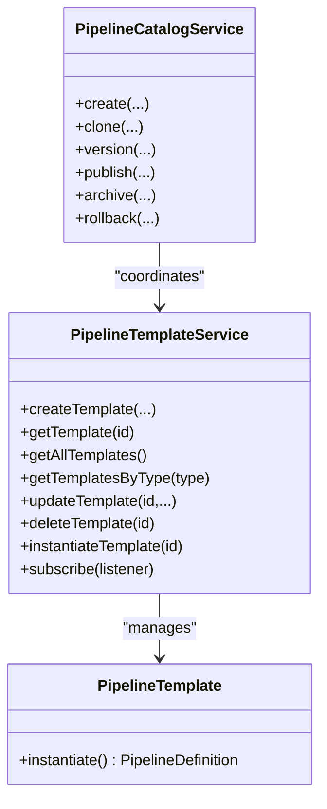
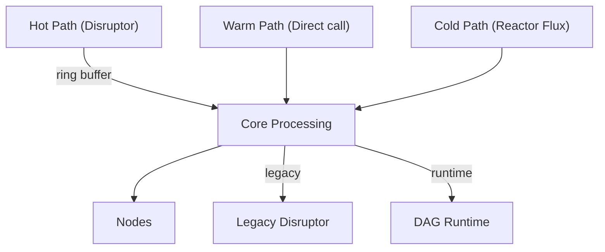
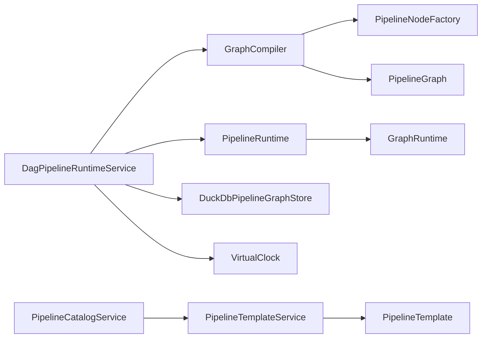

# Pipeline Runtime System

<cite>
**Referenced Files in This Document**
- [DagPipelineRuntimeService.java](file://pipeline/runtime/src/main/java/com/tradej/pipeline/service/DagPipelineRuntimeService.java)
- [DagPipelineInstance.java](file://pipeline/runtime/src/main/java/com/tradej/pipeline/service/DagPipelineInstance.java)
- [PipelineNodeFactory.java](file://pipeline/runtime/src/main/java/com/tradej/pipeline/service/PipelineNodeFactory.java)
- [GraphCompiler.java](file://core/src/main/java/com/tradej/pipeline/runtime/GraphCompiler.java)
- [PipelineRuntime.java](file://core/src/main/java/com/tradej/pipeline/runtime/PipelineRuntime.java)
- [GraphRuntime.java](file://core/src/main/java/com/tradej/pipeline/runtime/GraphRuntime.java)
- [PipelineGraph.java](file://core/src/main/java/com/tradej/pipeline/graph/PipelineGraph.java)
- [PipelineGraphValidator.java](file://core/src/main/java/com/tradej/pipeline/validation/PipelineGraphValidator.java)
- [PipelineCompileContexts.java](file://core/src/main/java/com/tradej/pipeline/runtime/PipelineCompileContexts.java)
- [VirtualClock.java](file://pipeline/clock/src/main/java/com/tradej/pipeline/clock/VirtualClock.java)
- [DuckDbPipelineGraphStore.java](file://persistence/pipeline/src/main/java/com/tradej/persistence/pipeline/DuckDbPipelineGraphStore.java)
- [PipelineNodeTypes.java](file://core/src/main/java/com/tradej/pipeline/runtime/PipelineNodeTypes.java)
- [IngressNodeConfig.java](file://core/src/main/java/com/tradej/pipeline/graph/IngressNodeConfig.java)
- [PipelineTemplateService.java](file://pipeline/platform/trade-pipeline-platform/src/main/java/com/tradej/pipeline/platform/PipelineTemplateService.java)
- [PipelineTemplate.java](file://pipeline/platform/trade-pipeline-platform/src/main/java/com/tradej/pipeline/platform/PipelineTemplate.java)
- [PipelineCatalogService.java](file://pipeline/platform/trade-pipeline-platform/src/main/java/com/tradej/pipeline/platform/catalog/PipelineCatalogService.java)
- [PipelineExecution.java](file://pipeline/platform/trade-pipeline-platform/src/main/java/com/tradej/pipeline/platform/model/PipelineExecution.java)
- [PipelineVersion.java](file://pipeline/platform/trade-pipeline-platform/src/main/java/com/tradej/pipeline/platform/PipelineVersion.java)
- [PipelineStatus.java](file://pipeline/platform/trade-pipeline-platform/src/main/java/com/tradej/pipeline/platform/PipelineStatus.java)
- [PipelineDefinition.java](file://pipeline/platform/trade-pipeline-platform/src/main/java/com/tradej/pipeline/platform/PipelineDefinition.java)
- [PipelineSnapshot.java](file://pipeline/platform/trade-pipeline-platform/src/main/java/com/tradej/pipeline/platform/PipelineSnapshot.java)
- [PipelineStore.java](file://pipeline/platform/trade-pipeline-platform/src/main/java/com/tradej/pipeline/platform/catalog/PipelineStore.java)
- [DagPipelineIngressBridge.java](file://pipeline/runtime/src/main/java/com/tradej/pipeline/service/DagPipelineIngressBridge.java)
- [ARCHITECTURE_EVOLUTION_PIPELINE_OS.md](file://docs/archive/ARCHITECTURE_EVOLUTION_PIPELINE_OS.md)
- [PipelineCompileRoutingTest.java](file://app/src/test/java/com/tradej/app/pipeline/PipelineCompileRoutingTest.java)
- [DisruptorGraphReplayParityTest.java](file://runtime/disruptor/src/test/java/com/tradej/disruptor/DisruptorGraphReplayParityTest.java)
- [DisruptorHighThroughputStressTest.java](file://runtime/hotpath/src/test/java/com/tradej/hotpath/DisruptorHighThroughputStressTest.java)
</cite>

## Table of Contents
1. [Introduction](#introduction)
2. [Project Structure](#project-structure)
3. [Core Components](#core-components)
4. [Architecture Overview](#architecture-overview)
5. [Detailed Component Analysis](#detailed-component-analysis)
6. [Dependency Analysis](#dependency-analysis)
7. [Performance Considerations](#performance-considerations)
8. [Troubleshooting Guide](#troubleshooting-guide)
9. [Conclusion](#conclusion)
10. [Appendices](#appendices)

## Introduction
This document describes the Trade-J pipeline runtime system with a focus on the DAG-based workflow execution engine and its differences from the legacy hot path architecture. It explains how pipeline graphs are compiled, how nodes execute, and how runtime orchestration is performed. It also documents the composable pipeline architecture enabling dynamic workflow construction, the node types and execution planning, state management, validation and compilation results, runtime bridges, and the pipeline catalog and template system. Finally, it covers performance characteristics, parallel execution capabilities, monitoring, and the relationship between the graph runtime and the legacy disruptor-based system.

## Project Structure
The pipeline runtime system spans several modules:
- Pipeline runtime service and orchestration
- Core runtime engine and graph compilation
- Graph definitions and validation
- Catalog and template systems
- Persistence and clock utilities
- Legacy disruptor integration tests and documentation

**Diagram sources**
- [DagPipelineRuntimeService.java:28-187](file://pipeline/runtime/src/main/java/com/tradej/pipeline/service/DagPipelineRuntimeService.java#L28-L187)
- [DagPipelineInstance.java:7-32](file://pipeline/runtime/src/main/java/com/tradej/pipeline/service/DagPipelineInstance.java#L7-L32)
- [GraphCompiler.java](file://core/src/main/java/com/tradej/pipeline/runtime/GraphCompiler.java)
- [PipelineRuntime.java](file://core/src/main/java/com/tradej/pipeline/runtime/PipelineRuntime.java)
- [GraphRuntime.java](file://core/src/main/java/com/tradej/pipeline/runtime/GraphRuntime.java)
- [PipelineGraph.java](file://core/src/main/java/com/tradej/pipeline/graph/PipelineGraph.java)
- [PipelineGraphValidator.java](file://core/src/main/java/com/tradej/pipeline/validation/PipelineGraphValidator.java)
- [PipelineTemplateService.java:27-97](file://pipeline/platform/trade-pipeline-platform/src/main/java/com/tradej/pipeline/platform/PipelineTemplateService.java#L27-L97)
- [PipelineTemplate.java:46-66](file://pipeline/platform/trade-pipeline-platform/src/main/java/com/tradej/pipeline/platform/PipelineTemplate.java#L46-L66)
- [PipelineCatalogService.java:33-39](file://pipeline/platform/trade-pipeline-platform/src/main/java/com/tradej/pipeline/platform/catalog/PipelineCatalogService.java#L33-L39)
- [DuckDbPipelineGraphStore.java](file://persistence/pipeline/src/main/java/com/tradej/persistence/pipeline/DuckDbPipelineGraphStore.java)
- [VirtualClock.java](file://pipeline/clock/src/main/java/com/tradej/pipeline/clock/VirtualClock.java)

**Section sources**
- [DagPipelineRuntimeService.java:28-187](file://pipeline/runtime/src/main/java/com/tradej/pipeline/service/DagPipelineRuntimeService.java#L28-L187)
- [DagPipelineInstance.java:7-32](file://pipeline/runtime/src/main/java/com/tradej/pipeline/service/DagPipelineInstance.java#L7-L32)
- [GraphCompiler.java](file://core/src/main/java/com/tradej/pipeline/runtime/GraphCompiler.java)
- [PipelineRuntime.java](file://core/src/main/java/com/tradej/pipeline/runtime/PipelineRuntime.java)
- [GraphRuntime.java](file://core/src/main/java/com/tradej/pipeline/runtime/GraphRuntime.java)
- [PipelineGraph.java](file://core/src/main/java/com/tradej/pipeline/graph/PipelineGraph.java)
- [PipelineGraphValidator.java](file://core/src/main/java/com/tradej/pipeline/validation/PipelineGraphValidator.java)
- [PipelineTemplateService.java:27-97](file://pipeline/platform/trade-pipeline-platform/src/main/java/com/tradej/pipeline/platform/PipelineTemplateService.java#L27-L97)
- [PipelineTemplate.java:46-66](file://pipeline/platform/trade-pipeline-platform/src/main/java/com/tradej/pipeline/platform/PipelineTemplate.java#L46-L66)
- [PipelineCatalogService.java:33-39](file://pipeline/platform/trade-pipeline-platform/src/main/java/com/tradej/pipeline/platform/catalog/PipelineCatalogService.java#L33-L39)
- [DuckDbPipelineGraphStore.java](file://persistence/pipeline/src/main/java/com/tradej/persistence/pipeline/DuckDbPipelineGraphStore.java)
- [VirtualClock.java](file://pipeline/clock/src/main/java/com/tradej/pipeline/clock/VirtualClock.java)

## Core Components
- DAG runtime service orchestrates graph compilation, deployment, and lifecycle management, exposing ingress bindings for external inputs.
- Graph compiler transforms a logical pipeline graph into executable runtime nodes.
- Pipeline runtime manages deployment, scheduling, and coordination of nodes.
- Graph runtime represents the active, running instance of a compiled graph.
- Validation ensures graph integrity and mode-specific correctness.
- Catalog and template services enable reusable, composable pipeline definitions.
- Persistence stores compiled graphs for durability and recovery.
- Clock abstraction supports deterministic timing and replay scenarios.

**Section sources**
- [DagPipelineRuntimeService.java:28-187](file://pipeline/runtime/src/main/java/com/tradej/pipeline/service/DagPipelineRuntimeService.java#L28-L187)
- [GraphCompiler.java](file://core/src/main/java/com/tradej/pipeline/runtime/GraphCompiler.java)
- [PipelineRuntime.java](file://core/src/main/java/com/tradej/pipeline/runtime/PipelineRuntime.java)
- [GraphRuntime.java](file://core/src/main/java/com/tradej/pipeline/runtime/GraphRuntime.java)
- [PipelineGraphValidator.java](file://core/src/main/java/com/tradej/pipeline/validation/PipelineGraphValidator.java)
- [PipelineTemplateService.java:27-97](file://pipeline/platform/trade-pipeline-platform/src/main/java/com/tradej/pipeline/platform/PipelineTemplateService.java#L27-L97)
- [PipelineCatalogService.java:33-39](file://pipeline/platform/trade-pipeline-platform/src/main/java/com/tradej/pipeline/platform/catalog/PipelineCatalogService.java#L33-L39)
- [DuckDbPipelineGraphStore.java](file://persistence/pipeline/src/main/java/com/tradej/persistence/pipeline/DuckDbPipelineGraphStore.java)
- [VirtualClock.java](file://pipeline/clock/src/main/java/com/tradej/pipeline/clock/VirtualClock.java)

## Architecture Overview
The DAG runtime system separates concerns between orchestration, compilation, and execution:
- Orchestration: The runtime service validates, compiles, persists, and tracks active pipeline instances.
- Compilation: The graph compiler constructs node instances via a factory and builds the execution graph.
- Execution: The pipeline runtime deploys the graph and coordinates node lifecycles and scheduling.
- Ingress: Ingress nodes bind external inputs to the runtime for dynamic data injection.
- Catalog/templates: Define reusable pipeline blueprints and draft/published lifecycles.
- Legacy disruptor: Retained as the hot path backbone while the DAG runtime handles orchestration and non-critical paths.

**Diagram sources**
- [DagPipelineRuntimeService.java:55-72](file://pipeline/runtime/src/main/java/com/tradej/pipeline/service/DagPipelineRuntimeService.java#L55-L72)
- [GraphCompiler.java](file://core/src/main/java/com/tradej/pipeline/runtime/GraphCompiler.java)
- [PipelineRuntime.java](file://core/src/main/java/com/tradej/pipeline/runtime/PipelineRuntime.java)
- [DuckDbPipelineGraphStore.java](file://persistence/pipeline/src/main/java/com/tradej/persistence/pipeline/DuckDbPipelineGraphStore.java)
- [PipelineGraphValidator.java](file://core/src/main/java/com/tradej/pipeline/validation/PipelineGraphValidator.java)

## Detailed Component Analysis

### DAG Runtime Orchestration
- Validates graph execution mode and DAG properties.
- Compiles and deploys the graph into a pipeline runtime.
- Manages active instances and exposes ingress bindings for runtime input.
- Persists graphs to DuckDB for durability and recovery.

**Diagram sources**
- [DagPipelineRuntimeService.java:28-187](file://pipeline/runtime/src/main/java/com/tradej/pipeline/service/DagPipelineRuntimeService.java#L28-L187)
- [DagPipelineInstance.java:7-32](file://pipeline/runtime/src/main/java/com/tradej/pipeline/service/DagPipelineInstance.java#L7-L32)

**Section sources**
- [DagPipelineRuntimeService.java:28-187](file://pipeline/runtime/src/main/java/com/tradej/pipeline/service/DagPipelineRuntimeService.java#L28-L187)
- [DagPipelineInstance.java:7-32](file://pipeline/runtime/src/main/java/com/tradej/pipeline/service/DagPipelineInstance.java#L7-L32)

### Graph Compilation and Deployment
- GraphCompiler transforms a logical graph into executable nodes using a factory.
- PipelineRuntime deploys the compiled graph, sets up scheduling contexts, and activates the runtime.
- Compile contexts encapsulate runtime configuration and virtual time.

**Diagram sources**
- [GraphCompiler.java](file://core/src/main/java/com/tradej/pipeline/runtime/GraphCompiler.java)
- [PipelineRuntime.java](file://core/src/main/java/com/tradej/pipeline/runtime/PipelineRuntime.java)
- [PipelineCompileContexts.java](file://core/src/main/java/com/tradej/pipeline/runtime/PipelineCompileContexts.java)
- [VirtualClock.java](file://pipeline/clock/src/main/java/com/tradej/pipeline/clock/VirtualClock.java)

**Section sources**
- [GraphCompiler.java](file://core/src/main/java/com/tradej/pipeline/runtime/GraphCompiler.java)
- [PipelineRuntime.java](file://core/src/main/java/com/tradej/pipeline/runtime/PipelineRuntime.java)
- [PipelineCompileContexts.java](file://core/src/main/java/com/tradej/pipeline/runtime/PipelineCompileContexts.java)
- [VirtualClock.java](file://pipeline/clock/src/main/java/com/tradej/pipeline/clock/VirtualClock.java)

### Node Types and Execution Planning
- Node types define the built-in node categories used by the runtime.
- The node factory maps node types to implementations, supporting built-ins and plugins.
- Execution planning is implicit in the compiled graph topology; edges define execution order.

**Diagram sources**
- [PipelineNodeFactory.java](file://pipeline/runtime/src/main/java/com/tradej/pipeline/service/PipelineNodeFactory.java)
- [PipelineNodeTypes.java](file://core/src/main/java/com/tradej/pipeline/runtime/PipelineNodeTypes.java)

**Section sources**
- [PipelineNodeFactory.java](file://pipeline/runtime/src/main/java/com/tradej/pipeline/service/PipelineNodeFactory.java)
- [PipelineNodeTypes.java](file://core/src/main/java/com/tradej/pipeline/runtime/PipelineNodeTypes.java)

### Graph Validation and Compilation Results
- Validation enforces DAG properties and mode-specific constraints.
- Compilation results in a deployable runtime with active graph state.
- Tests confirm that default scanner graphs are valid DAGs.

**Diagram sources**
- [PipelineGraphValidator.java](file://core/src/main/java/com/tradej/pipeline/validation/PipelineGraphValidator.java)
- [PipelineCompileRoutingTest.java:22-26](file://app/src/test/java/com/tradej/app/pipeline/PipelineCompileRoutingTest.java#L22-L26)

**Section sources**
- [PipelineGraphValidator.java](file://core/src/main/java/com/tradej/pipeline/validation/PipelineGraphValidator.java)
- [PipelineCompileRoutingTest.java:22-26](file://app/src/test/java/com/tradej/app/pipeline/PipelineCompileRoutingTest.java#L22-L26)

### Runtime Bridge and Ingress
- Ingress nodes bind external inputs to the runtime, enabling dynamic data injection.
- The runtime service enumerates ingress bindings across active instances.

**Diagram sources**
- [DagPipelineRuntimeService.java:131-150](file://pipeline/runtime/src/main/java/com/tradej/pipeline/service/DagPipelineRuntimeService.java#L131-L150)
- [IngressNodeConfig.java](file://core/src/main/java/com/tradej/pipeline/graph/IngressNodeConfig.java)

**Section sources**
- [DagPipelineRuntimeService.java:131-150](file://pipeline/runtime/src/main/java/com/tradej/pipeline/service/DagPipelineRuntimeService.java#L131-L150)
- [IngressNodeConfig.java](file://core/src/main/java/com/tradej/pipeline/graph/IngressNodeConfig.java)

### Pipeline Catalog and Template System
- Templates define reusable pipeline blueprints with metadata and defaults.
- The catalog service manages lifecycle operations: create, clone, version, publish, archive, rollback.
- Definitions are immutable once published and snapshots preserve historical state.

**Diagram sources**
- [PipelineTemplateService.java:27-97](file://pipeline/platform/trade-pipeline-platform/src/main/java/com/tradej/pipeline/platform/PipelineTemplateService.java#L27-L97)
- [PipelineTemplate.java:46-66](file://pipeline/platform/trade-pipeline-platform/src/main/java/com/tradej/pipeline/platform/PipelineTemplate.java#L46-L66)
- [PipelineCatalogService.java:33-39](file://pipeline/platform/trade-pipeline-platform/src/main/java/com/tradej/pipeline/platform/catalog/PipelineCatalogService.java#L33-L39)

**Section sources**
- [PipelineTemplateService.java:27-97](file://pipeline/platform/trade-pipeline-platform/src/main/java/com/tradej/pipeline/platform/PipelineTemplateService.java#L27-L97)
- [PipelineTemplate.java:46-66](file://pipeline/platform/trade-pipeline-platform/src/main/java/com/tradej/pipeline/platform/PipelineTemplate.java#L46-L66)
- [PipelineCatalogService.java:33-39](file://pipeline/platform/trade-pipeline-platform/src/main/java/com/tradej/pipeline/platform/catalog/PipelineCatalogService.java#L33-L39)

### Relationship to Legacy Disruptor-Based System
- The legacy disruptor remains the hot path backbone for high-throughput, low-latency processing.
- The DAG runtime complements the disruptor by orchestrating non-critical paths and reactive streams.
- Tests demonstrate parity between the disruptor-based graph and the new runtime bridge.

**Diagram sources**
- [ARCHITECTURE_EVOLUTION_PIPELINE_OS.md:658-686](file://docs/archive/ARCHITECTURE_EVOLUTION_PIPELINE_OS.md#L658-L686)
- [DisruptorGraphReplayParityTest.java:252-281](file://runtime/disruptor/src/test/java/com/tradej/disruptor/DisruptorGraphReplayParityTest.java#L252-L281)

**Section sources**
- [ARCHITECTURE_EVOLUTION_PIPELINE_OS.md:658-686](file://docs/archive/ARCHITECTURE_EVOLUTION_PIPELINE_OS.md#L658-L686)
- [DisruptorGraphReplayParityTest.java:252-281](file://runtime/disruptor/src/test/java/com/tradej/disruptor/DisruptorGraphReplayParityTest.java#L252-L281)

## Dependency Analysis
- The runtime service depends on the graph compiler, pipeline runtime, clock, and persistence store.
- The compiler depends on the node factory and graph definitions.
- The catalog and template services depend on the platform model types and store abstractions.

**Diagram sources**
- [DagPipelineRuntimeService.java:37-53](file://pipeline/runtime/src/main/java/com/tradej/pipeline/service/DagPipelineRuntimeService.java#L37-L53)
- [GraphCompiler.java](file://core/src/main/java/com/tradej/pipeline/runtime/GraphCompiler.java)
- [PipelineRuntime.java](file://core/src/main/java/com/tradej/pipeline/runtime/PipelineRuntime.java)
- [DuckDbPipelineGraphStore.java](file://persistence/pipeline/src/main/java/com/tradej/persistence/pipeline/DuckDbPipelineGraphStore.java)
- [VirtualClock.java](file://pipeline/clock/src/main/java/com/tradej/pipeline/clock/VirtualClock.java)
- [PipelineNodeFactory.java](file://pipeline/runtime/src/main/java/com/tradej/pipeline/service/PipelineNodeFactory.java)
- [PipelineGraph.java](file://core/src/main/java/com/tradej/pipeline/graph/PipelineGraph.java)
- [PipelineCatalogService.java:33-39](file://pipeline/platform/trade-pipeline-platform/src/main/java/com/tradej/pipeline/platform/catalog/PipelineCatalogService.java#L33-L39)
- [PipelineTemplateService.java:27-97](file://pipeline/platform/trade-pipeline-platform/src/main/java/com/tradej/pipeline/platform/PipelineTemplateService.java#L27-L97)
- [PipelineTemplate.java:46-66](file://pipeline/platform/trade-pipeline-platform/src/main/java/com/tradej/pipeline/platform/PipelineTemplate.java#L46-L66)

**Section sources**
- [DagPipelineRuntimeService.java:37-53](file://pipeline/runtime/src/main/java/com/tradej/pipeline/service/DagPipelineRuntimeService.java#L37-L53)
- [GraphCompiler.java](file://core/src/main/java/com/tradej/pipeline/runtime/GraphCompiler.java)
- [PipelineRuntime.java](file://core/src/main/java/com/tradej/pipeline/runtime/PipelineRuntime.java)
- [DuckDbPipelineGraphStore.java](file://persistence/pipeline/src/main/java/com/tradej/persistence/pipeline/DuckDbPipelineGraphStore.java)
- [VirtualClock.java](file://pipeline/clock/src/main/java/com/tradej/pipeline/clock/VirtualClock.java)
- [PipelineNodeFactory.java](file://pipeline/runtime/src/main/java/com/tradej/pipeline/service/PipelineNodeFactory.java)
- [PipelineGraph.java](file://core/src/main/java/com/tradej/pipeline/graph/PipelineGraph.java)
- [PipelineCatalogService.java:33-39](file://pipeline/platform/trade-pipeline-platform/src/main/java/com/tradej/pipeline/platform/catalog/PipelineCatalogService.java#L33-L39)
- [PipelineTemplateService.java:27-97](file://pipeline/platform/trade-pipeline-platform/src/main/java/com/tradej/pipeline/platform/PipelineTemplateService.java#L27-L97)
- [PipelineTemplate.java:46-66](file://pipeline/platform/trade-pipeline-platform/src/main/java/com/tradej/pipeline/platform/PipelineTemplate.java#L46-L66)

## Performance Considerations
- The legacy disruptor maintains high throughput and bounded latency for the hot path.
- Stress tests validate sustained throughput under load with acceptable latency thresholds.
- The DAG runtime introduces orchestration overhead but enables flexible, composable workflows.

**Section sources**
- [DisruptorHighThroughputStressTest.java:36-57](file://runtime/hotpath/src/test/java/com/tradej/hotpath/DisruptorHighThroughputStressTest.java#L36-L57)

## Troubleshooting Guide
- Validation failures indicate invalid graph mode or DAG violations; ensure the graph is a DAG and execution mode matches expectations.
- Compilation errors often stem from unknown node types or missing factory mappings; verify node types and registration.
- Persistence failures during reloadFromApi require investigation of storage backend connectivity and permissions.
- Ingress binding enumeration helps locate active ingress nodes and their configurations for runtime input mapping.

**Section sources**
- [DagPipelineRuntimeService.java:55-72](file://pipeline/runtime/src/main/java/com/tradej/pipeline/service/DagPipelineRuntimeService.java#L55-L72)
- [PipelineGraphValidator.java](file://core/src/main/java/com/tradej/pipeline/validation/PipelineGraphValidator.java)
- [DuckDbPipelineGraphStore.java](file://persistence/pipeline/src/main/java/com/tradej/persistence/pipeline/DuckDbPipelineGraphStore.java)

## Conclusion
The Trade-J pipeline runtime system leverages a DAG-based execution engine to provide composable, dynamic workflows while preserving the legacy disruptor as the hot path backbone. The runtime service orchestrates validation, compilation, deployment, and persistence, exposing ingress bindings for dynamic input. The catalog and template system enables reusable pipeline blueprints with robust lifecycle management. Performance is optimized through the disruptor for critical paths, while the DAG runtime offers flexibility for orchestration and reactive processing.

## Appendices
- Monitoring: Track node metrics and runtime state via the runtime service and graph runtime APIs.
- Parallel execution: The DAG engine schedules nodes based on graph topology; ensure sufficient compute resources for concurrent execution.
- Replay and parity: Use the runtime bridge and tests to validate replay parity with legacy disruptor behavior.