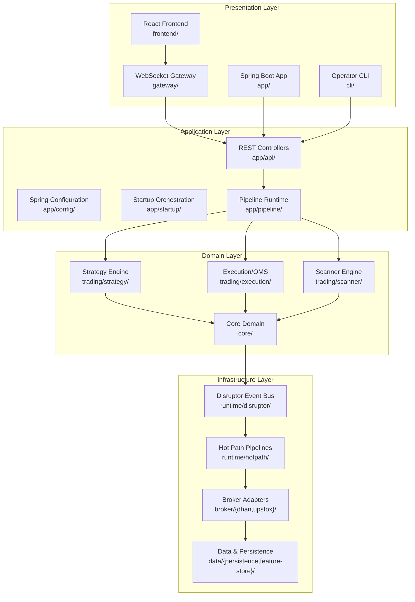
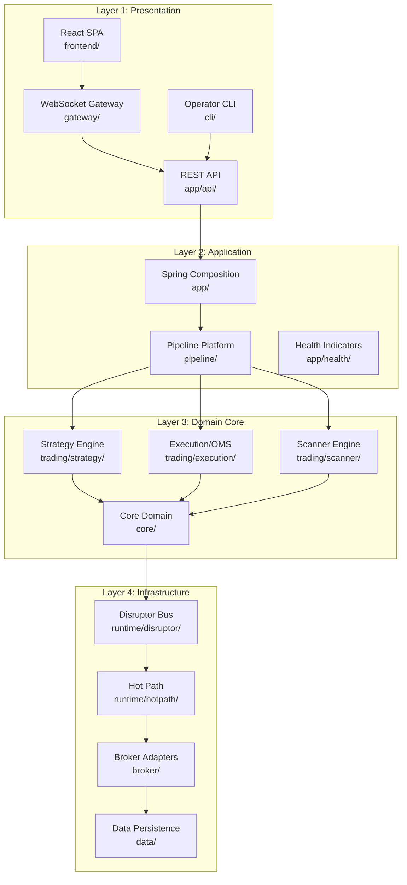
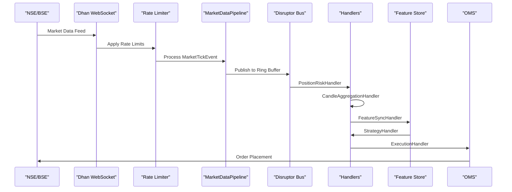
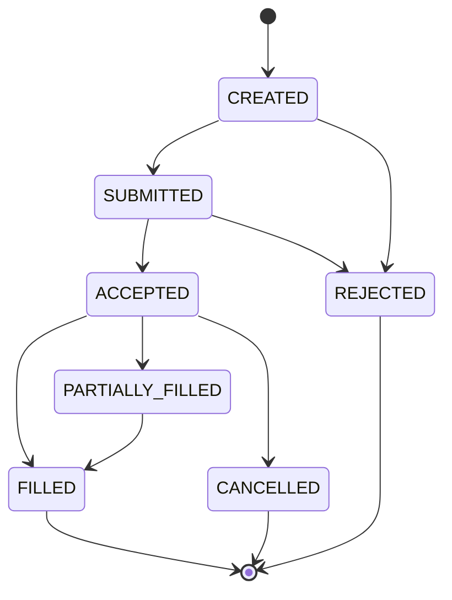
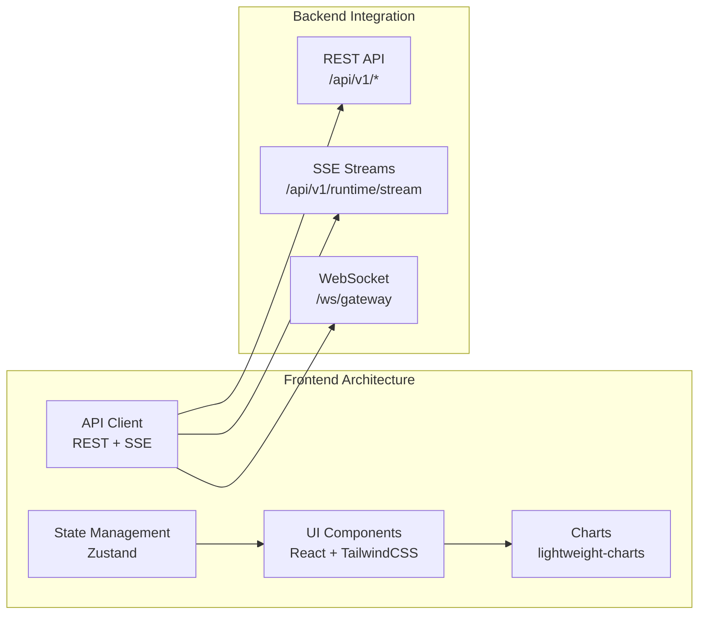
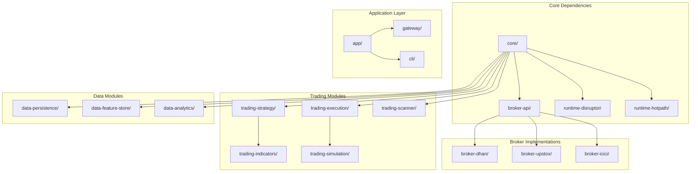

# System Overview

<cite>
**Referenced Files in This Document**
- [README.md](file://README.md)
- [ARCHITECTURE.md](file://ARCHITECTURE.md)
- [TRADEJ_INSTITUTIONAL_ARCHITECTURE.md](file://docs/TRADEJ_INSTITUTIONAL_ARCHITECTURE.md)
- [build.gradle](file://build.gradle)
- [settings.gradle](file://settings.gradle)
- [TradingApplication.java](file://app/src/main/java/com/tradej/app/TradingApplication.java)
- [application.yml](file://app/src/main/resources/application.yml)
- [Trade-J-Architecture-Visual.html](file://docs/visuals/Trade-J-Architecture-Visual.html)
- [DisruptorEventBus.java](file://runtime/disruptor/src/main/java/com/tradej/disruptor/DisruptorEventBus.java)
- [package.json](file://frontend/package.json)
- [App.tsx](file://frontend/src/App.tsx)
- [index.html](file://frontend/index.html)
- [index.html](file://app/src/main/resources/static/console/index.html)
</cite>

## Table of Contents
1. [Introduction](#introduction)
2. [Project Structure](#project-structure)
3. [Core Components](#core-components)
4. [Architecture Overview](#architecture-overview)
5. [Detailed Component Analysis](#detailed-component-analysis)
6. [Dependency Analysis](#dependency-analysis)
7. [Performance Considerations](#performance-considerations)
8. [Troubleshooting Guide](#troubleshooting-guide)
9. [Conclusion](#conclusion)

## Introduction
Trade-J is a production-grade, multi-broker trading platform designed for institutional and advanced retail traders in the Indian equity markets (NSE/BSE). The platform provides a unified execution engine, event-driven architecture, and modular design to support live trading, paper trading, replay, and backtesting without duplicating strategy or core engine logic. It integrates with multiple broker adapters (Dhan and Upstox), offers real-time market data processing, order management, technical analysis, and research tools, while maintaining strict separation between presentation, application, domain, and infrastructure layers.

## Project Structure
The platform follows a multi-module Gradle layout with clear separation of concerns:
- Core domain and ports define the business logic and contracts
- Broker adapters implement connectivity to multiple exchanges and brokers
- Runtime engines provide high-throughput event processing using LMAX Disruptor
- Trading modules encapsulate strategies, scanners, execution, and risk management
- Data modules handle persistence, feature stores, and analytics
- Application layer exposes REST/WS APIs, a WebSocket gateway, and CLI
- Frontend provides a React-based console for operators and developers

**Diagram sources**
- [ARCHITECTURE.md](file://ARCHITECTURE.md)
- [settings.gradle](file://settings.gradle)
- [Trade-J-Architecture-Visual.html](file://docs/visuals/Trade-J-Architecture-Visual.html)

**Section sources**
- [README.md](file://README.md)
- [ARCHITECTURE.md](file://ARCHITECTURE.md)
- [settings.gradle](file://settings.gradle)

## Core Components
Trade-J is built around several core components that work together to deliver a robust trading platform:

- **Event Bus**: LMAX Disruptor-based event bus with configurable pipeline stages for position risk, candle aggregation, feature synchronization, strategy evaluation, execution, and async dispatch
- **Broker Gateway**: Load-balanced and failover-capable gateway supporting multiple broker connections with automatic rotation and resilience
- **Execution Engine**: Deterministic OMS with position-level tracking, order lifecycle management, and risk enforcement
- **Strategy Engine**: Plugin-based architecture supporting both traditional strategies and ML-backed strategies with graph-based pipeline execution
- **Scanner Engine**: Multi-criteria screening system for institutional and options trading with feature pipelines and ranking engines
- **Data Layer**: DuckDB-based event store and feature store with Chronicle Queue for audit logging and dead letter queue handling
- **Frontend Console**: React-based terminal providing real-time market data visualization, order management, and system monitoring

**Section sources**
- [DisruptorEventBus.java](file://runtime/disruptor/src/main/java/com/tradej/disruptor/DisruptorEventBus.java)
- [ARCHITECTURE.md](file://ARCHITECTURE.md)
- [TRADEJ_INSTITUTIONAL_ARCHITECTURE.md](file://docs/TRADEJ_INSTITUTIONAL_ARCHITECTURE.md)

## Architecture Overview
Trade-J employs a layered architecture with clear separation between presentation, application, domain, and infrastructure layers. The system follows Hexagonal Architecture (Ports and Adapters) principles, ensuring that the core domain logic remains independent of external frameworks and infrastructure concerns.

**Diagram sources**
- [ARCHITECTURE.md](file://ARCHITECTURE.md)
- [Trade-J-Architecture-Visual.html](file://docs/visuals/Trade-J-Architecture-Visual.html)

The architecture emphasizes:
- **Event-Driven Design**: All components communicate via an append-only event log using LMAX Disruptor for in-memory processing and Chronicle Queue for persistence
- **Modular Design**: Clear separation of concerns with well-defined interfaces between layers
- **Runtime Modes**: Support for LIVE, REPLAY, and BACKTEST modes using the same unified engine
- **Broker Abstraction**: Pluggable broker adapters with shared resilience and routing logic

**Section sources**
- [ARCHITECTURE.md](file://ARCHITECTURE.md)
- [TRADEJ_INSTITUTIONAL_ARCHITECTURE.md](file://docs/TRADEJ_INSTITUTIONAL_ARCHITECTURE.md)

## Detailed Component Analysis

### Technology Stack Overview
Trade-J leverages a modern technology stack optimized for performance and reliability:

- **Backend**: Java 21 with Spring Boot 3.4.13, Gradle 8.x build system
- **Event Processing**: LMAX Disruptor 4.0 for high-throughput event bus with 8192 ring buffer capacity
- **Data Storage**: DuckDB 1.5.3 for embedded columnar store, Chronicle Queue 2026.2 for audit logging
- **Frontend**: React 19.2.6 with Vite, TypeScript, TailwindCSS, lightweight-charts, Zustand state management
- **Testing**: JUnit 5.12 with tagged test pyramid (unit, component, integration, cross-layer)
- **Static Analysis**: SpotBugs and Checkstyle integrated into the build process
- **Observability**: Micrometer metrics, Prometheus integration, structured logging

**Section sources**
- [build.gradle](file://build.gradle)
- [package.json](file://frontend/package.json)
- [Trade-J-Architecture-Visual.html](file://docs/visuals/Trade-J-Architecture-Visual.html)

### Real-Time Market Data Processing
The platform processes live market data through a sophisticated pipeline:

**Diagram sources**
- [Trade-J-Architecture-Visual.html](file://docs/visuals/Trade-J-Architecture-Visual.html)
- [DisruptorEventBus.java](file://runtime/disruptor/src/main/java/com/tradej/disruptor/DisruptorEventBus.java)

The market data pipeline includes:
- Token bucket rate limiting for broker API consumption
- Market data preprocessing and normalization
- Candle aggregation for multiple timeframes
- Feature synchronization to the feature store
- Strategy evaluation and signal generation
- Order execution and position tracking

**Section sources**
- [Trade-J-Architecture-Visual.html](file://docs/visuals/Trade-J-Architecture-Visual.html)
- [application.yml](file://app/src/main/resources/application.yml)

### Order Management and Execution
The Order Management System (OMS) provides deterministic order lifecycle management:

**Diagram sources**
- [TRADEJ_INSTITUTIONAL_ARCHITECTURE.md](file://docs/TRADEJ_INSTITUTIONAL_ARCHITECTURE.md)

Key features include:
- Event-sourced order state management with full audit trail
- Position-level risk management with configurable limits
- Circuit breaker protection against excessive drawdowns
- Order identity registry with rehydration capabilities
- Fill reconciliation with alerting mechanisms

**Section sources**
- [TRADEJ_INSTITUTIONAL_ARCHITECTURE.md](file://docs/TRADEJ_INSTITUTIONAL_ARCHITECTURE.md)

### Technical Analysis and Research Tools
The platform provides comprehensive technical analysis capabilities:

- **Strategy Plugins**: Extensible plugin architecture supporting both traditional and ML-backed strategies
- **Technical Indicators**: Volume profile, moving averages, RSI, and custom indicator library
- **Institutional Scanner**: Sector ranking, feature pipelines, and candidate selection engines
- **Options Analytics**: Greeks calculation, volatility surface analysis, and rolling option tracking
- **Research Laboratory**: Experimentation framework with grid search, walk-forward optimization, and Monte Carlo simulations

**Section sources**
- [TRADEJ_INSTITUTIONAL_ARCHITECTURE.md](file://docs/TRADEJ_INSTITUTIONAL_ARCHITECTURE.md)

### Frontend Architecture
The React-based frontend provides a Bloomberg-grade trading workstation:

**Diagram sources**
- [Trade-J-Architecture-Visual.html](file://docs/visuals/Trade-J-Architecture-Visual.html)
- [App.tsx](file://frontend/src/App.tsx)

**Section sources**
- [package.json](file://frontend/package.json)
- [App.tsx](file://frontend/src/App.tsx)
- [index.html](file://frontend/index.html)
- [index.html](file://app/src/main/resources/static/console/index.html)

## Dependency Analysis
Trade-J follows a well-defined dependency hierarchy with clear boundaries between modules:

**Diagram sources**
- [settings.gradle](file://settings.gradle)
- [ARCHITECTURE.md](file://ARCHITECTURE.md)

**Section sources**
- [settings.gradle](file://settings.gradle)
- [ARCHITECTURE.md](file://ARCHITECTURE.md)

## Performance Considerations
Trade-J is optimized for high-performance trading with several key characteristics:

- **Latency**: LMAX Disruptor provides microsecond-level event processing with 8192 ring buffer capacity
- **Throughput**: Multi-threaded producer/consumer model with BusySpinWaitStrategy for minimal contention
- **Memory**: Efficient event pooling with MutableDomainEventEnvelope reuse
- **Scalability**: Sharded event bus support for horizontal scaling
- **Resource Management**: Configurable queue capacities and backpressure handling

The platform achieves sub-millisecond RTT for most operations through careful design choices:
- Single-producer, multi-consumer pattern for thread safety
- Minimal object allocation during hot path processing
- Asynchronous dispatch for downstream consumers
- Circuit breaker protection against overload conditions

**Section sources**
- [DisruptorEventBus.java](file://runtime/disruptor/src/main/java/com/tradej/disruptor/DisruptorEventBus.java)
- [Trade-J-Architecture-Visual.html](file://docs/visuals/Trade-J-Architecture-Visual.html)

## Troubleshooting Guide
Common operational issues and their resolution:

### Broker Connectivity Issues
- **Symptoms**: Market data gaps, order failures, authentication errors
- **Diagnosis**: Check broker adapter logs, verify credentials, monitor rate limit counters
- **Resolution**: Rotate primary connection, enable auto-reconnect, review broker capabilities

### Event Bus Performance Degradation
- **Symptoms**: Increased event processing latency, queue backlogs
- **Diagnosis**: Monitor ring buffer utilization, handler throughput, dead letter queue growth
- **Resolution**: Adjust handler configuration, increase shard count, optimize strategy complexity

### Memory and Resource Constraints
- **Symptoms**: OutOfMemoryError, GC pressure, high CPU usage
- **Diagnosis**: Monitor JVM heap usage, thread counts, disk I/O
- **Resolution**: Tune JVM arguments, adjust queue capacities, review event payload sizes

### Frontend Performance Issues
- **Symptoms**: Slow chart rendering, UI lag, high memory usage
- **Diagnosis**: Monitor browser performance, check WebSocket connection quality
- **Resolution**: Optimize chart rendering, implement virtual scrolling, reduce event frequency

**Section sources**
- [application.yml](file://app/src/main/resources/application.yml)
- [TRADEJ_INSTITUTIONAL_ARCHITECTURE.md](file://docs/TRADEJ_INSTITUTIONAL_ARCHITECTURE.md)

## Conclusion
Trade-J represents a comprehensive, production-ready trading platform that successfully balances performance, reliability, and flexibility. Its modular architecture enables seamless integration with multiple brokers while maintaining a unified execution engine across all runtime modes. The platform's event-driven design, combined with its sophisticated risk management and technical analysis capabilities, makes it suitable for both institutional and advanced retail trading applications.

The technology stack—Java 21, Spring Boot, LMAX Disruptor, and React—provides a solid foundation for high-performance trading with excellent developer experience and operational visibility. The clear separation between layers ensures maintainability and extensibility, while the comprehensive testing strategy and observability features support reliable operations in production environments.