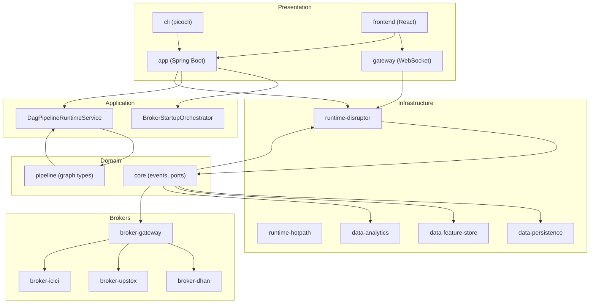
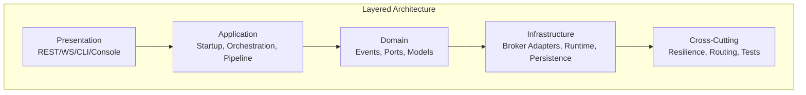
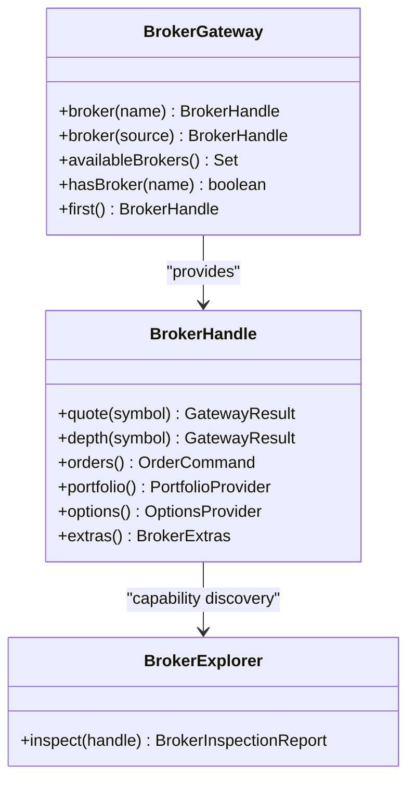
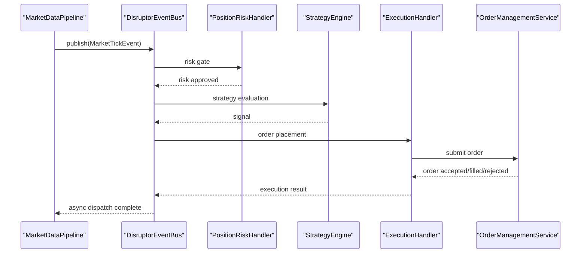
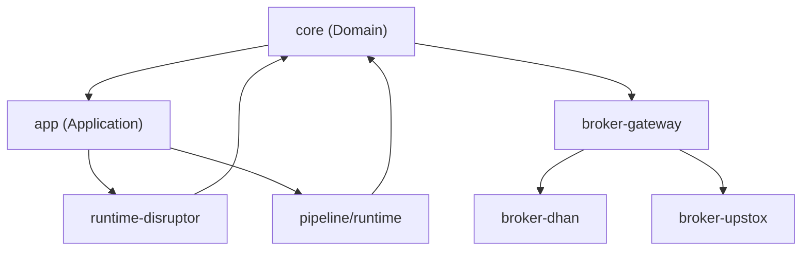
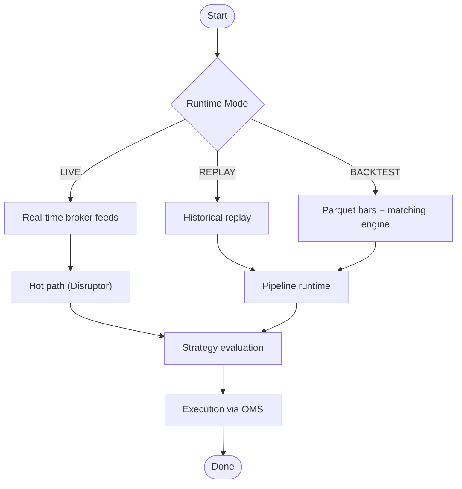
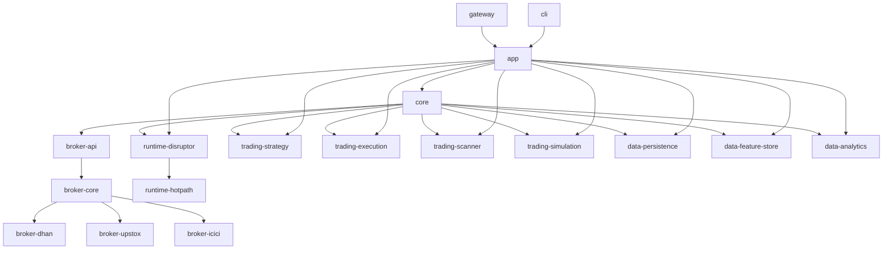

# Architecture

<cite>
**Referenced Files in This Document**
- [ARCHITECTURE.md](file://ARCHITECTURE.md)
- [docs/ARCHITECTURE.md](file://docs/ARCHITECTURE.md)
- [docs/PIPELINE_DESIGN.md](file://docs/PIPELINE_DESIGN.md)
- [docs/BROKER_GATEWAY_ARCHITECTURE_REVIEW.md](file://docs/BROKER_GATEWAY_ARCHITECTURE_REVIEW.md)
- [docs/HORIZONTAL_SCALING_DESIGN.md](file://docs/HORIZONTAL_SCALING_DESIGN.md)
- [settings.gradle](file://settings.gradle)
- [TradingApplication.java](file://app/src/main/java/com/tradej/app/TradingApplication.java)
- [application.yml](file://app/src/main/resources/application.yml)
- [GatewayWebSocketHandler.java](file://gateway/src/main/java/com/tradej/gateway/websocket/GatewayWebSocketHandler.java)
- [BrokerGateway.java](file://broker-gateway/src/main/java/com/tradej/brokergateway/BrokerGateway.java)
- [DagPipelineRuntimeService.java](file://pipeline/runtime/src/main/java/com/tradej/pipeline/service/DagPipelineRuntimeService.java)
- [FullComposition.java](file://composition/src/main/java/com/tradej/composition/FullComposition.java)
- [DomainEvent.java](file://core/src/main/java/com/tradej/core/domain/event/DomainEvent.java)
- [DisruptorEventBus.java](file://runtime/disruptor/src/main/java/com/tradej/disruptor/DisruptorEventBus.java)
- [docs/ARCHITECTURE_REPORT.md](file://docs/ARCHITECTURE_REPORT.md)
</cite>

## Table of Contents
1. [Introduction](#introduction)
2. [Project Structure](#project-structure)
3. [Core Components](#core-components)
4. [Architecture Overview](#architecture-overview)
5. [Detailed Component Analysis](#detailed-component-analysis)
6. [Dependency Analysis](#dependency-analysis)
7. [Performance Considerations](#performance-considerations)
8. [Troubleshooting Guide](#troubleshooting-guide)
9. [Conclusion](#conclusion)
10. [Appendices](#appendices)

## Introduction
Trade-J is a real-time algorithmic trading platform for Indian equity and futures-and-options (F&O) markets. It integrates live market data from multiple brokers, executes orders through a deterministic OMS, evaluates strategies via a plugin and DAG pipeline system, and persists events using Chronicle Queue and DuckDB. The platform supports three runtime modes: LIVE (real or sandbox broker), REPLAY (historical events with simulated orders), and BACKTEST (Parquet bars with a matching engine). It exposes a React console, REST APIs, and a CLI for operators.

## Project Structure
Trade-J is a multi-module Gradle project organized around functional domains and layers. The module map reflects a layered architecture with clear separation between Presentation, Application, Domain, Infrastructure, and Cross-Cutting concerns. Key modules include:
- Core domain and ports
- Broker adapters (Dhan, Upstox, ICICI)
- Runtime engines (Disruptor and hot path)
- Trading subsystems (strategy, execution, scanner, simulation)
- Data and analytics (persistence, feature store, analytics)
- Composition and orchestration (app, gateway, CLI)
- Pipeline platform and runtime
- Architecture tests and research modules

**Diagram sources**
- [settings.gradle:1-95](file://settings.gradle#L1-L95)
- [docs/ARCHITECTURE_REPORT.md:125-146](file://docs/ARCHITECTURE_REPORT.md#L125-L146)

**Section sources**
- [settings.gradle:1-95](file://settings.gradle#L1-L95)
- [docs/ARCHITECTURE.md:24-722](file://docs/ARCHITECTURE.md#L24-L722)
- [docs/ARCHITECTURE_REPORT.md:123-146](file://docs/ARCHITECTURE_REPORT.md#L123-L146)

## Core Components
- Domain events and ports define the core business contracts and event schema evolution.
- DisruptorEventBus provides a high-throughput, low-latency event bus with deduplication, write-ahead logging, and async dispatch.
- BrokerGateway offers a unified, SPI-based gateway to multiple broker adapters with capability discovery and dynamic invocation.
- DagPipelineRuntimeService manages composable DAG pipelines, validating and compiling graph definitions and exposing metrics and ingress bindings.
- FullComposition wires broker, data, and execution layers for live trading and backtesting scenarios.
- GatewayWebSocketHandler bridges Spring WebSocket sessions to the internal topic router and handles replay commands.

**Section sources**
- [DomainEvent.java:1-54](file://core/src/main/java/com/tradej/core/domain/event/DomainEvent.java#L1-L54)
- [DisruptorEventBus.java:52-500](file://runtime/disruptor/src/main/java/com/tradej/disruptor/DisruptorEventBus.java#L52-L500)
- [BrokerGateway.java:1-86](file://broker-gateway/src/main/java/com/tradej/brokergateway/BrokerGateway.java#L1-L86)
- [DagPipelineRuntimeService.java:1-188](file://pipeline/runtime/src/main/java/com/tradej/pipeline/service/DagPipelineRuntimeService.java#L1-L188)
- [FullComposition.java:1-120](file://composition/src/main/java/com/tradej/composition/FullComposition.java#L1-L120)
- [GatewayWebSocketHandler.java:1-111](file://gateway/src/main/java/com/tradej/gateway/websocket/GatewayWebSocketHandler.java#L1-L111)

## Architecture Overview
Trade-J follows a layered architecture with clear boundaries:
- Presentation: REST controllers, WebSocket gateway, CLI, and React console
- Application: Orchestration, startup, pipeline runtime, and services
- Domain: Core events, ports, and domain models
- Infrastructure: Broker adapters, runtime engines, persistence, and analytics
- Cross-Cutting: Resilience, routing, rate limiting, and architecture tests

The system employs a dual pipeline architecture:
- Legacy hot path: Disruptor-based fixed-stage pipeline (risk → candle → strategy → execution)
- Graph runtime: Composable DAG pipeline compiled and deployed at runtime

Broker integration uses a hexagonal architecture with a broker gateway pattern:
- IBrokerConnection as the primary facade
- SPI-based broker providers (Dhan, Upstox, ICICI)
- Capability discovery and dynamic invocation via BrokerHandle and BrokerExplorer

**Diagram sources**
- [docs/ARCHITECTURE.md:787-796](file://docs/ARCHITECTURE.md#L787-L796)
- [docs/ARCHITECTURE_REPORT.md:61-110](file://docs/ARCHITECTURE_REPORT.md#L61-L110)

**Section sources**
- [docs/ARCHITECTURE.md:787-800](file://docs/ARCHITECTURE.md#L787-L800)
- [docs/ARCHITECTURE_REPORT.md:61-110](file://docs/ARCHITECTURE_REPORT.md#L61-L110)

## Detailed Component Analysis

### Broker Gateway Pattern
The broker gateway encapsulates multiple broker integrations behind a unified interface:
- BrokerGateway provides handles by name or source and supports multiple brokers simultaneously
- BrokerHandle exposes typed operations (quotes, depths, orders, portfolio) with capability gating
- BrokerExplorer discovers port interfaces and capability markers dynamically
- SPI-based BrokerProvider enables pluggable broker implementations

**Diagram sources**
- [BrokerGateway.java:1-86](file://broker-gateway/src/main/java/com/tradej/brokergateway/BrokerGateway.java#L1-L86)

**Section sources**
- [docs/BROKER_GATEWAY_ARCHITECTURE_REVIEW.md:9-25](file://docs/BROKER_GATEWAY_ARCHITECTURE_REVIEW.md#L9-L25)
- [docs/BROKER_GATEWAY_ARCHITECTURE_REVIEW.md:28-82](file://docs/BROKER_GATEWAY_ARCHITECTURE_REVIEW.md#L28-L82)
- [docs/BROKER_GATEWAY_ARCHITECTURE_REVIEW.md:157-181](file://docs/BROKER_GATEWAY_ARCHITECTURE_REVIEW.md#L157-L181)

### Pipeline Architecture and Event-Driven Design
Trade-J implements a hybrid pipeline architecture:
- DisruptorEventBus: Fixed-stage hot path with write-ahead logging, deduplication, and async dispatch
- DagPipelineRuntimeService: Composable DAG runtime with compile-time validation and metrics

**Diagram sources**
- [DisruptorEventBus.java:302-333](file://runtime/disruptor/src/main/java/com/tradej/disruptor/DisruptorEventBus.java#L302-L333)
- [docs/PIPELINE_DESIGN.md:10-17](file://docs/PIPELINE_DESIGN.md#L10-L17)

**Section sources**
- [DisruptorEventBus.java:52-500](file://runtime/disruptor/src/main/java/com/tradej/disruptor/DisruptorEventBus.java#L52-L500)
- [DagPipelineRuntimeService.java:1-188](file://pipeline/runtime/src/main/java/com/tradej/pipeline/service/DagPipelineRuntimeService.java#L1-L188)
- [docs/PIPELINE_DESIGN.md:1-17](file://docs/PIPELINE_DESIGN.md#L1-L17)

### System Boundaries and Integration Patterns
- Domain boundary: Core events and ports define the invariant contracts
- Application boundary: Orchestration and pipeline runtime orchestrate flows
- Infrastructure boundary: Broker adapters, runtime engines, and persistence modules
- Integration patterns:
  - Broker adapters integrate via IBrokerConnection and port interfaces
  - Event bus integrates market data, strategy, execution, and persistence layers
  - Gateway integrates presentation and internal runtime via WebSocket transport

**Diagram sources**
- [docs/ARCHITECTURE_REPORT.md:123-146](file://docs/ARCHITECTURE_REPORT.md#L123-L146)

**Section sources**
- [docs/ARCHITECTURE_REPORT.md:123-146](file://docs/ARCHITECTURE_REPORT.md#L123-L146)

### Data Flows and Runtime Modes
- LIVE mode: Real-time broker feeds enter the hot path; orders are executed via OMS
- REPLAY mode: Historical events are replayed through the pipeline with simulated orders
- BACKTEST mode: Parquet bars drive strategy evaluation with a matching engine

**Diagram sources**
- [docs/ARCHITECTURE.md:11-13](file://docs/ARCHITECTURE.md#L11-L13)
- [docs/ARCHITECTURE_REPORT.md:45-46](file://docs/ARCHITECTURE_REPORT.md#L45-L46)

**Section sources**
- [docs/ARCHITECTURE.md:11-13](file://docs/ARCHITECTURE.md#L11-L13)
- [docs/ARCHITECTURE_REPORT.md:45-46](file://docs/ARCHITECTURE_REPORT.md#L45-L46)

## Dependency Analysis
The module dependency graph emphasizes a layered and modular structure:
- Core depends on broker-api and runtime-disruptor
- Broker adapters depend on broker-api and broker-core
- Trading modules depend on core and runtime-disruptor
- Data modules depend on core and runtime-disruptor
- App depends on all modules and orchestrates startup and configuration

**Diagram sources**
- [settings.gradle:1-95](file://settings.gradle#L1-L95)
- [docs/ARCHITECTURE_REPORT.md:51-58](file://docs/ARCHITECTURE_REPORT.md#L51-L58)

**Section sources**
- [settings.gradle:1-95](file://settings.gradle#L1-L95)
- [docs/ARCHITECTURE_REPORT.md:51-58](file://docs/ARCHITECTURE_REPORT.md#L51-L58)

## Performance Considerations
- DisruptorEventBus uses a ring buffer with configurable wait strategies (BusySpin for LIVE, Yielding for REPLAY/BACKTEST) to balance latency and CPU usage.
- Deduplication reduces duplicate broker retransmissions and order callbacks.
- Async dispatch and write-ahead logging improve throughput and crash recovery.
- Pipeline runtime compiles DAGs at boot and exposes metrics for each node.
- Horizontal scaling design outlines sharded nodes, externalized state, and event transport abstraction for multi-node deployments.

**Section sources**
- [DisruptorEventBus.java:474-487](file://runtime/disruptor/src/main/java/com/tradej/disruptor/DisruptorEventBus.java#L474-L487)
- [DisruptorEventBus.java:440-472](file://runtime/disruptor/src/main/java/com/tradej/disruptor/DisruptorEventBus.java#L440-L472)
- [DagPipelineRuntimeService.java:103-129](file://pipeline/runtime/src/main/java/com/tradej/pipeline/service/DagPipelineRuntimeService.java#L103-L129)
- [docs/HORIZONTAL_SCALING_DESIGN.md:66-86](file://docs/HORIZONTAL_SCALING_DESIGN.md#L66-L86)

## Troubleshooting Guide
- Gateway WebSocket lifecycle: The handler logs connection events and unsubscribes transports on close; replay control frames are parsed and forwarded to a processor.
- Startup orchestration: BrokerStartupOrchestrator coordinates catalog loading, preflight checks, WebSocket connections, and subscription validation.
- Health indicators: Application exposes readiness and liveness probes; broker health indicators track feed and order pipeline status.
- Error handling: Circuit breakers, retry policies, and rate limiters mitigate broker failures; deduplication and write-ahead logging aid recovery.

**Section sources**
- [GatewayWebSocketHandler.java:41-110](file://gateway/src/main/java/com/tradej/gateway/websocket/GatewayWebSocketHandler.java#L41-L110)
- [docs/ARCHITECTURE.md:196-210](file://docs/ARCHITECTURE.md#L196-L210)
- [docs/ARCHITECTURE.md:147-155](file://docs/ARCHITECTURE.md#L147-L155)

## Conclusion
Trade-J combines a hexagonal broker gateway with a dual pipeline architecture to deliver a robust, scalable trading platform. The layered design, event-driven flows, and modular composition enable live trading, replay, and backtesting across multiple brokers and asset classes. The horizontal scaling design and runtime mode flexibility support operational excellence and future growth.

## Appendices

### Technology Stack and Compatibility
- Java 21, Spring Boot 3.5.0, Gradle
- LMAX Disruptor, Chronicle Queue, DuckDB
- React 19 + TypeScript, Vite, picocli
- WebSocket and HTTP transport

**Section sources**
- [docs/ARCHITECTURE.md:3-6](file://docs/ARCHITECTURE.md#L3-L6)

### Infrastructure Requirements and Deployment Topology
- Single-node deployment includes in-process DuckDB, local Chronicle, and in-memory caches
- Multi-node target architecture with sharded nodes, externalized state (PostgreSQL/ClickHouse, Redis), and event transport abstraction (Kafka/Redis Streams)
- Kubernetes deployment model with exchange-specific market data nodes, strategy nodes, execution nodes, analytics nodes, and gateway nodes

**Section sources**
- [docs/HORIZONTAL_SCALING_DESIGN.md:9-33](file://docs/HORIZONTAL_SCALING_DESIGN.md#L9-L33)
- [docs/HORIZONTAL_SCALING_DESIGN.md:171-217](file://docs/HORIZONTAL_SCALING_DESIGN.md#L171-L217)

### Security, Monitoring, and Disaster Recovery
- Security: Token lifecycle management, encrypted token stores, and broker authentication flows
- Monitoring: Micrometer metrics, health endpoints, and pipeline node metrics snapshots
- Disaster recovery: Write-ahead logging, replay capabilities, and deduplication to handle broker retransmissions and partial failures

**Section sources**
- [docs/ARCHITECTURE.md:147-159](file://docs/ARCHITECTURE.md#L147-L159)
- [DisruptorEventBus.java:401-410](file://runtime/disruptor/src/main/java/com/tradej/disruptor/DisruptorEventBus.java#L401-L410)

### Runtime Mode Audit and Configuration
- Runtime modes: LIVE, REPLAY, BACKTEST
- Configuration: Profiles for broker selection, gateway settings, analytics, and venue-specific feed modes

**Section sources**
- [docs/ARCHITECTURE.md:11-23](file://docs/ARCHITECTURE.md#L11-L23)
- [application.yml:1-165](file://app/src/main/resources/application.yml#L1-L165)