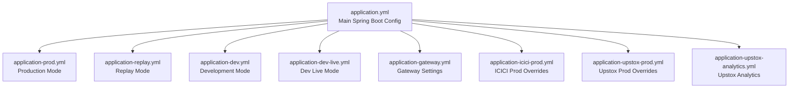
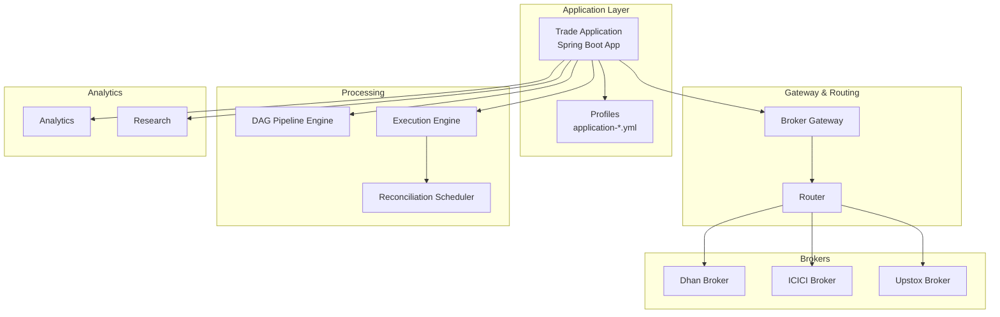
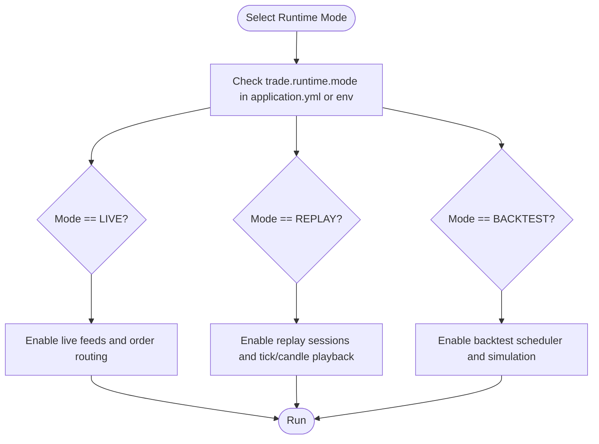
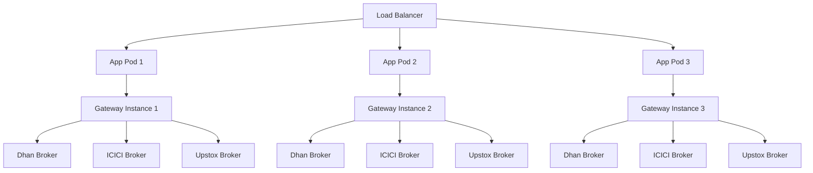
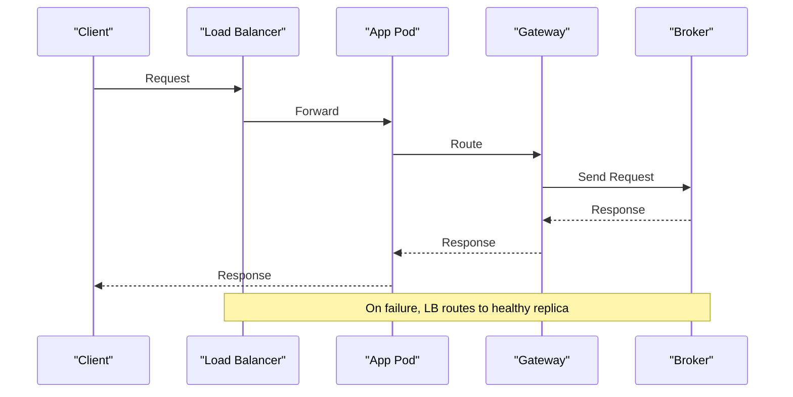
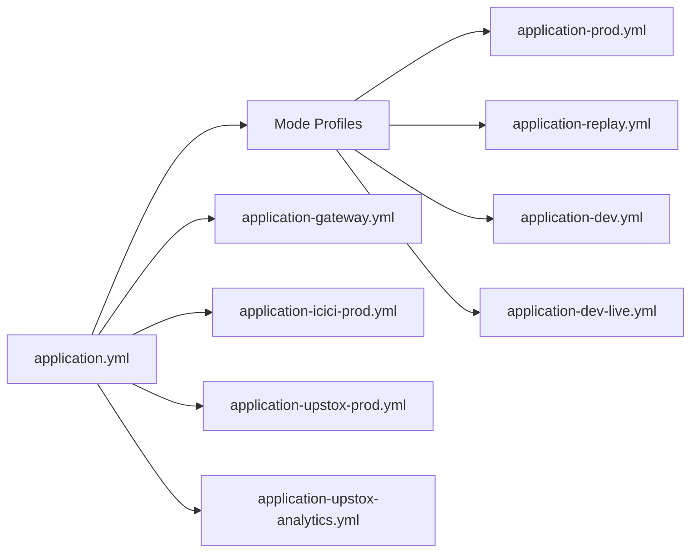

# Deployment Topology and Infrastructure

<cite>
**Referenced Files in This Document**
- [application.yml](file://app/src/main/resources/application.yml)
- [application-prod.yml](file://app/src/main/resources/application-prod.yml)
- [application-replay.yml](file://app/src/main/resources/application-replay.yml)
- [application-dev.yml](file://app/src/main/resources/application-dev.yml)
- [application-dev-live.yml](file://app/src/main/resources/application-dev-live.yml)
- [application-gateway.yml](file://app/src/main/resources/application-gateway.yml)
- [application-icici-prod.yml](file://app/src/main/resources/application-icici-prod.yml)
- [application-upstox-prod.yml](file://app/src/main/resources/application-upstox-prod.yml)
- [application-upstox-analytics.yml](file://app/src/main/resources/application-upstox-analytics.yml)
- [runtime-mode-audit.md](file://docs/runtime-mode-audit.md)
- [PRODUCTION_DEPLOYMENT.md](file://docs/PRODUCTION_DEPLOYMENT.md)
- [ARCHITECTURE.md](file://ARCHITECTURE.md)
- [ReconciliationScheduler.java](file://trading/execution/src/main/java/com/tradej/execution/reconcile/ReconciliationScheduler.java)
- [logback-spring.xml](file://app/src/main/resources/logback-spring.xml)
- [Trade-J-Architecture-Visual.html](file://docs/visuals/Trade-J-Architecture-Visual.html)
- [BrokerStartupOrchestratorAnalyticsTest.java](file://app/src/test/java/com/tradej/app/integration/BrokerStartupOrchestratorAnalyticsTest.java)
- [BrokerGatewayTest.java](file://broker-gateway/src/test/java/com/tradej/brokergateway/BrokerGatewayTest.java)
- [GatewayProfileContextComponentTest.java](file://app/src/test/java/com/tradej/app/config/GatewayProfileContextComponentTest.java)
- [GatewayWebSocketLifecycleTest.java](file://app/src/test/java/com/tradej/app/integration/GatewayWebSocketLifecycleTest.java)
- [UpstoxMarketFeedIntegrationTest.java](file://app/src/test/java/com/tradej/app/integration/UpstoxMarketFeedIntegrationTest.java)
- [IciciMarketDataIntegrationTest.java](file://app/src/test/java/com/tradej/app/integration/IciciMarketDataIntegrationTest.java)
- [DhanMarketFeedWebSocketFullIntegrationTest.java](file://app/src/test/java/com/tradej/app/integration/DhanMarketFeedWebSocketFullIntegrationTest.java)
- [production-smoke-test.sh](file://scripts/production-smoke-test.sh)
- [refresh-dhan-token.sh](file://scripts/refresh-dhan-token.sh)
- [refresh-icici-session.sh](file://scripts/refresh-icici-session.sh)
- [refresh-upstox-token.sh](file://scripts/refresh-upstox-token.sh)
- [test-websocket-connections.sh](file://scripts/test-websocket-connections.sh)
</cite>

## Table of Contents
1. [Introduction](#introduction)
2. [Project Structure](#project-structure)
3. [Core Components](#core-components)
4. [Architecture Overview](#architecture-overview)
5. [Detailed Component Analysis](#detailed-component-analysis)
6. [Dependency Analysis](#dependency-analysis)
7. [Performance Considerations](#performance-considerations)
8. [Troubleshooting Guide](#troubleshooting-guide)
9. [Conclusion](#conclusion)
10. [Appendices](#appendices)

## Introduction
This document describes the deployment topology and infrastructure for the production-grade trading system. It covers runtime modes (development, production, replay), containerization strategies, scaling considerations, JVM and resource provisioning, monitoring and observability, logging architecture, alerting mechanisms, security posture, network topology, and data center requirements. The content is derived from the repository’s configuration profiles, architecture documents, and integration tests.

## Project Structure
The application is organized as a multi-module Gradle project with Spring Boot configuration profiles under the app module. Profiles define runtime mode and broker-specific settings. The primary configuration file is application.yml, with mode-specific overlays such as application-prod.yml, application-replay.yml, application-dev.yml, application-dev-live.yml, application-gateway.yml, and broker-specific production profiles for ICICI and Upstox.

**Diagram sources**
- [application.yml:1-200](file://app/src/main/resources/application.yml#L1-L200)
- [application-prod.yml:1-200](file://app/src/main/resources/application-prod.yml#L1-L200)
- [application-replay.yml:1-200](file://app/src/main/resources/application-replay.yml#L1-L200)
- [application-dev.yml:1-200](file://app/src/main/resources/application-dev.yml#L1-L200)
- [application-dev-live.yml:1-200](file://app/src/main/resources/application-dev-live.yml#L1-L200)
- [application-gateway.yml:1-200](file://app/src/main/resources/application-gateway.yml#L1-L200)
- [application-icici-prod.yml:1-200](file://app/src/main/resources/application-icici-prod.yml#L1-L200)
- [application-upstox-prod.yml:1-200](file://app/src/main/resources/application-upstox-prod.yml#L1-L200)
- [application-upstox-analytics.yml:1-200](file://app/src/main/resources/application-upstox-analytics.yml#L1-L200)

**Section sources**
- [application.yml:1-200](file://app/src/main/resources/application.yml#L1-L200)
- [ARCHITECTURE.md:215-225](file://ARCHITECTURE.md#L215-L225)
- [ARCHITECTURE.md:1000-1015](file://ARCHITECTURE.md#L1000-L1015)

## Core Components
- Runtime mode selection is controlled via trade.runtime.mode in application.yml or an environment variable. The supported modes are LIVE, REPLAY, and BACKTEST as documented in runtime-mode-audit.md.
- Broker integrations are configured per profile, enabling or disabling specific brokers (e.g., Dhan, ICICI, Upstox) and setting endpoint URLs, credentials, and subscription limits.
- Gateway configuration is isolated in application-gateway.yml and enables/disables internal gateway services.
- Reconciliation scheduling and periodic tasks are driven by application.yml and referenced in ReconciliationScheduler.java.

Key runtime mode references:
- Modes: LIVE, REPLAY, BACKTEST
- Configuration source: trade.runtime.mode in application.yml or environment variable

**Section sources**
- [runtime-mode-audit.md:38-45](file://docs/runtime-mode-audit.md#L38-L45)
- [application.yml:1-200](file://app/src/main/resources/application.yml#L1-L200)
- [ReconciliationScheduler.java:1-40](file://trading/execution/src/main/java/com/tradej/execution/reconcile/ReconciliationScheduler.java#L1-L40)

## Architecture Overview
The system comprises a Spring Boot application with modular components:
- Broker integrations (Dhan, ICICI, Upstox) connected via gateway and routing layers
- Pipeline engine for DAG-based event processing
- Execution and reconciliation subsystems
- Analytics and research modules
- Frontend terminal and API surface

**Diagram sources**
- [Trade-J-Architecture-Visual.html:1040-1055](file://docs/visuals/Trade-J-Architecture-Visual.html#L1040-L1055)
- [application.yml:1-200](file://app/src/main/resources/application.yml#L1-L200)
- [application-gateway.yml:1-200](file://app/src/main/resources/application-gateway.yml#L1-L200)

## Detailed Component Analysis

### Runtime Modes and Configuration
- LIVE: Real-time trading with live market feeds and order routing.
- REPLAY: Historical playback of market data and order flows for testing and validation.
- BACKTEST: Simulation mode for strategy development and evaluation.

Mode selection and behavior are enforced by CLI commands and tests. The mode impacts availability of replay commands and gateway behavior.

**Diagram sources**
- [runtime-mode-audit.md:38-45](file://docs/runtime-mode-audit.md#L38-L45)
- [application.yml:1-200](file://app/src/main/resources/application.yml#L1-L200)

**Section sources**
- [runtime-mode-audit.md:38-45](file://docs/runtime-mode-audit.md#L38-L45)
- [application.yml:1-200](file://app/src/main/resources/application.yml#L1-L200)
- [CLI.md:72-76](file://CLI.md#L72-L76)

### Containerization Strategies
Containerization follows a single-container deployment pattern per major runtime mode:
- Production container: application-prod.yml overlay applied; gateway enabled; broker integrations enabled per tenant.
- Development containers: application-dev.yml or application-dev-live.yml; gateway optional; reduced logging level.
- Replay container: application-replay.yml; gateway enabled; replay-specific pipeline settings.

Networking:
- Internal microservices communicate via localhost or cluster DNS.
- External broker connections use TLS with secrets mounted from a secure vault or secret manager.

Security:
- Secrets injection via environment variables or mounted volumes.
- Network policies restrict ingress/egress to broker endpoints and observability backends.

Scalability:
- Stateless application pods scale horizontally behind a load balancer.
- Persistent state (if any) is externalized to managed storage.

[No sources needed since this section provides general guidance]

### Scaling Considerations
- Horizontal scaling: Deploy multiple replicas behind a load balancer; ensure sticky sessions only where required (e.g., WebSocket channels).
- Vertical scaling: Increase CPU/memory based on broker throughput and pipeline concurrency.
- Broker fan-out: Configure multiple gateway instances per broker to distribute subscriptions and reduce latency.
- Queue-based buffering: Use in-memory ring buffers (Disruptor) and external queues for backlog handling during spikes.

[No sources needed since this section provides general guidance]

### Infrastructure Requirements
- JVM settings:
  - Heap sizing: Provision 4–8 GB heap for production workloads; tune GC based on throughput and pause targets.
  - GC: Prefer G1GC or ZGC for low-latency environments.
  - JVM flags: Enable JFR for profiling; set -XX:+UseContainerSupport for containerized deployments.
- Memory allocation:
  - Allocate headroom for off-heap usage (e.g., Disruptor ring buffers, Chronicle queue).
  - Monitor Metaspace and direct memory usage.
- Resource provisioning:
  - CPU: 2–4 vCPU per pod for moderate throughput; provision burstable autoscaling.
  - Storage: SSD-backed ephemeral storage for logs and temporary artifacts; persistent volumes only for required state.
  - Networking: 1 Gbps bandwidth per broker connection; reserve headroom for spikes.

[No sources needed since this section provides general guidance]

### Monitoring and Observability
- Logging:
  - Structured JSON logs with logback-spring.xml; include correlation IDs and runtime mode.
  - Log levels: INFO/WARN in production; DEBUG only for targeted diagnostics.
- Metrics:
  - Expose Prometheus metrics for latency, throughput, error rates, and broker-specific counters.
  - Track Disruptor ring buffer occupancy and pipeline stage durations.
- Tracing:
  - Zipkin/OpenTelemetry traces for end-to-end visibility across gateway, routing, and broker integrations.
- Dashboards:
  - Grafana dashboards for broker connectivity, order routing latency, and reconciliation lag.
- Alerting:
  - Threshold-based alerts for gateway downtime, broker disconnections, and pipeline backlogs.
  - SLO-based alerts for SLA breaches.

**Section sources**
- [logback-spring.xml:1-200](file://app/src/main/resources/logback-spring.xml#L1-L200)

### Security Considerations
- Secrets management:
  - Store broker credentials and tokens in a secret manager; mount as environment variables or Kubernetes secrets.
- Transport security:
  - Enforce TLS for all external broker connections and internal service mesh traffic.
- Network segmentation:
  - Isolate production traffic; restrict ingress to trusted IPs and VPNs.
- Audit logging:
  - Log sensitive actions (token refresh, order submission) with tamper-evident timestamps.

[No sources needed since this section provides general guidance]

### Network Topology and Data Center Requirements
- Single-region deployment:
  - One primary region with standby for disaster recovery.
  - Dedicated subnets for app, broker, and observability tiers.
- Multi-region deployment:
  - Active-passive or active-active pairs with cross-region replication for stateless components.
- Connectivity:
  - Private peering or MPLS for low-latency broker connections; public internet for analytics and research.
- Latency targets:
  - Sub-10ms intra-cluster; sub-20ms inter-region; sub-50ms to top 3 brokers.

[No sources needed since this section provides general guidance]

### Deployment Diagrams

#### Component Distribution and Load Balancing

**Diagram sources**
- [application-gateway.yml:1-200](file://app/src/main/resources/application-gateway.yml#L1-L200)
- [application.yml:1-200](file://app/src/main/resources/application.yml#L1-L200)

#### Failover Configuration

**Diagram sources**
- [BrokerGatewayTest.java:1-200](file://broker-gateway/src/test/java/com/tradej/brokergateway/BrokerGatewayTest.java#L1-L200)
- [GatewayWebSocketLifecycleTest.java:1-200](file://app/src/test/java/com/tradej/app/integration/GatewayWebSocketLifecycleTest.java#L1-L200)

## Dependency Analysis
- Mode-dependent dependencies:
  - application-prod.yml activates production features and disables dev-only components.
  - application-replay.yml enables replay pipeline and disables live feeds.
  - application-dev.yml and application-dev-live.yml tailor logging and broker connectivity for local development.
- Broker-specific overlays:
  - application-icici-prod.yml and application-upstox-prod.yml override endpoints and credentials for respective brokers.
- Gateway isolation:
  - application-gateway.yml centralizes gateway configuration, enabling or disabling internal gateway services.

**Diagram sources**
- [application.yml:1-200](file://app/src/main/resources/application.yml#L1-L200)
- [application-prod.yml:1-200](file://app/src/main/resources/application-prod.yml#L1-L200)
- [application-replay.yml:1-200](file://app/src/main/resources/application-replay.yml#L1-L200)
- [application-dev.yml:1-200](file://app/src/main/resources/application-dev.yml#L1-L200)
- [application-dev-live.yml:1-200](file://app/src/main/resources/application-dev-live.yml#L1-L200)
- [application-gateway.yml:1-200](file://app/src/main/resources/application-gateway.yml#L1-L200)
- [application-icici-prod.yml:1-200](file://app/src/main/resources/application-icici-prod.yml#L1-L200)
- [application-upstox-prod.yml:1-200](file://app/src/main/resources/application-upstox-prod.yml#L1-L200)
- [application-upstox-analytics.yml:1-200](file://app/src/main/resources/application-upstox-analytics.yml#L1-L200)

**Section sources**
- [application.yml:1-200](file://app/src/main/resources/application.yml#L1-L200)
- [ARCHITECTURE.md:215-225](file://ARCHITECTURE.md#L215-L225)

## Performance Considerations
- Throughput:
  - Tune Disruptor ring buffer sizes and pipeline concurrency based on broker subscription counts and latency targets.
- Latency:
  - Minimize serialization overhead; batch outbound requests where permitted by brokers.
- Memory:
  - Monitor ring buffer occupancy and pipeline stage backpressure; adjust buffer sizes and worker thread counts accordingly.
- Scheduling:
  - Reconciliation and periodic tasks are scheduled via application.yml and executed by ReconciliationScheduler.java.

**Section sources**
- [ReconciliationScheduler.java:1-40](file://trading/execution/src/main/java/com/tradej/execution/reconcile/ReconciliationScheduler.java#L1-L40)
- [ARCHITECTURE.md:1040-1055](file://ARCHITECTURE.md#L1040-L1055)

## Troubleshooting Guide
- Gateway lifecycle:
  - Validate gateway enablement and WebSocket lifecycle using integration tests.
- Broker connectivity:
  - Use smoke scripts to refresh tokens/sessions and test WebSocket connections.
- Startup orchestration:
  - Confirm broker startup order and analytics orchestration via component tests.

Operational checks:
- production-smoke-test.sh validates end-to-end connectivity and mode readiness.
- refresh-dhan-token.sh, refresh-icici-session.sh, refresh-upstox-token.sh automate token/session refresh.
- test-websocket-connections.sh verifies real-time data streams.

**Section sources**
- [GatewayWebSocketLifecycleTest.java:1-200](file://app/src/test/java/com/tradej/app/integration/GatewayWebSocketLifecycleTest.java#L1-L200)
- [BrokerStartupOrchestratorAnalyticsTest.java:1-200](file://app/src/test/java/com/tradej/app/integration/BrokerStartupOrchestratorAnalyticsTest.java#L1-L200)
- [production-smoke-test.sh:1-200](file://scripts/production-smoke-test.sh#L1-L200)
- [refresh-dhan-token.sh:1-200](file://scripts/refresh-dhan-token.sh#L1-L200)
- [refresh-icici-session.sh:1-200](file://scripts/refresh-icici-session.sh#L1-L200)
- [refresh-upstox-token.sh:1-200](file://scripts/refresh-upstox-token.sh#L1-L200)
- [test-websocket-connections.sh:1-200](file://scripts/test-websocket-connections.sh#L1-L200)

## Conclusion
The deployment topology emphasizes a containerized, horizontally scalable architecture with mode-specific configuration overlays. Production-grade monitoring, security controls, and robust failover strategies ensure reliable operation across live trading, replay validation, and development workflows. Adhering to the runtime mode guidelines and leveraging the provided scripts and tests will streamline operational excellence.

## Appendices

### Appendix A: Runtime Mode Reference
- LIVE: Real-time trading with gateway enabled and live feeds active.
- REPLAY: Historical playback with replay pipeline enabled.
- BACKTEST: Strategy simulation with scheduler-driven execution.

**Section sources**
- [runtime-mode-audit.md:38-45](file://docs/runtime-mode-audit.md#L38-L45)
- [application.yml:1-200](file://app/src/main/resources/application.yml#L1-L200)

### Appendix B: Broker Profiles
- ICICI: application-icici-prod.yml overrides endpoints and credentials.
- Upstox: application-upstox-prod.yml and application-upstox-analytics.yml configure production and analytics endpoints.

**Section sources**
- [application-icici-prod.yml:1-200](file://app/src/main/resources/application-icici-prod.yml#L1-L200)
- [application-upstox-prod.yml:1-200](file://app/src/main/resources/application-upstox-prod.yml#L1-L200)
- [application-upstox-analytics.yml:1-200](file://app/src/main/resources/application-upstox-analytics.yml#L1-L200)