# Adapter Pattern

<cite>
**Referenced Files in This Document**
- [IBrokerConnection.java](file://broker/api/src/main/java/com/tradej/broker/api/IBrokerConnection.java)
- [DhanBrokerConnection.java](file://broker/dhan/src/main/java/com/tradej/broker/dhan/DhanBrokerConnection.java)
- [IciciBrokerConnection.java](file://broker/icici/src/main/java/com/tradej/broker/icici/IciciBrokerConnection.java)
- [UpstoxBrokerConnection.java](file://broker/upstox/src/main/java/com/tradej/broker/upstox/UpstoxBrokerConnection.java)
- [BrokerGateway.java](file://broker-gateway/src/main/java/com/tradej/brokergateway/BrokerGateway.java)
- [DefaultBrokerGateway.java](file://broker-gateway/src/main/java/com/tradej/brokergateway/DefaultBrokerGateway.java)
- [BrokerHandle.java](file://broker-gateway/src/main/java/com/tradej/brokergateway/BrokerHandle.java)
- [DhanBrokerAdapter.java](file://gateway/src/main/java/com/tradej/gateway/broker/dhan/DhanBrokerAdapter.java)
- [BrokerRouterTest.java](file://broker-gateway/src/test/java/com/tradej/brokergateway/BrokerRouterTest.java)
- [DesignPatternArchitectureTest.java](file://architecture-test/src/test/java/com/tradej/architecture/DesignPatternArchitectureTest.java)
- [CodeQualityArchitectureTest.java](file://architecture-test/src/test/java/com/tradej/architecture/CodeQualityArchitectureTest.java)
</cite>

## Table of Contents
1. [Introduction](#introduction)
2. [Project Structure](#project-structure)
3. [Core Components](#core-components)
4. [Architecture Overview](#architecture-overview)
5. [Detailed Component Analysis](#detailed-component-analysis)
6. [Dependency Analysis](#dependency-analysis)
7. [Performance Considerations](#performance-considerations)
8. [Troubleshooting Guide](#troubleshooting-guide)
9. [Conclusion](#conclusion)

## Introduction
This document explains how the adapter pattern is implemented in broker integrations to provide unified access to multiple brokerage providers (Dhan, Upstox, ICICI). The IBrokerConnection interface defines a common contract for market data, order management, portfolio, options, futures, and other capabilities. Each broker module supplies a concrete implementation that wraps broker-specific adapters. The broker gateway manages adapter instances and routes requests consistently across brokers, enabling multi-broker support, testability, and extensibility.

## Project Structure
The adapter pattern spans three main areas:
- Broker API: Defines the IBrokerConnection interface and port abstractions
- Broker implementations: Dhan, Upstox, and ICICI provide concrete IBrokerConnection implementations
- Broker gateway: Manages broker connections and exposes a unified handle for operations

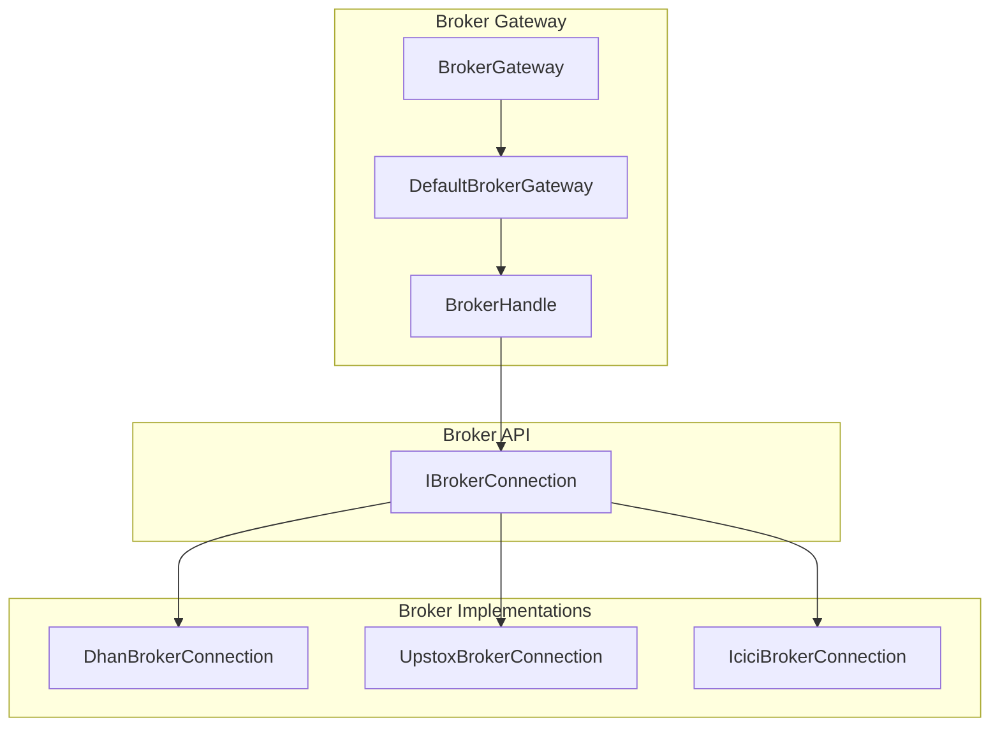

**Diagram sources**
- [IBrokerConnection.java:27-107](file://broker/api/src/main/java/com/tradej/broker/api/IBrokerConnection.java#L27-L107)
- [DhanBrokerConnection.java:68-442](file://broker/dhan/src/main/java/com/tradej/broker/dhan/DhanBrokerConnection.java#L68-L442)
- [UpstoxBrokerConnection.java:35-188](file://broker/upstox/src/main/java/com/tradej/broker/upstox/UpstoxBrokerConnection.java#L35-L188)
- [IciciBrokerConnection.java:36-238](file://broker/icici/src/main/java/com/tradej/broker/icici/IciciBrokerConnection.java#L36-L238)
- [BrokerGateway.java:26-85](file://broker-gateway/src/main/java/com/tradej/brokergateway/BrokerGateway.java#L26-L85)
- [DefaultBrokerGateway.java:39-66](file://broker-gateway/src/main/java/com/tradej/brokergateway/DefaultBrokerGateway.java#L39-L66)
- [BrokerHandle.java:81-554](file://broker-gateway/src/main/java/com/tradej/brokergateway/BrokerHandle.java#L81-L554)

**Section sources**
- [IBrokerConnection.java:23-107](file://broker/api/src/main/java/com/tradej/broker/api/IBrokerConnection.java#L23-L107)
- [BrokerGateway.java:11-85](file://broker-gateway/src/main/java/com/tradej/brokergateway/BrokerGateway.java#L11-L85)

## Core Components
- IBrokerConnection: Declares capability-based accessors and a generic capability lookup mechanism. It standardizes market data, orders, portfolio, options, futures, margin, alerts, news, and websocket access across brokers.
- Broker implementations: DhanBrokerConnection, UpstoxBrokerConnection, and IciciBrokerConnection implement IBrokerConnection and expose the same capability methods while adding broker-specific features.
- Broker gateway: BrokerGateway and DefaultBrokerGateway construct and manage broker handles. BrokerHandle provides a fluent API for market data, orders, portfolio, options, futures, and advanced order capabilities, returning typed results with latency metadata.

Benefits:
- Unified contract: Clients depend on IBrokerConnection and BrokerHandle, not concrete broker classes
- Testability: Simulated connections and adapters can replace real ones
- Extensibility: New brokers integrate by implementing IBrokerConnection and registering via the gateway

**Section sources**
- [IBrokerConnection.java:27-107](file://broker/api/src/main/java/com/tradej/broker/api/IBrokerConnection.java#L27-L107)
- [BrokerGateway.java:26-85](file://broker-gateway/src/main/java/com/tradej/brokergateway/BrokerGateway.java#L26-L85)
- [BrokerHandle.java:81-554](file://broker-gateway/src/main/java/com/tradej/brokergateway/BrokerHandle.java#L81-L554)

## Architecture Overview
The adapter pattern ensures each broker’s internal complexity is encapsulated behind IBrokerConnection. The gateway composes broker connections and exposes a uniform handle for clients.

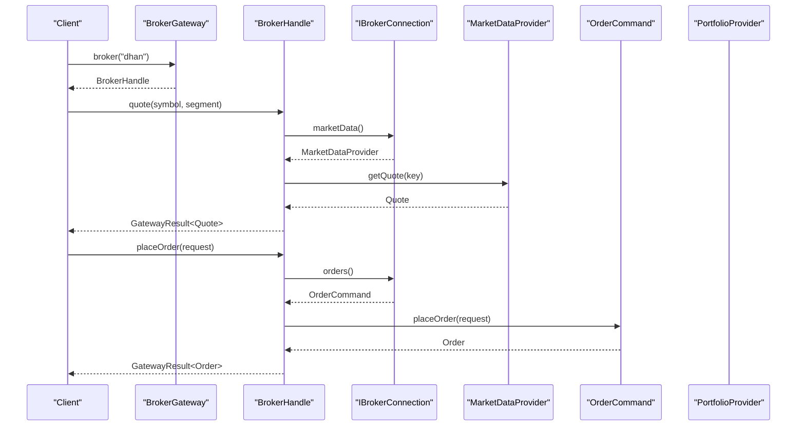

**Diagram sources**
- [BrokerGateway.java:26-85](file://broker-gateway/src/main/java/com/tradej/brokergateway/BrokerGateway.java#L26-L85)
- [BrokerHandle.java:125-277](file://broker-gateway/src/main/java/com/tradej/brokergateway/BrokerHandle.java#L125-L277)
- [IBrokerConnection.java:31-89](file://broker/api/src/main/java/com/tradej/broker/api/IBrokerConnection.java#L31-L89)

## Detailed Component Analysis

### IBrokerConnection: Unified Contract
- Provides default getters for market data, orders, portfolio, options, futures, margin, alerts, news, and websocket multiplexer
- Requires capability lookup for optional features; throws if unsupported
- Exposes connect/disconnect and instrument catalog loading

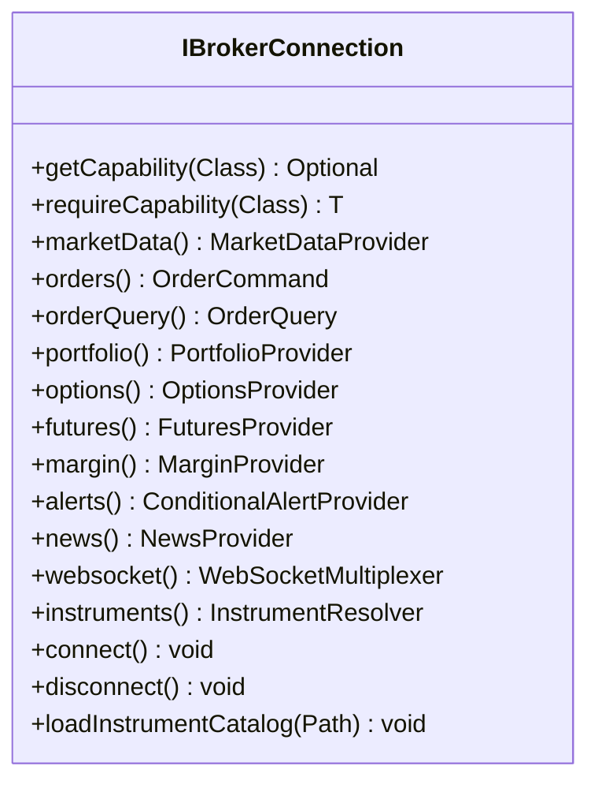

**Diagram sources**
- [IBrokerConnection.java:27-107](file://broker/api/src/main/java/com/tradej/broker/api/IBrokerConnection.java#L27-L107)

**Section sources**
- [IBrokerConnection.java:27-107](file://broker/api/src/main/java/com/tradej/broker/api/IBrokerConnection.java#L27-L107)

### DhanBrokerConnection: Market Data, Orders, Portfolio, Options, Futures, Margin, Alerts, News
- Implements IBrokerConnection and delegates to Dhan-specific adapters for each capability
- Uses capability markers to declare support for options, futures, margin, alerts, and advanced orders
- Connects/disconnects websocket and closes client resources

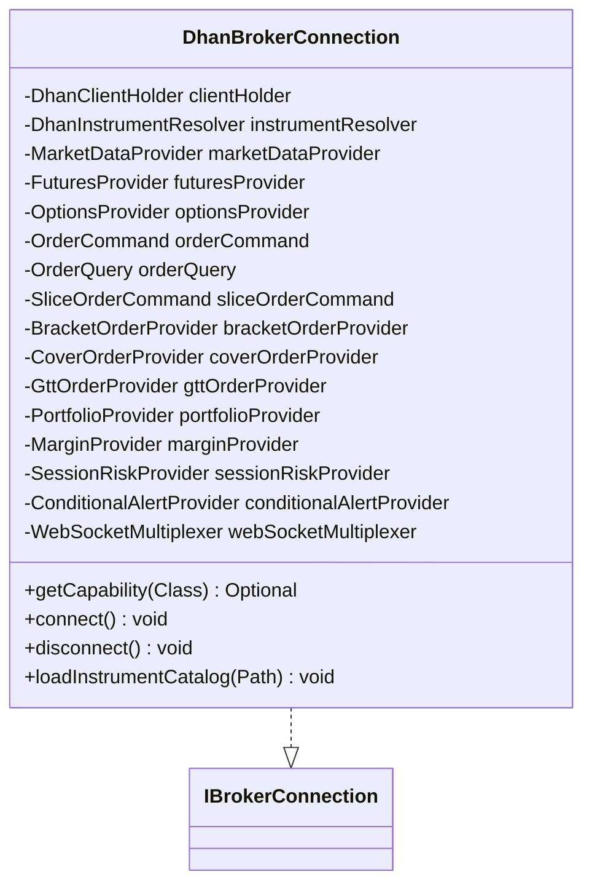

**Diagram sources**
- [DhanBrokerConnection.java:68-442](file://broker/dhan/src/main/java/com/tradej/broker/dhan/DhanBrokerConnection.java#L68-L442)

**Section sources**
- [DhanBrokerConnection.java:68-442](file://broker/dhan/src/main/java/com/tradej/broker/dhan/DhanBrokerConnection.java#L68-L442)

### IciciBrokerConnection: Market Data, Orders, Portfolio, Options, Futures, Margin, Websocket
- Implements IBrokerConnection with ICICI-specific adapters
- Declares capability markers and intentionally omits session risk and alerts
- Connects/disconnects websocket and loads instrument catalogs from remote or local path

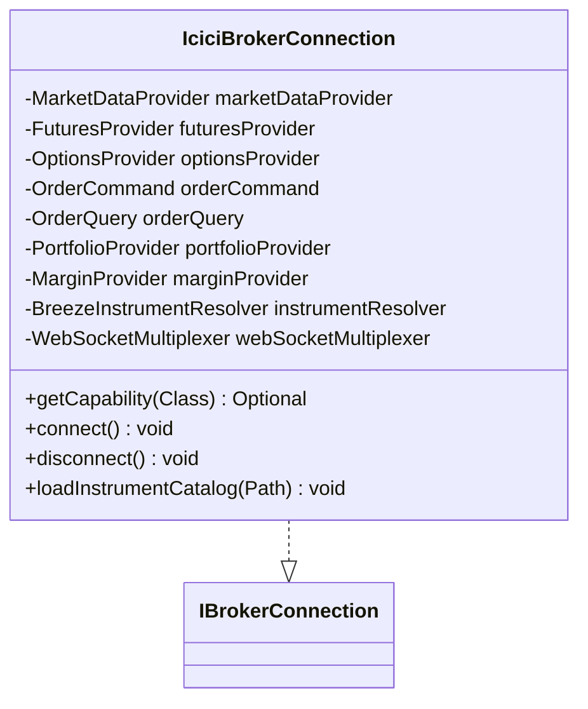

**Diagram sources**
- [IciciBrokerConnection.java:36-238](file://broker/icici/src/main/java/com/tradej/broker/icici/IciciBrokerConnection.java#L36-L238)

**Section sources**
- [IciciBrokerConnection.java:36-238](file://broker/icici/src/main/java/com/tradej/broker/icici/IciciBrokerConnection.java#L36-L238)

### UpstoxBrokerConnection: Market Data, Orders, Portfolio, Options, Futures, Margin, News, Alerts, Slices, Cover Orders
- Implements IBrokerConnection with Upstox-specific adapters
- Declares news capability marker and optional advanced order adapters
- Loads instrument catalogs from a provided path or downloads and caches

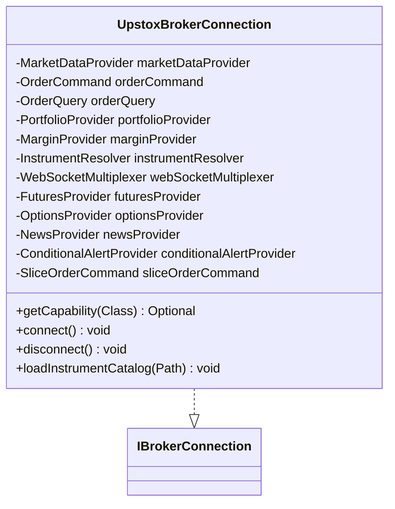

**Diagram sources**
- [UpstoxBrokerConnection.java:35-188](file://broker/upstox/src/main/java/com/tradej/broker/upstox/UpstoxBrokerConnection.java#L35-L188)

**Section sources**
- [UpstoxBrokerConnection.java:35-188](file://broker/upstox/src/main/java/com/tradej/broker/upstox/UpstoxBrokerConnection.java#L35-L188)

### Broker Gateway: Managing Adapter Instances and Routing Requests
- BrokerGateway defines static factory methods to create gateways from compositions, single connections, or a registry
- DefaultBrokerGateway constructs BrokerHandle instances keyed by BrokerSource
- BrokerHandle provides fluent methods for market data, orders, portfolio, options, futures, and advanced order capabilities, returning GatewayResult with latency metadata

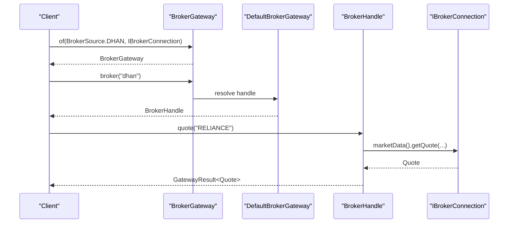

**Diagram sources**
- [BrokerGateway.java:55-85](file://broker-gateway/src/main/java/com/tradej/brokergateway/BrokerGateway.java#L55-L85)
- [DefaultBrokerGateway.java:39-66](file://broker-gateway/src/main/java/com/tradej/brokergateway/DefaultBrokerGateway.java#L39-L66)
- [BrokerHandle.java:125-178](file://broker-gateway/src/main/java/com/tradej/brokergateway/BrokerHandle.java#L125-L178)

**Section sources**
- [BrokerGateway.java:26-85](file://broker-gateway/src/main/java/com/tradej/brokergateway/BrokerGateway.java#L26-L85)
- [DefaultBrokerGateway.java:39-66](file://broker-gateway/src/main/java/com/tradej/brokergateway/DefaultBrokerGateway.java#L39-L66)
- [BrokerHandle.java:81-554](file://broker-gateway/src/main/java/com/tradej/brokergateway/BrokerHandle.java#L81-L554)

### Example: Market Data Adapters Implement the Same Interface Differently
- DhanBrokerConnection delegates market data to Dhan-specific adapters
- IciciBrokerConnection delegates market data to ICICI-specific adapters
- UpstoxBrokerConnection delegates market data to Upstox-specific adapters
- All expose MarketDataProvider via IBrokerConnection.marketData(), but each adapter transforms broker-specific payloads and handles venue nuances

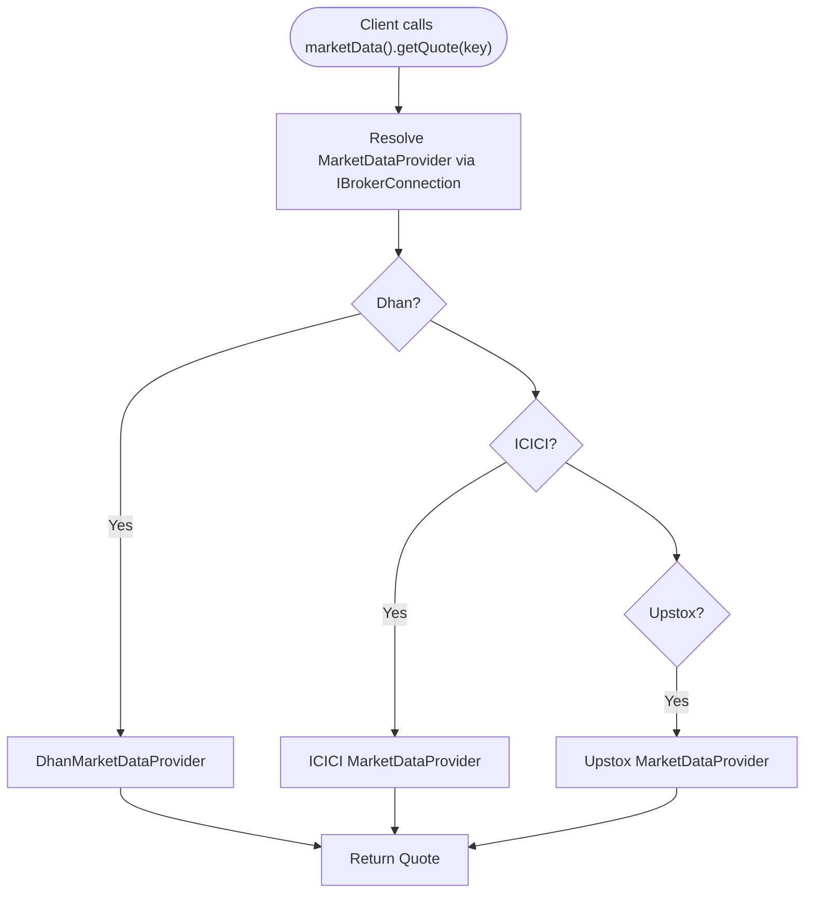

**Diagram sources**
- [IBrokerConnection.java:31-33](file://broker/api/src/main/java/com/tradej/broker/api/IBrokerConnection.java#L31-L33)
- [DhanBrokerConnection.java:271-273](file://broker/dhan/src/main/java/com/tradej/broker/dhan/DhanBrokerConnection.java#L271-L273)
- [IciciBrokerConnection.java:86-88](file://broker/icici/src/main/java/com/tradej/broker/icici/IciciBrokerConnection.java#L86-L88)
- [UpstoxBrokerConnection.java:93-95](file://broker/upstox/src/main/java/com/tradej/broker/upstox/UpstoxBrokerConnection.java#L93-L95)

### Example: Order Adapters Implement the Same Interface Differently
- DhanBrokerConnection exposes Dhan-specific order adapters for regular, bracket, GTT, slice, and cover orders
- IciciBrokerConnection exposes ICICI-specific adapters for bracket, GTT, slice, and cover orders
- UpstoxBrokerConnection exposes Upstox-specific adapters for cover orders and optional slice orders
- All expose OrderCommand/OrderQuery via IBrokerConnection.orders()/orderQuery(), but each adapter implements broker-specific validation, submission, and lifecycle

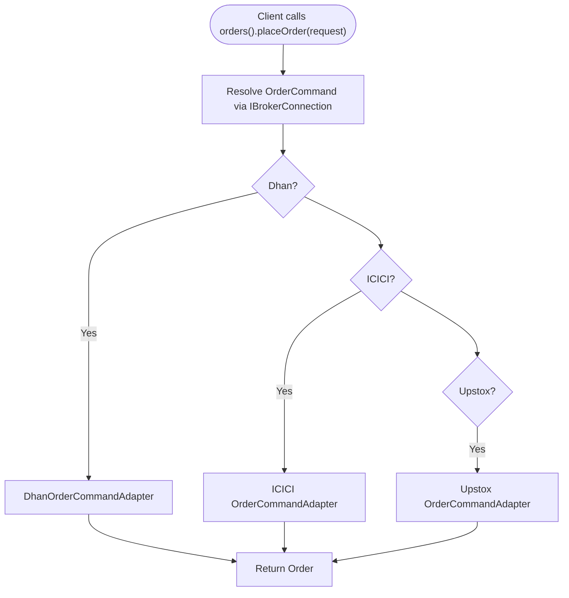

**Diagram sources**
- [IBrokerConnection.java:43-45](file://broker/api/src/main/java/com/tradej/broker/api/IBrokerConnection.java#L43-L45)
- [DhanBrokerConnection.java:286-288](file://broker/dhan/src/main/java/com/tradej/broker/dhan/DhanBrokerConnection.java#L286-L288)
- [IciciBrokerConnection.java:101-103](file://broker/icici/src/main/java/com/tradej/broker/icici/IciciBrokerConnection.java#L101-L103)
- [UpstoxBrokerConnection.java:58-62](file://broker/upstox/src/main/java/com/tradej/broker/upstox/UpstoxBrokerConnection.java#L58-L62)

### Example: Portfolio Adapters Implement the Same Interface Differently
- DhanBrokerConnection exposes DhanPortfolioProvider for balance, positions, holdings, ledger, and margin estimation
- IciciBrokerConnection exposes IciciPortfolioProvider for balance, positions, holdings
- UpstoxBrokerConnection exposes UpstoxPortfolioProvider for balance, positions, holdings
- All expose PortfolioProvider via IBrokerConnection.portfolio(), but each adapter maps broker-specific fields and endpoints

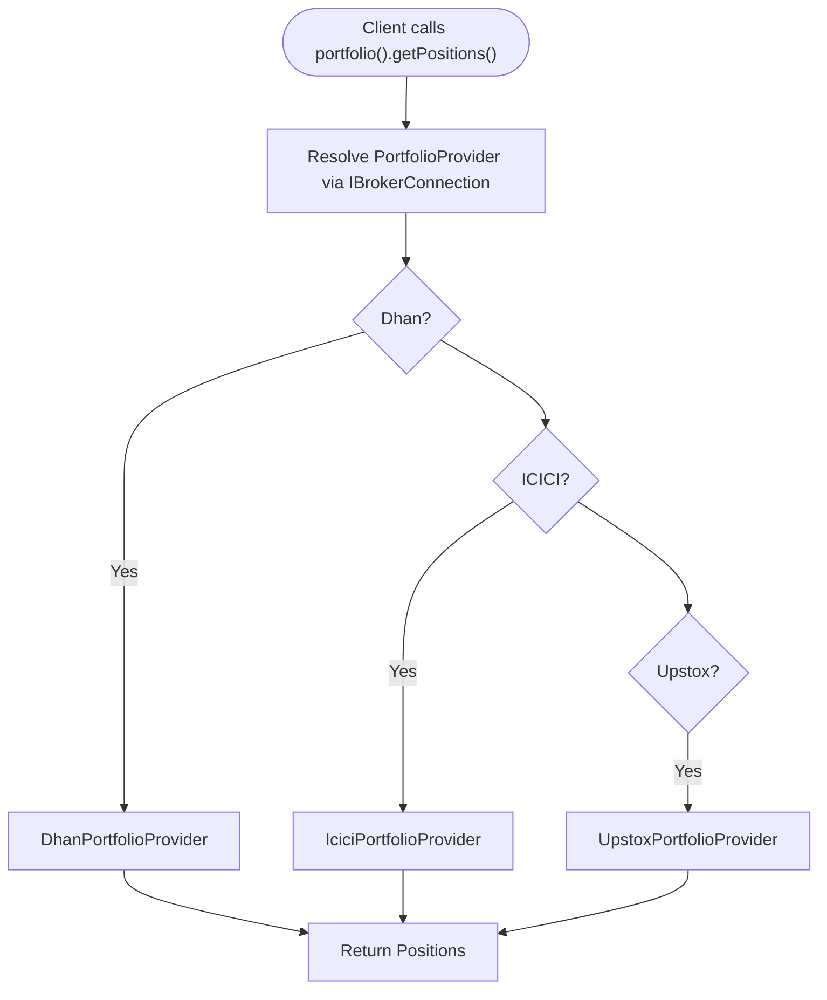

**Diagram sources**
- [IBrokerConnection.java:63-65](file://broker/api/src/main/java/com/tradej/broker/api/IBrokerConnection.java#L63-L65)
- [DhanBrokerConnection.java:311-313](file://broker/dhan/src/main/java/com/tradej/broker/dhan/DhanBrokerConnection.java#L311-L313)
- [IciciBrokerConnection.java:126-128](file://broker/icici/src/main/java/com/tradej/broker/icici/IciciBrokerConnection.java#L126-L128)
- [UpstoxBrokerConnection.java:60-62](file://broker/upstox/src/main/java/com/tradej/broker/upstox/UpstoxBrokerConnection.java#L60-L62)

### Role of the Broker Gateway in Managing Adapter Instances and Routing Requests
- BrokerGateway.of(...) creates a gateway from a single named broker connection
- DefaultBrokerGateway.fromRegistry(...) builds multiple broker handles from a registry and profiles
- BrokerHandle routes calls to the underlying IBrokerConnection and returns typed results with latency metadata
- Tests confirm the gateway preserves the underlying gateway reference and handle resolution

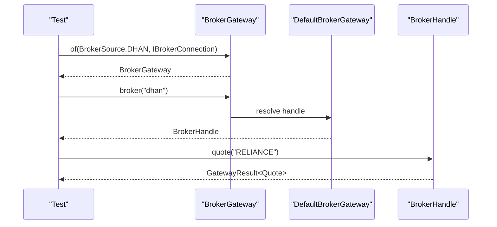

**Diagram sources**
- [BrokerGateway.java:67-69](file://broker-gateway/src/main/java/com/tradej/brokergateway/BrokerGateway.java#L67-L69)
- [DefaultBrokerGateway.java:39-41](file://broker-gateway/src/main/java/com/tradej/brokergateway/DefaultBrokerGateway.java#L39-L41)
- [BrokerRouterTest.java:39-50](file://broker-gateway/src/test/java/com/tradej/brokergateway/BrokerRouterTest.java#L39-L50)

**Section sources**
- [BrokerGateway.java:55-85](file://broker-gateway/src/main/java/com/tradej/brokergateway/BrokerGateway.java#L55-L85)
- [DefaultBrokerGateway.java:48-58](file://broker-gateway/src/main/java/com/tradej/brokergateway/DefaultBrokerGateway.java#L48-L58)
- [BrokerRouterTest.java:39-50](file://broker-gateway/src/test/java/com/tradej/brokergateway/BrokerRouterTest.java#L39-L50)

## Dependency Analysis
- IBrokerConnection is the central abstraction consumed by BrokerHandle and gateway factories
- Each broker implementation depends on its own adapters and capability markers
- BrokerHandle depends on IBrokerConnection and returns GatewayResult with metadata
- Architecture tests enforce that concrete broker connection types do not leak outside broker and adapter packages and that the adapter pattern exists in broker-api

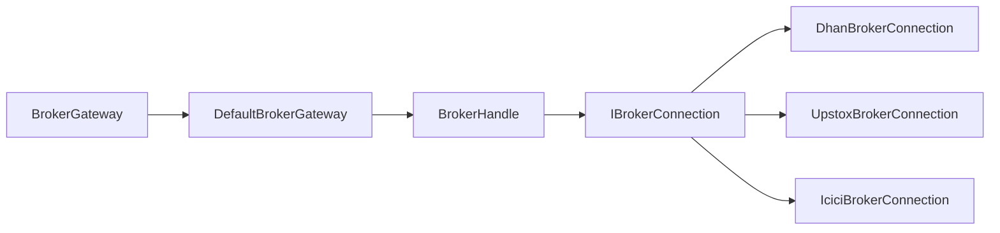

**Diagram sources**
- [IBrokerConnection.java:27-107](file://broker/api/src/main/java/com/tradej/broker/api/IBrokerConnection.java#L27-L107)
- [DhanBrokerConnection.java:68-442](file://broker/dhan/src/main/java/com/tradej/broker/dhan/DhanBrokerConnection.java#L68-L442)
- [UpstoxBrokerConnection.java:35-188](file://broker/upstox/src/main/java/com/tradej/broker/upstox/UpstoxBrokerConnection.java#L35-L188)
- [IciciBrokerConnection.java:36-238](file://broker/icici/src/main/java/com/tradej/broker/icici/IciciBrokerConnection.java#L36-L238)
- [BrokerGateway.java:26-85](file://broker-gateway/src/main/java/com/tradej/brokergateway/BrokerGateway.java#L26-L85)
- [DefaultBrokerGateway.java:39-66](file://broker-gateway/src/main/java/com/tradej/brokergateway/DefaultBrokerGateway.java#L39-L66)
- [BrokerHandle.java:81-554](file://broker-gateway/src/main/java/com/tradej/brokergateway/BrokerHandle.java#L81-L554)

**Section sources**
- [DesignPatternArchitectureTest.java:169-176](file://architecture-test/src/test/java/com/tradej/architecture/DesignPatternArchitectureTest.java#L169-L176)
- [CodeQualityArchitectureTest.java:63-87](file://architecture-test/src/test/java/com/tradej/architecture/CodeQualityArchitectureTest.java#L63-L87)

## Performance Considerations
- GatewayHandle measures latency per operation and attaches metadata to results
- Broker implementations encapsulate broker-specific retries and resilience; clients observe consistent timing
- Use capability gating to avoid unnecessary overhead for unsupported features

## Troubleshooting Guide
Common issues and resolutions:
- UnsupportedOperationException when accessing unsupported capabilities: Check BrokerHandle.supports(Class) or catch and handle appropriately
- Connection failures: Verify connect/disconnect sequences and websocket status via BrokerHandle
- Instrument catalog loading errors: Ensure proper paths and fallback behavior for Upstox and ICICI implementations

**Section sources**
- [IBrokerConnection.java:91-95](file://broker/api/src/main/java/com/tradej/broker/api/IBrokerConnection.java#L91-L95)
- [BrokerHandle.java:416-418](file://broker-gateway/src/main/java/com/tradej/brokergateway/BrokerHandle.java#L416-L418)
- [UpstoxBrokerConnection.java:104-128](file://broker/upstox/src/main/java/com/tradej/broker/upstox/UpstoxBrokerConnection.java#L104-L128)
- [IciciBrokerConnection.java:166-172](file://broker/icici/src/main/java/com/tradej/broker/icici/IciciBrokerConnection.java#L166-L172)

## Conclusion
The adapter pattern enables multi-broker support by exposing a unified IBrokerConnection contract while encapsulating broker-specific implementations. BrokerHandle and the gateway provide a consistent, testable, and extensible façade for market data, orders, portfolio, options, futures, and advanced order capabilities across Dhan, Upstox, and ICICI. This design promotes clean separation of concerns, simplifies integration testing, and facilitates future broker additions.