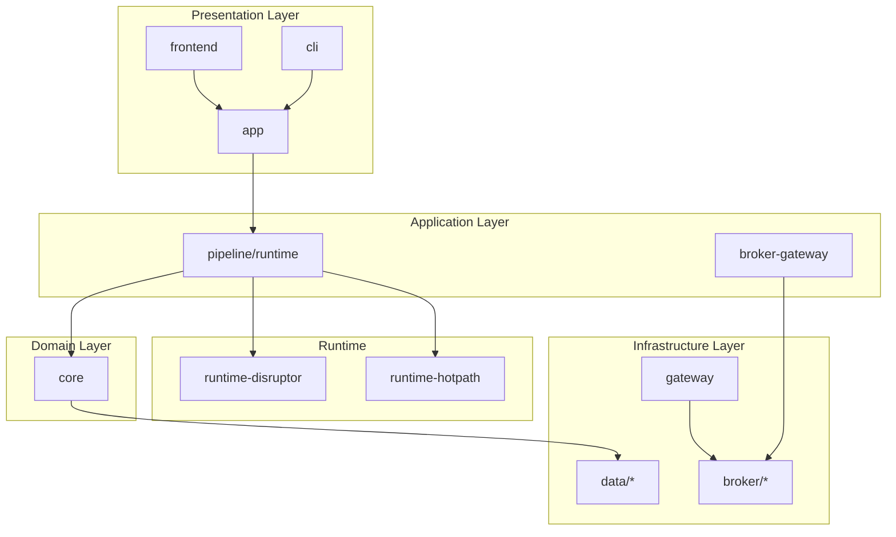
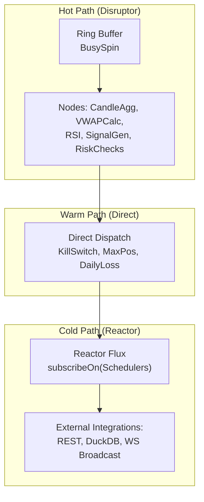
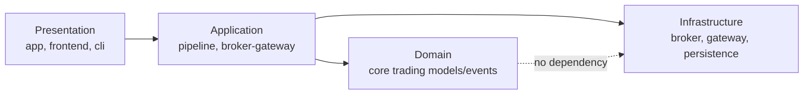
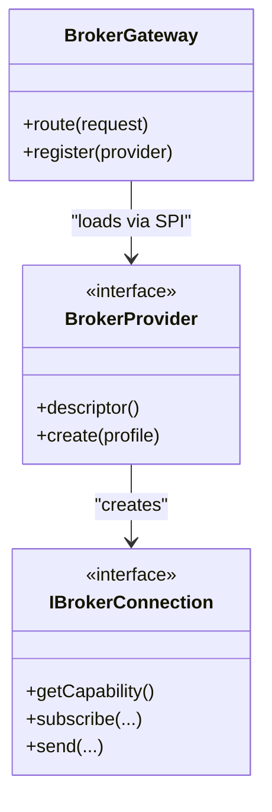
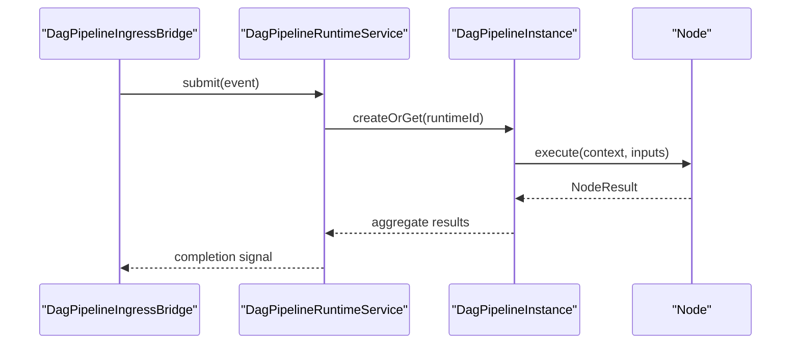
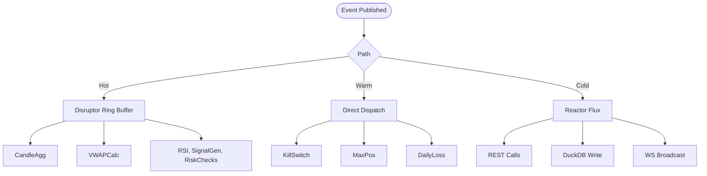
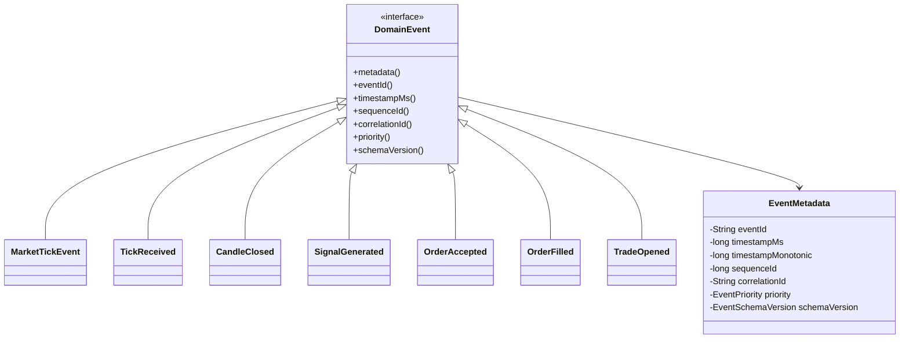
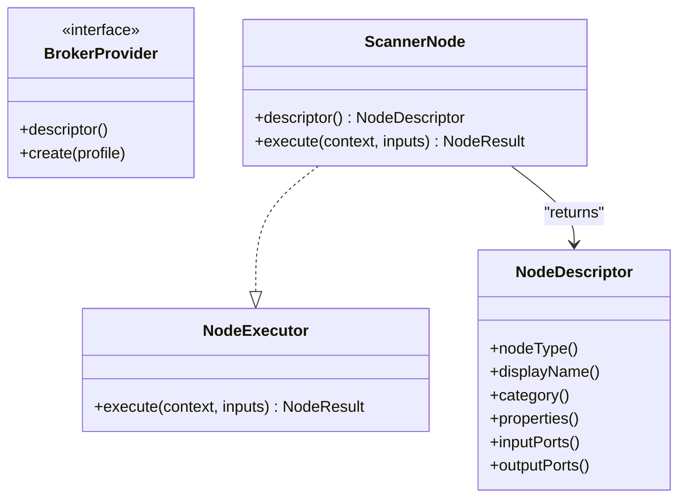
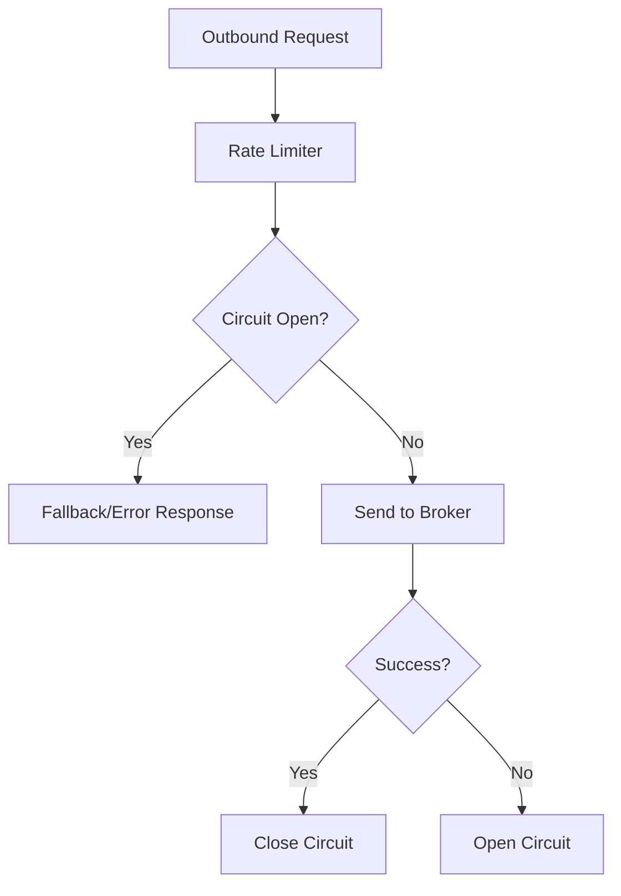
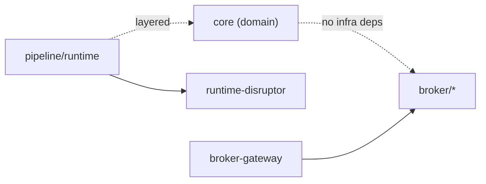

# Design Patterns and Architectural Principles

<cite>
**Referenced Files in This Document**
- [DesignPatternArchitectureTest.java](file://architecture-test/src/test/java/com/tradej/architecture/DesignPatternArchitectureTest.java)
- [CliArchitectureCommand.java](file://cli/src/main/java/com/tradej/cli/command/CliArchitectureCommand.java)
- [runtime/README.md](file://runtime/README.md)
- [REACTIVE_ADOPTION_REVIEW_2026-06-06.md](file://docs/reports/REACTIVE_ADOPTION_REVIEW_2026-06-06.md)
- [ARCHITECTURE_REPORT.md](file://docs/ARCHITECTURE_REPORT.md)
- [BROKER_GATEWAY_ARCHITECTURE_REVIEW.md](file://docs/BROKER_GATEWAY_ARCHITECTURE_REVIEW.md)
- [Order.java](file://core/src/main/java/com/tradej/core/domain/model/Order.java)
- [BrokerGateway.java](file://broker-gateway/src/main/java/com/tradej/brokergateway/BrokerGateway.java)
- [DagPipelineRuntimeService.java](file://pipeline/runtime/src/main/java/com/tradej/pipeline/service/DagPipelineRuntimeService.java)
- [DagPipelineIngressBridge.java](file://pipeline/runtime/src/main/java/com/tradej/pipeline/service/DagPipelineIngressBridge.java)
- [DagPipelineInstance.java](file://pipeline/runtime/src/main/java/com/tradej/pipeline/service/DagPipelineInstance.java)
- [ReactorBridge.java](file://docs/archive/ARCHITECTURE_EVOLUTION_PIPELINE_OS.md)
- [ScannerNodeTest.java](file://nodes/trade-node-library/src/test/java/com/tradej/node/scanner/ScannerNodeTest.java)
</cite>

## Table of Contents
1. [Introduction](#introduction)
2. [Project Structure](#project-structure)
3. [Core Components](#core-components)
4. [Architecture Overview](#architecture-overview)
5. [Detailed Component Analysis](#detailed-component-analysis)
6. [Dependency Analysis](#dependency-analysis)
7. [Performance Considerations](#performance-considerations)
8. [Troubleshooting Guide](#troubleshooting-guide)
9. [Conclusion](#conclusion)

## Introduction
This document explains the design patterns and architectural principles implemented in the system, focusing on:
- Hexagonal architecture separating presentation, application, domain, and infrastructure layers
- Adapter pattern for broker integrations
- Pipeline pattern for workflow processing
- Event-driven architecture using LMAX Disruptor
- Domain-Driven Design (DDD) principles in the core trading domain
- Service Provider Interface (SPI) patterns for broker providers and node development
- Plugin architecture for strategies and scanners
- Cross-cutting concerns: resilience, rate limiting, and circuit breakers

## Project Structure
The system is organized into modular Gradle projects that align with layered architecture and bounded contexts:
- Presentation and orchestration: app, frontend, cli
- Domain and modeling: core
- Infrastructure and integrations: broker, broker-gateway, gateway, data persistence
- Pipelines and runtime: pipeline, runtime-disruptor, runtime-hotpath
- Nodes and plugins: nodes/trade-node-library
- Research and scanning: research, scanner, institutional-scanner
- Execution and trading: trading/execution, trading/strategy, trading/scanner
- Documentation and architecture tests: docs, architecture-test

**Section sources**
- [runtime/README.md:1-7](file://runtime/README.md#L1-L7)

## Core Components
- Hexagonal architecture enforces clean boundaries:
  - Domain must not depend on infrastructure (enforced by architecture tests)
  - Application services encapsulate use cases without Spring coupling
- Event-driven backbone powered by LMAX Disruptor for low-latency, deterministic processing
- Pipeline pattern orchestrates nodes and stages via a DAG runtime
- SPI-based broker provider and node plugin systems for extensibility
- DDD core models and events define the trading domain semantics

**Section sources**
- [DesignPatternArchitectureTest.java:189-222](file://architecture-test/src/test/java/com/tradej/architecture/DesignPatternArchitectureTest.java#L189-L222)
- [runtime/README.md:1-7](file://runtime/README.md#L1-L7)

## Architecture Overview
The system follows a hybrid event-driven architecture:
- Hot path: Disruptor ring buffers process market data and order events deterministically
- Warm path: Direct dispatch for internal coordination
- Cold path: Reactor Flux for fan-out and external integrations
- Pipeline runtime composes nodes into a DAG for complex workflows

**Section sources**
- [REACTIVE_ADOPTION_REVIEW_2026-06-06.md:658-834](file://docs/reports/REACTIVE_ADOPTION_REVIEW_2026-06-06.md#L658-L834)

## Detailed Component Analysis

### Hexagonal Architecture Implementation
Hexagonal architecture separates concerns into:
- Presentation: app, frontend, cli
- Application: pipeline runtime, broker-gateway
- Domain: core trading models and events
- Infrastructure: broker adapters, gateway transports, persistence

Key enforcement:
- Domain must not depend on broker implementations
- Application services must not depend on Spring framework classes
- These constraints are validated by ArchUnit tests

**Section sources**
- [DesignPatternArchitectureTest.java:189-222](file://architecture-test/src/test/java/com/tradej/architecture/DesignPatternArchitectureTest.java#L189-L222)

### Adapter Pattern for Broker Integrations
The broker-gateway module exposes a unified interface for multiple broker providers. The SPI enables pluggable broker adapters while keeping the application layer independent of concrete broker implementations.

- BrokerProvider SPI allows adding new brokers without modifying core
- Capability-based port selection via IBrokerConnection.getCapability()
- BrokerExplorer inspects capabilities and routes requests accordingly

**Section sources**
- [BrokerGateway.java](file://broker-gateway/src/main/java/com/tradej/brokergateway/BrokerGateway.java)
- [BROKER_GATEWAY_ARCHITECTURE_REVIEW.md:382-406](file://docs/BROKER_GATEWAY_ARCHITECTURE_REVIEW.md#L382-L406)

### Pipeline Pattern for Workflow Processing
The pipeline runtime composes nodes into a Directed Acyclic Graph (DAG) and executes them deterministically. It bridges ingress events into the hot path and coordinates node execution.

**Section sources**
- [DagPipelineRuntimeService.java](file://pipeline/runtime/src/main/java/com/tradej/pipeline/service/DagPipelineRuntimeService.java)
- [DagPipelineIngressBridge.java](file://pipeline/runtime/src/main/java/com/tradej/pipeline/service/DagPipelineIngressBridge.java)
- [DagPipelineInstance.java](file://pipeline/runtime/src/main/java/com/tradej/pipeline/service/DagPipelineInstance.java)

### Event-Driven Architecture Using LMAX Disruptor
The hot path uses LMAX Disruptor for high-throughput, low-latency event processing. The hybrid architecture keeps Disruptor as the backbone while integrating Reactor where it adds value (fan-out and external integrations).

**Section sources**
- [runtime/README.md:1-7](file://runtime/README.md#L1-L7)
- [REACTIVE_ADOPTION_REVIEW_2026-06-06.md:658-834](file://docs/reports/REACTIVE_ADOPTION_REVIEW_2026-06-06.md#L658-L834)

### Domain-Driven Design (DDD) Principles in the Trading Domain
The core domain defines bounded contexts around orders, trades, positions, and market data. Events represent domain state changes and drive orchestration across subsystems.

**Section sources**
- [ARCHITECTURE_REPORT.md:693-787](file://docs/ARCHITECTURE_REPORT.md#L693-L787)
- [Order.java](file://core/src/main/java/com/tradej/core/domain/model/Order.java)

### SPI Patterns for Broker Providers and Node Development
- BrokerProvider SPI: Enables adding new broker adapters without changing gateway core
- Node SPI: Defines node descriptors, categories, ports, and execution contracts for scanners and strategies

**Section sources**
- [BROKER_GATEWAY_ARCHITECTURE_REVIEW.md:382-406](file://docs/BROKER_GATEWAY_ARCHITECTURE_REVIEW.md#L382-L406)
- [ScannerNodeTest.java:19-39](file://nodes/trade-node-library/src/test/java/com/tradej/node/scanner/ScannerNodeTest.java#L19-L39)

### Plugin Architecture for Strategies and Scanners
Strategies and scanners are implemented as nodes that plug into the pipeline runtime. They expose descriptors and execute against input data streams.

Benefits:
- Encourages small, composable components
- Supports unit testing and deterministic replay
- Enables parallel development across teams

Trade-offs:
- Requires adherence to node contracts
- Limited runtime plugin lifecycle (enable/disable, hot-reload) are not supported

**Section sources**
- [ScannerNodeTest.java:19-39](file://nodes/trade-node-library/src/test/java/com/tradej/node/scanner/ScannerNodeTest.java#L19-L39)
- [BROKER_GATEWAY_ARCHITECTURE_REVIEW.md:382-406](file://docs/BROKER_GATEWAY_ARCHITECTURE_REVIEW.md#L382-L406)

### Resilience, Rate Limiting, and Circuit Breakers
Cross-cutting concerns are integrated across layers:
- Circuit breakers protect downstream services during failures
- Rate limiting controls outbound request rates per broker
- Health indicators monitor broker connectivity and pipeline throughput
- Chaos engineering and resilience tests validate failure modes

**Section sources**
- [REACTIVE_ADOPTION_REVIEW_2026-06-06.md:196-214](file://docs/reports/REACTIVE_ADOPTION_REVIEW_2026-06-06.md#L196-L214)

## Dependency Analysis
The architecture enforces strict layering and pattern adherence:
- Domain must not depend on infrastructure (broker implementations)
- Application services must remain free of Spring coupling
- Pipeline runtime depends on Disruptor for hot-path processing
- Broker gateway depends on SPI providers for extensibility

**Section sources**
- [DesignPatternArchitectureTest.java:189-222](file://architecture-test/src/test/java/com/tradej/architecture/DesignPatternArchitectureTest.java#L189-L222)
- [runtime/README.md:1-7](file://runtime/README.md#L1-L7)

## Performance Considerations
- Disruptor provides sub-microsecond latencies and high throughput suitable for market data and order events
- Reactor is reserved for fan-out and external integrations where backpressure and composability are beneficial
- Hybrid path strategy ensures determinism for replay while enabling scalability for downstream consumers

**Section sources**
- [REACTIVE_ADOPTION_REVIEW_2026-06-06.md:196-214](file://docs/reports/REACTIVE_ADOPTION_REVIEW_2026-06-06.md#L196-L214)

## Troubleshooting Guide
Common issues and mitigations:
- Broker connectivity failures: inspect health indicators and circuit breaker state
- Pipeline stalls: verify ring buffer capacity and wait strategy configuration
- Node execution errors: validate node descriptors and input/output port contracts
- Rate limit exceeded: adjust per-broker limits and implement retry/backoff policies

Operational checks:
- Use CLI architecture summary to confirm pattern adoption and module counts
- Validate Disruptor bridge usage for Reactor integration

**Section sources**
- [CliArchitectureCommand.java:110-132](file://cli/src/main/java/com/tradej/cli/command/CliArchitectureCommand.java#L110-L132)
- [REACTIVE_ADOPTION_REVIEW_2026-06-06.md:658-834](file://docs/archive/ARCHITECTURE_EVOLUTION_PIPELINE_OS.md#L787-L831)

## Conclusion
The system’s design leverages proven patterns to achieve low-latency, scalable, and maintainable trading infrastructure:
- Hexagonal architecture cleanly separates concerns and enforces layer discipline
- Adapter and SPI patterns enable extensible broker and node ecosystems
- Disruptor-backed event-driven architecture optimizes for determinism and throughput
- Pipeline pattern composes complex workflows from small, testable nodes
- Cross-cutting resilience mechanisms ensure robust operation under stress