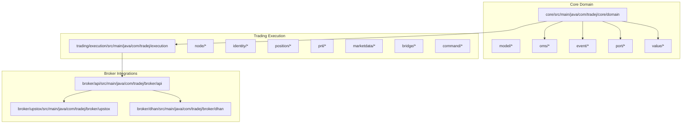
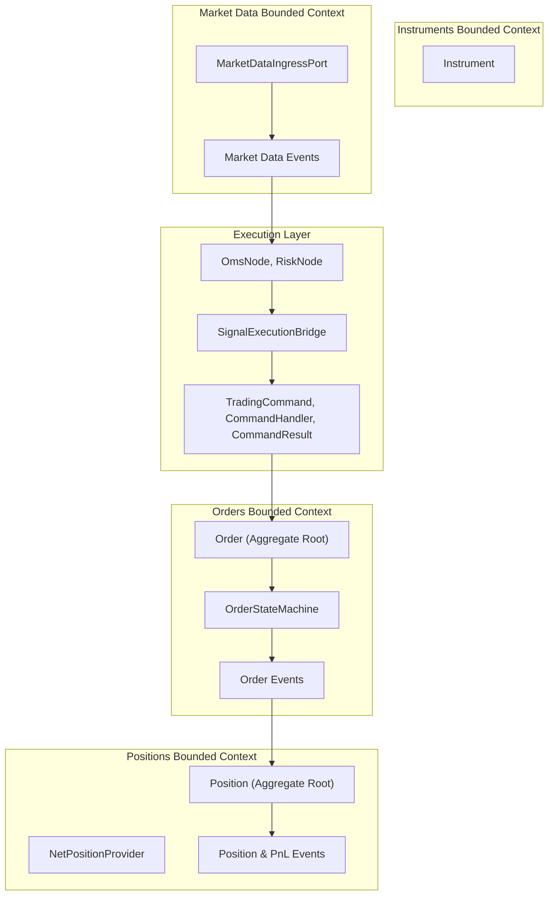
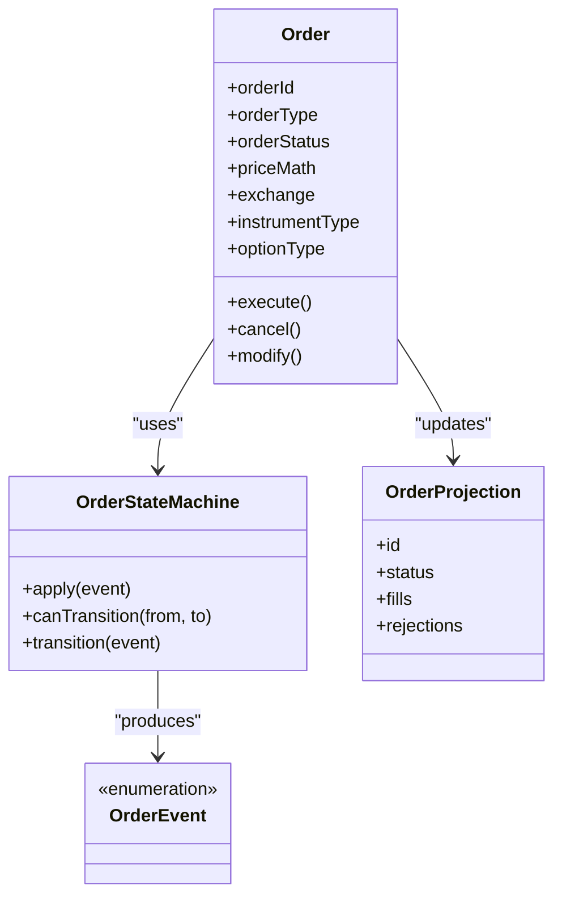
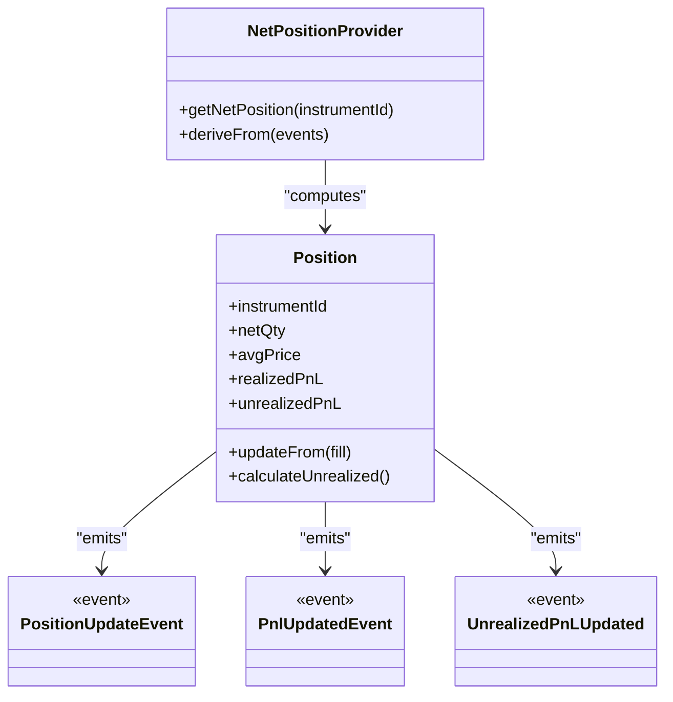
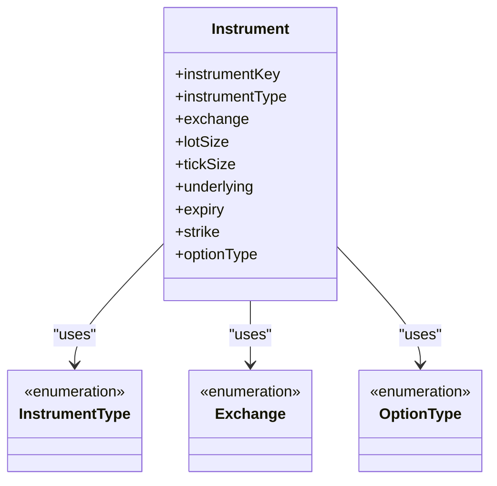
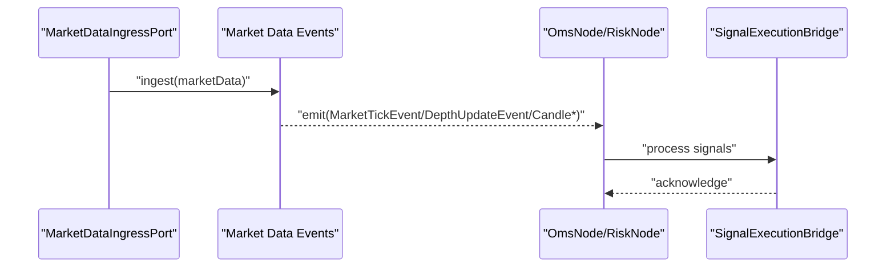
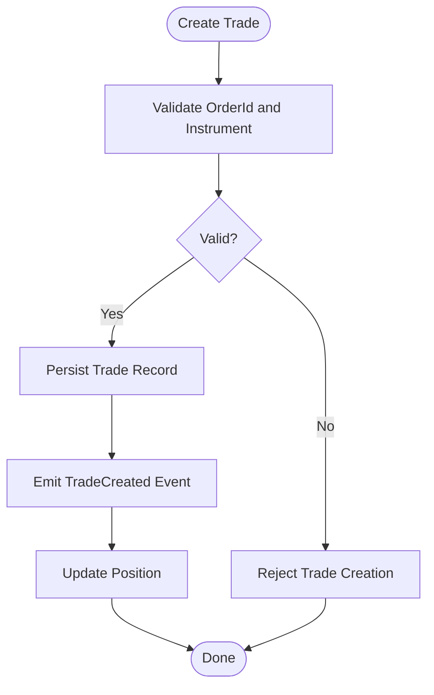
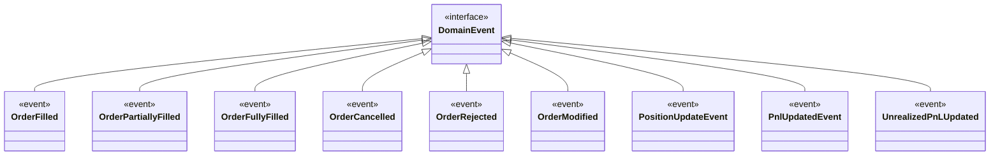
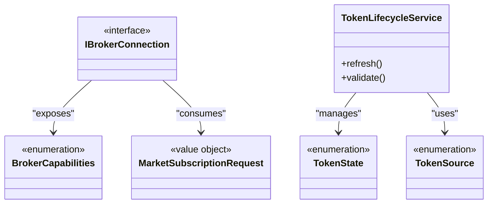
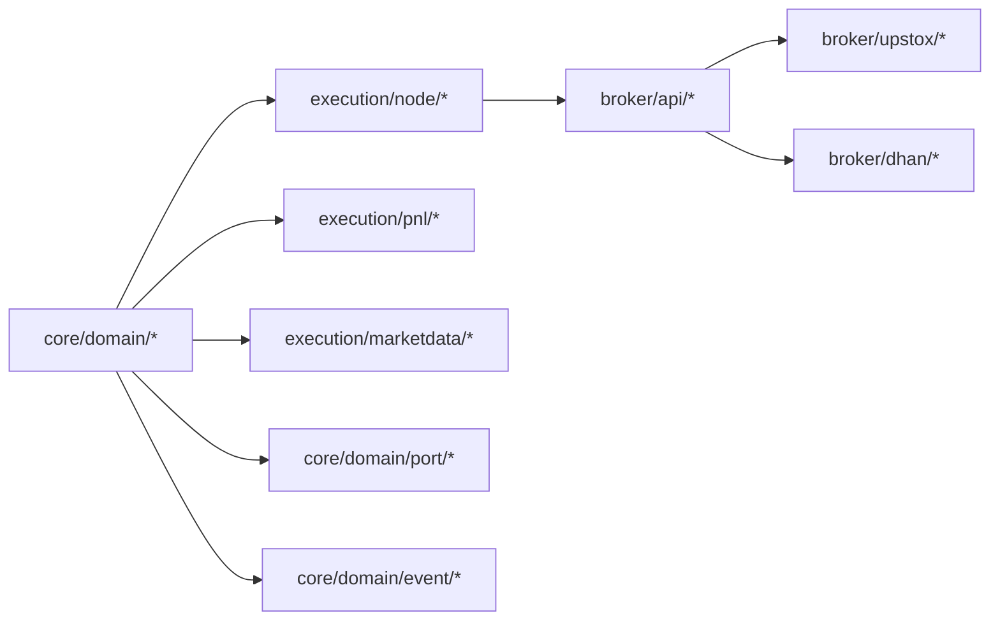

# Domain-Driven Design (DDD)

<cite>
**Referenced Files in This Document**
- [README.md](file://README.md)
- [ARCHITECTURE.md](file://ARCHITECTURE.md)
- [PORTFOLIO_DDD_MIGRATION_GUIDE.md](file://trading/strategy/docs/PORTFOLIO_DDD_MIGRATION_GUIDE.md)
- [Order.java](file://core/src/main/java/com/tradej/core/domain/model/Order.java)
- [Position.java](file://core/src/main/java/com/tradej/core/domain/model/Position.java)
- [Instrument.java](file://core/src/main/java/com/tradej/core/domain/model/Instrument.java)
- [Trade.java](file://core/src/main/java/com/tradej/core/domain/model/Trade.java)
- [OrderStateMachine.java](file://core/src/main/java/com/tradej/core/domain/oms/OrderStateMachine.java)
- [OrderEvent.java](file://core/src/main/java/com/tradej/core/domain/oms/OrderEvent.java)
- [OrderProjection.java](file://core/src/main/java/com/tradej/core/domain/oms/OrderProjection.java)
- [DomainEvent.java](file://core/src/main/java/com/tradej/core/domain/event/DomainEvent.java)
- [OrderFilled.java](file://core/src/main/java/com/tradej/core/domain/event/OrderFilled.java)
- [OrderPartiallyFilled.java](file://core/src/main/java/com/tradej/core/domain/event/OrderPartiallyFilled.java)
- [OrderFullyFilled.java](file://core/src/main/java/com/tradej/core/domain/event/OrderFullyFilled.java)
- [OrderCancelled.java](file://core/src/main/java/com/tradej/core/domain/event/OrderCancelled.java)
- [OrderRejected.java](file://core/src/main/java/com/tradej/core/domain/event/OrderRejected.java)
- [OrderModified.java](file://core/src/main/java/com/tradej/core/domain/event/OrderModified.java)
- [OrderUpdateEvent.java](file://core/src/main/java/com/tradej/core/domain/event/OrderUpdateEvent.java)
- [PositionUpdateEvent.java](file://core/src/main/java/com/tradej/core/domain/event/PositionUpdateEvent.java)
- [PnlUpdatedEvent.java](file://core/src/main/java/com/tradej/core/domain/event/PnlUpdatedEvent.java)
- [UnrealizedPnLUpdated.java](file://core/src/main/java/com/tradej/core/domain/event/UnrealizedPnLUpdated.java)
- [EventBus.java](file://core/src/main/java/com/tradej/core/domain/port/EventBus.java)
- [MarketDataIngressPort.java](file://core/src/main/java/com/tradej/core/domain/port/MarketDataIngressPort.java)
- [NetPositionProvider.java](file://core/src/main/java/com/tradej/core/domain/port/NetPositionProvider.java)
- [PositionSizer.java](file://core/src/main/java/com/tradej/core/domain/port/PositionSizer.java)
- [OrderIdentityRegistry.java](file://trading/execution/src/main/java/com/tradej/execution/identity/OrderIdentityRegistry.java)
- [OrderIdentityRehydrator.java](file://trading/execution/src/main/java/com/tradej/execution/identity/OrderIdentityRehydrator.java)
- [EventSourcedNetPositionProvider.java](file://trading/execution/src/main/java/com/tradej/execution/position/EventSourcedNetPositionProvider.java)
- [LivePnlService.java](file://trading/execution/src/main/java/com/tradej/execution/pnl/LivePnlService.java)
- [MarketDepthOrchestrator.java](file://trading/execution/src/main/java/com/tradej/execution/marketdata/MarketDepthOrchestrator.java)
- [OmsNode.java](file://trading/execution/src/main/java/com/tradej/execution/node/OmsNode.java)
- [RiskNode.java](file://trading/execution/src/main/java/com/tradej/execution/node/RiskNode.java)
- [SignalExecutionBridge.java](file://trading/execution/src/main/java/com/tradej/execution/bridge/SignalExecutionBridge.java)
- [OrderCommand.java](file://trading/execution/src/main/java/com/tradej/execution/command/TradingCommand.java)
- [CommandHandler.java](file://trading/execution/src/main/java/com/tradej/execution/command/CommandHandler.java)
- [CommandResult.java](file://trading/execution/src/main/java/com/tradej/execution/command/CommandResult.java)
- [OrderRequest.java](file://core/src/main/java/com/tradej/core/domain/model/OrderRequest.java)
- [ModifyOrderRequest.java](file://core/src/main/java/com/tradej/core/domain/model/ModifyOrderRequest.java)
- [OrderType.java](file://core/src/main/java/com/tradej/core/domain/value/OrderType.java)
- [OrderStatus.java](file://core/src/main/java/com/tradej/core/domain/value/OrderStatus.java)
- [PriceMath.java](file://core/src/main/java/com/tradej/core/domain/value/PriceMath.java)
- [Exchange.java](file://core/src/main/java/com/tradej/core/domain/value/Exchange.java)
- [InstrumentType.java](file://core/src/main/java/com/tradej/coredomain/value/InstrumentType.java)
- [OptionType.java](file://core/src/main/java/com/tradej/core/domain/value/OptionType.java)
- [OrderId.java](file://core/src/main/java/com/tradej/core/domain/value/OrderId.java)
- [FillReconciliation.java](file://core/src/main/java/com/tradej/core/domain/value/FillReconciliation.java)
- [MarketTickEvent.java](file://core/src/main/java/com/tradej/core/domain/event/MarketTickEvent.java)
- [DepthUpdateEvent.java](file://core/src/main/java/com/tradej/core/domain/event/DepthUpdateEvent.java)
- [CandleDeveloping.java](file://core/src/main/java/com/tradej/core/domain/event/CandleDeveloping.java)
- [CandleClosed.java](file://core/src/main/java/com/tradej/core/domain/event/CandleClosed.java)
- [OptionChainUpdated.java](file://core/src/main/java/com/tradej/core/domain/event/OptionChainUpdated.java)
- [UnifiedKillSwitchEngaged.java](file://core/src/main/java/com/tradej/core/domain/event/UnifiedKillSwitchEngaged.java)
- [UnifiedKillSwitchDisengaged.java](file://core/src/main/java/com/tradej/core/domain/event/UnifiedKillSwitchDisengaged.java)
- [KillSwitchEngaged.java](file://core/src/main/java/com/tradej/core/domain/event/KillSwitchEngaged.java)
- [ReplayTimeChangedEvent.java](file://core/src/main/java/com/tradej/core/domain/event/ReplayTimeChangedEvent.java)
- [StreamHealthChanged.java](file://core/src/main/java/com/tradej/core/domain/event/StreamHealthChanged.java)
- [ScanHitProduced.java](file://core/src/main/java/com/tradej/core/domain/event/ScanHitProduced.java)
- [ScanResultsPublished.java](file://core/src/main/java/com/tradej/core/domain/event/ScanResultsPublished.java)
- [SignalGenerated.java](file://core/src/main/java/com/tradej/core/domain/event/SignalGenerated.java)
- [SignalPendingExecution.java](file://core/src/main/java/com/tradej/core/domain/event/SignalPendingExecution.java)
- [SignalSuppressed.java](file://core/src/main/java/com/tradej/core/domain/event/SignalSuppressed.java)
- [StrategyError.java](file://core/src/main/java/com/tradej/core/domain/event/StrategyError.java)
- [EventBusBackpressure.java](file://core/src/main/java/com/tradej/core/domain/event/EventBusBackpressure.java)
- [EventCatalogEntry.java](file://core/src/main/java/com/tradej/core/domain/event/EventCatalogEntry.java)
- [EventMetadata.java](file://core/src/main/java/com/tradej/core/domain/event/EventMetadata.java)
- [EventMetadataFactory.java](file://core/src/main/java/com/tradej/core/domain/event/EventMetadataFactory.java)
- [EventPriority.java](file://core/src/main/java/com/tradej/core/domain/event/EventPriority.java)
- [EventSchemaVersion.java](file://core/src/main/java/com/tradej/core/domain/event/EventSchemaVersion.java)
- [DomainEventVisitor.java](file://core/src/main/java/com/tradej/core/domain/event/DomainEventVisitor.java)
- [IBrokerConnection.java](file://broker/api/src/main/java/com/tradej/broker/api/IBrokerConnection.java)
- [BrokerCapabilities.java](file://broker/api/src/main/java/com/tradej/broker/api/model/BrokerCapabilities.java)
- [MarketSubscriptionRequest.java](file://broker/api/src/main/java/com/tradej/broker/api/model/MarketSubscriptionRequest.java)
- [TokenLifecycleService.java](file://broker/api/src/main/java/com/tradej/broker/api/auth/TokenLifecycleService.java)
- [TokenState.java](file://broker/api/src/main/java/com/tradej/broker/api/auth/TokenState.java)
- [TokenSource.java](file://broker/api/src/main/java/com/tradej/broker/api/auth/TokenSource.java)
- [AdvancedOrderCapable.java](file://broker/api/src/main/java/com/tradej/broker/api/capability/AdvancedOrderCapable.java)
- [FuturesCapable.java](file://broker/api/src/main/java/com/tradej/broker/api/capability/FuturesCapable.java)
- [OptionsCapable.java](file://broker/api/src/main/java/com/tradej/broker/api/capability/OptionsCapable.java)
- [MarginCapable.java](file://broker/api/src/main/java/com/tradej/broker/api/capability/MarginCapable.java)
- [NewsCapable.java](file://broker/api/src/main/java/com/tradej/broker/api/capability/NewsCapable.java)
- [BrokerNetworkException.java](file://broker/api/src/main/java/com/tradej/broker/api/exceptions/BrokerNetworkException.java)
- [BrokerRateLimitException.java](file://broker/api/src/main/java/com/tradej/broker/api/exceptions/BrokerRateLimitException.java)
- [UpstoxGttOrder.java](file://broker/upstox/src/main/java/com/tradej/broker/upstox/domain/UpstoxGttOrder.java)
- [UpstoxGttRule.java](file://broker/upstox/src/main/java/com/tradej/broker/upstox/domain/UpstoxGttRule.java)
- [DhanEdisFormResult.java](file://broker/dhan/src/main/java/com/tradej/broker/dhan/domain/DhanEdisFormResult.java)
- [DhanEdisInquiryResult.java](file://broker/dhan/src/main/java/com/tradej/broker/dhan/domain/DhanEdisInquiryResult.java)
- [DhanLedgerEntry.java](file://broker/dhan/src/main/java/com/tradej/broker/dhan/domain/DhanLedgerEntry.java)
- [DhanProfileInfo.java](file://broker/dhan/src/main/java/com/tradej/broker/dhan/domain/DhanProfileInfo.java)
- [FullComposition.java](file://composition/src/main/java/com/tradej/composition/FullComposition.java)
</cite>

## Table of Contents
1. [Introduction](#introduction)
2. [Project Structure](#project-structure)
3. [Core Components](#core-components)
4. [Architecture Overview](#architecture-overview)
5. [Detailed Component Analysis](#detailed-component-analysis)
6. [Dependency Analysis](#dependency-analysis)
7. [Performance Considerations](#performance-considerations)
8. [Troubleshooting Guide](#troubleshooting-guide)
9. [Conclusion](#conclusion)
10. [Appendices](#appendices)

## Introduction
This document explains how Domain-Driven Design (DDD) principles are applied in the trading domain of the Trade-J codebase. It focuses on bounded contexts centered around trading concepts such as orders, positions, instruments, and market data. It documents aggregate roots, entities, value objects, domain services, and domain events. It also demonstrates how business rules are encapsulated within domain objects and how DDD improves code organization, maintainability, and business alignment.

## Project Structure
The repository is a multi-module Gradle project with distinct modules for core domain logic, broker integrations, trading execution, data ingestion, and orchestration. The trading domain is primarily implemented under the core module and executed via trading/execution nodes.

**Diagram sources**
- [FullComposition.java](file://composition/src/main/java/com/tradej/composition/FullComposition.java)
- [Order.java](file://core/src/main/java/com/tradej/core/domain/model/Order.java)
- [Position.java](file://core/src/main/java/com/tradej/core/domain/model/Position.java)
- [Instrument.java](file://core/src/main/java/com/tradej/core/domain/model/Instrument.java)
- [OrderStateMachine.java](file://core/src/main/java/com/tradej/core/domain/oms/OrderStateMachine.java)
- [EventBus.java](file://core/src/main/java/com/tradej/core/domain/port/EventBus.java)
- [IBrokerConnection.java](file://broker/api/src/main/java/com/tradej/broker/api/IBrokerConnection.java)

**Section sources**
- [README.md](file://README.md)
- [ARCHITECTURE.md](file://ARCHITECTURE.md)

## Core Components
This section outlines the building blocks of the trading domain: aggregates, entities, value objects, domain services, and events.

- Aggregate Roots
  - Order: Central aggregate for order lifecycle management, encapsulating order creation, modifications, cancellations, and fills.
  - Position: Aggregates realized/unrealized PnL and net holdings per instrument.
  - Instrument: Defines tradable asset metadata and classification.
  - Trade: Captures individual fill executions associated with an order.

- Entities
  - Order: Maintains identity, state transitions, and invariant enforcement.
  - Position: Tracks net holdings, average price, and PnL metrics.
  - Trade: Records per-fill details linked to an order.

- Value Objects
  - OrderId, OrderType, OrderStatus, PriceMath, Exchange, InstrumentType, OptionType, FillReconciliation, etc.
  - These represent immutable attributes and enforce domain constraints.

- Domain Services
  - OrderStateMachine: Encapsulates order state transitions and validations.
  - NetPositionProvider: Supplies net position derived from events.
  - PositionSizer: Computes position sizing based on risk limits and market conditions.
  - MarketDataIngressPort: Provides market data ingestion contract.
  - EventBus: Publishes and routes domain events.

- Events
  - Order-related events: OrderFilled, OrderPartiallyFilled, OrderFullyFilled, OrderCancelled, OrderRejected, OrderModified, OrderUpdateEvent.
  - Position and PnL events: PositionUpdateEvent, PnlUpdatedEvent, UnrealizedPnLUpdated.
  - Market data events: MarketTickEvent, DepthUpdateEvent, CandleDeveloping, CandleClosed, OptionChainUpdated.
  - System and governance events: UnifiedKillSwitchEngaged/Disengaged, KillSwitchEngaged, ReplayTimeChangedEvent, StreamHealthChanged, ScanHitProduced, ScanResultsPublished, SignalGenerated, SignalPendingExecution, SignalSuppressed, StrategyError, EventBusBackpressure, EventCatalogEntry, EventMetadata, EventMetadataFactory, EventPriority, EventSchemaVersion, DomainEventVisitor.

**Section sources**
- [Order.java](file://core/src/main/java/com/tradej/core/domain/model/Order.java)
- [Position.java](file://core/src/main/java/com/tradej/core/domain/model/Position.java)
- [Instrument.java](file://core/src/main/java/com/tradej/core/domain/model/Instrument.java)
- [Trade.java](file://core/src/main/java/com/tradej/core/domain/model/Trade.java)
- [OrderStateMachine.java](file://core/src/main/java/com/tradej/core/domain/oms/OrderStateMachine.java)
- [OrderEvent.java](file://core/src/main/java/com/tradej/core/domain/oms/OrderEvent.java)
- [OrderProjection.java](file://core/src/main/java/com/tradej/core/domain/oms/OrderProjection.java)
- [DomainEvent.java](file://core/src/main/java/com/tradej/core/domain/event/DomainEvent.java)
- [OrderFilled.java](file://core/src/main/java/com/tradej/core/domain/event/OrderFilled.java)
- [OrderPartiallyFilled.java](file://core/src/main/java/com/tradej/core/domain/event/OrderPartiallyFilled.java)
- [OrderFullyFilled.java](file://core/src/main/java/com/tradej/core/domain/event/OrderFullyFilled.java)
- [OrderCancelled.java](file://core/src/main/java/com/tradej/core/domain/event/OrderCancelled.java)
- [OrderRejected.java](file://core/src/main/java/com/tradej/core/domain/event/OrderRejected.java)
- [OrderModified.java](file://core/src/main/java/com/tradej/core/domain/event/OrderModified.java)
- [OrderUpdateEvent.java](file://core/src/main/java/com/tradej/core/domain/event/OrderUpdateEvent.java)
- [PositionUpdateEvent.java](file://core/src/main/java/com/tradej/core/domain/event/PositionUpdateEvent.java)
- [PnlUpdatedEvent.java](file://core/src/main/java/com/tradej/core/domain/event/PnlUpdatedEvent.java)
- [UnrealizedPnLUpdated.java](file://core/src/main/java/com/tradej/core/domain/event/UnrealizedPnLUpdated.java)
- [EventBus.java](file://core/src/main/java/com/tradej/core/domain/port/EventBus.java)
- [MarketDataIngressPort.java](file://core/src/main/java/com/tradej/core/domain/port/MarketDataIngressPort.java)
- [NetPositionProvider.java](file://core/src/main/java/com/tradej/core/domain/port/NetPositionProvider.java)
- [PositionSizer.java](file://core/src/main/java/com/tradej/core/domain/port/PositionSizer.java)
- [OrderType.java](file://core/src/main/java/com/tradej/core/domain/value/OrderType.java)
- [OrderStatus.java](file://core/src/main/java/com/tradej/core/domain/value/OrderStatus.java)
- [PriceMath.java](file://core/src/main/java/com/tradej/core/domain/value/PriceMath.java)
- [Exchange.java](file://core/src/main/java/com/tradej/core/domain/value/Exchange.java)
- [InstrumentType.java](file://core/src/main/java/com/tradej/coredomain/value/InstrumentType.java)
- [OptionType.java](file://core/src/main/java/com/tradej/core/domain/value/OptionType.java)
- [OrderId.java](file://core/src/main/java/com/tradej/core/domain/value/OrderId.java)
- [FillReconciliation.java](file://core/src/main/java/com/tradej/core/domain/value/FillReconciliation.java)

## Architecture Overview
The trading domain is organized into bounded contexts:
- Orders: Managed by Order aggregate and OrderStateMachine, emitting order lifecycle events.
- Positions: Derived from order and trade events via NetPositionProvider and maintained by Position aggregate.
- Instruments: Metadata and classification for tradable assets.
- Market Data: Ingested via MarketDataIngressPort and transformed into domain events for downstream consumers.
- Execution Nodes: Orchestrate order submission, risk checks, and signal-to-execution bridging.

**Diagram sources**
- [Order.java](file://core/src/main/java/com/tradej/core/domain/model/Order.java)
- [OrderStateMachine.java](file://core/src/main/java/com/tradej/core/domain/oms/OrderStateMachine.java)
- [OrderEvent.java](file://core/src/main/java/com/tradej/core/domain/oms/OrderEvent.java)
- [Position.java](file://core/src/main/java/com/tradej/core/domain/model/Position.java)
- [NetPositionProvider.java](file://core/src/main/java/com/tradej/core/domain/port/NetPositionProvider.java)
- [MarketDataIngressPort.java](file://core/src/main/java/com/tradej/core/domain/port/MarketDataIngressPort.java)
- [OmsNode.java](file://trading/execution/src/main/java/com/tradej/execution/node/OmsNode.java)
- [RiskNode.java](file://trading/execution/src/main/java/com/tradej/execution/node/RiskNode.java)
- [SignalExecutionBridge.java](file://trading/execution/src/main/java/com/tradej/execution/bridge/SignalExecutionBridge.java)
- [OrderCommand.java](file://trading/execution/src/main/java/com/tradej/execution/command/TradingCommand.java)
- [CommandHandler.java](file://trading/execution/src/main/java/com/tradej/execution/command/CommandHandler.java)
- [CommandResult.java](file://trading/execution/src/main/java/com/tradej/execution/command/CommandResult.java)

## Detailed Component Analysis

### Order Aggregate and State Machine
The Order aggregate encapsulates the order lifecycle and enforces business rules. The OrderStateMachine coordinates state transitions and validates preconditions for each transition.

**Diagram sources**
- [Order.java](file://core/src/main/java/com/tradej/core/domain/model/Order.java)
- [OrderStateMachine.java](file://core/src/main/java/com/tradej/core/domain/oms/OrderStateMachine.java)
- [OrderEvent.java](file://core/src/main/java/com/tradej/core/domain/oms/OrderEvent.java)
- [OrderProjection.java](file://core/src/main/java/com/tradej/core/domain/oms/OrderProjection.java)

Behavioral highlights:
- Creation and validation: Enforce valid order type, exchange, and instrument type.
- Modification constraints: Prevent invalid modifications when filled or canceled.
- Cancellation rules: Allow cancellation only when partially or un-filled.
- State transitions: Guarded by OrderStateMachine to prevent illegal state changes.

**Section sources**
- [Order.java](file://core/src/main/java/com/tradej/core/domain/model/Order.java)
- [OrderStateMachine.java](file://core/src/main/java/com/tradej/core/domain/oms/OrderStateMachine.java)
- [OrderEvent.java](file://core/src/main/java/com/tradej/core/domain/oms/OrderEvent.java)
- [OrderProjection.java](file://core/src/main/java/com/tradej/core/domain/oms/OrderProjection.java)

### Position Aggregate and Net Position Provider
The Position aggregate tracks net holdings and PnL. NetPositionProvider derives current net positions from order and trade events.

**Diagram sources**
- [Position.java](file://core/src/main/java/com/tradej/core/domain/model/Position.java)
- [NetPositionProvider.java](file://core/src/main/java/com/tradej/core/domain/port/NetPositionProvider.java)
- [PositionUpdateEvent.java](file://core/src/main/java/com/tradej/core/domain/event/PositionUpdateEvent.java)
- [PnlUpdatedEvent.java](file://core/src/main/java/com/tradej/core/domain/event/PnlUpdatedEvent.java)
- [UnrealizedPnLUpdated.java](file://core/src/main/java/com/tradej/core/domain/event/UnrealizedPnLUpdated.java)

Behavioral highlights:
- Net position computation: Sum fills across all sides for the instrument.
- PnL updates: Realized PnL from closed legs; Unrealized PnL from mark-to-market.
- Event-driven updates: Position reacts to OrderFilled, OrderFullyFilled, and MarketTickEvent.

**Section sources**
- [Position.java](file://core/src/main/java/com/tradej/core/domain/model/Position.java)
- [NetPositionProvider.java](file://core/src/main/java/com/tradej/core/domain/port/NetPositionProvider.java)
- [PositionUpdateEvent.java](file://core/src/main/java/com/tradej/core/domain/event/PositionUpdateEvent.java)
- [PnlUpdatedEvent.java](file://core/src/main/java/com/tradej/core/domain/event/PnlUpdatedEvent.java)
- [UnrealizedPnLUpdated.java](file://core/src/main/java/com/tradej/core/domain/event/UnrealizedPnLUpdated.java)

### Instrument Model and Classification
The Instrument model defines tradable assets and supports classification for trading logic.

**Diagram sources**
- [Instrument.java](file://core/src/main/java/com/tradej/core/domain/model/Instrument.java)
- [InstrumentType.java](file://core/src/main/java/com/tradej/coredomain/value/InstrumentType.java)
- [Exchange.java](file://core/src/main/java/com/tradej/core/domain/value/Exchange.java)
- [OptionType.java](file://core/src/main/java/com/tradej/core/domain/value/OptionType.java)

Behavioral highlights:
- Metadata enforcement: Ensures valid combinations of instrument type, exchange, and option attributes.
- Cross-module usage: Used by Order, Position, and MarketDepthOrchestrator.

**Section sources**
- [Instrument.java](file://core/src/main/java/com/tradej/core/domain/model/Instrument.java)
- [InstrumentType.java](file://core/src/main/java/com/tradej/coredomain/value/InstrumentType.java)
- [Exchange.java](file://core/src/main/java/com/tradej/core/domain/value/Exchange.java)
- [OptionType.java](file://core/src/main/java/com/tradej/core/domain/value/OptionType.java)

### Market Data Ingestion and Transformation
Market data is ingested via MarketDataIngressPort and transformed into domain events for downstream processing.

**Diagram sources**
- [MarketDataIngressPort.java](file://core/src/main/java/com/tradej/core/domain/port/MarketDataIngressPort.java)
- [MarketTickEvent.java](file://core/src/main/java/com/tradej/core/domain/event/MarketTickEvent.java)
- [DepthUpdateEvent.java](file://core/src/main/java/com/tradej/core/domain/event/DepthUpdateEvent.java)
- [CandleDeveloping.java](file://core/src/main/java/com/tradej/core/domain/event/CandleDeveloping.java)
- [CandleClosed.java](file://core/src/main/java/com/tradej/core/domain/event/CandleClosed.java)
- [OmsNode.java](file://trading/execution/src/main/java/com/tradej/execution/node/OmsNode.java)
- [RiskNode.java](file://trading/execution/src/main/java/com/tradej/execution/node/RiskNode.java)
- [SignalExecutionBridge.java](file://trading/execution/src/main/java/com/tradej/execution/bridge/SignalExecutionBridge.java)

**Section sources**
- [MarketDataIngressPort.java](file://core/src/main/java/com/tradej/core/domain/port/MarketDataIngressPort.java)
- [MarketTickEvent.java](file://core/src/main/java/com/tradej/core/domain/event/MarketTickEvent.java)
- [DepthUpdateEvent.java](file://core/src/main/java/com/tradej/core/domain/event/DepthUpdateEvent.java)
- [CandleDeveloping.java](file://core/src/main/java/com/tradej/core/domain/event/CandleDeveloping.java)
- [CandleClosed.java](file://core/src/main/java/com/tradej/core/domain/event/CandleClosed.java)
- [OmsNode.java](file://trading/execution/src/main/java/com/tradej/execution/node/OmsNode.java)
- [RiskNode.java](file://trading/execution/src/main/java/com/tradej/execution/node/RiskNode.java)
- [SignalExecutionBridge.java](file://trading/execution/src/main/java/com/tradej/execution/bridge/SignalExecutionBridge.java)

### Trade Aggregate and Identity Management
The Trade aggregate captures individual fills and integrates with identity registries for robust order-to-trade reconciliation.

**Diagram sources**
- [Trade.java](file://core/src/main/java/com/tradej/core/domain/model/Trade.java)
- [OrderIdentityRegistry.java](file://trading/execution/src/main/java/com/tradej/execution/identity/OrderIdentityRegistry.java)
- [OrderIdentityRehydrator.java](file://trading/execution/src/main/java/com/tradej/execution/identity/OrderIdentityRehydrator.java)

Behavioral highlights:
- Identity integrity: Uses OrderIdentityRegistry and rehydrator to ensure consistent mapping between signals and orders.
- Reconciliation: Supports fill reconciliation via FillReconciliation value object.

**Section sources**
- [Trade.java](file://core/src/main/java/com/tradej/core/domain/model/Trade.java)
- [OrderIdentityRegistry.java](file://trading/execution/src/main/java/com/tradej/execution/identity/OrderIdentityRegistry.java)
- [OrderIdentityRehydrator.java](file://trading/execution/src/main/java/com/tradej/execution/identity/OrderIdentityRehydrator.java)
- [FillReconciliation.java](file://core/src/main/java/com/tradej/core/domain/value/FillReconciliation.java)

### Domain Events Modeling
Domain events capture significant business moments and drive cross-context updates.

**Diagram sources**
- [DomainEvent.java](file://core/src/main/java/com/tradej/core/domain/event/DomainEvent.java)
- [OrderFilled.java](file://core/src/main/java/com/tradej/core/domain/event/OrderFilled.java)
- [OrderPartiallyFilled.java](file://core/src/main/java/com/tradej/core/domain/event/OrderPartiallyFilled.java)
- [OrderFullyFilled.java](file://core/src/main/java/com/tradej/core/domain/event/OrderFullyFilled.java)
- [OrderCancelled.java](file://core/src/main/java/com/tradej/core/domain/event/OrderCancelled.java)
- [OrderRejected.java](file://core/src/main/java/com/tradej/core/domain/event/OrderRejected.java)
- [OrderModified.java](file://core/src/main/java/com/tradej/core/domain/event/OrderModified.java)
- [PositionUpdateEvent.java](file://core/src/main/java/com/tradej/core/domain/event/PositionUpdateEvent.java)
- [PnlUpdatedEvent.java](file://core/src/main/java/com/tradej/core/domain/event/PnlUpdatedEvent.java)
- [UnrealizedPnLUpdated.java](file://core/src/main/java/com/tradej/core/domain/event/UnrealizedPnLUpdated.java)

Behavioral highlights:
- Event-first design: Business outcomes emit events; subscribers update their aggregates accordingly.
- Strong typing: Each event type encodes a specific business moment with explicit semantics.

**Section sources**
- [DomainEvent.java](file://core/src/main/java/com/tradej/core/domain/event/DomainEvent.java)
- [OrderFilled.java](file://core/src/main/java/com/tradej/core/domain/event/OrderFilled.java)
- [OrderPartiallyFilled.java](file://core/src/main/java/com/tradej/core/domain/event/OrderPartiallyFilled.java)
- [OrderFullyFilled.java](file://core/src/main/java/com/tradej/core/domain/event/OrderFullyFilled.java)
- [OrderCancelled.java](file://core/src/main/java/com/tradej/core/domain/event/OrderCancelled.java)
- [OrderRejected.java](file://core/src/main/java/com/tradej/core/domain/event/OrderRejected.java)
- [OrderModified.java](file://core/src/main/java/com/tradej/core/domain/event/OrderModified.java)
- [PositionUpdateEvent.java](file://core/src/main/java/com/tradej/core/domain/event/PositionUpdateEvent.java)
- [PnlUpdatedEvent.java](file://core/src/main/java/com/tradej/core/domain/event/PnlUpdatedEvent.java)
- [UnrealizedPnLUpdated.java](file://core/src/main/java/com/tradej/core/domain/event/UnrealizedPnLUpdated.java)

### Broker Integration Contracts
Broker integrations expose capabilities and manage tokens, aligning trading domain actions with external systems.

**Diagram sources**
- [IBrokerConnection.java](file://broker/api/src/main/java/com/tradej/broker/api/IBrokerConnection.java)
- [BrokerCapabilities.java](file://broker/api/src/main/java/com/tradej/broker/api/model/BrokerCapabilities.java)
- [MarketSubscriptionRequest.java](file://broker/api/src/main/java/com/tradej/broker/api/model/MarketSubscriptionRequest.java)
- [TokenLifecycleService.java](file://broker/api/src/main/java/com/tradej/broker/api/auth/TokenLifecycleService.java)
- [TokenState.java](file://broker/api/src/main/java/com/tradej/broker/api/auth/TokenState.java)
- [TokenSource.java](file://broker/api/src/main/java/com/tradej/broker/api/auth/TokenSource.java)

Behavioral highlights:
- Capability-driven integration: Features like FuturesCapable, OptionsCapable, AdvancedOrderCapable guide domain actions.
- Token management: Lifecycle and state management ensure reliable broker connectivity.

**Section sources**
- [IBrokerConnection.java](file://broker/api/src/main/java/com/tradej/broker/api/IBrokerConnection.java)
- [BrokerCapabilities.java](file://broker/api/src/main/java/com/tradej/broker/api/model/BrokerCapabilities.java)
- [MarketSubscriptionRequest.java](file://broker/api/src/main/java/com/tradej/broker/api/model/MarketSubscriptionRequest.java)
- [TokenLifecycleService.java](file://broker/api/src/main/java/com/tradej/broker/api/auth/TokenLifecycleService.java)
- [TokenState.java](file://broker/api/src/main/java/com/tradej/broker/api/auth/TokenState.java)
- [TokenSource.java](file://broker/api/src/main/java/com/tradej/broker/api/auth/TokenSource.java)
- [AdvancedOrderCapable.java](file://broker/api/src/main/java/com/tradej/broker/api/capability/AdvancedOrderCapable.java)
- [FuturesCapable.java](file://broker/api/src/main/java/com/tradej/broker/api/capability/FuturesCapable.java)
- [OptionsCapable.java](file://broker/api/src/main/java/com/tradej/broker/api/capability/OptionsCapable.java)
- [MarginCapable.java](file://broker/api/src/main/java/com/tradej/broker/api/capability/MarginCapable.java)
- [NewsCapable.java](file://broker/api/src/main/java/com/tradej/broker/api/capability/NewsCapable.java)
- [BrokerNetworkException.java](file://broker/api/src/main/java/com/tradej/broker/api/exceptions/BrokerNetworkException.java)
- [BrokerRateLimitException.java](file://broker/api/src/main/java/com/tradej/broker/api/exceptions/BrokerRateLimitException.java)

### Example Domain Models: Order, Position, Instrument
- Order
  - Responsibilities: Validate order creation, enforce modification and cancellation rules, and publish order lifecycle events.
  - Constraints: Exchange and instrument compatibility, order type validity, and price/tick size adherence.
- Position
  - Responsibilities: Track net holdings, compute realized/unrealized PnL, and emit position and PnL events.
  - Constraints: Consistent aggregation across fills and mark-to-market updates.
- Instrument
  - Responsibilities: Provide metadata for trading decisions and classification.
  - Constraints: Valid combinations of type, exchange, and option attributes.

These models demonstrate encapsulation of business rules and clear separation of concerns, improving maintainability and reducing coupling.

**Section sources**
- [Order.java](file://core/src/main/java/com/tradej/core/domain/model/Order.java)
- [Position.java](file://core/src/main/java/com/tradej/core/domain/model/Position.java)
- [Instrument.java](file://core/src/main/java/com/tradej/core/domain/model/Instrument.java)

## Dependency Analysis
The trading domain exhibits low coupling and high cohesion:
- Core domain depends on value objects and ports for behavior.
- Execution nodes depend on core domain events and services.
- Broker API provides decoupled integration contracts.

**Diagram sources**
- [Order.java](file://core/src/main/java/com/tradej/core/domain/model/Order.java)
- [Position.java](file://core/src/main/java/com/tradej/core/domain/model/Position.java)
- [Instrument.java](file://core/src/main/java/com/tradej/core/domain/model/Instrument.java)
- [OmsNode.java](file://trading/execution/src/main/java/com/tradej/execution/node/OmsNode.java)
- [RiskNode.java](file://trading/execution/src/main/java/com/tradej/execution/node/RiskNode.java)
- [LivePnlService.java](file://trading/execution/src/main/java/com/tradej/execution/pnl/LivePnlService.java)
- [MarketDepthOrchestrator.java](file://trading/execution/src/main/java/com/tradej/execution/marketdata/MarketDepthOrchestrator.java)
- [IBrokerConnection.java](file://broker/api/src/main/java/com/tradej/broker/api/IBrokerConnection.java)
- [UpstoxGttOrder.java](file://broker/upstox/src/main/java/com/tradej/broker/upstox/domain/UpstoxGttOrder.java)
- [DhanEdisFormResult.java](file://broker/dhan/src/main/java/com/tradej/broker/dhan/domain/DhanEdisFormResult.java)

**Section sources**
- [Order.java](file://core/src/main/java/com/tradej/core/domain/model/Order.java)
- [Position.java](file://core/src/main/java/com/tradej/core/domain/model/Position.java)
- [Instrument.java](file://core/src/main/java/com/tradej/core/domain/model/Instrument.java)
- [OmsNode.java](file://trading/execution/src/main/java/com/tradej/execution/node/OmsNode.java)
- [RiskNode.java](file://trading/execution/src/main/java/com/tradej/execution/node/RiskNode.java)
- [LivePnlService.java](file://trading/execution/src/main/java/com/tradej/execution/pnl/LivePnlService.java)
- [MarketDepthOrchestrator.java](file://trading/execution/src/main/java/com/tradej/execution/marketdata/MarketDepthOrchestrator.java)
- [IBrokerConnection.java](file://broker/api/src/main/java/com/tradej/broker/api/IBrokerConnection.java)
- [UpstoxGttOrder.java](file://broker/upstox/src/main/java/com/tradej/broker/upstox/domain/UpstoxGttOrder.java)
- [DhanEdisFormResult.java](file://broker/dhan/src/main/java/com/tradej/broker/dhan/domain/DhanEdisFormResult.java)

## Performance Considerations
- Event-driven architecture reduces synchronous coupling and enables asynchronous processing.
- Net position derivation via NetPositionProvider minimizes recomputation overhead.
- Market data ingestion is decoupled from order processing, allowing independent scaling.
- Broker integration uses capability flags to avoid unnecessary operations.

[No sources needed since this section provides general guidance]

## Troubleshooting Guide
Common issues and resolutions:
- Order state inconsistencies: Verify OrderStateMachine transitions and event ordering.
- Position mismatches: Confirm NetPositionProvider derivation and reconcile missing events.
- Market data gaps: Check MarketDataIngressPort subscriptions and event bus backpressure.
- Broker connectivity errors: Inspect TokenLifecycleService and TokenState transitions.

**Section sources**
- [OrderStateMachine.java](file://core/src/main/java/com/tradej/core/domain/oms/OrderStateMachine.java)
- [EventBusBackpressure.java](file://core/src/main/java/com/tradej/core/domain/event/EventBusBackpressure.java)
- [TokenLifecycleService.java](file://broker/api/src/main/java/com/tradej/broker/api/auth/TokenLifecycleService.java)
- [TokenState.java](file://broker/api/src/main/java/com/tradej/broker/api/auth/TokenState.java)
- [BrokerNetworkException.java](file://broker/api/src/main/java/com/tradej/broker/api/exceptions/BrokerNetworkException.java)
- [BrokerRateLimitException.java](file://broker/api/src/main/java/com/tradej/broker/api/exceptions/BrokerRateLimitException.java)

## Conclusion
The Trade-J codebase applies DDD rigorously in the trading domain. Bounded contexts for orders, positions, instruments, and market data are clearly delineated. Aggregates, entities, value objects, and domain services encapsulate business logic and constraints. Domain events enable loose coupling and reliable cross-context updates. This design improves code organization, maintainability, and business alignment.

[No sources needed since this section summarizes without analyzing specific files]

## Appendices
- Migration guidance: See the portfolio DDD migration guide for strategic direction.
- Composition: FullComposition orchestrates runtime assembly of trading components.

**Section sources**
- [PORTFOLIO_DDD_MIGRATION_GUIDE.md](file://trading/strategy/docs/PORTFOLIO_DDD_MIGRATION_GUIDE.md)
- [FullComposition.java](file://composition/src/main/java/com/tradej/composition/FullComposition.java)