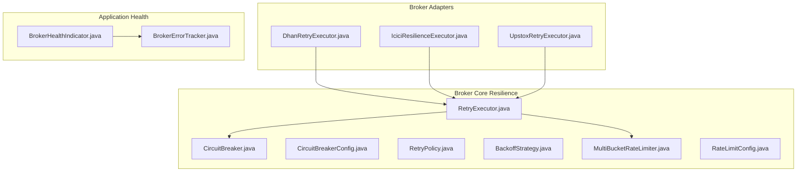
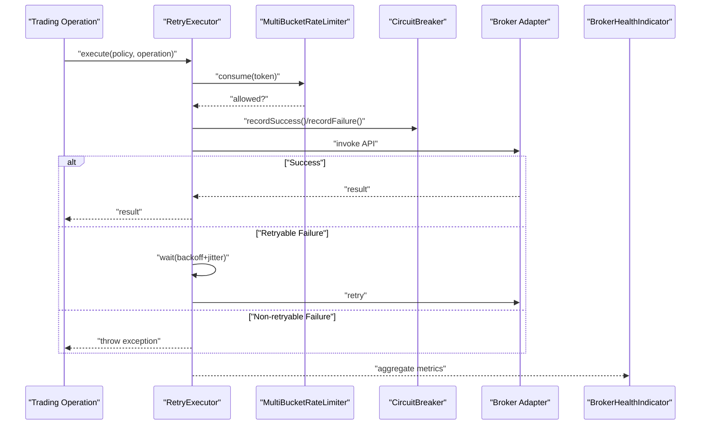
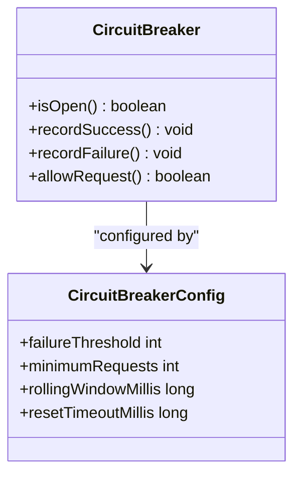
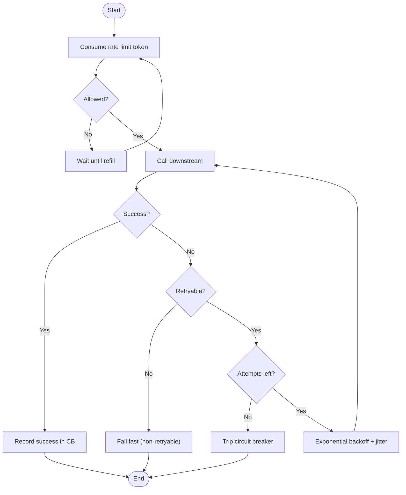
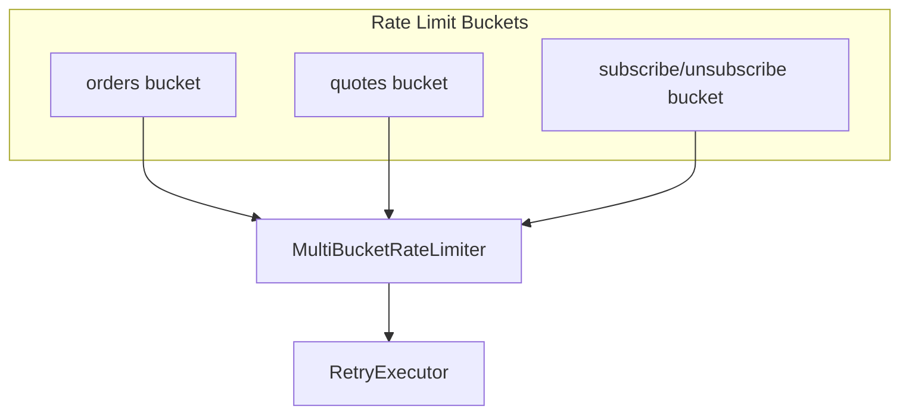
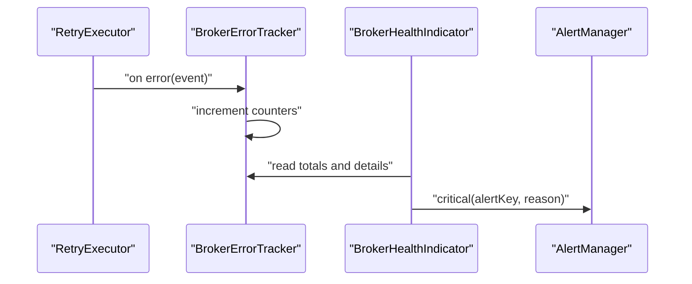
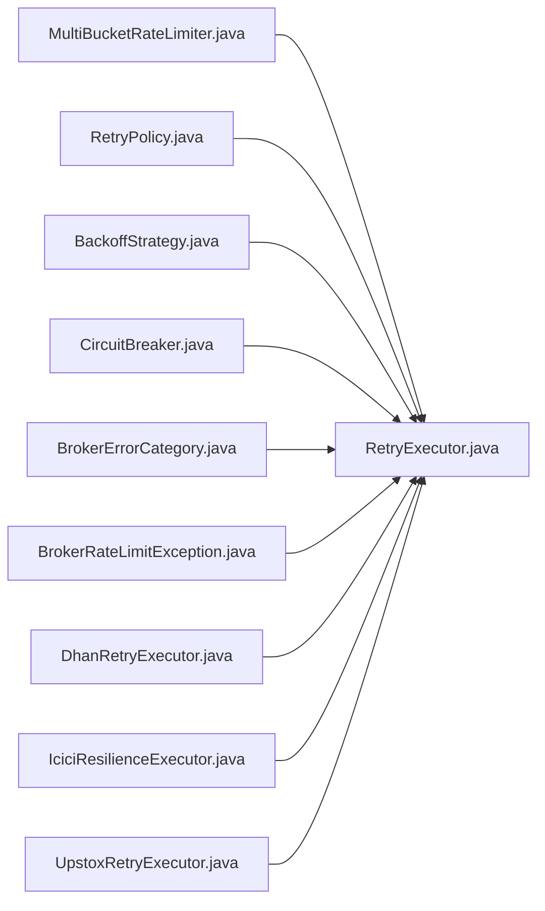

# Resilience Patterns

<cite>
**Referenced Files in This Document**
- [CircuitBreaker.java](file://broker/core/src/main/java/com/tradej/broker/core/resilience/CircuitBreaker.java)
- [CircuitBreakerConfig.java](file://broker/core/src/main/java/com/tradej/broker/core/resilience/CircuitBreakerConfig.java)
- [RetryExecutor.java](file://broker/core/src/main/java/com/tradej/broker/core/resilience/RetryExecutor.java)
- [RetryPolicy.java](file://broker/core/src/main/java/com/tradej/broker/core/resilience/RetryPolicy.java)
- [BackoffStrategy.java](file://broker/core/src/main/java/com/tradej/broker/core/resilience/BackoffStrategy.java)
- [BrokerErrorCategory.java](file://broker/api/src/main/java/com/tradej/broker/api/resilience/BrokerErrorCategory.java)
- [BrokerRateLimitException.java](file://broker/api/src/main/java/com/tradej/broker/api/exceptions/BrokerRateLimitException.java)
- [DhanRetryExecutor.java](file://broker/dhan/src/main/java/com/tradej/broker/dhan/resilience/DhanRetryExecutor.java)
- [IciciResilienceExecutor.java](file://broker/icici/src/main/java/com/tradej/broker/icici/resilience/IciciResilienceExecutor.java)
- [UpstoxRetryExecutor.java](file://broker/upstox/src/main/java/com/tradej/broker/upstox/resilience/UpstoxRetryExecutor.java)
- [BrokerErrorTracker.java](file://app/src/main/java/com/tradej/app/health/BrokerErrorTracker.java)
- [BrokerHealthIndicator.java](file://app/src/main/java/com/tradej/app/health/BrokerHealthIndicator.java)
- [MultiBucketRateLimiter.java](file://broker/core/src/main/java/com/tradej/broker/core/rate/MultiBucketRateLimiter.java)
- [RateLimitConfig.java](file://broker/core/src/main/java/com/tradej/broker/core/rate/RateLimitConfig.java)
- [CircuitBreakerBenchmark.java](file://broker/core/src/jmh/java/com/tradej/broker/core/benchmark/CircuitBreakerBenchmark.java)
</cite>

## Table of Contents
1. [Introduction](#introduction)
2. [Project Structure](#project-structure)
3. [Core Components](#core-components)
4. [Architecture Overview](#architecture-overview)
5. [Detailed Component Analysis](#detailed-component-analysis)
6. [Dependency Analysis](#dependency-analysis)
7. [Performance Considerations](#performance-considerations)
8. [Troubleshooting Guide](#troubleshooting-guide)
9. [Conclusion](#conclusion)

## Introduction
This document explains the resilience patterns implemented across the trading system, focusing on circuit breakers for broker failure handling, rate limiting, retry policies with exponential backoff and jitter, and bulkhead isolation strategies. It also covers monitoring, alerting, graceful degradation, and practical configuration examples for different broker adapters.

## Project Structure
The resilience implementation is primarily located under the broker core module with specialized executors per broker adapter. Health monitoring and alerting are integrated into the application layer.

**Diagram sources**
- [CircuitBreaker.java](file://broker/core/src/main/java/com/tradej/broker/core/resilience/CircuitBreaker.java)
- [CircuitBreakerConfig.java](file://broker/core/src/main/java/com/tradej/broker/core/resilience/CircuitBreakerConfig.java)
- [RetryExecutor.java](file://broker/core/src/main/java/com/tradej/broker/core/resilience/RetryExecutor.java)
- [RetryPolicy.java](file://broker/core/src/main/java/com/tradej/broker/core/resilience/RetryPolicy.java)
- [BackoffStrategy.java](file://broker/core/src/main/java/com/tradej/broker/core/resilience/BackoffStrategy.java)
- [MultiBucketRateLimiter.java](file://broker/core/src/main/java/com/tradej/broker/core/rate/MultiBucketRateLimiter.java)
- [RateLimitConfig.java](file://broker/core/src/main/java/com/tradej/broker/core/rate/RateLimitConfig.java)
- [DhanRetryExecutor.java](file://broker/dhan/src/main/java/com/tradej/broker/dhan/resilience/DhanRetryExecutor.java)
- [IciciResilienceExecutor.java](file://broker/icici/src/main/java/com/tradej/broker/icici/resilience/IciciResilienceExecutor.java)
- [UpstoxRetryExecutor.java](file://broker/upstox/src/main/java/com/tradej/broker/upstox/resilience/UpstoxRetryExecutor.java)
- [BrokerErrorTracker.java](file://app/src/main/java/com/tradej/app/health/BrokerErrorTracker.java)
- [BrokerHealthIndicator.java](file://app/src/main/java/com/tradej/app/health/BrokerHealthIndicator.java)

**Section sources**
- [CircuitBreaker.java](file://broker/core/src/main/java/com/tradej/broker/core/resilience/CircuitBreaker.java)
- [RetryExecutor.java](file://broker/core/src/main/java/com/tradej/broker/core/resilience/RetryExecutor.java)
- [DhanRetryExecutor.java](file://broker/dhan/src/main/java/com/tradej/broker/dhan/resilience/DhanRetryExecutor.java)
- [IciciResilienceExecutor.java](file://broker/icici/src/main/java/com/tradej/broker/icici/resilience/IciciResilienceExecutor.java)
- [UpstoxRetryExecutor.java](file://broker/upstox/src/main/java/com/tradej/broker/upstox/resilience/UpstoxRetryExecutor.java)
- [BrokerErrorTracker.java](file://app/src/main/java/com/tradej/app/health/BrokerErrorTracker.java)
- [BrokerHealthIndicator.java](file://app/src/main/java/com/tradej/app/health/BrokerHealthIndicator.java)

## Core Components
- Circuit Breaker: Prevents cascading failures by tripping when consecutive failures exceed thresholds, allowing recovery windows before permitting requests again.
- Retry Executor: Orchestrates retries with configurable policies, backoff strategies, jitter, and rate-limit checks.
- Retry Policy: Defines max attempts, base and max delays, jitter bounds, and global timeout.
- Backoff Strategy: Implements exponential backoff with jitter to smooth retry load.
- Rate Limiting: Multi-bucket limiter enforces per-endpoint and global limits to avoid overload.
- Broker Executors: Adapter-specific wrappers around the shared retry/circuit breaker logic.

**Section sources**
- [CircuitBreaker.java](file://broker/core/src/main/java/com/tradej/broker/core/resilience/CircuitBreaker.java)
- [RetryExecutor.java](file://broker/core/src/main/java/com/tradej/broker/core/resilience/RetryExecutor.java)
- [RetryPolicy.java](file://broker/core/src/main/java/com/tradej/broker/core/resilience/RetryPolicy.java)
- [BackoffStrategy.java](file://broker/core/src/main/java/com/tradej/broker/core/resilience/BackoffStrategy.java)
- [MultiBucketRateLimiter.java](file://broker/core/src/main/java/com/tradej/broker/core/rate/MultiBucketRateLimiter.java)
- [RateLimitConfig.java](file://broker/core/src/main/java/com/tradej/broker/core/rate/RateLimitConfig.java)

## Architecture Overview
The resilience stack coordinates retries, rate limits, and circuit breaking across broker adapters. Health monitoring aggregates errors and triggers alerts when the system degrades.

**Diagram sources**
- [RetryExecutor.java](file://broker/core/src/main/java/com/tradej/broker/core/resilience/RetryExecutor.java)
- [MultiBucketRateLimiter.java](file://broker/core/src/main/java/com/tradej/broker/core/rate/MultiBucketRateLimiter.java)
- [CircuitBreaker.java](file://broker/core/src/main/java/com/tradej/broker/core/resilience/CircuitBreaker.java)
- [BrokerHealthIndicator.java](file://app/src/main/java/com/tradej/app/health/BrokerHealthIndicator.java)

## Detailed Component Analysis

### Circuit Breaker Pattern
The circuit breaker monitors failure rates and temporarily disables calls to failing downstream systems, allowing them to recover. It supports configurable thresholds and recovery windows.

**Diagram sources**
- [CircuitBreaker.java](file://broker/core/src/main/java/com/tradej/broker/core/resilience/CircuitBreaker.java)
- [CircuitBreakerConfig.java](file://broker/core/src/main/java/com/tradej/broker/core/resilience/CircuitBreakerConfig.java)

**Section sources**
- [CircuitBreaker.java](file://broker/core/src/main/java/com/tradej/broker/core/resilience/CircuitBreaker.java)
- [CircuitBreakerConfig.java](file://broker/core/src/main/java/com/tradej/broker/core/resilience/CircuitBreakerConfig.java)

### Retry Policies with Exponential Backoff and Jitter
The retry executor applies exponential backoff with jitter and respects rate limits. It distinguishes retryable vs non-retryable failures and fails fast for unrecoverable errors.

**Diagram sources**
- [RetryExecutor.java](file://broker/core/src/main/java/com/tradej/broker/core/resilience/RetryExecutor.java)
- [RetryPolicy.java](file://broker/core/src/main/java/com/tradej/broker/core/resilience/RetryPolicy.java)
- [BackoffStrategy.java](file://broker/core/src/main/java/com/tradej/broker/core/resilience/BackoffStrategy.java)
- [MultiBucketRateLimiter.java](file://broker/core/src/main/java/com/tradej/broker/core/rate/MultiBucketRateLimiter.java)

**Section sources**
- [RetryExecutor.java](file://broker/core/src/main/java/com/tradej/broker/core/resilience/RetryExecutor.java)
- [RetryPolicy.java](file://broker/core/src/main/java/com/tradej/broker/core/resilience/RetryPolicy.java)
- [BackoffStrategy.java](file://broker/core/src/main/java/com/tradej/broker/core/resilience/BackoffStrategy.java)
- [MultiBucketRateLimiter.java](file://broker/core/src/main/java/com/tradej/broker/core/rate/MultiBucketRateLimiter.java)

### Bulkhead Pattern for Isolation
Bulkheads isolate critical operations to prevent resource exhaustion from spillover. The system achieves this by:
- Segmenting rate limit buckets per operation type (e.g., orders, quotes).
- Using separate thread pools or bounded concurrency per broker adapter.
- Enforcing per-operation and global rate limits to avoid overwhelming a single endpoint.

**Diagram sources**
- [MultiBucketRateLimiter.java](file://broker/core/src/main/java/com/tradej/broker/core/rate/MultiBucketRateLimiter.java)
- [RateLimitConfig.java](file://broker/core/src/main/java/com/tradej/broker/core/rate/RateLimitConfig.java)
- [RetryExecutor.java](file://broker/core/src/main/java/com/tradej/broker/core/resilience/RetryExecutor.java)

**Section sources**
- [MultiBucketRateLimiter.java](file://broker/core/src/main/java/com/tradej/broker/core/rate/MultiBucketRateLimiter.java)
- [RateLimitConfig.java](file://broker/core/src/main/java/com/tradej/broker/core/rate/RateLimitConfig.java)

### Graceful Degradation Strategies
Graceful degradation ensures the system continues operating at reduced capacity during partial outages:
- Circuit breaker trips to stop sending failing requests.
- Rate limiter throttles traffic to protect downstream systems.
- Health indicator surfaces degraded state to operators.
- Broker adapters can switch to cached data or reduced functionality when appropriate.

**Section sources**
- [CircuitBreaker.java](file://broker/core/src/main/java/com/tradej/broker/core/resilience/CircuitBreaker.java)
- [BrokerHealthIndicator.java](file://app/src/main/java/com/tradej/app/health/BrokerHealthIndicator.java)

### Monitoring, Alerting, and Observability
Monitoring tracks error counts, categorizes failures, and exposes health via Spring Boot Actuator. Alerts are triggered when the system is down or degraded.

**Diagram sources**
- [BrokerErrorTracker.java](file://app/src/main/java/com/tradej/app/health/BrokerErrorTracker.java)
- [BrokerHealthIndicator.java](file://app/src/main/java/com/tradej/app/health/BrokerHealthIndicator.java)

**Section sources**
- [BrokerErrorTracker.java](file://app/src/main/java/com/tradej/app/health/BrokerErrorTracker.java)
- [BrokerHealthIndicator.java](file://app/src/main/java/com/tradej/app/health/BrokerHealthIndicator.java)

### Broker Adapter Resilience Configurations
Each broker adapter wraps the shared retry/circuit breaker logic with adapter-specific tuning. Typical configuration areas include:
- Retry policy: max attempts, base/max delays, jitter, and global timeout.
- Rate limits: per-endpoint and global caps aligned with broker SLAs.
- Circuit breaker: failure threshold, minimum requests, rolling window, reset timeout.
- Graceful degradation: fallback behavior for subscriptions, streaming, and order placement.

Examples of adapter-specific executors:
- Dhan: [DhanRetryExecutor.java](file://broker/dhan/src/main/java/com/tradej/broker/dhan/resilience/DhanRetryExecutor.java)
- ICICI: [IciciResilienceExecutor.java](file://broker/icici/src/main/java/com/tradej/broker/icici/resilience/IciciResilienceExecutor.java)
- Upstox: [UpstoxRetryExecutor.java](file://broker/upstox/src/main/java/com/tradej/broker/upstox/resilience/UpstoxRetryExecutor.java)

**Section sources**
- [DhanRetryExecutor.java](file://broker/dhan/src/main/java/com/tradej/broker/dhan/resilience/DhanRetryExecutor.java)
- [IciciResilienceExecutor.java](file://broker/icici/src/main/java/com/tradej/broker/icici/resilience/IciciResilienceExecutor.java)
- [UpstoxRetryExecutor.java](file://broker/upstox/src/main/java/com/tradej/broker/upstox/resilience/UpstoxRetryExecutor.java)

## Dependency Analysis
The resilience components depend on each other in a layered manner, with rate limiting and circuit breaking informing retry decisions.

**Diagram sources**
- [MultiBucketRateLimiter.java](file://broker/core/src/main/java/com/tradej/broker/core/rate/MultiBucketRateLimiter.java)
- [RetryExecutor.java](file://broker/core/src/main/java/com/tradej/broker/core/resilience/RetryExecutor.java)
- [RetryPolicy.java](file://broker/core/src/main/java/com/tradej/broker/core/resilience/RetryPolicy.java)
- [BackoffStrategy.java](file://broker/core/src/main/java/com/tradej/broker/core/resilience/BackoffStrategy.java)
- [CircuitBreaker.java](file://broker/core/src/main/java/com/tradej/broker/core/resilience/CircuitBreaker.java)
- [BrokerErrorCategory.java](file://broker/api/src/main/java/com/tradej/broker/api/resilience/BrokerErrorCategory.java)
- [BrokerRateLimitException.java](file://broker/api/src/main/java/com/tradej/broker/api/exceptions/BrokerRateLimitException.java)
- [DhanRetryExecutor.java](file://broker/dhan/src/main/java/com/tradej/broker/dhan/resilience/DhanRetryExecutor.java)
- [IciciResilienceExecutor.java](file://broker/icici/src/main/java/com/tradej/broker/icici/resilience/IciciResilienceExecutor.java)
- [UpstoxRetryExecutor.java](file://broker/upstox/src/main/java/com/tradej/broker/upstox/resilience/UpstoxRetryExecutor.java)

**Section sources**
- [RetryExecutor.java](file://broker/core/src/main/java/com/tradej/broker/core/resilience/RetryExecutor.java)
- [CircuitBreaker.java](file://broker/core/src/main/java/com/tradej/broker/core/resilience/CircuitBreaker.java)
- [MultiBucketRateLimiter.java](file://broker/core/src/main/java/com/tradej/broker/core/rate/MultiBucketRateLimiter.java)

## Performance Considerations
- Benchmarking: Circuit breaker performance characteristics are measured using dedicated benchmarks.
- Backoff and jitter reduce thundering herd effects and improve throughput stability.
- Rate limiting prevents overload and reduces tail latency spikes.
- Bulkheads ensure critical operations maintain responsiveness under stress.

**Section sources**
- [CircuitBreakerBenchmark.java](file://broker/core/src/jmh/java/com/tradej/broker/core/benchmark/CircuitBreakerBenchmark.java)

## Troubleshooting Guide
Common issues and diagnostics:
- Frequent 429/Too Many Requests: Indicates rate limit exceeded; review per-endpoint and global quotas and adjust retry/backoff policies.
- Circuit breaker open: Investigate recent failures and monitor recovery windows; ensure adequate reset timeouts.
- Non-retryable errors: Validate request correctness and handle category-specific exceptions.
- Health degradation: Check error counts, last error details, and WebSocket connectivity via health indicators.

Operational actions:
- Inspect health endpoint details for error counts and last error metadata.
- Temporarily increase retry attempts or backoff windows for transient failures.
- Reduce rate limit quotas for problematic endpoints to stabilize performance.

**Section sources**
- [BrokerHealthIndicator.java](file://app/src/main/java/com/tradej/app/health/BrokerHealthIndicator.java)
- [BrokerErrorTracker.java](file://app/src/main/java/com/tradej/app/health/BrokerErrorTracker.java)
- [BrokerRateLimitException.java](file://broker/api/src/main/java/com/tradej/broker/api/exceptions/BrokerRateLimitException.java)
- [BrokerErrorCategory.java](file://broker/api/src/main/java/com/tradej/broker/api/resilience/BrokerErrorCategory.java)

## Conclusion
The system combines circuit breakers, retry policies with exponential backoff and jitter, rate limiting, and bulkhead isolation to achieve robust fault tolerance. Monitoring and alerting provide visibility into system health, while graceful degradation ensures continued operation under partial failure. Broker adapters apply these patterns with adapter-specific configurations to maintain reliability across diverse broker environments.