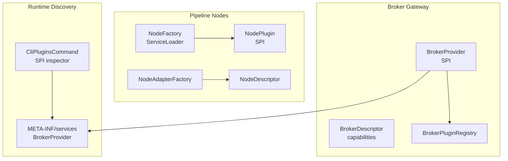
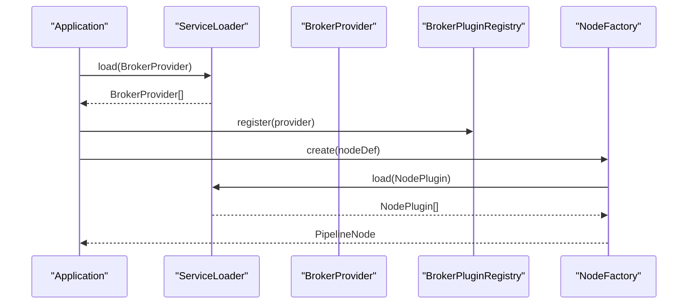
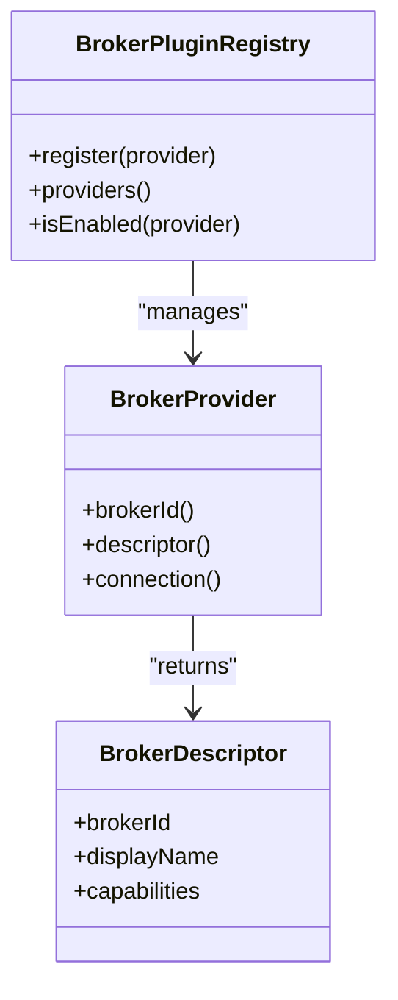
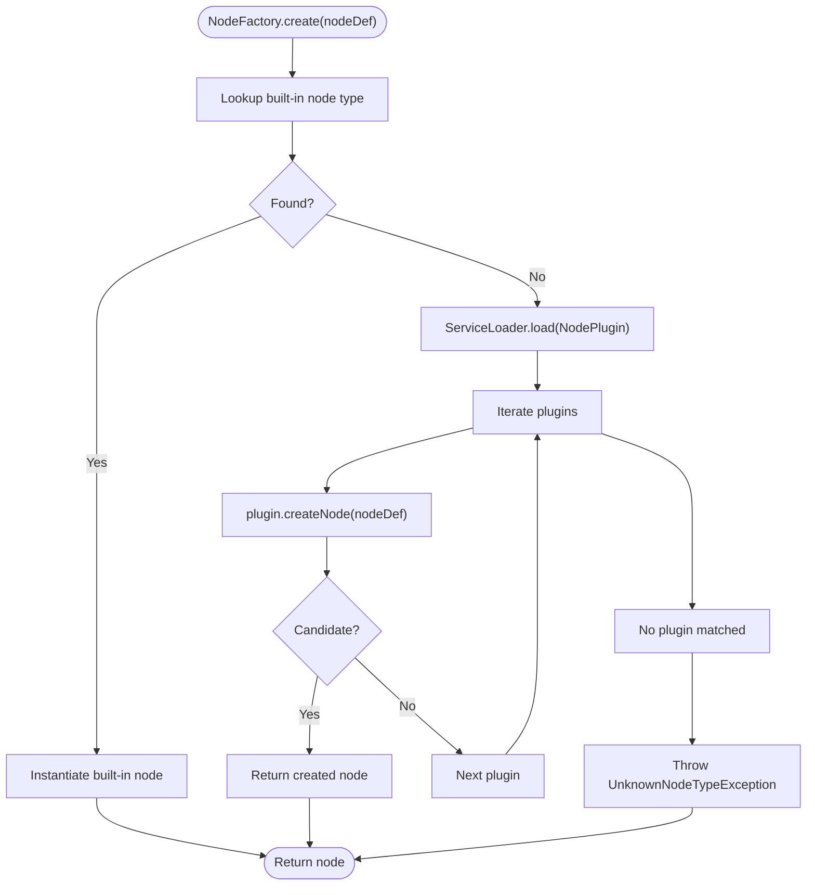
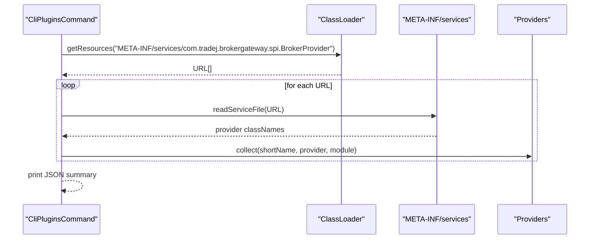
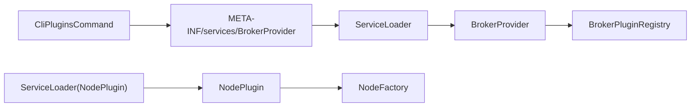

# SPI and Plugin Architecture

<cite>
**Referenced Files in This Document**
- [BrokerProvider.java](file://broker-gateway/src/main/java/com/tradej/brokergateway/spi/BrokerProvider.java)
- [BrokerDescriptor.java](file://broker-gateway/src/main/java/com/tradej/brokergateway/spi/BrokerDescriptor.java)
- [BrokerPluginRegistry.java](file://broker-gateway/src/main/java/com/tradej/brokergateway/spi/BrokerPluginRegistry.java)
- [com.tradej.brokergateway.spi.BrokerProvider](file://broker-gateway/src/main/resources/META-INF/services/com.tradej.brokergateway.spi.BrokerProvider)
- [NodeFactory.java](file://docs/archive/ARCHITECTURE_EVOLUTION_PIPELINE_OS.md)
- [NodePlugin.java](file://docs/archive/ARCHITECTURE_EVOLUTION_PIPELINE_OS.md)
- [NodeDescriptor.java](file://nodes/trade-node-library/src/main/java/com/tradej/node/NodeDescriptor.java)
- [NodeAdapterFactory.java](file://nodes/trade-node-library/src/main/java/com/tradej/node/adapter/NodeAdapterFactory.java)
- [CliPluginsCommand.java](file://cli/src/main/java/com/tradej/cli/command/CliPluginsCommand.java)
- [BROKER_GATEWAY_ARCHITECTURE_REVIEW.md](file://docs/BROKER_GATEWAY_ARCHITECTURE_REVIEW.md)
</cite>

## Table of Contents
1. [Introduction](#introduction)
2. [Project Structure](#project-structure)
3. [Core Components](#core-components)
4. [Architecture Overview](#architecture-overview)
5. [Detailed Component Analysis](#detailed-component-analysis)
6. [Dependency Analysis](#dependency-analysis)
7. [Performance Considerations](#performance-considerations)
8. [Troubleshooting Guide](#troubleshooting-guide)
9. [Conclusion](#conclusion)
10. [Appendices](#appendices)

## Introduction
This document explains the Service Provider Interface (SPI) and plugin architecture used to achieve modularity and extensibility across brokers and pipeline nodes. It focuses on:
- How the broker provider SPI enables dynamic broker registration and discovery
- The node plugin system for custom pipeline components
- The META-INF/services configuration and runtime loading
- Examples of implementing custom broker providers and node descriptors
- Benefits for modularity, extensibility, and loose coupling
- Plugin lifecycle, dependency injection, and error handling considerations

## Project Structure
The plugin architecture spans several modules:
- Broker gateway SPI and registry for broker providers
- Node library with self-describing node descriptors and adapters
- CLI tooling to inspect discovered SPI providers
- Documentation that outlines current capabilities and future enhancements

**Diagram sources**
- [BrokerProvider.java](file://broker-gateway/src/main/java/com/tradej/brokergateway/spi/BrokerProvider.java)
- [BrokerDescriptor.java](file://broker-gateway/src/main/java/com/tradej/brokergateway/spi/BrokerDescriptor.java)
- [BrokerPluginRegistry.java](file://broker-gateway/src/main/java/com/tradej/brokergateway/spi/BrokerPluginRegistry.java)
- [com.tradej.brokergateway.spi.BrokerProvider](file://broker-gateway/src/main/resources/META-INF/services/com.tradej.brokergateway.spi.BrokerProvider)
- [NodeFactory.java](file://docs/archive/ARCHITECTURE_EVOLUTION_PIPELINE_OS.md)
- [NodePlugin.java](file://docs/archive/ARCHITECTURE_EVOLUTION_PIPELINE_OS.md)
- [NodeDescriptor.java](file://nodes/trade-node-library/src/main/java/com/tradej/node/NodeDescriptor.java)
- [NodeAdapterFactory.java](file://nodes/trade-node-library/src/main/java/com/tradej/node/adapter/NodeAdapterFactory.java)
- [CliPluginsCommand.java](file://cli/src/main/java/com/tradej/cli/command/CliPluginsCommand.java)

**Section sources**
- [BrokerProvider.java](file://broker-gateway/src/main/java/com/tradej/brokergateway/spi/BrokerProvider.java)
- [BrokerDescriptor.java](file://broker-gateway/src/main/java/com/tradej/brokergateway/spi/BrokerDescriptor.java)
- [BrokerPluginRegistry.java](file://broker-gateway/src/main/java/com/tradej/brokergateway/spi/BrokerPluginRegistry.java)
- [com.tradej.brokergateway.spi.BrokerProvider](file://broker-gateway/src/main/resources/META-INF/services/com.tradej.brokergateway.spi.BrokerProvider)
- [NodeFactory.java](file://docs/archive/ARCHITECTURE_EVOLUTION_PIPELINE_OS.md)
- [NodePlugin.java](file://docs/archive/ARCHITECTURE_EVOLUTION_PIPELINE_OS.md)
- [NodeDescriptor.java](file://nodes/trade-node-library/src/main/java/com/tradej/node/NodeDescriptor.java)
- [NodeAdapterFactory.java](file://nodes/trade-node-library/src/main/java/com/tradej/node/adapter/NodeAdapterFactory.java)
- [CliPluginsCommand.java](file://cli/src/main/java/com/tradej/cli/command/CliPluginsCommand.java)
- [BROKER_GATEWAY_ARCHITECTURE_REVIEW.md](file://docs/BROKER_GATEWAY_ARCHITECTURE_REVIEW.md)

## Core Components
- Broker provider SPI: Defines how broker implementations register capabilities and are discovered at runtime.
- Broker descriptor: Encapsulates broker metadata and capability declarations.
- Broker plugin registry: Manages broker provider instances and lifecycle hooks.
- Node factory and node plugins: Enable dynamic creation of pipeline nodes via ServiceLoader.
- Node descriptor: Self-describing contract for node types, enabling UI-driven configuration.
- CLI SPI inspector: Enumerates discovered SPI providers from META-INF/services.

Benefits:
- Modularity: Broker and node implementations are decoupled from core.
- Extensibility: New providers and nodes can be added without modifying core code.
- Loose coupling: Consumers depend on interfaces and descriptors, not concrete implementations.

**Section sources**
- [BrokerProvider.java](file://broker-gateway/src/main/java/com/tradej/brokergateway/spi/BrokerProvider.java)
- [BrokerDescriptor.java](file://broker-gateway/src/main/java/com/tradej/brokergateway/spi/BrokerDescriptor.java)
- [BrokerPluginRegistry.java](file://broker-gateway/src/main/java/com/tradej/brokergateway/spi/BrokerPluginRegistry.java)
- [NodeFactory.java](file://docs/archive/ARCHITECTURE_EVOLUTION_PIPELINE_OS.md)
- [NodeDescriptor.java](file://nodes/trade-node-library/src/main/java/com/tradej/node/NodeDescriptor.java)
- [CliPluginsCommand.java](file://cli/src/main/java/com/tradej/cli/command/CliPluginsCommand.java)
- [BROKER_GATEWAY_ARCHITECTURE_REVIEW.md](file://docs/BROKER_GATEWAY_ARCHITECTURE_REVIEW.md)

## Architecture Overview
The SPI architecture separates concerns between discovery, registration, and runtime instantiation:
- Providers register via META-INF/services
- The runtime loads providers using ServiceLoader
- Descriptors define capabilities and metadata
- Factories instantiate nodes dynamically

**Diagram sources**
- [BrokerProvider.java](file://broker-gateway/src/main/java/com/tradej/brokergateway/spi/BrokerProvider.java)
- [BrokerPluginRegistry.java](file://broker-gateway/src/main/java/com/tradej/brokergateway/spi/BrokerPluginRegistry.java)
- [NodeFactory.java](file://docs/archive/ARCHITECTURE_EVOLUTION_PIPELINE_OS.md)

## Detailed Component Analysis

### Broker Provider SPI and Discovery
- BrokerProvider defines the contract for broker implementations to expose capabilities and metadata.
- BrokerDescriptor encapsulates broker identity, display info, and capability map keyed by port interface names.
- BrokerPluginRegistry manages provider registration and lifecycle hooks (e.g., isEnabled checks).
- META-INF/services/com.tradej.brokergateway.spi.BrokerProvider lists provider implementations for discovery.

Implementation pattern:
- Implement BrokerProvider in a separate module
- Add provider FQCN to META-INF/services/com.tradej.brokergateway.spi.BrokerProvider
- At runtime, ServiceLoader enumerates providers and BrokerPluginRegistry registers them

**Diagram sources**
- [BrokerProvider.java](file://broker-gateway/src/main/java/com/tradej/brokergateway/spi/BrokerProvider.java)
- [BrokerDescriptor.java](file://broker-gateway/src/main/java/com/tradej/brokergateway/spi/BrokerDescriptor.java)
- [BrokerPluginRegistry.java](file://broker-gateway/src/main/java/com/tradej/brokergateway/spi/BrokerPluginRegistry.java)

**Section sources**
- [BrokerProvider.java](file://broker-gateway/src/main/java/com/tradej/brokergateway/spi/BrokerProvider.java)
- [BrokerDescriptor.java](file://broker-gateway/src/main/java/com/tradej/brokergateway/spi/BrokerDescriptor.java)
- [BrokerPluginRegistry.java](file://broker-gateway/src/main/java/com/tradej/brokergateway/spi/BrokerPluginRegistry.java)
- [com.tradej.brokergateway.spi.BrokerProvider](file://broker-gateway/src/main/resources/META-INF/services/com.tradej.brokergateway.spi.BrokerProvider)

### Node Plugin System for Custom Pipeline Components
- NodeFactory uses ServiceLoader to discover NodePlugin implementations and dynamically create nodes.
- NodeDescriptor describes node types, ports, properties, and metadata for UI rendering and validation.
- NodeAdapterFactory adapts existing BasePipelineNode instances to NodeExecutor using a NodeDescriptor.

Key behaviors:
- Built-in node types are mapped statically; unknown types are resolved via ServiceLoader
- NodeDescriptor enforces non-null fields and immutability for properties, ports, and metadata
- NodeAdapterFactory initializes nodes, routes events, collects outputs, and cleans up

**Diagram sources**
- [NodeFactory.java](file://docs/archive/ARCHITECTURE_EVOLUTION_PIPELINE_OS.md)
- [NodeDescriptor.java](file://nodes/trade-node-library/src/main/java/com/tradej/node/NodeDescriptor.java)
- [NodeAdapterFactory.java](file://nodes/trade-node-library/src/main/java/com/tradej/node/adapter/NodeAdapterFactory.java)

**Section sources**
- [NodeFactory.java](file://docs/archive/ARCHITECTURE_EVOLUTION_PIPELINE_OS.md)
- [NodeDescriptor.java](file://nodes/trade-node-library/src/main/java/com/tradej/node/NodeDescriptor.java)
- [NodeAdapterFactory.java](file://nodes/trade-node-library/src/main/java/com/tradej/node/adapter/NodeAdapterFactory.java)

### META-INF/services Configuration and Runtime Loading
- Each SPI interface has a corresponding entry under META-INF/services/<fully-qualified-SPI-name>
- The CLI command CliPluginsCommand enumerates these entries and prints discovered providers
- The discovery process reads resource URLs and infers the module origin

**Diagram sources**
- [CliPluginsCommand.java](file://cli/src/main/java/com/tradej/cli/command/CliPluginsCommand.java)
- [com.tradej.brokergateway.spi.BrokerProvider](file://broker-gateway/src/main/resources/META-INF/services/com.tradej.brokergateway.spi.BrokerProvider)

**Section sources**
- [CliPluginsCommand.java](file://cli/src/main/java/com/tradej/cli/command/CliPluginsCommand.java)
- [com.tradej.brokergateway.spi.BrokerProvider](file://broker-gateway/src/main/resources/META-INF/services/com.tradej.brokergateway.spi.BrokerProvider)

### Implementing a Custom Broker Provider
Steps:
1. Implement BrokerProvider in your module
2. Add your provider’s fully qualified class name to META-INF/services/com.tradej.brokergateway.spi.BrokerProvider
3. Optionally implement capability-specific port interfaces and register them in BrokerDescriptor.capabilities
4. Ensure isEnabled logic reflects runtime conditions (e.g., credentials availability)
5. Use BrokerPluginRegistry to manage lifecycle and health checks

Benefits:
- Dynamic registration without core changes
- Capability-based exposure via descriptors
- Health and enablement checks at startup

**Section sources**
- [BrokerProvider.java](file://broker-gateway/src/main/java/com/tradej/brokergateway/spi/BrokerProvider.java)
- [BrokerDescriptor.java](file://broker-gateway/src/main/java/com/tradej/brokergateway/spi/BrokerDescriptor.java)
- [BrokerPluginRegistry.java](file://broker-gateway/src/main/java/com/tradej/brokergateway/spi/BrokerPluginRegistry.java)
- [com.tradej.brokergateway.spi.BrokerProvider](file://broker-gateway/src/main/resources/META-INF/services/com.tradej.brokergateway.spi.BrokerProvider)

### Implementing a Custom Node Descriptor
Steps:
1. Define a NodeDescriptor with nodeType, displayName, category, and port descriptors
2. Provide property descriptors for configurable parameters
3. Use NodeAdapterFactory to adapt existing BasePipelineNode implementations
4. Register custom nodes via NodePlugin SPI so NodeFactory can instantiate them

Benefits:
- Self-describing nodes enable UI-driven configuration
- Immutable descriptors prevent runtime corruption
- Adapters isolate legacy node implementations

**Section sources**
- [NodeDescriptor.java](file://nodes/trade-node-library/src/main/java/com/tradej/node/NodeDescriptor.java)
- [NodeAdapterFactory.java](file://nodes/trade-node-library/src/main/java/com/tradej/node/adapter/NodeAdapterFactory.java)
- [NodeFactory.java](file://docs/archive/ARCHITECTURE_EVOLUTION_PIPELINE_OS.md)

## Dependency Analysis
- Broker gateway depends on SPI providers registered via META-INF/services
- NodeFactory depends on NodePlugin SPI for dynamic node creation
- CLI depends on ServiceLoader discovery to enumerate providers
- BrokerPluginRegistry coordinates provider lifecycle and health checks

**Diagram sources**
- [com.tradej.brokergateway.spi.BrokerProvider](file://broker-gateway/src/main/resources/META-INF/services/com.tradej.brokergateway.spi.BrokerProvider)
- [BrokerProvider.java](file://broker-gateway/src/main/java/com/tradej/brokergateway/spi/BrokerProvider.java)
- [BrokerPluginRegistry.java](file://broker-gateway/src/main/java/com/tradej/brokergateway/spi/BrokerPluginRegistry.java)
- [NodeFactory.java](file://docs/archive/ARCHITECTURE_EVOLUTION_PIPELINE_OS.md)
- [CliPluginsCommand.java](file://cli/src/main/java/com/tradej/cli/command/CliPluginsCommand.java)

**Section sources**
- [BrokerProvider.java](file://broker-gateway/src/main/java/com/tradej/brokergateway/spi/BrokerProvider.java)
- [BrokerPluginRegistry.java](file://broker-gateway/src/main/java/com/tradej/brokergateway/spi/BrokerPluginRegistry.java)
- [NodeFactory.java](file://docs/archive/ARCHITECTURE_EVOLUTION_PIPELINE_OS.md)
- [CliPluginsCommand.java](file://cli/src/main/java/com/tradej/cli/command/CliPluginsCommand.java)

## Performance Considerations
- ServiceLoader discovery occurs at startup; avoid heavy initialization in providers
- Keep isEnabled checks lightweight to minimize startup latency
- Prefer lazy initialization for expensive resources inside nodes and providers
- Cache descriptor computations where appropriate (e.g., NodeAdapterFactory caches NodeDescriptor)

## Troubleshooting Guide
Common issues and resolutions:
- Provider not discovered
  - Verify META-INF/services entry contains the correct fully qualified class name
  - Confirm the provider class is packaged in the module JAR
  - Use CliPluginsCommand to enumerate discovered providers and confirm presence
- Unknown node type
  - Ensure NodePlugin SPI is implemented and registered
  - Confirm NodeDescriptor nodeType matches the requested type
- Lifecycle and health
  - Implement isEnabled in BrokerProvider to reflect runtime readiness
  - Consider adding health checks and version fields as recommended for future enhancements

**Section sources**
- [CliPluginsCommand.java](file://cli/src/main/java/com/tradej/cli/command/CliPluginsCommand.java)
- [NodeFactory.java](file://docs/archive/ARCHITECTURE_EVOLUTION_PIPELINE_OS.md)
- [BROKER_GATEWAY_ARCHITECTURE_REVIEW.md](file://docs/BROKER_GATEWAY_ARCHITECTURE_REVIEW.md)

## Conclusion
The SPI and plugin architecture delivers strong modularity and extensibility:
- Broker providers integrate seamlessly via META-INF/services and BrokerPluginRegistry
- Node plugins enable dynamic pipeline composition through NodeFactory and NodePlugin
- Self-describing NodeDescriptor and BrokerDescriptor improve discoverability and maintainability
- CLI tooling supports inspection and validation of plugin configurations

Future enhancements outlined in the architecture review can further strengthen lifecycle management, health monitoring, and runtime plugin management.

## Appendices

### Best Practices for Plugin Authors
- Keep provider initialization fast and deterministic
- Use BrokerDescriptor to clearly declare capabilities and metadata
- Implement NodeDescriptor with accurate port and property definitions
- Provide meaningful isEnabled checks and consider health endpoints
- Avoid hardcoding internal dependencies; favor dependency injection where applicable

### Recommended Enhancements (from architecture review)
- Add capability registration to BrokerProvider for dynamic capability addition
- Introduce version fields for providers and descriptors
- Add plugin health check interfaces and configuration schemas
- Explore hot-reload mechanisms for runtime plugin management

**Section sources**
- [BROKER_GATEWAY_ARCHITECTURE_REVIEW.md](file://docs/BROKER_GATEWAY_ARCHITECTURE_REVIEW.md)