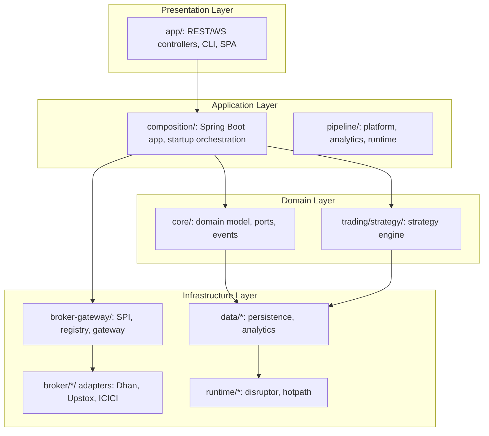
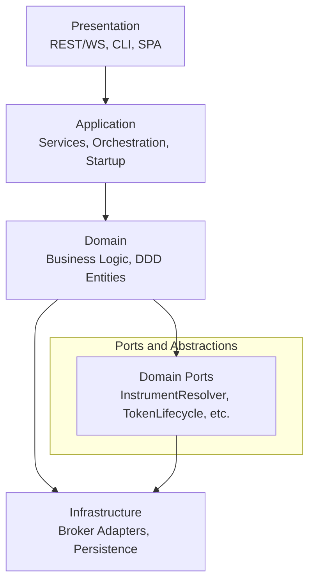
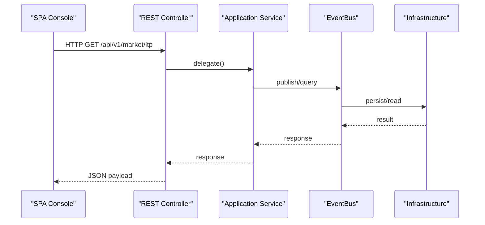
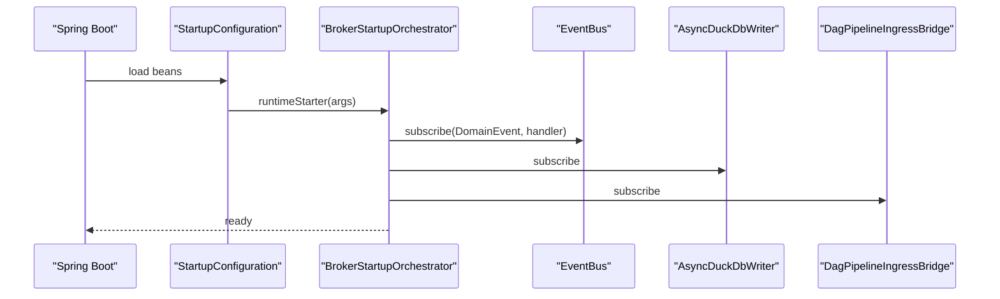
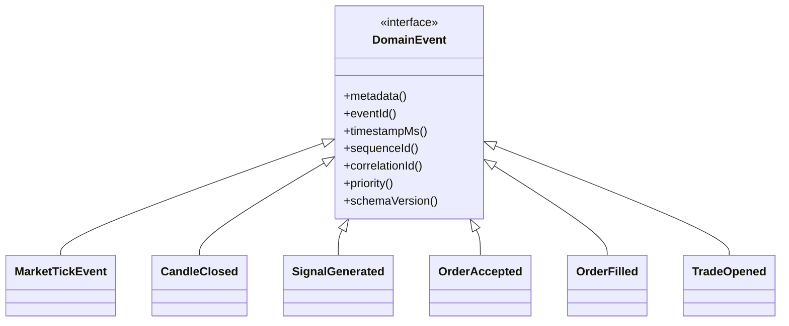
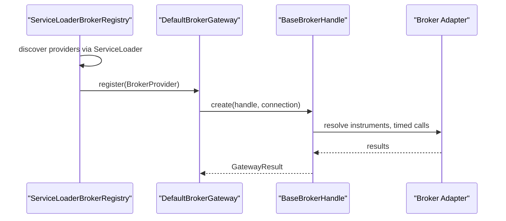
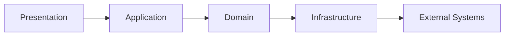

# Layered Architecture Design

<cite>
**Referenced Files in This Document**
- [ARCHITECTURE.md](file://ARCHITECTURE.md)
- [Trade-J-Architecture-Visual.html](file://docs/visuals/Trade-J-Architecture-Visual.html)
- [ARCHITECTURE_REPORT.md](file://docs/ARCHITECTURE_REPORT.md)
- [StartupConfiguration.java](file://app/src/main/java/com/tradej/app/config/StartupConfiguration.java)
- [BrokerStartupOrchestrator.java](file://app/src/main/java/com/tradej/app/startup/BrokerStartupOrchestrator.java)
- [BaseBrokerHandle.java](file://broker-gateway/src/main/java/com/tradej/brokergateway/BaseBrokerHandle.java)
- [DefaultBrokerGateway.java](file://broker-gateway/src/main/java/com/tradej/brokergateway/DefaultBrokerGateway.java)
- [ServiceLoaderBrokerRegistry.java](file://broker-gateway/src/main/java/com/tradej/brokergateway/spi/ServiceLoaderBrokerRegistry.java)
- [StrategyEngine.java](file://trading/strategy/src/main/java/com/tradej/strategy/service/StrategyEngine.java)
- [CodeQualityArchitectureTest.java](file://architecture-test/src/test/java/com/tradej/architecture/CodeQualityArchitectureTest.java)
- [DesignPatternArchitectureTest.java](file://architecture-test/src/test/java/com/tradej/architecture/DesignPatternArchitectureTest.java)
- [CliApiCommand.java](file://cli/src/main/java/com/tradej/cli/command/CliApiCommand.java)
- [FRONTEND_BACKEND_CONNECTION_TEST.md](file://FRONTEND_BACKEND_CONNECTION_TEST.md)
</cite>

## Table of Contents
1. [Introduction](#introduction)
2. [Project Structure](#project-structure)
3. [Core Components](#core-components)
4. [Architecture Overview](#architecture-overview)
5. [Detailed Component Analysis](#detailed-component-analysis)
6. [Dependency Analysis](#dependency-analysis)
7. [Performance Considerations](#performance-considerations)
8. [Troubleshooting Guide](#troubleshooting-guide)
9. [Conclusion](#conclusion)

## Introduction
This document explains the layered architecture design of the system, focusing on the four-layer model: Presentation, Application, Domain, and Infrastructure. It describes how responsibilities are distributed across layers, how they interact through well-defined interfaces, and how dependency directions prevent tight coupling. It also documents typical layer violations and how architecture tests enforce boundaries.

## Project Structure
The system is organized into modules grouped by layers and cross-cutting concerns:
- Presentation: REST/WS controllers, CLI, and SPA console
- Application: Services, orchestration, startup, and pipeline runtime
- Domain: Business logic, DDD entities, and strategy plugins
- Infrastructure: Broker adapters, persistence, and event bus runtime
- Cross-cutting: Resilience, routing, rate limiting, and architecture tests

**Diagram sources**
- [ARCHITECTURE.md:787-796](file://ARCHITECTURE.md#L787-L796)
- [StartupConfiguration.java:33-103](file://app/src/main/java/com/tradej/app/config/StartupConfiguration.java#L33-L103)
- [DefaultBrokerGateway.java:1-37](file://broker-gateway/src/main/java/com/tradej/brokergateway/DefaultBrokerGateway.java#L1-L37)

**Section sources**
- [ARCHITECTURE.md:787-796](file://ARCHITECTURE.md#L787-L796)
- [Trade-J-Architecture-Visual.html:108-173](file://docs/visuals/Trade-J-Architecture-Visual.html#L108-L173)

## Core Components
- Presentation Layer
  - REST/WS controllers in the application module expose HTTP and WebSocket endpoints for market data, scans, pipelines, studio, analytics, and admin functions.
  - CLI provides programmatic access to APIs and system operations.
  - SPA console integrates with the backend via REST and WebSocket.
- Application Layer
  - Startup orchestration coordinates broker lifecycle, pipelines, event buses, persistence, and read models.
  - Pipeline platform and analytics modules manage DAG pipelines and performance reporting.
- Domain Layer
  - Core domain defines events, ports, and DDD entities.
  - Strategy engine evaluates domain events through sandboxed plugins.
- Infrastructure Layer
  - Broker gateway provides SPI and registry for broker adapters.
  - Broker adapters integrate Dhan, Upstox, and ICICI.
  - Persistence and analytics modules implement event stores and DuckDB-backed storage.
  - Runtime modules provide event bus runtime (Disruptor) and hot-path processing.

**Section sources**
- [ARCHITECTURE.md:787-796](file://ARCHITECTURE.md#L787-L796)
- [StartupConfiguration.java:33-103](file://app/src/main/java/com/tradej/app/config/StartupConfiguration.java#L33-L103)
- [StrategyEngine.java:35-58](file://trading/strategy/src/main/java/com/tradej/strategy/service/StrategyEngine.java#L35-L58)
- [DefaultBrokerGateway.java:1-37](file://broker-gateway/src/main/java/com/tradej/brokergateway/DefaultBrokerGateway.java#L1-L37)

## Architecture Overview
The system follows a layered architecture with clear dependency directions:
- Presentation depends on Application
- Application depends on Domain
- Domain depends on Infrastructure (through ports and abstractions)
- Infrastructure depends on external systems (brokers, persistence)

**Diagram sources**
- [ARCHITECTURE.md:787-796](file://ARCHITECTURE.md#L787-L796)
- [BaseBrokerHandle.java:1-38](file://broker-gateway/src/main/java/com/tradej/brokergateway/BaseBrokerHandle.java#L1-L38)
- [DefaultBrokerGateway.java:1-37](file://broker-gateway/src/main/java/com/tradej/brokergateway/DefaultBrokerGateway.java#L1-L37)

## Detailed Component Analysis

### Presentation Layer
Responsibilities:
- Expose REST endpoints for market data, scanning, pipelines, studio, analytics, and admin operations.
- Provide WebSocket gateway for real-time topics.
- Offer CLI commands for introspection and operational tasks.
- Serve SPA console in production.

Key components and interactions:
- REST controllers categorized by domain area (orders, market data, options, analytics, scanner, backtest, replay, pipeline, admin).
- WebSocket gateway routes binary protocol messages to subscribed topics.
- CLI API command scans Spring controllers and prints endpoint metadata.

**Diagram sources**
- [ARCHITECTURE_REPORT.md:1653-1671](file://docs/ARCHITECTURE_REPORT.md#L1653-L1671)
- [FRONTEND_BACKEND_CONNECTION_TEST.md:405-450](file://FRONTEND_BACKEND_CONNECTION_TEST.md#L405-L450)

**Section sources**
- [ARCHITECTURE_REPORT.md:1653-1671](file://docs/ARCHITECTURE_REPORT.md#L1653-L1671)
- [CliApiCommand.java:20-76](file://cli/src/main/java/com/tradej/cli/command/CliApiCommand.java#L20-L76)
- [FRONTEND_BACKEND_CONNECTION_TEST.md:9-26](file://FRONTEND_BACKEND_CONNECTION_TEST.md#L9-L26)

### Application Layer
Responsibilities:
- Orchestrate startup, configure runtime modes, wire components, and subscribe event handlers.
- Coordinate broker lifecycle, pipelines, event buses, persistence, and read models.
- Manage pipeline deployment, status, and analytics.

Key components and interactions:
- Startup configuration wires the broker lifecycle manager, runtime health state, and orchestrator.
- Broker startup orchestrator subscribes event handlers and initializes subsystems.

**Diagram sources**
- [StartupConfiguration.java:33-103](file://app/src/main/java/com/tradej/app/config/StartupConfiguration.java#L33-L103)
- [BrokerStartupOrchestrator.java:253-267](file://app/src/main/java/com/tradej/app/startup/BrokerStartupOrchestrator.java#L253-L267)

**Section sources**
- [StartupConfiguration.java:33-103](file://app/src/main/java/com/tradej/app/config/StartupConfiguration.java#L33-L103)
- [BrokerStartupOrchestrator.java:253-267](file://app/src/main/java/com/tradej/app/startup/BrokerStartupOrchestrator.java#L253-L267)

### Domain Layer
Responsibilities:
- Define core domain events, metadata, and value objects.
- Provide domain ports (abstractions) for infrastructure dependencies.
- Implement strategy engine that evaluates domain events through sandboxed plugins.

Key components and interactions:
- Domain events represent market ticks, candles, signals, orders, trades, and more.
- Strategy engine delegates evaluation to a sandbox and exposes plugin names and lifecycle.

**Diagram sources**
- [ARCHITECTURE_REPORT.md:693-787](file://docs/ARCHITECTURE_REPORT.md#L693-L787)

**Section sources**
- [ARCHITECTURE_REPORT.md:693-787](file://docs/ARCHITECTURE_REPORT.md#L693-L787)
- [StrategyEngine.java:35-58](file://trading/strategy/src/main/java/com/tradej/strategy/service/StrategyEngine.java#L35-L58)

### Infrastructure Layer
Responsibilities:
- Provide broker adapters via SPI and registry.
- Implement persistence and analytics storage.
- Supply event bus runtime and hot-path processing.

Key components and interactions:
- Broker gateway wraps broker handles and supports creation from composition and registry discovery.
- Base broker handle provides shared infrastructure for timed calls, instrument resolution, and result building.
- Service loader registry discovers enabled broker providers.

**Diagram sources**
- [ServiceLoaderBrokerRegistry.java:1-43](file://broker-gateway/src/main/java/com/tradej/brokergateway/spi/ServiceLoaderBrokerRegistry.java#L1-L43)
- [DefaultBrokerGateway.java:1-37](file://broker-gateway/src/main/java/com/tradej/brokergateway/DefaultBrokerGateway.java#L1-L37)
- [BaseBrokerHandle.java:1-38](file://broker-gateway/src/main/java/com/tradej/brokergateway/BaseBrokerHandle.java#L1-L38)

**Section sources**
- [DefaultBrokerGateway.java:1-37](file://broker-gateway/src/main/java/com/tradej/brokergateway/DefaultBrokerGateway.java#L1-L37)
- [BaseBrokerHandle.java:1-38](file://broker-gateway/src/main/java/com/tradej/brokergateway/BaseBrokerHandle.java#L1-L38)
- [ServiceLoaderBrokerRegistry.java:1-43](file://broker-gateway/src/main/java/com/tradej/brokergateway/spi/ServiceLoaderBrokerRegistry.java#L1-L43)

## Dependency Analysis
Dependency direction enforces clean separation:
- Presentation → Application: Controllers call application services.
- Application → Domain: Orchestration uses domain events and ports.
- Domain → Infrastructure: Domain depends on ports; infrastructure implements ports.
- Infrastructure → External Systems: Adapters and persistence connect to brokers and databases.

Preventing tight coupling:
- Domain modules must not import Spring (enforced by architecture tests).
- Broker connection types must not leak outside broker and adapter packages.
- Domain must not depend on concrete broker implementations; only on abstractions.

**Section sources**
- [CodeQualityArchitectureTest.java:63-87](file://architecture-test/src/test/java/com/tradej/architecture/CodeQualityArchitectureTest.java#L63-L87)
- [DesignPatternArchitectureTest.java:189-222](file://architecture-test/src/test/java/com/tradej/architecture/DesignPatternArchitectureTest.java#L189-L222)

## Performance Considerations
- Event-driven architecture with an event bus enables asynchronous processing and decoupling.
- Disruptor-based runtime supports high-throughput event processing in hot paths.
- Pipeline platform and analytics modules separate compute from presentation for scalability.
- WebSocket gateway routes binary protocol messages efficiently to subscribed topics.

[No sources needed since this section provides general guidance]

## Troubleshooting Guide
Common issues and remedies:
- Frontend-backend connectivity
  - Verify backend controller initialization and active profile.
  - Confirm specific controller beans are loaded.
  - Resolve CORS errors via dev proxy configuration or production console serving.
- Broker integration
  - Ensure broker adapters are registered via SPI and enabled.
  - Validate gateway creation from composition or registry.
- Domain and infrastructure boundaries
  - Check architecture tests for violations of domain/Spring separation and broker type leakage.

**Section sources**
- [FRONTEND_BACKEND_CONNECTION_TEST.md:365-403](file://FRONTEND_BACKEND_CONNECTION_TEST.md#L365-L403)
- [ServiceLoaderBrokerRegistry.java:1-43](file://broker-gateway/src/main/java/com/tradej/brokergateway/spi/ServiceLoaderBrokerRegistry.java#L1-L43)
- [DefaultBrokerGateway.java:1-37](file://broker-gateway/src/main/java/com/tradej/brokergateway/DefaultBrokerGateway.java#L1-L37)
- [CodeQualityArchitectureTest.java:63-87](file://architecture-test/src/test/java/com/tradej/architecture/CodeQualityArchitectureTest.java#L63-L87)

## Conclusion
The layered architecture cleanly separates concerns across Presentation, Application, Domain, and Infrastructure. Well-defined interfaces and strict dependency directions prevent tight coupling. Architecture tests enforce boundary policies, ensuring domain purity, abstraction of infrastructure, and robust integration points. This design supports scalability, maintainability, and clear ownership of responsibilities across the system.