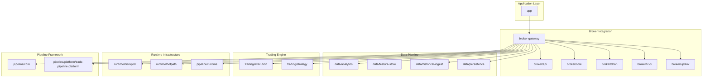
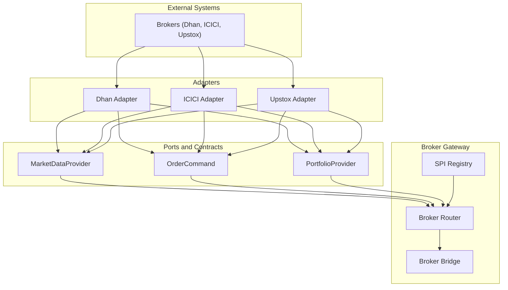
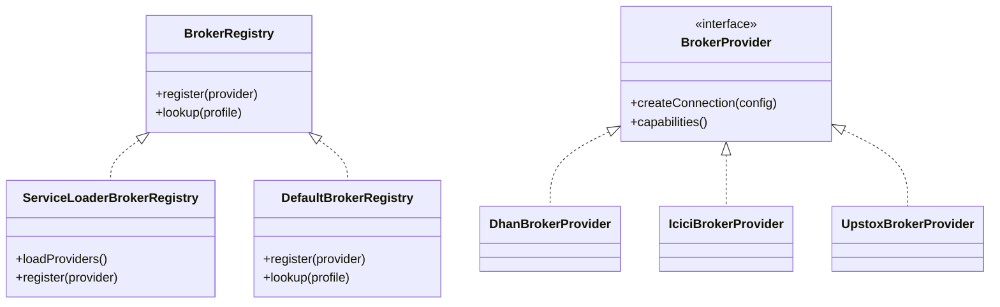
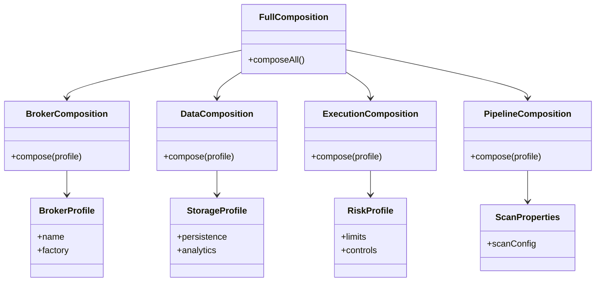
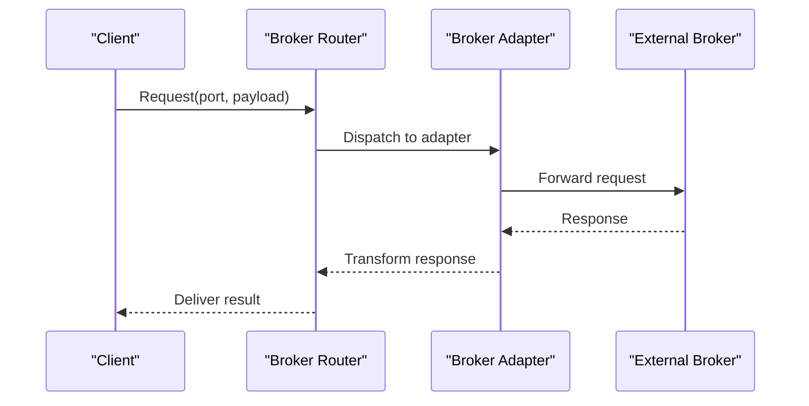
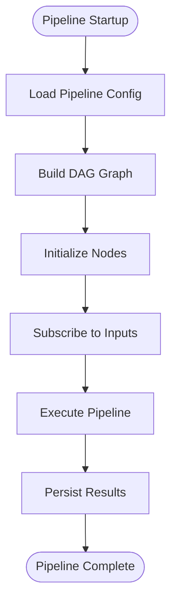
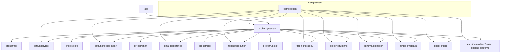

# Module Dependencies and Relationships

<cite>
**Referenced Files in This Document**
- [settings.gradle](file://settings.gradle)
- [build.gradle](file://build.gradle)
- [app/build.gradle](file://app/build.gradle)
- [broker-gateway/build.gradle](file://broker-gateway/build.gradle)
- [broker/api/build.gradle](file://broker/api/build.gradle)
- [broker/core/build.gradle](file://broker/core/build.gradle)
- [broker/dhan/build.gradle](file://broker/dhan/build.gradle)
- [broker/icici/build.gradle](file://broker/icici/build.gradle)
- [broker/upstox/build.gradle](file://broker/upstox/build.gradle)
- [composition/build.gradle](file://composition/build.gradle)
- [data/analytics/build.gradle](file://data/analytics/build.gradle)
- [data/feature-store/build.gradle](file://data/feature-store/build.gradle)
- [data/historical-ingest/build.gradle](file://data/historical-ingest/build.gradle)
- [data/persistence/build.gradle](file://data/persistence/build.gradle)
- [gateway/build.gradle](file://gateway/build.gradle)
- [pipeline/core/build.gradle](file://pipeline/core/build.gradle)
- [pipeline/platform/trade-pipeline-platform/build.gradle](file://pipeline/platform/trade-pipeline-platform/build.gradle)
- [pipeline/runtime/build.gradle](file://pipeline/runtime/build.gradle)
- [trading/execution/build.gradle](file://trading/execution/build.gradle)
- [trading/strategy/build.gradle](file://trading/strategy/build.gradle)
- [runtime/disruptor/build.gradle](file://runtime/disruptor/build.gradle)
- [runtime/hotpath/build.gradle](file://runtime/hotpath/build.gradle)
- [cli/build.gradle](file://cli/build.gradle)
- [core/build.gradle](file://core/build.gradle)
- [broker-gateway/src/main/java/com/tradej/brokergateway/spi/BrokerRegistry.java](file://broker-gateway/src/main/java/com/tradej/brokergateway/spi/BrokerRegistry.java)
- [broker-gateway/src/main/java/com/tradej/brokergateway/spi/DefaultBrokerRegistry.java](file://broker-gateway/src/main/java/com/tradej/brokergateway/spi/DefaultBrokerRegistry.java)
- [broker-gateway/src/main/java/com/tradej/brokergateway/spi/ServiceLoaderBrokerRegistry.java](file://broker-gateway/src/main/java/com/tradej/brokergateway/spi/ServiceLoaderBrokerRegistry.java)
- [broker-gateway/src/main/java/com/tradej/brokergateway/spi/impl/DhanBrokerProvider.java](file://broker-gateway/src/main/java/com/tradej/brokergateway/spi/impl/DhanBrokerProvider.java)
- [broker-gateway/src/main/java/com/tradej/brokergateway/spi/impl/IciciBrokerProvider.java](file://broker-gateway/src/main/java/com/tradej/brokergateway/spi/impl/IciciBrokerProvider.java)
- [broker-gateway/src/main/java/com/tradej/brokergateway/spi/impl/UpstoxBrokerProvider.java](file://broker-gateway/src/main/java/com/tradej/brokergateway/spi/impl/UpstoxBrokerProvider.java)
- [composition/src/main/java/com/tradej/composition/BrokerComposition.java](file://composition/src/main/java/com/tradej/composition/BrokerComposition.java)
- [composition/src/main/java/com/tradej/composition/DataComposition.java](file://composition/src/main/java/com/tradej/composition/DataComposition.java)
- [composition/src/main/java/com/tradej/composition/ExecutionComposition.java](file://composition/src/main/java/com/tradej/composition/ExecutionComposition.java)
- [composition/src/main/java/com/tradej/composition/PipelineComposition.java](file://composition/src/main/java/com/tradej/composition/PipelineComposition.java)
- [composition/src/main/java/com/tradej/composition/FullComposition.java](file://composition/src/main/java/com/tradej/composition/FullComposition.java)
- [composition/src/main/java/com/tradej/composition/config/BrokerProfile.java](file://composition/src/main/java/com/tradej/composition/config/BrokerProfile.java)
- [composition/src/main/java/com/tradej/composition/config/RiskProfile.java](file://composition/src/main/java/com/tradej/composition/config/RiskProfile.java)
- [composition/src/main/java/com/tradej/composition/config/StorageProfile.java](file://composition/src/main/java/com/tradej/composition/config/StorageProfile.java)
- [composition/src/main/java/com/tradej/composition/config/ScanProperties.java](file://composition/src/main/java/com/tradej/composition/config/ScanProperties.java)
- [broker/api/src/main/java/com/tradej/broker/api/port/MarketDataProvider.java](file://broker/api/src/main/java/com/tradej/broker/api/port/MarketDataProvider.java)
- [broker/api/src/main/java/com/tradej/broker/api/port/OrderCommand.java](file://broker/api/src/main/java/com/tradej/broker/api/port/OrderCommand.java)
- [broker/api/src/main/java/com/tradej/broker/api/port/PortfolioProvider.java](file://broker/api/src/main/java/com/tradej/broker/api/port/PortfolioProvider.java)
- [broker/api/src/main/java/com/tradej/broker/api/IBrokerConnection.java](file://broker/api/src/main/java/com/tradej/broker/api/IBrokerConnection.java)
- [broker/api/src/main/java/com/tradej/broker/api/model/BrokerCapabilities.java](file://broker/api/src/main/java/com/tradej/broker/api/model/BrokerCapabilities.java)
- [gateway/src/main/java/com/tradej/gateway/router/GatewayRouter.java](file://gateway/src/main/java/com/tradej/gateway/router/GatewayRouter.java)
- [gateway/src/main/java/com/tradej/gateway/bridge/BrokerGatewayBridge.java](file://gateway/src/main/java/com/tradej/gateway/bridge/BrokerGatewayBridge.java)
- [pipeline/core/src/main/java/com/tradej/pipeline/core/DagPipeline.java](file://pipeline/core/src/main/java/com/tradej/pipeline/core/DagPipeline.java)
- [pipeline/runtime/src/main/java/com/tradej/pipeline/service/DagPipelineRuntimeService.java](file://pipeline/runtime/src/main/java/com/tradej/pipeline/service/DagPipelineRuntimeService.java)
- [trading/execution/src/main/java/com/tradej/execution/oms/Oms.java](file://trading/execution/src/main/java/com/tradej/execution/oms/Oms.java)
- [trading/strategy/src/main/java/com/tradej/strategy/Strategy.java](file://trading/strategy/src/main/java/com/tradej/strategy/Strategy.java)
- [runtime/disruptor/src/main/java/com/tradej/disruptor/DisruptorEventBus.java](file://runtime/disruptor/src/main/java/com/tradej/disruptor/DisruptorEventBus.java)
- [runtime/hotpath/src/main/java/com/tradej/hotpath/HotPathProcessor.java](file://runtime/hotpath/src/main/java/com/tradej/hotpath/HotPathProcessor.java)
- [core/src/main/java/com/tradej/core/domain/MarketData.java](file://core/src/main/java/com/tradej/core/domain/MarketData.java)
- [core/src/main/java/com/tradej/core/domain/Order.java](file://core/src/main/java/com/tradej/core/domain/Order.java)
- [core/src/main/java/com/tradej/core/domain/Portfolio.java](file://core/src/main/java/com/tradej/core/domain/Portfolio.java)
</cite>

## Table of Contents
1. [Introduction](#introduction)
2. [Project Structure](#project-structure)
3. [Core Components](#core-components)
4. [Architecture Overview](#architecture-overview)
5. [Detailed Component Analysis](#detailed-component-analysis)
6. [Dependency Analysis](#dependency-analysis)
7. [Performance Considerations](#performance-considerations)
8. [Troubleshooting Guide](#troubleshooting-guide)
9. [Conclusion](#conclusion)

## Introduction
This document explains the module dependency and relationship architecture of the TradeJ multi-module Gradle project. It focuses on how core modules integrate through well-defined interfaces, how the composition system orchestrates broker profiles and runtime configurations, and how SPI (Service Provider Interface) patterns enable extensibility. The analysis covers inter-module dependencies among app, broker modules, data modules, and runtime modules, and demonstrates how ports and adapters facilitate communication.

## Project Structure
TradeJ is organized as a multi-module Gradle project with distinct functional areas:
- Application layer: app module
- Broker integration: broker-gateway and broker/* modules
- Data pipeline: data/* modules
- Runtime infrastructure: runtime/* modules
- Trading engine: trading/* modules
- Pipeline framework: pipeline/* modules
- CLI and core utilities: cli and core modules

The project uses a layered architecture with clear separation of concerns:
- Ports define contracts for external systems (market data, orders, portfolio)
- Adapters implement these ports for specific brokers
- Composition orchestrates runtime wiring and broker profile selection
- Gateways and routers connect internal components to external systems

**Diagram sources**
- [settings.gradle](file://settings.gradle)
- [app/build.gradle](file://app/build.gradle)
- [broker-gateway/build.gradle](file://broker-gateway/build.gradle)
- [broker/api/build.gradle](file://broker/api/build.gradle)
- [broker/core/build.gradle](file://broker/core/build.gradle)
- [broker/dhan/build.gradle](file://broker/dhan/build.gradle)
- [broker/icici/build.gradle](file://broker/icici/build.gradle)
- [broker/upstox/build.gradle](file://broker/upstox/build.gradle)
- [data/analytics/build.gradle](file://data/analytics/build.gradle)
- [data/feature-store/build.gradle](file://data/feature-store/build.gradle)
- [data/historical-ingest/build.gradle](file://data/historical-ingest/build.gradle)
- [data/persistence/build.gradle](file://data/persistence/build.gradle)
- [trading/execution/build.gradle](file://trading/execution/build.gradle)
- [trading/strategy/build.gradle](file://trading/strategy/build.gradle)
- [runtime/disruptor/build.gradle](file://runtime/disruptor/build.gradle)
- [runtime/hotpath/build.gradle](file://runtime/hotpath/build.gradle)
- [pipeline/core/build.gradle](file://pipeline/core/build.gradle)
- [pipeline/platform/trade-pipeline-platform/build.gradle](file://pipeline/platform/trade-pipeline-platform/build.gradle)
- [pipeline/runtime/build.gradle](file://pipeline/runtime/build.gradle)

**Section sources**
- [settings.gradle](file://settings.gradle)
- [build.gradle](file://build.gradle)

## Core Components
This section documents the primary modules and their roles in the system.

- broker-gateway: Provides the central gateway for broker integrations, exposing SPI for broker providers and implementing router and bridge patterns to orchestrate connections and requests.
- broker/api: Defines the port abstractions for market data, orders, portfolio, and other broker capabilities, enabling adapter implementations per broker.
- broker/core: Implements shared broker capabilities such as authentication, resilience, routing, and subscription management.
- broker/dhan, broker/icici, broker/upstox: Broker-specific adapter implementations that provide concrete adapters for each broker via SPI.
- data modules: Provide analytics, feature store, historical ingestion, and persistence capabilities used by the trading and pipeline layers.
- trading modules: Contain execution, strategy, scanner, and options analytics components that consume data and produce trading actions.
- runtime modules: Disruptor and hotpath components optimize event processing and low-latency operations.
- pipeline modules: Core DAG pipeline engine and runtime services coordinate asynchronous processing of market data and signals.
- composition: Orchestrates runtime wiring, broker profiles, and configuration profiles for different environments.

**Section sources**
- [broker-gateway/build.gradle](file://broker-gateway/build.gradle)
- [broker/api/build.gradle](file://broker/api/build.gradle)
- [broker/core/build.gradle](file://broker/core/build.gradle)
- [broker/dhan/build.gradle](file://broker/dhan/build.gradle)
- [broker/icici/build.gradle](file://broker/icici/build.gradle)
- [broker/upstox/build.gradle](file://broker/upstox/build.gradle)
- [data/analytics/build.gradle](file://data/analytics/build.gradle)
- [data/feature-store/build.gradle](file://data/feature-store/build.gradle)
- [data/historical-ingest/build.gradle](file://data/historical-ingest/build.gradle)
- [data/persistence/build.gradle](file://data/persistence/build.gradle)
- [trading/execution/build.gradle](file://trading/execution/build.gradle)
- [trading/strategy/build.gradle](file://trading/strategy/build.gradle)
- [runtime/disruptor/build.gradle](file://runtime/disruptor/build.gradle)
- [runtime/hotpath/build.gradle](file://runtime/hotpath/build.gradle)
- [pipeline/core/build.gradle](file://pipeline/core/build.gradle)
- [pipeline/platform/trade-pipeline-platform/build.gradle](file://pipeline/platform/trade-pipeline-platform/build.gradle)
- [pipeline/runtime/build.gradle](file://pipeline/runtime/build.gradle)
- [composition/build.gradle](file://composition/build.gradle)

## Architecture Overview
The system follows a ports-and-adapters architecture:
- Ports (in broker/api) define contracts for market data, order commands, portfolio queries, and other capabilities.
- Adapters (in broker/dhan, broker/icici, broker/upstox) implement these ports for specific brokers.
- broker-gateway acts as the router and bridge, delegating requests to the appropriate adapter based on broker profile.
- composition orchestrates runtime wiring, selecting broker factories and configuration profiles.
- pipeline/runtime coordinates asynchronous processing of market data and signals.
- runtime/disruptor and runtime/hotpath optimize throughput and latency.

**Diagram sources**
- [broker/api/src/main/java/com/tradej/broker/api/port/MarketDataProvider.java](file://broker/api/src/main/java/com/tradej/broker/api/port/MarketDataProvider.java)
- [broker/api/src/main/java/com/tradej/broker/api/port/OrderCommand.java](file://broker/api/src/main/java/com/tradej/broker/api/port/OrderCommand.java)
- [broker/api/src/main/java/com/tradej/broker/api/port/PortfolioProvider.java](file://broker/api/src/main/java/com/tradej/broker/api/port/PortfolioProvider.java)
- [broker/api/src/main/java/com/tradej/broker/api/IBrokerConnection.java](file://broker/api/src/main/java/com/tradej/broker/api/IBrokerConnection.java)
- [broker-gateway/src/main/java/com/tradej/brokergateway/spi/BrokerRegistry.java](file://broker-gateway/src/main/java/com/tradej/brokergateway/spi/BrokerRegistry.java)
- [broker-gateway/src/main/java/com/tradej/brokergateway/spi/DefaultBrokerRegistry.java](file://broker-gateway/src/main/java/com/tradej/brokergateway/spi/DefaultBrokerRegistry.java)
- [broker-gateway/src/main/java/com/tradej/brokergateway/spi/ServiceLoaderBrokerRegistry.java](file://broker-gateway/src/main/java/com/tradej/brokergateway/spi/ServiceLoaderBrokerRegistry.java)
- [broker-gateway/src/main/java/com/tradej/brokergateway/spi/impl/DhanBrokerProvider.java](file://broker-gateway/src/main/java/com/tradej/brokergateway/spi/impl/DhanBrokerProvider.java)
- [broker-gateway/src/main/java/com/tradej/brokergateway/spi/impl/IciciBrokerProvider.java](file://broker-gateway/src/main/java/com/tradej/brokergateway/spi/impl/IciciBrokerProvider.java)
- [broker-gateway/src/main/java/com/tradej/brokergateway/spi/impl/UpstoxBrokerProvider.java](file://broker-gateway/src/main/java/com/tradej/brokergateway/spi/impl/UpstoxBrokerProvider.java)

## Detailed Component Analysis

### Broker Gateway and SPI Orchestration
The broker-gateway module exposes SPI interfaces for broker registration and provider selection. It supports multiple broker implementations through:
- BrokerRegistry and ServiceLoaderBrokerRegistry for dynamic discovery
- DefaultBrokerRegistry for explicit wiring
- BrokerProvider implementations for each broker (Dhan, ICICI, Upstox)

**Diagram sources**
- [broker-gateway/src/main/java/com/tradej/brokergateway/spi/BrokerRegistry.java](file://broker-gateway/src/main/java/com/tradej/brokergateway/spi/BrokerRegistry.java)
- [broker-gateway/src/main/java/com/tradej/brokergateway/spi/DefaultBrokerRegistry.java](file://broker-gateway/src/main/java/com/tradej/brokergateway/spi/DefaultBrokerRegistry.java)
- [broker-gateway/src/main/java/com/tradej/brokergateway/spi/ServiceLoaderBrokerRegistry.java](file://broker-gateway/src/main/java/com/tradej/brokergateway/spi/ServiceLoaderBrokerRegistry.java)
- [broker-gateway/src/main/java/com/tradej/brokergateway/spi/impl/DhanBrokerProvider.java](file://broker-gateway/src/main/java/com/tradej/brokergateway/spi/impl/DhanBrokerProvider.java)
- [broker-gateway/src/main/java/com/tradej/brokergateway/spi/impl/IciciBrokerProvider.java](file://broker-gateway/src/main/java/com/tradej/brokergateway/spi/impl/IciciBrokerProvider.java)
- [broker-gateway/src/main/java/com/tradej/brokergateway/spi/impl/UpstoxBrokerProvider.java](file://broker-gateway/src/main/java/com/tradej/brokergateway/spi/impl/UpstoxBrokerProvider.java)

**Section sources**
- [broker-gateway/src/main/java/com/tradej/brokergateway/spi/BrokerRegistry.java](file://broker-gateway/src/main/java/com/tradej/brokergateway/spi/BrokerRegistry.java)
- [broker-gateway/src/main/java/com/tradej/brokergateway/spi/DefaultBrokerRegistry.java](file://broker-gateway/src/main/java/com/tradej/brokergateway/spi/DefaultBrokerRegistry.java)
- [broker-gateway/src/main/java/com/tradej/brokergateway/spi/ServiceLoaderBrokerRegistry.java](file://broker-gateway/src/main/java/com/tradej/brokergateway/spi/ServiceLoaderBrokerRegistry.java)
- [broker-gateway/src/main/java/com/tradej/brokergateway/spi/impl/DhanBrokerProvider.java](file://broker-gateway/src/main/java/com/tradej/brokergateway/spi/impl/DhanBrokerProvider.java)
- [broker-gateway/src/main/java/com/tradej/brokergateway/spi/impl/IciciBrokerProvider.java](file://broker-gateway/src/main/java/com/tradej/brokergateway/spi/impl/IciciBrokerProvider.java)
- [broker-gateway/src/main/java/com/tradej/brokergateway/spi/impl/UpstoxBrokerProvider.java](file://broker-gateway/src/main/java/com/tradej/brokergateway/spi/impl/UpstoxBrokerProvider.java)

### Composition System for Broker Profiles and Runtime Modes
The composition module orchestrates runtime wiring and selects broker factories based on configuration profiles:
- BrokerComposition: wires broker-specific components
- DataComposition: configures data pipeline and persistence
- ExecutionComposition: sets up execution services
- PipelineComposition: configures pipeline runtime
- FullComposition: aggregates all compositions for end-to-end startup
- BrokerProfile, RiskProfile, StorageProfile, ScanProperties: encapsulate runtime configuration profiles

**Diagram sources**
- [composition/src/main/java/com/tradej/composition/BrokerComposition.java](file://composition/src/main/java/com/tradej/composition/BrokerComposition.java)
- [composition/src/main/java/com/tradej/composition/DataComposition.java](file://composition/src/main/java/com/tradej/composition/DataComposition.java)
- [composition/src/main/java/com/tradej/composition/ExecutionComposition.java](file://composition/src/main/java/com/tradej/composition/ExecutionComposition.java)
- [composition/src/main/java/com/tradej/composition/PipelineComposition.java](file://composition/src/main/java/com/tradej/composition/PipelineComposition.java)
- [composition/src/main/java/com/tradej/composition/FullComposition.java](file://composition/src/main/java/com/tradej/composition/FullComposition.java)
- [composition/src/main/java/com/tradej/composition/config/BrokerProfile.java](file://composition/src/main/java/com/tradej/composition/config/BrokerProfile.java)
- [composition/src/main/java/com/tradej/composition/config/RiskProfile.java](file://composition/src/main/java/com/tradej/composition/config/RiskProfile.java)
- [composition/src/main/java/com/tradej/composition/config/StorageProfile.java](file://composition/src/main/java/com/tradej/composition/config/StorageProfile.java)
- [composition/src/main/java/com/tradej/composition/config/ScanProperties.java](file://composition/src/main/java/com/tradej/composition/config/ScanProperties.java)

**Section sources**
- [composition/src/main/java/com/tradej/composition/BrokerComposition.java](file://composition/src/main/java/com/tradej/composition/BrokerComposition.java)
- [composition/src/main/java/com/tradej/composition/DataComposition.java](file://composition/src/main/java/com/tradej/composition/DataComposition.java)
- [composition/src/main/java/com/tradej/composition/ExecutionComposition.java](file://composition/src/main/java/com/tradej/composition/ExecutionComposition.java)
- [composition/src/main/java/com/tradej/composition/PipelineComposition.java](file://composition/src/main/java/com/tradej/composition/PipelineComposition.java)
- [composition/src/main/java/com/tradej/composition/FullComposition.java](file://composition/src/main/java/com/tradej/composition/FullComposition.java)
- [composition/src/main/java/com/tradej/composition/config/BrokerProfile.java](file://composition/src/main/java/com/tradej/composition/config/BrokerProfile.java)
- [composition/src/main/java/com/tradej/composition/config/RiskProfile.java](file://composition/src/main/java/com/tradej/composition/config/RiskProfile.java)
- [composition/src/main/java/com/tradej/composition/config/StorageProfile.java](file://composition/src/main/java/com/tradej/composition/config/StorageProfile.java)
- [composition/src/main/java/com/tradej/composition/config/ScanProperties.java](file://composition/src/main/java/com/tradej/composition/config/ScanProperties.java)

### Ports and Adapters Communication Pattern
The broker/api module defines ports that act as contracts for market data, order commands, and portfolio queries. Adapters implement these ports for each broker, ensuring loose coupling and testability.

**Diagram sources**
- [broker/api/src/main/java/com/tradej/broker/api/port/MarketDataProvider.java](file://broker/api/src/main/java/com/tradej/broker/api/port/MarketDataProvider.java)
- [broker/api/src/main/java/com/tradej/broker/api/port/OrderCommand.java](file://broker/api/src/main/java/com/tradej/broker/api/port/OrderCommand.java)
- [broker/api/src/main/java/com/tradej/broker/api/port/PortfolioProvider.java](file://broker/api/src/main/java/com/tradej/broker/api/port/PortfolioProvider.java)
- [broker/api/src/main/java/com/tradej/broker/api/IBrokerConnection.java](file://broker/api/src/main/java/com/tradej/broker/api/IBrokerConnection.java)
- [gateway/src/main/java/com/tradej/gateway/router/GatewayRouter.java](file://gateway/src/main/java/com/tradej/gateway/router/GatewayRouter.java)
- [gateway/src/main/java/com/tradej/gateway/bridge/BrokerGatewayBridge.java](file://gateway/src/main/java/com/tradej/gateway/bridge/BrokerGatewayBridge.java)

**Section sources**
- [broker/api/src/main/java/com/tradej/broker/api/port/MarketDataProvider.java](file://broker/api/src/main/java/com/tradej/broker/api/port/MarketDataProvider.java)
- [broker/api/src/main/java/com/tradej/broker/api/port/OrderCommand.java](file://broker/api/src/main/java/com/tradej/broker/api/port/OrderCommand.java)
- [broker/api/src/main/java/com/tradej/broker/api/port/PortfolioProvider.java](file://broker/api/src/main/java/com/tradej/broker/api/port/PortfolioProvider.java)
- [broker/api/src/main/java/com/tradej/broker/api/IBrokerConnection.java](file://broker/api/src/main/java/com/tradej/broker/api/IBrokerConnection.java)
- [gateway/src/main/java/com/tradej/gateway/router/GatewayRouter.java](file://gateway/src/main/java/com/tradej/gateway/router/GatewayRouter.java)
- [gateway/src/main/java/com/tradej/gateway/bridge/BrokerGatewayBridge.java](file://gateway/src/main/java/com/tradej/gateway/bridge/BrokerGatewayBridge.java)

### Pipeline Runtime Orchestration
The pipeline module coordinates asynchronous processing through a DAG-based runtime:
- pipeline/core provides the core DAG pipeline engine
- pipeline/runtime provides runtime services for pipeline instances
- pipeline/platform/trade-pipeline-platform offers platform-level abstractions

**Diagram sources**
- [pipeline/core/src/main/java/com/tradej/pipeline/core/DagPipeline.java](file://pipeline/core/src/main/java/com/tradej/pipeline/core/DagPipeline.java)
- [pipeline/runtime/src/main/java/com/tradej/pipeline/service/DagPipelineRuntimeService.java](file://pipeline/runtime/src/main/java/com/tradej/pipeline/service/DagPipelineRuntimeService.java)
- [pipeline/platform/trade-pipeline-platform/build.gradle](file://pipeline/platform/trade-pipeline-platform/build.gradle)

**Section sources**
- [pipeline/core/src/main/java/com/tradej/pipeline/core/DagPipeline.java](file://pipeline/core/src/main/java/com/tradej/pipeline/core/DagPipeline.java)
- [pipeline/runtime/src/main/java/com/tradej/pipeline/service/DagPipelineRuntimeService.java](file://pipeline/runtime/src/main/java/com/tradej/pipeline/service/DagPipelineRuntimeService.java)
- [pipeline/platform/trade-pipeline-platform/build.gradle](file://pipeline/platform/trade-pipeline-platform/build.gradle)

## Dependency Analysis
This section maps inter-module dependencies and highlights composition patterns.

**Diagram sources**
- [app/build.gradle](file://app/build.gradle)
- [broker-gateway/build.gradle](file://broker-gateway/build.gradle)
- [broker/api/build.gradle](file://broker/api/build.gradle)
- [broker/core/build.gradle](file://broker/core/build.gradle)
- [broker/dhan/build.gradle](file://broker/dhan/build.gradle)
- [broker/icici/build.gradle](file://broker/icici/build.gradle)
- [broker/upstox/build.gradle](file://broker/upstox/build.gradle)
- [data/analytics/build.gradle](file://data/analytics/build.gradle)
- [data/feature-store/build.gradle](file://data/feature-store/build.gradle)
- [data/historical-ingest/build.gradle](file://data/historical-ingest/build.gradle)
- [data/persistence/build.gradle](file://data/persistence/build.gradle)
- [trading/execution/build.gradle](file://trading/execution/build.gradle)
- [trading/strategy/build.gradle](file://trading/strategy/build.gradle)
- [runtime/disruptor/build.gradle](file://runtime/disruptor/build.gradle)
- [runtime/hotpath/build.gradle](file://runtime/hotpath/build.gradle)
- [pipeline/core/build.gradle](file://pipeline/core/build.gradle)
- [pipeline/platform/trade-pipeline-platform/build.gradle](file://pipeline/platform/trade-pipeline-platform/build.gradle)
- [pipeline/runtime/build.gradle](file://pipeline/runtime/build.gradle)
- [composition/build.gradle](file://composition/build.gradle)

**Section sources**
- [app/build.gradle](file://app/build.gradle)
- [broker-gateway/build.gradle](file://broker-gateway/build.gradle)
- [broker/api/build.gradle](file://broker/api/build.gradle)
- [broker/core/build.gradle](file://broker/core/build.gradle)
- [broker/dhan/build.gradle](file://broker/dhan/build.gradle)
- [broker/icici/build.gradle](file://broker/icici/build.gradle)
- [broker/upstox/build.gradle](file://broker/upstox/build.gradle)
- [data/analytics/build.gradle](file://data/analytics/build.gradle)
- [data/feature-store/build.gradle](file://data/feature-store/build.gradle)
- [data/historical-ingest/build.gradle](file://data/historical-ingest/build.gradle)
- [data/persistence/build.gradle](file://data/persistence/build.gradle)
- [trading/execution/build.gradle](file://trading/execution/build.gradle)
- [trading/strategy/build.gradle](file://trading/strategy/build.gradle)
- [runtime/disruptor/build.gradle](file://runtime/disruptor/build.gradle)
- [runtime/hotpath/build.gradle](file://runtime/hotpath/build.gradle)
- [pipeline/core/build.gradle](file://pipeline/core/build.gradle)
- [pipeline/platform/trade-pipeline-platform/build.gradle](file://pipeline/platform/trade-pipeline-platform/build.gradle)
- [pipeline/runtime/build.gradle](file://pipeline/runtime/build.gradle)
- [composition/build.gradle](file://composition/build.gradle)

## Performance Considerations
- Event bus optimization: runtime/disruptor and runtime/hotpath modules provide high-throughput, low-latency processing pathways for market data and order events.
- Pipeline efficiency: pipeline/core and pipeline/runtime coordinate asynchronous processing to minimize blocking and maximize throughput.
- Broker adapter isolation: broker-gateway SPI enables selective broker activation and resource pooling per profile.
- Data pipeline caching: data modules offer persistence and feature store capabilities to reduce redundant computations and improve replay performance.

[No sources needed since this section provides general guidance]

## Troubleshooting Guide
Common issues and diagnostics:
- Broker connectivity failures: Verify SPI registration and broker profile configuration in composition. Check broker capabilities and transport settings.
- Pipeline runtime errors: Inspect pipeline graph construction and node initialization. Validate input subscriptions and runtime service wiring.
- Market data gaps: Confirm adapter implementations and gateway router configuration. Review gateway bridge mappings and subscription requests.
- Execution anomalies: Validate order command routing and OMS integration. Check risk profile limits and execution composition settings.

**Section sources**
- [composition/src/main/java/com/tradej/composition/config/BrokerProfile.java](file://composition/src/main/java/com/tradej/composition/config/BrokerProfile.java)
- [composition/src/main/java/com/tradej/composition/config/RiskProfile.java](file://composition/src/main/java/com/tradej/composition/config/RiskProfile.java)
- [pipeline/runtime/src/main/java/com/tradej/pipeline/service/DagPipelineRuntimeService.java](file://pipeline/runtime/src/main/java/com/tradej/pipeline/service/DagPipelineRuntimeService.java)
- [gateway/src/main/java/com/tradej/gateway/router/GatewayRouter.java](file://gateway/src/main/java/com/tradej/gateway/router/GatewayRouter.java)
- [gateway/src/main/java/com/tradej/gateway/bridge/BrokerGatewayBridge.java](file://gateway/src/main/java/com/tradej/gateway/bridge/BrokerGatewayBridge.java)

## Conclusion
TradeJ employs a modular, layered architecture with clear separation of concerns. The broker-gateway module, powered by SPI, enables extensible broker integrations while maintaining consistent interfaces through ports and adapters. The composition system orchestrates runtime configurations and broker profiles, ensuring flexible deployment across environments. Together with optimized runtime modules and a robust pipeline framework, the system achieves scalability, maintainability, and high-performance trading operations.