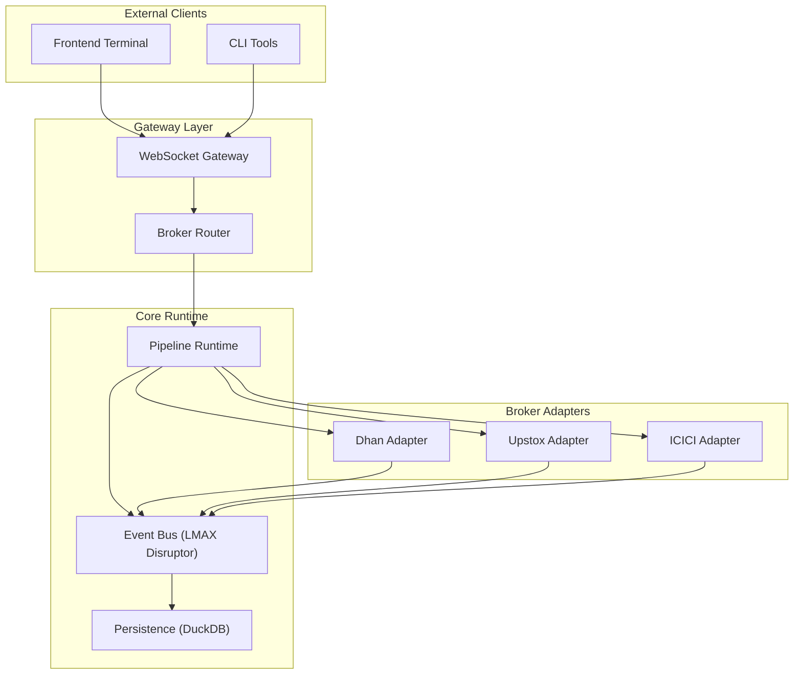
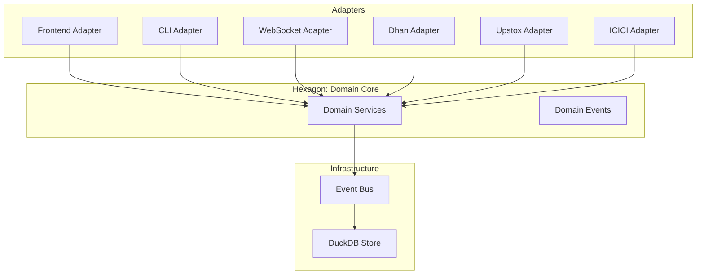
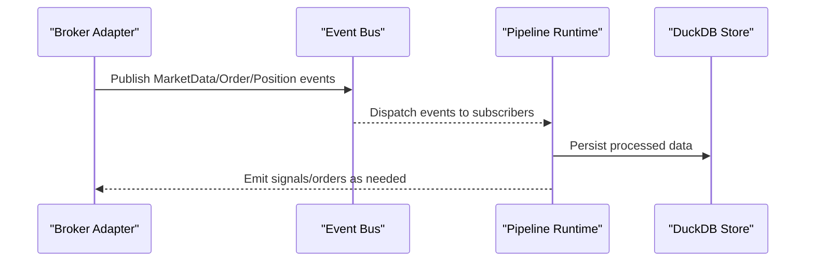
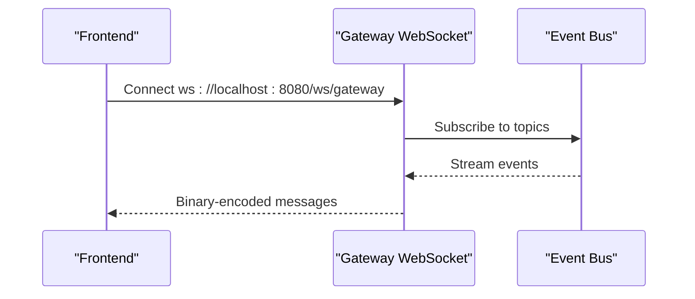
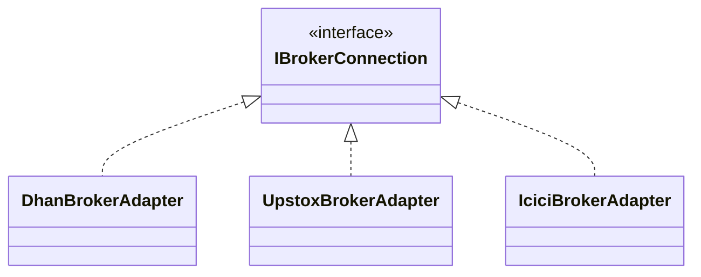
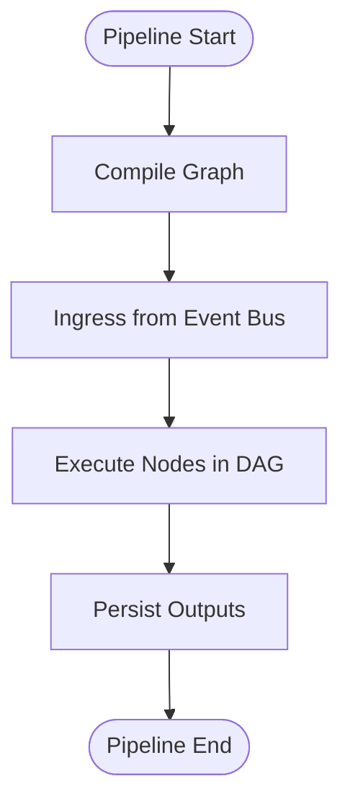
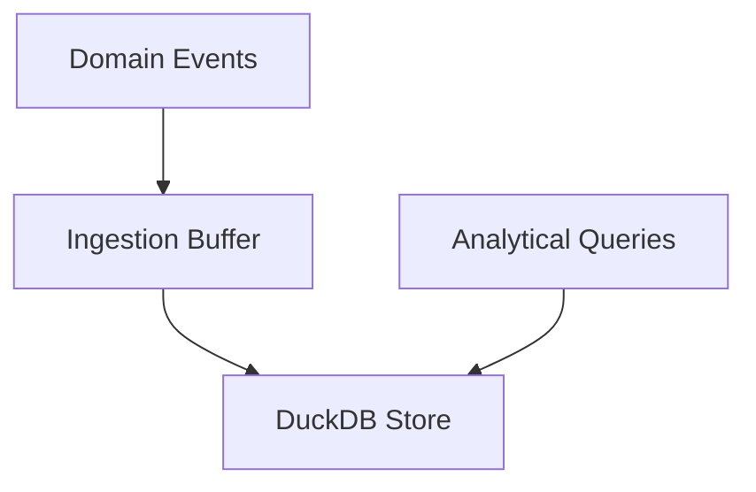
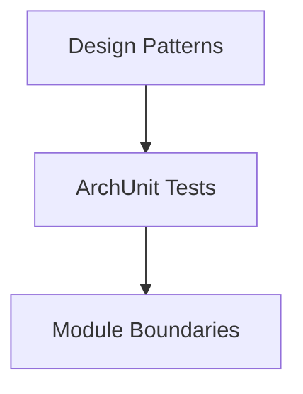

# System Overview

<cite>
**Referenced Files in This Document**
- [ARCHITECTURE.md](file://ARCHITECTURE.md)
- [build.gradle](file://build.gradle)
- [app/build.gradle](file://app/build.gradle)
- [docs/visuals/Trade-J-Architecture-Visual.html](file://docs/visuals/Trade-J-Architecture-Visual.html)
- [docs/USAGE_GUIDE.md](file://docs/USAGE_GUIDE.md)
- [.kilo/plans/2026-06-08-market-data-remediation.md](file://.kilo/plans/2026-06-08-market-data-remediation.md)
- [runtime/disruptor/src/main/java/com/tradej/disruptor/ShardedDisruptorEventBus.java](file://runtime/disruptor/src/main/java/com/tradej/disruptor/ShardedDisruptorEventBus.java)
- [runtime/disruptor/src/main/java/com/tradej/disruptor/DisruptorBusMetrics.java](file://runtime/disruptor/src/main/java/com/tradej/disruptor/DisruptorBusMetrics.java)
- [cli/src/main/java/com/tradej/cli/command/CliArchitectureCommand.java](file://cli/src/main/java/com/tradej/cli/command/CliArchitectureCommand.java)
- [gateway/src/main/java/com/tradej/gateway/websocket/GatewayWebSocketHandler.java](file://gateway/src/main/java/com/tradej/gateway/websocket/GatewayWebSocketHandler.java)
- [gateway/src/main/java/com/tradej/gateway/router/BrokerRouter.java](file://gateway/src/main/java/com/tradej/gateway/router/BrokerRouter.java)
- [broker/api/src/main/java/com/tradej/broker/api/IBrokerConnection.java](file://broker/api/src/main/java/com/tradej/broker/api/IBrokerConnection.java)
- [broker/dhan/src/main/java/com/tradej/broker/dhan/DhanBrokerAdapter.java](file://broker/dhan/src/main/java/com/tradej/broker/dhan/DhanBrokerAdapter.java)
- [broker/upstox/src/main/java/com/tradej/broker/upstox/UpstoxBrokerAdapter.java](file://broker/upstox/src/main/java/com/tradej/broker/upstox/UpstoxBrokerAdapter.java)
- [broker/icici/src/main/java/com/tradej/broker/icici/IciciBrokerAdapter.java](file://broker/icici/src/main/java/com/tradej/broker/icici/IciciBrokerAdapter.java)
- [pipeline/runtime/src/main/java/com/tradej/pipeline/service/DagPipelineRuntimeService.java](file://pipeline/runtime/src/main/java/com/tradej/pipeline/service/DagPipelineRuntimeService.java)
- [data/persistence/src/main/java/com/tradej/persistence/duckdb/DuckDBPersistence.java](file://data/persistence/src/main/java/com/tradej/persistence/duckdb/DuckDBPersistence.java)
- [composition/runtime/chronicle/README.md](file://composition/runtime/chronicle/README.md)
</cite>

## Table of Contents
1. [Introduction](#introduction)
2. [Project Structure](#project-structure)
3. [Core Components](#core-components)
4. [Architecture Overview](#architecture-overview)
5. [Detailed Component Analysis](#detailed-component-analysis)
6. [Dependency Analysis](#dependency-analysis)
7. [Performance Considerations](#performance-considerations)
8. [Troubleshooting Guide](#troubleshooting-guide)
9. [Conclusion](#conclusion)

## Introduction
Trade-J is a multi-broker trading system designed to unify market data feeds, order routing, and execution across multiple brokerage providers. It emphasizes event-driven architecture, modularity, and high-throughput processing to support real-time trading, backtesting, and analytics. The platform targets both beginner traders seeking a unified terminal and advanced users requiring deep customization via pipelines and adapters.

## Project Structure
Trade-J follows a modular, layered architecture with clear separation of concerns:
- Core domain and infrastructure modules define the business logic and foundational services.
- Broker adapters encapsulate provider-specific integrations (Dhan, Upstox, ICICI).
- A gateway handles external connections (CLI, WebSocket) and routes requests to internal services.
- A pipeline runtime enables dynamic, node-based processing graphs for signals, scans, and analytics.
- Persistence and analytics modules provide storage and insights.
- The application module assembles the system into a Spring Boot server with web and WebSocket endpoints.

**Diagram sources**
- [docs/visuals/Trade-J-Architecture-Visual.html](file://docs/visuals/Trade-J-Architecture-Visual.html)
- [docs/USAGE_GUIDE.md](file://docs/USAGE_GUIDE.md)
- [gateway/src/main/java/com/tradej/gateway/router/BrokerRouter.java](file://gateway/src/main/java/com/tradej/gateway/router/BrokerRouter.java)
- [pipeline/runtime/src/main/java/com/tradej/pipeline/service/DagPipelineRuntimeService.java](file://pipeline/runtime/src/main/java/com/tradej/pipeline/service/DagPipelineRuntimeService.java)
- [runtime/disruptor/src/main/java/com/tradej/disruptor/ShardedDisruptorEventBus.java](file://runtime/disruptor/src/main/java/com/tradej/disruptor/ShardedDisruptorEventBus.java)
- [data/persistence/src/main/java/com/tradej/persistence/duckdb/DuckDBPersistence.java](file://data/persistence/src/main/java/com/tradej/persistence/duckdb/DuckDBPersistence.java)

**Section sources**
- [ARCHITECTURE.md](file://ARCHITECTURE.md)
- [docs/visuals/Trade-J-Architecture-Visual.html](file://docs/visuals/Trade-J-Architecture-Visual.html)

## Core Components
- Event Bus (LMAX Disruptor): A high-performance, low-latency event bus enabling decoupled communication between components. It supports sharding for scalability and provides observable metrics for capacity and throughput.
- Broker Adapters: Provider-specific implementations (Dhan, Upstox, ICICI) that translate standardized domain events into provider APIs and vice versa.
- Gateway: Exposes WebSocket endpoints for real-time streaming and HTTP endpoints for administrative and operational tasks.
- Pipeline Runtime: Executes dynamic processing graphs composed of nodes for scanning, signal generation, and analytics.
- Persistence: DuckDB-backed storage for historical data, configurations, and runtime artifacts.
- CLI: Command-line tools for administration, data downloads, and runtime control.

**Section sources**
- [runtime/disruptor/src/main/java/com/tradej/disruptor/ShardedDisruptorEventBus.java](file://runtime/disruptor/src/main/java/com/tradej/disruptor/ShardedDisruptorEventBus.java)
- [runtime/disruptor/src/main/java/com/tradej/disruptor/DisruptorBusMetrics.java](file://runtime/disruptor/src/main/java/com/tradej/disruptor/DisruptorBusMetrics.java)
- [docs/USAGE_GUIDE.md](file://docs/USAGE_GUIDE.md)
- [pipeline/runtime/src/main/java/com/tradej/pipeline/service/DagPipelineRuntimeService.java](file://pipeline/runtime/src/main/java/com/tradej/pipeline/service/DagPipelineRuntimeService.java)
- [data/persistence/src/main/java/com/tradej/persistence/duckdb/DuckDBPersistence.java](file://data/persistence/src/main/java/com/tradej/persistence/duckdb/DuckDBPersistence.java)

## Architecture Overview
Trade-J employs a hexagonal architecture with layered modules:
- Hexagonal Layout: Ports and adapters isolate the core domain from external systems (brokers, UI, CLI, WebSocket).
- Layered Approach: Presentation (UI/CLI/WebSocket), Application (routing, orchestration), Domain (business logic), Infrastructure (persistence, event bus).
- Modular Structure: Clear module boundaries enforce cohesion and reduce coupling across broker integrations, pipelines, and runtime services.

**Diagram sources**
- [docs/visuals/Trade-J-Architecture-Visual.html](file://docs/visuals/Trade-J-Architecture-Visual.html)
- [runtime/disruptor/src/main/java/com/tradej/disruptor/ShardedDisruptorEventBus.java](file://runtime/disruptor/src/main/java/com/tradej/disruptor/ShardedDisruptorEventBus.java)
- [data/persistence/src/main/java/com/tradej/persistence/duckdb/DuckDBPersistence.java](file://data/persistence/src/main/java/com/tradej/persistence/duckdb/DuckDBPersistence.java)

**Section sources**
- [ARCHITECTURE.md](file://ARCHITECTURE.md)
- [docs/visuals/Trade-J-Architecture-Visual.html](file://docs/visuals/Trade-J-Architecture-Visual.html)

## Detailed Component Analysis

### Event-Driven Architecture
Trade-J uses an event-driven design powered by LMAX Disruptor:
- Producers publish domain events onto the event bus.
- Subscribers receive events asynchronously, enabling loose coupling and high throughput.
- Sharded event bus distributes load across shards for scalability.

**Diagram sources**
- [runtime/disruptor/src/main/java/com/tradej/disruptor/ShardedDisruptorEventBus.java](file://runtime/disruptor/src/main/java/com/tradej/disruptor/ShardedDisruptorEventBus.java)
- [pipeline/runtime/src/main/java/com/tradej/pipeline/service/DagPipelineRuntimeService.java](file://pipeline/runtime/src/main/java/com/tradej/pipeline/service/DagPipelineRuntimeService.java)
- [data/persistence/src/main/java/com/tradej/persistence/duckdb/DuckDBPersistence.java](file://data/persistence/src/main/java/com/tradej/persistence/duckdb/DuckDBPersistence.java)

**Section sources**
- [runtime/disruptor/src/main/java/com/tradej/disruptor/ShardedDisruptorEventBus.java](file://runtime/disruptor/src/main/java/com/tradej/disruptor/ShardedDisruptorEventBus.java)
- [runtime/disruptor/src/main/java/com/tradej/disruptor/DisruptorBusMetrics.java](file://runtime/disruptor/src/main/java/com/tradej/disruptor/DisruptorBusMetrics.java)

### Gateway and WebSocket Streaming
The gateway exposes a WebSocket endpoint for real-time streaming:
- Endpoint: /ws/gateway
- Streams market data, candles, order lifecycle, positions, signals, and scan results.
- Binary protocol ensures efficient framing and decoding.

**Diagram sources**
- [docs/USAGE_GUIDE.md](file://docs/USAGE_GUIDE.md)
- [gateway/src/main/java/com/tradej/gateway/websocket/GatewayWebSocketHandler.java](file://gateway/src/main/java/com/tradej/gateway/websocket/GatewayWebSocketHandler.java)

**Section sources**
- [docs/USAGE_GUIDE.md](file://docs/USAGE_GUIDE.md)

### Broker Adapters (Multi-Broker Support)
Broker adapters implement a common interface and encapsulate provider-specific logic:
- IBrokerConnection defines the contract for market data, order routing, and session management.
- Dhan, Upstox, and ICICI adapters implement provider-specific flows while remaining interchangeable.

**Diagram sources**
- [broker/api/src/main/java/com/tradej/broker/api/IBrokerConnection.java](file://broker/api/src/main/java/com/tradej/broker/api/IBrokerConnection.java)
- [broker/dhan/src/main/java/com/tradej/broker/dhan/DhanBrokerAdapter.java](file://broker/dhan/src/main/java/com/tradej/broker/dhan/DhanBrokerAdapter.java)
- [broker/upstox/src/main/java/com/tradej/broker/upstox/UpstoxBrokerAdapter.java](file://broker/upstox/src/main/java/com/tradej/broker/upstox/UpstoxBrokerAdapter.java)
- [broker/icici/src/main/java/com/tradej/broker/icici/IciciBrokerAdapter.java](file://broker/icici/src/main/java/com/tradej/broker/icici/IciciBrokerAdapter.java)

**Section sources**
- [broker/api/src/main/java/com/tradej/broker/api/IBrokerConnection.java](file://broker/api/src/main/java/com/tradej/broker/api/IBrokerConnection.java)

### Pipeline Runtime
The pipeline runtime executes dynamic graphs of processing nodes:
- DAG-based execution model for scans, signals, and analytics.
- Bridges ingress from the event bus and orchestrates node execution.

**Diagram sources**
- [pipeline/runtime/src/main/java/com/tradej/pipeline/service/DagPipelineRuntimeService.java](file://pipeline/runtime/src/main/java/com/tradej/pipeline/service/DagPipelineRuntimeService.java)

**Section sources**
- [pipeline/runtime/src/main/java/com/tradej/pipeline/service/DagPipelineRuntimeService.java](file://pipeline/runtime/src/main/java/com/tradej/pipeline/service/DagPipelineRuntimeService.java)

### Persistence with DuckDB
DuckDB serves as the primary persistence engine:
- Stores historical market data, configurations, and runtime artifacts.
- Optimized for analytical queries and fast ingestion.

**Diagram sources**
- [data/persistence/src/main/java/com/tradej/persistence/duckdb/DuckDBPersistence.java](file://data/persistence/src/main/java/com/tradej/persistence/duckdb/DuckDBPersistence.java)

**Section sources**
- [data/persistence/src/main/java/com/tradej/persistence/duckdb/DuckDBPersistence.java](file://data/persistence/src/main/java/com/tradej/persistence/duckdb/DuckDBPersistence.java)

## Dependency Analysis
Trade-J enforces architectural constraints and patterns:
- Design patterns include Command, Chain of Responsibility, Strategy (SPI), Adapter, Registry, Decorator, State, Event-Driven, Specification, and CQRS.
- Architecture tests enforce module boundaries, Spring-free domain, and profile isolation.

**Diagram sources**
- [cli/src/main/java/com/tradej/cli/command/CliArchitectureCommand.java](file://cli/src/main/java/com/tradej/cli/command/CliArchitectureCommand.java)

**Section sources**
- [cli/src/main/java/com/tradej/cli/command/CliArchitectureCommand.java](file://cli/src/main/java/com/tradej/cli/command/CliArchitectureCommand.java)

## Performance Considerations
- Event Bus Capacity: The sharded Disruptor event bus provides scalable throughput with observable metrics for ring buffer capacity and dropped events.
- Broker Isolation: Each broker maintains its own event bus and HTTP client, preventing cross-interference and ensuring predictable performance.
- WebSocket Backpressure: WebSocket callbacks execute off the network thread to avoid blocking listeners and maintain responsiveness.

**Section sources**
- [runtime/disruptor/src/main/java/com/tradej/disruptor/DisruptorBusMetrics.java](file://runtime/disruptor/src/main/java/com/tradej/disruptor/DisruptorBusMetrics.java)
- [.kilo/plans/2026-06-08-market-data-remediation.md](file://.kilo/plans/2026-06-08-market-data-remediation.md)

## Troubleshooting Guide
- WebSocket Connectivity: Verify the WebSocket endpoint and binary protocol configuration.
- Event Bus Health: Monitor ring buffer capacity and dropped event counts to detect saturation.
- Broker Adapter Status: Confirm per-broker connectivity and session lifecycle.
- Pipeline Runtime: Validate graph compilation and node execution logs.

**Section sources**
- [docs/USAGE_GUIDE.md](file://docs/USAGE_GUIDE.md)
- [runtime/disruptor/src/main/java/com/tradej/disruptor/DisruptorBusMetrics.java](file://runtime/disruptor/src/main/java/com/tradej/disruptor/DisruptorBusMetrics.java)
- [gateway/src/main/java/com/tradej/gateway/websocket/GatewayWebSocketHandler.java](file://gateway/src/main/java/com/tradej/gateway/websocket/GatewayWebSocketHandler.java)

## Conclusion
Trade-J delivers a robust, modular, and high-performance trading platform through hexagonal architecture, event-driven design, and multi-broker adaptability. Its layered structure, strong architectural constraints, and observable runtime characteristics enable both accessibility for beginners and extensibility for advanced users.