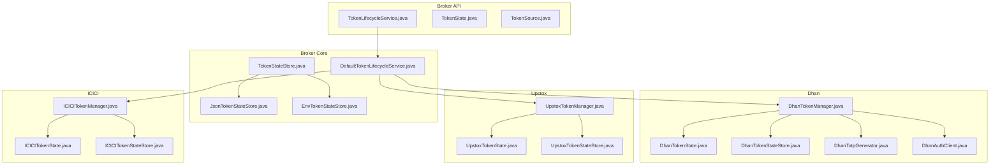
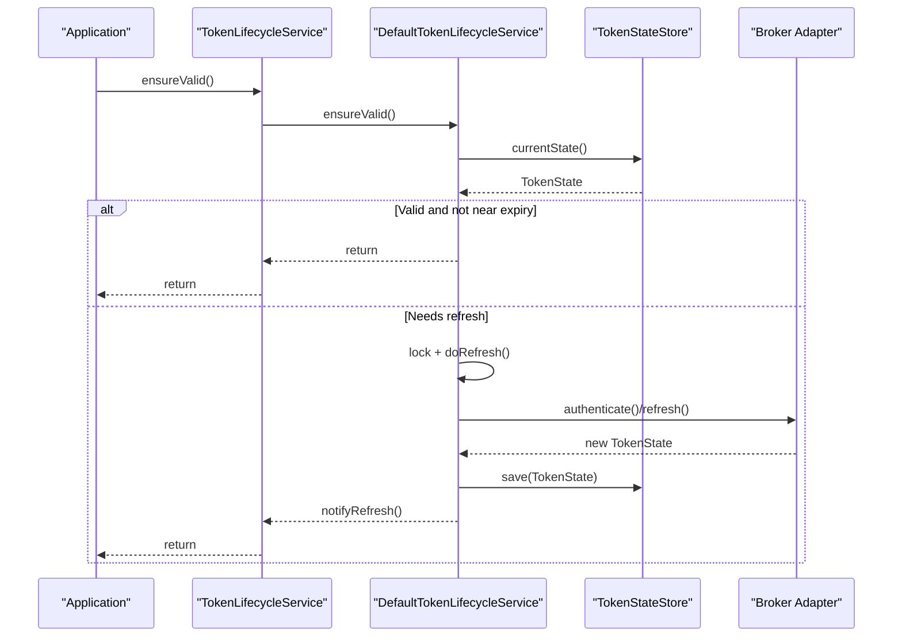
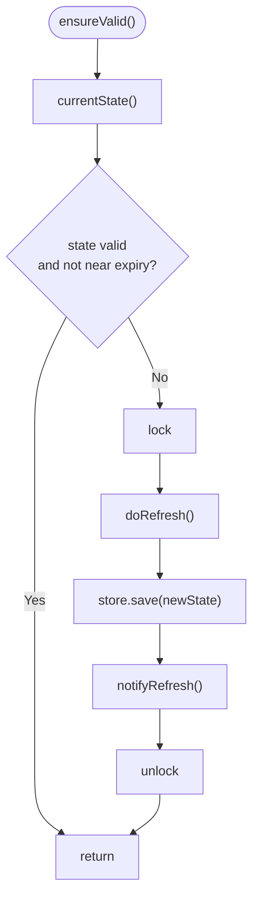
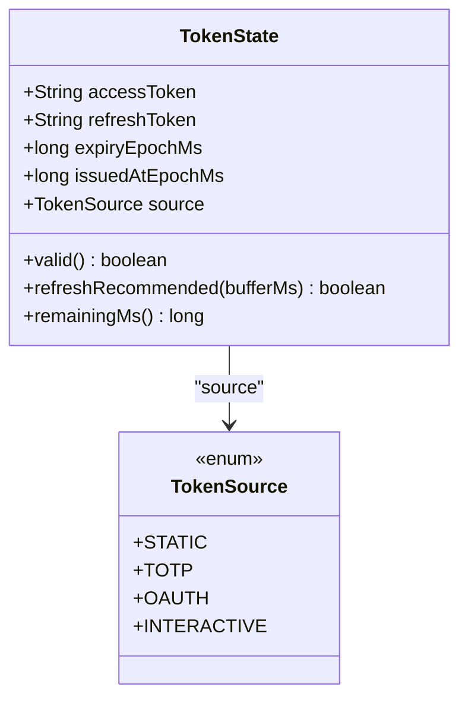
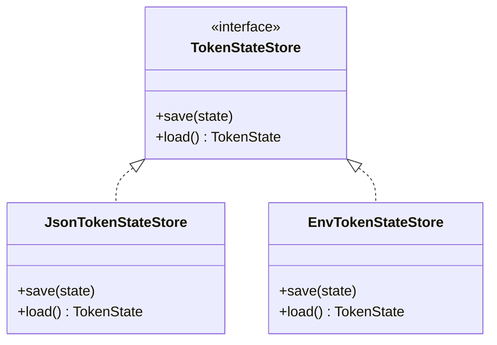
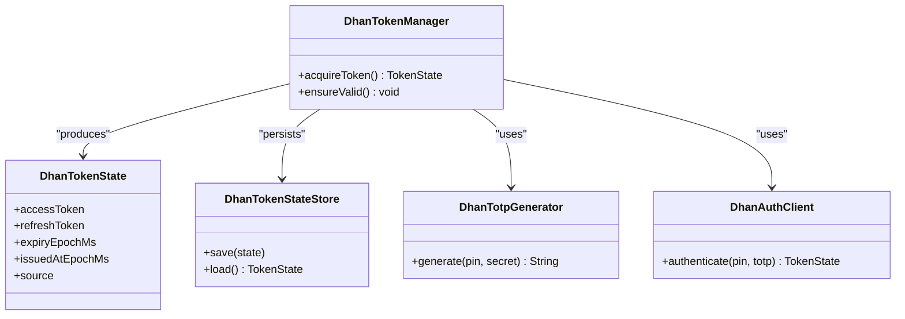
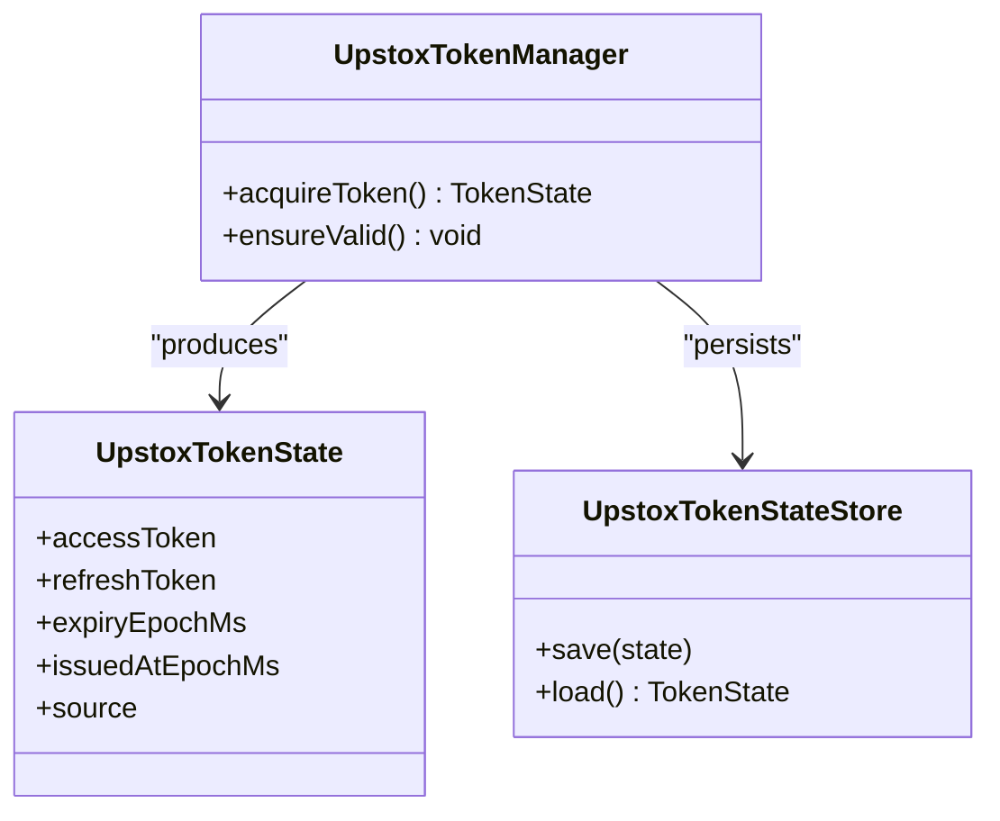
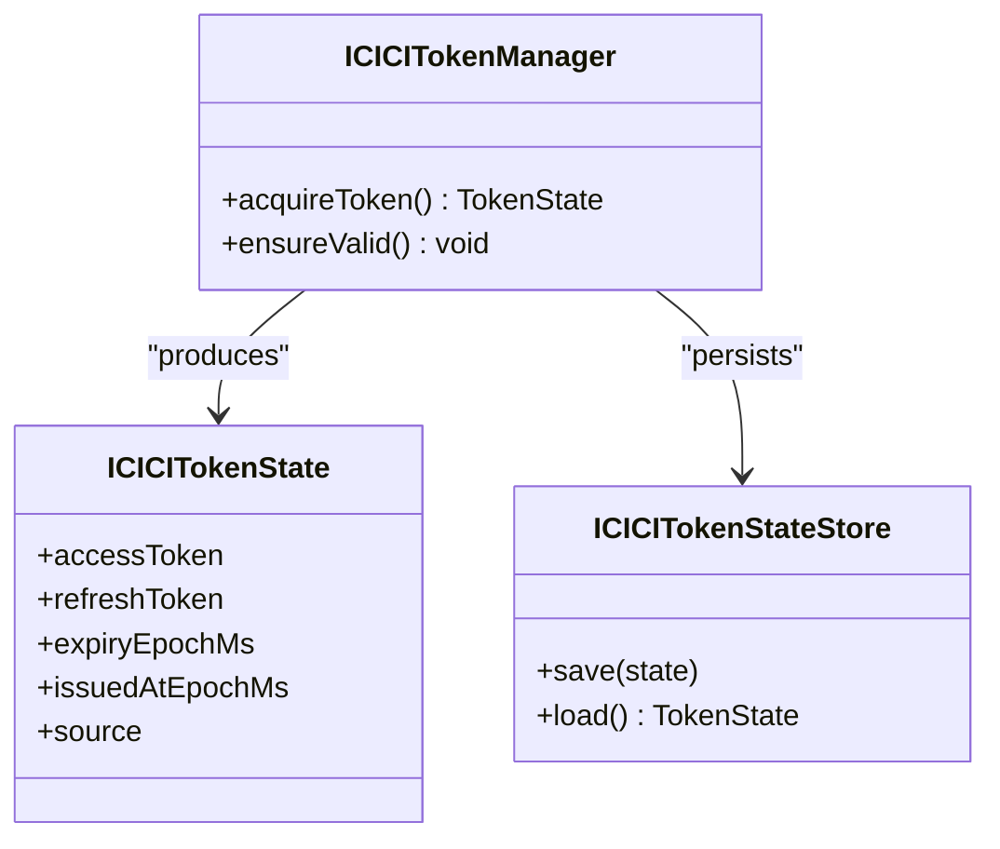
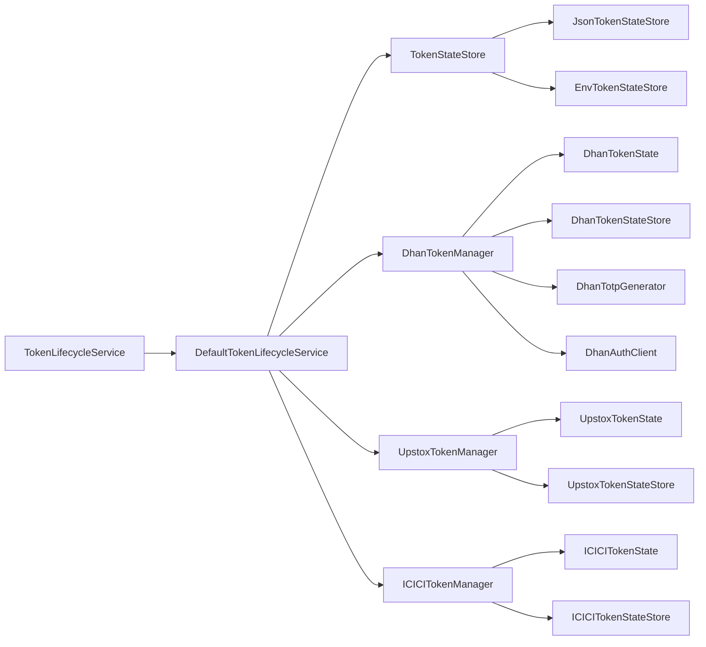
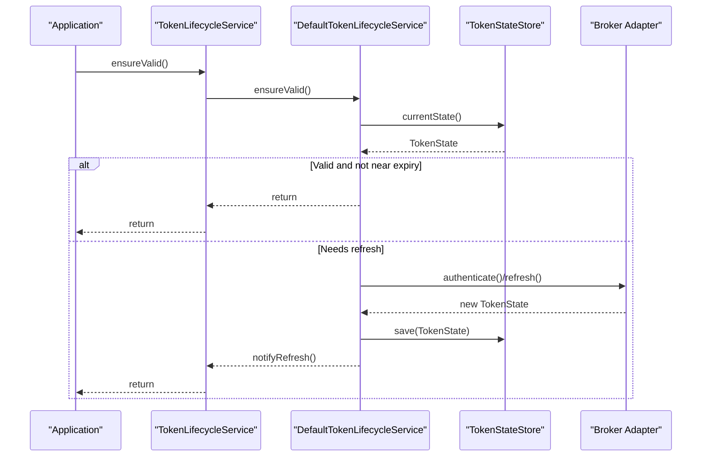

# Authentication and Security

<cite>
**Referenced Files in This Document**
- [TokenLifecycleService.java](file://broker/api/src/main/java/com/tradej/broker/api/auth/TokenLifecycleService.java)
- [TokenState.java](file://broker/api/src/main/java/com/tradej/broker/api/auth/TokenState.java)
- [TokenSource.java](file://broker/api/src/main/java/com/tradej/broker/api/auth/TokenSource.java)
- [TokenLifecycleServiceContractTest.java](file://broker/api/src/testFixtures/java/com/tradej/broker/api/auth/TokenLifecycleServiceContractTest.java)
- [TokenStateTest.java](file://broker/api/src/test/java/com/tradej/broker/api/auth/TokenStateTest.java)
- [DefaultTokenLifecycleService.java](file://broker/core/src/main/java/com/tradej/broker/core/auth/DefaultTokenLifecycleService.java)
- [TokenStateStore.java](file://broker/core/src/main/java/com/tradej/broker/core/auth/TokenStateStore.java)
- [JsonTokenStateStore.java](file://broker/core/src/main/java/com/tradej/broker/core/auth/JsonTokenStateStore.java)
- [EnvTokenStateStore.java](file://broker/core/src/main/java/com/tradej/broker/core/auth/EnvTokenStateStore.java)
- [EncryptedTokenStateStore.java](file://docs/BROKER_INTEGRATION_AUDIT_REPORT.md)
- [BROKER_INTEGRATION_AUDIT_REPORT.md](file://docs/BROKER_INTEGRATION_AUDIT_REPORT.md)
- [DhanTokenManager.java](file://broker/dhan/src/main/java/com/tradej/broker/dhan/auth/DhanTokenManager.java)
- [DhanTokenStateStore.java](file://broker/dhan/src/main/java/com/tradej/broker/dhan/auth/DhanTokenStateStore.java)
- [DhanTokenState.java](file://broker/dhan/src/main/java/com/tradej/broker/dhan/auth/DhanTokenState.java)
- [DhanTotpGenerator.java](file://broker/dhan/src/main/java/com/tradej/broker/dhan/auth/DhanTotpGenerator.java)
- [DhanAuthClient.java](file://broker/dhan/src/main/java/com/tradej/broker/dhan/auth/DhanAuthClient.java)
- [DhanTokenProvider.java](file://broker/dhan/src/main/java/com/tradej/broker/dhan/auth/DhanTokenProvider.java)
- [UpstoxTokenManager.java](file://broker/upstox/src/main/java/com/tradej/broker/upstox/auth/UpstoxTokenManager.java)
- [UpstoxTokenStateStore.java](file://broker/upstox/src/main/java/com/tradej/broker/upstox/auth/UpstoxTokenStateStore.java)
- [UpstoxTokenState.java](file://broker/upstox/src/main/java/com/tradej/broker/upstox/auth/UpstoxTokenState.java)
- [ICICI Token Manager](file://broker/icici/src/main/java/com/tradej/broker/icici/auth/ICICITokenManager.java)
- [ICICI Token State Store](file://broker/icici/src/main/java/com/tradej/broker/icici/auth/ICICITokenStateStore.java)
- [ICICI Token State](file://broker/icici/src/main/java/com/tradej/broker/icici/auth/ICICITokenState.java)
- [application.yml](file://app/src/main/resources/application.yml)
- [application-dhan.yml](file://app/src/main/resources/application-dhan.yml)
- [application-upstox.yml](file://app/src/main/resources/application-upstox.yml)
- [application-icici.yml](file://app/src/main/resources/application-icici.yml)
- [dhan-local.properties.example](file://config/dhan-local.properties.example)
- [upstox-live.properties.example](file://config/upstox-live.properties.example)
- [icici-local.properties.example](file://config/icici-local.properties.example)
- [refresh-dhan-token.sh](file://scripts/refresh-dhan-token.sh)
- [refresh-upstox-token.sh](file://scripts/refresh-upstox-token.sh)
- [refresh-icici-session.sh](file://scripts/refresh-icici-session.sh)
</cite>

## Table of Contents
1. [Introduction](#introduction)
2. [Project Structure](#project-structure)
3. [Core Components](#core-components)
4. [Architecture Overview](#architecture-overview)
5. [Detailed Component Analysis](#detailed-component-analysis)
6. [Dependency Analysis](#dependency-analysis)
7. [Performance Considerations](#performance-considerations)
8. [Troubleshooting Guide](#troubleshooting-guide)
9. [Security Best Practices](#security-best-practices)
10. [Conclusion](#conclusion)

## Introduction
This document explains the authentication and security mechanisms across broker integrations in the Trade-J platform. It covers token lifecycle management, secure credential storage, and authentication flow patterns. It documents the DefaultTokenLifecycleService implementation and broker-specific token managers for Dhan, Upstox, and ICICI Direct. It also details authentication methods, session management, token refresh strategies, practical examples of secure credential handling, environment variable configuration, token state persistence, security best practices, encryption mechanisms, access control patterns, common authentication issues, troubleshooting steps, and security audit considerations.

## Project Structure
Authentication and security are implemented across three layers:
- Broker API abstractions define the token lifecycle contract and shared data models.
- Broker Core provides the default lifecycle service and state stores.
- Broker-specific modules implement authentication flows and state persistence tailored to each broker.

**Diagram sources**
- [TokenLifecycleService.java:1-42](file://broker/api/src/main/java/com/tradej/broker/api/auth/TokenLifecycleService.java#L1-L42)
- [TokenState.java:1-37](file://broker/api/src/main/java/com/tradej/broker/api/auth/TokenState.java#L1-L37)
- [TokenSource.java:1-15](file://broker/api/src/main/java/com/tradej/broker/api/auth/TokenSource.java#L1-L15)
- [DefaultTokenLifecycleService.java](file://broker/core/src/main/java/com/tradej/broker/core/auth/DefaultTokenLifecycleService.java)
- [TokenStateStore.java](file://broker/core/src/main/java/com/tradej/broker/core/auth/TokenStateStore.java)
- [JsonTokenStateStore.java](file://broker/core/src/main/java/com/tradej/broker/core/auth/JsonTokenStateStore.java)
- [EnvTokenStateStore.java](file://broker/core/src/main/java/com/tradej/broker/core/auth/EnvTokenStateStore.java)
- [DhanTokenManager.java](file://broker/dhan/src/main/java/com/tradej/broker/dhan/auth/DhanTokenManager.java)
- [DhanTokenState.java](file://broker/dhan/src/main/java/com/tradej/broker/dhan/auth/DhanTokenState.java)
- [DhanTokenStateStore.java](file://broker/dhan/src/main/java/com/tradej/broker/dhan/auth/DhanTokenStateStore.java)
- [DhanTotpGenerator.java](file://broker/dhan/src/main/java/com/tradej/broker/dhan/auth/DhanTotpGenerator.java)
- [DhanAuthClient.java](file://broker/dhan/src/main/java/com/tradej/broker/dhan/auth/DhanAuthClient.java)
- [UpstoxTokenManager.java](file://broker/upstox/src/main/java/com/tradej/broker/upstox/auth/UpstoxTokenManager.java)
- [UpstoxTokenState.java](file://broker/upstox/src/main/java/com/tradej/broker/upstox/auth/UpstoxTokenState.java)
- [UpstoxTokenStateStore.java](file://broker/upstox/src/main/java/com/tradej/broker/upstox/auth/UpstoxTokenStateStore.java)
- [ICICITokenManager.java](file://broker/icici/src/main/java/com/tradej/broker/icici/auth/ICICITokenManager.java)
- [ICICITokenState.java](file://broker/icici/src/main/java/com/tradej/broker/icici/auth/ICICITokenState.java)
- [ICICITokenStateStore.java](file://broker/icici/src/main/java/com/tradej/broker/icici/auth/ICICITokenStateStore.java)

**Section sources**
- [TokenLifecycleService.java:1-42](file://broker/api/src/main/java/com/tradej/broker/api/auth/TokenLifecycleService.java#L1-L42)
- [DefaultTokenLifecycleService.java](file://broker/core/src/main/java/com/tradej/broker/core/auth/DefaultTokenLifecycleService.java)

## Core Components
This section introduces the foundational authentication abstractions and their roles.

- TokenLifecycleService: Defines the contract for acquiring, refreshing, and validating tokens across brokers. It supports blocking acquisition, asynchronous acquisition, state inspection, and thread-safe validation with refresh logic.
- TokenState: Immutable snapshot containing access token, optional refresh token, issuance and expiry timestamps, and token source.
- TokenSource: Enumerates token origins (STATIC, TOTP, OAUTH, INTERACTIVE).
- DefaultTokenLifecycleService: Implements the core token lifecycle orchestration, including state retrieval, validity checks, refresh coordination, and persistence notifications.
- TokenStateStore: Interface for persisting and loading token state; JSON and environment-backed implementations are provided.

Key behaviors:
- Thread-safety: Double-checked locking and synchronized refresh ensure safe concurrent access.
- Proactive refresh: Uses a configurable buffer to decide whether to refresh before expiry.
- Persistence: Saves refreshed state to the configured store and notifies listeners.

**Section sources**
- [TokenLifecycleService.java:1-42](file://broker/api/src/main/java/com/tradej/broker/api/auth/TokenLifecycleService.java#L1-L42)
- [TokenState.java:1-37](file://broker/api/src/main/java/com/tradej/broker/api/auth/TokenState.java#L1-L37)
- [TokenSource.java:1-15](file://broker/api/src/main/java/com/tradej/broker/api/auth/TokenSource.java#L1-L15)
- [DefaultTokenLifecycleService.java](file://broker/core/src/main/java/com/tradej/broker/core/auth/DefaultTokenLifecycleService.java)
- [TokenStateStore.java](file://broker/core/src/main/java/com/tradej/broker/core/auth/TokenStateStore.java)
- [JsonTokenStateStore.java](file://broker/core/src/main/java/com/tradej/broker/core/auth/JsonTokenStateStore.java)
- [EnvTokenStateStore.java](file://broker/core/src/main/java/com/tradej/broker/core/auth/EnvTokenStateStore.java)

## Architecture Overview
The authentication architecture separates concerns between the generic lifecycle service and broker-specific implementations. The DefaultTokenLifecycleService coordinates token availability and persistence, while each broker adapter handles its own authentication flow and state management.

**Diagram sources**
- [TokenLifecycleService.java:18-42](file://broker/api/src/main/java/com/tradej/broker/api/auth/TokenLifecycleService.java#L18-L42)
- [DefaultTokenLifecycleService.java](file://broker/core/src/main/java/com/tradej/broker/core/auth/DefaultTokenLifecycleService.java)
- [TokenStateStore.java](file://broker/core/src/main/java/com/tradej/broker/core/auth/TokenStateStore.java)

## Detailed Component Analysis

### DefaultTokenLifecycleService
The DefaultTokenLifecycleService orchestrates token lifecycle operations:
- Initialization: Creates a lock and initializes state from the store.
- ensureValid(): Performs a double-checked validity check and triggers refresh under contention and expiry conditions.
- acquireToken()/acquireTokenAsync(): Provide initial token acquisition for first-time setup.
- Persistence: Saves refreshed state and notifies observers after successful refresh.

Security and reliability features:
- Double-checked locking prevents redundant refreshes.
- Synchronized refresh ensures mutual exclusion during refresh operations.
- Audit guidance: The integration audit report identifies a critical gap—no cooldown on failed refresh attempts—which could lead to refresh storms and rate limit exhaustion.

**Diagram sources**
- [DefaultTokenLifecycleService.java](file://broker/core/src/main/java/com/tradej/broker/core/auth/DefaultTokenLifecycleService.java)

**Section sources**
- [DefaultTokenLifecycleService.java](file://broker/core/src/main/java/com/tradej/broker/core/auth/DefaultTokenLifecycleService.java)
- [BROKER_INTEGRATION_AUDIT_REPORT.md:147-179](file://docs/BROKER_INTEGRATION_AUDIT_REPORT.md#L147-L179)

### Token State Models
TokenState encapsulates immutable token metadata and validity helpers:
- valid(): True if not expired.
- refreshRecommended(bufferMs): Determines if a refresh should be attempted based on remaining lifetime and token lifespan relative to the buffer.
- remainingMs(): Time until expiry.

**Diagram sources**
- [TokenState.java:1-37](file://broker/api/src/main/java/com/tradej/broker/api/auth/TokenState.java#L1-L37)
- [TokenSource.java:1-15](file://broker/api/src/main/java/com/tradej/broker/api/auth/TokenSource.java#L1-L15)

**Section sources**
- [TokenState.java:1-37](file://broker/api/src/main/java/com/tradej/broker/api/auth/TokenState.java#L1-L37)
- [TokenSource.java:1-15](file://broker/api/src/main/java/com/tradej/broker/api/auth/TokenSource.java#L1-L15)
- [TokenStateTest.java:1-39](file://broker/api/src/test/java/com/tradej/broker/api/auth/TokenStateTest.java#L1-L39)

### Token State Stores
Two concrete stores implement persistence:
- JsonTokenStateStore: Serializes TokenState to JSON and writes to disk.
- EnvTokenStateStore: Reads/writes token state from environment variables for ephemeral or containerized deployments.

**Diagram sources**
- [TokenStateStore.java](file://broker/core/src/main/java/com/tradej/broker/core/auth/TokenStateStore.java)
- [JsonTokenStateStore.java](file://broker/core/src/main/java/com/tradej/broker/core/auth/JsonTokenStateStore.java)
- [EnvTokenStateStore.java](file://broker/core/src/main/java/com/tradej/broker/core/auth/EnvTokenStateStore.java)

**Section sources**
- [TokenStateStore.java](file://broker/core/src/main/java/com/tradej/broker/core/auth/TokenStateStore.java)
- [JsonTokenStateStore.java](file://broker/core/src/main/java/com/tradej/broker/core/auth/JsonTokenStateStore.java)
- [EnvTokenStateStore.java](file://broker/core/src/main/java/com/tradej/broker/core/auth/EnvTokenStateStore.java)

### Dhan Integration
Dhan uses TOTP-based authentication and a dedicated token manager:
- DhanTokenManager: Orchestrates token acquisition and refresh using TOTP generation and broker APIs.
- DhanTokenState: Extends TokenState with Dhan-specific fields.
- DhanTokenStateStore: Persists Dhan token state.
- DhanTotpGenerator: Generates TOTP values for authentication.
- DhanAuthClient: Handles Dhan-specific authentication requests.

**Diagram sources**
- [DhanTokenManager.java](file://broker/dhan/src/main/java/com/tradej/broker/dhan/auth/DhanTokenManager.java)
- [DhanTokenState.java](file://broker/dhan/src/main/java/com/tradej/broker/dhan/auth/DhanTokenState.java)
- [DhanTokenStateStore.java](file://broker/dhan/src/main/java/com/tradej/broker/dhan/auth/DhanTokenStateStore.java)
- [DhanTotpGenerator.java](file://broker/dhan/src/main/java/com/tradej/broker/dhan/auth/DhanTotpGenerator.java)
- [DhanAuthClient.java](file://broker/dhan/src/main/java/com/tradej/broker/dhan/auth/DhanAuthClient.java)

**Section sources**
- [DhanTokenManager.java](file://broker/dhan/src/main/java/com/tradej/broker/dhan/auth/DhanTokenManager.java)
- [DhanTokenState.java](file://broker/dhan/src/main/java/com/tradej/broker/dhan/auth/DhanTokenState.java)
- [DhanTokenStateStore.java](file://broker/dhan/src/main/java/com/tradej/broker/dhan/auth/DhanTokenStateStore.java)
- [DhanTotpGenerator.java](file://broker/dhan/src/main/java/com/tradej/broker/dhan/auth/DhanTotpGenerator.java)
- [DhanAuthClient.java](file://broker/dhan/src/main/java/com/tradej/broker/dhan/auth/DhanAuthClient.java)

### Upstox Integration
Upstox uses OAuth 2.0 Authorization Code with PKCE and refresh token rotation:
- UpstoxTokenManager: Manages OAuth flow and refresh cycles.
- UpstoxTokenState: Captures OAuth-specific token metadata.
- UpstoxTokenStateStore: Persists Upstox token state.

**Diagram sources**
- [UpstoxTokenManager.java](file://broker/upstox/src/main/java/com/tradej/broker/upstox/auth/UpstoxTokenManager.java)
- [UpstoxTokenState.java](file://broker/upstox/src/main/java/com/tradej/broker/upstox/auth/UpstoxTokenState.java)
- [UpstoxTokenStateStore.java](file://broker/upstox/src/main/java/com/tradej/broker/upstox/auth/UpstoxTokenStateStore.java)

**Section sources**
- [UpstoxTokenManager.java](file://broker/upstox/src/main/java/com/tradej/broker/upstox/auth/UpstoxTokenManager.java)
- [UpstoxTokenState.java](file://broker/upstox/src/main/java/com/tradej/broker/upstox/auth/UpstoxTokenState.java)
- [UpstoxTokenStateStore.java](file://broker/upstox/src/main/java/com/tradej/broker/upstox/auth/UpstoxTokenStateStore.java)

### ICICI Direct Integration
ICICI Direct follows a session-based authentication pattern:
- ICICITokenManager: Manages session establishment and refresh.
- ICICITokenState: Captures session metadata.
- ICICITokenStateStore: Persists session state.

**Diagram sources**
- [ICICITokenManager.java](file://broker/icici/src/main/java/com/tradej/broker/icici/auth/ICICITokenManager.java)
- [ICICITokenState.java](file://broker/icici/src/main/java/com/tradej/broker/icici/auth/ICICITokenState.java)
- [ICICITokenStateStore.java](file://broker/icici/src/main/java/com/tradej/broker/icici/auth/ICICITokenStateStore.java)

**Section sources**
- [ICICITokenManager.java](file://broker/icici/src/main/java/com/tradej/broker/icici/auth/ICICITokenManager.java)
- [ICICITokenState.java](file://broker/icici/src/main/java/com/tradej/broker/icici/auth/ICICITokenState.java)
- [ICICITokenStateStore.java](file://broker/icici/src/main/java/com/tradej/broker/icici/auth/ICICITokenStateStore.java)

## Dependency Analysis
The authentication subsystem exhibits clear separation of concerns:
- Broker API defines contracts consumed by the core and adapters.
- DefaultTokenLifecycleService depends on TokenStateStore implementations.
- Broker adapters depend on their respective TokenManagers and TokenStateStores.

**Diagram sources**
- [TokenLifecycleService.java:1-42](file://broker/api/src/main/java/com/tradej/broker/api/auth/TokenLifecycleService.java#L1-L42)
- [DefaultTokenLifecycleService.java](file://broker/core/src/main/java/com/tradej/broker/core/auth/DefaultTokenLifecycleService.java)
- [TokenStateStore.java](file://broker/core/src/main/java/com/tradej/broker/core/auth/TokenStateStore.java)
- [JsonTokenStateStore.java](file://broker/core/src/main/java/com/tradej/broker/core/auth/JsonTokenStateStore.java)
- [EnvTokenStateStore.java](file://broker/core/src/main/java/com/tradej/broker/core/auth/EnvTokenStateStore.java)
- [DhanTokenManager.java](file://broker/dhan/src/main/java/com/tradej/broker/dhan/auth/DhanTokenManager.java)
- [DhanTokenState.java](file://broker/dhan/src/main/java/com/tradej/broker/dhan/auth/DhanTokenState.java)
- [DhanTokenStateStore.java](file://broker/dhan/src/main/java/com/tradej/broker/dhan/auth/DhanTokenStateStore.java)
- [DhanTotpGenerator.java](file://broker/dhan/src/main/java/com/tradej/broker/dhan/auth/DhanTotpGenerator.java)
- [DhanAuthClient.java](file://broker/dhan/src/main/java/com/tradej/broker/dhan/auth/DhanAuthClient.java)
- [UpstoxTokenManager.java](file://broker/upstox/src/main/java/com/tradej/broker/upstox/auth/UpstoxTokenManager.java)
- [UpstoxTokenState.java](file://broker/upstox/src/main/java/com/tradej/broker/upstox/auth/UpstoxTokenState.java)
- [UpstoxTokenStateStore.java](file://broker/upstox/src/main/java/com/tradej/broker/upstox/auth/UpstoxTokenStateStore.java)
- [ICICITokenManager.java](file://broker/icici/src/main/java/com/tradej/broker/icici/auth/ICICITokenManager.java)
- [ICICITokenState.java](file://broker/icici/src/main/java/com/tradej/broker/icici/auth/ICICITokenState.java)
- [ICICITokenStateStore.java](file://broker/icici/src/main/java/com/tradej/broker/icici/auth/ICICITokenStateStore.java)

**Section sources**
- [TokenLifecycleService.java:1-42](file://broker/api/src/main/java/com/tradej/broker/api/auth/TokenLifecycleService.java#L1-L42)
- [DefaultTokenLifecycleService.java](file://broker/core/src/main/java/com/tradej/broker/core/auth/DefaultTokenLifecycleService.java)

## Performance Considerations
- Concurrency: Double-checked locking minimizes lock contention while ensuring correctness.
- Proactive refresh: Using a buffer reduces latency spikes by refreshing before expiry.
- Persistence overhead: JSON serialization and disk I/O should be considered in high-throughput scenarios.
- Rate limiting: The audit report highlights the risk of refresh storms when failures occur without cooldown; implement a backoff mechanism to protect broker APIs.

[No sources needed since this section provides general guidance]

## Troubleshooting Guide
Common authentication issues and remedies:
- Expired or near-expiry tokens: Ensure ensureValid() is called before each broker API call; verify refresh buffer configuration.
- Refresh storms: Implement cooldown logic after failed refresh attempts to avoid overwhelming the broker.
- State corruption: Verify JSON store integrity and environment variable encoding; consider encrypted storage for sensitive credentials.
- Broker-specific errors: Inspect Dhan TOTP generation, Upstox OAuth callbacks, and ICICI session establishment logs.

Practical steps:
- Validate token state persistence: Confirm that TokenStateStore.save() and load() work correctly for the chosen backend.
- Environment configuration: Use environment variables for ephemeral deployments; ensure proper masking and access controls.
- Scripts: Utilize refresh scripts to regenerate tokens or sessions when needed.

**Section sources**
- [BROKER_INTEGRATION_AUDIT_REPORT.md:147-179](file://docs/BROKER_INTEGRATION_AUDIT_REPORT.md#L147-L179)
- [refresh-dhan-token.sh](file://scripts/refresh-dhan-token.sh)
- [refresh-upstox-token.sh](file://scripts/refresh-upstox-token.sh)
- [refresh-icici-session.sh](file://scripts/refresh-icici-session.sh)

## Security Best Practices
- Encryption: Use EncryptedTokenStateStore to protect persisted tokens with AES-GCM and PBKDF2-derived keys. Ensure restrictive file permissions on stored artifacts.
- Access control: Limit access to token stores and environment variables. Enforce least privilege and principle of minimal exposure.
- Secrets management: Prefer environment variables or secure secret stores for broker credentials; avoid hardcoding secrets.
- Audit logging: Log authentication events and refresh attempts with appropriate sensitivity; avoid logging raw tokens.
- Session hygiene: Rotate refresh tokens and invalidate stale sessions. Monitor for unusual activity patterns.

**Section sources**
- [EncryptedTokenStateStore.java:1105-1149](file://docs/BROKER_INTEGRATION_AUDIT_REPORT.md#L1105-L1149)
- [BROKER_INTEGRATION_AUDIT_REPORT.md:147-179](file://docs/BROKER_INTEGRATION_AUDIT_REPORT.md#L147-L179)

## Configuration Examples

### Environment Variables and Properties
Configure broker credentials and token storage via environment variables and property files:
- Dhan: Use local properties for sandbox/live environments.
- Upstox: Configure OAuth client credentials and redirect URIs.
- ICICI: Provide session parameters and endpoint configurations.

Example configuration files:
- [dhan-local.properties.example](file://config/dhan-local.properties.example)
- [upstox-live.properties.example](file://config/upstox-live.properties.example)
- [icici-local.properties.example](file://config/icici-local.properties.example)

### Application Profiles
Select broker profiles via Spring Boot application YAML files:
- [application.yml](file://app/src/main/resources/application.yml)
- [application-dhan.yml](file://app/src/main/resources/application-dhan.yml)
- [application-upstox.yml](file://app/src/main/resources/application-upstox.yml)
- [application-icici.yml](file://app/src/main/resources/application-icici.yml)

These profiles enable broker-specific beans, endpoints, and security policies.

**Section sources**
- [dhan-local.properties.example](file://config/dhan-local.properties.example)
- [upstox-live.properties.example](file://config/upstox-live.properties.example)
- [icici-local.properties.example](file://config/icici-local.properties.example)
- [application.yml](file://app/src/main/resources/application.yml)
- [application-dhan.yml](file://app/src/main/resources/application-dhan.yml)
- [application-upstox.yml](file://app/src/main/resources/application-upstox.yml)
- [application-icici.yml](file://app/src/main/resources/application-icici.yml)

## Token Lifecycle Sequence
The end-to-end token lifecycle across all brokers follows a consistent pattern:
- ensureValid() checks current state and initiates refresh if needed.
- The adapter authenticates or refreshes via broker APIs.
- The new TokenState is saved to the store and listeners are notified.

**Diagram sources**
- [TokenLifecycleService.java:18-42](file://broker/api/src/main/java/com/tradej/broker/api/auth/TokenLifecycleService.java#L18-L42)
- [DefaultTokenLifecycleService.java](file://broker/core/src/main/java/com/tradej/broker/core/auth/DefaultTokenLifecycleService.java)
- [TokenStateStore.java](file://broker/core/src/main/java/com/tradej/broker/core/auth/TokenStateStore.java)

## Conclusion
The Trade-J authentication framework provides a robust, extensible foundation for managing tokens across multiple broker integrations. The DefaultTokenLifecycleService centralizes lifecycle orchestration, while broker-specific adapters encapsulate vendor-specific flows. By combining secure state stores, proactive refresh strategies, and strong access control practices, the system maintains reliability and security. The integration audit report highlights critical areas for improvement, particularly around refresh storm protection, which should be addressed to enhance resilience against broker-side rate limits and potential account security risks.