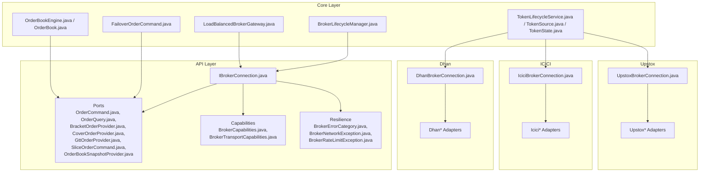
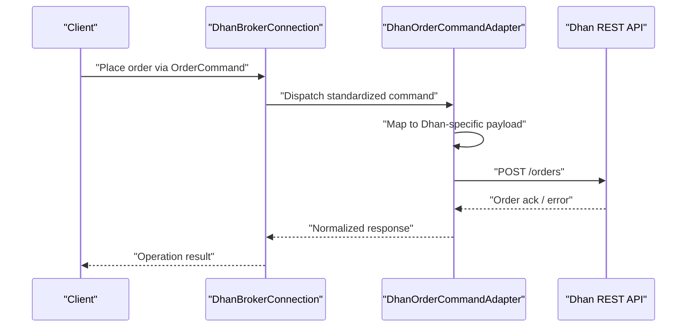
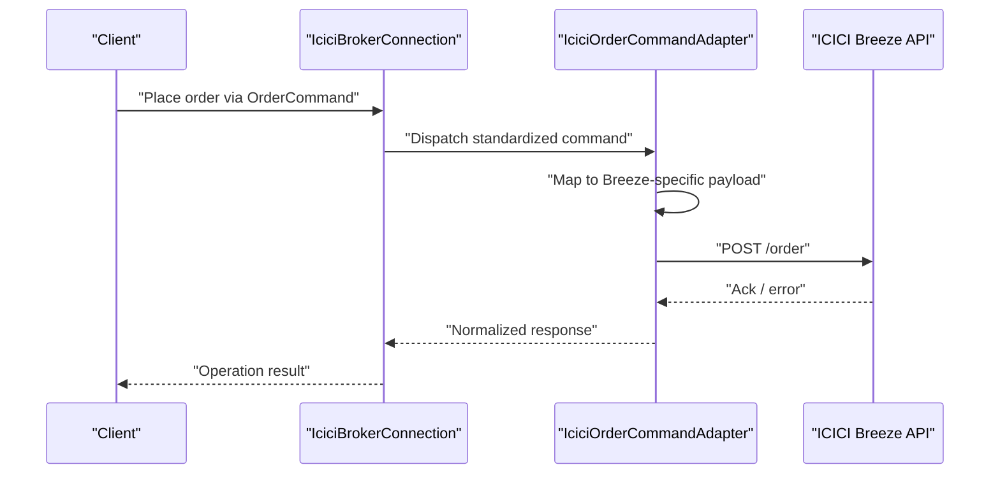
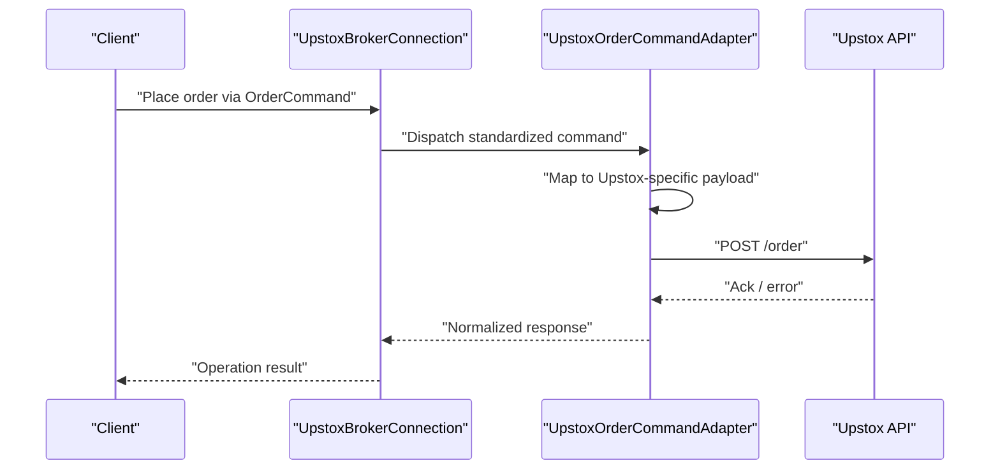
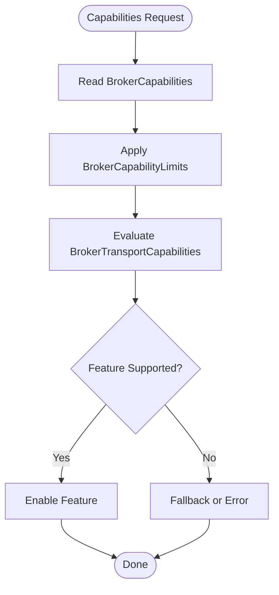
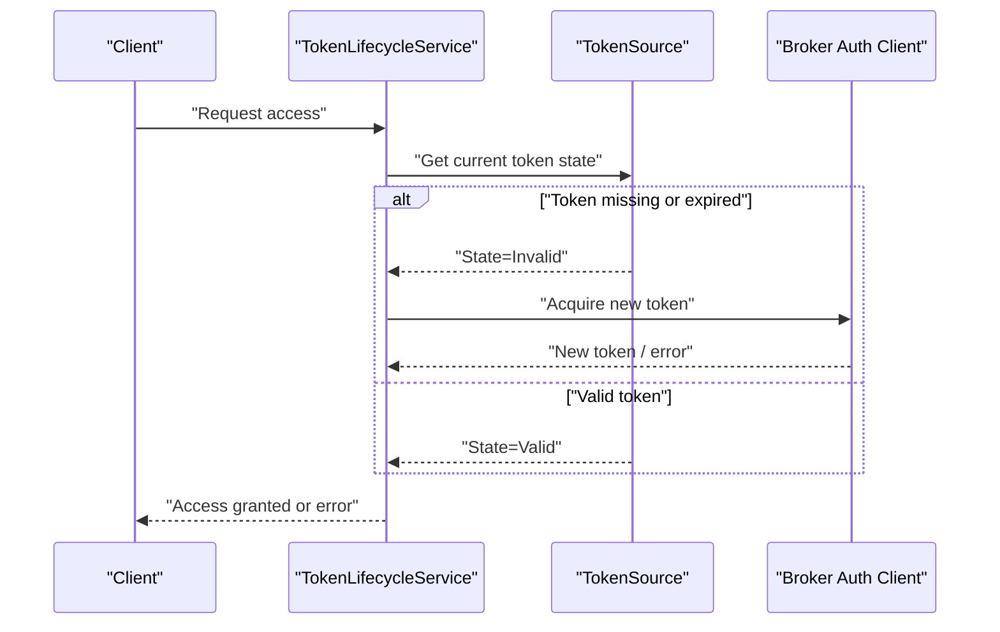
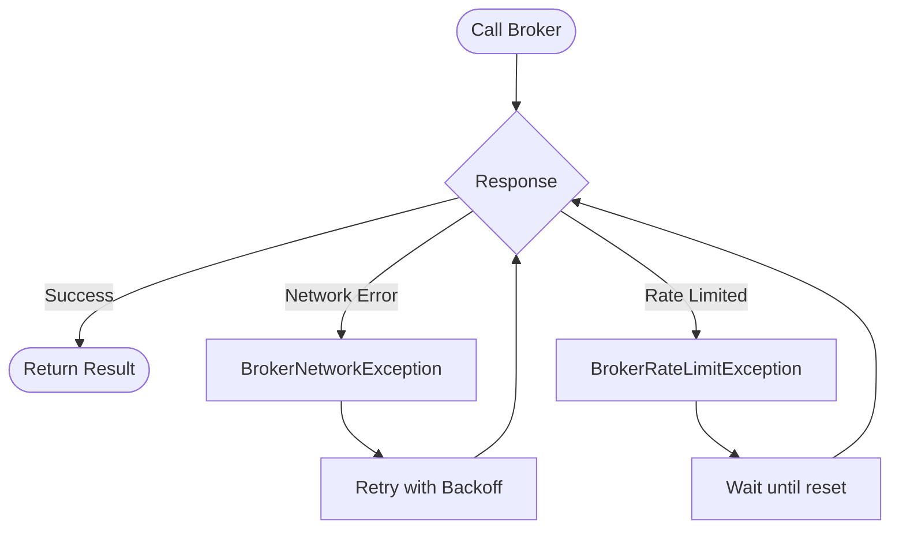
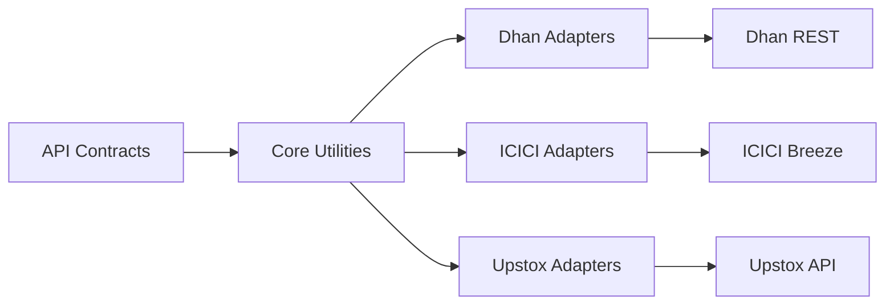

# Broker Adapters

<cite>
**Referenced Files in This Document**
- [IBrokerConnection.java](file://broker/api/src/main/java/com/tradej/broker/api/IBrokerConnection.java)
- [BrokerCapabilities.java](file://broker/api/src/main/java/com/tradej/broker/api/model/BrokerCapabilities.java)
- [BrokerTransportCapabilities.java](file://broker/api/src/main/java/com/tradej/broker/api/model/BrokerTransportCapabilities.java)
- [BracketOrderProvider.java](file://broker/api/src/main/java/com/tradej/broker/api/port/BracketOrderProvider.java)
- [CoverOrderProvider.java](file://broker/api/src/main/java/com/tradej/broker/api/port/CoverOrderProvider.java)
- [GttOrderProvider.java](file://broker/api/src/main/java/com/tradej/broker/api/port/GttOrderProvider.java)
- [OrderBookSnapshotProvider.java](file://broker/api/src/main/java/com/tradej/broker/api/port/OrderBookSnapshotProvider.java)
- [OrderCommand.java](file://broker/api/src/main/java/com/tradej/broker/api/port/OrderCommand.java)
- [OrderQuery.java](file://broker/api/src/main/java/com/tradej/broker/api/port/OrderQuery.java)
- [SliceOrderCommand.java](file://broker/api/src/main/java/com/tradej/broker/api/port/SliceOrderCommand.java)
- [BrokerErrorCategory.java](file://broker/api/src/main/java/com/tradej/broker/api/resilience/BrokerErrorCategory.java)
- [BrokerNetworkException.java](file://broker/api/src/main/java/com/tradej/broker/api/exceptions/BrokerNetworkException.java)
- [BrokerRateLimitException.java](file://broker/api/src/main/java/com/tradej/broker/api/exceptions/BrokerRateLimitException.java)
- [DhanBrokerConnection.java](file://broker/dhan/src/main/java/com/tradej/broker/dhan/DhanBrokerConnection.java)
- [DhanBaseRestAdapter.java](file://broker/dhan/src/main/java/com/tradej/broker/dhan/adapter/DhanBaseRestAdapter.java)
- [DhanBracketOrderAdapter.java](file://broker/dhan/src/main/java/com/tradej/broker/dhan/adapter/DhanBracketOrderAdapter.java)
- [DhanCoverOrderAdapter.java](file://broker/dhan/src/main/java/com/tradej/broker/dhan/adapter/DhanCoverOrderAdapter.java)
- [DhanGttOrderAdapter.java](file://broker/dhan/src/main/java/com/tradej/broker/dhan/adapter/DhanGttOrderAdapter.java)
- [DhanMarketDataProvider.java](file://broker/dhan/src/main/java/com/tradej/broker/dhan/adapter/DhanMarketDataProvider.java)
- [DhanPortfolioProvider.java](file://broker/dhan/src/main/java/com/tradej/broker/dhan/adapter/DhanPortfolioProvider.java)
- [DhanOrderCommandAdapter.java](file://broker/dhan/src/main/java/com/tradej/broker/dhan/adapter/DhanOrderCommandAdapter.java)
- [DhanOrderQueryAdapter.java](file://broker/dhan/src/main/java/com/tradej/broker/dhan/adapter/DhanOrderQueryAdapter.java)
- [DhanSliceOrderAdapter.java](file://broker/dhan/src/main/java/com/tradej/broker/dhan/adapter/DhanSliceOrderAdapter.java)
- [DhanMarginProvider.java](file://broker/dhan/src/main/java/com/tradej/broker/dhan/adapter/DhanMarginProvider.java)
- [DhanSessionRiskProvider.java](file://broker/dhan/src/main/java/com/tradej/broker/dhan/adapter/DhanSessionRiskProvider.java)
- [DhanMarketStatusProvider.java](file://broker/dhan/src/main/java/com/tradej/broker/dhan/adapter/DhanMarketStatusProvider.java)
- [DhanConditionalAlertProvider.java](file://broker/dhan/src/main/java/com/tradej/broker/dhan/adapter/DhanConditionalAlertProvider.java)
- [DhanOptionsAdapter.java](file://broker/dhan/src/main/java/com/tradej/broker/dhan/adapter/DhanOptionsAdapter.java)
- [DhanFuturesAdapter.java](file://broker/dhan/src/main/java/com/tradej/broker/dhan/adapter/DhanFuturesAdapter.java)
- [DhanInstrumentResolver.java](file://broker/dhan/src/main/java/com/tradej/broker/dhan/adapter/DhanInstrumentResolver.java)
- [InMemoryInstrumentResolver.java](file://broker/dhan/src/main/java/com/tradej/broker/dhan/adapter/InMemoryInstrumentResolver.java)
- [DhanAuthClient.java](file://broker/dhan/src/main/java/com/tradej/broker/dhan/auth/DhanAuthClient.java)
- [DhanAuthRejectedException.java](file://broker/dhan/src/main/java/com/tradej/broker/dhan/exceptions/DhanAuthRejectedException.java)
- [IciciBrokerConnection.java](file://broker/icici/src/main/java/com/tradej/broker/icici/IciciBrokerConnection.java)
- [IciciBracketOrderAdapter.java](file://broker/icici/src/main/java/com/tradej/broker/icici/adapter/IciciBracketOrderAdapter.java)
- [IciciCoverOrderAdapter.java](file://broker/icici/src/main/java/com/tradej/broker/icici/adapter/IciciCoverOrderAdapter.java)
- [IciciGttOrderAdapter.java](file://broker/icici/src/main/java/com/tradej/broker/icici/adapter/IciciGttOrderAdapter.java)
- [IciciMarketDataProvider.java](file://broker/icici/src/main/java/com/tradej/broker/icici/adapter/IciciMarketDataProvider.java)
- [IciciPortfolioProvider.java](file://broker/icici/src/main/java/com/tradej/broker/icici/adapter/IciciPortfolioProvider.java)
- [IciciOrderCommandAdapter.java](file://broker/icici/src/main/java/com/tradej/broker/icici/adapter/IciciOrderCommandAdapter.java)
- [IciciOrderQueryAdapter.java](file://broker/icici/src/main/java/com/tradej/broker/icici/adapter/IciciOrderQueryAdapter.java)
- [IciciSliceOrderAdapter.java](file://broker/icici/src/main/java/com/tradej/broker/icici/adapter/IciciSliceOrderAdapter.java)
- [IciciMarginProvider.java](file://broker/icici/src/main/java/com/tradej/broker/icici/adapter/IciciMarginProvider.java)
- [IciciMarketStatusProvider.java](file://broker/icici/src/main/java/com/tradej/broker/icici/adapter/IciciMarketStatusProvider.java)
- [IciciOptionsProvider.java](file://broker/icici/src/main/java/com/tradej/broker/icici/adapter/IciciOptionsProvider.java)
- [IciciFuturesProvider.java](file://broker/icici/src/main/java/com/tradej/broker/icici/adapter/IciciFuturesProvider.java)
- [IciciOrderExchangeResolver.java](file://broker/icici/src/main/java/com/tradej/broker/icici/adapter/IciciOrderExchangeResolver.java)
- [BreezeSession.java](file://broker/icici/src/main/java/com/tradej/broker/icici/auth/BreezeSession.java)
- [BreezeApiSessionRedirectServer.java](file://broker/icici/src/main/java/com/tradej/broker/icici/auth/BreezeApiSessionRedirectServer.java)
- [BreezeApiSessionUrlParser.java](file://broker/icici/src/main/java/com/tradej/broker/icici/auth/BreezeApiSessionUrlParser.java)
- [BreezeBrowserAuthException.java](file://broker/icici/src/main/java/com/tradej/broker/icici/auth/BreezeBrowserAuthException.java)
- [BreezeBrowserSessionCapture.java](file://broker/icici/src/main/java/com/tradej/broker/icici/auth/BreezeBrowserSessionCapture.java)
- [BreezeSessionExchange.java](file://broker/icici/src/main/java/com/tradej/broker/icici/auth/BreezeSessionExchange.java)
- [UpstoxBrokerConnection.java](file://broker/upstox/src/main/java/com/tradej/broker/upstox/UpstoxBrokerConnection.java)
- [UpstoxMarketDataProvider.java](file://broker/upstox/src/main/java/com/tradej/broker/upstox/adapter/UpstoxMarketDataProvider.java)
- [UpstoxPortfolioProvider.java](file://broker/upstox/src/main/java/com/tradej/broker/upstox/adapter/UpstoxPortfolioProvider.java)
- [UpstoxOrderCommandAdapter.java](file://broker/upstox/src/main/java/com/tradej/broker/upstox/adapter/UpstoxOrderCommandAdapter.java)
- [UpstoxOrderQueryAdapter.java](file://broker/upstox/src/main/java/com/tradej/broker/upstox/adapter/UpstoxOrderQueryAdapter.java)
- [UpstoxSliceOrderAdapter.java](file://broker/upstox/src/main/java/com/tradej/broker/upstox/adapter/UpstoxSliceOrderAdapter.java)
- [UpstoxMarginProvider.java](file://broker/upstox/src/main/java/com/tradej/broker/upstox/adapter/UpstoxMarginProvider.java)
- [UpstoxMarketStatusProvider.java](file://broker/upstox/src/main/java/com/tradej/broker/upstox/adapter/UpstoxMarketStatusProvider.java)
- [UpstoxOptionsProvider.java](file://broker/upstox/src/main/java/com/tradej/broker/upstox/adapter/UpstoxOptionsProvider.java)
- [UpstoxFuturesProvider.java](file://broker/upstox/src/main/java/com/tradej/broker/upstox/adapter/UpstoxFuturesProvider.java)
- [UpstoxNewsProvider.java](file://broker/upstox/src/main/java/com/tradej/broker/upstox/adapter/UpstoxNewsProvider.java)
- [UpstoxProfileProvider.java](file://broker/upstox/src/main/java/com/tradej/broker/upstox/adapter/UpstoxProfileProvider.java)
- [UpstoxPriceParser.java](file://broker/upstox/src/main/java/com/tradej/broker/upstox/adapter/UpstoxPriceParser.java)
- [UpstoxAnalyticsTokenHolder.java](file://broker/upstox/src/main/java/com/tradej/broker/upstox/auth/UpstoxAnalyticsTokenHolder.java)
- [UpstoxAuthException.java](file://broker/upstox/src/main/java/com/tradej/broker/upstox/auth/UpstoxAuthException.java)
- [UpstoxBearerTokenSource.java](file://broker/upstox/src/main/java/com/tradej/broker/upstox/auth/UpstoxBearerTokenSource.java)
- [UpstoxJwtExpiry.java](file://broker/upstox/src/main/java/com/tradej/broker/upstox/auth/UpstoxJwtExpiry.java)
- [BrokerLifecycleManager.java](file://broker/core/src/main/java/com/tradej/broker/core/startup/BrokerLifecycleManager.java)
- [LoadBalancedBrokerGateway.java](file://broker/core/src/main/java/com/tradej/broker/core/routing/LoadBalancedBrokerGateway.java)
- [FailoverOrderCommand.java](file://broker/core/src/main/java/com/tradej/broker/core/routing/FailoverOrderCommand.java)
- [ObservableOrderCommand.java](file://broker/core/src/main/java/com/tradej/broker/core/observability/ObservableOrderCommand.java)
- [BrokerTimeoutScenario.java](file://broker/core/src/main/java/com/tradej/broker/core/chaos/scenarios/BrokerTimeoutScenario.java)
- [TokenLifecycleService.java](file://broker/api/src/main/java/com/tradej/broker/api/auth/TokenLifecycleService.java)
- [TokenSource.java](file://broker/api/src/main/java/com/tradej/broker/api/auth/TokenSource.java)
- [TokenState.java](file://broker/api/src/main/java/com/tradej/broker/api/auth/TokenState.java)
- [BrokerStartupContributor.java](file://broker/api/src/main/java/com/tradej/broker/api/startup/BrokerStartupContributor.java)
- [BrokerStartupValidator.java](file://broker/core/src/main/java/com/tradej/broker/core/startup/BrokerStartupValidator.java)
- [BrokerCapabilityLimits.java](file://broker/core/src/main/java/com/tradej/broker/core/capability/BrokerCapabilityLimits.java)
- [OrderBookEngine.java](file://broker/core/src/main/java/com/tradej/broker/core/depth/OrderBookEngine.java)
- [OrderBook.java](file://broker/core/src/main/java/com/tradej/broker/core/depth/OrderBook.java)
- [BROKER_CAPABILITY_MATRIX.md](file://docs/BROKER_CAPABILITY_MATRIX.md)
- [DHAN_SAFETY_RULES_PLAN.md](file://broker/dhan/DHAN_SAFETY_RULES_PLAN.md)
- [ICICI_BREEZE_REMEDIATION_PLAN.md](file://plans/ICICI_BREEZE_REMEDIATION_PLAN.md)
- [UPSTOX_API_GAP_ANALYSIS.md](file://docs/UPSTOX_API_GAP_ANALYSIS.md)
- [BROKER_GATEWAY_ARCHITECTURE_REVIEW.md](file://docs/BROKER_GATEWAY_ARCHITECTURE_REVIEW.md)
- [BROKER_INTEGRATION_AUDIT_REPORT.md](file://docs/BROKER_INTEGRATION_AUDIT_REPORT.md)
- [BROKER_HARDENING_PLAN.md](file://docs/BROKER_HARDENING_PLAN.md)
- [BROKER_CERTIFICATION_REPORT.md](file://docs/BROKER_CERTIFICATION_REPORT.md)
- [08_RATE_LIMIT_ANALYSIS.md](file://docs/reports/BROKER_CERTIFICATION_REPORT/08_RATE_LIMIT_ANALYSIS.md)
- [01_DHAN_MARKET_DATA_CERTIFICATION_REPORT.md](file://docs/reports/BROKER_CERTIFICATION_REPORT/01_DHAN_MARKET_DATA_CERTIFICATION_REPORT.md)
- [02_UPSTOX_MARKET_DATA_CERTIFICATION_REPORT.md](file://docs/reports/BROKER_CERTIFICATION_REPORT/02_UPSTOX_MARKET_DATA_CERTIFICATION_REPORT.md)
- [03_ICICI_MARKET_DATA_CERTIFICATION_REPORT.md](file://docs/reports/BROKER_CERTIFICATION_REPORT/03_ICICI_MARKET_DATA_CERTIFICATION_REPORT.md)
- [04_CAPABILITY_MATRIX.md](file://docs/reports/BROKER_CERTIFICATION_REPORT/04_CAPABILITY_MATRIX.md)
- [05_SCALING_REPORT.md](file://docs/reports/BROKER_CERTIFICATION_REPORT/05_SCALING_REPORT.md)
- [06_SUBSCRIPTION_MANAGEMENT_REPORT.md](file://docs/reports/BROKER_CERTIFICATION_REPORT/06_SUBSCRIPTION_MANAGEMENT_REPORT.md)
- [07_RESUBSCRIPTION_REPORT.md](file://docs/reports/BROKER_CERTIFICATION_REPORT/07_RESUBSCRIPTION_REPORT.md)
- [09_STRATEGY_READINESS_REPORT.md](file://docs/reports/BROKER_CERTIFICATION_REPORT/09_STRATEGY_READINESS_REPORT.md)
- [10_CANDLE_GENERATION_REPORT.md](file://docs/reports/BROKER_CERTIFICATION_REPORT/10_CANDLE_GENERATION_REPORT.md)
- [11_STABILITY_REPORT.md](file://docs/reports/BROKER_CERTIFICATION_REPORT/11_STABILITY_REPORT.md)
- [12_MARKET_OPEN_SCALE_SIMULATION_REPORT.md](file://docs/reports/BROKER_CERTIFICATION_REPORT/12_MARKET_OPEN_SCALE_SIMULATION_REPORT.md)
- [13_MULTI_BROKER_ISOLATION_REPORT.md](file://docs/reports/BROKER_CERTIFICATION_REPORT/13_MULTI_BROKER_ISOLATION_REPORT.md)
- [14_OBSERVABILITY_REPORT.md](file://docs/reports/BROKER_CERTIFICATION_REPORT/14_OBSERVABILITY_REPORT.md)
- [15_TEST_COVERAGE_REPORT.md](file://docs/reports/BROKER_CERTIFICATION_REPORT/15_TEST_COVERAGE_REPORT.md)
- [16_RISK_REGISTER.md](file://docs/reports/BROKER_CERTIFICATION_REPORT/16_RISK_REGISTER.md)
- [17_REFACTORING_RECOMMENDATIONS.md](file://docs/reports/BROKER_CERTIFICATION_REPORT/17_REFACTORING_REFACTORING_RECOMMENDATIONS.md)
</cite>

## Table of Contents
1. [Introduction](#introduction)
2. [Project Structure](#project-structure)
3. [Core Components](#core-components)
4. [Architecture Overview](#architecture-overview)
5. [Detailed Component Analysis](#detailed-component-analysis)
6. [Dependency Analysis](#dependency-analysis)
7. [Performance Considerations](#performance-considerations)
8. [Troubleshooting Guide](#troubleshooting-guide)
9. [Conclusion](#conclusion)
10. [Appendices](#appendices)

## Introduction
This document explains the broker adapter system that standardizes trading integrations across multiple brokers: Dhan, Upstox, and ICICI Direct (Breeze). It covers the adapter pattern implementation, the IBrokerConnection interface, standardized broker operations, capability abstraction layers, authentication mechanisms, API endpoint mapping, and data transformation processes. Practical examples illustrate order placement, market data retrieval, and portfolio management. It also documents error handling strategies, retry mechanisms, and circuit breaker patterns, along with broker-specific limitations, rate limiting, and performance considerations. Guidance is included for implementing custom broker adapters and extending existing ones.

## Project Structure
The broker subsystem is organized into three primary layers:
- API layer: Defines the IBrokerConnection interface and standardized ports for operations (orders, market data, portfolio, etc.), plus capability models and resilience primitives.
- Core layer: Provides cross-cutting concerns such as lifecycle management, load balancing, failover routing, order book engine, and resilience utilities.
- Broker-specific modules: Implement adapters and integrations for Dhan, Upstox, and ICICI Direct, each encapsulating transport, authentication, and data mapping.

**Diagram sources**
- [IBrokerConnection.java](file://broker/api/src/main/java/com/tradej/broker/api/IBrokerConnection.java)
- [BrokerCapabilities.java](file://broker/api/src/main/java/com/tradej/broker/api/model/BrokerCapabilities.java)
- [BrokerTransportCapabilities.java](file://broker/api/src/main/java/com/tradej/broker/api/model/BrokerTransportCapabilities.java)
- [BrokerErrorCategory.java](file://broker/api/src/main/java/com/tradej/broker/api/resilience/BrokerErrorCategory.java)
- [BrokerNetworkException.java](file://broker/api/src/main/java/com/tradej/broker/api/exceptions/BrokerNetworkException.java)
- [BrokerRateLimitException.java](file://broker/api/src/main/java/com/tradej/broker/api/exceptions/BrokerRateLimitException.java)
- [BrokerLifecycleManager.java](file://broker/core/src/main/java/com/tradej/broker/core/startup/BrokerLifecycleManager.java)
- [LoadBalancedBrokerGateway.java](file://broker/core/src/main/java/com/tradej/broker/core/routing/LoadBalancedBrokerGateway.java)
- [FailoverOrderCommand.java](file://broker/core/src/main/java/com/tradej/broker/core/routing/FailoverOrderCommand.java)
- [OrderBookEngine.java](file://broker/core/src/main/java/com/tradej/broker/core/depth/OrderBookEngine.java)
- [OrderBook.java](file://broker/core/src/main/java/com/tradej/broker/core/depth/OrderBook.java)
- [TokenLifecycleService.java](file://broker/api/src/main/java/com/tradej/broker/api/auth/TokenLifecycleService.java)
- [TokenSource.java](file://broker/api/src/main/java/com/tradej/broker/api/auth/TokenSource.java)
- [TokenState.java](file://broker/api/src/main/java/com/tradej/broker/api/auth/TokenState.java)
- [DhanBrokerConnection.java](file://broker/dhan/src/main/java/com/tradej/broker/dhan/DhanBrokerConnection.java)
- [IciciBrokerConnection.java](file://broker/icici/src/main/java/com/tradej/broker/icici/IciciBrokerConnection.java)
- [UpstoxBrokerConnection.java](file://broker/upstox/src/main/java/com/tradej/broker/upstox/UpstoxBrokerConnection.java)

**Section sources**
- [IBrokerConnection.java](file://broker/api/src/main/java/com/tradej/broker/api/IBrokerConnection.java)
- [BrokerCapabilities.java](file://broker/api/src/main/java/com/tradej/broker/api/model/BrokerCapabilities.java)
- [BrokerTransportCapabilities.java](file://broker/api/src/main/java/com/tradej/broker/api/model/BrokerTransportCapabilities.java)
- [BrokerLifecycleManager.java](file://broker/core/src/main/java/com/tradej/broker/core/startup/BrokerLifecycleManager.java)
- [LoadBalancedBrokerGateway.java](file://broker/core/src/main/java/com/tradej/broker/core/routing/LoadBalancedBrokerGateway.java)

## Core Components
- IBrokerConnection: The central contract that abstracts a broker connection, exposing standardized operations and capabilities. It defines the surface area that adapters implement per broker.
- Standardized Ports: Typed operation contracts for orders (place, modify, cancel, query), market data subscriptions, portfolio holdings/positions/balance, and alerts/news/session risk.
- Capability Abstraction: BrokerCapabilities and BrokerTransportCapabilities describe supported features and transport characteristics (e.g., streaming vs polling).
- Resilience Primitives: Error categories, network exceptions, and rate limit exceptions guide retry/backoff and circuit breaker behavior.
- Lifecycle and Routing: BrokerLifecycleManager orchestrates startup/shutdown; LoadBalancedBrokerGateway and FailoverOrderCommand enable resilient routing and failover.

**Section sources**
- [IBrokerConnection.java](file://broker/api/src/main/java/com/tradej/broker/api/IBrokerConnection.java)
- [BrokerCapabilities.java](file://broker/api/src/main/java/com/tradej/broker/api/model/BrokerCapabilities.java)
- [BrokerTransportCapabilities.java](file://broker/api/src/main/java/com/tradej/broker/api/model/BrokerTransportCapabilities.java)
- [BrokerErrorCategory.java](file://broker/api/src/main/java/com/tradej/broker/api/resilience/BrokerErrorCategory.java)
- [BrokerNetworkException.java](file://broker/api/src/main/java/com/tradej/broker/api/exceptions/BrokerNetworkException.java)
- [BrokerRateLimitException.java](file://broker/api/src/main/java/com/tradej/broker/api/exceptions/BrokerRateLimitException.java)
- [BrokerLifecycleManager.java](file://broker/core/src/main/java/com/tradej/broker/core/startup/BrokerLifecycleManager.java)
- [LoadBalancedBrokerGateway.java](file://broker/core/src/main/java/com/tradej/broker/core/routing/LoadBalancedBrokerGateway.java)
- [FailoverOrderCommand.java](file://broker/core/src/main/java/com/tradej/broker/core/routing/FailoverOrderCommand.java)

## Architecture Overview
The adapter pattern is implemented by each broker module providing a concrete IBrokerConnection and a set of adapters that translate standardized ports into broker-specific API calls and data models. The core layer supplies shared resilience, lifecycle, and routing facilities.

```mermaid
classDiagram
class IBrokerConnection {
+capabilities()
+orderCommand()
+orderQuery()
+marketData()
+portfolio()
+news()
+alerts()
+sessionRisk()
+options()
+futures()
}
class DhanBrokerConnection {
+connect()
+disconnect()
+capabilities()
}
IBrokerConnection <|.. DhanBrokerConnection
class IciciBrokerConnection {
+connect()
+disconnect()
+capabilities()
}
IBrokerConnection <|.. IciciBrokerConnection
class UpstoxBrokerConnection {
+connect()
+disconnect()
+capabilities()
}
IBrokerConnection <|.. UpstoxBrokerConnection
class DhanOrderCommandAdapter
class DhanOrderQueryAdapter
class DhanMarketDataProvider
class DhanPortfolioProvider
class DhanOptionsAdapter
class DhanFuturesAdapter
class DhanMarginProvider
class DhanSessionRiskProvider
class DhanMarketStatusProvider
class DhanConditionalAlertProvider
class DhanSliceOrderAdapter
class DhanBracketOrderAdapter
class DhanCoverOrderAdapter
class DhanGttOrderAdapter
DhanBrokerConnection --> DhanOrderCommandAdapter
DhanBrokerConnection --> DhanOrderQueryAdapter
DhanBrokerConnection --> DhanMarketDataProvider
DhanBrokerConnection --> DhanPortfolioProvider
DhanBrokerConnection --> DhanOptionsAdapter
DhanBrokerConnection --> DhanFuturesAdapter
DhanBrokerConnection --> DhanMarginProvider
DhanBrokerConnection --> DhanSessionRiskProvider
DhanBrokerConnection --> DhanMarketStatusProvider
DhanBrokerConnection --> DhanConditionalAlertProvider
DhanBrokerConnection --> DhanSliceOrderAdapter
DhanBrokerConnection --> DhanBracketOrderAdapter
DhanBrokerConnection --> DhanCoverOrderAdapter
DhanBrokerConnection --> DhanGttOrderAdapter
class IciciOrderCommandAdapter
class IciciOrderQueryAdapter
class IciciMarketDataProvider
class IciciPortfolioProvider
class IciciOptionsProvider
class IciciFuturesProvider
class IciciMarginProvider
class IciciMarketStatusProvider
class IciciSliceOrderAdapter
class IciciBracketOrderAdapter
class IciciCoverOrderAdapter
class IciciGttOrderAdapter
IciciBrokerConnection --> IciciOrderCommandAdapter
IciciBrokerConnection --> IciciOrderQueryAdapter
IciciBrokerConnection --> IciciMarketDataProvider
IciciBrokerConnection --> IciciPortfolioProvider
IciciBrokerConnection --> IciciOptionsProvider
IciciBrokerConnection --> IciciFuturesProvider
IciciBrokerConnection --> IciciMarginProvider
IciciBrokerConnection --> IciciMarketStatusProvider
IciciBrokerConnection --> IciciSliceOrderAdapter
IciciBrokerConnection --> IciciBracketOrderAdapter
IciciBrokerConnection --> IciciCoverOrderAdapter
IciciBrokerConnection --> IciciGttOrderAdapter
class UpstoxOrderCommandAdapter
class UpstoxOrderQueryAdapter
class UpstoxMarketDataProvider
class UpstoxPortfolioProvider
class UpstoxOptionsProvider
class UpstoxFuturesProvider
class UpstoxMarginProvider
class UpstoxMarketStatusProvider
class UpstoxNewsProvider
class UpstoxProfileProvider
class UpstoxSliceOrderAdapter
UpstoxBrokerConnection --> UpstoxOrderCommandAdapter
UpstoxBrokerConnection --> UpstoxOrderQueryAdapter
UpstoxBrokerConnection --> UpstoxMarketDataProvider
UpstoxBrokerConnection --> UpstoxPortfolioProvider
UpstoxBrokerConnection --> UpstoxOptionsProvider
UpstoxBrokerConnection --> UpstoxFuturesProvider
UpstoxBrokerConnection --> UpstoxMarginProvider
UpstoxBrokerConnection --> UpstoxMarketStatusProvider
UpstoxBrokerConnection --> UpstoxNewsProvider
UpstoxBrokerConnection --> UpstoxProfileProvider
UpstoxBrokerConnection --> UpstoxSliceOrderAdapter
```

**Diagram sources**
- [IBrokerConnection.java](file://broker/api/src/main/java/com/tradej/broker/api/IBrokerConnection.java)
- [DhanBrokerConnection.java](file://broker/dhan/src/main/java/com/tradej/broker/dhan/DhanBrokerConnection.java)
- [IciciBrokerConnection.java](file://broker/icici/src/main/java/com/tradej/broker/icici/IciciBrokerConnection.java)
- [UpstoxBrokerConnection.java](file://broker/upstox/src/main/java/com/tradej/broker/upstox/UpstoxBrokerConnection.java)
- [DhanOrderCommandAdapter.java](file://broker/dhan/src/main/java/com/tradej/broker/dhan/adapter/DhanOrderCommandAdapter.java)
- [DhanOrderQueryAdapter.java](file://broker/dhan/src/main/java/com/tradej/broker/dhan/adapter/DhanOrderQueryAdapter.java)
- [DhanMarketDataProvider.java](file://broker/dhan/src/main/java/com/tradej/broker/dhan/adapter/DhanMarketDataProvider.java)
- [DhanPortfolioProvider.java](file://broker/dhan/src/main/java/com/tradej/broker/dhan/adapter/DhanPortfolioProvider.java)
- [DhanOptionsAdapter.java](file://broker/dhan/src/main/java/com/tradej/broker/dhan/adapter/DhanOptionsAdapter.java)
- [DhanFuturesAdapter.java](file://broker/dhan/src/main/java/com/tradej/broker/dhan/adapter/DhanFuturesAdapter.java)
- [DhanMarginProvider.java](file://broker/dhan/src/main/java/com/tradej/broker/dhan/adapter/DhanMarginProvider.java)
- [DhanSessionRiskProvider.java](file://broker/dhan/src/main/java/com/tradej/broker/dhan/adapter/DhanSessionRiskProvider.java)
- [DhanMarketStatusProvider.java](file://broker/dhan/src/main/java/com/tradej/broker/dhan/adapter/DhanMarketStatusProvider.java)
- [DhanConditionalAlertProvider.java](file://broker/dhan/src/main/java/com/tradej/broker/dhan/adapter/DhanConditionalAlertProvider.java)
- [DhanSliceOrderAdapter.java](file://broker/dhan/src/main/java/com/tradej/broker/dhan/adapter/DhanSliceOrderAdapter.java)
- [DhanBracketOrderAdapter.java](file://broker/dhan/src/main/java/com/tradej/broker/dhan/adapter/DhanBracketOrderAdapter.java)
- [DhanCoverOrderAdapter.java](file://broker/dhan/src/main/java/com/tradej/broker/dhan/adapter/DhanCoverOrderAdapter.java)
- [DhanGttOrderAdapter.java](file://broker/dhan/src/main/java/com/tradej/broker/dhan/adapter/DhanGttOrderAdapter.java)
- [IciciOrderCommandAdapter.java](file://broker/icici/src/main/java/com/tradej/broker/icici/adapter/IciciOrderCommandAdapter.java)
- [IciciOrderQueryAdapter.java](file://broker/icici/src/main/java/com/tradej/broker/icici/adapter/IciciOrderQueryAdapter.java)
- [IciciMarketDataProvider.java](file://broker/icici/src/main/java/com/tradej/broker/icici/adapter/IciciMarketDataProvider.java)
- [IciciPortfolioProvider.java](file://broker/icici/src/main/java/com/tradej/broker/icici/adapter/IciciPortfolioProvider.java)
- [IciciOptionsProvider.java](file://broker/icici/src/main/java/com/tradej/broker/icici/adapter/IciciOptionsProvider.java)
- [IciciFuturesProvider.java](file://broker/icici/src/main/java/com/tradej/broker/icici/adapter/IciciFuturesProvider.java)
- [IciciMarginProvider.java](file://broker/icici/src/main/java/com/tradej/broker/icici/adapter/IciciMarginProvider.java)
- [IciciMarketStatusProvider.java](file://broker/icici/src/main/java/com/tradej/broker/icici/adapter/IciciMarketStatusProvider.java)
- [IciciSliceOrderAdapter.java](file://broker/icici/src/main/java/com/tradej/broker/icici/adapter/IciciSliceOrderAdapter.java)
- [IciciBracketOrderAdapter.java](file://broker/icici/src/main/java/com/tradej/broker/icici/adapter/IciciBracketOrderAdapter.java)
- [IciciCoverOrderAdapter.java](file://broker/icici/src/main/java/com/tradej/broker/icici/adapter/IciciCoverOrderAdapter.java)
- [IciciGttOrderAdapter.java](file://broker/icici/src/main/java/com/tradej/broker/icici/adapter/IciciGttOrderAdapter.java)
- [UpstoxOrderCommandAdapter.java](file://broker/upstox/src/main/java/com/tradej/broker/upstox/adapter/UpstoxOrderCommandAdapter.java)
- [UpstoxOrderQueryAdapter.java](file://broker/upstox/src/main/java/com/tradej/broker/upstox/adapter/UpstoxOrderQueryAdapter.java)
- [UpstoxMarketDataProvider.java](file://broker/upstox/src/main/java/com/tradej/broker/upstox/adapter/UpstoxMarketDataProvider.java)
- [UpstoxPortfolioProvider.java](file://broker/upstox/src/main/java/com/tradej/broker/upstox/adapter/UpstoxPortfolioProvider.java)
- [UpstoxOptionsProvider.java](file://broker/upstox/src/main/java/com/tradej/broker/upstox/adapter/UpstoxOptionsProvider.java)
- [UpstoxFuturesProvider.java](file://broker/upstox/src/main/java/com/tradej/broker/upstox/adapter/UpstoxFuturesProvider.java)
- [UpstoxMarginProvider.java](file://broker/upstox/src/main/java/com/tradej/broker/upstox/adapter/UpstoxMarginProvider.java)
- [UpstoxMarketStatusProvider.java](file://broker/upstox/src/main/java/com/tradej/broker/upstox/adapter/UpstoxMarketStatusProvider.java)
- [UpstoxNewsProvider.java](file://broker/upstox/src/main/java/com/tradej/broker/upstox/adapter/UpstoxNewsProvider.java)
- [UpstoxProfileProvider.java](file://broker/upstox/src/main/java/com/tradej/broker/upstox/adapter/UpstoxProfileProvider.java)
- [UpstoxSliceOrderAdapter.java](file://broker/upstox/src/main/java/com/tradej/broker/upstox/adapter/UpstoxSliceOrderAdapter.java)

## Detailed Component Analysis

### IBrokerConnection and Standardized Operations
- Purpose: Define a unified contract for broker connectivity and operations.
- Key responsibilities:
  - Expose capability descriptors.
  - Provide typed ports for order commands, queries, market data, portfolio, news, alerts, session risk, options, and futures.
- Benefits:
  - Enables pluggable broker integrations.
  - Standardizes operation semantics across brokers.

Practical usage patterns:
- Order placement: Use OrderCommand via the orderCommand port.
- Order query: Use OrderQuery via the orderQuery port.
- Market data: Subscribe via the marketData port.
- Portfolio: Retrieve balance/holdings/positions via the portfolio port.
- Advanced orders: Bracket, cover, and GTT orders via respective providers.

**Section sources**
- [IBrokerConnection.java](file://broker/api/src/main/java/com/tradej/broker/api/IBrokerConnection.java)
- [OrderCommand.java](file://broker/api/src/main/java/com/tradej/broker/api/port/OrderCommand.java)
- [OrderQuery.java](file://broker/api/src/main/java/com/tradej/broker/api/port/OrderQuery.java)
- [BracketOrderProvider.java](file://broker/api/src/main/java/com/tradej/broker/api/port/BracketOrderProvider.java)
- [CoverOrderProvider.java](file://broker/api/src/main/java/com/tradej/broker/api/port/CoverOrderProvider.java)
- [GttOrderProvider.java](file://broker/api/src/main/java/com/tradej/broker/api/port/GttOrderProvider.java)
- [SliceOrderCommand.java](file://broker/api/src/main/java/com/tradej/broker/api/port/SliceOrderCommand.java)
- [OrderBookSnapshotProvider.java](file://broker/api/src/main/java/com/tradej/broker/api/port/OrderBookSnapshotProvider.java)

### Dhan Adapter Implementation
- Connection: DhanBrokerConnection implements IBrokerConnection and manages lifecycle and capabilities.
- Adapters:
  - Order management: DhanOrderCommandAdapter, DhanOrderQueryAdapter, DhanSliceOrderAdapter, DhanBracketOrderAdapter, DhanCoverOrderAdapter, DhanGttOrderAdapter.
  - Market data: DhanMarketDataProvider, DhanMarketStatusProvider.
  - Portfolio: DhanPortfolioProvider, DhanMarginProvider.
  - Options/Futures: DhanOptionsAdapter, DhanFuturesAdapter.
  - Risk/Alerts: DhanSessionRiskProvider, DhanConditionalAlertProvider.
- Authentication: DhanAuthClient handles token lifecycle and rejection handling.
- Instrument resolution: DhanInstrumentResolver and InMemoryInstrumentResolver map symbols to broker identifiers.
- Base REST adapter: DhanBaseRestAdapter encapsulates HTTP transport and common behaviors.

**Diagram sources**
- [DhanBrokerConnection.java](file://broker/dhan/src/main/java/com/tradej/broker/dhan/DhanBrokerConnection.java)
- [DhanOrderCommandAdapter.java](file://broker/dhan/src/main/java/com/tradej/broker/dhan/adapter/DhanOrderCommandAdapter.java)
- [DhanBaseRestAdapter.java](file://broker/dhan/src/main/java/com/tradej/broker/dhan/adapter/DhanBaseRestAdapter.java)

**Section sources**
- [DhanBrokerConnection.java](file://broker/dhan/src/main/java/com/tradej/broker/dhan/DhanBrokerConnection.java)
- [DhanOrderCommandAdapter.java](file://broker/dhan/src/main/java/com/tradej/broker/dhan/adapter/DhanOrderCommandAdapter.java)
- [DhanOrderQueryAdapter.java](file://broker/dhan/src/main/java/com/tradej/broker/dhan/adapter/DhanOrderQueryAdapter.java)
- [DhanMarketDataProvider.java](file://broker/dhan/src/main/java/com/tradej/broker/dhan/adapter/DhanMarketDataProvider.java)
- [DhanPortfolioProvider.java](file://broker/dhan/src/main/java/com/tradej/broker/dhan/adapter/DhanPortfolioProvider.java)
- [DhanOptionsAdapter.java](file://broker/dhan/src/main/java/com/tradej/broker/dhan/adapter/DhanOptionsAdapter.java)
- [DhanFuturesAdapter.java](file://broker/dhan/src/main/java/com/tradej/broker/dhan/adapter/DhanFuturesAdapter.java)
- [DhanMarginProvider.java](file://broker/dhan/src/main/java/com/tradej/broker/dhan/adapter/DhanMarginProvider.java)
- [DhanSessionRiskProvider.java](file://broker/dhan/src/main/java/com/tradej/broker/dhan/adapter/DhanSessionRiskProvider.java)
- [DhanMarketStatusProvider.java](file://broker/dhan/src/main/java/com/tradej/broker/dhan/adapter/DhanMarketStatusProvider.java)
- [DhanConditionalAlertProvider.java](file://broker/dhan/src/main/java/com/tradej/broker/dhan/adapter/DhanConditionalAlertProvider.java)
- [DhanSliceOrderAdapter.java](file://broker/dhan/src/main/java/com/tradej/broker/dhan/adapter/DhanSliceOrderAdapter.java)
- [DhanBracketOrderAdapter.java](file://broker/dhan/src/main/java/com/tradej/broker/dhan/adapter/DhanBracketOrderAdapter.java)
- [DhanCoverOrderAdapter.java](file://broker/dhan/src/main/java/com/tradej/broker/dhan/adapter/DhanCoverOrderAdapter.java)
- [DhanGttOrderAdapter.java](file://broker/dhan/src/main/java/com/tradej/broker/dhan/adapter/DhanGttOrderAdapter.java)
- [DhanInstrumentResolver.java](file://broker/dhan/src/main/java/com/tradej/broker/dhan/adapter/DhanInstrumentResolver.java)
- [InMemoryInstrumentResolver.java](file://broker/dhan/src/main/java/com/tradej/broker/dhan/adapter/InMemoryInstrumentResolver.java)
- [DhanAuthClient.java](file://broker/dhan/src/main/java/com/tradej/broker/dhan/auth/DhanAuthClient.java)
- [DhanAuthRejectedException.java](file://broker/dhan/src/main/java/com/tradej/broker/dhan/exceptions/DhanAuthRejectedException.java)
- [DhanBaseRestAdapter.java](file://broker/dhan/src/main/java/com/tradej/broker/dhan/adapter/DhanBaseRestAdapter.java)

### ICICI Direct (Breeze) Adapter Implementation
- Connection: IciciBrokerConnection implements IBrokerConnection and exposes capabilities.
- Adapters:
  - Order management: IciciOrderCommandAdapter, IciciOrderQueryAdapter, IciciSliceOrderAdapter, IciciBracketOrderAdapter, IciciCoverOrderAdapter, IciciGttOrderAdapter.
  - Market data: IciciMarketDataProvider, IciciMarketStatusProvider.
  - Portfolio: IciciPortfolioProvider, IciciMarginProvider.
  - Options/Futures: IciciOptionsProvider, IciciFuturesProvider.
  - Exchange resolution: IciciOrderExchangeResolver.
- Authentication: BreezeSession, BreezeApiSessionRedirectServer, BreezeApiSessionUrlParser, BreezeBrowserAuthException, BreezeBrowserSessionCapture, BreezeSessionExchange manage browser-based and session-based flows.

**Diagram sources**
- [IciciBrokerConnection.java](file://broker/icici/src/main/java/com/tradej/broker/icici/IciciBrokerConnection.java)
- [IciciOrderCommandAdapter.java](file://broker/icici/src/main/java/com/tradej/broker/icici/adapter/IciciOrderCommandAdapter.java)

**Section sources**
- [IciciBrokerConnection.java](file://broker/icici/src/main/java/com/tradej/broker/icici/IciciBrokerConnection.java)
- [IciciOrderCommandAdapter.java](file://broker/icici/src/main/java/com/tradej/broker/icici/adapter/IciciOrderCommandAdapter.java)
- [IciciOrderQueryAdapter.java](file://broker/icici/src/main/java/com/tradej/broker/icici/adapter/IciciOrderQueryAdapter.java)
- [IciciMarketDataProvider.java](file://broker/icici/src/main/java/com/tradej/broker/icici/adapter/IciciMarketDataProvider.java)
- [IciciPortfolioProvider.java](file://broker/icici/src/main/java/com/tradej/broker/icici/adapter/IciciPortfolioProvider.java)
- [IciciOptionsProvider.java](file://broker/icici/src/main/java/com/tradej/broker/icici/adapter/IciciOptionsProvider.java)
- [IciciFuturesProvider.java](file://broker/icici/src/main/java/com/tradej/broker/icici/adapter/IciciFuturesProvider.java)
- [IciciMarginProvider.java](file://broker/icici/src/main/java/com/tradej/broker/icici/adapter/IciciMarginProvider.java)
- [IciciMarketStatusProvider.java](file://broker/icici/src/main/java/com/tradej/broker/icici/adapter/IciciMarketStatusProvider.java)
- [IciciSliceOrderAdapter.java](file://broker/icici/src/main/java/com/tradej/broker/icici/adapter/IciciSliceOrderAdapter.java)
- [IciciBracketOrderAdapter.java](file://broker/icici/src/main/java/com/tradej/broker/icici/adapter/IciciBracketOrderAdapter.java)
- [IciciCoverOrderAdapter.java](file://broker/icici/src/main/java/com/tradej/broker/icici/adapter/IciciCoverOrderAdapter.java)
- [IciciGttOrderAdapter.java](file://broker/icici/src/main/java/com/tradej/broker/icici/adapter/IciciGttOrderAdapter.java)
- [IciciOrderExchangeResolver.java](file://broker/icici/src/main/java/com/tradej/broker/icici/adapter/IciciOrderExchangeResolver.java)
- [BreezeSession.java](file://broker/icici/src/main/java/com/tradej/broker/icici/auth/BreezeSession.java)
- [BreezeApiSessionRedirectServer.java](file://broker/icici/src/main/java/com/tradej/broker/icici/auth/BreezeApiSessionRedirectServer.java)
- [BreezeApiSessionUrlParser.java](file://broker/icici/src/main/java/com/tradej/broker/icici/auth/BreezeApiSessionUrlParser.java)
- [BreezeBrowserAuthException.java](file://broker/icici/src/main/java/com/tradej/broker/icici/auth/BreezeBrowserAuthException.java)
- [BreezeBrowserSessionCapture.java](file://broker/icici/src/main/java/com/tradej/broker/icici/auth/BreezeBrowserSessionCapture.java)
- [BreezeSessionExchange.java](file://broker/icici/src/main/java/com/tradej/broker/icici/auth/BreezeSessionExchange.java)

### Upstox Adapter Implementation
- Connection: UpstoxBrokerConnection implements IBrokerConnection and exposes capabilities.
- Adapters:
  - Order management: UpstoxOrderCommandAdapter, UpstoxOrderQueryAdapter, UpstoxSliceOrderAdapter.
  - Market data: UpstoxMarketDataProvider, UpstoxMarketStatusProvider.
  - Portfolio: UpstoxPortfolioProvider, UpstoxMarginProvider.
  - Options/Futures: UpstoxOptionsProvider, UpstoxFuturesProvider.
  - News/Profile: UpstoxNewsProvider, UpstoxProfileProvider.
  - Utilities: UpstoxPriceParser.
- Authentication: UpstoxAnalyticsTokenHolder, UpstoxAuthException, UpstoxBearerTokenSource, UpstoxJwtExpiry.

**Diagram sources**
- [UpstoxBrokerConnection.java](file://broker/upstox/src/main/java/com/tradej/broker/upstox/UpstoxBrokerConnection.java)
- [UpstoxOrderCommandAdapter.java](file://broker/upstox/src/main/java/com/tradej/broker/upstox/adapter/UpstoxOrderCommandAdapter.java)

**Section sources**
- [UpstoxBrokerConnection.java](file://broker/upstox/src/main/java/com/tradej/broker/upstox/UpstoxBrokerConnection.java)
- [UpstoxOrderCommandAdapter.java](file://broker/upstox/src/main/java/com/tradej/broker/upstox/adapter/UpstoxOrderCommandAdapter.java)
- [UpstoxOrderQueryAdapter.java](file://broker/upstox/src/main/java/com/tradej/broker/upstox/adapter/UpstoxOrderQueryAdapter.java)
- [UpstoxMarketDataProvider.java](file://broker/upstox/src/main/java/com/tradej/broker/upstox/adapter/UpstoxMarketDataProvider.java)
- [UpstoxPortfolioProvider.java](file://broker/upstox/src/main/java/com/tradej/broker/upstox/adapter/UpstoxPortfolioProvider.java)
- [UpstoxOptionsProvider.java](file://broker/upstox/src/main/java/com/tradej/broker/upstox/adapter/UpstoxOptionsProvider.java)
- [UpstoxFuturesProvider.java](file://broker/upstox/src/main/java/com/tradej/broker/upstox/adapter/UpstoxFuturesProvider.java)
- [UpstoxMarginProvider.java](file://broker/upstox/src/main/java/com/tradej/broker/upstox/adapter/UpstoxMarginProvider.java)
- [UpstoxMarketStatusProvider.java](file://broker/upstox/src/main/java/com/tradej/broker/upstox/adapter/UpstoxMarketStatusProvider.java)
- [UpstoxNewsProvider.java](file://broker/upstox/src/main/java/com/tradej/broker/upstox/adapter/UpstoxNewsProvider.java)
- [UpstoxProfileProvider.java](file://broker/upstox/src/main/java/com/tradej/broker/upstox/adapter/UpstoxProfileProvider.java)
- [UpstoxPriceParser.java](file://broker/upstox/src/main/java/com/tradej/broker/upstox/adapter/UpstoxPriceParser.java)
- [UpstoxAnalyticsTokenHolder.java](file://broker/upstox/src/main/java/com/tradej/broker/upstox/auth/UpstoxAnalyticsTokenHolder.java)
- [UpstoxAuthException.java](file://broker/upstox/src/main/java/com/tradej/broker/upstox/auth/UpstoxAuthException.java)
- [UpstoxBearerTokenSource.java](file://broker/upstox/src/main/java/com/tradej/broker/upstox/auth/UpstoxBearerTokenSource.java)
- [UpstoxJwtExpiry.java](file://broker/upstox/src/main/java/com/tradej/broker/upstox/auth/UpstoxJwtExpiry.java)

### Capability Abstraction Layers
- BrokerCapabilities: Describes broker-wide features (e.g., advanced orders, options, futures, news, session risk).
- BrokerTransportCapabilities: Describes transport characteristics (streaming availability, polling cadence).
- BrokerCapabilityLimits: Enforces limits derived from capabilities.
- Capability Matrix: Cross-broker comparison and feature parity.

**Diagram sources**
- [BrokerCapabilities.java](file://broker/api/src/main/java/com/tradej/broker/api/model/BrokerCapabilities.java)
- [BrokerTransportCapabilities.java](file://broker/api/src/main/java/com/tradej/broker/api/model/BrokerTransportCapabilities.java)
- [BrokerCapabilityLimits.java](file://broker/core/src/main/java/com/tradej/broker/core/capability/BrokerCapabilityLimits.java)

**Section sources**
- [BrokerCapabilities.java](file://broker/api/src/main/java/com/tradej/broker/api/model/BrokerCapabilities.java)
- [BrokerTransportCapabilities.java](file://broker/api/src/main/java/com/tradej/broker/api/model/BrokerTransportCapabilities.java)
- [BrokerCapabilityLimits.java](file://broker/core/src/main/java/com/tradej/broker/core/capability/BrokerCapabilityLimits.java)
- [BROKER_CAPABILITY_MATRIX.md](file://docs/BROKER_CAPABILITY_MATRIX.md)

### Authentication Mechanisms
- Dhan:
  - DhanAuthClient manages token acquisition and lifecycle.
  - DhanAuthRejectedException signals authentication failures.
- ICICI:
  - BreezeSession, BreezeApiSessionRedirectServer, BreezeApiSessionUrlParser, BreezeBrowserSessionCapture, BreezeSessionExchange coordinate browser-based and session exchanges.
  - BreezeBrowserAuthException captures browser auth errors.
- Upstox:
  - UpstoxBearerTokenSource provides bearer token sourcing.
  - UpstoxAnalyticsTokenHolder stores analytics tokens.
  - UpstoxJwtExpiry tracks JWT expiration.
  - UpstoxAuthException handles auth errors.

**Diagram sources**
- [TokenLifecycleService.java](file://broker/api/src/main/java/com/tradej/broker/api/auth/TokenLifecycleService.java)
- [TokenSource.java](file://broker/api/src/main/java/com/tradej/broker/api/auth/TokenSource.java)
- [TokenState.java](file://broker/api/src/main/java/com/tradej/broker/api/auth/TokenState.java)
- [DhanAuthClient.java](file://broker/dhan/src/main/java/com/tradej/broker/dhan/auth/DhanAuthClient.java)
- [BreezeSession.java](file://broker/icici/src/main/java/com/tradej/broker/icici/auth/BreezeSession.java)
- [UpstoxBearerTokenSource.java](file://broker/upstox/src/main/java/com/tradej/broker/upstox/auth/UpstoxBearerTokenSource.java)

**Section sources**
- [TokenLifecycleService.java](file://broker/api/src/main/java/com/tradej/broker/api/auth/TokenLifecycleService.java)
- [TokenSource.java](file://broker/api/src/main/java/com/tradej/broker/api/auth/TokenSource.java)
- [TokenState.java](file://broker/api/src/main/java/com/tradej/broker/api/auth/TokenState.java)
- [DhanAuthClient.java](file://broker/dhan/src/main/java/com/tradej/broker/dhan/auth/DhanAuthClient.java)
- [DhanAuthRejectedException.java](file://broker/dhan/src/main/java/com/tradej/broker/dhan/exceptions/DhanAuthRejectedException.java)
- [BreezeSession.java](file://broker/icici/src/main/java/com/tradej/broker/icici/auth/BreezeSession.java)
- [BreezeApiSessionRedirectServer.java](file://broker/icici/src/main/java/com/tradej/broker/icici/auth/BreezeApiSessionRedirectServer.java)
- [BreezeApiSessionUrlParser.java](file://broker/icici/src/main/java/com/tradej/broker/icici/auth/BreezeApiSessionUrlParser.java)
- [BreezeBrowserAuthException.java](file://broker/icici/src/main/java/com/tradej/broker/icici/auth/BreezeBrowserAuthException.java)
- [BreezeBrowserSessionCapture.java](file://broker/icici/src/main/java/com/tradej/broker/icici/auth/BreezeBrowserSessionCapture.java)
- [BreezeSessionExchange.java](file://broker/icici/src/main/java/com/tradej/broker/icici/auth/BreezeSessionExchange.java)
- [UpstoxBearerTokenSource.java](file://broker/upstox/src/main/java/com/tradej/broker/upstox/auth/UpstoxBearerTokenSource.java)
- [UpstoxAnalyticsTokenHolder.java](file://broker/upstox/src/main/java/com/tradej/broker/upstox/auth/UpstoxAnalyticsTokenHolder.java)
- [UpstoxJwtExpiry.java](file://broker/upstox/src/main/java/com/tradej/broker/upstox/auth/UpstoxJwtExpiry.java)
- [UpstoxAuthException.java](file://broker/upstox/src/main/java/com/tradej/broker/upstox/auth/UpstoxAuthException.java)

### API Endpoint Mapping and Data Transformation
- Endpoint mapping:
  - Orders: Broker-specific endpoints mapped via adapters (e.g., Dhan REST API, ICICI Breeze API, Upstox API).
  - Market data: Subscriptions mapped to broker streaming or polling endpoints.
  - Portfolio: Balance/holdings/positions endpoints normalized to standardized DTOs.
- Data transformation:
  - Adapters convert broker-native responses into standardized models.
  - Instrument resolvers map symbols to broker identifiers consistently.

Examples by operation type:
- Order placement: Use OrderCommand; adapters translate to broker-specific payloads and handle acknowledgments.
- Market data retrieval: Use marketData port; adapters subscribe and transform quotes/ltp/ohlc/depth.
- Portfolio management: Use portfolio port; adapters fetch balance/holdings/positions and normalize.

**Section sources**
- [DhanOrderCommandAdapter.java](file://broker/dhan/src/main/java/com/tradej/broker/dhan/adapter/DhanOrderCommandAdapter.java)
- [DhanMarketDataProvider.java](file://broker/dhan/src/main/java/com/tradej/broker/dhan/adapter/DhanMarketDataProvider.java)
- [DhanPortfolioProvider.java](file://broker/dhan/src/main/java/com/tradej/broker/dhan/adapter/DhanPortfolioProvider.java)
- [IciciOrderCommandAdapter.java](file://broker/icici/src/main/java/com/tradej/broker/icici/adapter/IciciOrderCommandAdapter.java)
- [IciciMarketDataProvider.java](file://broker/icici/src/main/java/com/tradej/broker/icici/adapter/IciciMarketDataProvider.java)
- [IciciPortfolioProvider.java](file://broker/icici/src/main/java/com/tradej/broker/icici/adapter/IciciPortfolioProvider.java)
- [UpstoxOrderCommandAdapter.java](file://broker/upstox/src/main/java/com/tradej/broker/upstox/adapter/UpstoxOrderCommandAdapter.java)
- [UpstoxMarketDataProvider.java](file://broker/upstox/src/main/java/com/tradej/broker/upstox/adapter/UpstoxMarketDataProvider.java)
- [UpstoxPortfolioProvider.java](file://broker/upstox/src/main/java/com/tradej/broker/upstox/adapter/UpstoxPortfolioProvider.java)

### Practical Examples

#### Order Placement
- Dhan:
  - Dispatch OrderCommand through DhanOrderCommandAdapter; adapter maps to Dhan REST order endpoint and returns normalized acknowledgment.
- ICICI:
  - Dispatch OrderCommand through IciciOrderCommandAdapter; adapter maps to Breeze order endpoint.
- Upstox:
  - Dispatch OrderCommand through UpstoxOrderCommandAdapter; adapter maps to Upstox order endpoint.

**Section sources**
- [DhanOrderCommandAdapter.java](file://broker/dhan/src/main/java/com/tradej/broker/dhan/adapter/DhanOrderCommandAdapter.java)
- [IciciOrderCommandAdapter.java](file://broker/icici/src/main/java/com/tradej/broker/icici/adapter/IciciOrderCommandAdapter.java)
- [UpstoxOrderCommandAdapter.java](file://broker/upstox/src/main/java/com/tradej/broker/upstox/adapter/UpstoxOrderCommandAdapter.java)

#### Market Data Retrieval
- Dhan:
  - Use DhanMarketDataProvider to subscribe to LTP/Quote/Depth/OHLC; adapter transforms broker-native messages.
- ICICI:
  - Use IciciMarketDataProvider to subscribe to market data.
- Upstox:
  - Use UpstoxMarketDataProvider to subscribe to market data.

**Section sources**
- [DhanMarketDataProvider.java](file://broker/dhan/src/main/java/com/tradej/broker/dhan/adapter/DhanMarketDataProvider.java)
- [IciciMarketDataProvider.java](file://broker/icici/src/main/java/com/tradej/broker/icici/adapter/IciciMarketDataProvider.java)
- [UpstoxMarketDataProvider.java](file://broker/upstox/src/main/java/com/tradej/broker/upstox/adapter/UpstoxMarketDataProvider.java)

#### Portfolio Management
- Dhan:
  - Use DhanPortfolioProvider to retrieve balance/holdings/positions.
- ICICI:
  - Use IciciPortfolioProvider to retrieve portfolio data.
- Upstox:
  - Use UpstoxPortfolioProvider to retrieve portfolio data.

**Section sources**
- [DhanPortfolioProvider.java](file://broker/dhan/src/main/java/com/tradej/broker/dhan/adapter/DhanPortfolioProvider.java)
- [IciciPortfolioProvider.java](file://broker/icici/src/main/java/com/tradej/broker/icici/adapter/IciciPortfolioProvider.java)
- [UpstoxPortfolioProvider.java](file://broker/upstox/src/main/java/com/tradej/broker/upstox/adapter/UpstoxPortfolioProvider.java)

### Error Handling Strategies, Retry Mechanisms, and Circuit Breakers
- Error categories: BrokerErrorCategory classifies errors for targeted handling.
- Network exceptions: BrokerNetworkException indicates transport or connectivity issues.
- Rate limit exceptions: BrokerRateLimitException signals throttling; combined with rate limiting utilities in each broker module.
- Resilience utilities: Core resilience components provide retry/backoff and circuit breaker patterns.
- Chaos engineering: BrokerTimeoutScenario simulates timeouts for testing resilience.

**Diagram sources**
- [BrokerErrorCategory.java](file://broker/api/src/main/java/com/tradej/broker/api/resilience/BrokerErrorCategory.java)
- [BrokerNetworkException.java](file://broker/api/src/main/java/com/tradej/broker/api/exceptions/BrokerNetworkException.java)
- [BrokerRateLimitException.java](file://broker/api/src/main/java/com/tradej/broker/api/exceptions/BrokerRateLimitException.java)
- [BrokerTimeoutScenario.java](file://broker/core/src/main/java/com/tradej/broker/core/chaos/scenarios/BrokerTimeoutScenario.java)

**Section sources**
- [BrokerErrorCategory.java](file://broker/api/src/main/java/com/tradej/broker/api/resilience/BrokerErrorCategory.java)
- [BrokerNetworkException.java](file://broker/api/src/main/java/com/tradej/broker/api/exceptions/BrokerNetworkException.java)
- [BrokerRateLimitException.java](file://broker/api/src/main/java/com/tradej/broker/api/exceptions/BrokerRateLimitException.java)
- [BrokerTimeoutScenario.java](file://broker/core/src/main/java/com/tradej/broker/core/chaos/scenarios/BrokerTimeoutScenario.java)

### Broker-Specific Limitations, Rate Limiting, and Performance Considerations
- Capability matrix and certification reports document feature coverage and gaps.
- Rate limit analysis outlines throttling behavior across brokers.
- Scaling and stability reports assess performance under load.
- Safety rules and remediation plans address operational risks.

References:
- Capability matrix: [BROKER_CAPABILITY_MATRIX.md](file://docs/BROKER_CAPABILITY_MATRIX.md)
- Rate limit analysis: [08_RATE_LIMIT_ANALYSIS.md](file://docs/reports/BROKER_CERTIFICATION_REPORT/08_RATE_LIMIT_ANALYSIS.md)
- Dhan market data certification: [01_DHAN_MARKET_DATA_CERTIFICATION_REPORT.md](file://docs/reports/BROKER_CERTIFICATION_REPORT/01_DHAN_MARKET_DATA_CERTIFICATION_REPORT.md)
- Upstox market data certification: [02_UPSTOX_MARKET_DATA_CERTIFICATION_REPORT.md](file://docs/reports/BROKER_CERTIFICATION_REPORT/02_UPSTOX_MARKET_DATA_CERTIFICATION_REPORT.md)
- ICICI market data certification: [03_ICICI_MARKET_DATA_CERTIFICATION_REPORT.md](file://docs/reports/BROKER_CERTIFICATION_REPORT/03_ICICI_MARKET_DATA_CERTIFICATION_REPORT.md)
- Safety rules (Dhan): [DHAN_SAFETY_RULES_PLAN.md](file://broker/dhan/DHAN_SAFETY_RULES_PLAN.md)
- Remediation plan (ICICI): [ICICI_BREEZE_REMEDIATION_PLAN.md](file://plans/ICICI_BREEZE_REMEDIATION_PLAN.md)
- Gap analysis (Upstox): [UPSTOX_API_GAP_ANALYSIS.md](file://docs/UPSTOX_API_GAP_ANALYSIS.md)

**Section sources**
- [BROKER_CAPABILITY_MATRIX.md](file://docs/BROKER_CAPABILITY_MATRIX.md)
- [08_RATE_LIMIT_ANALYSIS.md](file://docs/reports/BROKER_CERTIFICATION_REPORT/08_RATE_LIMIT_ANALYSIS.md)
- [01_DHAN_MARKET_DATA_CERTIFICATION_REPORT.md](file://docs/reports/BROKER_CERTIFICATION_REPORT/01_DHAN_MARKET_DATA_CERTIFICATION_REPORT.md)
- [02_UPSTOX_MARKET_DATA_CERTIFICATION_REPORT.md](file://docs/reports/BROKER_CERTIFICATION_REPORT/02_UPSTOX_MARKET_DATA_CERTIFICATION_REPORT.md)
- [03_ICICI_MARKET_DATA_CERTIFICATION_REPORT.md](file://docs/reports/BROKER_CERTIFICATION_REPORT/03_ICICI_MARKET_DATA_CERTIFICATION_REPORT.md)
- [DHAN_SAFETY_RULES_PLAN.md](file://broker/dhan/DHAN_SAFETY_RULES_PLAN.md)
- [ICICI_BREEZE_REMEDIATION_PLAN.md](file://plans/ICICI_BREEZE_REMEDIATION_PLAN.md)
- [UPSTOX_API_GAP_ANALYSIS.md](file://docs/UPSTOX_API_GAP_ANALYSIS.md)

### Implementing Custom Broker Adapters and Extending Existing Ones
Guidance:
- Implement IBrokerConnection in a new broker module to define capabilities and ports.
- Create adapters for each standardized port (orders, market data, portfolio, etc.) to map to the broker’s native API.
- Integrate authentication via TokenLifecycleService and TokenSource abstractions.
- Respect capability boundaries using BrokerCapabilities and enforce limits with BrokerCapabilityLimits.
- Apply resilience patterns (retry/backoff, circuit breakers) and leverage core components like LoadBalancedBrokerGateway and FailoverOrderCommand.
- Add tests and certification artifacts aligned with broker-specific reports and safety rules.

**Section sources**
- [IBrokerConnection.java](file://broker/api/src/main/java/com/tradej/broker/api/IBrokerConnection.java)
- [BrokerCapabilities.java](file://broker/api/src/main/java/com/tradej/broker/api/model/BrokerCapabilities.java)
- [BrokerCapabilityLimits.java](file://broker/core/src/main/java/com/tradej/broker/core/capability/BrokerCapabilityLimits.java)
- [TokenLifecycleService.java](file://broker/api/src/main/java/com/tradej/broker/api/auth/TokenLifecycleService.java)
- [TokenSource.java](file://broker/api/src/main/java/com/tradej/broker/api/auth/TokenSource.java)
- [LoadBalancedBrokerGateway.java](file://broker/core/src/main/java/com/tradej/broker/core/routing/LoadBalancedBrokerGateway.java)
- [FailoverOrderCommand.java](file://broker/core/src/main/java/com/tradej/broker/core/routing/FailoverOrderCommand.java)
- [DHAN_SAFETY_RULES_PLAN.md](file://broker/dhan/DHAN_SAFETY_RULES_PLAN.md)
- [ICICI_BREEZE_REMEDIATION_PLAN.md](file://plans/ICICI_BREEZE_REMEDIATION_PLAN.md)
- [UPSTOX_API_GAP_ANALYSIS.md](file://docs/UPSTOX_API_GAP_ANALYSIS.md)

## Dependency Analysis
The adapter system exhibits low coupling and high cohesion:
- API layer defines contracts; core layer provides cross-cutting utilities; broker modules depend on API contracts but encapsulate transport and mapping.
- Adapters depend on IBrokerConnection and broker-specific clients; they minimize coupling to external APIs by centralizing mapping logic.

**Diagram sources**
- [IBrokerConnection.java](file://broker/api/src/main/java/com/tradej/broker/api/IBrokerConnection.java)
- [DhanBrokerConnection.java](file://broker/dhan/src/main/java/com/tradej/broker/dhan/DhanBrokerConnection.java)
- [IciciBrokerConnection.java](file://broker/icici/src/main/java/com/tradej/broker/icici/IciciBrokerConnection.java)
- [UpstoxBrokerConnection.java](file://broker/upstox/src/main/java/com/tradej/broker/upstox/UpstoxBrokerConnection.java)

**Section sources**
- [IBrokerConnection.java](file://broker/api/src/main/java/com/tradej/broker/api/IBrokerConnection.java)
- [DhanBrokerConnection.java](file://broker/dhan/src/main/java/com/tradej/broker/dhan/DhanBrokerConnection.java)
- [IciciBrokerConnection.java](file://broker/icici/src/main/java/com/tradej/broker/icici/IciciBrokerConnection.java)
- [UpstoxBrokerConnection.java](file://broker/upstox/src/main/java/com/tradej/broker/upstox/UpstoxBrokerConnection.java)

## Performance Considerations
- Subscription management and resubscription reports highlight optimal subscription strategies to reduce churn and latency.
- Scaling and stability reports provide insights into throughput and reliability under load.
- Candle generation and market open scale simulation reports inform batching and timing strategies.

**Section sources**
- [06_SUBSCRIPTION_MANAGEMENT_REPORT.md](file://docs/reports/BROKER_CERTIFICATION_REPORT/06_SUBSCRIPTION_MANAGEMENT_REPORT.md)
- [07_RESUBSCRIPTION_REPORT.md](file://docs/reports/BROKER_CERTIFICATION_REPORT/07_RESUBSCRIPTION_REPORT.md)
- [05_SCALING_REPORT.md](file://docs/reports/BROKER_CERTIFICATION_REPORT/05_SCALING_REPORT.md)
- [11_STABILITY_REPORT.md](file://docs/reports/BROKER_CERTIFICATION_REPORT/11_STABILITY_REPORT.md)
- [12_MARKET_OPEN_SCALE_SIMULATION_REPORT.md](file://docs/reports/BROKER_CERTIFICATION_REPORT/12_MARKET_OPEN_SCALE_SIMULATION_REPORT.md)
- [10_CANDLE_GENERATION_REPORT.md](file://docs/reports/BROKER_CERTIFICATION_REPORT/10_CANDLE_GENERATION_REPORT.md)

## Troubleshooting Guide
Common issues and remedies:
- Authentication failures:
  - Dhan: Inspect DhanAuthRejectedException and DhanAuthClient behavior.
  - ICICI: Review BreezeBrowserAuthException and BreezeSessionExchange.
  - Upstox: Check UpstoxAuthException and token expiry via UpstoxJwtExpiry.
- Network errors:
  - Use BrokerNetworkException to detect connectivity issues; apply retry/backoff.
- Rate limiting:
  - Handle BrokerRateLimitException; observe rate limit analysis report.
- Observability:
  - Use ObservableOrderCommand to trace order lifecycles.
- Resilience testing:
  - Leverage BrokerTimeoutScenario to validate timeout handling.

**Section sources**
- [DhanAuthRejectedException.java](file://broker/dhan/src/main/java/com/tradej/broker/dhan/exceptions/DhanAuthRejectedException.java)
- [DhanAuthClient.java](file://broker/dhan/src/main/java/com/tradej/broker/dhan/auth/DhanAuthClient.java)
- [BreezeBrowserAuthException.java](file://broker/icici/src/main/java/com/tradej/broker/icici/auth/BreezeBrowserAuthException.java)
- [BreezeSessionExchange.java](file://broker/icici/src/main/java/com/tradej/broker/icici/auth/BreezeSessionExchange.java)
- [UpstoxAuthException.java](file://broker/upstox/src/main/java/com/tradej/broker/upstox/auth/UpstoxAuthException.java)
- [UpstoxJwtExpiry.java](file://broker/upstox/src/main/java/com/tradej/broker/upstox/auth/UpstoxJwtExpiry.java)
- [BrokerNetworkException.java](file://broker/api/src/main/java/com/tradej/broker/api/exceptions/BrokerNetworkException.java)
- [BrokerRateLimitException.java](file://broker/api/src/main/java/com/tradej/broker/api/exceptions/BrokerRateLimitException.java)
- [ObservableOrderCommand.java](file://broker/core/src/main/java/com/tradej/broker/core/observability/ObservableOrderCommand.java)
- [BrokerTimeoutScenario.java](file://broker/core/src/main/java/com/tradej/broker/core/chaos/scenarios/BrokerTimeoutScenario.java)

## Conclusion
The broker adapter system leverages the adapter pattern to present a unified interface across Dhan, Upstox, and ICICI Direct. Standardized ports, capability abstraction, and robust resilience primitives enable reliable, scalable trading operations. By adhering to the IBrokerConnection contract, implementing adapters per broker, and integrating authentication and mapping utilities, teams can extend the system with new brokers or enhance existing integrations while maintaining consistency and operability.

## Appendices

### Appendix A: Capability Reference
- Orders: Bracket, Cover, GTT, Slice.
- Market data: LTP, Quote, OHLC, Depth.
- Portfolio: Balance, Holdings, Positions.
- Additional: Options, Futures, News, Alerts, Session Risk.

**Section sources**
- [BracketOrderProvider.java](file://broker/api/src/main/java/com/tradej/broker/api/port/BracketOrderProvider.java)
- [CoverOrderProvider.java](file://broker/api/src/main/java/com/tradej/broker/api/port/CoverOrderProvider.java)
- [GttOrderProvider.java](file://broker/api/src/main/java/com/tradej/broker/api/port/GttOrderProvider.java)
- [SliceOrderCommand.java](file://broker/api/src/main/java/com/tradej/broker/api/port/SliceOrderCommand.java)
- [OrderBookSnapshotProvider.java](file://broker/api/src/main/java/com/tradej/broker/api/port/OrderBookSnapshotProvider.java)

### Appendix B: Lifecycle and Startup
- BrokerLifecycleManager orchestrates startup/shutdown across brokers.
- BrokerStartupValidator ensures readiness.
- BrokerStartupContributor integrates broker contributions into the startup process.

**Section sources**
- [BrokerLifecycleManager.java](file://broker/core/src/main/java/com/tradej/broker/core/startup/BrokerLifecycleManager.java)
- [BrokerStartupValidator.java](file://broker/core/src/main/java/com/tradej/broker/core/startup/BrokerStartupValidator.java)
- [BrokerStartupContributor.java](file://broker/api/src/main/java/com/tradej/broker/api/startup/BrokerStartupContributor.java)

### Appendix C: Order Book Engine
- OrderBookEngine and OrderBook manage depth and order book transformations.

**Section sources**
- [OrderBookEngine.java](file://broker/core/src/main/java/com/tradej/broker/core/depth/OrderBookEngine.java)
- [OrderBook.java](file://broker/core/src/main/java/com/tradej/broker/core/depth/OrderBook.java)