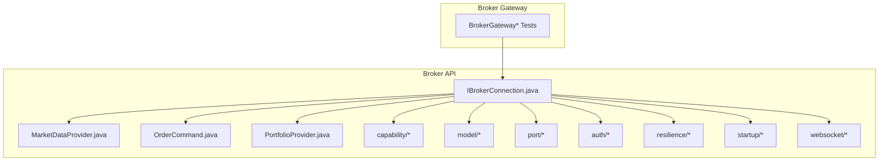
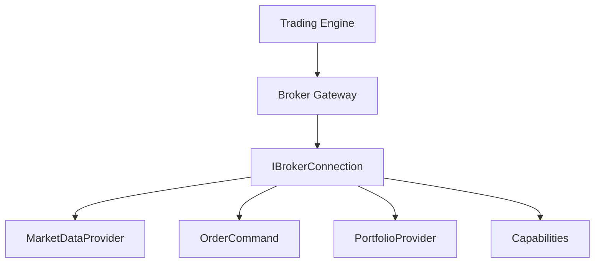
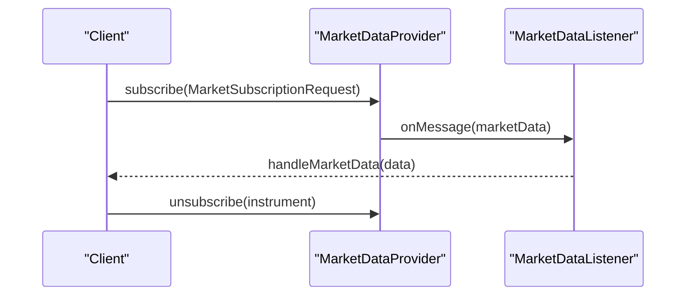
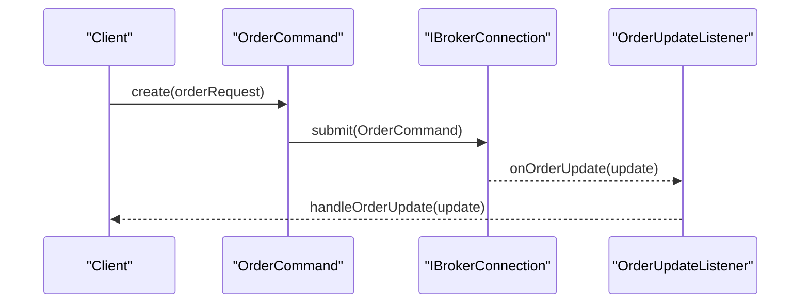
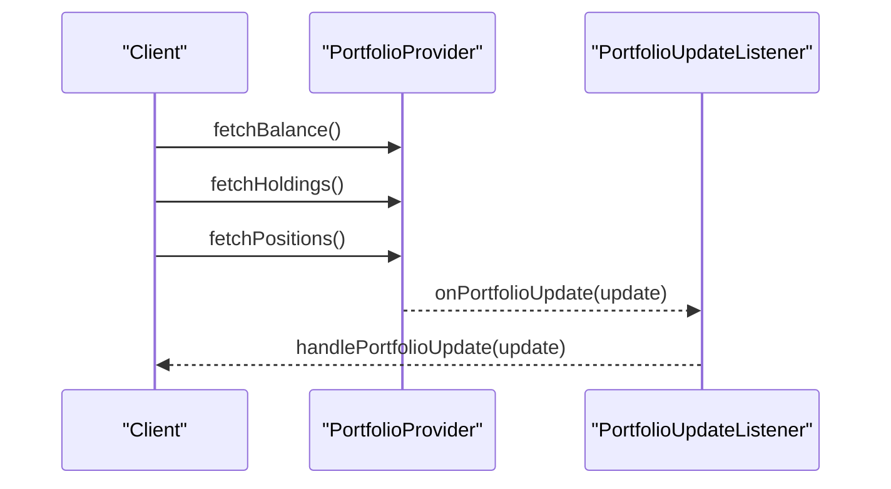
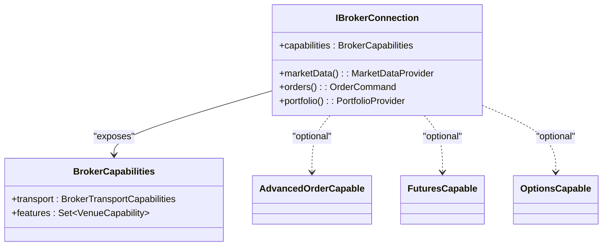
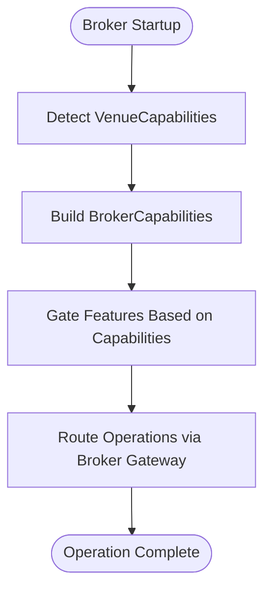
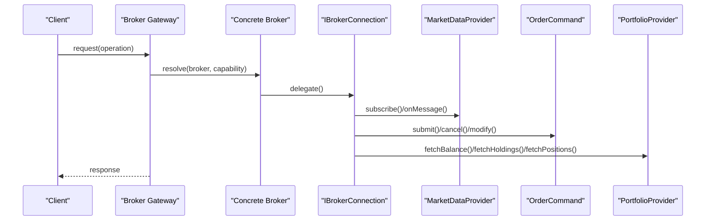
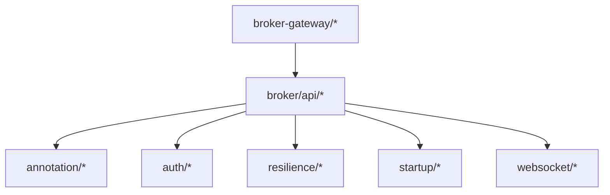

# Broker Interface and Abstractions

<cite>
**Referenced Files in This Document**
- [IBrokerConnection.java](file://broker/api/src/main/java/com/tradej/broker/api/IBrokerConnection.java)
- [MarketDataProvider.java](file://broker/api/src/main/java/com/tradej/broker/api/port/MarketDataProvider.java)
- [OrderCommand.java](file://broker/api/src/main/java/com/tradej/broker/api/port/OrderCommand.java)
- [PortfolioProvider.java](file://broker/api/src/main/java/com/tradej/broker/api/port/PortfolioProvider.java)
- [AdvancedOrderCapable.java](file://broker/api/src/main/java/com/tradej/broker/api/capability/AdvancedOrderCapable.java)
- [FuturesCapable.java](file://broker/api/src/main/java/com/tradej/broker/api/capability/FuturesCapable.java)
- [OptionsCapable.java](file://broker/api/src/main/java/com/tradej/broker/api/capability/OptionsCapable.java)
- [BrokerCapabilities.java](file://broker/api/src/main/java/com/tradej/broker/api/model/BrokerCapabilities.java)
- [VenueCapability.java](file://broker/api/src/main/java/com/tradej/broker/api/model/VenueCapability.java)
- [BrokerTransportCapabilities.java](file://broker/api/src/main/java/com/tradej/broker/api/model/BrokerTransportCapabilities.java)
- [MarketSubscriptionRequest.java](file://broker/api/src/main/java/com/tradej/broker/api/model/MarketSubscriptionRequest.java)
- [MarketDataListener.java](file://broker/api/src/main/java/com/tradej/broker/api/port/MarketDataListener.java)
- [OrderUpdateListener.java](file://broker/api/src/main/java/com/tradej/broker/api/port/OrderUpdateListener.java)
- [BrokerErrorCategory.java](file://broker/api/src/main/java/com/tradej/broker/api/resilience/BrokerErrorCategory.java)
- [BrokerStartupContributor.java](file://broker/api/src/main/java/com/tradej/broker/api/startup/BrokerStartupContributor.java)
- [TokenLifecycleService.java](file://broker/api/src/main/java/com/tradej/broker/api/auth/TokenLifecycleService.java)
- [TokenSource.java](file://broker/api/src/main/java/com/tradej/broker/api/auth/TokenSource.java)
- [TokenState.java](file://broker/api/src/main/java/com/tradej/broker/api/auth/TokenState.java)
- [BrokerInternal.java](file://broker/api/src/main/java/com/tradej/broker/api/annotation/BrokerInternal.java)
- [WebSocketSupervisor.java](file://broker/api/src/main/java/com/tradej/broker/api/websocket/WebSocketSupervisor.java)
- [IBrokerConnectionContractTest.java](file://broker/api/src/testFixtures/java/com/tradej/broker/api/IBrokerConnectionContractTest.java)
- [BrokerExplorerTest.java](file://broker-gateway/src/test/java/com/tradej/brokergateway/BrokerExplorerTest.java)
- [BrokerRouterTest.java](file://broker-gateway/src/test/java/com/tradej/brokergateway/BrokerRouterTest.java)
- [BrokerGatewayTest.java](file://broker-gateway/src/test/java/com/tradej/brokergateway/BrokerGatewayTest.java)
- [BrokerHandleInvokeTest.java](file://broker-gateway/src/test/java/com/tradej/brokergateway/BrokerHandleInvokeTest.java)
- [BrokerHandleAdvancedTest.java](file://broker-gateway/src/test/java/com/tradej/brokergateway/BrokerHandleAdvancedTest.java)
- [BrokerCertificationTest.java](file://broker-gateway/src/test/java/com/tradej/brokergateway/BrokerCertificationTest.java)
- [BROKER_CAPABILITY_MATRIX.md](file://docs/BROKER_CAPABILITY_MATRIX.md)
</cite>

## Table of Contents
1. [Introduction](#introduction)
2. [Project Structure](#project-structure)
3. [Core Components](#core-components)
4. [Architecture Overview](#architecture-overview)
5. [Detailed Component Analysis](#detailed-component-analysis)
6. [Dependency Analysis](#dependency-analysis)
7. [Performance Considerations](#performance-considerations)
8. [Troubleshooting Guide](#troubleshooting-guide)
9. [Conclusion](#conclusion)
10. [Appendices](#appendices)

## Introduction
This document describes the broker interface abstraction layer that enables polymorphic handling of multiple brokerage providers while standardizing market data, order routing, and portfolio operations. It explains the IBrokerConnection interface design, standardized broker operations, and the capability-based architecture. It documents MarketDataProvider, OrderCommand, and PortfolioProvider interfaces along with their method signatures and implementation patterns. It also details the capability system including AdvancedOrderCapable, FuturesCapable, OptionsCapable, and other specialized capabilities, and introduces the BrokerCapabilities model and venue capability mappings. Finally, it provides examples of how different broker implementations adhere to these interfaces, outlines the abstraction benefits, polymorphic broker handling, and extensibility patterns for adding new broker integrations.

## Project Structure
The broker abstraction resides primarily in the broker API module, with supporting capability, model, port, auth, resilience, startup, and websocket packages. The broker gateway module orchestrates routing and invocation across brokers, and tests validate conformance and behavior.

**Diagram sources**
- [IBrokerConnection.java](file://broker/api/src/main/java/com/tradej/broker/api/IBrokerConnection.java)
- [MarketDataProvider.java](file://broker/api/src/main/java/com/tradej/broker/api/port/MarketDataProvider.java)
- [OrderCommand.java](file://broker/api/src/main/java/com/tradej/broker/api/port/OrderCommand.java)
- [PortfolioProvider.java](file://broker/api/src/main/java/com/tradej/broker/api/port/PortfolioProvider.java)
- [BrokerCapabilities.java](file://broker/api/src/main/java/com/tradej/broker/api/model/BrokerCapabilities.java)

**Section sources**
- [IBrokerConnection.java](file://broker/api/src/main/java/com/tradej/broker/api/IBrokerConnection.java)
- [BrokerCapabilities.java](file://broker/api/src/main/java/com/tradej/broker/api/model/BrokerCapabilities.java)

## Core Components
- IBrokerConnection: The central connection contract that encapsulates a broker's capabilities and operations. It defines lifecycle, capability discovery, and operation orchestration.
- MarketDataProvider: Provides standardized market data subscriptions and streaming via MarketDataListener.
- OrderCommand: Encapsulates order submission and modification requests with standardized fields and semantics.
- PortfolioProvider: Offers portfolio-related queries and updates via a listener interface.
- Capability interfaces: AdvancedOrderCapable, FuturesCapable, OptionsCapable, and others define optional features a broker may support.
- BrokerCapabilities model: Describes supported features, transport capabilities, and venue-specific capabilities.

Key implementation patterns:
- Capability-based discovery: Brokers declare support via capability interfaces; clients conditionally enable features.
- Standardized operations: Methods accept and return standardized DTOs to ensure consistent behavior across brokers.
- Listener-driven updates: Market data and order updates propagate asynchronously through listener interfaces.

**Section sources**
- [IBrokerConnection.java](file://broker/api/src/main/java/com/tradej/broker/api/IBrokerConnection.java)
- [MarketDataProvider.java](file://broker/api/src/main/java/com/tradej/broker/api/port/MarketDataProvider.java)
- [OrderCommand.java](file://broker/api/src/main/java/com/tradej/broker/api/port/OrderCommand.java)
- [PortfolioProvider.java](file://broker/api/src/main/java/com/tradej/broker/api/port/PortfolioProvider.java)
- [AdvancedOrderCapable.java](file://broker/api/src/main/java/com/tradej/broker/api/capability/AdvancedOrderCapable.java)
- [FuturesCapable.java](file://broker/api/src/main/java/com/tradej/broker/api/capability/FuturesCapable.java)
- [OptionsCapable.java](file://broker/api/src/main/java/com/tradej/broker/api/capability/OptionsCapable.java)
- [BrokerCapabilities.java](file://broker/api/src/main/java/com/tradej/broker/api/model/BrokerCapabilities.java)

## Architecture Overview
The abstraction layer separates concerns between the broker interface and concrete implementations. The broker gateway routes operations to the appropriate broker based on capability and configuration, ensuring consistent behavior regardless of the underlying provider.

**Diagram sources**
- [IBrokerConnection.java](file://broker/api/src/main/java/com/tradej/broker/api/IBrokerConnection.java)
- [BrokerExplorerTest.java](file://broker-gateway/src/test/java/com/tradej/brokergateway/BrokerExplorerTest.java)
- [BrokerRouterTest.java](file://broker-gateway/src/test/java/com/tradej/brokergateway/BrokerRouterTest.java)
- [BrokerGatewayTest.java](file://broker-gateway/src/test/java/com/tradej/brokergateway/BrokerGatewayTest.java)

## Detailed Component Analysis

### IBrokerConnection Interface Design
IBrokerConnection defines the broker's operational contract:
- Lifecycle management: initialization, readiness checks, shutdown.
- Capability discovery: exposes BrokerCapabilities for feature detection.
- Operation orchestration: delegates to MarketDataProvider, OrderCommand, PortfolioProvider, and other capability ports.
- Transport and resilience: integrates with transport capabilities and error categories.
- Startup and auth: collaborates with startup contributors and token lifecycle services.

Implementation pattern:
- Concrete brokers implement IBrokerConnection and compose capability-specific ports.
- Capability interfaces signal optional features; clients gate functionality accordingly.

Benefits:
- Uniform lifecycle and capability exposure across brokers.
- Clear separation between transport, auth, and business operations.
- Extensible via additional capability interfaces.

**Section sources**
- [IBrokerConnection.java](file://broker/api/src/main/java/com/tradej/broker/api/IBrokerConnection.java)
- [BrokerCapabilities.java](file://broker/api/src/main/java/com/tradej/broker/api/model/BrokerCapabilities.java)
- [BrokerErrorCategory.java](file://broker/api/src/main/java/com/tradej/broker/api/resilience/BrokerErrorCategory.java)
- [BrokerStartupContributor.java](file://broker/api/src/main/java/com/tradej/broker/api/startup/BrokerStartupContributor.java)
- [TokenLifecycleService.java](file://broker/api/src/main/java/com/tradej/broker/api/auth/TokenLifecycleService.java)

### MarketDataProvider
Responsibilities:
- Subscribe/unsubscribe to market data streams.
- Manage subscription requests via MarketSubscriptionRequest.
- Deliver updates through MarketDataListener.

Method signature pattern:
- subscribe(request): Initiates market data subscription.
- unsubscribe(instrument): Stops a specific subscription.
- onMessage(listener): Receives and dispatches market data events.

Implementation pattern:
- Listeners receive normalized market data payloads.
- Supports multiple subscription types (ltp, depth, candles, ohlc).

**Diagram sources**
- [MarketDataProvider.java](file://broker/api/src/main/java/com/tradej/broker/api/port/MarketDataProvider.java)
- [MarketDataListener.java](file://broker/api/src/main/java/com/tradej/broker/api/port/MarketDataListener.java)
- [MarketSubscriptionRequest.java](file://broker/api/src/main/java/com/tradej/broker/api/model/MarketSubscriptionRequest.java)

**Section sources**
- [MarketDataProvider.java](file://broker/api/src/main/java/com/tradej/broker/api/port/MarketDataProvider.java)
- [MarketDataListener.java](file://broker/api/src/main/java/com/tradej/broker/api/port/MarketDataListener.java)
- [MarketSubscriptionRequest.java](file://broker/api/src/main/java/com/tradej/broker/api/model/MarketSubscriptionRequest.java)

### OrderCommand
Responsibilities:
- Encapsulate order submission and modification requests.
- Provide standardized fields for order type, quantity, price, and routing parameters.
- Integrate with order update listeners for asynchronous status updates.

Method signature pattern:
- submit(command): Submits an order to the broker.
- cancel(orderId): Cancels an existing order.
- modify(command): Modifies an existing order.

Implementation pattern:
- OrderCommand instances carry immutable request data.
- OrderUpdateListener receives real-time order state transitions.

**Diagram sources**
- [OrderCommand.java](file://broker/api/src/main/java/com/tradej/broker/api/port/OrderCommand.java)
- [OrderUpdateListener.java](file://broker/api/src/main/java/com/tradej/broker/api/port/OrderUpdateListener.java)
- [IBrokerConnection.java](file://broker/api/src/main/java/com/tradej/broker/api/IBrokerConnection.java)

**Section sources**
- [OrderCommand.java](file://broker/api/src/main/java/com/tradej/broker/api/port/OrderCommand.java)
- [OrderUpdateListener.java](file://broker/api/src/main/java/com/tradej/broker/api/port/OrderUpdateListener.java)

### PortfolioProvider
Responsibilities:
- Provide portfolio balances, holdings, and positions.
- Stream portfolio updates via a listener interface.

Method signature pattern:
- fetchBalance(): Retrieves current account balance.
- fetchHoldings(): Returns current holdings.
- fetchPositions(): Returns current positions.
- onPortfolioUpdate(listener): Receives portfolio change notifications.

Implementation pattern:
- Normalized portfolio DTOs across brokers.
- Asynchronous updates through listeners.

**Diagram sources**
- [PortfolioProvider.java](file://broker/api/src/main/java/com/tradej/broker/api/port/PortfolioProvider.java)
- [IBrokerConnection.java](file://broker/api/src/main/java/com/tradej/broker/api/IBrokerConnection.java)

**Section sources**
- [PortfolioProvider.java](file://broker/api/src/main/java/com/tradej/broker/api/port/PortfolioProvider.java)

### Capability-Based Architecture
Capabilities describe optional features a broker supports. Examples include:
- AdvancedOrderCapable: Supports advanced order types (bracket, cover, gtt, slice).
- FuturesCapable: Supports futures instruments and derivatives operations.
- OptionsCapable: Supports options instruments and Greeks retrieval.

BrokerCapabilities model:
- Aggregates feature flags and transport capabilities.
- Associates venue-specific capabilities via VenueCapability.

**Diagram sources**
- [IBrokerConnection.java](file://broker/api/src/main/java/com/tradej/broker/api/IBrokerConnection.java)
- [BrokerCapabilities.java](file://broker/api/src/main/java/com/tradej/broker/api/model/BrokerCapabilities.java)
- [AdvancedOrderCapable.java](file://broker/api/src/main/java/com/tradej/broker/api/capability/AdvancedOrderCapable.java)
- [FuturesCapable.java](file://broker/api/src/main/java/com/tradej/broker/api/capability/FuturesCapable.java)
- [OptionsCapable.java](file://broker/api/src/main/java/com/tradej/broker/api/capability/OptionsCapable.java)

**Section sources**
- [AdvancedOrderCapable.java](file://broker/api/src/main/java/com/tradej/broker/api/capability/AdvancedOrderCapable.java)
- [FuturesCapable.java](file://broker/api/src/main/java/com/tradej/broker/api/capability/FuturesCapable.java)
- [OptionsCapable.java](file://broker/api/src/main/java/com/tradej/broker/api/capability/OptionsCapable.java)
- [BrokerCapabilities.java](file://broker/api/src/main/java/com/tradej/broker/api/model/BrokerCapabilities.java)
- [VenueCapability.java](file://broker/api/src/main/java/com/tradej/broker/api/model/VenueCapability.java)

### Venue Capability Mappings
VenueCapability enumerates supported features per broker venue. BrokerCapabilities aggregates these to inform routing and feature gating. Tests and documentation provide capability matrices for certification and verification.

**Diagram sources**
- [BrokerCapabilities.java](file://broker/api/src/main/java/com/tradej/broker/api/model/BrokerCapabilities.java)
- [VenueCapability.java](file://broker/api/src/main/java/com/tradej/broker/api/model/VenueCapability.java)
- [BROKER_CAPABILITY_MATRIX.md](file://docs/BROKER_CAPABILITY_MATRIX.md)

**Section sources**
- [VenueCapability.java](file://broker/api/src/main/java/com/tradej/broker/api/model/VenueCapability.java)
- [BrokerCapabilities.java](file://broker/api/src/main/java/com/tradej/broker/api/model/BrokerCapabilities.java)
- [BROKER_CAPABILITY_MATRIX.md](file://docs/BROKER_CAPABILITY_MATRIX.md)

### Example: How Different Broker Implementations Adhere to Interfaces
Concrete broker implementations integrate IBrokerConnection and expose capabilities:
- Market data: Implement MarketDataProvider and register MarketDataListener for updates.
- Orders: Implement OrderCommand and wire OrderUpdateListener for lifecycle updates.
- Portfolio: Implement PortfolioProvider and stream portfolio changes.
- Capabilities: Implement AdvancedOrderCapable, FuturesCapable, OptionsCapable as applicable.

Broker gateway tests validate:
- BrokerExplorerTest: Discovers and verifies broker capabilities.
- BrokerRouterTest: Routes operations based on capability and venue.
- BrokerGatewayTest: Ensures end-to-end invocation correctness.
- BrokerHandleInvokeTest: Validates invocation semantics.
- BrokerHandleAdvancedTest: Exercises advanced order handling.
- BrokerCertificationTest: Confirms compliance against capability matrix.

**Diagram sources**
- [BrokerExplorerTest.java](file://broker-gateway/src/test/java/com/tradej/brokergateway/BrokerExplorerTest.java)
- [BrokerRouterTest.java](file://broker-gateway/src/test/java/com/tradej/brokergateway/BrokerRouterTest.java)
- [BrokerGatewayTest.java](file://broker-gateway/src/test/java/com/tradej/brokergateway/BrokerGatewayTest.java)
- [BrokerHandleInvokeTest.java](file://broker-gateway/src/test/java/com/tradej/brokergateway/BrokerHandleInvokeTest.java)
- [BrokerHandleAdvancedTest.java](file://broker-gateway/src/test/java/com/tradej/brokergateway/BrokerHandleAdvancedTest.java)
- [BrokerCertificationTest.java](file://broker-gateway/src/test/java/com/tradej/brokergateway/BrokerCertificationTest.java)

**Section sources**
- [BrokerExplorerTest.java](file://broker-gateway/src/test/java/com/tradej/brokergateway/BrokerExplorerTest.java)
- [BrokerRouterTest.java](file://broker-gateway/src/test/java/com/tradej/brokergateway/BrokerRouterTest.java)
- [BrokerGatewayTest.java](file://broker-gateway/src/test/java/com/tradej/brokergateway/BrokerGatewayTest.java)
- [BrokerHandleInvokeTest.java](file://broker-gateway/src/test/java/com/tradej/brokergateway/BrokerHandleInvokeTest.java)
- [BrokerHandleAdvancedTest.java](file://broker-gateway/src/test/java/com/tradej/brokergateway/BrokerHandleAdvancedTest.java)
- [BrokerCertificationTest.java](file://broker-gateway/src/test/java/com/tradej/brokergateway/BrokerCertificationTest.java)

## Dependency Analysis
The broker API module depends on internal annotations, auth, resilience, startup, and websocket packages. The broker gateway module depends on the broker API and orchestrates capability-aware routing.

**Diagram sources**
- [IBrokerConnection.java](file://broker/api/src/main/java/com/tradej/broker/api/IBrokerConnection.java)
- [BrokerInternal.java](file://broker/api/src/main/java/com/tradej/broker/api/annotation/BrokerInternal.java)
- [TokenLifecycleService.java](file://broker/api/src/main/java/com/tradej/broker/api/auth/TokenLifecycleService.java)
- [BrokerErrorCategory.java](file://broker/api/src/main/java/com/tradej/broker/api/resilience/BrokerErrorCategory.java)
- [BrokerStartupContributor.java](file://broker/api/src/main/java/com/tradej/broker/api/startup/BrokerStartupContributor.java)
- [WebSocketSupervisor.java](file://broker/api/src/main/java/com/tradej/broker/api/websocket/WebSocketSupervisor.java)
- [BrokerExplorerTest.java](file://broker-gateway/src/test/java/com/tradej/brokergateway/BrokerExplorerTest.java)

**Section sources**
- [BrokerInternal.java](file://broker/api/src/main/java/com/tradej/broker/api/annotation/BrokerInternal.java)
- [TokenSource.java](file://broker/api/src/main/java/com/tradej/broker/api/auth/TokenSource.java)
- [TokenState.java](file://broker/api/src/main/java/com/tradej/broker/api/auth/TokenState.java)
- [WebSocketSupervisor.java](file://broker/api/src/main/java/com/tradej/broker/api/websocket/WebSocketSupervisor.java)

## Performance Considerations
- Capability-based gating reduces unnecessary operations and minimizes overhead when features are unsupported.
- Listener-driven updates decouple producers and consumers, enabling scalable market data and order update handling.
- Transport capabilities and resilience mechanisms help manage network variability and retry policies.
- Token lifecycle management ensures efficient authentication and session handling.

## Troubleshooting Guide
Common areas to inspect:
- Token lifecycle: Verify TokenLifecycleService, TokenSource, and TokenState usage for authentication and session refresh.
- Error categorization: Use BrokerErrorCategory to classify and handle network and rate limit errors.
- Startup validation: Ensure BrokerStartupContributor participates in initialization and capability discovery.
- WebSocket supervision: Confirm WebSocketSupervisor manages connections and reconnection strategies.

**Section sources**
- [TokenLifecycleService.java](file://broker/api/src/main/java/com/tradej/broker/api/auth/TokenLifecycleService.java)
- [TokenSource.java](file://broker/api/src/main/java/com/tradej/broker/api/auth/TokenSource.java)
- [TokenState.java](file://broker/api/src/main/java/com/tradej/broker/api/auth/TokenState.java)
- [BrokerErrorCategory.java](file://broker/api/src/main/java/com/tradej/broker/api/resilience/BrokerErrorCategory.java)
- [BrokerStartupContributor.java](file://broker/api/src/main/java/com/tradej/broker/api/startup/BrokerStartupContributor.java)
- [WebSocketSupervisor.java](file://broker/api/src/main/java/com/tradej/broker/api/websocket/WebSocketSupervisor.java)

## Conclusion
The broker abstraction layer provides a robust, capability-driven foundation for integrating multiple brokerage providers. By standardizing market data, order commands, and portfolio operations behind well-defined interfaces, it enables polymorphic handling, predictable behavior, and seamless extensibility. The capability system and BrokerCapabilities model ensure that features are explicitly declared and safely gated, while the broker gateway orchestrates operations consistently across implementations.

## Appendices
- Contract testing: IBrokerConnectionContractTest validates adherence to the interface contract.
- Capability matrix: BROKER_CAPABILITY_MATRIX.md documents venue-specific feature coverage.

**Section sources**
- [IBrokerConnectionContractTest.java](file://broker/api/src/testFixtures/java/com/tradej/broker/api/IBrokerConnectionContractTest.java)
- [BROKER_CAPABILITY_MATRIX.md](file://docs/BROKER_CAPABILITY_MATRIX.md)