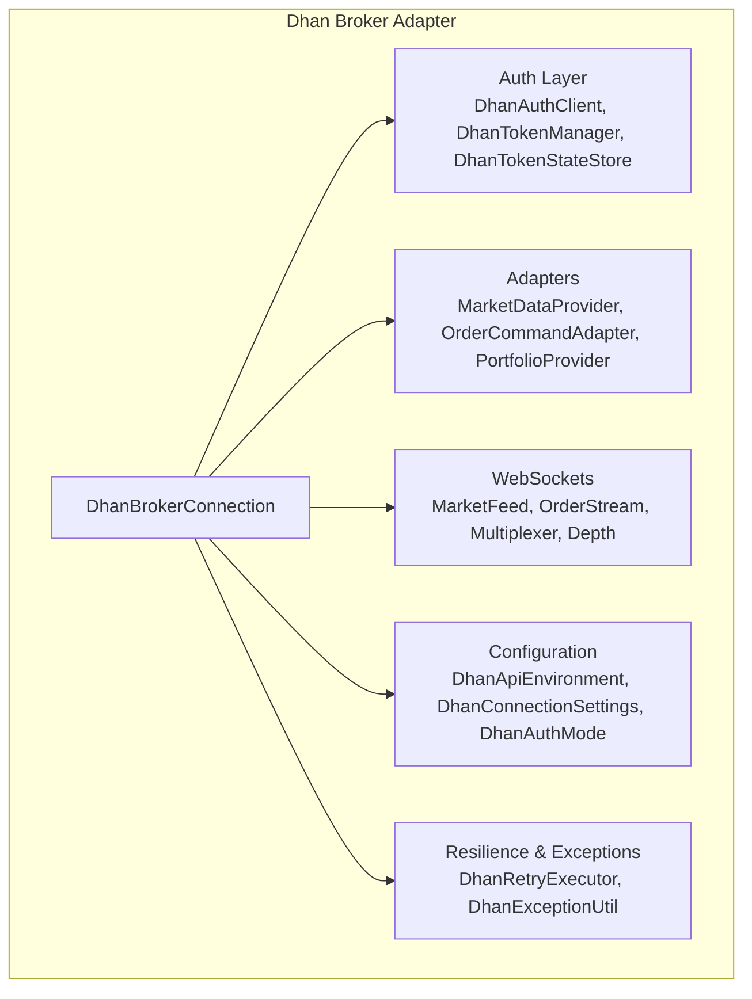
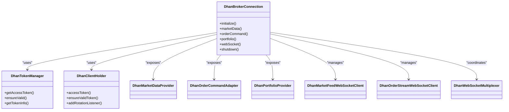
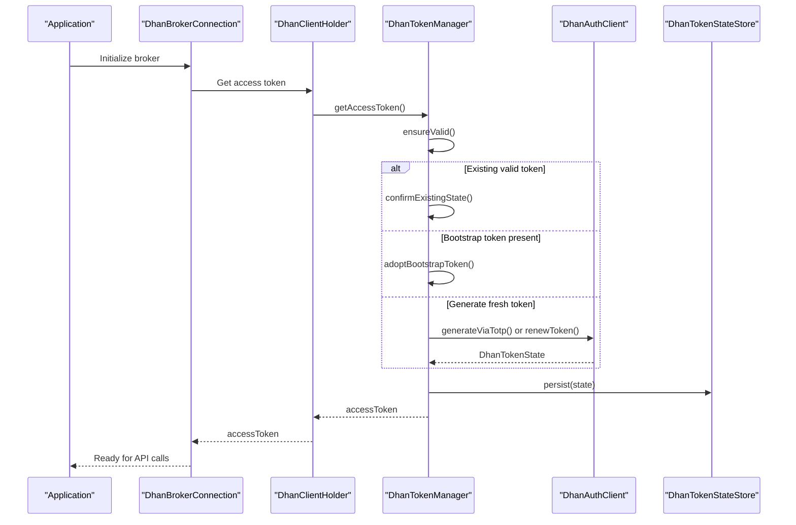
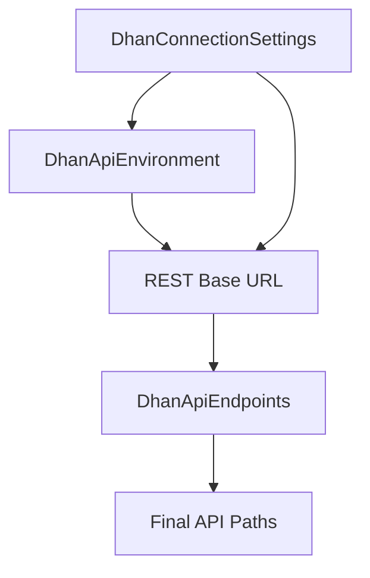
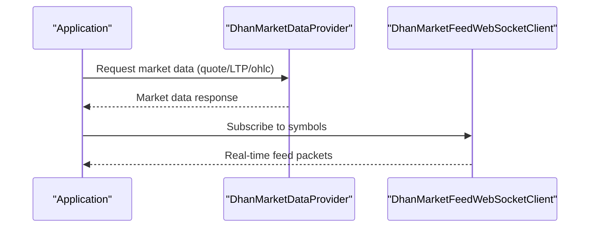
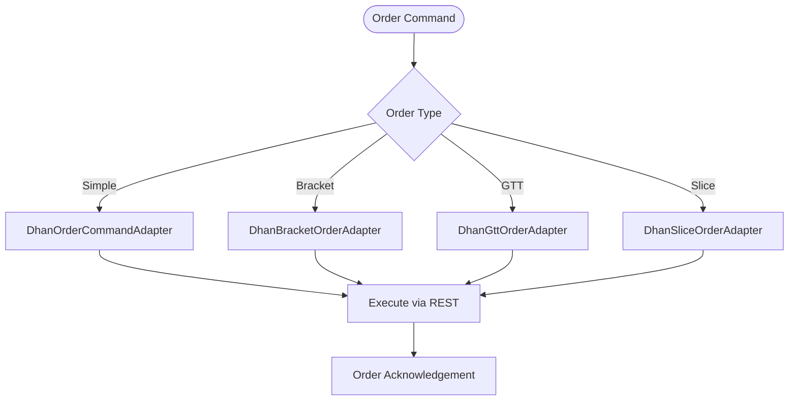
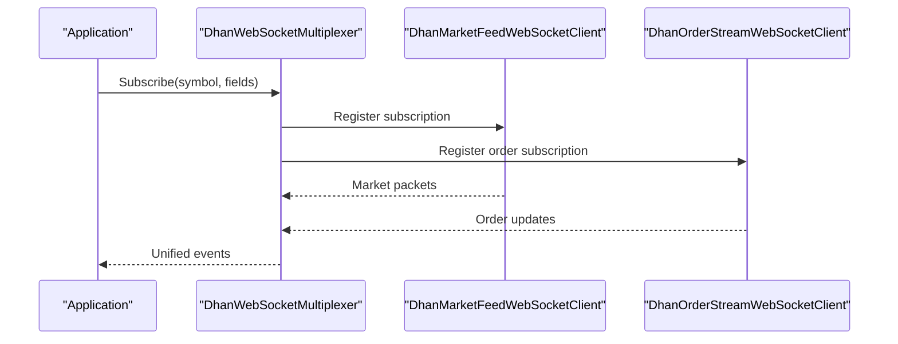
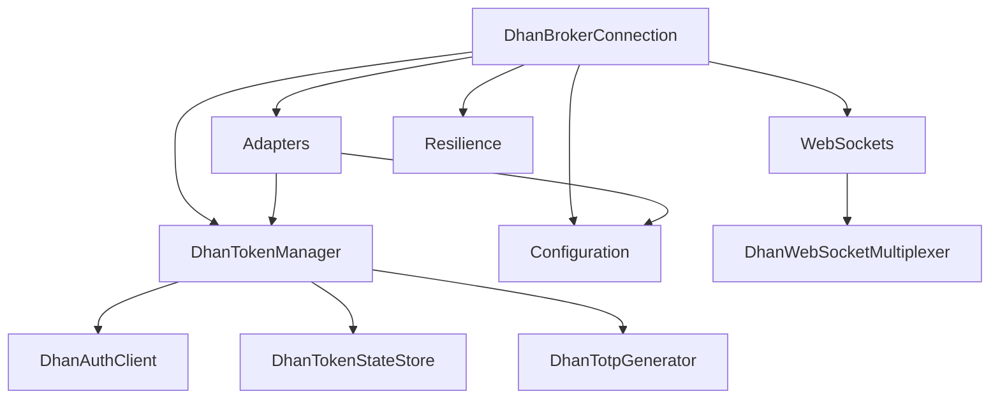

# Dhan Broker Adapter

<cite>
**Referenced Files in This Document**
- [DhanBrokerConnection.java](file://broker/dhan/src/main/java/com/tradej/broker/dhan/DhanBrokerConnection.java)
- [DhanTokenManager.java](file://broker/dhan/src/main/java/com/tradej/broker/dhan/auth/DhanTokenManager.java)
- [DhanTokenProvider.java](file://broker/dhan/src/main/java/com/tradej/broker/dhan/auth/DhanTokenProvider.java)
- [DhanAuthClient.java](file://broker/dhan/src/main/java/com/tradej/broker/dhan/auth/DhanAuthClient.java)
- [DhanTokenState.java](file://broker/dhan/src/main/java/com/tradej/broker/dhan/auth/DhanTokenState.java)
- [DhanTokenStateStore.java](file://broker/dhan/src/main/java/com/tradej/broker/dhan/auth/DhanTokenStateStore.java)
- [DhanTotpGenerator.java](file://broker/dhan/src/main/java/com/tradej/broker/dhan/auth/DhanTotpGenerator.java)
- [DhanClientHolder.java](file://broker/dhan/src/main/java/com/tradej/broker/dhan/client/DhanClientHolder.java)
- [DhanMarketDataProvider.java](file://broker/dhan/src/main/java/com/tradej/broker/dhan/adapter/DhanMarketDataProvider.java)
- [DhanOrderCommandAdapter.java](file://broker/dhan/src/main/java/com/tradej/broker/dhan/adapter/DhanOrderCommandAdapter.java)
- [DhanPortfolioProvider.java](file://broker/dhan/src/main/java/com/tradej/broker/dhan/adapter/DhanPortfolioProvider.java)
- [DhanBracketOrderAdapter.java](file://broker/dhan/src/main/java/com/tradej/broker/dhan/adapter/DhanBracketOrderAdapter.java)
- [DhanGttOrderAdapter.java](file://broker/dhan/src/main/java/com/tradej/broker/dhan/adapter/DhanGttOrderAdapter.java)
- [DhanSliceOrderAdapter.java](file://broker/dhan/src/main/java/com/tradej/broker/dhan/adapter/DhanSliceOrderAdapter.java)
- [DhanMarketFeedWebSocketClient.java](file://broker/dhan/src/main/java/com/tradej/broker/dhan/websocket/DhanMarketFeedWebSocketClient.java)
- [DhanOrderStreamWebSocketClient.java](file://broker/dhan/src/main/java/com/tradej/broker/dhan/websocket/DhanOrderStreamWebSocketClient.java)
- [DhanWebSocketMultiplexer.java](file://broker/dhan/src/main/java/com/tradej/broker/dhan/websocket/DhanWebSocketMultiplexer.java)
- [DhanApiEndpoints.java](file://broker/dhan/src/main/java/com/tradej/broker/dhan/constants/DhanApiEndpoints.java)
- [DhanApiEnvironment.java](file://broker/dhan/src/main/java/com/tradej/broker/dhan/config/DhanApiEnvironment.java)
- [DhanConnectionSettings.java](file://broker/dhan/src/main/java/com/tradej/broker/dhan/config/DhanConnectionSettings.java)
- [DhanAuthMode.java](file://broker/dhan/src/main/java/com/tradej/broker/dhan/config/DhanAuthMode.java)
- [DhanExceptionUtil.java](file://broker/dhan/src/main/java/com/tradej/broker/dhan/exceptions/DhanExceptionUtil.java)
- [DhanBrokerException.java](file://broker/dhan/src/main/java/com/tradej/broker/dhan/exceptions/DhanBrokerException.java)
- [DhanHttpException.java](file://broker/dhan/src/main/java/com/tradej/broker/dhan/exceptions/DhanHttpException.java)
- [DhanValidationException.java](file://broker/dhan/src/main/java/com/tradej/broker/dhan/exceptions/DhanValidationException.java)
- [DhanRetryExecutor.java](file://broker/dhan/src/main/java/com/tradej/broker/dhan/resilience/DhanRetryExecutor.java)
- [DhanMarketDepthProvider.java](file://broker/dhan/src/main/java/com/tradej/broker/dhan/depth/DhanMarketDepthProvider.java)
- [DhanTwentyDepthWebSocketClient.java](file://broker/dhan/src/main/java/com/tradej/broker/dhan/depth/DhanTwentyDepthWebSocketClient.java)
- [BrokerConfiguration.java](file://app/src/main/java/com/tradej/app/config/BrokerConfiguration.java)
- [DhanTokenLifecycleIntegrationTest.java](file://app/src/test/java/com/tradej/app/integration/DhanTokenLifecycleIntegrationTest.java)
- [DhanMarketFeedWebSocketIntegrationTest.java](file://app/src/test/java/com/tradej/app/integration/DhanMarketFeedWebSocketIntegrationTest.java)
- [DhanOrderLifecycleIntegrationTest.java](file://app/src/test/java/com/tradej/app/integration/DhanOrderLifecycleIntegrationTest.java)
- [DhanPortfolioIntegrationTest.java](file://app/src/test/java/com/tradej/app/integration/DhanPortfolioIntegrationTest.java)
</cite>

## Table of Contents
1. [Introduction](#introduction)
2. [Project Structure](#project-structure)
3. [Core Components](#core-components)
4. [Architecture Overview](#architecture-overview)
5. [Detailed Component Analysis](#detailed-component-analysis)
6. [Dependency Analysis](#dependency-analysis)
7. [Performance Considerations](#performance-considerations)
8. [Troubleshooting Guide](#troubleshooting-guide)
9. [Conclusion](#conclusion)
10. [Appendices](#appendices)

## Introduction
This document provides comprehensive documentation for the Dhan broker adapter implementation. It covers the DhanBrokerConnection class architecture, authentication flow using DhanTokenManager, API endpoint configuration, market data providers, order command adapters, and WebSocket integration for real-time data streams. It also explains Dhan-specific features such as bracket orders, GTT orders, and slice orders, along with authentication setup via DhanAuthClient, token lifecycle management, and safety rules implementation. Practical examples of market data retrieval, order placement, and portfolio management are included, alongside error handling, rate limiting, and circuit breaker patterns specific to the Dhan integration.

## Project Structure
The Dhan broker adapter resides under the broker/dhan module and is organized by functional domains:
- Authentication: DhanAuthClient, DhanTokenManager, DhanTokenState, DhanTokenStateStore, DhanTotpGenerator
- Configuration: DhanApiEnvironment, DhanConnectionSettings, DhanAuthMode
- Adapters: Market data, order commands, portfolio, margin, options, and specialized order adapters
- WebSockets: Market feed, order stream, multiplexer, and depth clients
- Exceptions and resilience: DhanExceptionUtil, DhanBrokerException, DhanHttpException, DhanValidationException, DhanRetryExecutor
- Clients and holders: DhanClientHolder

**Diagram sources**
- [DhanBrokerConnection.java](file://broker/dhan/src/main/java/com/tradej/broker/dhan/DhanBrokerConnection.java)
- [DhanAuthClient.java](file://broker/dhan/src/main/java/com/tradej/broker/dhan/auth/DhanAuthClient.java)
- [DhanTokenManager.java](file://broker/dhan/src/main/java/com/tradej/broker/dhan/auth/DhanTokenManager.java)
- [DhanMarketDataProvider.java](file://broker/dhan/src/main/java/com/tradej/broker/dhan/adapter/DhanMarketDataProvider.java)
- [DhanOrderCommandAdapter.java](file://broker/dhan/src/main/java/com/tradej/broker/dhan/adapter/DhanOrderCommandAdapter.java)
- [DhanPortfolioProvider.java](file://broker/dhan/src/main/java/com/tradej/broker/dhan/adapter/DhanPortfolioProvider.java)
- [DhanMarketFeedWebSocketClient.java](file://broker/dhan/src/main/java/com/tradej/broker/dhan/websocket/DhanMarketFeedWebSocketClient.java)
- [DhanOrderStreamWebSocketClient.java](file://broker/dhan/src/main/java/com/tradej/broker/dhan/websocket/DhanOrderStreamWebSocketClient.java)
- [DhanWebSocketMultiplexer.java](file://broker/dhan/src/main/java/com/tradej/broker/dhan/websocket/DhanWebSocketMultiplexer.java)
- [DhanApiEnvironment.java](file://broker/dhan/src/main/java/com/tradej/broker/dhan/config/DhanApiEnvironment.java)
- [DhanConnectionSettings.java](file://broker/dhan/src/main/java/com/tradej/broker/dhan/config/DhanConnectionSettings.java)
- [DhanAuthMode.java](file://broker/dhan/src/main/java/com/tradej/broker/dhan/config/DhanAuthMode.java)
- [DhanRetryExecutor.java](file://broker/dhan/src/main/java/com/tradej/broker/dhan/resilience/DhanRetryExecutor.java)
- [DhanExceptionUtil.java](file://broker/dhan/src/main/java/com/tradej/broker/dhan/exceptions/DhanExceptionUtil.java)

**Section sources**
- [DhanBrokerConnection.java](file://broker/dhan/src/main/java/com/tradej/broker/dhan/DhanBrokerConnection.java)
- [BrokerConfiguration.java](file://app/src/main/java/com/tradej/app/config/BrokerConfiguration.java)

## Core Components
- DhanBrokerConnection: Orchestrates the broker connection, wiring together adapters, websockets, configuration, and resilience mechanisms.
- DhanTokenManager: Central token lifecycle manager supporting static, TOTP-generated, and web-renewable modes with persistence and concurrency controls.
- DhanAuthClient: Handles token acquisition, renewal, and profile verification against Dhan endpoints.
- DhanTokenStateStore: Persists and loads token state to/from disk.
- DhanTotpGenerator: Generates time-based one-time passwords for secure authentication.
- DhanClientHolder: Provides access to the current access token and notifies rotation listeners.
- DhanMarketDataProvider: Retrieves market data (quotes, LTP, OHLC, depth) via REST and WebSocket.
- DhanOrderCommandAdapter: Places, modifies, cancels, and queries orders.
- DhanPortfolioProvider: Fetches account balances, holdings, and positions.
- Specialized Order Adapters: BracketOrderAdapter, GttOrderAdapter, SliceOrderAdapter for advanced order types.
- DhanMarketFeedWebSocketClient and DhanOrderStreamWebSocketClient: Real-time streaming for market data and order updates.
- DhanWebSocketMultiplexer: Manages multiple subscriptions and multiplexed feeds.
- DhanApiEndpoints and DhanApiEnvironment: Define base URLs and endpoint paths for REST APIs.
- DhanExceptionUtil and DhanRetryExecutor: Provide structured error handling and retry policies.

**Section sources**
- [DhanBrokerConnection.java](file://broker/dhan/src/main/java/com/tradej/broker/dhan/DhanBrokerConnection.java)
- [DhanTokenManager.java](file://broker/dhan/src/main/java/com/tradej/broker/dhan/auth/DhanTokenManager.java)
- [DhanAuthClient.java](file://broker/dhan/src/main/java/com/tradej/broker/dhan/auth/DhanAuthClient.java)
- [DhanTokenStateStore.java](file://broker/dhan/src/main/java/com/tradej/broker/dhan/auth/DhanTokenStateStore.java)
- [DhanTotpGenerator.java](file://broker/dhan/src/main/java/com/tradej/broker/dhan/auth/DhanTotpGenerator.java)
- [DhanClientHolder.java](file://broker/dhan/src/main/java/com/tradej/broker/dhan/client/DhanClientHolder.java)
- [DhanMarketDataProvider.java](file://broker/dhan/src/main/java/com/tradej/broker/dhan/adapter/DhanMarketDataProvider.java)
- [DhanOrderCommandAdapter.java](file://broker/dhan/src/main/java/com/tradej/broker/dhan/adapter/DhanOrderCommandAdapter.java)
- [DhanPortfolioProvider.java](file://broker/dhan/src/main/java/com/tradej/broker/dhan/adapter/DhanPortfolioProvider.java)
- [DhanBracketOrderAdapter.java](file://broker/dhan/src/main/java/com/tradej/broker/dhan/adapter/DhanBracketOrderAdapter.java)
- [DhanGttOrderAdapter.java](file://broker/dhan/src/main/java/com/tradej/broker/dhan/adapter/DhanGttOrderAdapter.java)
- [DhanSliceOrderAdapter.java](file://broker/dhan/src/main/java/com/tradej/broker/dhan/adapter/DhanSliceOrderAdapter.java)
- [DhanMarketFeedWebSocketClient.java](file://broker/dhan/src/main/java/com/tradej/broker/dhan/websocket/DhanMarketFeedWebSocketClient.java)
- [DhanOrderStreamWebSocketClient.java](file://broker/dhan/src/main/java/com/tradej/broker/dhan/websocket/DhanOrderStreamWebSocketClient.java)
- [DhanWebSocketMultiplexer.java](file://broker/dhan/src/main/java/com/tradej/broker/dhan/websocket/DhanWebSocketMultiplexer.java)
- [DhanApiEndpoints.java](file://broker/dhan/src/main/java/com/tradej/broker/dhan/constants/DhanApiEndpoints.java)
- [DhanApiEnvironment.java](file://broker/dhan/src/main/java/com/tradej/broker/dhan/config/DhanApiEnvironment.java)
- [DhanExceptionUtil.java](file://broker/dhan/src/main/java/com/tradej/broker/dhan/exceptions/DhanExceptionUtil.java)
- [DhanRetryExecutor.java](file://broker/dhan/src/main/java/com/tradej/broker/dhan/resilience/DhanRetryExecutor.java)

## Architecture Overview
The Dhan broker adapter follows a layered architecture:
- Configuration layer defines environment, endpoints, and connection settings.
- Authentication layer manages token acquisition, renewal, and persistence.
- Adapter layer exposes market data, order management, and portfolio services.
- WebSocket layer handles real-time streaming for market data and order updates.
- Resilience layer applies retry policies and exception handling.

```mermaid
graph TB
UI["Application Layer"] --> CFG["Configuration"]
UI --> AUTH["Authentication"]
UI --> ADP["Adapters"]
UI --> WS["WebSockets"]
UI --> RES["Resilience"]
CFG --> ENV["DhanApiEnvironment"]
CFG --> CONN["DhanConnectionSettings"]
CFG --> MODE["DhanAuthMode"]
AUTH --> TM["DhanTokenManager"]
AUTH --> AC["DhanAuthClient"]
AUTH --> TS["DhanTokenStateStore"]
AUTH --> TT["DhanTotpGenerator"]
ADP --> MDP["DhanMarketDataProvider"]
ADP --> OCA["DhanOrderCommandAdapter"]
ADP --> PP["DhanPortfolioProvider"]
ADP --> SO["Special Orders<br/>Bracket/GTT/Slice"]
WS --> MFW["DhanMarketFeedWebSocketClient"]
WS --> OSW["DhanOrderStreamWebSocketClient"]
WS --> WM["DhanWebSocketMultiplexer"]
RES --> RET["DhanRetryExecutor"]
RES --> EXU["DhanExceptionUtil"]
```

**Diagram sources**
- [DhanBrokerConnection.java](file://broker/dhan/src/main/java/com/tradej/broker/dhan/DhanBrokerConnection.java)
- [DhanApiEnvironment.java](file://broker/dhan/src/main/java/com/tradej/broker/dhan/config/DhanApiEnvironment.java)
- [DhanConnectionSettings.java](file://broker/dhan/src/main/java/com/tradej/broker/dhan/config/DhanConnectionSettings.java)
- [DhanAuthMode.java](file://broker/dhan/src/main/java/com/tradej/broker/dhan/config/DhanAuthMode.java)
- [DhanTokenManager.java](file://broker/dhan/src/main/java/com/tradej/broker/dhan/auth/DhanTokenManager.java)
- [DhanAuthClient.java](file://broker/dhan/src/main/java/com/tradej/broker/dhan/auth/DhanAuthClient.java)
- [DhanTokenStateStore.java](file://broker/dhan/src/main/java/com/tradej/broker/dhan/auth/DhanTokenStateStore.java)
- [DhanTotpGenerator.java](file://broker/dhan/src/main/java/com/tradej/broker/dhan/auth/DhanTotpGenerator.java)
- [DhanMarketDataProvider.java](file://broker/dhan/src/main/java/com/tradej/broker/dhan/adapter/DhanMarketDataProvider.java)
- [DhanOrderCommandAdapter.java](file://broker/dhan/src/main/java/com/tradej/broker/dhan/adapter/DhanOrderCommandAdapter.java)
- [DhanPortfolioProvider.java](file://broker/dhan/src/main/java/com/tradej/broker/dhan/adapter/DhanPortfolioProvider.java)
- [DhanBracketOrderAdapter.java](file://broker/dhan/src/main/java/com/tradej/broker/dhan/adapter/DhanBracketOrderAdapter.java)
- [DhanGttOrderAdapter.java](file://broker/dhan/src/main/java/com/tradej/broker/dhan/adapter/DhanGttOrderAdapter.java)
- [DhanSliceOrderAdapter.java](file://broker/dhan/src/main/java/com/tradej/broker/dhan/adapter/DhanSliceOrderAdapter.java)
- [DhanMarketFeedWebSocketClient.java](file://broker/dhan/src/main/java/com/tradej/broker/dhan/websocket/DhanMarketFeedWebSocketClient.java)
- [DhanOrderStreamWebSocketClient.java](file://broker/dhan/src/main/java/com/tradej/broker/dhan/websocket/DhanOrderStreamWebSocketClient.java)
- [DhanWebSocketMultiplexer.java](file://broker/dhan/src/main/java/com/tradej/broker/dhan/websocket/DhanWebSocketMultiplexer.java)
- [DhanRetryExecutor.java](file://broker/dhan/src/main/java/com/tradej/broker/dhan/resilience/DhanRetryExecutor.java)
- [DhanExceptionUtil.java](file://broker/dhan/src/main/java/com/tradej/broker/dhan/exceptions/DhanExceptionUtil.java)

## Detailed Component Analysis

### DhanBrokerConnection Architecture
DhanBrokerConnection serves as the central orchestrator, initializing and coordinating:
- Token provider and client holder
- Market data, order command, and portfolio adapters
- WebSocket clients and multiplexer
- Configuration and environment settings
- Resilience and exception handling

Key responsibilities:
- Wiring adapters to the broker connection
- Managing WebSocket subscriptions and health monitoring
- Providing unified access to market data and order services
- Enforcing safety rules and session risk controls

**Diagram sources**
- [DhanBrokerConnection.java](file://broker/dhan/src/main/java/com/tradej/broker/dhan/DhanBrokerConnection.java)
- [DhanTokenManager.java](file://broker/dhan/src/main/java/com/tradej/broker/dhan/auth/DhanTokenManager.java)
- [DhanClientHolder.java](file://broker/dhan/src/main/java/com/tradej/broker/dhan/client/DhanClientHolder.java)
- [DhanMarketDataProvider.java](file://broker/dhan/src/main/java/com/tradej/broker/dhan/adapter/DhanMarketDataProvider.java)
- [DhanOrderCommandAdapter.java](file://broker/dhan/src/main/java/com/tradej/broker/dhan/adapter/DhanOrderCommandAdapter.java)
- [DhanPortfolioProvider.java](file://broker/dhan/src/main/java/com/tradej/broker/dhan/adapter/DhanPortfolioProvider.java)
- [DhanMarketFeedWebSocketClient.java](file://broker/dhan/src/main/java/com/tradej/broker/dhan/websocket/DhanMarketFeedWebSocketClient.java)
- [DhanOrderStreamWebSocketClient.java](file://broker/dhan/src/main/java/com/tradej/broker/dhan/websocket/DhanOrderStreamWebSocketClient.java)
- [DhanWebSocketMultiplexer.java](file://broker/dhan/src/main/java/com/tradej/broker/dhan/websocket/DhanWebSocketMultiplexer.java)

**Section sources**
- [DhanBrokerConnection.java](file://broker/dhan/src/main/java/com/tradej/broker/dhan/DhanBrokerConnection.java)

### Authentication Flow Using DhanTokenManager
The authentication flow supports three modes:
- Static: Uses a pre-provisioned access token with indefinite validity.
- TOTP Generated: Acquires a token using PIN and a time-based code.
- Web Renewable: Renews an existing token via the broker’s renewal endpoint.

**Diagram sources**
- [DhanTokenManager.java](file://broker/dhan/src/main/java/com/tradej/broker/dhan/auth/DhanTokenManager.java)
- [DhanAuthClient.java](file://broker/dhan/src/main/java/com/tradej/broker/dhan/auth/DhanAuthClient.java)
- [DhanTokenStateStore.java](file://broker/dhan/src/main/java/com/tradej/broker/dhan/auth/DhanTokenStateStore.java)
- [DhanClientHolder.java](file://broker/dhan/src/main/java/com/tradej/broker/dhan/client/DhanClientHolder.java)

**Section sources**
- [DhanTokenManager.java](file://broker/dhan/src/main/java/com/tradej/broker/dhan/auth/DhanTokenManager.java)
- [DhanAuthClient.java](file://broker/dhan/src/main/java/com/tradej/broker/dhan/auth/DhanAuthClient.java)
- [DhanTokenStateStore.java](file://broker/dhan/src/main/java/com/tradej/broker/dhan/auth/DhanTokenStateStore.java)
- [DhanClientHolder.java](file://broker/dhan/src/main/java/com/tradej/broker/dhan/client/DhanClientHolder.java)
- [DhanTokenLifecycleIntegrationTest.java](file://app/src/test/java/com/tradej/app/integration/DhanTokenLifecycleIntegrationTest.java)

### API Endpoint Configuration
Endpoint configuration is managed via:
- DhanApiEnvironment: Defines environment-specific base URLs.
- DhanApiEndpoints: Enumerates REST endpoint paths.
- DhanConnectionSettings: Aggregates client credentials, environment, base URLs, and auth mode.

**Diagram sources**
- [DhanApiEnvironment.java](file://broker/dhan/src/main/java/com/tradej/broker/dhan/config/DhanApiEnvironment.java)
- [DhanApiEndpoints.java](file://broker/dhan/src/main/java/com/tradej/broker/dhan/constants/DhanApiEndpoints.java)
- [DhanConnectionSettings.java](file://broker/dhan/src/main/java/com/tradej/broker/dhan/config/DhanConnectionSettings.java)

**Section sources**
- [DhanApiEnvironment.java](file://broker/dhan/src/main/java/com/tradej/broker/dhan/config/DhanApiEnvironment.java)
- [DhanApiEndpoints.java](file://broker/dhan/src/main/java/com/tradej/broker/dhan/constants/DhanApiEndpoints.java)
- [DhanConnectionSettings.java](file://broker/dhan/src/main/java/com/tradej/broker/dhan/config/DhanConnectionSettings.java)

### Market Data Providers
Market data is available through:
- DhanMarketDataProvider: REST-based market data retrieval (quotes, LTP, OHLC).
- DhanMarketFeedWebSocketClient: Real-time streaming of market data packets.
- DhanMarketDepthProvider and DhanTwentyDepthWebSocketClient: Level-2 depth data and binary parsing.

**Diagram sources**
- [DhanMarketDataProvider.java](file://broker/dhan/src/main/java/com/tradej/broker/dhan/adapter/DhanMarketDataProvider.java)
- [DhanMarketFeedWebSocketClient.java](file://broker/dhan/src/main/java/com/tradej/broker/dhan/websocket/DhanMarketFeedWebSocketClient.java)
- [DhanMarketDepthProvider.java](file://broker/dhan/src/main/java/com/tradej/broker/dhan/depth/DhanMarketDepthProvider.java)
- [DhanTwentyDepthWebSocketClient.java](file://broker/dhan/src/main/java/com/tradej/broker/dhan/depth/DhanTwentyDepthWebSocketClient.java)

**Section sources**
- [DhanMarketDataProvider.java](file://broker/dhan/src/main/java/com/tradej/broker/dhan/adapter/DhanMarketDataProvider.java)
- [DhanMarketFeedWebSocketClient.java](file://broker/dhan/src/main/java/com/tradej/broker/dhan/websocket/DhanMarketFeedWebSocketClient.java)
- [DhanMarketDepthProvider.java](file://broker/dhan/src/main/java/com/tradej/broker/dhan/depth/DhanMarketDepthProvider.java)
- [DhanTwentyDepthWebSocketClient.java](file://broker/dhan/src/main/java/com/tradej/broker/dhan/depth/DhanTwentyDepthWebSocketClient.java)

### Order Command Adapters
Order management is handled by:
- DhanOrderCommandAdapter: Place, modify, cancel, and query orders.
- DhanBracketOrderAdapter: Bracket order creation and management.
- DhanGttOrderAdapter: Good-Till-Triggered order lifecycle.
- DhanSliceOrderAdapter: Slice order execution strategies.

**Diagram sources**
- [DhanOrderCommandAdapter.java](file://broker/dhan/src/main/java/com/tradej/broker/dhan/adapter/DhanOrderCommandAdapter.java)
- [DhanBracketOrderAdapter.java](file://broker/dhan/src/main/java/com/tradej/broker/dhan/adapter/DhanBracketOrderAdapter.java)
- [DhanGttOrderAdapter.java](file://broker/dhan/src/main/java/com/tradej/broker/dhan/adapter/DhanGttOrderAdapter.java)
- [DhanSliceOrderAdapter.java](file://broker/dhan/src/main/java/com/tradej/broker/dhan/adapter/DhanSliceOrderAdapter.java)

**Section sources**
- [DhanOrderCommandAdapter.java](file://broker/dhan/src/main/java/com/tradej/broker/dhan/adapter/DhanOrderCommandAdapter.java)
- [DhanBracketOrderAdapter.java](file://broker/dhan/src/main/java/com/tradej/broker/dhan/adapter/DhanBracketOrderAdapter.java)
- [DhanGttOrderAdapter.java](file://broker/dhan/src/main/java/com/tradej/broker/dhan/adapter/DhanGttOrderAdapter.java)
- [DhanSliceOrderAdapter.java](file://broker/dhan/src/main/java/com/tradej/broker/dhan/adapter/DhanSliceOrderAdapter.java)

### WebSocket Integration for Real-Time Streams
Real-time data is delivered via:
- DhanMarketFeedWebSocketClient: Market data streaming.
- DhanOrderStreamWebSocketClient: Order update notifications.
- DhanWebSocketMultiplexer: Manages multiple subscriptions and packet routing.

**Diagram sources**
- [DhanWebSocketMultiplexer.java](file://broker/dhan/src/main/java/com/tradej/broker/dhan/websocket/DhanWebSocketMultiplexer.java)
- [DhanMarketFeedWebSocketClient.java](file://broker/dhan/src/main/java/com/tradej/broker/dhan/websocket/DhanMarketFeedWebSocketClient.java)
- [DhanOrderStreamWebSocketClient.java](file://broker/dhan/src/main/java/com/tradej/broker/dhan/websocket/DhanOrderStreamWebSocketClient.java)

**Section sources**
- [DhanWebSocketMultiplexer.java](file://broker/dhan/src/main/java/com/tradej/broker/dhan/websocket/DhanWebSocketMultiplexer.java)
- [DhanMarketFeedWebSocketClient.java](file://broker/dhan/src/main/java/com/tradej/broker/dhan/websocket/DhanMarketFeedWebSocketClient.java)
- [DhanOrderStreamWebSocketClient.java](file://broker/dhan/src/main/java/com/tradej/broker/dhan/websocket/DhanOrderStreamWebSocketClient.java)
- [DhanMarketFeedWebSocketIntegrationTest.java](file://app/src/test/java/com/tradej/app/integration/DhanMarketFeedWebSocketIntegrationTest.java)

### Dhan-Specific Features
- Bracket Orders: Created and managed via DhanBracketOrderAdapter with support for order chaining and risk controls.
- GTT Orders: Implemented through DhanGttOrderAdapter with trigger conditions and lifecycle management.
- Slice Orders: Supported via DhanSliceOrderAdapter for volume-weighted execution strategies.

Implementation highlights:
- Validation and normalization of order payloads.
- Mapping to Dhan-specific order parameters.
- Robust error handling and retry strategies.

**Section sources**
- [DhanBracketOrderAdapter.java](file://broker/dhan/src/main/java/com/tradej/broker/dhan/adapter/DhanBracketOrderAdapter.java)
- [DhanGttOrderAdapter.java](file://broker/dhan/src/main/java/com/tradej/broker/dhan/adapter/DhanGttOrderAdapter.java)
- [DhanSliceOrderAdapter.java](file://broker/dhan/src/main/java/com/tradej/broker/dhan/adapter/DhanSliceOrderAdapter.java)

### Safety Rules Implementation
Safety rules are enforced through:
- Session risk controls and kill switches.
- Session risk provider integration.
- Validation layers in order adapters and market data providers.

Operational safeguards:
- Pre-flight validation of orders and parameters.
- Session-level risk checks before order placement.
- Graceful degradation during connectivity issues.

**Section sources**
- [DhanPortfolioProvider.java](file://broker/dhan/src/main/java/com/tradej/broker/dhan/adapter/DhanPortfolioProvider.java)

### Practical Examples

#### Market Data Retrieval
- REST Quote/LTP/OHLC retrieval via DhanMarketDataProvider.
- Real-time streaming via DhanMarketFeedWebSocketClient.
- Depth data via DhanMarketDepthProvider and DhanTwentyDepthWebSocketClient.

Example references:
- [DhanMarketDataProvider.java](file://broker/dhan/src/main/java/com/tradej/broker/dhan/adapter/DhanMarketDataProvider.java)
- [DhanMarketFeedWebSocketIntegrationTest.java](file://app/src/test/java/com/tradej/app/integration/DhanMarketFeedWebSocketIntegrationTest.java)

#### Order Placement
- Place orders using DhanOrderCommandAdapter.
- Advanced orders via DhanBracketOrderAdapter, DhanGttOrderAdapter, and DhanSliceOrderAdapter.
- Modify/cancel orders and query status.

Example references:
- [DhanOrderCommandAdapter.java](file://broker/dhan/src/main/java/com/tradej/broker/dhan/adapter/DhanOrderCommandAdapter.java)
- [DhanOrderLifecycleIntegrationTest.java](file://app/src/test/java/com/tradej/app/integration/DhanOrderLifecycleIntegrationTest.java)

#### Portfolio Management
- Retrieve balances, holdings, and positions via DhanPortfolioProvider.
- Validate portfolio constraints and enforce safety rules.

Example references:
- [DhanPortfolioProvider.java](file://broker/dhan/src/main/java/com/tradej/broker/dhan/adapter/DhanPortfolioProvider.java)
- [DhanPortfolioIntegrationTest.java](file://app/src/test/java/com/tradej/app/integration/DhanPortfolioIntegrationTest.java)

## Dependency Analysis
The Dhan broker adapter exhibits strong cohesion within functional domains and moderate coupling between layers. Key dependencies:
- DhanBrokerConnection depends on authentication, adapters, websockets, configuration, and resilience components.
- DhanTokenManager depends on DhanAuthClient, DhanTokenStateStore, and DhanTotpGenerator.
- Adapters depend on configuration and authentication for REST calls.
- WebSockets depend on multiplexer and parsers for real-time data.

**Diagram sources**
- [DhanBrokerConnection.java](file://broker/dhan/src/main/java/com/tradej/broker/dhan/DhanBrokerConnection.java)
- [DhanTokenManager.java](file://broker/dhan/src/main/java/com/tradej/broker/dhan/auth/DhanTokenManager.java)
- [DhanAuthClient.java](file://broker/dhan/src/main/java/com/tradej/broker/dhan/auth/DhanAuthClient.java)
- [DhanTokenStateStore.java](file://broker/dhan/src/main/java/com/tradej/broker/dhan/auth/DhanTokenStateStore.java)
- [DhanTotpGenerator.java](file://broker/dhan/src/main/java/com/tradej/broker/dhan/auth/DhanTotpGenerator.java)
- [DhanWebSocketMultiplexer.java](file://broker/dhan/src/main/java/com/tradej/broker/dhan/websocket/DhanWebSocketMultiplexer.java)

**Section sources**
- [DhanBrokerConnection.java](file://broker/dhan/src/main/java/com/tradej/broker/dhan/DhanBrokerConnection.java)
- [DhanTokenManager.java](file://broker/dhan/src/main/java/com/tradej/broker/dhan/auth/DhanTokenManager.java)

## Performance Considerations
- Token lifecycle optimization: Reuse valid tokens, confirm via lightweight profile checks, and persist state to reduce redundant acquisitions.
- Concurrency control: Token manager uses locks and atomic counters to prevent thundering herd during token refresh.
- WebSocket multiplexing: Consolidate subscriptions to minimize connection overhead and improve throughput.
- Retry and backoff: DhanRetryExecutor applies exponential backoff and jitter to handle transient failures.
- Rate limiting: Respect Dhan API limits; batch requests where possible and stagger high-frequency operations.

[No sources needed since this section provides general guidance]

## Troubleshooting Guide
Common issues and resolutions:
- Token acquisition cooldown: If token generation is throttled, wait for the cooldown period before retrying.
- Invalid or expired tokens: Use ensureValid to refresh or acquire a new token; verify token state persistence.
- WebSocket disconnections: Monitor health via DhanWebSocketHealthMonitor and re-establish subscriptions through DhanWebSocketMultiplexer.
- Order validation errors: Review DhanValidationException messages and ensure order parameters conform to Dhan specifications.
- HTTP exceptions: Inspect DhanHttpException details and apply DhanRetryExecutor for transient errors.

**Section sources**
- [DhanTokenManager.java](file://broker/dhan/src/main/java/com/tradej/broker/dhan/auth/DhanTokenManager.java)
- [DhanExceptionUtil.java](file://broker/dhan/src/main/java/com/tradej/broker/dhan/exceptions/DhanExceptionUtil.java)
- [DhanHttpException.java](file://broker/dhan/src/main/java/com/tradej/broker/dhan/exceptions/DhanHttpException.java)
- [DhanValidationException.java](file://broker/dhan/src/main/java/com/tradej/broker/dhan/exceptions/DhanValidationException.java)
- [DhanRetryExecutor.java](file://broker/dhan/src/main/java/com/tradej/broker/dhan/resilience/DhanRetryExecutor.java)

## Conclusion
The Dhan broker adapter provides a robust, modular integration with comprehensive support for authentication, market data, order management, and real-time streaming. Its layered architecture, resilient error handling, and Dhan-specific order types enable reliable trading operations. Proper configuration, adherence to safety rules, and effective use of WebSocket multiplexing and token lifecycle management are essential for optimal performance.

[No sources needed since this section summarizes without analyzing specific files]

## Appendices

### Authentication Setup with DhanAuthClient
- Configure DhanAuthMode (STATIC, TOTP_GENERATED, WEB_RENEWABLE).
- Provide clientId, pin file, totp secret file, and token state file paths.
- Initialize DhanTokenManager and DhanClientHolder for seamless token access.

**Section sources**
- [DhanAuthClient.java](file://broker/dhan/src/main/java/com/tradej/broker/dhan/auth/DhanAuthClient.java)
- [DhanAuthMode.java](file://broker/dhan/src/main/java/com/tradej/broker/dhan/config/DhanAuthMode.java)
- [BrokerConfiguration.java](file://app/src/main/java/com/tradej/app/config/BrokerConfiguration.java)

### Token Lifecycle Management
- Adopt bootstrap tokens when present.
- Confirm existing tokens via profile checks.
- Generate fresh tokens based on auth mode with cooldown enforcement.
- Persist token state to disk for resilience.

**Section sources**
- [DhanTokenManager.java](file://broker/dhan/src/main/java/com/tradej/broker/dhan/auth/DhanTokenManager.java)
- [DhanTokenStateStore.java](file://broker/dhan/src/main/java/com/tradej/broker/dhan/auth/DhanTokenStateStore.java)
- [DhanTokenState.java](file://broker/dhan/src/main/java/com/tradej/broker/dhan/auth/DhanTokenState.java)

### Safety Rules Implementation
- Integrate session risk controls and kill switches.
- Validate orders and enforce portfolio constraints.
- Monitor and respond to safety rule violations.

**Section sources**
- [DhanPortfolioProvider.java](file://broker/dhan/src/main/java/com/tradej/broker/dhan/adapter/DhanPortfolioProvider.java)