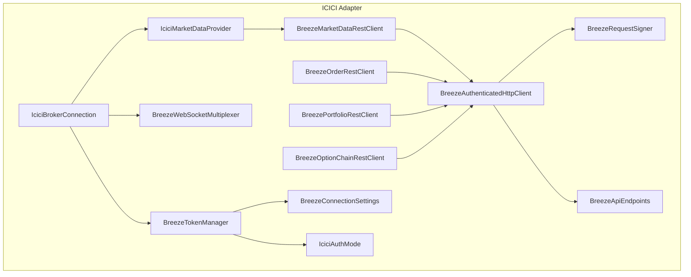
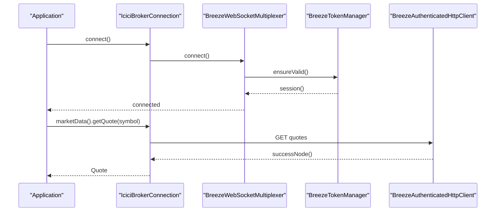
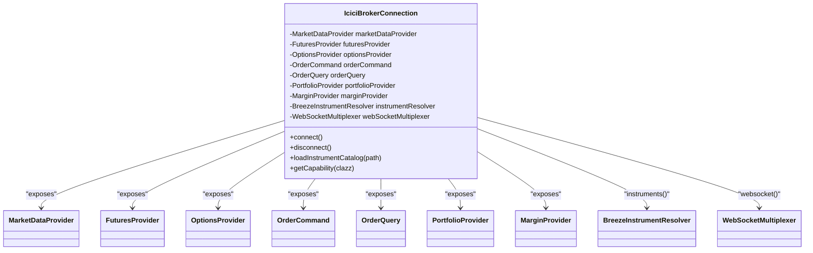
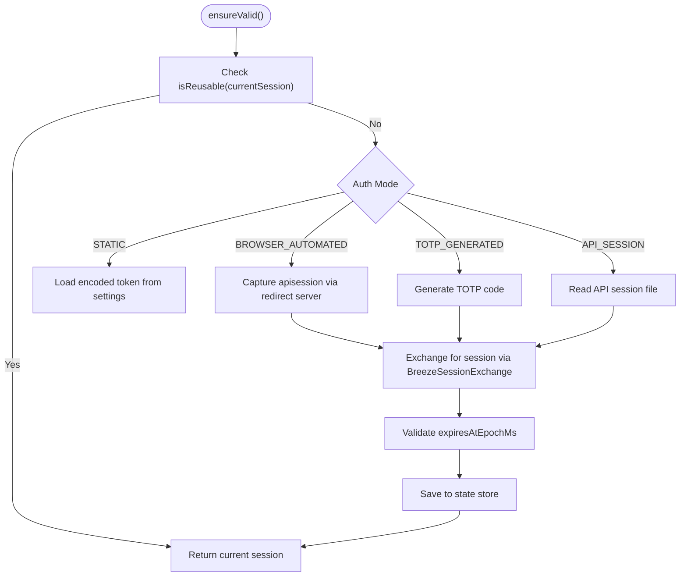
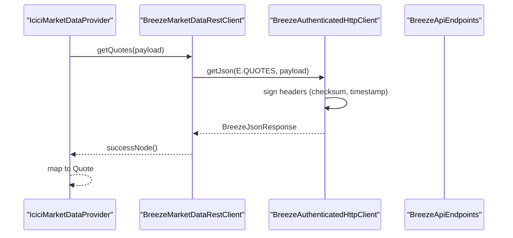
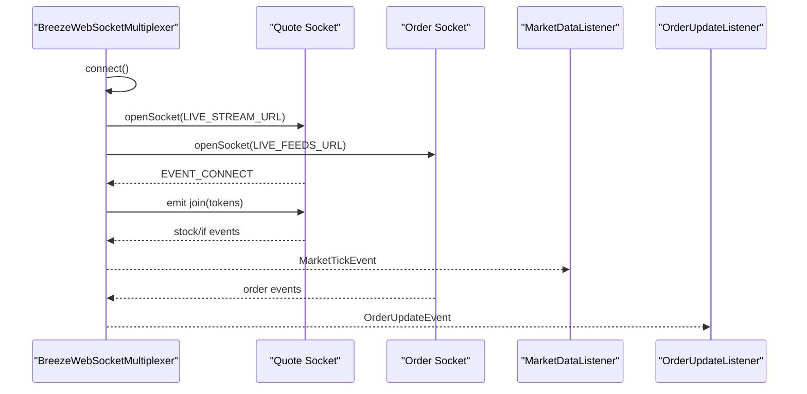
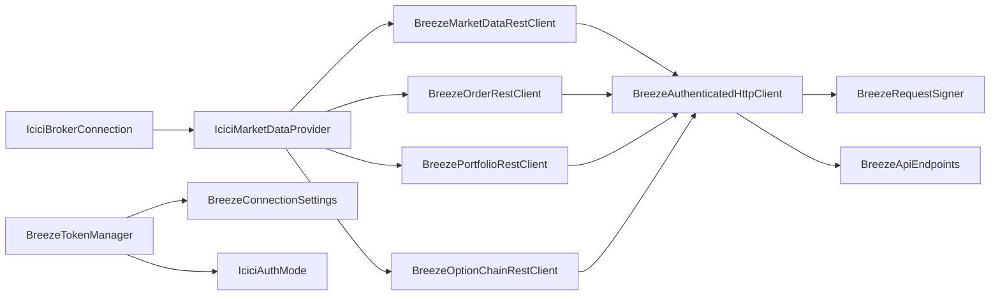

# ICICI Direct Broker Adapter

<cite>
**Referenced Files in This Document**
- [IciciBrokerConnection.java](file://broker/icici/src/main/java/com/tradej/broker/icici/IciciBrokerConnection.java)
- [BreezeTokenManager.java](file://broker/icici/src/main/java/com/tradej/broker/icici/auth/BreezeTokenManager.java)
- [BreezeApiSessionRedirectServer.java](file://broker/icici/src/main/java/com/tradej/broker/icici/auth/BreezeApiSessionRedirectServer.java)
- [BreezeAuthenticatedHttpClient.java](file://broker/icici/src/main/java/com/tradej/broker/icici/http/BreezeAuthenticatedHttpClient.java)
- [BreezeRequestSigner.java](file://broker/icici/src/main/java/com/tradej/broker/icici/http/BreezeRequestSigner.java)
- [BreezeApiEndpoints.java](file://broker/icici/src/main/java/com/tradej/broker/icici/constants/BreezeApiEndpoints.java)
- [BreezeConnectionSettings.java](file://broker/icici/src/main/java/com/tradej/broker/icici/config/BreezeConnectionSettings.java)
- [IciciAuthMode.java](file://broker/icici/src/main/java/com/tradej/broker/icici/config/IciciAuthMode.java)
- [BreezeMarketDataRestClient.java](file://broker/icici/src/main/java/com/tradej/broker/icici/rest/BreezeMarketDataRestClient.java)
- [BreezeOrderRestClient.java](file://broker/icici/src/main/java/com/tradej/broker/icici/rest/BreezeOrderRestClient.java)
- [BreezePortfolioRestClient.java](file://broker/icici/src/main/java/com/tradej/broker/icici/rest/BreezePortfolioRestClient.java)
- [BreezeOptionChainRestClient.java](file://broker/icici/src/main/java/com/tradej/broker/icici/rest/BreezeOptionChainRestClient.java)
- [BreezeWebSocketMultiplexer.java](file://broker/icici/src/main/java/com/tradej/broker/icici/websocket/BreezeWebSocketMultiplexer.java)
- [IciciMarketDataProvider.java](file://broker/icici/src/main/java/com/tradej/broker/icici/adapter/IciciMarketDataProvider.java)
</cite>

## Table of Contents
1. [Introduction](#introduction)
2. [Project Structure](#project-structure)
3. [Core Components](#core-components)
4. [Architecture Overview](#architecture-overview)
5. [Detailed Component Analysis](#detailed-component-analysis)
6. [Dependency Analysis](#dependency-analysis)
7. [Performance Considerations](#performance-considerations)
8. [Troubleshooting Guide](#troubleshooting-guide)
9. [Conclusion](#conclusion)
10. [Appendices](#appendices)

## Introduction
This document describes the ICICI Direct broker adapter built on the Breeze API. It covers the IciciBrokerConnection orchestration, Breeze API authentication via BreezeTokenManager, REST API integration patterns, market data and order management clients, and the WebSocket multiplexer for real-time streaming. It also documents ICICI-specific features such as equity and derivatives support, market status monitoring, authentication modes, session management, endpoint configuration, and practical usage patterns for market data retrieval, order placement, and portfolio management. Error handling, rate limiting, and connection resilience are explained with concrete references to the implementation.

## Project Structure
The ICICI adapter resides under broker/icici and is organized by concerns:
- Connection and capabilities: IciciBrokerConnection
- Authentication: BreezeTokenManager, BreezeApiSessionRedirectServer, BreezeSession* components
- HTTP and signing: BreezeAuthenticatedHttpClient, BreezeRequestSigner
- REST clients: BreezeMarketDataRestClient, BreezeOrderRestClient, BreezePortfolioRestClient, BreezeOptionChainRestClient
- WebSocket: BreezeWebSocketMultiplexer
- Configuration: BreezeConnectionSettings, BreezeApiEndpoints, IciciAuthMode
- Adapters: IciciMarketDataProvider and others

**Diagram sources**
- [IciciBrokerConnection.java:36-83](file://broker/icici/src/main/java/com/tradej/broker/icici/IciciBrokerConnection.java#L36-L83)
- [IciciMarketDataProvider.java:21-38](file://broker/icici/src/main/java/com/tradej/broker/icici/adapter/IciciMarketDataProvider.java#L21-L38)
- [BreezeWebSocketMultiplexer.java:46-102](file://broker/icici/src/main/java/com/tradej/broker/icici/websocket/BreezeWebSocketMultiplexer.java#L46-L102)
- [BreezeTokenManager.java:12-49](file://broker/icici/src/main/java/com/tradej/broker/icici/auth/BreezeTokenManager.java#L12-L49)
- [BreezeAuthenticatedHttpClient.java:20-54](file://broker/icici/src/main/java/com/tradej/broker/icici/http/BreezeAuthenticatedHttpClient.java#L20-L54)
- [BreezeRequestSigner.java:19-62](file://broker/icici/src/main/java/com/tradej/broker/icici/http/BreezeRequestSigner.java#L19-L62)
- [BreezeApiEndpoints.java:3-38](file://broker/icici/src/main/java/com/tradej/broker/icici/constants/BreezeApiEndpoints.java#L3-L38)
- [BreezeConnectionSettings.java:5-21](file://broker/icici/src/main/java/com/tradej/broker/icici/config/BreezeConnectionSettings.java#L5-L21)
- [IciciAuthMode.java:3-18](file://broker/icici/src/main/java/com/tradej/broker/icici/config/IciciAuthMode.java#L3-L18)
- [BreezeMarketDataRestClient.java:10-15](file://broker/icici/src/main/java/com/tradej/broker/icici/rest/BreezeMarketDataRestClient.java#L10-L15)
- [BreezeOrderRestClient.java:8-13](file://broker/icici/src/main/java/com/tradej/broker/icici/rest/BreezeOrderRestClient.java#L8-L13)
- [BreezePortfolioRestClient.java:9-16](file://broker/icici/src/main/java/com/tradej/broker/icici/rest/BreezePortfolioRestClient.java#L9-L16)
- [BreezeOptionChainRestClient.java:8-13](file://broker/icici/src/main/java/com/tradej/broker/icici/rest/BreezeOptionChainRestClient.java#L8-L13)

**Section sources**
- [IciciBrokerConnection.java:36-83](file://broker/icici/src/main/java/com/tradej/broker/icici/IciciBrokerConnection.java#L36-L83)
- [BreezeApiEndpoints.java:3-38](file://broker/icici/src/main/java/com/tradej/broker/icici/constants/BreezeApiEndpoints.java#L3-L38)

## Core Components
- IciciBrokerConnection: Orchestrates capabilities and exposes MarketData, Orders, Portfolio, Margin, Instruments, and WebSocket multiplexer. It delegates capability discovery to the underlying providers and adapters.
- BreezeTokenManager: Centralizes session lifecycle, supports multiple auth modes, handles refresh with a buffer, and persists state.
- BreezeAuthenticatedHttpClient: Implements signed HTTP requests with checksums and timestamps, and v2 GET endpoints without checksums.
- BreezeRequestSigner: Generates timestamp and SHA-256 checksum per ICICI requirements.
- REST Clients: Typed wrappers around authenticated HTTP for quotes, order CRUD, trades, portfolio holdings, positions, demat holdings, and option chain.
- WebSocket Multiplexer: Manages two sockets (quotes and order feeds), subscription lifecycle, event parsing, deduplication, and health monitoring.
- Configuration: BreezeConnectionSettings and IciciAuthMode define endpoints, credentials, and auth modes.

**Section sources**
- [IciciBrokerConnection.java:36-239](file://broker/icici/src/main/java/com/tradej/broker/icici/IciciBrokerConnection.java#L36-L239)
- [BreezeTokenManager.java:12-156](file://broker/icici/src/main/java/com/tradej/broker/icici/auth/BreezeTokenManager.java#L12-L156)
- [BreezeAuthenticatedHttpClient.java:20-160](file://broker/icici/src/main/java/com/tradej/broker/icici/http/BreezeAuthenticatedHttpClient.java#L20-L160)
- [BreezeRequestSigner.java:19-62](file://broker/icici/src/main/java/com/tradej/broker/icici/http/BreezeRequestSigner.java#L19-L62)
- [BreezeMarketDataRestClient.java:10-37](file://broker/icici/src/main/java/com/tradej/broker/icici/rest/BreezeMarketDataRestClient.java#L10-L37)
- [BreezeOrderRestClient.java:8-43](file://broker/icici/src/main/java/com/tradej/broker/icici/rest/BreezeOrderRestClient.java#L8-L43)
- [BreezePortfolioRestClient.java:9-38](file://broker/icici/src/main/java/com/tradej/broker/icici/rest/BreezePortfolioRestClient.java#L9-L38)
- [BreezeOptionChainRestClient.java:8-19](file://broker/icici/src/main/java/com/tradej/broker/icici/rest/BreezeOptionChainRestClient.java#L8-L19)
- [BreezeWebSocketMultiplexer.java:46-494](file://broker/icici/src/main/java/com/tradej/broker/icici/websocket/BreezeWebSocketMultiplexer.java#L46-L494)
- [BreezeApiEndpoints.java:3-38](file://broker/icici/src/main/java/com/tradej/broker/icici/constants/BreezeApiEndpoints.java#L3-L38)
- [BreezeConnectionSettings.java:5-58](file://broker/icici/src/main/java/com/tradej/broker/icici/config/BreezeConnectionSettings.java#L5-L58)
- [IciciAuthMode.java:3-18](file://broker/icici/src/main/java/com/tradej/broker/icici/config/IciciAuthMode.java#L3-L18)

## Architecture Overview
The adapter follows a layered design:
- Orchestration: IciciBrokerConnection aggregates capabilities and wires providers.
- Authentication: BreezeTokenManager ensures a valid session and coordinates with browser/TOTP/API session flows.
- Transport: BreezeAuthenticatedHttpClient signs requests and sends them to Breeze endpoints.
- Domain: REST clients encapsulate endpoints; WebSocket multiplexer streams quotes and order updates.
- Configuration: Settings and endpoints are centralized for easy tuning.

**Diagram sources**
- [IciciBrokerConnection.java:155-158](file://broker/icici/src/main/java/com/tradej/broker/icici/IciciBrokerConnection.java#L155-L158)
- [BreezeWebSocketMultiplexer.java:104-121](file://broker/icici/src/main/java/com/tradej/broker/icici/websocket/BreezeWebSocketMultiplexer.java#L104-L121)
- [BreezeTokenManager.java:51-92](file://broker/icici/src/main/java/com/tradej/broker/icici/auth/BreezeTokenManager.java#L51-L92)
- [BreezeAuthenticatedHttpClient.java:56-70](file://broker/icici/src/main/java/com/tradej/broker/icici/http/BreezeAuthenticatedHttpClient.java#L56-L70)
- [BreezeMarketDataRestClient.java:17-19](file://broker/icici/src/main/java/com/tradej/broker/icici/rest/BreezeMarketDataRestClient.java#L17-L19)

## Detailed Component Analysis

### IciciBrokerConnection
Responsibilities:
- Exposes MarketData, Orders, Portfolio, Margin, Instruments, and WebSocket multiplexer.
- Provides capability discovery for Options, Futures, Margin, Alerts, and Advanced Orders.
- Delegates instrument catalog loading to the resolver.

Key behaviors:
- Capability lookup checks provider instances and capability marker types.
- Connect/disconnect delegate to the WebSocket multiplexer.
- Unsupported capabilities raise UnsupportedOperationException.

**Diagram sources**
- [IciciBrokerConnection.java:36-83](file://broker/icici/src/main/java/com/tradej/broker/icici/IciciBrokerConnection.java#L36-L83)

**Section sources**
- [IciciBrokerConnection.java:36-239](file://broker/icici/src/main/java/com/tradej/broker/icici/IciciBrokerConnection.java#L36-L239)

### BreezeTokenManager and Authentication Setup
BreezeTokenManager manages session lifecycle:
- Validates reusable sessions considering a refresh buffer.
- Supports four auth modes: STATIC, TOTP_GENERATED, API_SESSION, BROWSER_AUTOMATED.
- Persists and reloads session state.
- Uses BreezeSessionExchange, BreezeTotpGenerator, and BreezeBrowserSessionCapture internally.

**Diagram sources**
- [BreezeTokenManager.java:51-131](file://broker/icici/src/main/java/com/tradej/broker/icici/auth/BreezeTokenManager.java#L51-L131)
- [BreezeApiSessionRedirectServer.java:18-96](file://broker/icici/src/main/java/com/tradej/broker/icici/auth/BreezeApiSessionRedirectServer.java#L18-L96)

**Section sources**
- [BreezeTokenManager.java:12-156](file://broker/icici/src/main/java/com/tradej/broker/icici/auth/BreezeTokenManager.java#L12-L156)
- [BreezeApiSessionRedirectServer.java:18-96](file://broker/icici/src/main/java/com/tradej/broker/icici/auth/BreezeApiSessionRedirectServer.java#L18-L96)
- [BreezeConnectionSettings.java:5-58](file://broker/icici/src/main/java/com/tradej/broker/icici/config/BreezeConnectionSettings.java#L5-L58)
- [IciciAuthMode.java:3-18](file://broker/icici/src/main/java/com/tradej/broker/icici/config/IciciAuthMode.java#L3-L18)

### REST API Integration Patterns
REST clients encapsulate endpoint-specific logic:
- BreezeMarketDataRestClient: quotes and depth retrieval.
- BreezeOrderRestClient: place, modify, cancel, query order details, and fetch trades.
- BreezePortfolioRestClient: funds, demat holdings, portfolio holdings, and positions.
- BreezeOptionChainRestClient: option chain retrieval.

Transport:
- BreezeAuthenticatedHttpClient signs requests with timestamp and checksum headers.
- v2 GET endpoints bypass checksums and use X-SessionToken and apikey.

**Diagram sources**
- [IciciMarketDataProvider.java:40-50](file://broker/icici/src/main/java/com/tradej/broker/icici/adapter/IciciMarketDataProvider.java#L40-L50)
- [BreezeMarketDataRestClient.java:17-19](file://broker/icici/src/main/java/com/tradej/broker/icici/rest/BreezeMarketDataRestClient.java#L17-L19)
- [BreezeAuthenticatedHttpClient.java:117-154](file://broker/icici/src/main/java/com/tradej/broker/icici/http/BreezeAuthenticatedHttpClient.java#L117-L154)
- [BreezeApiEndpoints.java:13-25](file://broker/icici/src/main/java/com/tradej/broker/icici/constants/BreezeApiEndpoints.java#L13-L25)

**Section sources**
- [BreezeMarketDataRestClient.java:10-37](file://broker/icici/src/main/java/com/tradej/broker/icici/rest/BreezeMarketDataRestClient.java#L10-L37)
- [BreezeOrderRestClient.java:8-43](file://broker/icici/src/main/java/com/tradej/broker/icici/rest/BreezeOrderRestClient.java#L8-L43)
- [BreezePortfolioRestClient.java:9-38](file://broker/icici/src/main/java/com/tradej/broker/icici/rest/BreezePortfolioRestClient.java#L9-L38)
- [BreezeOptionChainRestClient.java:8-19](file://broker/icici/src/main/java/com/tradej/broker/icici/rest/BreezeOptionChainRestClient.java#L8-L19)
- [BreezeAuthenticatedHttpClient.java:20-160](file://broker/icici/src/main/java/com/tradej/broker/icici/http/BreezeAuthenticatedHttpClient.java#L20-L160)
- [BreezeRequestSigner.java:19-62](file://broker/icici/src/main/java/com/tradej/broker/icici/http/BreezeRequestSigner.java#L19-L62)
- [BreezeApiEndpoints.java:3-38](file://broker/icici/src/main/java/com/tradej/broker/icici/constants/BreezeApiEndpoints.java#L3-L38)

### WebSocket Multiplexer for Real-Time Streaming
The multiplexer:
- Maintains separate sockets for quotes and order feeds.
- Subscribes to instruments by resolving script codes and emitting join/leave.
- Parses quote and order events, deduplicates order events, and emits domain events.
- Monitors health and triggers reconnect notifications.

**Diagram sources**
- [BreezeWebSocketMultiplexer.java:104-239](file://broker/icici/src/main/java/com/tradej/broker/icici/websocket/BreezeWebSocketMultiplexer.java#L104-L239)

**Section sources**
- [BreezeWebSocketMultiplexer.java:46-494](file://broker/icici/src/main/java/com/tradej/broker/icici/websocket/BreezeWebSocketMultiplexer.java#L46-L494)

### ICICI-Specific Features and Capabilities
- Equity trading: MarketDataProvider and OrderRestClient cover equity instruments.
- Derivatives: Options and futures are indicated by capability markers and exchange segment resolution in the multiplexer.
- Market status monitoring: IciciMarketStatusProvider is wired in the connection.
- Portfolio management: Funds, holdings, positions, and demat holdings are exposed via dedicated REST client.

**Section sources**
- [IciciBrokerConnection.java:78-83](file://broker/icici/src/main/java/com/tradej/broker/icici/IciciBrokerConnection.java#L78-L83)
- [BreezeWebSocketMultiplexer.java:455-468](file://broker/icici/src/main/java/com/tradej/broker/icici/websocket/BreezeWebSocketMultiplexer.java#L455-L468)
- [BreezePortfolioRestClient.java:18-32](file://broker/icici/src/main/java/com/tradej/broker/icici/rest/BreezePortfolioRestClient.java#L18-L32)

### Practical Usage Examples
Note: The following describe the flows without reproducing code. See the “Section sources” for precise locations.

- Market data retrieval:
  - Resolve instrument to Breeze definition.
  - Call BreezeMarketDataRestClient.getQuotes with mapped payload.
  - Map response to Quote via BreezeDomainMapper.
  - Reference: [IciciMarketDataProvider.java:40-50](file://broker/icici/src/main/java/com/tradej/broker/icici/adapter/IciciMarketDataProvider.java#L40-L50), [BreezeMarketDataRestClient.java:17-19](file://broker/icici/src/main/java/com/tradej/broker/icici/rest/BreezeMarketDataRestClient.java#L17-L19)

- Order placement:
  - Build payload and call BreezeOrderRestClient.placeOrder.
  - Handle successNode for acknowledgment.
  - Reference: [BreezeOrderRestClient.java:15-17](file://broker/icici/src/main/java/com/tradej/broker/icici/rest/BreezeOrderRestClient.java#L15-L17)

- Portfolio management:
  - Retrieve funds, holdings, positions, or demat holdings via BreezePortfolioRestClient methods.
  - Reference: [BreezePortfolioRestClient.java:18-32](file://broker/icici/src/main/java/com/tradej/broker/icici/rest/BreezePortfolioRestClient.java#L18-L32)

- Real-time streaming:
  - Subscribe to instruments via WebSocketMultiplexer.subscribe.
  - Receive MarketTickEvent and OrderUpdateEvent through listeners.
  - Reference: [BreezeWebSocketMultiplexer.java:167-200](file://broker/icici/src/main/java/com/tradej/broker/icici/websocket/BreezeWebSocketMultiplexer.java#L167-L200)

## Dependency Analysis
The adapter exhibits clean separation of concerns:
- IciciBrokerConnection depends on providers and adapters.
- Providers depend on REST clients and instrument resolvers.
- REST clients depend on BreezeAuthenticatedHttpClient.
- HTTP client depends on BreezeRequestSigner and BreezeApiEndpoints.
- Authentication depends on BreezeTokenManager and configuration.

**Diagram sources**
- [IciciBrokerConnection.java:36-83](file://broker/icici/src/main/java/com/tradej/broker/icici/IciciBrokerConnection.java#L36-L83)
- [IciciMarketDataProvider.java:21-38](file://broker/icici/src/main/java/com/tradej/broker/icici/adapter/IciciMarketDataProvider.java#L21-L38)
- [BreezeMarketDataRestClient.java:10-15](file://broker/icici/src/main/java/com/tradej/broker/icici/rest/BreezeMarketDataRestClient.java#L10-L15)
- [BreezeOrderRestClient.java:8-13](file://broker/icici/src/main/java/com/tradej/broker/icici/rest/BreezeOrderRestClient.java#L8-L13)
- [BreezePortfolioRestClient.java:9-16](file://broker/icici/src/main/java/com/tradej/broker/icici/rest/BreezePortfolioRestClient.java#L9-L16)
- [BreezeOptionChainRestClient.java:8-13](file://broker/icici/src/main/java/com/tradej/broker/icici/rest/BreezeOptionChainRestClient.java#L8-L13)
- [BreezeAuthenticatedHttpClient.java:20-54](file://broker/icici/src/main/java/com/tradej/broker/icici/http/BreezeAuthenticatedHttpClient.java#L20-L54)
- [BreezeRequestSigner.java:19-62](file://broker/icici/src/main/java/com/tradej/broker/icici/http/BreezeRequestSigner.java#L19-L62)
- [BreezeApiEndpoints.java:3-38](file://broker/icici/src/main/java/com/tradej/broker/icici/constants/BreezeApiEndpoints.java#L3-L38)
- [BreezeTokenManager.java:12-49](file://broker/icici/src/main/java/com/tradej/broker/icici/auth/BreezeTokenManager.java#L12-L49)
- [BreezeConnectionSettings.java:5-21](file://broker/icici/src/main/java/com/tradej/broker/icici/config/BreezeConnectionSettings.java#L5-L21)
- [IciciAuthMode.java:3-18](file://broker/icici/src/main/java/com/tradej/broker/icici/config/IciciAuthMode.java#L3-L18)

**Section sources**
- [IciciBrokerConnection.java:36-239](file://broker/icici/src/main/java/com/tradej/broker/icici/IciciBrokerConnection.java#L36-L239)
- [BreezeAuthenticatedHttpClient.java:20-160](file://broker/icici/src/main/java/com/tradej/broker/icici/http/BreezeAuthenticatedHttpClient.java#L20-L160)

## Performance Considerations
- Request timeouts: HTTP client enforces a fixed timeout for REST calls.
- Deduplication: WebSocket multiplexer tracks latest order statuses to avoid duplicate events.
- Health monitoring: WebSocket multiplexer monitors idle periods and emits connectivity events.
- Batch operations: MarketDataProvider supports batch retrieval for LTP and quotes.
- Subscription resubscription: On reconnect, the multiplexer resubscribes to all instruments automatically.

[No sources needed since this section provides general guidance]

## Troubleshooting Guide
Common issues and remedies:
- Authentication failures:
  - Ensure the correct auth mode is configured and secrets are present.
  - For browser automation, confirm the redirect server receives apisession and the file path is readable.
  - References: [BreezeTokenManager.java:119-131](file://broker/icici/src/main/java/com/tradej/broker/icici/auth/BreezeTokenManager.java#L119-L131), [BreezeApiSessionRedirectServer.java:43-62](file://broker/icici/src/main/java/com/tradej/broker/icici/auth/BreezeApiSessionRedirectServer.java#L43-L62)
- Request errors:
  - Inspect BreezeHttpException for non-success responses and endpoint/method context.
  - Verify checksum and timestamp generation align with BreezeRequestSigner.
  - References: [BreezeAuthenticatedHttpClient.java:137-154](file://broker/icici/src/main/java/com/tradej/broker/icici/http/BreezeAuthenticatedHttpClient.java#L137-L154), [BreezeRequestSigner.java:35-47](file://broker/icici/src/main/java/com/tradej/broker/icici/http/BreezeRequestSigner.java#L35-L47)
- WebSocket connectivity:
  - Check EVENT_CONNECT logs and resubscription behavior.
  - Validate instrument script code resolution and exchange segments.
  - References: [BreezeWebSocketMultiplexer.java:223-232](file://broker/icici/src/main/java/com/tradej/broker/icici/websocket/BreezeWebSocketMultiplexer.java#L223-L232), [BreezeWebSocketMultiplexer.java:455-468](file://broker/icici/src/main/java/com/tradej/broker/icici/websocket/BreezeWebSocketMultiplexer.java#L455-L468)
- Rate limiting and resilience:
  - Implement retry/backoff around REST calls and leverage the resilience executor for reconnects.
  - References: [BreezeWebSocketMultiplexer.java:113-120](file://broker/icici/src/main/java/com/tradej/broker/icici/websocket/BreezeWebSocketMultiplexer.java#L113-L120)

**Section sources**
- [BreezeTokenManager.java:119-156](file://broker/icici/src/main/java/com/tradej/broker/icici/auth/BreezeTokenManager.java#L119-L156)
- [BreezeApiSessionRedirectServer.java:43-96](file://broker/icici/src/main/java/com/tradej/broker/icici/auth/BreezeApiSessionRedirectServer.java#L43-L96)
- [BreezeAuthenticatedHttpClient.java:137-154](file://broker/icici/src/main/java/com/tradej/broker/icici/http/BreezeAuthenticatedHttpClient.java#L137-L154)
- [BreezeRequestSigner.java:35-47](file://broker/icici/src/main/java/com/tradej/broker/icici/http/BreezeRequestSigner.java#L35-L47)
- [BreezeWebSocketMultiplexer.java:223-239](file://broker/icici/src/main/java/com/tradej/broker/icici/websocket/BreezeWebSocketMultiplexer.java#L223-L239)

## Conclusion
The ICICI Direct adapter cleanly separates concerns across authentication, transport, REST, and WebSocket layers. It supports equity and derivatives workflows, provides robust session management, and offers real-time streaming with health monitoring and deduplication. The modular design enables straightforward extension and maintenance.

[No sources needed since this section summarizes without analyzing specific files]

## Appendices

### Endpoint and Header Configuration
- Base URLs and endpoints are centralized in BreezeApiEndpoints.
- Headers include Content-Type, Accept, X-Checksum, X-Timestamp, X-AppKey, apikey, X-SessionToken, and User-Agent.

**Section sources**
- [BreezeApiEndpoints.java:3-38](file://broker/icici/src/main/java/com/tradej/broker/icici/constants/BreezeApiEndpoints.java#L3-L38)

### Authentication Modes
- STATIC: Pre-resolved session token.
- TOTP_GENERATED: TOTP code passed to customer details.
- API_SESSION: Manual capture of API session stored in a file.
- BROWSER_AUTOMATED: Automated headless login and apisession capture.

**Section sources**
- [IciciAuthMode.java:3-18](file://broker/icici/src/main/java/com/tradej/broker/icici/config/IciciAuthMode.java#L3-L18)
- [BreezeConnectionSettings.java:5-21](file://broker/icici/src/main/java/com/tradej/broker/icici/config/BreezeConnectionSettings.java#L5-L21)