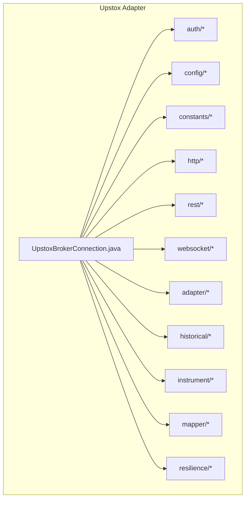
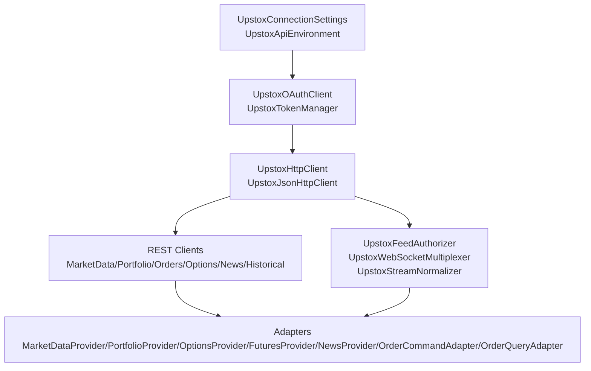
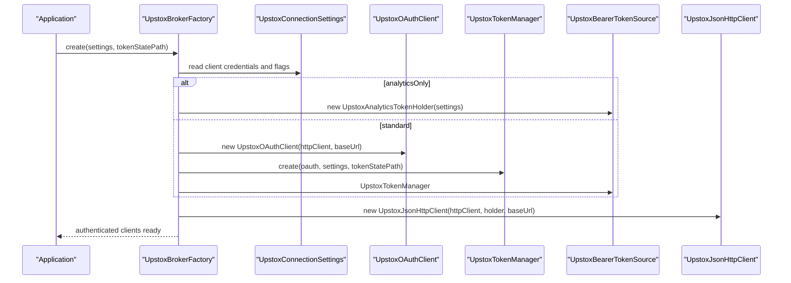
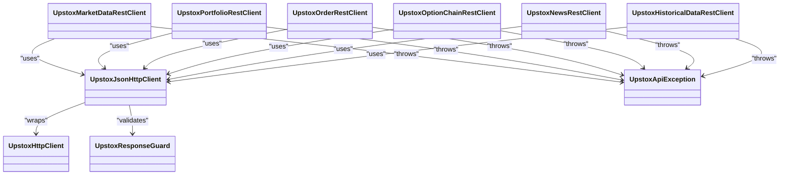
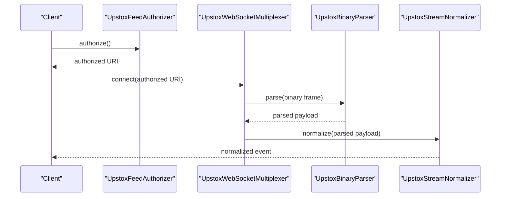
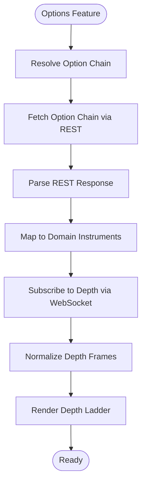
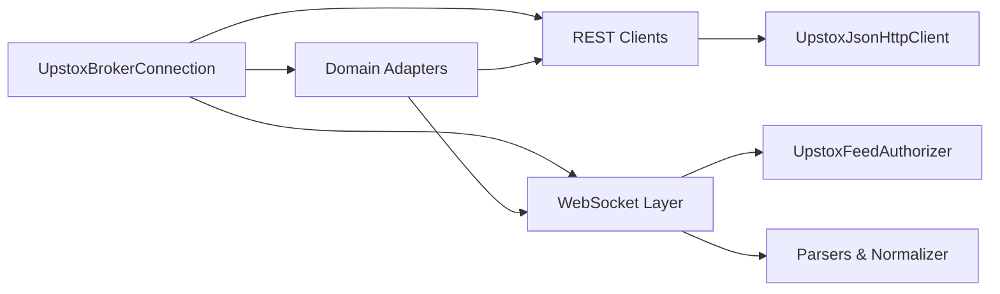

# Upstox Broker Adapter

<cite>
**Referenced Files in This Document**
- [UpstoxBrokerConnection.java](file://broker/upstox/src/main/java/com/tradej/broker/upstox/UpstoxBrokerConnection.java)
- [UpstoxTokenManager.java](file://broker/upstox/src/main/java/com/tradej/broker/upstox/auth/UpstoxTokenManager.java)
- [UpstoxOAuthClient.java](file://broker/upstox/src/main/java/com/tradej/broker/upstox/auth/UpstoxOAuthClient.java)
- [UpstoxBearerTokenSource.java](file://broker/upstox/src/main/java/com/tradej/broker/upstox/auth/UpstoxBearerTokenSource.java)
- [UpstoxAnalyticsTokenHolder.java](file://broker/upstox/src/main/java/com/tradej/broker/upstox/auth/UpstoxAnalyticsTokenHolder.java)
- [UpstoxStaticTokenHolder.java](file://broker/upstox/src/main/java/com/tradej/broker/upstox/auth/UpstoxStaticTokenHolder.java)
- [UpstoxConnectionSettings.java](file://broker/upstox/src/main/java/com/tradej/broker/upstox/config/UpstoxConnectionSettings.java)
- [UpstoxApiEnvironment.java](file://broker/upstox/src/main/java/com/tradej/broker/upstox/config/UpstoxApiEnvironment.java)
- [UpstoxEndpoints.java](file://broker/upstox/src/main/java/com/tradej/broker/upstox/constants/UpstoxEndpoints.java)
- [UpstoxHttpClient.java](file://broker/upstox/src/main/java/com/tradej/broker/upstox/http/UpstoxHttpClient.java)
- [UpstoxJsonHttpClient.java](file://broker/upstox/src/main/java/com/tradej/broker/upstox/http/UpstoxJsonHttpClient.java)
- [UpstoxApiException.java](file://broker/upstox/src/main/java/com/tradej/broker/upstox/http/UpstoxApiException.java)
- [UpstoxResponseGuard.java](file://broker/upstox/src/main/java/com/tradej/broker/upstox/http/UpstoxResponseGuard.java)
- [UpstoxMarketDataProvider.java](file://broker/upstox/src/main/java/com/tradej/broker/upstox/adapter/UpstoxMarketDataProvider.java)
- [UpstoxPortfolioProvider.java](file://broker/upstox/src/main/java/com/tradej/broker/upstox/adapter/UpstoxPortfolioProvider.java)
- [UpstoxOptionsProvider.java](file://broker/upstox/src/main/java/com/tradej/broker/upstox/adapter/UpstoxOptionsProvider.java)
- [UpstoxFuturesProvider.java](file://broker/upstox/src/main/java/com/tradej/broker/upstox/adapter/UpstoxFuturesProvider.java)
- [UpstoxNewsProvider.java](file://broker/upstox/src/main/java/com/tradej/broker/upstox/adapter/UpstoxNewsProvider.java)
- [UpstoxOrderCommandAdapter.java](file://broker/upstox/src/main/java/com/tradej/broker/upstox/adapter/UpstoxOrderCommandAdapter.java)
- [UpstoxOrderQueryAdapter.java](file://broker/upstox/src/main/java/com/tradej/broker/upstox/adapter/UpstoxOrderQueryAdapter.java)
- [UpstoxMarketDataRestClient.java](file://broker/upstox/src/main/java/com/tradej/broker/upstox/rest/UpstoxMarketDataRestClient.java)
- [UpstoxPortfolioRestClient.java](file://broker/upstox/src/main/java/com/tradej/broker/upstox/rest/UpstoxPortfolioRestClient.java)
- [UpstoxOrderRestClient.java](file://broker/upstox/src/main/java/com/tradej/broker/upstox/rest/UpstoxOrderRestClient.java)
- [UpstoxOptionChainRestClient.java](file://broker/upstox/src/main/java/com/tradej/broker/upstox/rest/UpstoxOptionChainRestClient.java)
- [UpstoxNewsRestClient.java](file://broker/upstox/src/main/java/com/tradej/broker/upstox/rest/UpstoxNewsRestClient.java)
- [UpstoxHistoricalDataRestClient.java](file://broker/upstox/src/main/java/com/tradej/broker/upstox/rest/UpstoxHistoricalDataRestClient.java)
- [UpstoxWebSocketMultiplexer.java](file://broker/upstox/src/main/java/com/tradej/broker/upstox/websocket/UpstoxWebSocketMultiplexer.java)
- [UpstoxFeedAuthorizer.java](file://broker/upstox/src/main/java/com/tradej/broker/upstox/websocket/UpstoxFeedAuthorizer.java)
- [UpstoxStreamNormalizer.java](file://broker/upstox/src/main/java/com/tradej/broker/upstox/websocket/UpstoxStreamNormalizer.java)
- [UpstoxBinaryParser.java](file://broker/upstox/src/main/java/com/tradej/broker/upstox/websocket/UpstoxBinaryParser.java)
- [UpstoxPortfolioStreamParser.java](file://broker/upstox/src/main/java/com/tradej/broker/upstox/websocket/UpstoxPortfolioStreamParser.java)
- [UpstoxRetryExecutor.java](file://broker/upstox/src/main/java/com/tradej/broker/upstox/resilience/UpstoxRetryExecutor.java)
- [UpstoxBrokerFactory.java](file://composition/src/main/java/com/tradej/composition/UpstoxBrokerFactory.java)
- [UpstoxConfiguration.java](file://app/src/main/java/com/tradej/app/config/UpstoxConfiguration.java)
- [UpstoxHealthIndicator.java](file://app/src/main/java/com/tradej/app/health/UpstoxHealthIndicator.java)
- [UpstoxMarketFeedIntegrationTest.java](file://app/src/test/java/com/tradej/app/integration/UpstoxMarketFeedIntegrationTest.java)
- [UpstoxOrderLifecycleIntegrationTest.java](file://app/src/test/java/com/tradej/app/integration/UpstoxOrderLifecycleIntegrationTest.java)
- [UpstoxPortfolioIntegrationTest.java](file://app/src/test/java/com/tradej/app/integration/UpstoxPortfolioIntegrationTest.java)
- [UpstoxHistoricalDataLiveIntegrationTest.java](file://app/src/test/java/com/tradej/app/integration/UpstoxHistoricalDataLiveIntegrationTest.java)
- [UpstoxNewsIntegrationTest.java](file://app/src/test/java/com/tradej/app/integration/UpstoxNewsIntegrationTest.java)
</cite>

## Table of Contents
1. [Introduction](#introduction)
2. [Project Structure](#project-structure)
3. [Core Components](#core-components)
4. [Architecture Overview](#architecture-overview)
5. [Detailed Component Analysis](#detailed-component-analysis)
6. [Dependency Analysis](#dependency-analysis)
7. [Performance Considerations](#performance-considerations)
8. [Troubleshooting Guide](#troubleshooting-guide)
9. [Conclusion](#conclusion)
10. [Appendices](#appendices)

## Introduction
This document describes the Upstox broker adapter implementation, focusing on the UpstoxBrokerConnection architecture, OAuth-based authentication via UpstoxTokenManager, REST API integration patterns, and WebSocket multiplexing for real-time streaming. It also documents Upstox-specific features such as equity trading, options trading, and market depth visualization, along with authentication flow setup, token refresh mechanisms, API rate limiting strategies, and practical examples of market data queries, order placement workflows, and portfolio tracking. Error handling, retry policies, and connection resilience patterns specific to Upstox integration are included.

## Project Structure
The Upstox adapter is organized into cohesive packages:
- auth: OAuth and token management
- config: connection settings and environment selection
- constants: endpoint definitions
- http: HTTP client wrappers and response guards
- rest: REST clients for market data, portfolio, orders, options, news, and historical data
- websocket: WebSocket authorizer, multiplexer, parsers, and normalizer
- adapter: domain adapters for market data, portfolio, options, futures, news, and order operations
- historical: historical candle mapping and data service
- instrument: instrument resolution and loader
- mapper: domain mapping utilities
- resilience: retry executor and circuit breaker integration
- UpstoxBrokerConnection: primary connection orchestration

**Section sources**
- [UpstoxBrokerConnection.java](file://broker/upstox/src/main/java/com/tradej/broker/upstox/UpstoxBrokerConnection.java)
- [UpstoxBrokerFactory.java](file://composition/src/main/java/com/tradej/composition/UpstoxBrokerFactory.java)

## Core Components
- UpstoxBrokerConnection: Central orchestrator that wires token management, REST clients, WebSocket multiplexer, and adapters.
- UpstoxTokenManager: Manages OAuth lifecycle, token acquisition, refresh, and persistence.
- REST Clients: Typed clients for market data, portfolio, orders, options chain, news, and historical data.
- WebSocket Multiplexer: Authorizes and manages real-time streams for market data and portfolio updates.
- Adapters: Translate Upstox API responses into domain models for market data, portfolio, options, futures, news, and order operations.

**Section sources**
- [UpstoxBrokerConnection.java](file://broker/upstox/src/main/java/com/tradej/broker/upstox/UpstoxBrokerConnection.java)
- [UpstoxTokenManager.java](file://broker/upstox/src/main/java/com/tradej/broker/upstox/auth/UpstoxTokenManager.java)
- [UpstoxMarketDataRestClient.java](file://broker/upstox/src/main/java/com/tradej/broker/upstox/rest/UpstoxMarketDataRestClient.java)
- [UpstoxWebSocketMultiplexer.java](file://broker/upstox/src/main/java/com/tradej/broker/upstox/websocket/UpstoxWebSocketMultiplexer.java)

## Architecture Overview
The Upstox adapter follows a layered architecture:
- Configuration and Environment: Select sandbox/live base URL and connection settings.
- Authentication: OAuth client and token manager handle PKCE-based authorization and token refresh.
- HTTP Layer: Authenticated HTTP clients wrap bearer tokens and enforce response guardrails.
- REST Layer: Typed REST clients encapsulate Upstox endpoints for market data, portfolio, orders, options, news, and historical data.
- WebSocket Layer: Feed authorizer obtains one-time URIs; multiplexer normalizes and routes messages.
- Domain Adapters: Convert raw API responses into domain models for downstream systems.

**Diagram sources**
- [UpstoxBrokerFactory.java](file://composition/src/main/java/com/tradej/composition/UpstoxBrokerFactory.java)
- [UpstoxConnectionSettings.java](file://broker/upstox/src/main/java/com/tradej/broker/upstox/config/UpstoxConnectionSettings.java)
- [UpstoxApiEnvironment.java](file://broker/upstox/src/main/java/com/tradej/broker/upstox/config/UpstoxApiEnvironment.java)
- [UpstoxOAuthClient.java](file://broker/upstox/src/main/java/com/tradej/broker/upstox/auth/UpstoxOAuthClient.java)
- [UpstoxTokenManager.java](file://broker/upstox/src/main/java/com/tradej/broker/upstox/auth/UpstoxTokenManager.java)
- [UpstoxHttpClient.java](file://broker/upstox/src/main/java/com/tradej/broker/upstox/http/UpstoxHttpClient.java)
- [UpstoxJsonHttpClient.java](file://broker/upstox/src/main/java/com/tradej/broker/upstox/http/UpstoxJsonHttpClient.java)
- [UpstoxEndpoints.java](file://broker/upstox/src/main/java/com/tradej/broker/upstox/constants/UpstoxEndpoints.java)
- [UpstoxFeedAuthorizer.java](file://broker/upstox/src/main/java/com/tradej/broker/upstox/websocket/UpstoxFeedAuthorizer.java)
- [UpstoxWebSocketMultiplexer.java](file://broker/upstox/src/main/java/com/tradej/broker/upstox/websocket/UpstoxWebSocketMultiplexer.java)
- [UpstoxStreamNormalizer.java](file://broker/upstox/src/main/java/com/tradej/broker/upstox/websocket/UpstoxStreamNormalizer.java)
- [UpstoxMarketDataProvider.java](file://broker/upstox/src/main/java/com/tradej/broker/upstox/adapter/UpstoxMarketDataProvider.java)
- [UpstoxPortfolioProvider.java](file://broker/upstox/src/main/java/com/tradej/broker/upstox/adapter/UpstoxPortfolioProvider.java)
- [UpstoxOptionsProvider.java](file://broker/upstox/src/main/java/com/tradej/broker/upstox/adapter/UpstoxOptionsProvider.java)
- [UpstoxFuturesProvider.java](file://broker/upstox/src/main/java/com/tradej/broker/upstox/adapter/UpstoxFuturesProvider.java)
- [UpstoxNewsProvider.java](file://broker/upstox/src/main/java/com/tradej/broker/upstox/adapter/UpstoxNewsProvider.java)
- [UpstoxOrderCommandAdapter.java](file://broker/upstox/src/main/java/com/tradej/broker/upstox/adapter/UpstoxOrderCommandAdapter.java)
- [UpstoxOrderQueryAdapter.java](file://broker/upstox/src/main/java/com/tradej/broker/upstox/adapter/UpstoxOrderQueryAdapter.java)

## Detailed Component Analysis

### UpstoxBrokerConnection
- Responsibilities:
  - Construct authenticated HTTP clients using bearer tokens.
  - Initialize REST clients for market data, portfolio, orders, options, news, and historical data.
  - Configure WebSocket multiplexer with feed authorizer and stream normalizer.
  - Wire domain adapters for market data, portfolio, options, futures, news, and order operations.
  - Integrate instrument resolver/loader and domain mapper.
- Integration points:
  - UpstoxConnectionSettings and UpstoxApiEnvironment for base URL and environment.
  - UpstoxTokenManager or UpstoxAnalyticsTokenHolder for token sourcing.
  - UpstoxRetryExecutor for resilient REST calls.
- Resilience:
  - Uses circuit breaker and rate limiter to protect upstream calls.

```mermaid
classDiagram
class UpstoxBrokerConnection {
+connect()
+disconnect()
+websocket()
}
class UpstoxConnectionSettings
class UpstoxApiEnvironment
class UpstoxBearerTokenSource
class UpstoxTokenManager
class UpstoxOAuthClient
class UpstoxHttpClient
class UpstoxJsonHttpClient
class UpstoxMarketDataProvider
class UpstoxPortfolioProvider
class UpstoxOptionsProvider
class UpstoxFuturesProvider
class UpstoxNewsProvider
class UpstoxOrderCommandAdapter
class UpstoxOrderQueryAdapter
class UpstoxWebSocketMultiplexer
class UpstoxFeedAuthorizer
class UpstoxStreamNormalizer
class UpstoxRetryExecutor
UpstoxBrokerConnection --> UpstoxConnectionSettings : "uses"
UpstoxBrokerConnection --> UpstoxApiEnvironment : "uses"
UpstoxBrokerConnection --> UpstoxBearerTokenSource : "uses"
UpstoxBearerTokenSource <|-- UpstoxTokenManager
UpstoxBearerTokenSource <|-- UpstoxAnalyticsTokenHolder
UpstoxBrokerConnection --> UpstoxOAuthClient : "constructs"
UpstoxBrokerConnection --> UpstoxHttpClient : "constructs"
UpstoxBrokerConnection --> UpstoxJsonHttpClient : "constructs"
UpstoxBrokerConnection --> UpstoxMarketDataProvider : "constructs"
UpstoxBrokerConnection --> UpstoxPortfolioProvider : "constructs"
UpstoxBrokerConnection --> UpstoxOptionsProvider : "constructs"
UpstoxBrokerConnection --> UpstoxFuturesProvider : "constructs"
UpstoxBrokerConnection --> UpstoxNewsProvider : "constructs"
UpstoxBrokerConnection --> UpstoxOrderCommandAdapter : "constructs"
UpstoxBrokerConnection --> UpstoxOrderQueryAdapter : "constructs"
UpstoxBrokerConnection --> UpstoxWebSocketMultiplexer : "constructs"
UpstoxWebSocketMultiplexer --> UpstoxFeedAuthorizer : "uses"
UpstoxWebSocketMultiplexer --> UpstoxStreamNormalizer : "uses"
UpstoxBrokerConnection --> UpstoxRetryExecutor : "uses"
```

**Diagram sources**
- [UpstoxBrokerConnection.java](file://broker/upstox/src/main/java/com/tradej/broker/upstox/UpstoxBrokerConnection.java)
- [UpstoxConnectionSettings.java](file://broker/upstox/src/main/java/com/tradej/broker/upstox/config/UpstoxConnectionSettings.java)
- [UpstoxApiEnvironment.java](file://broker/upstox/src/main/java/com/tradej/broker/upstox/config/UpstoxApiEnvironment.java)
- [UpstoxBearerTokenSource.java](file://broker/upstox/src/main/java/com/tradej/broker/upstox/auth/UpstoxBearerTokenSource.java)
- [UpstoxTokenManager.java](file://broker/upstox/src/main/java/com/tradej/broker/upstox/auth/UpstoxTokenManager.java)
- [UpstoxOAuthClient.java](file://broker/upstox/src/main/java/com/tradej/broker/upstox/auth/UpstoxOAuthClient.java)
- [UpstoxHttpClient.java](file://broker/upstox/src/main/java/com/tradej/broker/upstox/http/UpstoxHttpClient.java)
- [UpstoxJsonHttpClient.java](file://broker/upstox/src/main/java/com/tradej/broker/upstox/http/UpstoxJsonHttpClient.java)
- [UpstoxMarketDataProvider.java](file://broker/upstox/src/main/java/com/tradej/broker/upstox/adapter/UpstoxMarketDataProvider.java)
- [UpstoxPortfolioProvider.java](file://broker/upstox/src/main/java/com/tradej/broker/upstox/adapter/UpstoxPortfolioProvider.java)
- [UpstoxOptionsProvider.java](file://broker/upstox/src/main/java/com/tradej/broker/upstox/adapter/UpstoxOptionsProvider.java)
- [UpstoxFuturesProvider.java](file://broker/upstox/src/main/java/com/tradej/broker/upstox/adapter/UpstoxFuturesProvider.java)
- [UpstoxNewsProvider.java](file://broker/upstox/src/main/java/com/tradej/broker/upstox/adapter/UpstoxNewsProvider.java)
- [UpstoxOrderCommandAdapter.java](file://broker/upstox/src/main/java/com/tradej/broker/upstox/adapter/UpstoxOrderCommandAdapter.java)
- [UpstoxOrderQueryAdapter.java](file://broker/upstox/src/main/java/com/tradej/broker/upstox/adapter/UpstoxOrderQueryAdapter.java)
- [UpstoxWebSocketMultiplexer.java](file://broker/upstox/src/main/java/com/tradej/broker/upstox/websocket/UpstoxWebSocketMultiplexer.java)
- [UpstoxFeedAuthorizer.java](file://broker/upstox/src/main/java/com/tradej/broker/upstox/websocket/UpstoxFeedAuthorizer.java)
- [UpstoxStreamNormalizer.java](file://broker/upstox/src/main/java/com/tradej/broker/upstox/websocket/UpstoxStreamNormalizer.java)
- [UpstoxRetryExecutor.java](file://broker/upstox/src/main/java/com/tradej/broker/upstox/resilience/UpstoxRetryExecutor.java)

**Section sources**
- [UpstoxBrokerConnection.java](file://broker/upstox/src/main/java/com/tradej/broker/upstox/UpstoxBrokerConnection.java)

### Authentication and Token Management
- OAuth flow:
  - UpstoxOAuthClient handles PKCE-based authorization and token exchange.
  - UpstoxTokenManager persists and refreshes tokens, honoring refresh buffer and expiry buffers.
  - Token sources:
    - UpstoxBearerTokenSource interface implemented by UpstoxTokenManager and UpstoxAnalyticsTokenHolder.
    - UpstoxStaticTokenHolder supports static tokens for testing or special scenarios.
- Configuration:
  - UpstoxConnectionSettings encapsulates clientId, clientSecret, redirectUri, accessToken, refreshToken, analyticsToken, extendedToken, analyticsOnly flag, sandbox mode, redirectServerPort, refreshBufferMs, and tokenExpiryBufferMs.
  - UpstoxApiEnvironment selects SANDBOX vs LIVE base URLs.
- Health monitoring:
  - UpstoxHealthIndicator checks WebSocket connectivity, token validity, and REST availability.

**Diagram sources**
- [UpstoxBrokerFactory.java](file://composition/src/main/java/com/tradej/composition/UpstoxBrokerFactory.java)
- [UpstoxConnectionSettings.java](file://broker/upstox/src/main/java/com/tradej/broker/upstox/config/UpstoxConnectionSettings.java)
- [UpstoxOAuthClient.java](file://broker/upstox/src/main/java/com/tradej/broker/upstox/auth/UpstoxOAuthClient.java)
- [UpstoxTokenManager.java](file://broker/upstox/src/main/java/com/tradej/broker/upstox/auth/UpstoxTokenManager.java)
- [UpstoxBearerTokenSource.java](file://broker/upstox/src/main/java/com/tradej/broker/upstox/auth/UpstoxBearerTokenSource.java)
- [UpstoxAnalyticsTokenHolder.java](file://broker/upstox/src/main/java/com/tradej/broker/upstox/auth/UpstoxAnalyticsTokenHolder.java)
- [UpstoxStaticTokenHolder.java](file://broker/upstox/src/main/java/com/tradej/broker/upstox/auth/UpstoxStaticTokenHolder.java)
- [UpstoxApiEnvironment.java](file://broker/upstox/src/main/java/com/tradej/broker/upstox/config/UpstoxApiEnvironment.java)
- [UpstoxJsonHttpClient.java](file://broker/upstox/src/main/java/com/tradej/broker/upstox/http/UpstoxJsonHttpClient.java)

**Section sources**
- [UpstoxTokenManager.java](file://broker/upstox/src/main/java/com/tradej/broker/upstox/auth/UpstoxTokenManager.java)
- [UpstoxOAuthClient.java](file://broker/upstox/src/main/java/com/tradej/broker/upstox/auth/UpstoxOAuthClient.java)
- [UpstoxBearerTokenSource.java](file://broker/upstox/src/main/java/com/tradej/broker/upstox/auth/UpstoxBearerTokenSource.java)
- [UpstoxAnalyticsTokenHolder.java](file://broker/upstox/src/main/java/com/tradej/broker/upstox/auth/UpstoxAnalyticsTokenHolder.java)
- [UpstoxStaticTokenHolder.java](file://broker/upstox/src/main/java/com/tradej/broker/upstox/auth/UpstoxStaticTokenHolder.java)
- [UpstoxConnectionSettings.java](file://broker/upstox/src/main/java/com/tradej/broker/upstox/config/UpstoxConnectionSettings.java)
- [UpstoxApiEnvironment.java](file://broker/upstox/src/main/java/com/tradej/broker/upstox/config/UpstoxApiEnvironment.java)
- [UpstoxHealthIndicator.java](file://app/src/main/java/com/tradej/app/health/UpstoxHealthIndicator.java)

### REST API Integration Patterns
- Market Data REST Client:
  - Provides LTP, OHLC, depth, and quote endpoints.
  - Integrated with UpstoxMarketDataProvider for domain translation.
- Portfolio REST Client:
  - Balances, holdings, and positions retrieval.
  - Integrated with UpstoxPortfolioProvider.
- Orders REST Client:
  - Place, modify, cancel, and query orders.
  - Integrated with UpstoxOrderCommandAdapter and UpstoxOrderQueryAdapter.
- Options REST Client:
  - Option chain retrieval and resolution.
  - Integrated with UpstoxOptionsProvider.
- News REST Client:
  - News feed retrieval.
  - Integrated with UpstoxNewsProvider.
- Historical Data REST Client:
  - Candle generation and historical bars.
  - Integrated with UpstoxHistoricalDataService and UpstoxHistoricalCandleMapper.
- HTTP Layer:
  - UpstoxHttpClient wraps bearer tokens.
  - UpstoxJsonHttpClient serializes/deserializes JSON.
  - UpstoxResponseGuard validates HTTP responses.
  - UpstoxApiException standardizes API errors.

**Diagram sources**
- [UpstoxMarketDataRestClient.java](file://broker/upstox/src/main/java/com/tradej/broker/upstox/rest/UpstoxMarketDataRestClient.java)
- [UpstoxPortfolioRestClient.java](file://broker/upstox/src/main/java/com/tradej/broker/upstox/rest/UpstoxPortfolioRestClient.java)
- [UpstoxOrderRestClient.java](file://broker/upstox/src/main/java/com/tradej/broker/upstox/rest/UpstoxOrderRestClient.java)
- [UpstoxOptionChainRestClient.java](file://broker/upstox/src/main/java/com/tradej/broker/upstox/rest/UpstoxOptionChainRestClient.java)
- [UpstoxNewsRestClient.java](file://broker/upstox/src/main/java/com/tradej/broker/upstox/rest/UpstoxNewsRestClient.java)
- [UpstoxHistoricalDataRestClient.java](file://broker/upstox/src/main/java/com/tradej/broker/upstox/rest/UpstoxHistoricalDataRestClient.java)
- [UpstoxHttpClient.java](file://broker/upstox/src/main/java/com/tradej/broker/upstox/http/UpstoxHttpClient.java)
- [UpstoxJsonHttpClient.java](file://broker/upstox/src/main/java/com/tradej/broker/upstox/http/UpstoxJsonHttpClient.java)
- [UpstoxResponseGuard.java](file://broker/upstox/src/main/java/com/tradej/broker/upstox/http/UpstoxResponseGuard.java)
- [UpstoxApiException.java](file://broker/upstox/src/main/java/com/tradej/broker/upstox/http/UpstoxApiException.java)

**Section sources**
- [UpstoxMarketDataRestClient.java](file://broker/upstox/src/main/java/com/tradej/broker/upstox/rest/UpstoxMarketDataRestClient.java)
- [UpstoxPortfolioRestClient.java](file://broker/upstox/src/main/java/com/tradej/broker/upstox/rest/UpstoxPortfolioRestClient.java)
- [UpstoxOrderRestClient.java](file://broker/upstox/src/main/java/com/tradej/broker/upstox/rest/UpstoxOrderRestClient.java)
- [UpstoxOptionChainRestClient.java](file://broker/upstox/src/main/java/com/tradej/broker/upstox/rest/UpstoxOptionChainRestClient.java)
- [UpstoxNewsRestClient.java](file://broker/upstox/src/main/java/com/tradej/broker/upstox/rest/UpstoxNewsRestClient.java)
- [UpstoxHistoricalDataRestClient.java](file://broker/upstox/src/main/java/com/tradej/broker/upstox/rest/UpstoxHistoricalDataRestClient.java)
- [UpstoxHttpClient.java](file://broker/upstox/src/main/java/com/tradej/broker/upstox/http/UpstoxHttpClient.java)
- [UpstoxJsonHttpClient.java](file://broker/upstox/src/main/java/com/tradej/broker/upstox/http/UpstoxJsonHttpClient.java)
- [UpstoxResponseGuard.java](file://broker/upstox/src/main/java/com/tradej/broker/upstox/http/UpstoxResponseGuard.java)
- [UpstoxApiException.java](file://broker/upstox/src/main/java/com/tradej/broker/upstox/http/UpstoxApiException.java)

### WebSocket Multiplexer for Real-Time Streaming
- Authorization:
  - UpstoxFeedAuthorizer obtains one-time authorized URIs for market data and portfolio streams.
- Multiplexing:
  - UpstoxWebSocketMultiplexer manages connections, parses binary frames, and normalizes events.
- Parsers and Normalizer:
  - UpstoxBinaryParser decodes binary market data frames.
  - UpstoxPortfolioStreamParser decodes JSON portfolio updates.
  - UpstoxStreamNormalizer converts parsed frames into standardized domain events.

**Diagram sources**
- [UpstoxFeedAuthorizer.java](file://broker/upstox/src/main/java/com/tradej/broker/upstox/websocket/UpstoxFeedAuthorizer.java)
- [UpstoxWebSocketMultiplexer.java](file://broker/upstox/src/main/java/com/tradej/broker/upstox/websocket/UpstoxWebSocketMultiplexer.java)
- [UpstoxBinaryParser.java](file://broker/upstox/src/main/java/com/tradej/broker/upstox/websocket/UpstoxBinaryParser.java)
- [UpstoxPortfolioStreamParser.java](file://broker/upstox/src/main/java/com/tradej/broker/upstox/websocket/UpstoxPortfolioStreamParser.java)
- [UpstoxStreamNormalizer.java](file://broker/upstox/src/main/java/com/tradej/broker/upstox/websocket/UpstoxStreamNormalizer.java)

**Section sources**
- [UpstoxFeedAuthorizer.java](file://broker/upstox/src/main/java/com/tradej/broker/upstox/websocket/UpstoxFeedAuthorizer.java)
- [UpstoxWebSocketMultiplexer.java](file://broker/upstox/src/main/java/com/tradej/broker/upstox/websocket/UpstoxWebSocketMultiplexer.java)
- [UpstoxBinaryParser.java](file://broker/upstox/src/main/java/com/tradej/broker/upstox/websocket/UpstoxBinaryParser.java)
- [UpstoxPortfolioStreamParser.java](file://broker/upstox/src/main/java/com/tradej/broker/upstox/websocket/UpstoxPortfolioStreamParser.java)
- [UpstoxStreamNormalizer.java](file://broker/upstox/src/main/java/com/tradej/broker/upstox/websocket/UpstoxStreamNormalizer.java)

### Upstox-Specific Features
- Equity Trading:
  - Market data REST client and WebSocket multiplexer provide live quotes and depth.
  - UpstoxMarketDataProvider integrates REST and WebSocket feeds.
- Options Trading:
  - UpstoxOptionsProvider resolves option chains and instruments.
  - Option chain REST client supplies strike prices, expiries, and Greeks.
- Market Depth Visualization:
  - Binary parser and stream normalizer convert depth frames into ladder-like structures for UI rendering.

**Diagram sources**
- [UpstoxOptionsProvider.java](file://broker/upstox/src/main/java/com/tradej/broker/upstox/adapter/UpstoxOptionsProvider.java)
- [UpstoxOptionChainRestClient.java](file://broker/upstox/src/main/java/com/tradej/broker/upstox/rest/UpstoxOptionChainRestClient.java)
- [UpstoxBinaryParser.java](file://broker/upstox/src/main/java/com/tradej/broker/upstox/websocket/UpstoxBinaryParser.java)
- [UpstoxStreamNormalizer.java](file://broker/upstox/src/main/java/com/tradej/broker/upstox/websocket/UpstoxStreamNormalizer.java)

**Section sources**
- [UpstoxMarketDataProvider.java](file://broker/upstox/src/main/java/com/tradej/broker/upstox/adapter/UpstoxMarketDataProvider.java)
- [UpstoxOptionsProvider.java](file://broker/upstox/src/main/java/com/tradej/broker/upstox/adapter/UpstoxOptionsProvider.java)
- [UpstoxOptionChainRestClient.java](file://broker/upstox/src/main/java/com/tradej/broker/upstox/rest/UpstoxOptionChainRestClient.java)
- [UpstoxBinaryParser.java](file://broker/upstox/src/main/java/com/tradej/broker/upstox/websocket/UpstoxBinaryParser.java)
- [UpstoxStreamNormalizer.java](file://broker/upstox/src/main/java/com/tradej/broker/upstox/websocket/UpstoxStreamNormalizer.java)

### Practical Examples

#### Market Data Queries
- REST-based LTP/Quote/Depth:
  - Use UpstoxMarketDataRestClient to fetch latest tick data and depth.
  - UpstoxMarketDataProvider normalizes and emits domain events.
- WebSocket-based streaming:
  - Use UpstoxWebSocketMultiplexer with UpstoxFeedAuthorizer to subscribe to market data feed.
  - UpstoxBinaryParser decodes frames; UpstoxStreamNormalizer emits normalized events.

**Section sources**
- [UpstoxMarketDataProvider.java](file://broker/upstox/src/main/java/com/tradej/broker/upstox/adapter/UpstoxMarketDataProvider.java)
- [UpstoxMarketDataRestClient.java](file://broker/upstox/src/main/java/com/tradej/broker/upstox/rest/UpstoxMarketDataRestClient.java)
- [UpstoxWebSocketMultiplexer.java](file://broker/upstox/src/main/java/com/tradej/broker/upstox/websocket/UpstoxWebSocketMultiplexer.java)
- [UpstoxFeedAuthorizer.java](file://broker/upstox/src/main/java/com/tradej/broker/upstox/websocket/UpstoxFeedAuthorizer.java)
- [UpstoxBinaryParser.java](file://broker/upstox/src/main/java/com/tradej/broker/upstox/websocket/UpstoxBinaryParser.java)
- [UpstoxStreamNormalizer.java](file://broker/upstox/src/main/java/com/tradej/broker/upstox/websocket/UpstoxStreamNormalizer.java)

#### Order Placement Workflows
- Place/Modify/Cancel:
  - Use UpstoxOrderRestClient via UpstoxOrderCommandAdapter to send commands.
  - Use UpstoxOrderRestClient via UpstoxOrderQueryAdapter to poll order status.
- Portfolio Updates:
  - Subscribe to portfolio stream via UpstoxWebSocketMultiplexer with UpstoxFeedAuthorizer.
  - UpstoxPortfolioStreamParser decodes updates; UpstoxStreamNormalizer emits normalized events.

**Section sources**
- [UpstoxOrderCommandAdapter.java](file://broker/upstox/src/main/java/com/tradej/broker/upstox/adapter/UpstoxOrderCommandAdapter.java)
- [UpstoxOrderQueryAdapter.java](file://broker/upstox/src/main/java/com/tradej/broker/upstox/adapter/UpstoxOrderQueryAdapter.java)
- [UpstoxOrderRestClient.java](file://broker/upstox/src/main/java/com/tradej/broker/upstox/rest/UpstoxOrderRestClient.java)
- [UpstoxFeedAuthorizer.java](file://broker/upstox/src/main/java/com/tradej/broker/upstox/websocket/UpstoxFeedAuthorizer.java)
- [UpstoxPortfolioStreamParser.java](file://broker/upstox/src/main/java/com/tradej/broker/upstox/websocket/UpstoxPortfolioStreamParser.java)
- [UpstoxStreamNormalizer.java](file://broker/upstox/src/main/java/com/tradej/broker/upstox/websocket/UpstoxStreamNormalizer.java)

#### Portfolio Tracking
- REST-based balances/holdings/positions:
  - Use UpstoxPortfolioRestClient via UpstoxPortfolioProvider.
- WebSocket-based real-time updates:
  - Use UpstoxWebSocketMultiplexer with portfolio stream authorization.
  - Decode and normalize updates for live portfolio monitoring.

**Section sources**
- [UpstoxPortfolioProvider.java](file://broker/upstox/src/main/java/com/tradej/broker/upstox/adapter/UpstoxPortfolioProvider.java)
- [UpstoxPortfolioRestClient.java](file://broker/upstox/src/main/java/com/tradej/broker/upstox/rest/UpstoxPortfolioRestClient.java)
- [UpstoxWebSocketMultiplexer.java](file://broker/upstox/src/main/java/com/tradej/broker/upstox/websocket/UpstoxWebSocketMultiplexer.java)
- [UpstoxFeedAuthorizer.java](file://broker/upstox/src/main/java/com/tradej/broker/upstox/websocket/UpstoxFeedAuthorizer.java)
- [UpstoxPortfolioStreamParser.java](file://broker/upstox/src/main/java/com/tradej/broker/upstox/websocket/UpstoxPortfolioStreamParser.java)
- [UpstoxStreamNormalizer.java](file://broker/upstox/src/main/java/com/tradej/broker/upstox/websocket/UpstoxStreamNormalizer.java)

## Dependency Analysis
- Coupling:
  - UpstoxBrokerConnection centralizes construction and wiring, reducing cross-package coupling.
  - REST clients depend on UpstoxJsonHttpClient; WebSocket layer depends on UpstoxFeedAuthorizer and parsers.
- Cohesion:
  - Each adapter/module focuses on a single responsibility (market data, portfolio, orders, options, news).
- External Dependencies:
  - Upstox API endpoints defined in UpstoxEndpoints.
  - HTTP client stack with response guardrails and exception handling.
- Integration Points:
  - Instrument resolver/loader and domain mapper unify external identifiers and internal models.

**Diagram sources**
- [UpstoxBrokerConnection.java](file://broker/upstox/src/main/java/com/tradej/broker/upstox/UpstoxBrokerConnection.java)
- [UpstoxEndpoints.java](file://broker/upstox/src/main/java/com/tradej/broker/upstox/constants/UpstoxEndpoints.java)
- [UpstoxJsonHttpClient.java](file://broker/upstox/src/main/java/com/tradej/broker/upstox/http/UpstoxJsonHttpClient.java)
- [UpstoxFeedAuthorizer.java](file://broker/upstox/src/main/java/com/tradej/broker/upstox/websocket/UpstoxFeedAuthorizer.java)
- [UpstoxBinaryParser.java](file://broker/upstox/src/main/java/com/tradej/broker/upstox/websocket/UpstoxBinaryParser.java)
- [UpstoxStreamNormalizer.java](file://broker/upstox/src/main/java/com/tradej/broker/upstox/websocket/UpstoxStreamNormalizer.java)

**Section sources**
- [UpstoxBrokerConnection.java](file://broker/upstox/src/main/java/com/tradej/broker/upstox/UpstoxBrokerConnection.java)
- [UpstoxEndpoints.java](file://broker/upstox/src/main/java/com/tradej/broker/upstox/constants/UpstoxEndpoints.java)
- [UpstoxJsonHttpClient.java](file://broker/upstox/src/main/java/com/tradej/broker/upstox/http/UpstoxJsonHttpClient.java)
- [UpstoxFeedAuthorizer.java](file://broker/upstox/src/main/java/com/tradej/broker/upstox/websocket/UpstoxFeedAuthorizer.java)
- [UpstoxBinaryParser.java](file://broker/upstox/src/main/java/com/tradej/broker/upstox/websocket/UpstoxBinaryParser.java)
- [UpstoxStreamNormalizer.java](file://broker/upstox/src/main/java/com/tradej/broker/upstox/websocket/UpstoxStreamNormalizer.java)

## Performance Considerations
- Rate Limiting:
  - MultiBucketRateLimiter configured for DATA bucket with burst capacity and refill rate.
  - UpstoxRetryExecutor coordinates retries with circuit breaker protection.
- Concurrency:
  - WebSocket multiplexer handles concurrent subscriptions and parsing efficiently.
- Caching:
  - Instrument catalog and domain mapping reduce repeated resolution overhead.
- Backoff and Circuit Breaker:
  - RetryExecutor integrates with circuit breaker to prevent cascading failures under upstream instability.

**Section sources**
- [UpstoxBrokerFactory.java](file://composition/src/main/java/com/tradej/composition/UpstoxBrokerFactory.java)
- [UpstoxRetryExecutor.java](file://broker/upstox/src/main/java/com/tradej/broker/upstox/resilience/UpstoxRetryExecutor.java)

## Troubleshooting Guide
- Authentication Issues:
  - Verify clientId, clientSecret, redirectUri, and sandbox flags in UpstoxConnectionSettings.
  - Check token state persistence and refresh buffer settings.
  - Confirm UpstoxOAuthClient PKCE flow and UpstoxTokenManager refresh logic.
- WebSocket Connectivity:
  - Ensure UpstoxFeedAuthorizer obtains a valid authorized URI.
  - Validate UpstoxWebSocketMultiplexer connection state and frame parsing.
- REST API Errors:
  - Inspect UpstoxResponseGuard and UpstoxApiException for HTTP status and error payloads.
  - Review rate limiting and retry policies via UpstoxRetryExecutor.
- Health Monitoring:
  - Use UpstoxHealthIndicator to detect token expiry, WebSocket connectivity, and REST availability.

**Section sources**
- [UpstoxConnectionSettings.java](file://broker/upstox/src/main/java/com/tradej/broker/upstox/config/UpstoxConnectionSettings.java)
- [UpstoxOAuthClient.java](file://broker/upstox/src/main/java/com/tradej/broker/upstox/auth/UpstoxOAuthClient.java)
- [UpstoxTokenManager.java](file://broker/upstox/src/main/java/com/tradej/broker/upstox/auth/UpstoxTokenManager.java)
- [UpstoxFeedAuthorizer.java](file://broker/upstox/src/main/java/com/tradej/broker/upstox/websocket/UpstoxFeedAuthorizer.java)
- [UpstoxWebSocketMultiplexer.java](file://broker/upstox/src/main/java/com/tradej/broker/upstox/websocket/UpstoxWebSocketMultiplexer.java)
- [UpstoxResponseGuard.java](file://broker/upstox/src/main/java/com/tradej/broker/upstox/http/UpstoxResponseGuard.java)
- [UpstoxApiException.java](file://broker/upstox/src/main/java/com/tradej/broker/upstox/http/UpstoxApiException.java)
- [UpstoxHealthIndicator.java](file://app/src/main/java/com/tradej/app/health/UpstoxHealthIndicator.java)

## Conclusion
The Upstox broker adapter provides a robust, modular integration with Upstox APIs. It combines OAuth-based authentication, resilient REST clients, and a powerful WebSocket multiplexer to deliver real-time market data and portfolio updates. The adapter’s design emphasizes separation of concerns, with clear boundaries between authentication, HTTP transport, REST endpoints, and streaming layers. Built-in resilience, rate limiting, and health monitoring ensure reliable operation in live trading environments.

## Appendices

### Configuration Reference
- UpstoxConnectionSettings fields:
  - clientId, clientSecret, redirectUri, accessToken, refreshToken, analyticsToken, extendedToken, analyticsOnly, sandbox, redirectServerPort, refreshBufferMs, tokenExpiryBufferMs.

**Section sources**
- [UpstoxConnectionSettings.java](file://broker/upstox/src/main/java/com/tradej/broker/upstox/config/UpstoxConnectionSettings.java)

### Example Workflows (Integration Tests)
- Market Feed Integration:
  - Demonstrates instrument resolution, REST market data client, WebSocket multiplexer, and providers initialization.
- Order Lifecycle Integration:
  - Exercises order placement, modification, cancellation, and query via REST and WebSocket updates.
- Portfolio Integration:
  - Validates balances, holdings, positions retrieval and real-time portfolio stream updates.
- Historical Data Integration:
  - Verifies historical candle retrieval and mapping.
- News Integration:
  - Confirms news feed retrieval and integration.

**Section sources**
- [UpstoxMarketFeedIntegrationTest.java](file://app/src/test/java/com/tradej/app/integration/UpstoxMarketFeedIntegrationTest.java)
- [UpstoxOrderLifecycleIntegrationTest.java](file://app/src/test/java/com/tradej/app/integration/UpstoxOrderLifecycleIntegrationTest.java)
- [UpstoxPortfolioIntegrationTest.java](file://app/src/test/java/com/tradej/app/integration/UpstoxPortfolioIntegrationTest.java)
- [UpstoxHistoricalDataLiveIntegrationTest.java](file://app/src/test/java/com/tradej/app/integration/UpstoxHistoricalDataLiveIntegrationTest.java)
- [UpstoxNewsIntegrationTest.java](file://app/src/test/java/com/tradej/app/integration/UpstoxNewsIntegrationTest.java)