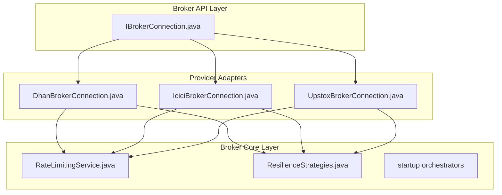
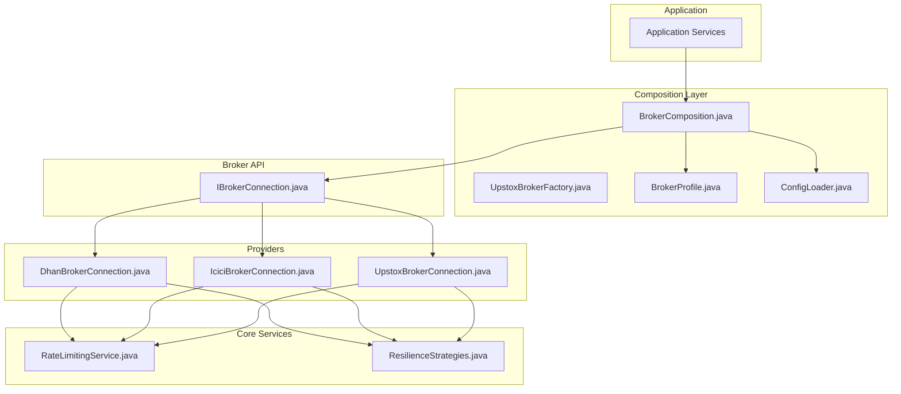
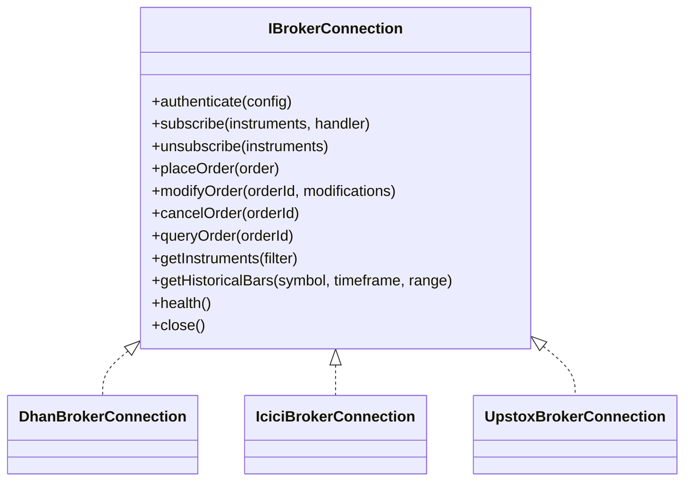
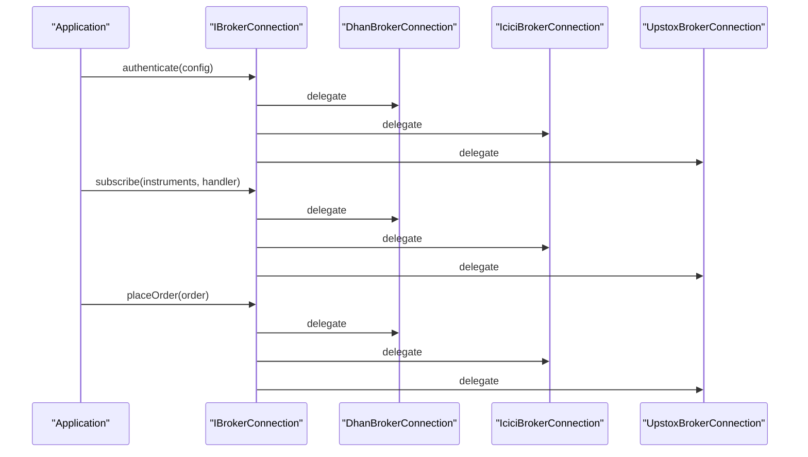
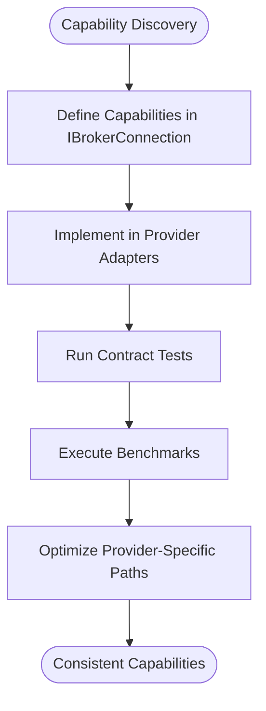
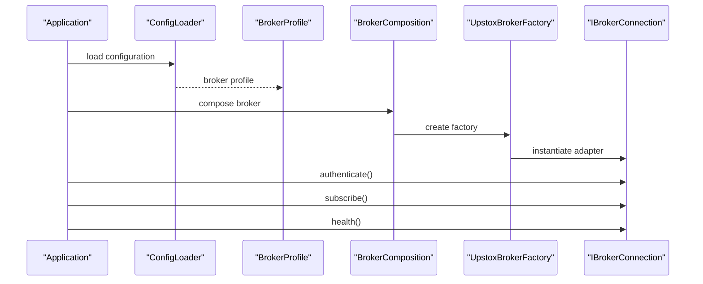
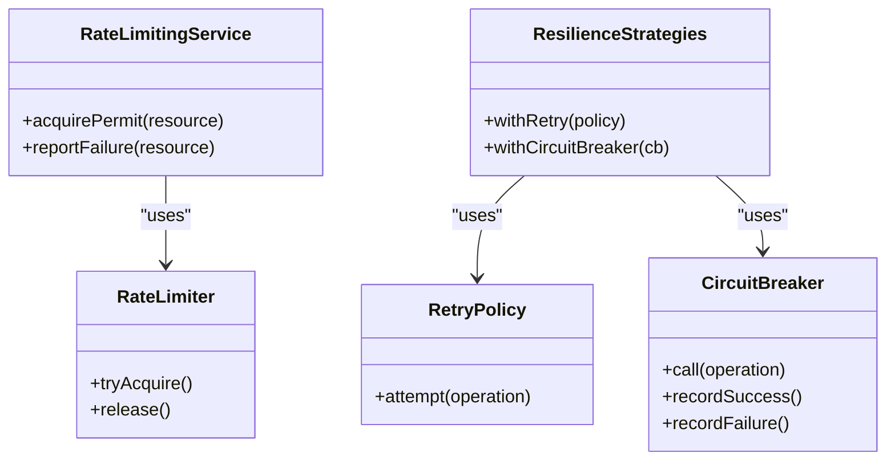
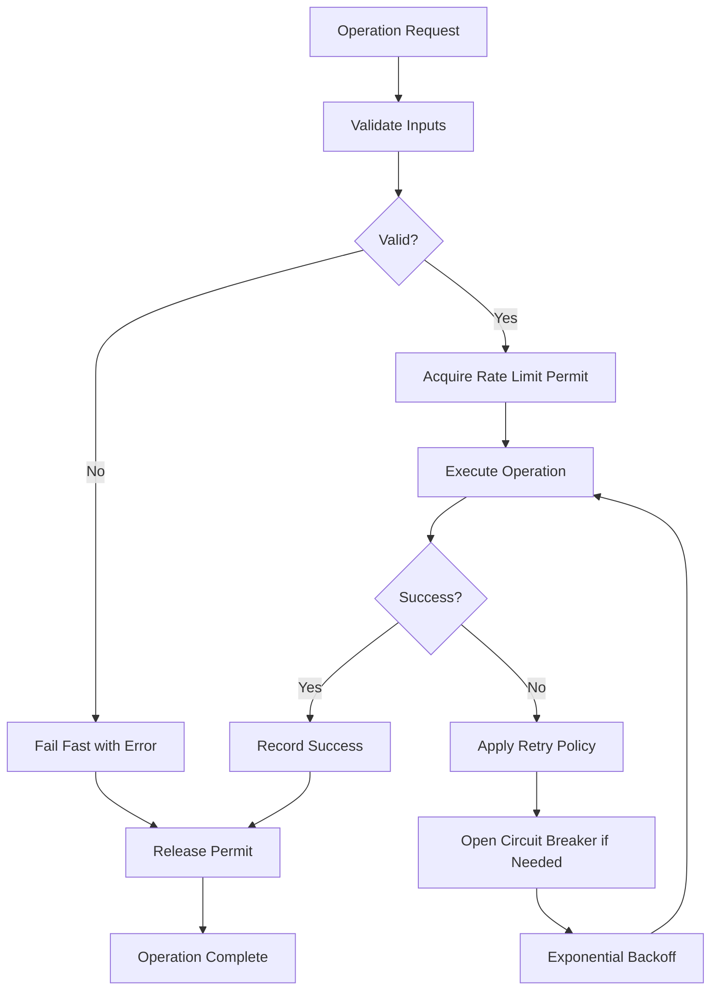
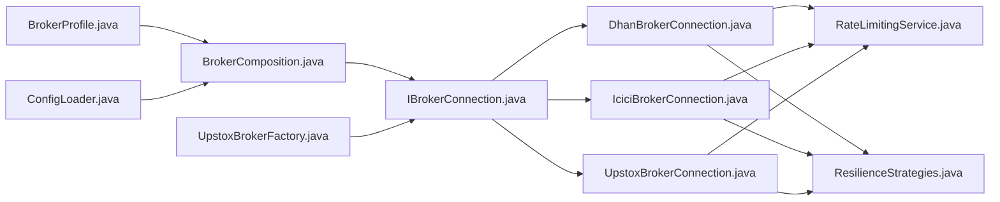

# Broker Architecture Overview

<cite>
**Referenced Files in This Document**
- [IBrokerConnection.java](file://broker/api/src/main/java/com/tradej/broker/api/IBrokerConnection.java)
- [DhanBrokerConnection.java](file://broker/dhan/src/main/java/com/tradej/broker/dhan/DhanBrokerConnection.java)
- [IciciBrokerConnection.java](file://broker/icici/src/main/java/com/tradej/broker/icici/IciciBrokerConnection.java)
- [UpstoxBrokerConnection.java](file://broker/upstox/src/main/java/com/tradej/broker/upstox/UpstoxBrokerConnection.java)
- [BrokerComposition.java](file://composition/src/main/java/com/tradej/composition/BrokerComposition.java)
- [UpstoxBrokerFactory.java](file://composition/src/main/java/com/tradej/composition/UpstoxBrokerFactory.java)
- [BrokerProfile.java](file://composition/src/main/java/com/tradej/composition/config/BrokerProfile.java)
- [ConfigLoader.java](file://composition/src/main/java/com/tradej/composition/config/ConfigLoader.java)
- [RateLimitingService.java](file://broker/core/src/main/java/com/tradej/broker/core/rate/RateLimitingService.java)
- [RateLimiter.java](file://broker/core/src/main/java/com/tradej/broker/core/rate/RateLimiter.java)
- [ResilienceStrategies.java](file://broker/core/src/main/java/com/tradej/broker/core/resilience/ResilienceStrategies.java)
- [RetryPolicy.java](file://broker/core/src/main/java/com/tradej/broker/core/resilience/RetryPolicy.java)
- [CircuitBreaker.java](file://broker/core/src/main/java/com/tradej/broker/core/resilience/CircuitBreaker.java)
- [BrokerErrorTracker.java](file://app/src/test/java/com/tradej/app/health/BrokerErrorTrackerTest.java)
- [IBrokerConnectionContractTest.java](file://broker/api/src/testFixtures/java/com/tradej/broker/api/IBrokerConnectionContractTest.java)
- [DhanBrokerConnectionContractTest.java](file://broker/dhan/src/test/java/com/tradej/broker/dhan/DhanBrokerConnectionContractTest.java)
- [IciciBrokerConnectionContractTest.java](file://broker/icici/src/test/java/com/tradej/broker/icici/IciciBrokerConnectionContractTest.java)
- [UpstoxBrokerConnectionContractTest.java](file://broker/upstox/src/test/java/com/tradej/broker/upstox/UpstoxBrokerConnectionContractTest.java)
- [LoadBalancedGatewayBenchmark.java](file://broker/core/src/jmh/java/com/tradej/broker/core/benchmark/LoadBalancedGatewayBenchmark.java)
- [SubscriptionLookupBenchmark.java](file://broker/core/src/jmh/java/com/tradej/broker/core/benchmark/SubscriptionLookupBenchmark.java)
- [TokenLifecycleBenchmark.java](file://broker/core/src/jmh/java/com/tradej/broker/core/benchmark/TokenLifecycleBenchmark.java)
</cite>

## Table of Contents
1. [Introduction](#introduction)
2. [Project Structure](#project-structure)
3. [Core Components](#core-components)
4. [Architecture Overview](#architecture-overview)
5. [Detailed Component Analysis](#detailed-component-analysis)
6. [Dependency Analysis](#dependency-analysis)
7. [Performance Considerations](#performance-considerations)
8. [Troubleshooting Guide](#troubleshooting-guide)
9. [Conclusion](#conclusion)

## Introduction
This document explains the broker architecture that enables unified connectivity to multiple market data and order execution providers (Dhan, ICICI, Upstox). It focuses on the adapter pattern implementation, the standardized IBrokerConnection interface, capability-based design, lifecycle management, connection establishment, capability discovery, and resilience patterns. It also documents how the system maintains consistency across implementations while enabling broker-specific optimizations.

## Project Structure
The broker subsystem is organized into three layers:
- API layer defines the standardized contract and capabilities
- Core layer implements cross-cutting concerns (rate limiting, resilience, startup orchestration)
- Provider-specific adapters implement the contract for each broker

**Diagram sources**
- [IBrokerConnection.java:1-200](file://broker/api/src/main/java/com/tradej/broker/api/IBrokerConnection.java#L1-L200)
- [DhanBrokerConnection.java:1-200](file://broker/dhan/src/main/java/com/tradej/broker/dhan/DhanBrokerConnection.java#L1-L200)
- [IciciBrokerConnection.java:1-200](file://broker/icici/src/main/java/com/tradej/broker/icici/IciciBrokerConnection.java#L1-L200)
- [UpstoxBrokerConnection.java:1-200](file://broker/upstox/src/main/java/com/tradej/broker/upstox/UpstoxBrokerConnection.java#L1-L200)
- [RateLimitingService.java:1-200](file://broker/core/src/main/java/com/tradej/broker/core/rate/RateLimitingService.java#L1-L200)
- [ResilienceStrategies.java:1-200](file://broker/core/src/main/java/com/tradej/broker/core/resilience/ResilienceStrategies.java#L1-L200)

**Section sources**
- [IBrokerConnection.java:1-200](file://broker/api/src/main/java/com/tradej/broker/api/IBrokerConnection.java#L1-L200)
- [DhanBrokerConnection.java:1-200](file://broker/dhan/src/main/java/com/tradej/broker/dhan/DhanBrokerConnection.java#L1-L200)
- [IciciBrokerConnection.java:1-200](file://broker/icici/src/main/java/com/tradej/broker/icici/IciciBrokerConnection.java#L1-L200)
- [UpstoxBrokerConnection.java:1-200](file://broker/upstox/src/main/java/com/tradej/broker/upstox/UpstoxBrokerConnection.java#L1-L200)

## Core Components
- Standardized contract: IBrokerConnection defines the capability surface that all brokers must implement
- Adapter implementations: DhanBrokerConnection, IciciBrokerConnection, UpstoxBrokerConnection implement the contract per provider
- Cross-cutting services: RateLimitingService and ResilienceStrategies provide shared behavior
- Composition and DI: BrokerComposition and UpstoxBrokerFactory wire providers into the application
- Capability discovery: Tests and benchmarks demonstrate capability verification and performance characteristics

Key implementation patterns:
- Adapter pattern: Each broker adapts its proprietary APIs to IBrokerConnection
- Capability-based design: Methods on IBrokerConnection represent capabilities (authentication, subscriptions, order operations)
- Lifecycle management: Startup orchestration ensures proper initialization sequence
- Resilience: Retry policies and circuit breakers protect against transient failures
- Consistency: Contract tests enforce behavioral guarantees across implementations

**Section sources**
- [IBrokerConnection.java:1-200](file://broker/api/src/main/java/com/tradej/broker/api/IBrokerConnection.java#L1-L200)
- [DhanBrokerConnection.java:1-200](file://broker/dhan/src/main/java/com/tradej/broker/dhan/DhanBrokerConnection.java#L1-L200)
- [IciciBrokerConnection.java:1-200](file://broker/icici/src/main/java/com/tradej/broker/icici/IciciBrokerConnection.java#L1-L200)
- [UpstoxBrokerConnection.java:1-200](file://broker/upstox/src/main/java/com/tradej/broker/upstox/UpstoxBrokerConnection.java#L1-L200)
- [RateLimitingService.java:1-200](file://broker/core/src/main/java/com/tradej/broker/core/rate/RateLimitingService.java#L1-L200)
- [ResilienceStrategies.java:1-200](file://broker/core/src/main/java/com/tradej/broker/core/resilience/ResilienceStrategies.java#L1-L200)

## Architecture Overview
The architecture follows a layered adapter pattern with a standardized interface at the center. Provider-specific adapters implement the interface and leverage shared core services for rate limiting and resilience. Composition modules inject the appropriate provider based on configuration profiles.

**Diagram sources**
- [BrokerComposition.java:1-200](file://composition/src/main/java/com/tradej/composition/BrokerComposition.java#L1-L200)
- [UpstoxBrokerFactory.java:1-200](file://composition/src/main/java/com/tradej/composition/UpstoxBrokerFactory.java#L1-L200)
- [BrokerProfile.java:1-200](file://composition/src/main/java/com/tradej/composition/config/BrokerProfile.java#L1-L200)
- [ConfigLoader.java:1-200](file://composition/src/main/java/com/tradej/composition/config/ConfigLoader.java#L1-L200)
- [IBrokerConnection.java:1-200](file://broker/api/src/main/java/com/tradej/broker/api/IBrokerConnection.java#L1-L200)
- [RateLimitingService.java:1-200](file://broker/core/src/main/java/com/tradej/broker/core/rate/RateLimitingService.java#L1-L200)
- [ResilienceStrategies.java:1-200](file://broker/core/src/main/java/com/tradej/broker/core/resilience/ResilienceStrategies.java#L1-L200)
- [DhanBrokerConnection.java:1-200](file://broker/dhan/src/main/java/com/tradej/broker/dhan/DhanBrokerConnection.java#L1-L200)
- [IciciBrokerConnection.java:1-200](file://broker/icici/src/main/java/com/tradej/broker/icici/IciciBrokerConnection.java#L1-L200)
- [UpstoxBrokerConnection.java:1-200](file://broker/upstox/src/main/java/com/tradej/broker/upstox/UpstoxBrokerConnection.java#L1-L200)

## Detailed Component Analysis

### Standardized IBrokerConnection Interface
The IBrokerConnection interface defines the capability surface that all broker adapters must implement. It encapsulates:
- Authentication and session lifecycle
- Market data subscription and streaming
- Order placement, modification, cancellation, and query
- Instrument metadata and historical data retrieval
- Health monitoring and error reporting

Implementation consistency is enforced via contract tests that validate behavior across adapters.

**Diagram sources**
- [IBrokerConnection.java:1-200](file://broker/api/src/main/java/com/tradej/broker/api/IBrokerConnection.java#L1-L200)
- [DhanBrokerConnection.java:1-200](file://broker/dhan/src/main/java/com/tradej/broker/dhan/DhanBrokerConnection.java#L1-L200)
- [IciciBrokerConnection.java:1-200](file://broker/icici/src/main/java/com/tradej/broker/icici/IciciBrokerConnection.java#L1-L200)
- [UpstoxBrokerConnection.java:1-200](file://broker/upstox/src/main/java/com/tradej/broker/upstox/UpstoxBrokerConnection.java#L1-L200)

**Section sources**
- [IBrokerConnection.java:1-200](file://broker/api/src/main/java/com/tradej/broker/api/IBrokerConnection.java#L1-L200)
- [IBrokerConnectionContractTest.java:1-200](file://broker/api/src/testFixtures/java/com/tradej/broker/api/IBrokerConnectionContractTest.java#L1-L200)

### Adapter Pattern Implementation
Each provider adapter implements IBrokerConnection and translates generic operations into provider-specific calls. The adapters encapsulate:
- Authentication flows and token management
- Streaming and subscription handling
- Order lifecycle operations
- Instrument and historical data mapping

**Diagram sources**
- [IBrokerConnection.java:1-200](file://broker/api/src/main/java/com/tradej/broker/api/IBrokerConnection.java#L1-L200)
- [DhanBrokerConnection.java:1-200](file://broker/dhan/src/main/java/com/tradej/broker/dhan/DhanBrokerConnection.java#L1-L200)
- [IciciBrokerConnection.java:1-200](file://broker/icici/src/main/java/com/tradej/broker/icici/IciciBrokerConnection.java#L1-L200)
- [UpstoxBrokerConnection.java:1-200](file://broker/upstox/src/main/java/com/tradej/broker/upstox/UpstoxBrokerConnection.java#L1-L200)

**Section sources**
- [DhanBrokerConnection.java:1-200](file://broker/dhan/src/main/java/com/tradej/broker/dhan/DhanBrokerConnection.java#L1-L200)
- [IciciBrokerConnection.java:1-200](file://broker/icici/src/main/java/com/tradej/broker/icici/IciciBrokerConnection.java#L1-L200)
- [UpstoxBrokerConnection.java:1-200](file://broker/upstox/src/main/java/com/tradej/broker/upstox/UpstoxBrokerConnection.java#L1-L200)

### Capability-Based Design
Capabilities are modeled as methods on IBrokerConnection. Tests validate that each adapter supports the required capabilities consistently. Benchmarks measure performance characteristics for load balancing, subscription lookup, and token lifecycle operations.

**Diagram sources**
- [IBrokerConnection.java:1-200](file://broker/api/src/main/java/com/tradej/broker/api/IBrokerConnection.java#L1-L200)
- [IBrokerConnectionContractTest.java:1-200](file://broker/api/src/testFixtures/java/com/tradej/broker/api/IBrokerConnectionContractTest.java#L1-L200)
- [LoadBalancedGatewayBenchmark.java:1-200](file://broker/core/src/jmh/java/com/tradej/broker/core/benchmark/LoadBalancedGatewayBenchmark.java#L1-L200)
- [SubscriptionLookupBenchmark.java:1-200](file://broker/core/src/jmh/java/com/tradej/broker/core/benchmark/SubscriptionLookupBenchmark.java#L1-L200)
- [TokenLifecycleBenchmark.java:1-200](file://broker/core/src/jmh/java/com/tradej/broker/core/benchmark/TokenLifecycleBenchmark.java#L1-L200)

**Section sources**
- [IBrokerConnectionContractTest.java:1-200](file://broker/api/src/testFixtures/java/com/tradej/broker/api/IBrokerConnectionContractTest.java#L1-L200)
- [LoadBalancedGatewayBenchmark.java:1-200](file://broker/core/src/jmh/java/com/tradej/broker/core/benchmark/LoadBalancedGatewayBenchmark.java#L1-L200)
- [SubscriptionLookupBenchmark.java:1-200](file://broker/core/src/jmh/java/com/tradej/broker/core/benchmark/SubscriptionLookupBenchmark.java#L1-L200)
- [TokenLifecycleBenchmark.java:1-200](file://broker/core/src/jmh/java/com/tradej/broker/core/benchmark/TokenLifecycleBenchmark.java#L1-L200)

### Broker Lifecycle Management and Connection Establishment
Lifecycle management involves:
- Configuration loading via ConfigLoader and BrokerProfile
- Factory wiring via UpstoxBrokerFactory and BrokerComposition
- Startup orchestration ensuring proper initialization order
- Health monitoring and error tracking

**Diagram sources**
- [ConfigLoader.java:1-200](file://composition/src/main/java/com/tradej/composition/config/ConfigLoader.java#L1-L200)
- [BrokerProfile.java:1-200](file://composition/src/main/java/com/tradej/composition/config/BrokerProfile.java#L1-L200)
- [BrokerComposition.java:1-200](file://composition/src/main/java/com/tradej/composition/BrokerComposition.java#L1-L200)
- [UpstoxBrokerFactory.java:1-200](file://composition/src/main/java/com/tradej/composition/UpstoxBrokerFactory.java#L1-L200)
- [IBrokerConnection.java:1-200](file://broker/api/src/main/java/com/tradej/broker/api/IBrokerConnection.java#L1-L200)

**Section sources**
- [ConfigLoader.java:1-200](file://composition/src/main/java/com/tradej/composition/config/ConfigLoader.java#L1-L200)
- [BrokerProfile.java:1-200](file://composition/src/main/java/com/tradej/composition/config/BrokerProfile.java#L1-L200)
- [BrokerComposition.java:1-200](file://composition/src/main/java/com/tradej/composition/BrokerComposition.java#L1-L200)
- [UpstoxBrokerFactory.java:1-200](file://composition/src/main/java/com/tradej/composition/UpstoxBrokerFactory.java#L1-L200)

### Rate Limiting and Resilience Patterns
Cross-cutting services provide:
- RateLimitingService with RateLimiter for throttling requests
- ResilienceStrategies with RetryPolicy and CircuitBreaker for fault tolerance

**Diagram sources**
- [RateLimitingService.java:1-200](file://broker/core/src/main/java/com/tradej/broker/core/rate/RateLimitingService.java#L1-L200)
- [RateLimiter.java:1-200](file://broker/core/src/main/java/com/tradej/broker/core/rate/RateLimiter.java#L1-L200)
- [ResilienceStrategies.java:1-200](file://broker/core/src/main/java/com/tradej/broker/core/resilience/ResilienceStrategies.java#L1-L200)
- [RetryPolicy.java:1-200](file://broker/core/src/main/java/com/tradej/broker/core/resilience/RetryPolicy.java#L1-L200)
- [CircuitBreaker.java:1-200](file://broker/core/src/main/java/com/tradej/broker/core/resilience/CircuitBreaker.java#L1-L200)

**Section sources**
- [RateLimitingService.java:1-200](file://broker/core/src/main/java/com/tradej/broker/core/rate/RateLimitingService.java#L1-L200)
- [ResilienceStrategies.java:1-200](file://broker/core/src/main/java/com/tradej/broker/core/resilience/ResilienceStrategies.java#L1-L200)

### Error Handling and Health Monitoring
Error handling is enforced through:
- Contract tests validating error scenarios for each adapter
- Health indicators and error trackers for operational visibility
- Resilience patterns to mitigate transient failures

**Diagram sources**
- [ResilienceStrategies.java:1-200](file://broker/core/src/main/java/com/tradej/broker/core/resilience/ResilienceStrategies.java#L1-L200)
- [RetryPolicy.java:1-200](file://broker/core/src/main/java/com/tradej/broker/core/resilience/RetryPolicy.java#L1-L200)
- [CircuitBreaker.java:1-200](file://broker/core/src/main/java/com/tradej/broker/core/resilience/CircuitBreaker.java#L1-L200)
- [BrokerErrorTracker.java:1-200](file://app/src/test/java/com/tradej/app/health/BrokerErrorTrackerTest.java#L1-L200)

**Section sources**
- [BrokerErrorTracker.java:1-200](file://app/src/test/java/com/tradej/app/health/BrokerErrorTrackerTest.java#L1-L200)

### Provider-Specific Contracts and Validation
Each provider adapter includes dedicated contract tests to validate behavior:
- DhanBrokerConnectionContractTest
- IciciBrokerConnectionContractTest
- UpstoxBrokerConnectionContractTest

These tests ensure that provider-specific implementations adhere to the standardized capabilities defined in IBrokerConnection.

**Section sources**
- [DhanBrokerConnectionContractTest.java:1-200](file://broker/dhan/src/test/java/com/tradej/broker/dhan/DhanBrokerConnectionContractTest.java#L1-L200)
- [IciciBrokerConnectionContractTest.java:1-200](file://broker/icici/src/test/java/com/tradej/broker/icici/IciciBrokerConnectionContractTest.java#L1-L200)
- [UpstoxBrokerConnectionContractTest.java:1-200](file://broker/upstox/src/test/java/com/tradej/broker/upstox/UpstoxBrokerConnectionContractTest.java#L1-L200)

## Dependency Analysis
The dependency relationships emphasize loose coupling through the IBrokerConnection interface and shared core services.

**Diagram sources**
- [IBrokerConnection.java:1-200](file://broker/api/src/main/java/com/tradej/broker/api/IBrokerConnection.java#L1-L200)
- [DhanBrokerConnection.java:1-200](file://broker/dhan/src/main/java/com/tradej/broker/dhan/DhanBrokerConnection.java#L1-L200)
- [IciciBrokerConnection.java:1-200](file://broker/icici/src/main/java/com/tradej/broker/icici/IciciBrokerConnection.java#L1-L200)
- [UpstoxBrokerConnection.java:1-200](file://broker/upstox/src/main/java/com/tradej/broker/upstox/UpstoxBrokerConnection.java#L1-L200)
- [RateLimitingService.java:1-200](file://broker/core/src/main/java/com/tradej/broker/core/rate/RateLimitingService.java#L1-L200)
- [ResilienceStrategies.java:1-200](file://broker/core/src/main/java/com/tradej/broker/core/resilience/ResilienceStrategies.java#L1-L200)
- [BrokerComposition.java:1-200](file://composition/src/main/java/com/tradej/composition/BrokerComposition.java#L1-L200)
- [UpstoxBrokerFactory.java:1-200](file://composition/src/main/java/com/tradej/composition/UpstoxBrokerFactory.java#L1-L200)
- [BrokerProfile.java:1-200](file://composition/src/main/java/com/tradej/composition/config/BrokerProfile.java#L1-L200)
- [ConfigLoader.java:1-200](file://composition/src/main/java/com/tradej/composition/config/ConfigLoader.java#L1-L200)

**Section sources**
- [BrokerComposition.java:1-200](file://composition/src/main/java/com/tradej/composition/BrokerComposition.java#L1-L200)
- [UpstoxBrokerFactory.java:1-200](file://composition/src/main/java/com/tradej/composition/UpstoxBrokerFactory.java#L1-L200)
- [BrokerProfile.java:1-200](file://composition/src/main/java/com/tradej/composition/config/BrokerProfile.java#L1-L200)
- [ConfigLoader.java:1-200](file://composition/src/main/java/com/tradej/composition/config/ConfigLoader.java#L1-L200)

## Performance Considerations
- Benchmark suite validates throughput and latency characteristics for load balancing, subscription lookup, and token lifecycle operations
- Rate limiting prevents provider throttling and improves stability under load
- Resilience strategies reduce retry storms and protect downstream systems

Recommendations:
- Tune rate limits per provider based on benchmarks
- Apply jitter and exponential backoff in retry policies
- Monitor circuit breaker state and adjust thresholds dynamically

**Section sources**
- [LoadBalancedGatewayBenchmark.java:1-200](file://broker/core/src/jmh/java/com/tradej/broker/core/benchmark/LoadBalancedGatewayBenchmark.java#L1-L200)
- [SubscriptionLookupBenchmark.java:1-200](file://broker/core/src/jmh/java/com/tradej/broker/core/benchmark/SubscriptionLookupBenchmark.java#L1-L200)
- [TokenLifecycleBenchmark.java:1-200](file://broker/core/src/jmh/java/com/tradej/broker/core/benchmark/TokenLifecycleBenchmark.java#L1-L200)

## Troubleshooting Guide
Common issues and resolutions:
- Authentication failures: Verify credentials and token lifecycle; consult provider-specific auth flows
- Subscription errors: Confirm instrument identifiers and subscription capacity; check rate limiter permits
- Order failures: Inspect retry policy and circuit breaker state; validate order payload
- Health anomalies: Review health indicators and error trackers; correlate with resilience events

Validation steps:
- Run provider-specific contract tests to confirm capability compliance
- Execute benchmarks to identify performance regressions
- Enable detailed logging during startup and error scenarios

**Section sources**
- [IBrokerConnectionContractTest.java:1-200](file://broker/api/src/testFixtures/java/com/tradej/broker/api/IBrokerConnectionContractTest.java#L1-L200)
- [DhanBrokerConnectionContractTest.java:1-200](file://broker/dhan/src/test/java/com/tradej/broker/dhan/DhanBrokerConnectionContractTest.java#L1-L200)
- [IciciBrokerConnectionContractTest.java:1-200](file://broker/icici/src/test/java/com/tradej/broker/icici/IciciBrokerConnectionContractTest.java#L1-L200)
- [UpstoxBrokerConnectionContractTest.java:1-200](file://broker/upstox/src/test/java/com/tradej/broker/upstox/UpstoxBrokerConnectionContractTest.java#L1-L200)
- [BrokerErrorTracker.java:1-200](file://app/src/test/java/com/tradej/app/health/BrokerErrorTrackerTest.java#L1-L200)

## Conclusion
The broker architecture achieves consistency across multiple providers through a standardized IBrokerConnection interface, adapter implementations, and shared core services for rate limiting and resilience. Composition modules enable flexible provider selection and lifecycle management, while contract tests and benchmarks ensure capability compliance and performance. This design allows broker-specific optimizations without sacrificing interoperability.