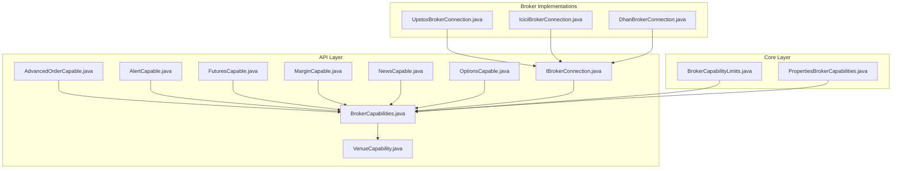
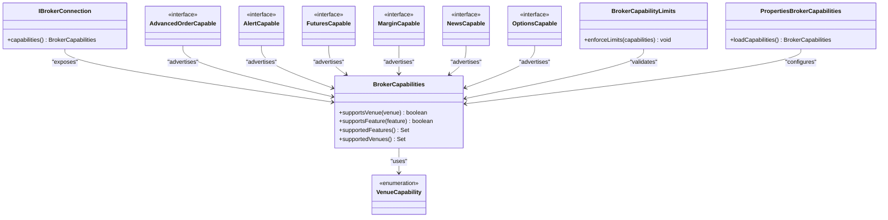
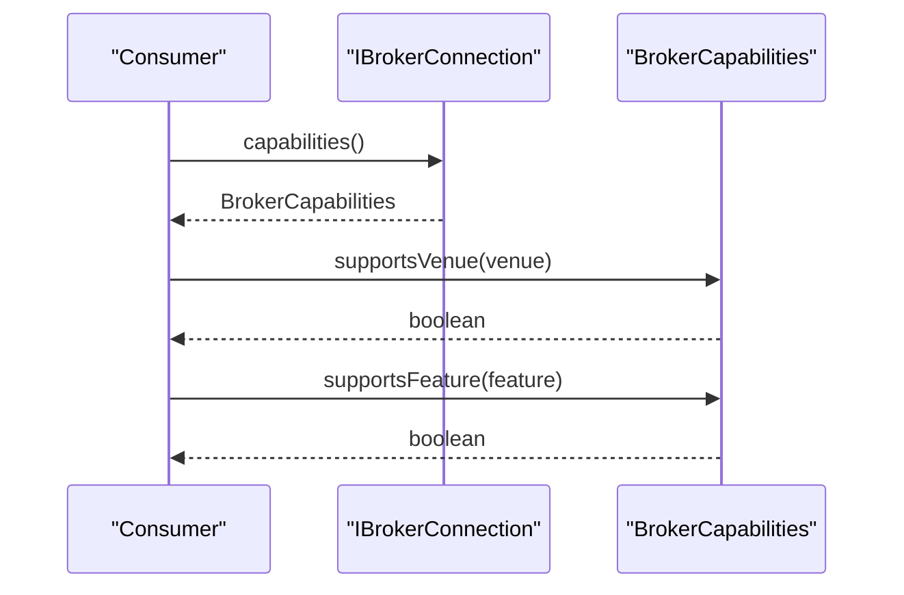
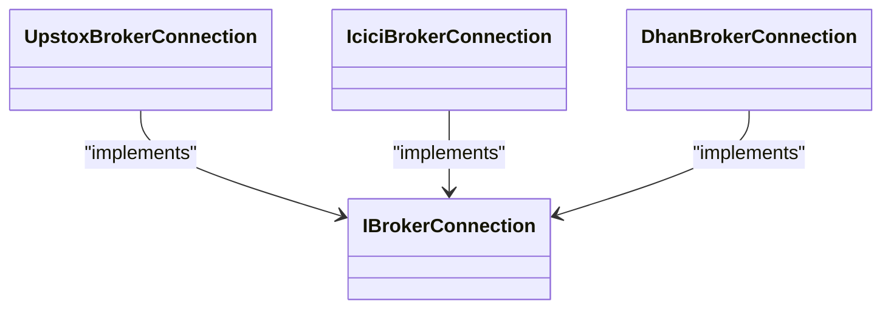
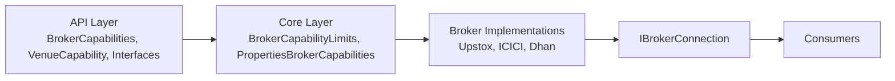

# Broker Capabilities System

<cite>
**Referenced Files in This Document**
- [BrokerCapabilities.java](file://broker/api/src/main/java/com/tradej/broker/api/model/BrokerCapabilities.java)
- [VenueCapability.java](file://broker/api/src/main/java/com/tradej/broker/api/model/VenueCapability.java)
- [AdvancedOrderCapable.java](file://broker/api/src/main/java/com/tradej/broker/api/capability/AdvancedOrderCapable.java)
- [AlertCapable.java](file://broker/api/src/main/java/com/tradej/broker/api/capability/AlertCapable.java)
- [FuturesCapable.java](file://broker/api/src/main/java/com/tradej/broker/api/capability/FuturesCapable.java)
- [MarginCapable.java](file://broker/api/src/main/java/com/tradej/broker/api/capability/MarginCapable.java)
- [NewsCapable.java](file://broker/api/src/main/java/com/tradej/broker/api/capability/NewsCapable.java)
- [OptionsCapable.java](file://broker/api/src/main/java/com/tradej/broker/api/capability/OptionsCapable.java)
- [BrokerCapabilityLimits.java](file://broker/core/src/main/java/com/tradej/broker/core/capability/BrokerCapabilityLimits.java)
- [PropertiesBrokerCapabilities.java](file://app/src/main/java/com/tradej/app/config/PropertiesBrokerCapabilities.java)
- [IBrokerConnection.java](file://broker/api/src/main/java/com/tradej/broker/api/IBrokerConnection.java)
- [DhanBrokerConnection.java](file://broker/dhan/src/main/java/com/tradej/broker/dhan/DhanBrokerConnection.java)
- [IciciBrokerConnection.java](file://broker/icici/src/main/java/com/tradej/broker/icici/IciciBrokerConnection.java)
- [UpstoxBrokerConnection.java](file://broker/upstox/src/main/java/com/tradej/broker/upstox/UpstoxBrokerConnection.java)
- [BrokerCapabilityUnitTest.java](file://broker/upstox/src/test/java/com/tradej/broker/upstox/adapter/BrokerCapabilityUnitTest.java)
</cite>

## Table of Contents
1. [Introduction](#introduction)
2. [Project Structure](#project-structure)
3. [Core Components](#core-components)
4. [Architecture Overview](#architecture-overview)
5. [Detailed Component Analysis](#detailed-component-analysis)
6. [Dependency Analysis](#dependency-analysis)
7. [Performance Considerations](#performance-considerations)
8. [Troubleshooting Guide](#troubleshooting-guide)
9. [Conclusion](#conclusion)

## Introduction
This document explains the broker capabilities system that enables capability-based design across multiple broker implementations. The system allows brokers to advertise supported features, enforce capability limits, and enable feature detection with graceful fallback strategies. It covers the BrokerCapabilities model, venue-specific capabilities, capability discovery mechanisms, and the capability interface hierarchy including MarketDataProvider, OrderCommand, PortfolioProvider, and related interfaces.

## Project Structure
The broker capabilities system spans three main areas:
- API layer: capability interfaces and models that define the contract for capability advertisement and discovery
- Core layer: capability limits enforcement and runtime configuration
- Broker implementations: Upstox, ICICI, and Dhan, each advertising their own capabilities

**Diagram sources**
- [BrokerCapabilities.java](file://broker/api/src/main/java/com/tradej/broker/api/model/BrokerCapabilities.java)
- [VenueCapability.java](file://broker/api/src/main/java/com/tradej/broker/api/model/VenueCapability.java)
- [AdvancedOrderCapable.java](file://broker/api/src/main/java/com/tradej/broker/api/capability/AdvancedOrderCapable.java)
- [AlertCapable.java](file://broker/api/src/main/java/com/tradej/broker/api/capability/AlertCapable.java)
- [FuturesCapable.java](file://broker/api/src/main/java/com/tradej/broker/api/capability/FuturesCapable.java)
- [MarginCapable.java](file://broker/api/src/main/java/com/tradej/broker/api/capability/MarginCapable.java)
- [NewsCapable.java](file://broker/api/src/main/java/com/tradej/broker/api/capability/NewsCapable.java)
- [OptionsCapable.java](file://broker/api/src/main/java/com/tradej/broker/api/capability/OptionsCapable.java)
- [BrokerCapabilityLimits.java](file://broker/core/src/main/java/com/tradej/broker/core/capability/BrokerCapabilityLimits.java)
- [PropertiesBrokerCapabilities.java](file://app/src/main/java/com/tradej/app/config/PropertiesBrokerCapabilities.java)
- [IBrokerConnection.java](file://broker/api/src/main/java/com/tradej/broker/api/IBrokerConnection.java)
- [UpstoxBrokerConnection.java](file://broker/upstox/src/main/java/com/tradej/broker/upstox/UpstoxBrokerConnection.java)
- [IciciBrokerConnection.java](file://broker/icici/src/main/java/com/tradej/broker/icici/IciciBrokerConnection.java)
- [DhanBrokerConnection.java](file://broker/dhan/src/main/java/com/tradej/broker/dhan/DhanBrokerConnection.java)

**Section sources**
- [BrokerCapabilities.java](file://broker/api/src/main/java/com/tradej/broker/api/model/BrokerCapabilities.java)
- [BrokerCapabilityLimits.java](file://broker/core/src/main/java/com/tradej/broker/core/capability/BrokerCapabilityLimits.java)
- [PropertiesBrokerCapabilities.java](file://app/src/main/java/com/tradej/app/config/PropertiesBrokerCapabilities.java)

## Core Components
This section documents the primary building blocks of the capabilities system.

- BrokerCapabilities: Central model representing a broker's advertised feature set. It encapsulates venue-specific capabilities and provides methods for capability checks and discovery.
- VenueCapability: Enumerates the venues or market segments a broker supports, enabling per-venue capability scoping.
- Capability Interfaces: Feature flags that indicate whether a broker supports advanced order types, alerts, futures, options, news, and margin features.
- BrokerCapabilityLimits: Enforces capability limits at runtime, ensuring features remain within configured bounds across implementations.
- PropertiesBrokerCapabilities: Loads capability configuration from properties for runtime behavior customization.
- IBrokerConnection: Base connection interface that exposes capabilities to consumers.

Key responsibilities:
- Advertisement: Brokers declare supported features via capability interfaces and models.
- Discovery: Consumers query BrokerCapabilities to detect feature availability.
- Enforcement: BrokerCapabilityLimits validates feature usage against configured limits.
- Configuration: PropertiesBrokerCapabilities integrates with application configuration for dynamic capability behavior.

**Section sources**
- [BrokerCapabilities.java](file://broker/api/src/main/java/com/tradej/broker/api/model/BrokerCapabilities.java)
- [VenueCapability.java](file://broker/api/src/main/java/com/tradej/broker/api/model/VenueCapability.java)
- [AdvancedOrderCapable.java](file://broker/api/src/main/java/com/tradej/broker/api/capability/AdvancedOrderCapable.java)
- [AlertCapable.java](file://broker/api/src/main/java/com/tradej/broker/api/capability/AlertCapable.java)
- [FuturesCapable.java](file://broker/api/src/main/java/com/tradej/broker/api/capability/FuturesCapable.java)
- [MarginCapable.java](file://broker/api/src/main/java/com/tradej/broker/api/capability/MarginCapable.java)
- [NewsCapable.java](file://broker/api/src/main/java/com/tradej/broker/api/capability/NewsCapable.java)
- [OptionsCapable.java](file://broker/api/src/main/java/com/tradej/broker/api/capability/OptionsCapable.java)
- [BrokerCapabilityLimits.java](file://broker/core/src/main/java/com/tradej/broker/core/capability/BrokerCapabilityLimits.java)
- [PropertiesBrokerCapabilities.java](file://app/src/main/java/com/tradej/app/config/PropertiesBrokerCapabilities.java)
- [IBrokerConnection.java](file://broker/api/src/main/java/com/tradej/broker/api/IBrokerConnection.java)

## Architecture Overview
The capabilities system follows a capability-based design pattern:
- Brokers implement capability interfaces and populate BrokerCapabilities with supported features.
- Consumers depend on IBrokerConnection to discover capabilities and adapt behavior accordingly.
- BrokerCapabilityLimits enforces constraints, while PropertiesBrokerCapabilities provides configuration-driven behavior.

**Diagram sources**
- [IBrokerConnection.java](file://broker/api/src/main/java/com/tradej/broker/api/IBrokerConnection.java)
- [BrokerCapabilities.java](file://broker/api/src/main/java/com/tradej/broker/api/model/BrokerCapabilities.java)
- [VenueCapability.java](file://broker/api/src/main/java/com/tradej/broker/api/model/VenueCapability.java)
- [AdvancedOrderCapable.java](file://broker/api/src/main/java/com/tradej/broker/api/capability/AdvancedOrderCapable.java)
- [AlertCapable.java](file://broker/api/src/main/java/com/tradej/broker/api/capability/AlertCapable.java)
- [FuturesCapable.java](file://broker/api/src/main/java/com/tradej/broker/api/capability/FuturesCapable.java)
- [MarginCapable.java](file://broker/api/src/main/java/com/tradej/broker/api/capability/MarginCapable.java)
- [NewsCapable.java](file://broker/api/src/main/java/com/tradej/broker/api/capability/NewsCapable.java)
- [OptionsCapable.java](file://broker/api/src/main/java/com/tradej/broker/api/capability/OptionsCapable.java)
- [BrokerCapabilityLimits.java](file://broker/core/src/main/java/com/tradej/broker/core/capability/BrokerCapabilityLimits.java)
- [PropertiesBrokerCapabilities.java](file://app/src/main/java/com/tradej/app/config/PropertiesBrokerCapabilities.java)

## Detailed Component Analysis

### BrokerCapabilities Model
BrokerCapabilities is the central model that:
- Encapsulates supported venues and features
- Provides capability discovery APIs for consumers
- Enables feature checks and venue scoping

Implementation highlights:
- Methods to check venue support and feature availability
- Aggregation of capability flags from various capability interfaces
- Integration with VenueCapability for per-venue feature scoping

Usage patterns:
- Consumers call capability discovery methods to determine feature availability
- Venue-scoped checks ensure features apply only to supported markets

**Section sources**
- [BrokerCapabilities.java](file://broker/api/src/main/java/com/tradej/broker/api/model/BrokerCapabilities.java)

### VenueCapability Enumeration
VenueCapability enumerates supported venues or market segments. This enables:
- Per-venue capability scoping
- Feature availability tied to specific exchanges or markets

Behavior:
- Used by BrokerCapabilities to filter and validate features by venue
- Supports discovery and enforcement of venue-specific capabilities

**Section sources**
- [VenueCapability.java](file://broker/api/src/main/java/com/tradej/broker/api/model/VenueCapability.java)

### Capability Interface Hierarchy
The capability interfaces define feature flags that brokers implement to advertise support:
- AdvancedOrderCapable: Advanced order types
- AlertCapable: Alert notifications
- FuturesCapable: Futures instruments
- MarginCapable: Margin features
- NewsCapable: News feeds
- OptionsCapable: Options instruments

Design pattern:
- Marker interfaces that brokers implement alongside BrokerCapabilities
- Enable capability-based feature detection and graceful fallback

**Section sources**
- [AdvancedOrderCapable.java](file://broker/api/src/main/java/com/tradej/broker/api/capability/AdvancedOrderCapable.java)
- [AlertCapable.java](file://broker/api/src/main/java/com/tradej/broker/api/capability/AlertCapable.java)
- [FuturesCapable.java](file://broker/api/src/main/java/com/tradej/broker/api/capability/FuturesCapable.java)
- [MarginCapable.java](file://broker/api/src/main/java/com/tradej/broker/api/capability/MarginCapable.java)
- [NewsCapable.java](file://broker/api/src/main/java/com/tradej/broker/api/capability/NewsCapable.java)
- [OptionsCapable.java](file://broker/api/src/main/java/com/tradej/broker/api/capability/OptionsCapable.java)

### Capability Limits Enforcement
BrokerCapabilityLimits enforces runtime constraints on capabilities:
- Validates that advertised features remain within configured limits
- Prevents misuse or overuse of capabilities across implementations

Integration:
- Consumes BrokerCapabilities to evaluate current feature set
- Applies configured limits from PropertiesBrokerCapabilities

**Section sources**
- [BrokerCapabilityLimits.java](file://broker/core/src/main/java/com/tradej/broker/core/capability/BrokerCapabilityLimits.java)

### Capability Discovery Mechanisms
Capability discovery is exposed through IBrokerConnection:
- Consumers query IBrokerConnection.capabilities() to obtain BrokerCapabilities
- Broker implementations populate capabilities during initialization
- Venue-specific and feature-specific checks enable targeted behavior

**Diagram sources**
- [IBrokerConnection.java](file://broker/api/src/main/java/com/tradej/broker/api/IBrokerConnection.java)
- [BrokerCapabilities.java](file://broker/api/src/main/java/com/tradej/broker/api/model/BrokerCapabilities.java)

### Venue-Specific Capabilities
VenueCapability enables per-venue feature scoping:
- Features may be available on specific venues only
- BrokerCapabilities filters features based on supported venues
- Ensures compliance with exchange-specific limitations

**Section sources**
- [VenueCapability.java](file://broker/api/src/main/java/com/tradej/broker/api/model/VenueCapability.java)
- [BrokerCapabilities.java](file://broker/api/src/main/java/com/tradej/broker/api/model/BrokerCapabilities.java)

### Capability Configuration via Properties
PropertiesBrokerCapabilities loads capability configuration from application properties:
- Integrates with runtime configuration for dynamic behavior
- Allows operators to adjust capability behavior without code changes

**Section sources**
- [PropertiesBrokerCapabilities.java](file://app/src/main/java/com/tradej/app/config/PropertiesBrokerCapabilities.java)

### Broker Implementation Examples
Broker implementations (Upstox, ICICI, Dhan) demonstrate capability advertisement:
- Each broker implements capability interfaces and populates BrokerCapabilities
- They expose capabilities via IBrokerConnection
- Tests validate capability advertisement and discovery

**Diagram sources**
- [UpstoxBrokerConnection.java](file://broker/upstox/src/main/java/com/tradej/broker/upstox/UpstoxBrokerConnection.java)
- [IciciBrokerConnection.java](file://broker/icici/src/main/java/com/tradej/broker/icici/IciciBrokerConnection.java)
- [DhanBrokerConnection.java](file://broker/dhan/src/main/java/com/tradej/broker/dhan/DhanBrokerConnection.java)
- [IBrokerConnection.java](file://broker/api/src/main/java/com/tradej/broker/api/IBrokerConnection.java)

**Section sources**
- [BrokerCapabilityUnitTest.java](file://broker/upstox/src/test/java/com/tradej/broker/upstox/adapter/BrokerCapabilityUnitTest.java)

## Dependency Analysis
The capability system exhibits low coupling and high cohesion:
- API layer defines contracts; core layer enforces limits; implementations advertise capabilities
- Capability interfaces decouple feature flags from implementations
- VenueCapability centralizes venue enumeration for consistent scoping

**Diagram sources**
- [BrokerCapabilities.java](file://broker/api/src/main/java/com/tradej/broker/api/model/BrokerCapabilities.java)
- [VenueCapability.java](file://broker/api/src/main/java/com/tradej/broker/api/model/VenueCapability.java)
- [BrokerCapabilityLimits.java](file://broker/core/src/main/java/com/tradej/broker/core/capability/BrokerCapabilityLimits.java)
- [PropertiesBrokerCapabilities.java](file://app/src/main/java/com/tradej/app/config/PropertiesBrokerCapabilities.java)
- [IBrokerConnection.java](file://broker/api/src/main/java/com/tradej/broker/api/IBrokerConnection.java)
- [UpstoxBrokerConnection.java](file://broker/upstox/src/main/java/com/tradej/broker/upstox/UpstoxBrokerConnection.java)
- [IciciBrokerConnection.java](file://broker/icici/src/main/java/com/tradej/broker/icici/IciciBrokerConnection.java)
- [DhanBrokerConnection.java](file://broker/dhan/src/main/java/com/tradej/broker/dhan/DhanBrokerConnection.java)

**Section sources**
- [BrokerCapabilities.java](file://broker/api/src/main/java/com/tradej/broker/api/model/BrokerCapabilities.java)
- [BrokerCapabilityLimits.java](file://broker/core/src/main/java/com/tradej/broker/core/capability/BrokerCapabilityLimits.java)
- [PropertiesBrokerCapabilities.java](file://app/src/main/java/com/tradej/app/config/PropertiesBrokerCapabilities.java)

## Performance Considerations
- Capability checks are lightweight method calls on BrokerCapabilities
- Venue filtering reduces unnecessary feature evaluations
- Capability limits enforcement should be invoked sparingly to avoid overhead
- Prefer caching capability queries in hot paths to minimize repeated lookups

## Troubleshooting Guide
Common scenarios and resolutions:
- Unsupported feature detected: Use capability discovery to check support before invoking feature-specific logic; fall back to basic functionality when unsupported.
- Venue mismatch: Verify VenueCapability matches the target market; ensure BrokerCapabilities reflects correct venue support.
- Capability limit exceeded: Review BrokerCapabilityLimits configuration and adjust limits or feature usage accordingly.
- Configuration drift: Validate PropertiesBrokerCapabilities settings to ensure runtime behavior aligns with expectations.

**Section sources**
- [BrokerCapabilityLimits.java](file://broker/core/src/main/java/com/tradej/broker/core/capability/BrokerCapabilityLimits.java)
- [PropertiesBrokerCapabilities.java](file://app/src/main/java/com/tradej/app/config/PropertiesBrokerCapabilities.java)

## Conclusion
The broker capabilities system enables a robust, capability-based design that lets brokers advertise supported features, consumers detect capabilities safely, and limits enforce operational constraints. By leveraging VenueCapability scoping, capability interfaces, and runtime configuration, the system supports graceful fallback and consistent behavior across diverse broker implementations.